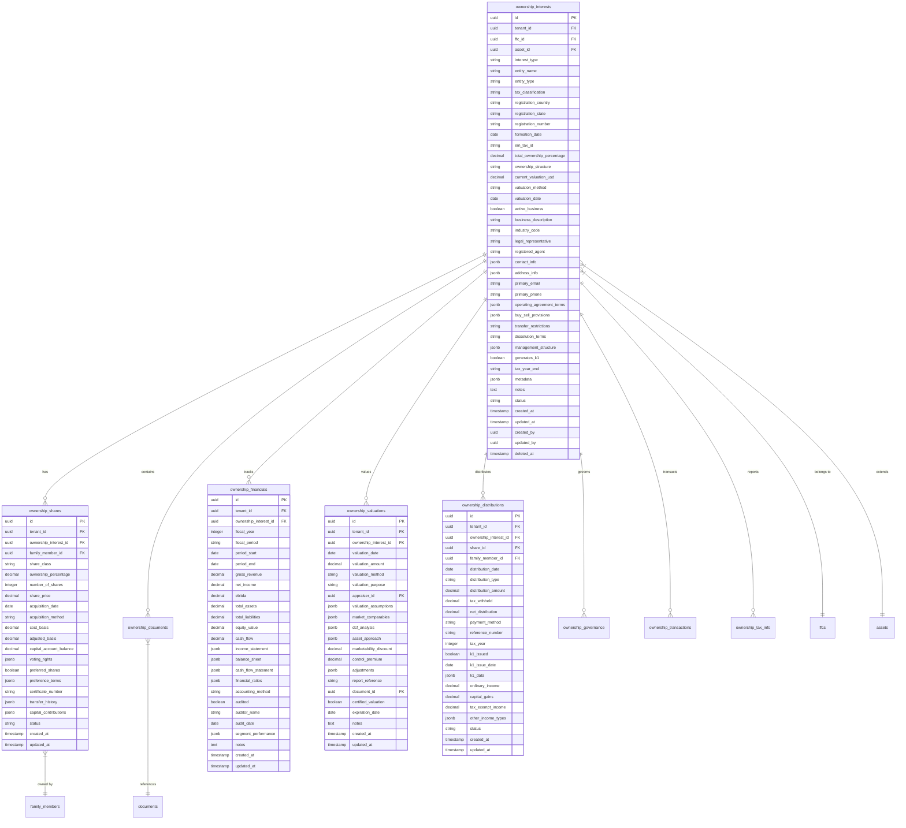

# Forward Inheritance Platform - Technical Architecture

**Document Type:** Technical Architecture Document  
**Version:** 1.0  
**Date:** December 2024  
**Author:** Winston (BMad Architect)  
**Status:** In Progress

---

## Table of Contents

1. [Overview](#overview)
2. [Core Architecture Principles](#core-architecture-principles)
3. [User Management & Authentication](#user-management--authentication)
4. [Database Architecture](#database-architecture)
5. [Asset Table Designs](#asset-table-designs)
6. [Integration Architecture](#integration-architecture)
7. [Security Architecture](#security-architecture)
8. [PII Protection & Data Classification](#pii-protection--data-classification)
9. [Performance & Scalability](#performance--scalability)

---

## Overview

The Forward Inheritance platform is a family-first wealth management and estate planning SaaS solution designed to support millions of families in transparent wealth transfer and collaborative financial planning.

### Key Architectural Requirements

- **Multi-tenant SaaS**: Row-level security with tenant isolation
- **Stored Procedure Only**: All database operations through stored procedures
- **PII Protection**: Dual storage with encrypted original and masked versions
- **Event-Driven**: Real-time updates via webhooks and event streaming
- **API-First**: RESTful APIs with potential GraphQL layer
- **Cloud-Native**: AWS-based infrastructure with auto-scaling
- **Rich Media Support**: Family pictures for FFCs and profile pictures for personas with S3 storage

---

## Core Architecture Principles

### 1. Security First
- All data encrypted at rest and in transit
- Row-level security (RLS) for multi-tenancy
- Stored procedures for all database access
- Comprehensive audit logging
- PII detection and masking pipeline

### 2. Scalability by Design
- Horizontal scaling capabilities
- Event-driven architecture
- Caching strategies (Redis)
- Database partitioning for time-series data
- Microservices-ready architecture

### 3. Data Integrity
- Referential integrity enforced
- Transactional consistency
- Event sourcing for critical operations
- Immutable audit trails

### 4. Integration Ready
- Webhook infrastructure
- OAuth 2.0 framework
- Rate limiting and throttling
- Async job processing

---

## User Management & Authentication

The user management and authentication system provides comprehensive security, multi-tenancy support, and granular access control for the Forward Inheritance platform. This system enforces strict tenant isolation while supporting users who may belong to multiple Family Financial Circles (FFCs).

### Core Requirements

- **Multi-Tenant Security**: Users can belong to multiple FFCs with strict data isolation
- **Row-Level Security (RLS)**: All data access filtered by FFC membership
- **Zero Cross-Tenant Leakage**: Complete data segregation between FFCs
- **Comprehensive Audit Trails**: All authentication and authorization events logged
- **Strong Security Standards**: Industry-standard password policies and MFA
- **Session Management**: Multi-device support with secure session handling

### User Management Tables

#### 1. Core Users Table
```sql
CREATE TABLE users (
    id UUID PRIMARY KEY DEFAULT gen_random_uuid(),
    
    -- Normalized contact references
    primary_email_id UUID REFERENCES email_address(id),
    primary_phone_id UUID REFERENCES phone_number(id),
    
    -- Email/Phone verification status tracked here for authentication
    email_verified BOOLEAN DEFAULT FALSE,
    email_verified_at TIMESTAMP WITH TIME ZONE,
    phone_verified BOOLEAN DEFAULT FALSE,
    phone_verified_at TIMESTAMP WITH TIME ZONE,
    
    -- Authentication
    password_hash VARCHAR(255) NOT NULL,
    password_salt VARCHAR(255) NOT NULL,
    password_last_changed TIMESTAMP WITH TIME ZONE DEFAULT NOW(),
    must_change_password BOOLEAN DEFAULT FALSE,
    
    -- Account Security
    failed_login_attempts INTEGER DEFAULT 0,
    account_locked BOOLEAN DEFAULT FALSE,
    account_locked_until TIMESTAMP WITH TIME ZONE,
    last_login_at TIMESTAMP WITH TIME ZONE,
    last_login_ip INET,
    
    -- Profile Information
    first_name VARCHAR(100) NOT NULL,
    last_name VARCHAR(100) NOT NULL,
    display_name VARCHAR(200),
    
    -- System Fields
    status VARCHAR(50) NOT NULL DEFAULT 'pending_verification',
    created_at TIMESTAMP WITH TIME ZONE DEFAULT NOW(),
    updated_at TIMESTAMP WITH TIME ZONE DEFAULT NOW(),
    created_by UUID REFERENCES users(id),
    updated_by UUID REFERENCES users(id)
);

-- Indexes
CREATE INDEX idx_users_email ON users(email);
CREATE INDEX idx_users_status ON users(status);
CREATE INDEX idx_users_account_locked ON users(account_locked);
CREATE INDEX idx_users_email_verified ON users(email_verified);
```

#### 2. User Sessions Table
```sql
CREATE TABLE user_sessions (
    id UUID PRIMARY KEY DEFAULT gen_random_uuid(),
    user_id UUID NOT NULL REFERENCES users(id) ON DELETE CASCADE,
    session_token VARCHAR(255) UNIQUE NOT NULL,
    refresh_token VARCHAR(255) UNIQUE,
    
    -- Session Details
    device_fingerprint VARCHAR(255),
    device_name VARCHAR(100),
    user_agent TEXT,
    ip_address INET NOT NULL,
    
    -- Normalized geographic reference
    geographic_location_id UUID REFERENCES geographic_locations(id),
    
    -- Session Management
    expires_at TIMESTAMP WITH TIME ZONE NOT NULL,
    last_activity TIMESTAMP WITH TIME ZONE DEFAULT NOW(),
    is_active BOOLEAN DEFAULT TRUE,
    
    -- System Fields
    created_at TIMESTAMP WITH TIME ZONE DEFAULT NOW(),
    updated_at TIMESTAMP WITH TIME ZONE DEFAULT NOW()
);

-- Indexes
CREATE INDEX idx_user_sessions_user_id ON user_sessions(user_id);
CREATE INDEX idx_user_sessions_token ON user_sessions(session_token);
CREATE INDEX idx_user_sessions_expires_at ON user_sessions(expires_at);
CREATE INDEX idx_user_sessions_active ON user_sessions(is_active);
CREATE INDEX idx_user_sessions_last_activity ON user_sessions(last_activity);
```

#### 3. User Roles Table
```sql
CREATE TABLE user_roles (
    id UUID PRIMARY KEY DEFAULT gen_random_uuid(),
    name VARCHAR(100) UNIQUE NOT NULL,
    display_name VARCHAR(200) NOT NULL,
    description TEXT,
    
    -- Role Hierarchy
    parent_role_id UUID REFERENCES user_roles(id),
    hierarchy_level INTEGER DEFAULT 0,
    
    -- System vs Custom Roles
    is_system_role BOOLEAN DEFAULT FALSE,
    is_default_role BOOLEAN DEFAULT FALSE,
    
    -- System Fields
    status VARCHAR(50) NOT NULL DEFAULT 'active',
    created_at TIMESTAMP WITH TIME ZONE DEFAULT NOW(),
    updated_at TIMESTAMP WITH TIME ZONE DEFAULT NOW(),
    created_by UUID REFERENCES users(id),
    updated_by UUID REFERENCES users(id)
);

-- Default System Roles
INSERT INTO user_roles (name, display_name, description, is_system_role, is_default_role) VALUES
('platform_admin', 'Platform Administrator', 'Full platform access across all FFCs', TRUE, FALSE),
('ffc_owner', 'FFC Owner', 'Full control within specific FFC', TRUE, FALSE),
('ffc_admin', 'FFC Administrator', 'Administrative access within specific FFC', TRUE, FALSE),
('ffc_member', 'FFC Member', 'Standard member access within specific FFC', TRUE, TRUE),
('ffc_viewer', 'FFC Viewer', 'Read-only access within specific FFC', TRUE, FALSE);

-- Indexes
CREATE INDEX idx_user_roles_name ON user_roles(name);
CREATE INDEX idx_user_roles_status ON user_roles(status);
CREATE INDEX idx_user_roles_system ON user_roles(is_system_role);
```

#### 4. User Permissions Table
```sql
CREATE TABLE user_permissions (
    id UUID PRIMARY KEY DEFAULT gen_random_uuid(),
    name VARCHAR(100) UNIQUE NOT NULL,
    display_name VARCHAR(200) NOT NULL,
    description TEXT,
    
    -- Permission Categories
    category VARCHAR(100) NOT NULL, -- 'asset', 'user', 'admin', 'integration'
    subcategory VARCHAR(100),
    
    -- Permission Details
    resource_type VARCHAR(100), -- 'real_estate', 'financial_account', etc.
    action VARCHAR(50) NOT NULL, -- 'create', 'read', 'update', 'delete', 'execute'
    
    -- System Permission
    is_system_permission BOOLEAN DEFAULT FALSE,
    
    -- System Fields
    status VARCHAR(50) NOT NULL DEFAULT 'active',
    created_at TIMESTAMP WITH TIME ZONE DEFAULT NOW(),
    updated_at TIMESTAMP WITH TIME ZONE DEFAULT NOW()
);

-- Indexes
CREATE INDEX idx_user_permissions_name ON user_permissions(name);
CREATE INDEX idx_user_permissions_category ON user_permissions(category);
CREATE INDEX idx_user_permissions_resource_action ON user_permissions(resource_type, action);
```

#### Role Permissions Junction Table
```sql
CREATE TABLE role_permissions (
    id UUID PRIMARY KEY DEFAULT gen_random_uuid(),
    role_id UUID NOT NULL REFERENCES user_roles(id) ON DELETE CASCADE,
    permission_id UUID NOT NULL REFERENCES user_permissions(id) ON DELETE CASCADE,
    
    -- Grant Details
    granted_by UUID NOT NULL REFERENCES users(id),
    granted_at TIMESTAMP WITH TIME ZONE DEFAULT NOW(),
    
    -- System Fields
    created_at TIMESTAMP WITH TIME ZONE DEFAULT NOW(),
    
    UNIQUE(role_id, permission_id)
);

-- Indexes
CREATE INDEX idx_role_permissions_role ON role_permissions(role_id);
CREATE INDEX idx_role_permissions_permission ON role_permissions(permission_id);
```

#### 5. User Role Assignments Table
```sql
CREATE TABLE user_role_assignments (
    id UUID PRIMARY KEY DEFAULT gen_random_uuid(),
    user_id UUID NOT NULL REFERENCES users(id) ON DELETE CASCADE,
    role_id UUID NOT NULL REFERENCES user_roles(id) ON DELETE CASCADE,
    
    -- Multi-Tenant Context
    ffc_id UUID NOT NULL REFERENCES family_financial_circles(id) ON DELETE CASCADE,
    
    -- Assignment Details
    assigned_by UUID NOT NULL REFERENCES users(id),
    assigned_at TIMESTAMP WITH TIME ZONE DEFAULT NOW(),
    expires_at TIMESTAMP WITH TIME ZONE,
    
    -- Status
    is_active BOOLEAN DEFAULT TRUE,
    
    -- System Fields
    created_at TIMESTAMP WITH TIME ZONE DEFAULT NOW(),
    updated_at TIMESTAMP WITH TIME ZONE DEFAULT NOW(),
    
    UNIQUE(user_id, role_id, ffc_id)
);

-- Indexes
CREATE INDEX idx_user_role_assignments_user_ffc ON user_role_assignments(user_id, ffc_id);
CREATE INDEX idx_user_role_assignments_role ON user_role_assignments(role_id);
CREATE INDEX idx_user_role_assignments_active ON user_role_assignments(is_active);
CREATE INDEX idx_user_role_assignments_expires ON user_role_assignments(expires_at);
```

#### 6. User MFA Settings Table
```sql
CREATE TABLE user_mfa_settings (
    id UUID PRIMARY KEY DEFAULT gen_random_uuid(),
    user_id UUID NOT NULL REFERENCES users(id) ON DELETE CASCADE,
    
    -- MFA Configuration
    is_enabled BOOLEAN DEFAULT FALSE,
    backup_codes_generated BOOLEAN DEFAULT FALSE,
    
    -- TOTP Settings
    totp_secret VARCHAR(255),
    totp_enabled BOOLEAN DEFAULT FALSE,
    totp_last_used_at TIMESTAMP WITH TIME ZONE,
    
    -- SMS Settings
    sms_phone_id UUID REFERENCES phone_number(id),
    sms_enabled BOOLEAN DEFAULT FALSE,
    sms_last_sent_at TIMESTAMP WITH TIME ZONE,
    
    -- Email Settings
    email_enabled BOOLEAN DEFAULT FALSE,
    email_last_sent_at TIMESTAMP WITH TIME ZONE,
    
    -- Recovery
    backup_codes TEXT[], -- Encrypted array of backup codes
    backup_codes_used INTEGER DEFAULT 0,
    
    -- System Fields
    created_at TIMESTAMP WITH TIME ZONE DEFAULT NOW(),
    updated_at TIMESTAMP WITH TIME ZONE DEFAULT NOW(),
    
    UNIQUE(user_id)
);

-- Indexes
CREATE INDEX idx_user_mfa_settings_user_id ON user_mfa_settings(user_id);
CREATE INDEX idx_user_mfa_settings_enabled ON user_mfa_settings(is_enabled);
```

#### 7. User Login History Table
```sql
CREATE TABLE user_login_history (
    id UUID PRIMARY KEY DEFAULT gen_random_uuid(),
    user_id UUID NOT NULL REFERENCES users(id) ON DELETE CASCADE,
    session_id UUID REFERENCES user_sessions(id) ON DELETE SET NULL,
    
    -- Login Details
    login_type VARCHAR(50) NOT NULL, -- 'password', 'mfa', 'sso', 'recovery'
    login_status VARCHAR(50) NOT NULL, -- 'success', 'failed', 'blocked'
    failure_reason VARCHAR(100), -- 'invalid_password', 'account_locked', etc.
    
    -- Request Information
    ip_address INET NOT NULL,
    user_agent TEXT,
    device_fingerprint VARCHAR(255),
    
    -- Normalized geographic reference
    geographic_location_id UUID REFERENCES geographic_locations(id),
    
    -- Risk Assessment
    risk_score INTEGER, -- 0-100 scale
    risk_factors TEXT[], -- Array of detected risk factors
    
    -- System Fields
    created_at TIMESTAMP WITH TIME ZONE DEFAULT NOW()
);

-- Indexes
CREATE INDEX idx_user_login_history_user_id ON user_login_history(user_id);
CREATE INDEX idx_user_login_history_created_at ON user_login_history(created_at);
CREATE INDEX idx_user_login_history_status ON user_login_history(login_status);
CREATE INDEX idx_user_login_history_ip ON user_login_history(ip_address);
```

#### 8. Password Reset Tokens Table
```sql
CREATE TABLE password_reset_tokens (
    id UUID PRIMARY KEY DEFAULT gen_random_uuid(),
    user_id UUID NOT NULL REFERENCES users(id) ON DELETE CASCADE,
    
    -- Token Details
    token VARCHAR(255) UNIQUE NOT NULL,
    token_hash VARCHAR(255) NOT NULL, -- Hashed version for security
    
    -- Request Information
    requested_ip INET NOT NULL,
    requested_user_agent TEXT,
    
    -- Token Status
    expires_at TIMESTAMP WITH TIME ZONE NOT NULL,
    used_at TIMESTAMP WITH TIME ZONE,
    is_used BOOLEAN DEFAULT FALSE,
    
    -- System Fields
    created_at TIMESTAMP WITH TIME ZONE DEFAULT NOW()
);

-- Indexes
CREATE INDEX idx_password_reset_tokens_token ON password_reset_tokens(token);
CREATE INDEX idx_password_reset_tokens_user_id ON password_reset_tokens(user_id);
CREATE INDEX idx_password_reset_tokens_expires ON password_reset_tokens(expires_at);
CREATE UNIQUE INDEX idx_password_reset_tokens_active ON password_reset_tokens(user_id) 
    WHERE is_used = FALSE;
```

### Multi-Tenancy Implementation

#### Row-Level Security (RLS) Policies
```sql
-- Enable RLS on all tenant-specific tables
ALTER TABLE family_financial_circles ENABLE ROW LEVEL SECURITY;
ALTER TABLE assets ENABLE ROW LEVEL SECURITY;
ALTER TABLE user_role_assignments ENABLE ROW LEVEL SECURITY;

-- Example RLS policy for assets table
CREATE POLICY assets_ffc_isolation ON assets
    FOR ALL
    TO authenticated_users
    USING (
        ffc_id IN (
            SELECT ffc_id 
            FROM user_role_assignments 
            WHERE user_id = current_setting('app.current_user_id')::UUID 
            AND is_active = TRUE
        )
    );

-- Policy for user role assignments
CREATE POLICY user_role_assignments_isolation ON user_role_assignments
    FOR ALL
    TO authenticated_users
    USING (
        user_id = current_setting('app.current_user_id')::UUID 
        OR 
        ffc_id IN (
            SELECT ffc_id 
            FROM user_role_assignments ura2
            WHERE ura2.user_id = current_setting('app.current_user_id')::UUID 
            AND ura2.is_active = TRUE
            AND EXISTS (
                SELECT 1 FROM user_roles ur 
                WHERE ur.id = ura2.role_id 
                AND ur.name IN ('ffc_owner', 'ffc_admin', 'platform_admin')
            )
        )
    );
```

### Core Stored Procedures

#### 1. User Authentication
```sql
CREATE OR REPLACE FUNCTION authenticate_user(
    p_email VARCHAR(255),
    p_password VARCHAR(255),
    p_ip_address INET,
    p_user_agent TEXT DEFAULT NULL,
    p_device_fingerprint VARCHAR(255) DEFAULT NULL
)
RETURNS TABLE (
    success BOOLEAN,
    user_id UUID,
    session_token VARCHAR(255),
    refresh_token VARCHAR(255),
    mfa_required BOOLEAN,
    error_message TEXT
) AS $$
DECLARE
    v_user_record RECORD;
    v_session_id UUID;
    v_session_token VARCHAR(255);
    v_refresh_token VARCHAR(255);
    v_password_valid BOOLEAN;
    v_account_locked BOOLEAN;
BEGIN
    -- Get user record
    SELECT * INTO v_user_record
    FROM users 
    WHERE email = p_email AND status = 'active';
    
    -- Log login attempt
    INSERT INTO user_login_history (
        user_id, login_type, login_status, ip_address, user_agent, device_fingerprint
    ) VALUES (
        v_user_record.id, 'password', 
        CASE WHEN v_user_record.id IS NULL THEN 'failed' ELSE 'pending' END,
        p_ip_address, p_user_agent, p_device_fingerprint
    );
    
    -- Check if user exists
    IF v_user_record.id IS NULL THEN
        RETURN QUERY SELECT FALSE, NULL::UUID, NULL::VARCHAR, NULL::VARCHAR, FALSE, 'Invalid credentials';
        RETURN;
    END IF;
    
    -- Check account lock status
    IF v_user_record.account_locked AND 
       (v_user_record.account_locked_until IS NULL OR v_user_record.account_locked_until > NOW()) THEN
        UPDATE user_login_history 
        SET login_status = 'blocked', failure_reason = 'account_locked'
        WHERE user_id = v_user_record.id AND created_at = (
            SELECT MAX(created_at) FROM user_login_history WHERE user_id = v_user_record.id
        );
        
        RETURN QUERY SELECT FALSE, NULL::UUID, NULL::VARCHAR, NULL::VARCHAR, FALSE, 'Account locked';
        RETURN;
    END IF;
    
    -- Verify password
    v_password_valid := crypt(p_password, v_user_record.password_hash) = v_user_record.password_hash;
    
    IF NOT v_password_valid THEN
        -- Increment failed attempts
        UPDATE users 
        SET failed_login_attempts = failed_login_attempts + 1,
            account_locked = CASE WHEN failed_login_attempts + 1 >= 5 THEN TRUE ELSE FALSE END,
            account_locked_until = CASE WHEN failed_login_attempts + 1 >= 5 THEN NOW() + INTERVAL '15 minutes' ELSE NULL END
        WHERE id = v_user_record.id;
        
        UPDATE user_login_history 
        SET login_status = 'failed', failure_reason = 'invalid_password'
        WHERE user_id = v_user_record.id AND created_at = (
            SELECT MAX(created_at) FROM user_login_history WHERE user_id = v_user_record.id
        );
        
        RETURN QUERY SELECT FALSE, NULL::UUID, NULL::VARCHAR, NULL::VARCHAR, FALSE, 'Invalid credentials';
        RETURN;
    END IF;
    
    -- Check if MFA is required
    IF EXISTS (SELECT 1 FROM user_mfa_settings WHERE user_id = v_user_record.id AND is_enabled = TRUE) THEN
        -- Update login history for MFA requirement
        UPDATE user_login_history 
        SET login_status = 'mfa_required'
        WHERE user_id = v_user_record.id AND created_at = (
            SELECT MAX(created_at) FROM user_login_history WHERE user_id = v_user_record.id
        );
        
        RETURN QUERY SELECT TRUE, v_user_record.id, NULL::VARCHAR, NULL::VARCHAR, TRUE, NULL;
        RETURN;
    END IF;
    
    -- Create session
    SELECT * INTO v_session_id, v_session_token, v_refresh_token
    FROM create_user_session(v_user_record.id, p_ip_address, p_user_agent, p_device_fingerprint);
    
    -- Reset failed login attempts
    UPDATE users 
    SET failed_login_attempts = 0,
        account_locked = FALSE,
        account_locked_until = NULL,
        last_login_at = NOW(),
        last_login_ip = p_ip_address
    WHERE id = v_user_record.id;
    
    -- Update login history
    UPDATE user_login_history 
    SET login_status = 'success', session_id = v_session_id
    WHERE user_id = v_user_record.id AND created_at = (
        SELECT MAX(created_at) FROM user_login_history WHERE user_id = v_user_record.id
    );
    
    RETURN QUERY SELECT TRUE, v_user_record.id, v_session_token, v_refresh_token, FALSE, NULL;
END;
$$ LANGUAGE plpgsql SECURITY DEFINER;
```

#### 2. Session Management
```sql
CREATE OR REPLACE FUNCTION create_user_session(
    p_user_id UUID,
    p_ip_address INET,
    p_user_agent TEXT DEFAULT NULL,
    p_device_fingerprint VARCHAR(255) DEFAULT NULL,
    p_device_name VARCHAR(100) DEFAULT NULL
)
RETURNS TABLE (
    session_id UUID,
    session_token VARCHAR(255),
    refresh_token VARCHAR(255)
) AS $$
DECLARE
    v_session_id UUID;
    v_session_token VARCHAR(255);
    v_refresh_token VARCHAR(255);
BEGIN
    -- Generate tokens
    v_session_id := gen_random_uuid();
    v_session_token := encode(gen_random_bytes(32), 'base64');
    v_refresh_token := encode(gen_random_bytes(32), 'base64');
    
    -- Clean up old sessions (keep only 5 most recent per user)
    DELETE FROM user_sessions 
    WHERE user_id = p_user_id 
    AND id NOT IN (
        SELECT id FROM user_sessions 
        WHERE user_id = p_user_id 
        ORDER BY created_at DESC 
        LIMIT 4
    );
    
    -- Create new session
    INSERT INTO user_sessions (
        id, user_id, session_token, refresh_token,
        device_fingerprint, device_name, user_agent, ip_address,
        expires_at
    ) VALUES (
        v_session_id, p_user_id, v_session_token, v_refresh_token,
        p_device_fingerprint, p_device_name, p_user_agent, p_ip_address,
        NOW() + INTERVAL '24 hours'
    );
    
    RETURN QUERY SELECT v_session_id, v_session_token, v_refresh_token;
END;
$$ LANGUAGE plpgsql SECURITY DEFINER;
```

#### 3. Permission Verification
```sql
CREATE OR REPLACE FUNCTION verify_user_permissions(
    p_user_id UUID,
    p_ffc_id UUID,
    p_permission_name VARCHAR(100)
)
RETURNS BOOLEAN AS $$
DECLARE
    v_has_permission BOOLEAN := FALSE;
BEGIN
    -- Check if user has the permission through role assignments
    SELECT TRUE INTO v_has_permission
    FROM user_role_assignments ura
    JOIN user_roles ur ON ur.id = ura.role_id
    JOIN role_permissions rp ON rp.role_id = ur.id
    JOIN user_permissions up ON up.id = rp.permission_id
    WHERE ura.user_id = p_user_id
    AND ura.ffc_id = p_ffc_id
    AND ura.is_active = TRUE
    AND (ura.expires_at IS NULL OR ura.expires_at > NOW())
    AND ur.status = 'active'
    AND up.name = p_permission_name
    AND up.status = 'active'
    LIMIT 1;
    
    RETURN COALESCE(v_has_permission, FALSE);
END;
$$ LANGUAGE plpgsql SECURITY DEFINER;
```

#### 4. Password Reset Workflow
```sql
CREATE OR REPLACE FUNCTION reset_user_password(
    p_email VARCHAR(255),
    p_ip_address INET,
    p_user_agent TEXT DEFAULT NULL
)
RETURNS TABLE (
    success BOOLEAN,
    token_id UUID,
    error_message TEXT
) AS $$
DECLARE
    v_user_id UUID;
    v_token_id UUID;
    v_token VARCHAR(255);
    v_token_hash VARCHAR(255);
BEGIN
    -- Find user
    SELECT id INTO v_user_id
    FROM users 
    WHERE email = p_email AND status = 'active';
    
    IF v_user_id IS NULL THEN
        -- Still return success to prevent email enumeration
        RETURN QUERY SELECT TRUE, NULL::UUID, NULL;
        RETURN;
    END IF;
    
    -- Invalidate existing reset tokens
    UPDATE password_reset_tokens 
    SET is_used = TRUE 
    WHERE user_id = v_user_id AND is_used = FALSE;
    
    -- Generate new token
    v_token_id := gen_random_uuid();
    v_token := encode(gen_random_bytes(32), 'base64');
    v_token_hash := crypt(v_token, gen_salt('bf'));
    
    -- Create reset token
    INSERT INTO password_reset_tokens (
        id, user_id, token, token_hash,
        requested_ip, requested_user_agent,
        expires_at
    ) VALUES (
        v_token_id, v_user_id, v_token, v_token_hash,
        p_ip_address, p_user_agent,
        NOW() + INTERVAL '15 minutes'
    );
    
    RETURN QUERY SELECT TRUE, v_token_id, NULL;
END;
$$ LANGUAGE plpgsql SECURITY DEFINER;
```

#### 9. Account Information Table
```sql
CREATE TABLE account_info (
    id UUID PRIMARY KEY DEFAULT gen_random_uuid(),
    user_id UUID NOT NULL REFERENCES users(id) ON DELETE CASCADE,
    
    -- Account metadata
    account_password_encrypted TEXT, -- Legacy field from requirements metadata
    account_preferences JSONB DEFAULT '{}', -- User preferences
    notification_settings JSONB DEFAULT '{}', -- Notification preferences
    
    -- Privacy and security settings
    privacy_level VARCHAR(50) DEFAULT 'standard', -- standard, private, public
    data_sharing_consent BOOLEAN DEFAULT FALSE,
    marketing_consent BOOLEAN DEFAULT FALSE,
    
    -- Account status
    account_type VARCHAR(50) DEFAULT 'standard', -- standard, premium, enterprise
    subscription_status VARCHAR(50) DEFAULT 'active',
    subscription_expires_at TIMESTAMP WITH TIME ZONE,
    
    -- Multi-tenancy context
    default_ffc_id UUID, -- Default Family Financial Circle for user
    
    -- System Fields
    status VARCHAR(50) NOT NULL DEFAULT 'active',
    created_at TIMESTAMP WITH TIME ZONE DEFAULT NOW(),
    updated_at TIMESTAMP WITH TIME ZONE DEFAULT NOW(),
    created_by UUID REFERENCES users(id),
    updated_by UUID REFERENCES users(id),
    
    UNIQUE(user_id)
);

-- Indexes
CREATE INDEX idx_account_info_user_id ON account_info(user_id);
CREATE INDEX idx_account_info_status ON account_info(status);
CREATE INDEX idx_account_info_subscription ON account_info(subscription_status);
CREATE INDEX idx_account_info_default_ffc ON account_info(default_ffc_id);
```

### Security Considerations

#### Password Security
- **Minimum Requirements**: 12 characters, mixed case, numbers, special characters
- **Hashing**: bcrypt with salt rounds ≥ 12
- **History**: Prevent reuse of last 12 passwords
- **Expiration**: Optional periodic password changes

#### Session Security
- **Token Rotation**: Refresh tokens rotated on each use
- **Session Limits**: Maximum 5 concurrent sessions per user
- **Inactivity Timeout**: 24-hour absolute timeout, 2-hour inactivity timeout
- **Device Tracking**: Fingerprinting for anomaly detection

#### Multi-Factor Authentication
- **TOTP Support**: Compatible with Google Authenticator, Authy
- **SMS Backup**: Optional SMS-based second factor
- **Recovery Codes**: 10 single-use backup codes
- **Admin Override**: Emergency MFA reset by platform administrators

#### Audit and Monitoring
- **Login Tracking**: All authentication attempts logged
- **Geographic Monitoring**: Unusual location detection
- **Risk Scoring**: Automated risk assessment for login attempts
- **Alert System**: Real-time notifications for suspicious activity

### Performance Optimizations

#### Database Indexing
- **Composite Indexes**: Multi-column indexes for common query patterns
- **Partial Indexes**: Conditional indexes for active records only
- **Hash Indexes**: For exact-match email lookups

#### Caching Strategy
- **User Sessions**: Redis cache for active session validation
- **Permission Cache**: Role-based permission caching with TTL
- **Rate Limiting**: Redis-based request throttling per user/IP

#### Query Optimization
- **Connection Pooling**: Managed database connections
- **Prepared Statements**: All stored procedures use prepared statements
- **Query Monitoring**: Performance tracking for authentication queries

---

## Database Architecture

### Technology Stack
- **Primary Database**: PostgreSQL 15+
- **Extensions**: pgcrypto, uuid-ossp, pg_trgm (full-text search)
- **ORM**: None - Stored procedures only
- **Query Builder**: Slonik with pgtyped for type safety
- **Migration Tool**: Flyway or node-pg-migrate

### Core Schema Design Patterns

#### Base Tables Pattern
Every major entity follows this pattern:
```sql
CREATE TABLE entity_name (
    id UUID PRIMARY KEY DEFAULT gen_random_uuid(),
    -- entity-specific fields
    status VARCHAR(50) NOT NULL DEFAULT 'active',
    created_at TIMESTAMP WITH TIME ZONE DEFAULT NOW(),
    updated_at TIMESTAMP WITH TIME ZONE DEFAULT NOW(),
    created_by UUID REFERENCES users(id),
    updated_by UUID REFERENCES users(id)
);
```

#### Audit Pattern
All tables have corresponding audit tables:
```sql
CREATE TABLE entity_name_audit (
    audit_id UUID PRIMARY KEY DEFAULT gen_random_uuid(),
    entity_id UUID NOT NULL,
    operation VARCHAR(10) NOT NULL, -- INSERT, UPDATE, DELETE
    changed_by UUID NOT NULL,
    changed_at TIMESTAMP WITH TIME ZONE DEFAULT NOW(),
    old_values JSONB,
    new_values JSONB,
    ip_address INET,
    session_id VARCHAR(255)
);
```

---

## Core Asset Management Schema

The core asset management schema provides the foundational tables and procedures that all category-specific asset tables build upon. This establishes the universal asset framework referenced throughout the platform.

### Core Tables

#### 1. Asset Categories
Defines the 13 main asset categories from the PRD requirements.

```sql
CREATE TABLE asset_categories (
    id UUID PRIMARY KEY DEFAULT gen_random_uuid(),
    name VARCHAR(100) UNIQUE NOT NULL,
    code VARCHAR(20) UNIQUE NOT NULL,
    description TEXT,
    sort_order INTEGER NOT NULL,
    is_active BOOLEAN NOT NULL DEFAULT true,
    created_at TIMESTAMP WITH TIME ZONE DEFAULT NOW(),
    updated_at TIMESTAMP WITH TIME ZONE DEFAULT NOW(),
    created_by UUID REFERENCES users(id),
    updated_by UUID REFERENCES users(id)
);

-- Initial data for the 13 categories (per Asset Category.txt requirements)
INSERT INTO asset_categories (name, code, sort_order) VALUES
('Personal Directives', 'PERSONAL_DIRECTIVES', 1),
('Trust', 'TRUST', 2),
('Will', 'WILL', 3),
('Personal Property', 'PERSONAL_PROPERTY', 4),
('Operational Property', 'OPERATIONAL_PROPERTY', 5),
('Inventory', 'INVENTORY', 6),
('Real Estate', 'REAL_ESTATE', 7),
('Life Insurance', 'LIFE_INSURANCE', 8),
('Financial Accounts', 'FINANCIAL_ACCOUNTS', 9),
('Recurring Income', 'RECURRING_INCOME', 10),
('Digital Assets', 'DIGITAL_ASSETS', 11),
('Ownership Interests', 'OWNERSHIP_INTERESTS', 12),
('Loans', 'LOANS', 13);
```

#### 2. Assets (Main Asset Table)
The central asset table that all category-specific tables reference.

```sql
CREATE TABLE assets (
    id UUID PRIMARY KEY DEFAULT gen_random_uuid(),
    tenant_id UUID NOT NULL,
    category_id UUID NOT NULL REFERENCES asset_categories(id),
    name VARCHAR(255) NOT NULL,
    description TEXT,
    estimated_value DECIMAL(15,2),
    currency_code VARCHAR(3) DEFAULT 'USD',
    location VARCHAR(500),
    acquisition_date DATE,
    tags JSONB DEFAULT '[]',
    metadata JSONB DEFAULT '{}',
    is_active BOOLEAN NOT NULL DEFAULT true,
    status VARCHAR(50) NOT NULL DEFAULT 'active',
    created_at TIMESTAMP WITH TIME ZONE DEFAULT NOW(),
    updated_at TIMESTAMP WITH TIME ZONE DEFAULT NOW(),
    created_by UUID REFERENCES users(id),
    updated_by UUID REFERENCES users(id),
    
    -- Indexes
    CONSTRAINT assets_tenant_category_idx UNIQUE (tenant_id, id)
);

-- Row-level security
ALTER TABLE assets ENABLE ROW LEVEL SECURITY;

CREATE POLICY assets_tenant_isolation ON assets
    USING (tenant_id = current_setting('app.current_tenant_id')::UUID);

-- Indexes
CREATE INDEX assets_tenant_id_idx ON assets(tenant_id);
CREATE INDEX assets_category_id_idx ON assets(category_id);
CREATE INDEX assets_status_idx ON assets(status);
CREATE INDEX assets_tags_gin_idx ON assets USING GIN(tags);
CREATE INDEX assets_metadata_gin_idx ON assets USING GIN(metadata);
```

#### 3. Asset Persona Ownership
Direct persona-to-asset ownership mapping as required in PRD.

```sql
CREATE TABLE asset_persona_ownership (
    id UUID PRIMARY KEY DEFAULT gen_random_uuid(),
    tenant_id UUID NOT NULL,
    asset_id UUID NOT NULL REFERENCES assets(id) ON DELETE CASCADE,
    persona_id UUID NOT NULL REFERENCES personas(id) ON DELETE CASCADE,
    ownership_type VARCHAR(50) NOT NULL DEFAULT 'owner', -- owner, beneficiary, trustee, executor
    ownership_percentage DECIMAL(5,2) DEFAULT 100.00,
    effective_date DATE NOT NULL DEFAULT CURRENT_DATE,
    expiry_date DATE,
    notes TEXT,
    is_active BOOLEAN NOT NULL DEFAULT true,
    created_at TIMESTAMP WITH TIME ZONE DEFAULT NOW(),
    updated_at TIMESTAMP WITH TIME ZONE DEFAULT NOW(),
    created_by UUID REFERENCES users(id),
    updated_by UUID REFERENCES users(id),
    
    -- Constraints
    CONSTRAINT valid_ownership_percentage CHECK (ownership_percentage > 0 AND ownership_percentage <= 100),
    CONSTRAINT valid_date_range CHECK (expiry_date IS NULL OR expiry_date > effective_date),
    CONSTRAINT unique_active_ownership UNIQUE (tenant_id, asset_id, persona_id, ownership_type) 
        WHERE is_active = true
);

-- Row-level security
ALTER TABLE asset_persona_ownership ENABLE ROW LEVEL SECURITY;

CREATE POLICY asset_persona_ownership_tenant_isolation ON asset_persona_ownership
    USING (tenant_id = current_setting('app.current_tenant_id')::UUID);

-- Indexes
CREATE INDEX asset_persona_ownership_tenant_id_idx ON asset_persona_ownership(tenant_id);
CREATE INDEX asset_persona_ownership_asset_id_idx ON asset_persona_ownership(asset_id);
CREATE INDEX asset_persona_ownership_persona_id_idx ON asset_persona_ownership(persona_id);
CREATE INDEX asset_persona_ownership_type_idx ON asset_persona_ownership(ownership_type);
```

#### 4. Asset Permissions
Individual asset access control for fine-grained permissions.

```sql
CREATE TABLE asset_permissions (
    id UUID PRIMARY KEY DEFAULT gen_random_uuid(),
    tenant_id UUID NOT NULL,
    asset_id UUID NOT NULL REFERENCES assets(id) ON DELETE CASCADE,
    user_id UUID REFERENCES users(id) ON DELETE CASCADE,
    persona_id UUID REFERENCES personas(id) ON DELETE CASCADE,
    permission_type VARCHAR(50) NOT NULL, -- read, write, admin, share
    granted_by UUID NOT NULL REFERENCES users(id),
    granted_at TIMESTAMP WITH TIME ZONE DEFAULT NOW(),
    expires_at TIMESTAMP WITH TIME ZONE,
    is_active BOOLEAN NOT NULL DEFAULT true,
    notes TEXT,
    created_at TIMESTAMP WITH TIME ZONE DEFAULT NOW(),
    updated_at TIMESTAMP WITH TIME ZONE DEFAULT NOW(),
    
    -- Either user_id or persona_id must be specified, not both
    CONSTRAINT user_or_persona_check CHECK (
        (user_id IS NOT NULL AND persona_id IS NULL) OR 
        (user_id IS NULL AND persona_id IS NOT NULL)
    ),
    CONSTRAINT valid_expiry_date CHECK (expires_at IS NULL OR expires_at > granted_at)
);

-- Row-level security
ALTER TABLE asset_permissions ENABLE ROW LEVEL SECURITY;

CREATE POLICY asset_permissions_tenant_isolation ON asset_permissions
    USING (tenant_id = current_setting('app.current_tenant_id')::UUID);

-- Indexes
CREATE INDEX asset_permissions_tenant_id_idx ON asset_permissions(tenant_id);
CREATE INDEX asset_permissions_asset_id_idx ON asset_permissions(asset_id);
CREATE INDEX asset_permissions_user_id_idx ON asset_permissions(user_id);
CREATE INDEX asset_permissions_persona_id_idx ON asset_permissions(persona_id);
CREATE INDEX asset_permissions_type_idx ON asset_permissions(permission_type);
```

#### 5. Asset Documents
Universal document storage for all asset types.

```sql
-- Document Types Normalization
CREATE TABLE document_types (
    id UUID PRIMARY KEY DEFAULT gen_random_uuid(),
    name VARCHAR(100) NOT NULL UNIQUE,
    category VARCHAR(50) NOT NULL, -- legal, financial, personal, insurance, etc.
    description TEXT,
    is_system_type BOOLEAN NOT NULL DEFAULT FALSE,
    sort_order INTEGER DEFAULT 0,
    created_at TIMESTAMP WITH TIME ZONE DEFAULT NOW(),
    updated_at TIMESTAMP WITH TIME ZONE DEFAULT NOW()
);

-- File Types Normalization
CREATE TABLE file_types (
    id UUID PRIMARY KEY DEFAULT gen_random_uuid(),
    extension VARCHAR(10) NOT NULL UNIQUE,
    mime_type VARCHAR(100) NOT NULL,
    description VARCHAR(255),
    is_document BOOLEAN NOT NULL DEFAULT FALSE,
    is_image BOOLEAN NOT NULL DEFAULT FALSE,
    is_video BOOLEAN NOT NULL DEFAULT FALSE,
    is_audio BOOLEAN NOT NULL DEFAULT FALSE,
    max_file_size BIGINT, -- in bytes
    created_at TIMESTAMP WITH TIME ZONE DEFAULT NOW()
);

-- Insert common document types
INSERT INTO document_types (name, category, description, is_system_type) VALUES
('contract', 'legal', 'Legal contracts and agreements', TRUE),
('receipt', 'financial', 'Purchase receipts and invoices', TRUE),
('photo', 'personal', 'Photographs and images', TRUE),
('certificate', 'legal', 'Certificates and official documents', TRUE),
('statement', 'financial', 'Financial statements and reports', TRUE),
('appraisal', 'financial', 'Asset appraisal documents', TRUE),
('insurance', 'insurance', 'Insurance policies and claims', TRUE),
('deed', 'legal', 'Property deeds and titles', TRUE),
('will', 'legal', 'Will and testament documents', TRUE),
('trust', 'legal', 'Trust agreements and documents', TRUE),
('tax_return', 'financial', 'Tax returns and supporting documents', TRUE),
('bank_statement', 'financial', 'Bank account statements', TRUE),
('loan_document', 'financial', 'Loan agreements and documents', TRUE),
('maintenance_record', 'operational', 'Maintenance and service records', TRUE),
('manual', 'operational', 'Operating manuals and instructions', TRUE);

-- Insert common file types
INSERT INTO file_types (extension, mime_type, description, is_document, is_image, is_video, is_audio, max_file_size) VALUES
('pdf', 'application/pdf', 'Portable Document Format', TRUE, FALSE, FALSE, FALSE, 52428800), -- 50MB
('jpg', 'image/jpeg', 'JPEG Image', FALSE, TRUE, FALSE, FALSE, 10485760), -- 10MB
('jpeg', 'image/jpeg', 'JPEG Image', FALSE, TRUE, FALSE, FALSE, 10485760), -- 10MB
('png', 'image/png', 'PNG Image', FALSE, TRUE, FALSE, FALSE, 10485760), -- 10MB
('doc', 'application/msword', 'Microsoft Word Document', TRUE, FALSE, FALSE, FALSE, 52428800), -- 50MB
('docx', 'application/vnd.openxmlformats-officedocument.wordprocessingml.document', 'Microsoft Word Document (OpenXML)', TRUE, FALSE, FALSE, FALSE, 52428800), -- 50MB
('xls', 'application/vnd.ms-excel', 'Microsoft Excel Spreadsheet', TRUE, FALSE, FALSE, FALSE, 52428800), -- 50MB
('xlsx', 'application/vnd.openxmlformats-officedocument.spreadsheetml.sheet', 'Microsoft Excel Spreadsheet (OpenXML)', TRUE, FALSE, FALSE, FALSE, 52428800), -- 50MB
('txt', 'text/plain', 'Plain Text File', TRUE, FALSE, FALSE, FALSE, 1048576), -- 1MB
('gif', 'image/gif', 'GIF Image', FALSE, TRUE, FALSE, FALSE, 5242880), -- 5MB
('bmp', 'image/bmp', 'Bitmap Image', FALSE, TRUE, FALSE, FALSE, 10485760), -- 10MB
('tiff', 'image/tiff', 'TIFF Image', FALSE, TRUE, FALSE, FALSE, 10485760), -- 10MB
('mp4', 'video/mp4', 'MP4 Video', FALSE, FALSE, TRUE, FALSE, 104857600), -- 100MB
('avi', 'video/x-msvideo', 'AVI Video', FALSE, FALSE, TRUE, FALSE, 104857600), -- 100MB
('mp3', 'audio/mpeg', 'MP3 Audio', FALSE, FALSE, FALSE, TRUE, 20971520), -- 20MB
('wav', 'audio/wav', 'WAV Audio', FALSE, FALSE, FALSE, TRUE, 52428800); -- 50MB

-- Indexes for normalized tables
CREATE INDEX idx_document_types_category ON document_types(category);
CREATE INDEX idx_document_types_system ON document_types(is_system_type);
CREATE INDEX idx_file_types_extension ON file_types(extension);
CREATE INDEX idx_file_types_document ON file_types(is_document);
CREATE INDEX idx_file_types_image ON file_types(is_image);

CREATE TABLE asset_documents (
    id UUID PRIMARY KEY DEFAULT gen_random_uuid(),
    tenant_id UUID NOT NULL,
    asset_id UUID NOT NULL REFERENCES assets(id) ON DELETE CASCADE,
    document_name VARCHAR(255) NOT NULL,
    document_type_id UUID REFERENCES document_types(id),
    file_type_id UUID REFERENCES file_types(id),
    file_path VARCHAR(1000) NOT NULL,
    file_size BIGINT,
    mime_type VARCHAR(100),
    checksum VARCHAR(64),
    is_encrypted BOOLEAN NOT NULL DEFAULT false,
    encryption_key_id VARCHAR(100),
    upload_date TIMESTAMP WITH TIME ZONE DEFAULT NOW(),
    expiry_date DATE,
    tags JSONB DEFAULT '[]',
    metadata JSONB DEFAULT '{}',
    is_active BOOLEAN NOT NULL DEFAULT true,
    created_at TIMESTAMP WITH TIME ZONE DEFAULT NOW(),
    updated_at TIMESTAMP WITH TIME ZONE DEFAULT NOW(),
    created_by UUID REFERENCES users(id),
    updated_by UUID REFERENCES users(id)
);

-- Row-level security
ALTER TABLE asset_documents ENABLE ROW LEVEL SECURITY;

CREATE POLICY asset_documents_tenant_isolation ON asset_documents
    USING (tenant_id = current_setting('app.current_tenant_id')::UUID);

-- Indexes
CREATE INDEX asset_documents_tenant_id_idx ON asset_documents(tenant_id);
CREATE INDEX asset_documents_asset_id_idx ON asset_documents(asset_id);
CREATE INDEX asset_documents_document_type_idx ON asset_documents(document_type_id);
CREATE INDEX asset_documents_file_type_idx ON asset_documents(file_type_id);
CREATE INDEX asset_documents_tags_gin_idx ON asset_documents USING GIN(tags);
```

#### 6. PII Processing Jobs
PII masking workflow tracking as required in Epic 3.

```sql
CREATE TABLE pii_processing_jobs (
    id UUID PRIMARY KEY DEFAULT gen_random_uuid(),
    tenant_id UUID NOT NULL,
    asset_id UUID REFERENCES assets(id) ON DELETE CASCADE,
    job_type VARCHAR(50) NOT NULL, -- scan, mask, unmask, validate
    status VARCHAR(50) NOT NULL DEFAULT 'pending', -- pending, processing, completed, failed
    priority INTEGER NOT NULL DEFAULT 5, -- 1-10, lower is higher priority
    input_data JSONB NOT NULL,
    output_data JSONB,
    pii_fields_detected JSONB DEFAULT '[]',
    processing_rules JSONB DEFAULT '{}',
    error_message TEXT,
    started_at TIMESTAMP WITH TIME ZONE,
    completed_at TIMESTAMP WITH TIME ZONE,
    retry_count INTEGER NOT NULL DEFAULT 0,
    max_retries INTEGER NOT NULL DEFAULT 3,
    created_at TIMESTAMP WITH TIME ZONE DEFAULT NOW(),
    updated_at TIMESTAMP WITH TIME ZONE DEFAULT NOW(),
    created_by UUID REFERENCES users(id),
    
    -- Constraints
    CONSTRAINT valid_priority CHECK (priority >= 1 AND priority <= 10),
    CONSTRAINT valid_retry_count CHECK (retry_count <= max_retries)
);

-- Row-level security
ALTER TABLE pii_processing_jobs ENABLE ROW LEVEL SECURITY;

CREATE POLICY pii_processing_jobs_tenant_isolation ON pii_processing_jobs
    USING (tenant_id = current_setting('app.current_tenant_id')::UUID);

-- Indexes
CREATE INDEX pii_processing_jobs_tenant_id_idx ON pii_processing_jobs(tenant_id);
CREATE INDEX pii_processing_jobs_status_idx ON pii_processing_jobs(status);
CREATE INDEX pii_processing_jobs_priority_idx ON pii_processing_jobs(priority);
CREATE INDEX pii_processing_jobs_asset_id_idx ON pii_processing_jobs(asset_id);
```

### Contact & Communication Tables

The following tables support contact information management across personas, advisor companies, and other entities throughout the system. These tables implement proper normalization and multi-tenancy patterns.

#### 7. Address Table
Global address storage referenced by contact_info and other entities.

```sql
CREATE TABLE address (
    id UUID PRIMARY KEY DEFAULT gen_random_uuid(),
    tenant_id UUID NOT NULL,
    
    -- Address components
    address_line_1 VARCHAR(255) NOT NULL,
    address_line_2 VARCHAR(255),
    city VARCHAR(100) NOT NULL,
    state_or_province VARCHAR(50),
    postal_code VARCHAR(20),
    country CHAR(2) NOT NULL DEFAULT 'US', -- ISO 3166-1 alpha-2
    
    -- Address metadata
    address_type VARCHAR(50), -- residential, business, mailing, etc.
    is_verified BOOLEAN DEFAULT FALSE,
    verified_at TIMESTAMP WITH TIME ZONE,
    coordinates POINT, -- Geographic coordinates for mapping
    
    -- Multi-tenancy and audit
    status VARCHAR(50) NOT NULL DEFAULT 'active',
    created_at TIMESTAMP WITH TIME ZONE DEFAULT NOW(),
    updated_at TIMESTAMP WITH TIME ZONE DEFAULT NOW(),
    created_by UUID REFERENCES users(id),
    updated_by UUID REFERENCES users(id)
);

-- Row-level security
ALTER TABLE address ENABLE ROW LEVEL SECURITY;

CREATE POLICY address_tenant_isolation ON address
    USING (tenant_id = current_setting('app.current_tenant_id')::UUID);

-- Indexes
CREATE INDEX idx_address_tenant_id ON address(tenant_id);
CREATE INDEX idx_address_country ON address(country);
CREATE INDEX idx_address_state ON address(state_or_province);
CREATE INDEX idx_address_city ON address(city);
CREATE INDEX idx_address_postal ON address(postal_code);
CREATE INDEX idx_address_type ON address(address_type);
CREATE INDEX idx_address_coordinates ON address USING GIST(coordinates) WHERE coordinates IS NOT NULL;
```

#### 7a. Address Usage Table
Links addresses to entities with usage context.

```sql
CREATE TABLE address_usage (
    id UUID PRIMARY KEY DEFAULT gen_random_uuid(),
    tenant_id UUID NOT NULL,
    address_id UUID NOT NULL REFERENCES address(id) ON DELETE CASCADE,
    
    -- Entity linking - polymorphic relationship
    linked_entity_type VARCHAR(100) NOT NULL, -- contact_info, real_estate_property, advisor_company
    linked_entity_id UUID NOT NULL,
    
    -- Usage context
    usage_type VARCHAR(50) NOT NULL, -- primary, billing, shipping, property, mailing, legal
    is_primary BOOLEAN DEFAULT FALSE,
    label VARCHAR(100), -- Custom label for this address
    
    -- Multi-tenancy and audit
    status VARCHAR(50) NOT NULL DEFAULT 'active',
    created_at TIMESTAMP WITH TIME ZONE DEFAULT NOW(),
    updated_at TIMESTAMP WITH TIME ZONE DEFAULT NOW(),
    created_by UUID REFERENCES users(id),
    updated_by UUID REFERENCES users(id),
    
    -- Constraints
    UNIQUE(tenant_id, address_id, linked_entity_type, linked_entity_id, usage_type)
);

-- Row-level security
ALTER TABLE address_usage ENABLE ROW LEVEL SECURITY;

CREATE POLICY address_usage_tenant_isolation ON address_usage
    USING (tenant_id = current_setting('app.current_tenant_id')::UUID);

-- Indexes
CREATE INDEX idx_address_usage_tenant_id ON address_usage(tenant_id);
CREATE INDEX idx_address_usage_address_id ON address_usage(address_id);
CREATE INDEX idx_address_usage_entity ON address_usage(linked_entity_type, linked_entity_id);
CREATE INDEX idx_address_usage_type ON address_usage(usage_type);
CREATE INDEX idx_address_usage_primary ON address_usage(is_primary) WHERE is_primary = TRUE;
```

#### 8. Phone Number Table
Global phone number storage with E.164 format support.

```sql
CREATE TABLE phone_number (
    id UUID PRIMARY KEY DEFAULT gen_random_uuid(),
    tenant_id UUID NOT NULL,
    
    -- Phone number details
    phone_number VARCHAR(20) NOT NULL, -- E.164 format: +1234567890
    country_code VARCHAR(5), -- Extracted country code
    national_number VARCHAR(15), -- National format without country code
    
    -- Phone metadata
    is_verified BOOLEAN DEFAULT FALSE,
    verified_at TIMESTAMP WITH TIME ZONE,
    phone_type VARCHAR(50), -- mobile, landline, voip, toll_free
    carrier_name VARCHAR(100),
    
    -- Multi-tenancy and audit
    status VARCHAR(50) NOT NULL DEFAULT 'active',
    created_at TIMESTAMP WITH TIME ZONE DEFAULT NOW(),
    updated_at TIMESTAMP WITH TIME ZONE DEFAULT NOW(),
    created_by UUID REFERENCES users(id),
    updated_by UUID REFERENCES users(id),
    
    -- Constraints
    CONSTRAINT valid_e164_format CHECK (phone_number ~ '^\+[1-9]\d{1,14}$')
);

-- Row-level security
ALTER TABLE phone_number ENABLE ROW LEVEL SECURITY;

CREATE POLICY phone_number_tenant_isolation ON phone_number
    USING (tenant_id = current_setting('app.current_tenant_id')::UUID);

-- Indexes
CREATE INDEX idx_phone_number_tenant_id ON phone_number(tenant_id);
CREATE INDEX idx_phone_number_number ON phone_number(phone_number);
CREATE INDEX idx_phone_number_country ON phone_number(country_code);
CREATE INDEX idx_phone_number_type ON phone_number(phone_type);
```

#### 9. Phone Number Usage Table
Links phone numbers to entities with usage context.

```sql
CREATE TABLE phone_usage (
    id UUID PRIMARY KEY DEFAULT gen_random_uuid(),
    tenant_id UUID NOT NULL,
    phone_id UUID NOT NULL REFERENCES phone_number(id) ON DELETE CASCADE,
    
    -- Entity linking - polymorphic relationship
    linked_entity_type VARCHAR(100) NOT NULL, -- contact_info, account_info, advisor_company
    linked_entity_id UUID NOT NULL,
    
    -- Usage context
    usage_type VARCHAR(50) NOT NULL, -- mfa, mobile, work, office, emergency, primary, secondary
    is_primary BOOLEAN DEFAULT FALSE,
    label VARCHAR(100), -- Custom label for this phone number
    
    -- Communication preferences
    allow_calls BOOLEAN DEFAULT TRUE,
    allow_sms BOOLEAN DEFAULT TRUE,
    business_hours_only BOOLEAN DEFAULT FALSE,
    
    -- Multi-tenancy and audit
    status VARCHAR(50) NOT NULL DEFAULT 'active',
    created_at TIMESTAMP WITH TIME ZONE DEFAULT NOW(),
    updated_at TIMESTAMP WITH TIME ZONE DEFAULT NOW(),
    created_by UUID REFERENCES users(id),
    updated_by UUID REFERENCES users(id),
    
    -- Constraints
    UNIQUE(tenant_id, phone_id, linked_entity_type, linked_entity_id, usage_type)
);

-- Row-level security
ALTER TABLE phone_usage ENABLE ROW LEVEL SECURITY;

CREATE POLICY phone_usage_tenant_isolation ON phone_usage
    USING (tenant_id = current_setting('app.current_tenant_id')::UUID);

-- Indexes
CREATE INDEX idx_phone_usage_tenant_id ON phone_usage(tenant_id);
CREATE INDEX idx_phone_usage_phone_id ON phone_usage(phone_id);
CREATE INDEX idx_phone_usage_entity ON phone_usage(linked_entity_type, linked_entity_id);
CREATE INDEX idx_phone_usage_type ON phone_usage(usage_type);
CREATE INDEX idx_phone_usage_primary ON phone_usage(is_primary) WHERE is_primary = TRUE;
```

#### 10. Email Address Table
Global email address storage with validation.

```sql
CREATE TABLE email_address (
    id UUID PRIMARY KEY DEFAULT gen_random_uuid(),
    tenant_id UUID NOT NULL,
    
    -- Email details
    email_address VARCHAR(255) NOT NULL,
    domain VARCHAR(255), -- Extracted domain part
    
    -- Email metadata
    is_verified BOOLEAN DEFAULT FALSE,
    verified_at TIMESTAMP WITH TIME ZONE,
    email_type VARCHAR(50), -- personal, business, temporary, alias
    
    -- Multi-tenancy and audit
    status VARCHAR(50) NOT NULL DEFAULT 'active',
    created_at TIMESTAMP WITH TIME ZONE DEFAULT NOW(),
    updated_at TIMESTAMP WITH TIME ZONE DEFAULT NOW(),
    created_by UUID REFERENCES users(id),
    updated_by UUID REFERENCES users(id),
    
    -- Constraints
    CONSTRAINT valid_email_format CHECK (email_address ~* '^[A-Za-z0-9._%+-]+@[A-Za-z0-9.-]+\.[A-Za-z]{2,}$')
);

-- Row-level security
ALTER TABLE email_address ENABLE ROW LEVEL SECURITY;

CREATE POLICY email_address_tenant_isolation ON email_address
    USING (tenant_id = current_setting('app.current_tenant_id')::UUID);

-- Indexes
CREATE INDEX idx_email_address_tenant_id ON email_address(tenant_id);
CREATE INDEX idx_email_address_email ON email_address(email_address);
CREATE INDEX idx_email_address_domain ON email_address(domain);
CREATE INDEX idx_email_address_type ON email_address(email_type);
```

#### 11. Email Address Usage Table
Links email addresses to entities with usage context.

```sql
CREATE TABLE email_usage (
    id UUID PRIMARY KEY DEFAULT gen_random_uuid(),
    tenant_id UUID NOT NULL,
    email_id UUID NOT NULL REFERENCES email_address(id) ON DELETE CASCADE,
    
    -- Entity linking - polymorphic relationship
    linked_entity_type VARCHAR(100) NOT NULL, -- contact_info, account_info, advisor_company
    linked_entity_id UUID NOT NULL,
    
    -- Usage context
    usage_type VARCHAR(50) NOT NULL, -- login, contact, notification, billing, primary, secondary
    is_primary BOOLEAN DEFAULT FALSE,
    label VARCHAR(100), -- Custom label for this email
    
    -- Communication preferences
    allow_marketing BOOLEAN DEFAULT FALSE,
    allow_notifications BOOLEAN DEFAULT TRUE,
    preferred_language CHAR(2) DEFAULT 'en',
    
    -- Multi-tenancy and audit
    status VARCHAR(50) NOT NULL DEFAULT 'active',
    created_at TIMESTAMP WITH TIME ZONE DEFAULT NOW(),
    updated_at TIMESTAMP WITH TIME ZONE DEFAULT NOW(),
    created_by UUID REFERENCES users(id),
    updated_by UUID REFERENCES users(id),
    
    -- Constraints
    UNIQUE(tenant_id, email_id, linked_entity_type, linked_entity_id, usage_type)
);

-- Row-level security
ALTER TABLE email_usage ENABLE ROW LEVEL SECURITY;

CREATE POLICY email_usage_tenant_isolation ON email_usage
    USING (tenant_id = current_setting('app.current_tenant_id')::UUID);

-- Indexes
CREATE INDEX idx_email_usage_tenant_id ON email_usage(tenant_id);
CREATE INDEX idx_email_usage_email_id ON email_usage(email_id);
CREATE INDEX idx_email_usage_entity ON email_usage(linked_entity_type, linked_entity_id);
CREATE INDEX idx_email_usage_type ON email_usage(usage_type);
CREATE INDEX idx_email_usage_primary ON email_usage(is_primary) WHERE is_primary = TRUE;
```

#### 12. Social Media Table
Global social media profile storage.

```sql
CREATE TABLE social_media (
    id UUID PRIMARY KEY DEFAULT gen_random_uuid(),
    tenant_id UUID NOT NULL,
    
    -- Social media details
    platform_name VARCHAR(100) NOT NULL, -- Facebook, Instagram, LinkedIn, Twitter, etc.
    profile_url TEXT NOT NULL,
    username VARCHAR(255),
    profile_id VARCHAR(255), -- Platform-specific ID
    
    -- Profile metadata
    is_verified BOOLEAN DEFAULT FALSE,
    verified_at TIMESTAMP WITH TIME ZONE,
    follower_count INTEGER,
    profile_type VARCHAR(50), -- personal, business, public_figure
    
    -- Multi-tenancy and audit
    status VARCHAR(50) NOT NULL DEFAULT 'active',
    created_at TIMESTAMP WITH TIME ZONE DEFAULT NOW(),
    updated_at TIMESTAMP WITH TIME ZONE DEFAULT NOW(),
    created_by UUID REFERENCES users(id),
    updated_by UUID REFERENCES users(id),
    
    -- Constraints
    CONSTRAINT valid_profile_url CHECK (profile_url ~* '^https?://.+')
);

-- Row-level security
ALTER TABLE social_media ENABLE ROW LEVEL SECURITY;

CREATE POLICY social_media_tenant_isolation ON social_media
    USING (tenant_id = current_setting('app.current_tenant_id')::UUID);

-- Indexes
CREATE INDEX idx_social_media_tenant_id ON social_media(tenant_id);
CREATE INDEX idx_social_media_platform ON social_media(platform_name);
CREATE INDEX idx_social_media_username ON social_media(username);
CREATE INDEX idx_social_media_url ON social_media(profile_url);
```

#### 13. Social Media Usage Table
Links social media profiles to entities with usage context.

```sql
CREATE TABLE social_media_usage (
    id UUID PRIMARY KEY DEFAULT gen_random_uuid(),
    tenant_id UUID NOT NULL,
    social_id UUID NOT NULL REFERENCES social_media(id) ON DELETE CASCADE,
    
    -- Entity linking - polymorphic relationship
    linked_entity_type VARCHAR(100) NOT NULL, -- contact_info, advisor_company
    linked_entity_id UUID NOT NULL,
    
    -- Usage context
    usage_type VARCHAR(50) NOT NULL, -- public, professional, personal, marketing
    is_primary BOOLEAN DEFAULT FALSE,
    label VARCHAR(100), -- Custom label for this social profile
    
    -- Visibility and privacy
    visibility_level VARCHAR(50) DEFAULT 'private', -- public, private, limited
    allow_contact BOOLEAN DEFAULT FALSE,
    
    -- Multi-tenancy and audit
    status VARCHAR(50) NOT NULL DEFAULT 'active',
    created_at TIMESTAMP WITH TIME ZONE DEFAULT NOW(),
    updated_at TIMESTAMP WITH TIME ZONE DEFAULT NOW(),
    created_by UUID REFERENCES users(id),
    updated_by UUID REFERENCES users(id),
    
    -- Constraints
    UNIQUE(tenant_id, social_id, linked_entity_type, linked_entity_id, usage_type)
);

-- Row-level security
ALTER TABLE social_media_usage ENABLE ROW LEVEL SECURITY;

CREATE POLICY social_media_usage_tenant_isolation ON social_media_usage
    USING (tenant_id = current_setting('app.current_tenant_id')::UUID);

-- Indexes
CREATE INDEX idx_social_media_usage_tenant_id ON social_media_usage(tenant_id);
CREATE INDEX idx_social_media_usage_social_id ON social_media_usage(social_id);
CREATE INDEX idx_social_media_usage_entity ON social_media_usage(linked_entity_type, linked_entity_id);
CREATE INDEX idx_social_media_usage_type ON social_media_usage(usage_type);
CREATE INDEX idx_social_media_usage_primary ON social_media_usage(is_primary) WHERE is_primary = TRUE;
```

#### 14. Contact Information Table
Consolidated contact information for personas and other entities.

```sql
CREATE TABLE contact_info (
    id UUID PRIMARY KEY DEFAULT gen_random_uuid(),
    tenant_id UUID NOT NULL,
    
    -- Primary address reference
    address_id UUID REFERENCES address(id),
    
    -- Communication preferences
    language_preference CHAR(2) DEFAULT 'en', -- ISO 639-1 language code
    timezone VARCHAR(50), -- e.g., 'America/New_York', 'Europe/Paris'
    preferred_contact_method VARCHAR(50), -- email, phone, mail, in_person
    
    -- Additional contact details
    website TEXT,
    notes TEXT,
    
    -- Privacy and communication settings
    allow_public_directory BOOLEAN DEFAULT FALSE,
    marketing_opt_in BOOLEAN DEFAULT FALSE,
    
    -- Multi-tenancy and audit
    status VARCHAR(50) NOT NULL DEFAULT 'active',
    created_at TIMESTAMP WITH TIME ZONE DEFAULT NOW(),
    updated_at TIMESTAMP WITH TIME ZONE DEFAULT NOW(),
    created_by UUID REFERENCES users(id),
    updated_by UUID REFERENCES users(id),
    
    -- Constraints
    CONSTRAINT valid_website_url CHECK (website IS NULL OR website ~* '^https?://.+')
);

-- Row-level security
ALTER TABLE contact_info ENABLE ROW LEVEL SECURITY;

CREATE POLICY contact_info_tenant_isolation ON contact_info
    USING (tenant_id = current_setting('app.current_tenant_id')::UUID);

-- Indexes
CREATE INDEX idx_contact_info_tenant_id ON contact_info(tenant_id);
CREATE INDEX idx_contact_info_address_id ON contact_info(address_id);
CREATE INDEX idx_contact_info_language ON contact_info(language_preference);
CREATE INDEX idx_contact_info_timezone ON contact_info(timezone);
CREATE INDEX idx_contact_info_contact_method ON contact_info(preferred_contact_method);
```

### Base Stored Procedures

#### 1. Audit Logging
Universal audit event logging used by all category procedures.

```sql
CREATE OR REPLACE FUNCTION log_audit_event(
    p_tenant_id UUID,
    p_table_name VARCHAR(100),
    p_record_id UUID,
    p_operation VARCHAR(10),
    p_old_values JSONB DEFAULT NULL,
    p_new_values JSONB DEFAULT NULL,
    p_changed_by UUID DEFAULT NULL,
    p_session_id VARCHAR(255) DEFAULT NULL,
    p_ip_address INET DEFAULT NULL
) RETURNS UUID AS $$
DECLARE
    audit_id UUID;
BEGIN
    INSERT INTO audit_log (
        tenant_id,
        table_name,
        record_id,
        operation,
        old_values,
        new_values,
        changed_by,
        changed_at,
        session_id,
        ip_address
    ) VALUES (
        p_tenant_id,
        p_table_name,
        p_record_id,
        p_operation,
        p_old_values,
        p_new_values,
        COALESCE(p_changed_by, current_setting('app.current_user_id')::UUID),
        NOW(),
        p_session_id,
        p_ip_address
    ) RETURNING id INTO audit_id;
    
    RETURN audit_id;
END;
$$ LANGUAGE plpgsql SECURITY DEFINER;
```

#### 2. Create Asset Base
Creates the core asset record that category-specific procedures extend.

```sql
CREATE OR REPLACE FUNCTION create_asset_base(
    p_category_code VARCHAR(20),
    p_name VARCHAR(255),
    p_description TEXT DEFAULT NULL,
    p_estimated_value DECIMAL(15,2) DEFAULT NULL,
    p_currency_code VARCHAR(3) DEFAULT 'USD',
    p_location VARCHAR(500) DEFAULT NULL,
    p_acquisition_date DATE DEFAULT NULL,
    p_tags JSONB DEFAULT '[]',
    p_metadata JSONB DEFAULT '{}'
) RETURNS UUID AS $$
DECLARE
    v_tenant_id UUID;
    v_user_id UUID;
    v_category_id UUID;
    v_asset_id UUID;
BEGIN
    -- Get current session context
    v_tenant_id := current_setting('app.current_tenant_id')::UUID;
    v_user_id := current_setting('app.current_user_id')::UUID;
    
    -- Get category ID
    SELECT id INTO v_category_id 
    FROM asset_categories 
    WHERE code = p_category_code AND is_active = true;
    
    IF v_category_id IS NULL THEN
        RAISE EXCEPTION 'Invalid asset category code: %', p_category_code;
    END IF;
    
    -- Create base asset record
    INSERT INTO assets (
        tenant_id,
        category_id,
        name,
        description,
        estimated_value,
        currency_code,
        location,
        acquisition_date,
        tags,
        metadata,
        created_by,
        updated_by
    ) VALUES (
        v_tenant_id,
        v_category_id,
        p_name,
        p_description,
        p_estimated_value,
        p_currency_code,
        p_location,
        p_acquisition_date,
        p_tags,
        p_metadata,
        v_user_id,
        v_user_id
    ) RETURNING id INTO v_asset_id;
    
    -- Log audit event
    PERFORM log_audit_event(
        v_tenant_id,
        'assets',
        v_asset_id,
        'INSERT',
        NULL,
        to_jsonb(ROW(v_asset_id, v_tenant_id, v_category_id, p_name, p_description, p_estimated_value)),
        v_user_id
    );
    
    RETURN v_asset_id;
END;
$$ LANGUAGE plpgsql SECURITY DEFINER;
```

#### 3. Transfer Asset Ownership
Handles ownership changes between personas.

```sql
CREATE OR REPLACE FUNCTION transfer_asset_ownership(
    p_asset_id UUID,
    p_from_persona_id UUID,
    p_to_persona_id UUID,
    p_ownership_type VARCHAR(50) DEFAULT 'owner',
    p_ownership_percentage DECIMAL(5,2) DEFAULT 100.00,
    p_effective_date DATE DEFAULT CURRENT_DATE,
    p_notes TEXT DEFAULT NULL
) RETURNS BOOLEAN AS $$
DECLARE
    v_tenant_id UUID;
    v_user_id UUID;
    v_old_ownership_id UUID;
BEGIN
    -- Get current session context
    v_tenant_id := current_setting('app.current_tenant_id')::UUID;
    v_user_id := current_setting('app.current_user_id')::UUID;
    
    -- Validate asset exists and belongs to tenant
    IF NOT EXISTS (
        SELECT 1 FROM assets 
        WHERE id = p_asset_id AND tenant_id = v_tenant_id AND is_active = true
    ) THEN
        RAISE EXCEPTION 'Asset not found or access denied';
    END IF;
    
    -- Deactivate old ownership
    UPDATE asset_persona_ownership 
    SET 
        is_active = false,
        updated_at = NOW(),
        updated_by = v_user_id
    WHERE 
        asset_id = p_asset_id 
        AND persona_id = p_from_persona_id 
        AND ownership_type = p_ownership_type
        AND is_active = true
    RETURNING id INTO v_old_ownership_id;
    
    -- Create new ownership
    INSERT INTO asset_persona_ownership (
        tenant_id,
        asset_id,
        persona_id,
        ownership_type,
        ownership_percentage,
        effective_date,
        notes,
        created_by,
        updated_by
    ) VALUES (
        v_tenant_id,
        p_asset_id,
        p_to_persona_id,
        p_ownership_type,
        p_ownership_percentage,
        p_effective_date,
        p_notes,
        v_user_id,
        v_user_id
    );
    
    -- Log audit events
    PERFORM log_audit_event(
        v_tenant_id,
        'asset_persona_ownership',
        v_old_ownership_id,
        'UPDATE',
        json_build_object('is_active', true),
        json_build_object('is_active', false),
        v_user_id
    );
    
    PERFORM log_audit_event(
        v_tenant_id,
        'asset_persona_ownership',
        (SELECT id FROM asset_persona_ownership 
         WHERE asset_id = p_asset_id AND persona_id = p_to_persona_id 
         AND ownership_type = p_ownership_type AND is_active = true
         ORDER BY created_at DESC LIMIT 1),
        'INSERT',
        NULL,
        json_build_object('asset_id', p_asset_id, 'persona_id', p_to_persona_id, 'ownership_type', p_ownership_type),
        v_user_id
    );
    
    RETURN true;
    
EXCEPTION
    WHEN OTHERS THEN
        RETURN false;
END;
$$ LANGUAGE plpgsql SECURITY DEFINER;
```

### Multi-Tenant Core Schemas

#### Tenants Table (Multi-Tenancy Support)
```sql
CREATE TABLE tenants (
    id BIGSERIAL PRIMARY KEY,
    name VARCHAR(255) NOT NULL UNIQUE,
    display_name VARCHAR(255) NOT NULL,
    domain VARCHAR(255), -- For white-label domains
    logo_url VARCHAR(500),
    primary_color VARCHAR(7), -- Hex color for branding
    secondary_color VARCHAR(7),
    settings jsonb DEFAULT '{}',
    is_active BOOLEAN DEFAULT true,
    created_at TIMESTAMP WITH TIME ZONE DEFAULT NOW(),
    updated_at TIMESTAMP WITH TIME ZONE DEFAULT NOW()
);

-- Insert default Forward tenant
INSERT INTO tenants (id, name, display_name) VALUES (1, 'forward', 'Forward');
```

#### Personas Table
```sql
CREATE TABLE personas (
    id UUID PRIMARY KEY DEFAULT gen_random_uuid(),
    tenant_id BIGINT REFERENCES tenants(id) NOT NULL,
    first_name VARCHAR(100) NOT NULL,
    last_name VARCHAR(100) NOT NULL,
    contact_info_id UUID REFERENCES contact_info(id),
    account_info_id UUID REFERENCES account_info(id),
    persona_type persona_type_enum NOT NULL,
    advisor_company_id UUID REFERENCES advisor_companies(id),
    -- Normalized media reference
    profile_picture_id UUID REFERENCES media_files(id),
    created_at TIMESTAMP WITH TIME ZONE DEFAULT NOW(),
    updated_at TIMESTAMP WITH TIME ZONE DEFAULT NOW(),
    is_active BOOLEAN DEFAULT true
);

CREATE TYPE persona_type_enum AS ENUM (
    'owner_majority',
    'owner_co',
    'owner_minority',
    'beneficiary',
    'non_beneficiary',
    'advisor',
    'trust_grantor',
    'trust_trustee',
    'trust_successor_trustee',
    'executor'
);
```

#### Forward Family Circles (FFCs) Table
```sql
CREATE TABLE ffcs (
    id UUID PRIMARY KEY DEFAULT gen_random_uuid(),
    tenant_id BIGINT REFERENCES tenants(id) NOT NULL,
    name VARCHAR(255) NOT NULL,
    description TEXT,
    creation_date TIMESTAMP WITH TIME ZONE DEFAULT NOW(),
    head_persona_id UUID REFERENCES personas(id) NOT NULL,
    status ffc_status_enum DEFAULT 'active',
    emergency_access_enabled BOOLEAN DEFAULT false,
    -- Normalized media reference
    primary_picture_id UUID REFERENCES media_files(id),
    created_at TIMESTAMP WITH TIME ZONE DEFAULT NOW(),
    updated_at TIMESTAMP WITH TIME ZONE DEFAULT NOW()
);

CREATE TYPE ffc_status_enum AS ENUM ('active', 'inactive', 'archived');
```

#### FFC-Persona Mapping (Many-to-Many)
```sql
CREATE TABLE ffc_personas (
    id UUID PRIMARY KEY DEFAULT gen_random_uuid(),
    ffc_id UUID REFERENCES ffcs(id) NOT NULL,
    persona_id UUID REFERENCES personas(id) NOT NULL,
    role ffc_role_enum NOT NULL,
    permissions jsonb DEFAULT '{}',
    joined_date TIMESTAMP WITH TIME ZONE DEFAULT NOW(),
    is_active BOOLEAN DEFAULT true,
    UNIQUE(ffc_id, persona_id)
);

CREATE TYPE ffc_role_enum AS ENUM (
    'head',
    'owner',
    'beneficiary',
    'non_beneficiary',
    'advisor',
    'trust_actor'
);
```

### Media Storage Schema

Normalized media storage for all file types including images, documents, and videos.

#### Media Files Table
```sql
CREATE TABLE media_files (
    id UUID PRIMARY KEY DEFAULT gen_random_uuid(),
    tenant_id UUID NOT NULL,
    file_type_id UUID REFERENCES file_types(id),
    mime_type VARCHAR(100) NOT NULL,
    original_filename VARCHAR(255) NOT NULL,
    s3_key VARCHAR(255) NOT NULL UNIQUE,
    s3_url VARCHAR(500),
    file_size BIGINT NOT NULL,
    -- Image-specific fields
    width INTEGER,
    height INTEGER,
    -- Video/Audio-specific fields
    duration INTEGER, -- in seconds
    -- Document-specific fields
    page_count INTEGER,
    -- PII detection fields
    contains_pii BOOLEAN DEFAULT FALSE,
    pii_types VARCHAR[] DEFAULT '{}',
    s3_key_masked VARCHAR(255), -- for PII-masked version
    -- Metadata and tracking
    metadata JSONB DEFAULT '{}',
    checksum VARCHAR(64), -- SHA-256 hash
    uploaded_at TIMESTAMP WITH TIME ZONE DEFAULT NOW(),
    uploaded_by UUID REFERENCES users(id),
    created_at TIMESTAMP WITH TIME ZONE DEFAULT NOW(),
    updated_at TIMESTAMP WITH TIME ZONE DEFAULT NOW(),
    is_deleted BOOLEAN DEFAULT FALSE,
    deleted_at TIMESTAMP WITH TIME ZONE
);

CREATE INDEX idx_media_files_tenant ON media_files(tenant_id);
CREATE INDEX idx_media_files_file_type ON media_files(file_type_id);
CREATE INDEX idx_media_files_uploaded_by ON media_files(uploaded_by);
CREATE INDEX idx_media_files_s3_key ON media_files(s3_key);
```

#### Media Usage Table
```sql
CREATE TABLE media_usage (
    id UUID PRIMARY KEY DEFAULT gen_random_uuid(),
    tenant_id UUID NOT NULL,
    media_id UUID NOT NULL REFERENCES media_files(id) ON DELETE CASCADE,
    linked_entity_type VARCHAR(100) NOT NULL, -- 'ffc', 'persona', 'asset', 'document'
    linked_entity_id UUID NOT NULL,
    usage_type VARCHAR(50) NOT NULL, -- 'profile_picture', 'family_picture', 'asset_photo', 'document'
    caption TEXT,
    alt_text TEXT, -- for accessibility
    display_order INTEGER DEFAULT 0,
    is_primary BOOLEAN DEFAULT FALSE,
    visibility VARCHAR(20) DEFAULT 'private', -- 'private', 'family', 'public'
    created_at TIMESTAMP WITH TIME ZONE DEFAULT NOW(),
    created_by UUID REFERENCES users(id),
    UNIQUE(media_id, linked_entity_type, linked_entity_id, usage_type)
);

CREATE INDEX idx_media_usage_tenant ON media_usage(tenant_id);
CREATE INDEX idx_media_usage_entity ON media_usage(linked_entity_type, linked_entity_id);
CREATE INDEX idx_media_usage_media ON media_usage(media_id);
CREATE INDEX idx_media_usage_type ON media_usage(usage_type);
```

#### Media Processing Jobs Table
```sql
CREATE TABLE media_processing_jobs (
    id UUID PRIMARY KEY DEFAULT gen_random_uuid(),
    tenant_id UUID NOT NULL,
    media_id UUID REFERENCES media_files(id),
    job_type VARCHAR(50) NOT NULL, -- 'resize', 'optimize', 'pii_detection', 'thumbnail'
    status VARCHAR(20) NOT NULL DEFAULT 'pending', -- 'pending', 'processing', 'completed', 'failed'
    parameters JSONB DEFAULT '{}',
    result JSONB DEFAULT '{}',
    error_message TEXT,
    started_at TIMESTAMP WITH TIME ZONE,
    completed_at TIMESTAMP WITH TIME ZONE,
    created_at TIMESTAMP WITH TIME ZONE DEFAULT NOW()
);

CREATE INDEX idx_media_jobs_media ON media_processing_jobs(media_id);
CREATE INDEX idx_media_jobs_status ON media_processing_jobs(status);
```

### Geographic Locations Schema

Normalized geographic information for sessions, login history, and other location-based data.

#### Geographic Locations Table
```sql
CREATE TABLE geographic_locations (
    id UUID PRIMARY KEY DEFAULT gen_random_uuid(),
    country VARCHAR(2) NOT NULL,
    region VARCHAR(100),
    city VARCHAR(100),
    timezone VARCHAR(50),
    coordinates GEOGRAPHY(POINT), -- PostGIS geography type for lat/long
    population BIGINT, -- Optional demographic data
    is_verified BOOLEAN DEFAULT FALSE, -- Verified location data
    created_at TIMESTAMP WITH TIME ZONE DEFAULT NOW(),
    updated_at TIMESTAMP WITH TIME ZONE DEFAULT NOW(),
    UNIQUE(country, region, city)
);

-- Indexes for geographic lookups
CREATE INDEX idx_geographic_locations_country ON geographic_locations(country);
CREATE INDEX idx_geographic_locations_region ON geographic_locations(country, region);
CREATE INDEX idx_geographic_locations_city ON geographic_locations(city);
CREATE INDEX idx_geographic_locations_coordinates ON geographic_locations USING GIST(coordinates);
```

### Contact and Communication Schema

-- Note: This section has been consolidated with earlier Contact & Communication Tables section
-- to avoid duplication. Please see the comprehensive tables defined earlier:
-- - address (line 1075)
-- - phone_number (line 1121) 
-- - phone_usage (line 1164)
-- - email_address (line 1212)
-- - email_usage (line 1253)
-- - contact_info (line 1392)

### Enhanced Asset Management Schema

#### Assets Table (13 Categories)
```sql
CREATE TYPE asset_category_enum AS ENUM (
    'personal_directives',
    'trust',
    'will',
    'personal_property',
    'operational_property',
    'inventory',
    'real_estate',
    'life_insurance',
    'financial_accounts',
    'recurring_income',
    'digital_assets',
    'ownership_interests',
    'loans'
);
```

#### Direct Asset-Persona Ownership

-- Note: These tables have been consolidated with earlier definitions to avoid duplication:
-- - asset_persona_ownership (line 908) - Defines persona ownership percentages for assets
-- - asset_permissions (line 948) - Defines permission levels for assets
-- - ownership_type_enum and permission_level_enum types are defined with the main tables

### Invitation and Verification Schema

#### Invitations Table
```sql
CREATE TABLE ffc_invitations (
    id UUID PRIMARY KEY DEFAULT gen_random_uuid(),
    ffc_id UUID REFERENCES ffcs(id) NOT NULL,
    inviter_id UUID REFERENCES personas(id) NOT NULL,
    invitee_email_id UUID REFERENCES email_address(id) NOT NULL,
    invitee_phone_id UUID REFERENCES phone_number(id) NOT NULL,
    invitee_name VARCHAR(255),
    invitation_token VARCHAR(255) UNIQUE NOT NULL,
    sms_verification_code VARCHAR(6),
    verification_code_sent_at TIMESTAMP WITH TIME ZONE,
    status invitation_status_enum DEFAULT 'sent',
    personal_message TEXT,
    invited_at TIMESTAMP WITH TIME ZONE DEFAULT NOW(),
    expires_at TIMESTAMP WITH TIME ZONE DEFAULT (NOW() + INTERVAL '7 days'),
    accepted_at TIMESTAMP WITH TIME ZONE,
    approved_at TIMESTAMP WITH TIME ZONE,
    approved_by UUID REFERENCES personas(id)
);

CREATE TYPE invitation_status_enum AS ENUM (
    'sent',
    'phone_verified',
    'accepted',
    'approved',
    'expired',
    'cancelled',
    'denied'
);
```

#### Verification Attempts
```sql
CREATE TABLE verification_attempts (
    id UUID PRIMARY KEY DEFAULT gen_random_uuid(),
    invitation_id UUID REFERENCES ffc_invitations(id) NOT NULL,
    phone_id UUID REFERENCES phone_number(id) NOT NULL,
    verification_code VARCHAR(6) NOT NULL,
    attempt_time TIMESTAMP WITH TIME ZONE DEFAULT NOW(),
    success BOOLEAN DEFAULT false,
    ip_address INET,
    user_agent TEXT
);
```

### Enhanced Audit and Compliance Schema

#### Audit Log
```sql
CREATE TABLE audit_log (
    id UUID PRIMARY KEY DEFAULT gen_random_uuid(),
    tenant_id BIGINT REFERENCES tenants(id) NOT NULL,
    entity_type VARCHAR(50) NOT NULL, -- 'ffc', 'asset', 'persona', 'invitation'
    entity_id UUID NOT NULL,
    action VARCHAR(50) NOT NULL, -- 'create', 'update', 'delete', 'permission_change'
    actor_id UUID REFERENCES personas(id),
    changes jsonb, -- Before/after values
    ip_address INET,
    user_agent TEXT,
    timestamp TIMESTAMP WITH TIME ZONE DEFAULT NOW()
);
```

### Performance Indexes

#### Primary Performance Indexes
```sql
-- Multi-tenant indexes (tenant isolation)
CREATE INDEX idx_personas_tenant_id ON personas(tenant_id);
CREATE INDEX idx_ffcs_tenant_id ON ffcs(tenant_id);
CREATE INDEX idx_assets_tenant_id ON assets(tenant_id);
CREATE INDEX idx_audit_log_tenant_id ON audit_log(tenant_id);

-- FFC and persona lookups (tenant-aware)
CREATE INDEX idx_ffc_personas_ffc_id ON ffc_personas(ffc_id);
CREATE INDEX idx_ffc_personas_persona_id ON ffc_personas(persona_id);
CREATE INDEX idx_ffc_personas_active ON ffc_personas(ffc_id, is_active);
CREATE INDEX idx_personas_tenant_type ON personas(tenant_id, persona_type);
CREATE INDEX idx_ffcs_tenant_head ON ffcs(tenant_id, head_persona_id);

-- Asset ownership and permissions (tenant-aware)
CREATE INDEX idx_asset_persona_ownership_asset_id ON asset_persona_ownership(asset_id);
CREATE INDEX idx_asset_persona_ownership_persona_id ON asset_persona_ownership(persona_id);
CREATE INDEX idx_asset_permissions_asset_persona ON asset_permissions(asset_id, persona_id);
CREATE INDEX idx_assets_tenant_category ON assets(tenant_id, category);

-- Invitation and verification indexes
CREATE INDEX idx_ffc_invitations_ffc_id ON ffc_invitations(ffc_id);
CREATE INDEX idx_ffc_invitations_token ON ffc_invitations(invitation_token);
CREATE INDEX idx_ffc_invitations_status ON ffc_invitations(status, expires_at);
CREATE INDEX idx_verification_attempts_invitation_id ON verification_attempts(invitation_id);

-- Audit log indexes
CREATE INDEX idx_audit_log_entity ON audit_log(entity_type, entity_id);
CREATE INDEX idx_audit_log_actor ON audit_log(actor_id, timestamp);
CREATE INDEX idx_audit_log_timestamp ON audit_log(timestamp DESC);
```

### Epic-Specific Stored Procedures

#### Epic 1: Marketing Foundation
```sql
-- Marketing lead capture stored procedure
CREATE OR REPLACE FUNCTION capture_marketing_lead(
    p_name VARCHAR,
    p_email VARCHAR,
    p_phone VARCHAR,
    p_interest VARCHAR,
    p_utm_source VARCHAR,
    p_utm_campaign VARCHAR,
    p_ip_address INET
) RETURNS TABLE(
    lead_id UUID,
    status VARCHAR,
    message VARCHAR
) AS $$
BEGIN
    -- Validate email uniqueness
    -- Check for spam/rate limiting
    -- Insert lead record
    -- Queue welcome email
    -- Return success/failure
END;
$$ LANGUAGE plpgsql SECURITY DEFINER;
```

#### Epic 2: FFC Onboarding
```sql
-- User registration stored procedure
CREATE OR REPLACE FUNCTION register_user(
    p_email VARCHAR,
    p_password_hash VARCHAR,
    p_first_name VARCHAR,
    p_last_name VARCHAR,
    p_ip_address INET
) RETURNS TABLE(
    user_id UUID,
    verification_token VARCHAR,
    status VARCHAR
) AS $$
DECLARE
    v_user_id UUID;
    v_token VARCHAR;
BEGIN
    -- Check if email already exists
    IF EXISTS (SELECT 1 FROM users WHERE email = p_email) THEN
        RETURN QUERY SELECT NULL::UUID, NULL::VARCHAR, 'email_exists'::VARCHAR;
        RETURN;
    END IF;
    
    -- Generate verification token
    v_token := encode(gen_random_bytes(32), 'hex');
    
    -- Create user
    INSERT INTO users (
        email, password_hash, first_name, last_name, 
        verification_token, status, created_from_ip
    ) VALUES (
        p_email, p_password_hash, p_first_name, p_last_name,
        v_token, 'pending_verification', p_ip_address
    ) RETURNING id INTO v_user_id;
    
    -- Log registration event
    INSERT INTO audit_log (
        user_id, action, details, ip_address
    ) VALUES (
        v_user_id, 'user_registered', 
        jsonb_build_object('email', p_email), p_ip_address
    );
    
    RETURN QUERY SELECT v_user_id, v_token, 'success'::VARCHAR;
END;
$$ LANGUAGE plpgsql;

-- Member invitation stored procedure
CREATE OR REPLACE FUNCTION invite_ffc_member(
    p_ffc_id UUID,
    p_inviter_id UUID,
    p_email VARCHAR,
    p_phone VARCHAR,
    p_role ffc_role_enum,
    p_personal_message TEXT
) RETURNS TABLE(
    invitation_id UUID,
    email_token VARCHAR,
    sms_code VARCHAR,
    status VARCHAR
) AS $$
DECLARE
    v_invitation_id UUID;
    v_email_token VARCHAR;
    v_sms_code VARCHAR;
BEGIN
    -- Verify inviter has permission
    IF NOT EXISTS (
        SELECT 1 FROM ffc_personas fp
        JOIN personas p ON fp.persona_id = p.id
        WHERE fp.ffc_id = p_ffc_id 
        AND p.user_id = p_inviter_id 
        AND fp.role IN ('owner', 'admin')
    ) THEN
        RETURN QUERY SELECT NULL::UUID, NULL::VARCHAR, NULL::VARCHAR, 'no_permission'::VARCHAR;
        RETURN;
    END IF;
    
    -- Check for existing invitation
    IF EXISTS (
        SELECT 1 FROM ffc_invitations 
        WHERE ffc_id = p_ffc_id 
        AND email = p_email 
        AND status = 'pending'
    ) THEN
        RETURN QUERY SELECT NULL::UUID, NULL::VARCHAR, NULL::VARCHAR, 'already_invited'::VARCHAR;
        RETURN;
    END IF;
    
    -- Generate tokens
    v_email_token := encode(gen_random_bytes(32), 'hex');
    v_sms_code := LPAD((RANDOM() * 999999)::INTEGER::TEXT, 6, '0');
    
    -- Create invitation
    INSERT INTO ffc_invitations (
        ffc_id, inviter_id, email, phone, role,
        email_token, sms_code, personal_message,
        expires_at, status
    ) VALUES (
        p_ffc_id, p_inviter_id, p_email, p_phone, p_role,
        v_email_token, v_sms_code, p_personal_message,
        NOW() + INTERVAL '7 days', 'pending'
    ) RETURNING id INTO v_invitation_id;
    
    RETURN QUERY SELECT v_invitation_id, v_email_token, v_sms_code, 'success'::VARCHAR;
END;
$$ LANGUAGE plpgsql;
```

#### Epic 3: Asset Management & PII Protection
```sql
-- Asset creation stored procedure
CREATE OR REPLACE FUNCTION create_asset_with_ownership(
    p_owner_persona_id UUID,
    p_category_id INTEGER,
    p_asset_data JSONB,
    p_ownership_percentage DECIMAL(5,2) DEFAULT 100.00,
    p_ownership_type ownership_type_enum DEFAULT 'direct'
) RETURNS TABLE(
    asset_id UUID,
    ownership_id UUID,
    status VARCHAR
) AS $$
DECLARE
    v_asset_id UUID;
    v_ownership_id UUID;
    v_category_table TEXT;
BEGIN
    -- Validate ownership percentage
    IF p_ownership_percentage <= 0 OR p_ownership_percentage > 100 THEN
        RETURN QUERY SELECT NULL::UUID, NULL::UUID, 'invalid_percentage'::VARCHAR;
        RETURN;
    END IF;
    
    -- Create main asset record
    INSERT INTO assets (
        category_id, created_by_persona_id, status
    ) VALUES (
        p_category_id, p_owner_persona_id, 'active'
    ) RETURNING id INTO v_asset_id;
    
    -- Insert category-specific data
    SELECT table_name INTO v_category_table 
    FROM asset_categories 
    WHERE id = p_category_id;
    
    EXECUTE format('
        INSERT INTO %I (asset_id, data) 
        VALUES ($1, $2)', v_category_table) 
    USING v_asset_id, p_asset_data;
    
    -- Create ownership record
    INSERT INTO asset_persona_ownership (
        asset_id, persona_id, ownership_percentage, ownership_type
    ) VALUES (
        v_asset_id, p_owner_persona_id, p_ownership_percentage, p_ownership_type
    ) RETURNING id INTO v_ownership_id;
    
    RETURN QUERY SELECT v_asset_id, v_ownership_id, 'success'::VARCHAR;
END;
$$ LANGUAGE plpgsql;

-- Document upload with PII masking stored procedure
CREATE OR REPLACE FUNCTION upload_asset_document(
    p_asset_id UUID,
    p_uploader_persona_id UUID,
    p_filename VARCHAR,
    p_file_size BIGINT,
    p_file_type_id UUID,
    p_document_type_id UUID,
    p_s3_key_original VARCHAR,
    p_extracted_text TEXT DEFAULT NULL
) RETURNS TABLE(
    document_id UUID,
    processing_job_id VARCHAR,
    status VARCHAR
) AS $$
DECLARE
    v_document_id UUID;
    v_job_id VARCHAR;
    v_contains_pii BOOLEAN := FALSE;
BEGIN
    -- Validate file size (10MB limit)
    IF p_file_size > 10485760 THEN
        RETURN QUERY SELECT NULL::UUID, NULL::VARCHAR, 'file_too_large'::VARCHAR;
        RETURN;
    END IF;
    
    -- Create document record
    INSERT INTO asset_documents (
        asset_id, uploader_persona_id, filename, file_size,
        file_type_id, document_type_id, s3_key_original,
        extracted_text, processing_status
    ) VALUES (
        p_asset_id, p_uploader_persona_id, p_filename, p_file_size,
        p_file_type_id, p_document_type_id, p_s3_key_original,
        p_extracted_text, 'processing'
    ) RETURNING id INTO v_document_id;
    
    -- Queue PII detection job
    v_job_id := 'pii_' || v_document_id::TEXT || '_' || extract(epoch from now())::TEXT;
    
    INSERT INTO pii_processing_jobs (
        job_id, document_id, status, queued_at
    ) VALUES (
        v_job_id, v_document_id, 'queued', NOW()
    );
    
    RETURN QUERY SELECT v_document_id, v_job_id, 'queued_for_processing'::VARCHAR;
END;
$$ LANGUAGE plpgsql;

-- PII masking completion stored procedure
CREATE OR REPLACE FUNCTION complete_pii_processing(
    p_job_id VARCHAR,
    p_pii_entities JSONB,
    p_masked_text TEXT,
    p_s3_key_masked VARCHAR,
    p_confidence_score DECIMAL(3,2)
) RETURNS TABLE(
    document_id UUID,
    pii_detected BOOLEAN,
    status VARCHAR
) AS $$
DECLARE
    v_document_id UUID;
    v_pii_detected BOOLEAN;
BEGIN
    -- Get document ID from job
    SELECT document_id INTO v_document_id
    FROM pii_processing_jobs
    WHERE job_id = p_job_id;
    
    IF v_document_id IS NULL THEN
        RETURN QUERY SELECT NULL::UUID, FALSE, 'job_not_found'::VARCHAR;
        RETURN;
    END IF;
    
    -- Determine if PII was detected
    v_pii_detected := (jsonb_array_length(p_pii_entities) > 0);
    
    -- Update document with PII processing results
    UPDATE asset_documents SET
        pii_entities = p_pii_entities,
        masked_text = p_masked_text,
        s3_key_masked = p_s3_key_masked,
        pii_confidence_score = p_confidence_score,
        contains_pii = v_pii_detected,
        processing_status = 'completed',
        processed_at = NOW()
    WHERE id = v_document_id;
    
    -- Update job status
    UPDATE pii_processing_jobs SET
        status = 'completed',
        completed_at = NOW()
    WHERE job_id = p_job_id;
    
    -- Log PII detection event
    INSERT INTO audit_log (
        user_id, action, details, created_at
    ) VALUES (
        (SELECT p.user_id FROM personas p 
         JOIN asset_documents ad ON p.id = ad.uploader_persona_id 
         WHERE ad.id = v_document_id),
        'pii_processing_completed',
        jsonb_build_object(
            'document_id', v_document_id,
            'pii_detected', v_pii_detected,
            'entities_count', jsonb_array_length(p_pii_entities),
            'confidence_score', p_confidence_score
        ),
        NOW()
    );
    
    RETURN QUERY SELECT v_document_id, v_pii_detected, 'success'::VARCHAR;
END;
$$ LANGUAGE plpgsql;
```

#### Epic 4: Reporting, Analytics & Integrations
```sql
-- Advanced search stored procedure
CREATE OR REPLACE FUNCTION search_family_assets(
    p_ffc_id UUID,
    p_search_query TEXT,
    p_category_filters INTEGER[],
    p_owner_filters UUID[],
    p_value_min DECIMAL DEFAULT NULL,
    p_value_max DECIMAL DEFAULT NULL,
    p_date_from DATE DEFAULT NULL,
    p_date_to DATE DEFAULT NULL,
    p_limit INTEGER DEFAULT 50,
    p_offset INTEGER DEFAULT 0
) RETURNS TABLE(
    asset_id UUID,
    asset_name VARCHAR,
    category_name VARCHAR,
    owner_name VARCHAR,
    estimated_value DECIMAL,
    match_score DECIMAL,
    snippet TEXT
) AS $$
DECLARE
    v_search_vector tsvector;
    v_query tsquery;
BEGIN
    -- Convert search query to full-text search
    v_query := plainto_tsquery('english', p_search_query);
    
    RETURN QUERY
    WITH asset_search AS (
        SELECT 
            a.id as asset_id,
            a.name as asset_name,
            ac.name as category_name,
            p.first_name || ' ' || p.last_name as owner_name,
            a.estimated_value,
            ts_rank(a.search_vector, v_query) as match_score,
            ts_headline('english', a.description, v_query) as snippet
        FROM assets a
        JOIN asset_categories ac ON a.category_id = ac.id
        JOIN asset_persona_ownership apo ON a.id = apo.asset_id
        JOIN personas p ON apo.persona_id = p.id
        JOIN ffc_personas fp ON p.id = fp.persona_id
        WHERE fp.ffc_id = p_ffc_id
        AND (v_query IS NULL OR a.search_vector @@ v_query)
        AND (p_category_filters IS NULL OR a.category_id = ANY(p_category_filters))
        AND (p_owner_filters IS NULL OR p.id = ANY(p_owner_filters))
        AND (p_value_min IS NULL OR a.estimated_value >= p_value_min)
        AND (p_value_max IS NULL OR a.estimated_value <= p_value_max)
        AND (p_date_from IS NULL OR a.created_at >= p_date_from)
        AND (p_date_to IS NULL OR a.created_at <= p_date_to)
        ORDER BY match_score DESC, a.estimated_value DESC
        LIMIT p_limit OFFSET p_offset
    )
    SELECT * FROM asset_search;
END;
$$ LANGUAGE plpgsql;

-- Wealth summary report stored procedure
CREATE OR REPLACE FUNCTION generate_wealth_report(
    p_ffc_id UUID,
    p_report_date DATE DEFAULT CURRENT_DATE,
    p_include_projections BOOLEAN DEFAULT FALSE
) RETURNS TABLE(
    category_name VARCHAR,
    asset_count INTEGER,
    total_value DECIMAL,
    avg_value DECIMAL,
    top_owner VARCHAR,
    growth_12m_percent DECIMAL
) AS $$
BEGIN
    RETURN QUERY
    WITH wealth_summary AS (
        SELECT 
            ac.name as category_name,
            COUNT(a.id)::INTEGER as asset_count,
            COALESCE(SUM(a.estimated_value), 0) as total_value,
            COALESCE(AVG(a.estimated_value), 0) as avg_value,
            (
                SELECT p.first_name || ' ' || p.last_name
                FROM personas p
                JOIN asset_persona_ownership apo ON p.id = apo.persona_id
                JOIN assets a2 ON apo.asset_id = a2.id
                WHERE a2.category_id = ac.id
                AND EXISTS (
                    SELECT 1 FROM ffc_personas fp 
                    WHERE fp.persona_id = p.id AND fp.ffc_id = p_ffc_id
                )
                GROUP BY p.id, p.first_name, p.last_name
                ORDER BY SUM(a2.estimated_value * apo.ownership_percentage / 100) DESC
                LIMIT 1
            ) as top_owner,
            COALESCE(
                (SUM(a.estimated_value) - COALESCE(prev.total_value, 0)) / 
                NULLIF(COALESCE(prev.total_value, 0), 0) * 100, 0
            ) as growth_12m_percent
        FROM asset_categories ac
        LEFT JOIN assets a ON ac.id = a.category_id
        LEFT JOIN asset_persona_ownership apo ON a.id = apo.asset_id
        LEFT JOIN ffc_personas fp ON apo.persona_id = fp.persona_id
        LEFT JOIN (
            -- Previous year totals for growth calculation
            SELECT 
                category_id,
                SUM(estimated_value) as total_value
            FROM assets a_prev
            WHERE a_prev.updated_at <= (p_report_date - INTERVAL '12 months')
            GROUP BY category_id
        ) prev ON ac.id = prev.category_id
        WHERE (fp.ffc_id = p_ffc_id OR fp.ffc_id IS NULL)
        AND (a.status = 'active' OR a.status IS NULL)
        GROUP BY ac.id, ac.name, prev.total_value
        ORDER BY total_value DESC
    )
    SELECT * FROM wealth_summary;
END;
$$ LANGUAGE plpgsql;

-- Enhanced audit logging stored procedure
CREATE OR REPLACE FUNCTION log_audit_event(
    p_user_id UUID,
    p_persona_id UUID DEFAULT NULL,
    p_action VARCHAR,
    p_resource_type VARCHAR,
    p_resource_id UUID DEFAULT NULL,
    p_old_values JSONB DEFAULT NULL,
    p_new_values JSONB DEFAULT NULL,
    p_ip_address INET DEFAULT NULL,
    p_user_agent TEXT DEFAULT NULL,
    p_session_id VARCHAR DEFAULT NULL
) RETURNS UUID AS $$
DECLARE
    v_audit_id UUID;
    v_risk_score INTEGER := 0;
BEGIN
    -- Calculate risk score based on action type
    v_risk_score := CASE 
        WHEN p_action IN ('delete_asset', 'transfer_ownership', 'change_permissions') THEN 9
        WHEN p_action IN ('create_asset', 'update_asset', 'invite_member') THEN 5
        WHEN p_action IN ('login', 'view_asset', 'search') THEN 1
        ELSE 3
    END;
    
    -- Increase risk for sensitive operations outside business hours
    IF EXTRACT(hour FROM NOW()) NOT BETWEEN 6 AND 22 
       AND p_action IN ('delete_asset', 'transfer_ownership') THEN
        v_risk_score := v_risk_score + 5;
    END IF;
    
    -- Insert audit record
    INSERT INTO audit_log (
        user_id, persona_id, action, resource_type, resource_id,
        old_values, new_values, ip_address, user_agent, session_id,
        risk_score, created_at
    ) VALUES (
        p_user_id, p_persona_id, p_action, p_resource_type, p_resource_id,
        p_old_values, p_new_values, p_ip_address, p_user_agent, p_session_id,
        v_risk_score, NOW()
    ) RETURNING id INTO v_audit_id;
    
    -- Trigger alert for high-risk activities
    IF v_risk_score >= 10 THEN
        INSERT INTO security_alerts (
            alert_type, user_id, audit_log_id, severity, message, created_at
        ) VALUES (
            'high_risk_activity', p_user_id, v_audit_id, 'high',
            format('High-risk activity detected: %s by user %s', p_action, p_user_id),
            NOW()
        );
    END IF;
    
    RETURN v_audit_id;
END;
$$ LANGUAGE plpgsql;

-- Bulk asset update stored procedure
CREATE OR REPLACE FUNCTION bulk_update_assets(
    p_user_id UUID,
    p_asset_updates JSONB
) RETURNS TABLE(
    operation_id UUID,
    total_assets INTEGER,
    successful_updates INTEGER,
    failed_updates INTEGER,
    error_details JSONB
) AS $$
DECLARE
    v_operation_id UUID;
    v_update_record JSONB;
    v_asset_id UUID;
    v_success_count INTEGER := 0;
    v_error_count INTEGER := 0;
    v_errors JSONB := '[]'::JSONB;
    v_total_count INTEGER;
BEGIN
    -- Generate operation ID
    v_operation_id := gen_random_uuid();
    v_total_count := jsonb_array_length(p_asset_updates);
    
    -- Process each asset update
    FOR v_update_record IN SELECT * FROM jsonb_array_elements(p_asset_updates)
    LOOP
        BEGIN
            v_asset_id := (v_update_record->>'asset_id')::UUID;
            
            -- Verify user has permission to update this asset
            IF NOT EXISTS (
                SELECT 1 FROM assets a
                JOIN asset_persona_ownership apo ON a.id = apo.asset_id
                JOIN personas p ON apo.persona_id = p.id
                WHERE a.id = v_asset_id AND p.user_id = p_user_id
            ) THEN
                RAISE EXCEPTION 'No permission to update asset %', v_asset_id;
            END IF;
            
            -- Perform the update
            UPDATE assets SET
                name = COALESCE((v_update_record->>'name')::VARCHAR, name),
                description = COALESCE((v_update_record->>'description')::TEXT, description),
                estimated_value = COALESCE((v_update_record->>'estimated_value')::DECIMAL, estimated_value),
                updated_at = NOW()
            WHERE id = v_asset_id;
            
            -- Log the change
            PERFORM log_audit_event(
                p_user_id, NULL, 'bulk_update_asset', 'asset', v_asset_id,
                NULL, v_update_record, NULL, NULL, v_operation_id::VARCHAR
            );
            
            v_success_count := v_success_count + 1;
            
        EXCEPTION WHEN OTHERS THEN
            v_error_count := v_error_count + 1;
            v_errors := v_errors || jsonb_build_object(
                'asset_id', v_asset_id,
                'error', SQLERRM
            );
        END;
    END LOOP;
    
    RETURN QUERY SELECT 
        v_operation_id,
        v_total_count,
        v_success_count,
        v_error_count,
        v_errors;
END;
$$ LANGUAGE plpgsql;

-- Integration management stored procedure
CREATE OR REPLACE FUNCTION manage_integration(
    p_integration_name VARCHAR,
    p_action VARCHAR, -- 'create', 'update', 'activate', 'deactivate'
    p_config JSONB DEFAULT NULL,
    p_credentials JSONB DEFAULT NULL
) RETURNS TABLE(
    integration_id UUID,
    status VARCHAR,
    message VARCHAR
) AS $$
DECLARE
    v_integration_id UUID;
    v_existing_integration UUID;
BEGIN
    -- Check for existing integration
    SELECT id INTO v_existing_integration
    FROM third_party_integrations
    WHERE name = p_integration_name;
    
    CASE p_action
        WHEN 'create' THEN
            IF v_existing_integration IS NOT NULL THEN
                RETURN QUERY SELECT v_existing_integration, 'error'::VARCHAR, 'Integration already exists'::VARCHAR;
                RETURN;
            END IF;
            
            INSERT INTO third_party_integrations (
                name, config, encrypted_credentials, status, created_at
            ) VALUES (
                p_integration_name, p_config, p_credentials, 'inactive', NOW()
            ) RETURNING id INTO v_integration_id;
            
            RETURN QUERY SELECT v_integration_id, 'created'::VARCHAR, 'Integration created successfully'::VARCHAR;
            
        WHEN 'activate' THEN
            IF v_existing_integration IS NULL THEN
                RETURN QUERY SELECT NULL::UUID, 'error'::VARCHAR, 'Integration not found'::VARCHAR;
                RETURN;
            END IF;
            
            UPDATE third_party_integrations 
            SET status = 'active', activated_at = NOW()
            WHERE id = v_existing_integration;
            
            RETURN QUERY SELECT v_existing_integration, 'activated'::VARCHAR, 'Integration activated successfully'::VARCHAR;
            
        WHEN 'deactivate' THEN
            UPDATE third_party_integrations 
            SET status = 'inactive', deactivated_at = NOW()
            WHERE id = v_existing_integration;
            
            RETURN QUERY SELECT v_existing_integration, 'deactivated'::VARCHAR, 'Integration deactivated successfully'::VARCHAR;
            
        ELSE
            RETURN QUERY SELECT NULL::UUID, 'error'::VARCHAR, 'Invalid action'::VARCHAR;
    END CASE;
END;
$$ LANGUAGE plpgsql;
```

### Audit Tables
Each core table has a corresponding audit table following the standard audit pattern:

```sql
-- assets_audit
CREATE TABLE assets_audit (
    audit_id UUID PRIMARY KEY DEFAULT gen_random_uuid(),
    asset_id UUID NOT NULL,
    operation VARCHAR(10) NOT NULL,
    changed_by UUID NOT NULL,
    changed_at TIMESTAMP WITH TIME ZONE DEFAULT NOW(),
    old_values JSONB,
    new_values JSONB,
    ip_address INET,
    session_id VARCHAR(255)
);

-- asset_persona_ownership_audit
CREATE TABLE asset_persona_ownership_audit (
    audit_id UUID PRIMARY KEY DEFAULT gen_random_uuid(),
    ownership_id UUID NOT NULL,
    operation VARCHAR(10) NOT NULL,
    changed_by UUID NOT NULL,
    changed_at TIMESTAMP WITH TIME ZONE DEFAULT NOW(),
    old_values JSONB,
    new_values JSONB,
    ip_address INET,
    session_id VARCHAR(255)
);

-- asset_permissions_audit
CREATE TABLE asset_permissions_audit (
    audit_id UUID PRIMARY KEY DEFAULT gen_random_uuid(),
    permission_id UUID NOT NULL,
    operation VARCHAR(10) NOT NULL,
    changed_by UUID NOT NULL,
    changed_at TIMESTAMP WITH TIME ZONE DEFAULT NOW(),
    old_values JSONB,
    new_values JSONB,
    ip_address INET,
    session_id VARCHAR(255)
);

-- asset_documents_audit
CREATE TABLE asset_documents_audit (
    audit_id UUID PRIMARY KEY DEFAULT gen_random_uuid(),
    document_id UUID NOT NULL,
    operation VARCHAR(10) NOT NULL,
    changed_by UUID NOT NULL,
    changed_at TIMESTAMP WITH TIME ZONE DEFAULT NOW(),
    old_values JSONB,
    new_values JSONB,
    ip_address INET,
    session_id VARCHAR(255)
);
```

### Security Considerations

1. **Row-Level Security**: All core tables implement RLS for tenant isolation
2. **Stored Procedure Access**: All operations must go through stored procedures
3. **Encryption**: Sensitive data in metadata and PII fields should be encrypted
4. **Audit Trail**: Complete audit logging for all asset operations
5. **Permission Validation**: Asset access controlled through asset_permissions table

### Performance Optimization

1. **Indexing Strategy**: Comprehensive indexes on tenant_id, foreign keys, and frequently queried fields
2. **Partitioning**: Consider partitioning audit tables by date for large tenants
3. **Caching**: Asset metadata and permissions should be cached in Redis
4. **Query Optimization**: Use EXPLAIN ANALYZE for all stored procedures

---

## Professional Services Integration

The Professional Services Integration module manages relationships with external professional service providers including attorneys, accountants, financial advisors, and other advisory companies. This system supports the complex network of professional relationships that families require for comprehensive wealth management and estate planning.

### Core Requirements

- **Multi-Professional Support**: Track relationships with various types of professional service providers
- **Service Engagement Management**: Manage active and historical service engagements
- **Contact Integration**: Seamless integration with the contact & communication system
- **Document Management**: Link professional services to related documents and assets
- **Billing and Cost Tracking**: Track service costs and billing relationships
- **Multi-Tenant Security**: All tables implement proper tenant isolation and RLS

### Professional Services Tables

#### 1. Advisor Companies Table
Central registry of professional service companies and firms.

```sql
CREATE TABLE advisor_companies (
    id UUID PRIMARY KEY DEFAULT gen_random_uuid(),
    tenant_id UUID NOT NULL,
    
    -- Company identification
    company_name VARCHAR(255) NOT NULL,
    company_description TEXT,
    company_type VARCHAR(50) NOT NULL, -- law_firm, accounting_firm, financial_advisory, insurance_agency, appraisal_company, maintenance_provider, etc.
    
    -- Company details
    license_number VARCHAR(100),
    tax_id_encrypted BYTEA, -- Encrypted EIN/Tax ID
    tax_id_masked VARCHAR(20), -- Masked version: **-***1234
    
    -- Address and contact integration
    address_id UUID REFERENCES address(id),
    contact_info_id UUID REFERENCES contact_info(id),
    website TEXT,
    -- Relationship manager contact
    relationship_manager_contact_id UUID REFERENCES contact_info(id),
    
    -- Professional credentials
    bar_admission_states TEXT[], -- For law firms
    cpa_license_states TEXT[], -- For accounting firms
    sec_registration VARCHAR(100), -- For investment advisors
    insurance_licenses TEXT[], -- For insurance agencies
    
    -- Service capabilities
    practice_areas TEXT[], -- Estate planning, tax, corporate, etc.
    client_focus VARCHAR(100), -- individual, corporate, non_profit, etc.
    minimum_client_size DECIMAL(15,2), -- Minimum asset size
    fee_structure VARCHAR(100), -- hourly, flat_fee, aum_percentage, retainer
    
    -- Relationship management
    relationship_manager_name VARCHAR(255),
    relationship_manager_title VARCHAR(100),
    -- Note: Primary contact phone/email should be linked through contact_info_id above
    
    -- Rating and notes
    internal_rating INTEGER CHECK (internal_rating >= 1 AND internal_rating <= 5),
    notes TEXT,
    
    -- Multi-tenancy and audit
    status VARCHAR(50) NOT NULL DEFAULT 'active',
    created_at TIMESTAMP WITH TIME ZONE DEFAULT NOW(),
    updated_at TIMESTAMP WITH TIME ZONE DEFAULT NOW(),
    created_by UUID REFERENCES users(id),
    updated_by UUID REFERENCES users(id),
    
    -- Constraints
    CONSTRAINT valid_website_url CHECK (website IS NULL OR website ~* '^https?://.+')
);

-- Row-level security
ALTER TABLE advisor_companies ENABLE ROW LEVEL SECURITY;

CREATE POLICY advisor_companies_tenant_isolation ON advisor_companies
    USING (tenant_id = current_setting('app.current_tenant_id')::UUID);

-- Indexes
CREATE INDEX idx_advisor_companies_tenant_id ON advisor_companies(tenant_id);
CREATE INDEX idx_advisor_companies_type ON advisor_companies(company_type);
CREATE INDEX idx_advisor_companies_name ON advisor_companies(company_name);
CREATE INDEX idx_advisor_companies_address ON advisor_companies(address_id);
CREATE INDEX idx_advisor_companies_contact ON advisor_companies(contact_info_id);
CREATE INDEX idx_advisor_companies_rating ON advisor_companies(internal_rating);
```

#### 2. Professional Services Table
Individual professional service providers within advisor companies.

```sql
CREATE TABLE professional_services (
    id UUID PRIMARY KEY DEFAULT gen_random_uuid(),
    tenant_id UUID NOT NULL,
    advisor_company_id UUID NOT NULL REFERENCES advisor_companies(id) ON DELETE CASCADE,
    
    -- Professional identification
    first_name VARCHAR(100) NOT NULL,
    last_name VARCHAR(100) NOT NULL,
    middle_name VARCHAR(100),
    professional_title VARCHAR(100), -- Partner, Senior Associate, Principal, etc.
    job_title VARCHAR(100), -- Attorney, CPA, CFP, etc.
    
    -- Professional credentials
    bar_number VARCHAR(50),
    cpa_license VARCHAR(50),
    cfp_certification VARCHAR(50),
    other_credentials TEXT[], -- Additional certifications
    
    -- Contact information
    contact_info_id UUID REFERENCES contact_info(id),
    -- Direct phone/email should be linked through contact_info_id
    assistant_name VARCHAR(255),
    assistant_contact_id UUID REFERENCES contact_info(id), -- Assistant's contact info
    
    -- Specializations and expertise
    specializations TEXT[], -- Estate planning, tax law, M&A, etc.
    years_experience INTEGER,
    education_background TEXT,
    
    -- Service details
    hourly_rate DECIMAL(8,2),
    billing_increment INTEGER DEFAULT 15, -- Minutes (6, 10, 15, 30)
    rate_currency CHAR(3) DEFAULT 'USD',
    availability_schedule JSONB, -- Working hours, timezone
    
    -- Relationship tracking
    primary_contact BOOLEAN DEFAULT FALSE,
    billing_contact BOOLEAN DEFAULT FALSE,
    accepts_new_clients BOOLEAN DEFAULT TRUE,
    
    -- Performance tracking
    avg_response_time_hours INTEGER,
    client_satisfaction_rating DECIMAL(3,2), -- 1.00 to 5.00
    last_contact_date DATE,
    
    -- Multi-tenancy and audit
    status VARCHAR(50) NOT NULL DEFAULT 'active',
    created_at TIMESTAMP WITH TIME ZONE DEFAULT NOW(),
    updated_at TIMESTAMP WITH TIME ZONE DEFAULT NOW(),
    created_by UUID REFERENCES users(id),
    updated_by UUID REFERENCES users(id)
);

-- Row-level security
ALTER TABLE professional_services ENABLE ROW LEVEL SECURITY;

CREATE POLICY professional_services_tenant_isolation ON professional_services
    USING (tenant_id = current_setting('app.current_tenant_id')::UUID);

-- Indexes
CREATE INDEX idx_professional_services_tenant_id ON professional_services(tenant_id);
CREATE INDEX idx_professional_services_company ON professional_services(advisor_company_id);
CREATE INDEX idx_professional_services_name ON professional_services(last_name, first_name);
CREATE INDEX idx_professional_services_contact ON professional_services(contact_info_id);
CREATE INDEX idx_professional_services_title ON professional_services(professional_title);
CREATE INDEX idx_professional_services_primary ON professional_services(primary_contact) WHERE primary_contact = TRUE;
CREATE INDEX idx_professional_services_billing ON professional_services(billing_contact) WHERE billing_contact = TRUE;
```

#### 3. Service Relationships Table
Manages the relationships between families and professional service providers.

```sql
CREATE TABLE service_relationships (
    id UUID PRIMARY KEY DEFAULT gen_random_uuid(),
    tenant_id UUID NOT NULL,
    
    -- Client identification (FFC level relationship)
    ffc_id UUID NOT NULL, -- Family Financial Circle
    
    -- Service provider
    advisor_company_id UUID NOT NULL REFERENCES advisor_companies(id),
    professional_service_id UUID REFERENCES professional_services(id), -- Specific professional
    
    -- Relationship details
    relationship_type VARCHAR(50) NOT NULL, -- primary_attorney, tax_advisor, investment_manager, etc.
    service_scope TEXT, -- Description of services provided
    engagement_letter_signed BOOLEAN DEFAULT FALSE,
    engagement_letter_date DATE,
    
    -- Engagement terms
    retainer_amount DECIMAL(12,2),
    retainer_paid BOOLEAN DEFAULT FALSE,
    billing_frequency VARCHAR(20), -- monthly, quarterly, annually, per_service
    preferred_communication VARCHAR(50), -- email, phone, in_person, video
    
    -- Relationship timeline
    relationship_start_date DATE NOT NULL DEFAULT CURRENT_DATE,
    relationship_end_date DATE,
    last_service_date DATE,
    next_scheduled_meeting DATE,
    
    -- Performance and satisfaction
    satisfaction_rating INTEGER CHECK (satisfaction_rating >= 1 AND satisfaction_rating <= 5),
    satisfaction_notes TEXT,
    total_fees_paid DECIMAL(15,2) DEFAULT 0,
    last_fee_payment_date DATE,
    
    -- Access and permissions
    has_document_access BOOLEAN DEFAULT FALSE,
    document_access_level VARCHAR(50), -- read_only, limited, full
    emergency_contact BOOLEAN DEFAULT FALSE,
    
    -- Relationship status and management
    relationship_status VARCHAR(50) DEFAULT 'active', -- active, inactive, terminated, on_hold
    termination_reason TEXT,
    referral_source VARCHAR(255), -- How we found this professional
    
    -- Notes and history
    relationship_notes TEXT,
    key_achievements TEXT,
    areas_for_improvement TEXT,
    
    -- Multi-tenancy and audit
    status VARCHAR(50) NOT NULL DEFAULT 'active',
    created_at TIMESTAMP WITH TIME ZONE DEFAULT NOW(),
    updated_at TIMESTAMP WITH TIME ZONE DEFAULT NOW(),
    created_by UUID REFERENCES users(id),
    updated_by UUID REFERENCES users(id),
    
    -- Constraints
    CONSTRAINT valid_relationship_dates CHECK (
        relationship_end_date IS NULL OR relationship_end_date >= relationship_start_date
    )
);

-- Row-level security
ALTER TABLE service_relationships ENABLE ROW LEVEL SECURITY;

CREATE POLICY service_relationships_tenant_isolation ON service_relationships
    USING (tenant_id = current_setting('app.current_tenant_id')::UUID);

-- Indexes
CREATE INDEX idx_service_relationships_tenant_id ON service_relationships(tenant_id);
CREATE INDEX idx_service_relationships_ffc ON service_relationships(ffc_id);
CREATE INDEX idx_service_relationships_company ON service_relationships(advisor_company_id);
CREATE INDEX idx_service_relationships_professional ON service_relationships(professional_service_id);
CREATE INDEX idx_service_relationships_type ON service_relationships(relationship_type);
CREATE INDEX idx_service_relationships_status ON service_relationships(relationship_status);
CREATE INDEX idx_service_relationships_start_date ON service_relationships(relationship_start_date);
CREATE INDEX idx_service_relationships_next_meeting ON service_relationships(next_scheduled_meeting) WHERE next_scheduled_meeting IS NOT NULL;
CREATE INDEX idx_service_relationships_emergency ON service_relationships(emergency_contact) WHERE emergency_contact = TRUE;
```

### Integration Points

#### Asset Linkage
Professional services integrate with assets through:
- **Will Assets**: Link to attorney relationships for will preparation and updates
- **Trust Assets**: Connect trustees and beneficiaries to professional advisors
- **Financial Accounts**: Link investment advisors to managed accounts
- **Business Assets**: Connect business attorneys and accountants to ownership interests

#### Document Management
- **Engagement Letters**: Stored in asset_documents with professional service references
- **Service Reports**: Financial statements, legal opinions, tax returns
- **Correspondence**: Email threads and communication history
- **Invoices and Billing**: Service cost tracking and payment history

#### Communication Integration
All professional services leverage the contact & communication tables:
- **Phone and Email Usage**: Professional contact methods linked via usage tables
- **Address Information**: Office locations and mailing addresses
- **Social Media**: Professional LinkedIn and firm social profiles

### Security and Compliance

#### Data Protection
- **PII Encryption**: Tax IDs and sensitive professional information encrypted at rest
- **Contact Information**: Leverages secure contact management system
- **Access Control**: Professional access to family data controlled via service_relationships

#### Audit Requirements
- **Service Engagement Tracking**: Complete history of professional relationships
- **Fee Transparency**: All service costs and payments tracked
- **Communication Logs**: Record of all professional interactions
- **Document Access**: Audit trail of professional document access

#### Professional Standards
- **Credential Verification**: Track and validate professional licenses
- **Conflict Checking**: Ensure professionals don't have conflicting client relationships
- **Compliance Monitoring**: Track regulatory requirements for different professional types

---

## Asset Table Designs

### 1. Financial Accounts

#### Overview
Financial accounts represent bank accounts, investment accounts, credit cards, and other financial instruments. This category integrates with Quillt API for automatic balance updates.

#### Entity Relationship Diagram
```
financial_institutions
    �
financial_accounts �� financial_account_balances
    �                       �
asset_persona_ownership    balance_history
    �
quillt_integrations
```

#### Table Definitions

##### financial_institutions
```sql
CREATE TABLE financial_institutions (
    id UUID PRIMARY KEY DEFAULT gen_random_uuid(),
    name VARCHAR(255) NOT NULL,
    routing_number VARCHAR(20),
    swift_code VARCHAR(20),
    quillt_institution_id VARCHAR(100),
    logo_url TEXT,
    website_url TEXT,
    support_contact_id UUID REFERENCES contact_info(id), -- Support contact info
    status VARCHAR(50) DEFAULT 'active',
    created_at TIMESTAMP WITH TIME ZONE DEFAULT NOW(),
    updated_at TIMESTAMP WITH TIME ZONE DEFAULT NOW()
);

CREATE INDEX idx_financial_institutions_routing ON financial_institutions(routing_number);
CREATE INDEX idx_financial_institutions_quillt ON financial_institutions(quillt_institution_id);
```

##### financial_accounts
```sql
CREATE TABLE financial_accounts (
    id UUID PRIMARY KEY DEFAULT gen_random_uuid(),
    asset_id UUID NOT NULL REFERENCES assets(id) ON DELETE CASCADE,
    institution_id UUID REFERENCES financial_institutions(id),
    account_type VARCHAR(50) NOT NULL CHECK (account_type IN (
        'checking', 'savings', 'money_market', 'cd',
        'credit_card', 'line_of_credit',
        'brokerage', 'ira', '401k', 'roth_ira', '529',
        'mortgage', 'auto_loan', 'personal_loan', 'student_loan',
        'other'
    )),
    account_subtype VARCHAR(100),
    account_name VARCHAR(255) NOT NULL,
    account_number_encrypted BYTEA, -- Encrypted with pgcrypto
    account_number_masked VARCHAR(20), -- e.g., "****1234"
    currency_code CHAR(3) DEFAULT 'USD',
    
    -- Current balances (updated by Quillt or manual)
    current_balance DECIMAL(19,4),
    available_balance DECIMAL(19,4),
    pending_balance DECIMAL(19,4),
    credit_limit DECIMAL(19,4),
    
    -- Interest rates
    interest_rate DECIMAL(5,4),
    apy DECIMAL(5,4),
    
    -- Important dates
    opened_date DATE,
    closed_date DATE,
    maturity_date DATE,
    next_payment_due DATE,
    
    -- Integration fields
    external_id VARCHAR(255), -- Quillt account ID
    external_provider VARCHAR(50), -- 'quillt', 'plaid', 'manual'
    last_synced_at TIMESTAMP WITH TIME ZONE,
    sync_enabled BOOLEAN DEFAULT true,
    
    -- Metadata
    notes TEXT,
    tags TEXT[],
    custom_fields JSONB,
    
    status VARCHAR(50) DEFAULT 'active',
    created_at TIMESTAMP WITH TIME ZONE DEFAULT NOW(),
    updated_at TIMESTAMP WITH TIME ZONE DEFAULT NOW(),
    created_by UUID REFERENCES users(id),
    updated_by UUID REFERENCES users(id),
    
    CONSTRAINT fk_financial_account_asset FOREIGN KEY (asset_id) 
        REFERENCES assets(id) ON DELETE CASCADE
);

-- Indexes for performance
CREATE INDEX idx_financial_accounts_asset ON financial_accounts(asset_id);
CREATE INDEX idx_financial_accounts_institution ON financial_accounts(institution_id);
CREATE INDEX idx_financial_accounts_type ON financial_accounts(account_type);
CREATE INDEX idx_financial_accounts_external ON financial_accounts(external_id, external_provider);
CREATE INDEX idx_financial_accounts_sync ON financial_accounts(sync_enabled, last_synced_at);
```

##### financial_account_balances
```sql
CREATE TABLE financial_account_balances (
    id UUID PRIMARY KEY DEFAULT gen_random_uuid(),
    account_id UUID NOT NULL REFERENCES financial_accounts(id) ON DELETE CASCADE,
    balance_date DATE NOT NULL,
    
    -- Balance amounts
    current_balance DECIMAL(19,4) NOT NULL,
    available_balance DECIMAL(19,4),
    pending_balance DECIMAL(19,4),
    
    -- For credit accounts
    credit_used DECIMAL(19,4),
    credit_limit DECIMAL(19,4),
    minimum_payment DECIMAL(19,4),
    
    -- Source of balance update
    source VARCHAR(50) NOT NULL, -- 'quillt_sync', 'manual_entry', 'bank_import'
    source_reference VARCHAR(255), -- Quillt balance ID or import batch ID
    
    created_at TIMESTAMP WITH TIME ZONE DEFAULT NOW(),
    created_by UUID REFERENCES users(id),
    
    CONSTRAINT unique_account_balance_date UNIQUE (account_id, balance_date)
);

-- Partitioned by year for performance
CREATE INDEX idx_account_balances_date ON financial_account_balances(account_id, balance_date DESC);
```

##### quillt_integrations
```sql
CREATE TABLE quillt_integrations (
    id UUID PRIMARY KEY DEFAULT gen_random_uuid(),
    persona_id UUID NOT NULL REFERENCES personas(id),
    quillt_profile_id VARCHAR(255) NOT NULL,
    quillt_connection_id VARCHAR(255),
    
    -- Connection status
    connection_status VARCHAR(50) DEFAULT 'active', -- active, disconnected, needs_reauth, error
    last_successful_sync TIMESTAMP WITH TIME ZONE,
    last_error_at TIMESTAMP WITH TIME ZONE,
    error_message TEXT,
    
    -- Sync settings
    auto_sync_enabled BOOLEAN DEFAULT true,
    sync_frequency VARCHAR(20) DEFAULT 'daily', -- daily, weekly, monthly
    
    -- Statistics
    account_count INTEGER DEFAULT 0,
    total_syncs INTEGER DEFAULT 0,
    failed_syncs INTEGER DEFAULT 0,
    
    -- Metadata
    provider_metadata JSONB, -- Store Quillt-specific data
    
    status VARCHAR(50) DEFAULT 'active',
    created_at TIMESTAMP WITH TIME ZONE DEFAULT NOW(),
    updated_at TIMESTAMP WITH TIME ZONE DEFAULT NOW()
);

CREATE INDEX idx_quillt_persona ON quillt_integrations(persona_id);
CREATE INDEX idx_quillt_profile ON quillt_integrations(quillt_profile_id);
CREATE INDEX idx_quillt_sync_status ON quillt_integrations(connection_status, last_successful_sync);
```

##### quillt_webhook_log
```sql
CREATE TABLE quillt_webhook_log (
    id UUID PRIMARY KEY DEFAULT gen_random_uuid(),
    event_type VARCHAR(100) NOT NULL,
    profile_id VARCHAR(255),
    account_id VARCHAR(255),
    connection_id VARCHAR(255),
    
    -- Webhook payload
    payload JSONB NOT NULL,
    
    -- Processing status
    processed BOOLEAN DEFAULT false,
    processed_at TIMESTAMP WITH TIME ZONE,
    processing_error TEXT,
    
    -- Audit
    received_at TIMESTAMP WITH TIME ZONE DEFAULT NOW(),
    webhook_signature VARCHAR(255),
    
    CONSTRAINT chk_webhook_processed CHECK (
        (processed = false AND processed_at IS NULL) OR
        (processed = true AND processed_at IS NOT NULL)
    )
);

CREATE INDEX idx_webhook_log_event ON quillt_webhook_log(event_type, processed);
CREATE INDEX idx_webhook_log_profile ON quillt_webhook_log(profile_id);
CREATE INDEX idx_webhook_log_received ON quillt_webhook_log(received_at DESC);
```

#### Stored Procedures

##### Create Financial Account
```sql
CREATE OR REPLACE FUNCTION create_financial_account(
    p_persona_id UUID,
    p_institution_id UUID,
    p_account_type VARCHAR,
    p_account_name VARCHAR,
    p_account_number VARCHAR DEFAULT NULL,
    p_initial_balance DECIMAL DEFAULT NULL,
    p_account_data JSONB DEFAULT '{}'::JSONB
) RETURNS TABLE(
    account_id UUID,
    asset_id UUID,
    status VARCHAR,
    message VARCHAR
) AS $$
DECLARE
    v_asset_id UUID;
    v_account_id UUID;
    v_encrypted_number BYTEA;
    v_masked_number VARCHAR;
BEGIN
    -- Input validation
    IF p_account_type NOT IN (
        'checking', 'savings', 'money_market', 'cd',
        'credit_card', 'line_of_credit',
        'brokerage', 'ira', '401k', 'roth_ira', '529',
        'mortgage', 'auto_loan', 'personal_loan', 'student_loan',
        'other'
    ) THEN
        RETURN QUERY SELECT NULL::UUID, NULL::UUID, 'error'::VARCHAR, 
            format('Invalid account type: %s', p_account_type)::VARCHAR;
        RETURN;
    END IF;
    
    -- Encrypt account number if provided
    IF p_account_number IS NOT NULL THEN
        v_encrypted_number := pgp_sym_encrypt(p_account_number, current_setting('app.encryption_key'));
        v_masked_number := '****' || right(p_account_number, 4);
    END IF;
    
    BEGIN
        -- Start transaction
        -- Create asset record
        INSERT INTO assets (
            category_id, 
            created_by_persona_id, 
            name,
            estimated_value,
            status
        ) VALUES (
            (SELECT id FROM asset_categories WHERE name = 'Financial Accounts'),
            p_persona_id,
            p_account_name,
            p_initial_balance,
            'active'
        ) RETURNING id INTO v_asset_id;
        
        -- Create financial account
        INSERT INTO financial_accounts (
            asset_id,
            institution_id,
            account_type,
            account_name,
            account_number_encrypted,
            account_number_masked,
            current_balance,
            available_balance,
            currency_code,
            opened_date,
            created_by
        ) VALUES (
            v_asset_id,
            p_institution_id,
            p_account_type,
            p_account_name,
            v_encrypted_number,
            v_masked_number,
            COALESCE(p_initial_balance, 0),
            COALESCE(p_initial_balance, 0),
            COALESCE((p_account_data->>'currency_code')::VARCHAR, 'USD'),
            COALESCE((p_account_data->>'opened_date')::DATE, CURRENT_DATE),
            (SELECT user_id FROM personas WHERE id = p_persona_id)
        ) RETURNING id INTO v_account_id;
        
        -- Create ownership record
        INSERT INTO asset_persona_ownership (
            asset_id,
            persona_id,
            ownership_percentage,
            ownership_type,
            effective_date
        ) VALUES (
            v_asset_id,
            p_persona_id,
            100.00,
            'direct',
            CURRENT_DATE
        );
        
        -- Create initial balance record
        IF p_initial_balance IS NOT NULL THEN
            INSERT INTO financial_account_balances (
                account_id,
                balance_date,
                current_balance,
                available_balance,
                source,
                created_by
            ) VALUES (
                v_account_id,
                CURRENT_DATE,
                p_initial_balance,
                p_initial_balance,
                'manual_entry',
                (SELECT user_id FROM personas WHERE id = p_persona_id)
            );
        END IF;
        
        -- Log audit event
        PERFORM log_audit_event(
            (SELECT user_id FROM personas WHERE id = p_persona_id),
            p_persona_id,
            'create_financial_account',
            'financial_account',
            v_account_id,
            NULL,
            jsonb_build_object(
                'account_type', p_account_type,
                'institution_id', p_institution_id,
                'initial_balance', p_initial_balance
            )
        );
        
        RETURN QUERY SELECT v_account_id, v_asset_id, 'success'::VARCHAR, 
            'Financial account created successfully'::VARCHAR;
            
    EXCEPTION WHEN OTHERS THEN
        -- Rollback handled automatically
        RETURN QUERY SELECT NULL::UUID, NULL::UUID, 'error'::VARCHAR, 
            format('Failed to create account: %s', SQLERRM)::VARCHAR;
    END;
END;
$$ LANGUAGE plpgsql SECURITY DEFINER;
```

##### Update Account Balance
```sql
CREATE OR REPLACE FUNCTION update_financial_account_balance(
    p_account_id UUID,
    p_user_id UUID,
    p_current_balance DECIMAL,
    p_available_balance DECIMAL DEFAULT NULL,
    p_pending_balance DECIMAL DEFAULT NULL,
    p_source VARCHAR DEFAULT 'manual_entry',
    p_source_reference VARCHAR DEFAULT NULL
) RETURNS TABLE(
    success BOOLEAN,
    message VARCHAR,
    balance_id UUID
) AS $$
DECLARE
    v_balance_id UUID;
    v_previous_balance DECIMAL;
    v_asset_id UUID;
BEGIN
    -- Verify user has permission
    SELECT fa.asset_id, fa.current_balance 
    INTO v_asset_id, v_previous_balance
    FROM financial_accounts fa
    JOIN assets a ON fa.asset_id = a.id
    JOIN asset_persona_ownership apo ON a.id = apo.asset_id
    JOIN personas p ON apo.persona_id = p.id
    WHERE fa.id = p_account_id 
    AND p.user_id = p_user_id
    AND apo.ownership_percentage > 0;
    
    IF v_asset_id IS NULL THEN
        RETURN QUERY SELECT false, 'No permission to update this account'::VARCHAR, NULL::UUID;
        RETURN;
    END IF;
    
    BEGIN
        -- Update current balance
        UPDATE financial_accounts SET
            current_balance = p_current_balance,
            available_balance = COALESCE(p_available_balance, p_current_balance),
            pending_balance = p_pending_balance,
            last_synced_at = CASE WHEN p_source != 'manual_entry' THEN NOW() ELSE last_synced_at END,
            updated_at = NOW(),
            updated_by = p_user_id
        WHERE id = p_account_id;
        
        -- Update asset estimated value
        UPDATE assets SET
            estimated_value = p_current_balance,
            updated_at = NOW()
        WHERE id = v_asset_id;
        
        -- Insert balance history record
        INSERT INTO financial_account_balances (
            account_id,
            balance_date,
            current_balance,
            available_balance,
            pending_balance,
            source,
            source_reference,
            created_by
        ) VALUES (
            p_account_id,
            CURRENT_DATE,
            p_current_balance,
            COALESCE(p_available_balance, p_current_balance),
            p_pending_balance,
            p_source,
            p_source_reference,
            p_user_id
        )
        ON CONFLICT (account_id, balance_date) 
        DO UPDATE SET
            current_balance = p_current_balance,
            available_balance = COALESCE(p_available_balance, p_current_balance),
            pending_balance = p_pending_balance,
            source = p_source,
            source_reference = p_source_reference,
            created_at = NOW()
        RETURNING id INTO v_balance_id;
        
        -- Log audit event with balance change
        PERFORM log_audit_event(
            p_user_id,
            NULL,
            'update_balance',
            'financial_account',
            p_account_id,
            jsonb_build_object('current_balance', v_previous_balance),
            jsonb_build_object(
                'current_balance', p_current_balance,
                'source', p_source,
                'source_reference', p_source_reference
            )
        );
        
        RETURN QUERY SELECT true, 'Balance updated successfully'::VARCHAR, v_balance_id;
        
    EXCEPTION WHEN OTHERS THEN
        RETURN QUERY SELECT false, format('Failed to update balance: %s', SQLERRM)::VARCHAR, NULL::UUID;
    END;
END;
$$ LANGUAGE plpgsql SECURITY DEFINER;
```

##### Get Account Balance History
```sql
CREATE OR REPLACE FUNCTION get_account_balance_history(
    p_account_id UUID,
    p_user_id UUID,
    p_start_date DATE DEFAULT NULL,
    p_end_date DATE DEFAULT NULL,
    p_limit INTEGER DEFAULT 100
) RETURNS TABLE(
    balance_date DATE,
    current_balance DECIMAL,
    available_balance DECIMAL,
    pending_balance DECIMAL,
    balance_change DECIMAL,
    change_percentage DECIMAL,
    source VARCHAR,
    created_at TIMESTAMP WITH TIME ZONE
) AS $$
BEGIN
    -- Verify user has read permission
    IF NOT EXISTS (
        SELECT 1 FROM financial_accounts fa
        JOIN assets a ON fa.asset_id = a.id
        JOIN asset_permissions ap ON a.id = ap.asset_id
        WHERE fa.id = p_account_id 
        AND ap.user_id = p_user_id
        AND ap.permission_level IN ('read', 'write', 'admin')
    ) THEN
        RETURN;
    END IF;
    
    RETURN QUERY
    WITH balance_with_lag AS (
        SELECT 
            fab.balance_date,
            fab.current_balance,
            fab.available_balance,
            fab.pending_balance,
            fab.source,
            fab.created_at,
            LAG(fab.current_balance) OVER (ORDER BY fab.balance_date) as previous_balance
        FROM financial_account_balances fab
        WHERE fab.account_id = p_account_id
        AND (p_start_date IS NULL OR fab.balance_date >= p_start_date)
        AND (p_end_date IS NULL OR fab.balance_date <= p_end_date)
        ORDER BY fab.balance_date DESC
        LIMIT p_limit
    )
    SELECT 
        bwl.balance_date,
        bwl.current_balance,
        bwl.available_balance,
        bwl.pending_balance,
        (bwl.current_balance - COALESCE(bwl.previous_balance, bwl.current_balance)) as balance_change,
        CASE 
            WHEN bwl.previous_balance IS NULL OR bwl.previous_balance = 0 THEN 0
            ELSE ((bwl.current_balance - bwl.previous_balance) / ABS(bwl.previous_balance) * 100)
        END as change_percentage,
        bwl.source,
        bwl.created_at
    FROM balance_with_lag bwl
    ORDER BY bwl.balance_date DESC;
END;
$$ LANGUAGE plpgsql SECURITY DEFINER;
```

#### Security Considerations

1. **Encryption**: Account numbers are encrypted using pgcrypto with app-specific keys
2. **Row-Level Security**: Implemented through stored procedures checking ownership
3. **Audit Trail**: All balance changes are logged with before/after values
4. **PII Protection**: Account numbers are masked in all user-facing queries
5. **API Security**: Quillt webhooks verified with signatures

#### Performance Optimizations

1. **Indexes**: Strategic indexes on foreign keys and commonly queried fields
2. **Partitioning**: Balance history partitioned by year for large datasets
3. **Caching**: Current balances cached in Redis with TTL
4. **Batch Processing**: Quillt sync processes multiple accounts in parallel
5. **Connection Pooling**: Dedicated pool for Quillt webhook processing

#### Integration Points

1. **Quillt API**:
   - Profile creation on user onboarding
   - OAuth flow for bank connections
   - Webhook receivers for balance updates
   - Scheduled sync jobs for refresh

2. **Internal Services**:
   - Asset management service for ownership
   - Permission service for access control
   - Notification service for balance alerts
   - Analytics service for spending insights

---

### 2. Real Estate

#### Overview
Real Estate represents residential, commercial, rental, and land properties owned by family members. This category supports comprehensive property management including ownership tracking, valuation history, mortgage/lien management, rental income tracking, property tax and insurance management, and integration with real estate data providers for automated valuation models (AVM).

#### Entity Relationship Diagram
```
property_types
    ↓
real_estate_properties ←→ property_valuations
    ↓                       ↓
property_ownership         valuation_history
    ↓                       ↓
property_mortgages     property_documents
    ↓                       ↓
property_improvements   property_insurance
    ↓                       ↓
rental_income_records   property_tax_records
```

#### Table Definitions

##### property_types
```sql
CREATE TABLE property_types (
    id UUID PRIMARY KEY DEFAULT gen_random_uuid(),
    name VARCHAR(100) NOT NULL UNIQUE,
    description TEXT,
    category VARCHAR(50) CHECK (category IN (
        'residential', 'commercial', 'land', 'agricultural', 
        'industrial', 'mixed_use', 'special_purpose'
    )),
    
    -- Typical characteristics
    requires_dwelling_insurance BOOLEAN DEFAULT true,
    depreciable BOOLEAN DEFAULT true,
    typical_loan_to_value DECIMAL(5,2), -- e.g., 80.00 for 80%
    typical_cap_rate DECIMAL(5,4), -- For investment properties
    
    -- Tax treatment
    qualifies_for_homestead BOOLEAN DEFAULT false,
    qualifies_for_1031_exchange BOOLEAN DEFAULT true,
    depreciation_years INTEGER, -- 27.5 for residential, 39 for commercial
    
    status VARCHAR(50) DEFAULT 'active',
    created_at TIMESTAMP WITH TIME ZONE DEFAULT NOW(),
    updated_at TIMESTAMP WITH TIME ZONE DEFAULT NOW()
);

-- Insert standard property types
INSERT INTO property_types (name, description, category, requires_dwelling_insurance, qualifies_for_homestead, depreciation_years) VALUES
('Primary Residence', 'Owner-occupied primary home', 'residential', true, true, 27.5),
('Vacation Home', 'Secondary residence for personal use', 'residential', true, false, 27.5),
('Rental Property - Residential', 'Single or multi-family rental property', 'residential', true, false, 27.5),
('Commercial Property', 'Office, retail, or other commercial building', 'commercial', true, false, 39),
('Vacant Land', 'Undeveloped land parcels', 'land', false, false, NULL),
('Agricultural Land', 'Farmland or ranch property', 'agricultural', false, false, NULL);

CREATE INDEX idx_property_types_category ON property_types(category);
```

##### real_estate_properties
```sql
CREATE TABLE real_estate_properties (
    id UUID PRIMARY KEY DEFAULT gen_random_uuid(),
    asset_id UUID NOT NULL REFERENCES assets(id) ON DELETE CASCADE,
    property_type_id UUID NOT NULL REFERENCES property_types(id),
    
    -- Property identification
    property_name VARCHAR(255) NOT NULL,
    legal_description TEXT,
    parcel_number VARCHAR(100), -- Assessor's parcel number (APN)
    tax_id VARCHAR(100),
    plat_number VARCHAR(100),
    
    -- Location information
    property_address_id UUID NOT NULL REFERENCES address(id),
    county VARCHAR(100), -- Keep county as it's property-specific, not part of standard address
    
    -- Geographic data
    latitude DECIMAL(10, 8),
    longitude DECIMAL(11, 8),
    elevation_feet INTEGER,
    flood_zone VARCHAR(10),
    fire_zone VARCHAR(10),
    earthquake_zone VARCHAR(10),
    
    -- Property characteristics
    lot_size_acres DECIMAL(10,4),
    lot_size_sq_ft INTEGER,
    building_size_sq_ft INTEGER,
    finished_sq_ft INTEGER,
    unfinished_sq_ft INTEGER,
    year_built INTEGER,
    year_renovated INTEGER,
    
    -- Residential specific
    bedrooms INTEGER,
    bathrooms DECIMAL(3,1), -- e.g., 2.5 bathrooms
    garage_spaces INTEGER,
    parking_spaces INTEGER,
    stories INTEGER,
    
    -- Features and amenities
    features TEXT[], -- Pool, spa, solar panels, etc.
    view_type VARCHAR(50), -- Ocean, mountain, city, etc.
    architectural_style VARCHAR(100),
    construction_type VARCHAR(100), -- Frame, brick, concrete, etc.
    roof_type VARCHAR(50),
    heating_type VARCHAR(50),
    cooling_type VARCHAR(50),
    
    -- Ownership and acquisition
    ownership_type VARCHAR(50) CHECK (ownership_type IN (
        'fee_simple', 'leasehold', 'condo', 'coop', 'timeshare',
        'life_estate', 'trust_owned', 'joint_tenancy', 'tenancy_in_common'
    )),
    acquisition_date DATE,
    acquisition_method VARCHAR(50) CHECK (acquisition_method IN (
        'purchased', 'inherited', 'gift', 'trust_distribution', 
        'divorce_settlement', 'foreclosure', 'tax_sale', 'other'
    )),
    acquisition_price DECIMAL(19,4),
    closing_costs DECIMAL(19,4),
    
    -- Current valuation
    current_market_value DECIMAL(19,4),
    assessed_value DECIMAL(19,4),
    assessment_year INTEGER,
    valuation_method VARCHAR(50) CHECK (valuation_method IN (
        'professional_appraisal', 'tax_assessment', 'avm_estimate',
        'comparative_market_analysis', 'cost_approach', 'income_approach'
    )),
    last_appraisal_date DATE,
    
    -- Property use and status
    property_use VARCHAR(50) CHECK (property_use IN (
        'primary_residence', 'secondary_residence', 'rental_investment',
        'vacation_rental', 'commercial_lease', 'vacant', 'under_construction'
    )),
    occupancy_status VARCHAR(50) CHECK (occupancy_status IN (
        'owner_occupied', 'tenant_occupied', 'vacant', 'under_renovation'
    )),
    rental_status VARCHAR(50) CHECK (rental_status IN (
        'not_rental', 'long_term_rental', 'short_term_rental', 'mixed_use'
    )),
    
    -- HOA/Condo information
    has_hoa BOOLEAN DEFAULT false,
    hoa_name VARCHAR(255),
    hoa_fee_monthly DECIMAL(10,2),
    hoa_fee_frequency VARCHAR(20), -- monthly, quarterly, annual
    hoa_contact_id UUID REFERENCES contact_info(id), -- HOA contact info
    
    -- Property management
    property_manager_name VARCHAR(255),
    property_manager_company VARCHAR(255),
    property_manager_contact_id UUID REFERENCES contact_info(id), -- Manager contact info
    management_fee_percentage DECIMAL(5,2),
    
    -- Insurance tracking
    homeowners_insurance_required BOOLEAN DEFAULT true,
    flood_insurance_required BOOLEAN DEFAULT false,
    earthquake_insurance_required BOOLEAN DEFAULT false,
    umbrella_policy_recommended BOOLEAN DEFAULT false,
    
    -- Tax information
    property_tax_annual DECIMAL(12,2),
    property_tax_due_dates VARCHAR(100), -- "Mar 1, Sep 1"
    homestead_exemption_filed BOOLEAN DEFAULT false,
    senior_exemption_filed BOOLEAN DEFAULT false,
    
    -- Environmental and compliance
    environmental_issues TEXT,
    zoning_classification VARCHAR(50),
    zoning_compliance BOOLEAN DEFAULT true,
    permits_current BOOLEAN DEFAULT true,
    code_violations TEXT,
    
    -- Integration fields
    zillow_property_id VARCHAR(100),
    redfin_property_id VARCHAR(100),
    realtor_property_id VARCHAR(100),
    mls_number VARCHAR(50),
    
    -- Metadata
    tags TEXT[],
    notes TEXT,
    custom_fields JSONB,
    
    -- Document tracking
    has_deed BOOLEAN DEFAULT false,
    has_title_insurance BOOLEAN DEFAULT false,
    has_survey BOOLEAN DEFAULT false,
    documents_location VARCHAR(255),
    
    -- Audit fields
    status VARCHAR(50) DEFAULT 'active',
    created_at TIMESTAMP WITH TIME ZONE DEFAULT NOW(),
    updated_at TIMESTAMP WITH TIME ZONE DEFAULT NOW(),
    created_by UUID REFERENCES users(id),
    updated_by UUID REFERENCES users(id),
    
    CONSTRAINT fk_real_estate_asset FOREIGN KEY (asset_id) 
        REFERENCES assets(id) ON DELETE CASCADE,
    CONSTRAINT fk_real_estate_type FOREIGN KEY (property_type_id) 
        REFERENCES property_types(id)
);

-- Indexes for performance
CREATE INDEX idx_real_estate_asset ON real_estate_properties(asset_id);
CREATE INDEX idx_real_estate_type ON real_estate_properties(property_type_id);
CREATE INDEX idx_real_estate_location ON real_estate_properties(state_province, city);
CREATE INDEX idx_real_estate_postal ON real_estate_properties(postal_code);
CREATE INDEX idx_real_estate_parcel ON real_estate_properties(parcel_number) WHERE parcel_number IS NOT NULL;
CREATE INDEX idx_real_estate_value ON real_estate_properties(current_market_value DESC);
CREATE INDEX idx_real_estate_use ON real_estate_properties(property_use);
CREATE INDEX idx_real_estate_rental ON real_estate_properties(rental_status) WHERE rental_status != 'not_rental';
CREATE INDEX idx_real_estate_zillow ON real_estate_properties(zillow_property_id) WHERE zillow_property_id IS NOT NULL;
CREATE INDEX idx_real_estate_tags ON real_estate_properties USING GIN(tags);
CREATE INDEX idx_real_estate_search ON real_estate_properties USING GIN(
    to_tsvector('english', COALESCE(property_name, '') || ' ' || 
                          COALESCE(address_line1, '') || ' ' || 
                          COALESCE(city, ''))
);
```

##### property_valuations
```sql
CREATE TABLE property_valuations (
    id UUID PRIMARY KEY DEFAULT gen_random_uuid(),
    property_id UUID NOT NULL REFERENCES real_estate_properties(id) ON DELETE CASCADE,
    
    -- Valuation details
    valuation_date DATE NOT NULL,
    valuation_amount DECIMAL(19,4) NOT NULL,
    currency_code CHAR(3) DEFAULT 'USD',
    
    -- Valuation source and method
    valuation_source VARCHAR(50) CHECK (valuation_source IN (
        'professional_appraisal', 'tax_assessment', 'zillow', 'redfin',
        'realtor', 'corelogic', 'manual_estimate', 'purchase_price'
    )) NOT NULL,
    valuation_method VARCHAR(100), -- Sales comparison, cost approach, income approach
    confidence_level VARCHAR(20) CHECK (confidence_level IN (
        'high', 'medium', 'low'
    )),
    
    -- Professional appraisal details (normalized)
    appraiser_service_provider_id UUID REFERENCES advisor_companies(id),
    appraiser_license VARCHAR(100),
    appraisal_report_number VARCHAR(100),
    appraisal_purpose VARCHAR(100), -- Refinance, sale, estate, insurance
    
    -- Market data used
    comparable_sales_count INTEGER,
    comparable_sales_data JSONB, -- Array of comp addresses and prices
    market_conditions TEXT,
    
    -- Adjustments and factors
    location_adjustment DECIMAL(5,2), -- Percentage adjustment
    condition_adjustment DECIMAL(5,2),
    size_adjustment DECIMAL(5,2),
    amenity_adjustment DECIMAL(5,2),
    time_adjustment DECIMAL(5,2),
    
    -- For income approach
    gross_rent_multiplier DECIMAL(6,2),
    cap_rate DECIMAL(5,4),
    net_operating_income DECIMAL(19,4),
    
    -- Status and validity
    is_current BOOLEAN DEFAULT true,
    valid_until DATE,
    superseded_by UUID REFERENCES property_valuations(id),
    
    -- External references
    external_valuation_id VARCHAR(255), -- Zillow Zestimate ID, etc.
    api_response JSONB, -- Store full API response
    
    -- Metadata
    notes TEXT,
    
    -- Audit fields
    status VARCHAR(50) DEFAULT 'active',
    created_at TIMESTAMP WITH TIME ZONE DEFAULT NOW(),
    updated_at TIMESTAMP WITH TIME ZONE DEFAULT NOW(),
    created_by UUID REFERENCES users(id),
    updated_by UUID REFERENCES users(id)
);

-- Indexes
CREATE INDEX idx_property_valuations_property ON property_valuations(property_id);
CREATE INDEX idx_property_valuations_date ON property_valuations(valuation_date DESC);
CREATE INDEX idx_property_valuations_current ON property_valuations(property_id, is_current) WHERE is_current = true;
CREATE INDEX idx_property_valuations_source ON property_valuations(valuation_source);
CREATE INDEX idx_property_valuations_amount ON property_valuations(valuation_amount DESC);
```

##### property_ownership
```sql
CREATE TABLE property_ownership (
    id UUID PRIMARY KEY DEFAULT gen_random_uuid(),
    property_id UUID NOT NULL REFERENCES real_estate_properties(id) ON DELETE CASCADE,
    
    -- Owner information
    owner_type VARCHAR(50) CHECK (owner_type IN (
        'individual', 'joint', 'trust', 'llc', 'corporation', 'partnership'
    )) NOT NULL,
    persona_id UUID REFERENCES personas(id), -- For individual owners
    entity_name VARCHAR(255), -- For non-individual owners
    
    -- Ownership details
    ownership_percentage DECIMAL(5,2) NOT NULL CHECK (ownership_percentage > 0 AND ownership_percentage <= 100),
    ownership_type VARCHAR(50) CHECK (ownership_type IN (
        'sole_owner', 'joint_tenant', 'tenant_in_common', 'community_property',
        'trust_beneficiary', 'life_estate', 'remainder_interest'
    )),
    
    -- Rights and restrictions
    right_of_survivorship BOOLEAN DEFAULT false,
    transfer_restrictions TEXT,
    buy_sell_agreement BOOLEAN DEFAULT false,
    
    -- Important dates
    ownership_start_date DATE NOT NULL,
    ownership_end_date DATE,
    vesting_date DATE,
    
    -- Title information
    deed_type VARCHAR(50), -- Warranty deed, quitclaim, etc.
    deed_recording_number VARCHAR(100),
    deed_recording_date DATE,
    title_vesting VARCHAR(255), -- How title reads
    
    -- Status tracking
    current_owner BOOLEAN DEFAULT true,
    ownership_status VARCHAR(50) CHECK (ownership_status IN (
        'active', 'transferred', 'sold', 'inherited', 'gifted', 'foreclosed'
    )) DEFAULT 'active',
    
    -- Metadata
    notes TEXT,
    
    -- Audit fields
    status VARCHAR(50) DEFAULT 'active',
    created_at TIMESTAMP WITH TIME ZONE DEFAULT NOW(),
    updated_at TIMESTAMP WITH TIME ZONE DEFAULT NOW(),
    created_by UUID REFERENCES users(id),
    updated_by UUID REFERENCES users(id),
    
    CONSTRAINT chk_ownership_total CHECK (
        (SELECT SUM(ownership_percentage) 
         FROM property_ownership 
         WHERE property_id = property_ownership.property_id 
         AND current_owner = true) <= 100
    )
);

-- Indexes
CREATE INDEX idx_property_ownership_property ON property_ownership(property_id);
CREATE INDEX idx_property_ownership_persona ON property_ownership(persona_id) WHERE persona_id IS NOT NULL;
CREATE INDEX idx_property_ownership_current ON property_ownership(property_id, current_owner) WHERE current_owner = true;
CREATE INDEX idx_property_ownership_dates ON property_ownership(ownership_start_date, ownership_end_date);
```

##### property_mortgages
```sql
CREATE TABLE property_mortgages (
    id UUID PRIMARY KEY DEFAULT gen_random_uuid(),
    property_id UUID NOT NULL REFERENCES real_estate_properties(id) ON DELETE CASCADE,
    
    -- Loan identification
    loan_type VARCHAR(50) CHECK (loan_type IN (
        'conventional', 'fha', 'va', 'usda', 'jumbo', 'heloc',
        'home_equity_loan', 'reverse_mortgage', 'hard_money', 'private'
    )) NOT NULL,
    loan_purpose VARCHAR(50) CHECK (loan_purpose IN (
        'purchase', 'refinance', 'cash_out_refinance', 'construction', 'renovation'
    )),
    
    -- Lender information
    lender_name VARCHAR(255) NOT NULL,
    lender_type VARCHAR(50), -- Bank, credit union, private lender
    loan_number VARCHAR(100),
    loan_officer_name VARCHAR(255),
    loan_officer_phone VARCHAR(20),
    loan_officer_email VARCHAR(255),
    
    -- Loan terms
    original_loan_amount DECIMAL(19,4) NOT NULL,
    current_balance DECIMAL(19,4),
    interest_rate DECIMAL(5,4) NOT NULL, -- 4.5000 for 4.5%
    rate_type VARCHAR(20) CHECK (rate_type IN ('fixed', 'adjustable')) DEFAULT 'fixed',
    
    -- Adjustable rate details
    initial_rate_period_months INTEGER, -- For ARMs
    adjustment_frequency_months INTEGER,
    rate_cap_per_adjustment DECIMAL(5,4),
    lifetime_rate_cap DECIMAL(5,4),
    rate_index VARCHAR(50), -- SOFR, Prime, etc.
    rate_margin DECIMAL(5,4),
    
    -- Payment information
    monthly_payment DECIMAL(12,2) NOT NULL,
    principal_payment DECIMAL(12,2),
    interest_payment DECIMAL(12,2),
    escrow_payment DECIMAL(12,2),
    pmi_payment DECIMAL(12,2),
    total_payment DECIMAL(12,2),
    
    -- Important dates
    origination_date DATE NOT NULL,
    first_payment_date DATE,
    maturity_date DATE,
    next_payment_due DATE,
    last_payment_date DATE,
    
    -- Escrow account
    has_escrow BOOLEAN DEFAULT true,
    escrow_balance DECIMAL(12,2),
    property_tax_escrow DECIMAL(12,2),
    insurance_escrow DECIMAL(12,2),
    
    -- PMI/MIP information
    pmi_required BOOLEAN DEFAULT false,
    pmi_removal_ltv DECIMAL(5,2), -- 78.00 for 78%
    estimated_pmi_removal_date DATE,
    
    -- Prepayment terms
    prepayment_penalty BOOLEAN DEFAULT false,
    prepayment_penalty_period_months INTEGER,
    prepayment_penalty_amount DECIMAL(12,2),
    
    -- Status tracking
    loan_status VARCHAR(50) CHECK (loan_status IN (
        'active', 'paid_off', 'refinanced', 'assumed', 'foreclosure',
        'short_sale', 'deed_in_lieu', 'charged_off'
    )) DEFAULT 'active',
    payoff_date DATE,
    
    -- Servicing information
    servicer_name VARCHAR(255),
    servicer_phone VARCHAR(20),
    servicer_website VARCHAR(255),
    online_account_access BOOLEAN DEFAULT true,
    auto_payment_enrolled BOOLEAN DEFAULT false,
    
    -- Documents
    has_note BOOLEAN DEFAULT false,
    has_deed_of_trust BOOLEAN DEFAULT false,
    documents_location VARCHAR(255),
    
    -- Metadata
    notes TEXT,
    
    -- Audit fields
    status VARCHAR(50) DEFAULT 'active',
    created_at TIMESTAMP WITH TIME ZONE DEFAULT NOW(),
    updated_at TIMESTAMP WITH TIME ZONE DEFAULT NOW(),
    created_by UUID REFERENCES users(id),
    updated_by UUID REFERENCES users(id)
);

-- Indexes
CREATE INDEX idx_property_mortgages_property ON property_mortgages(property_id);
CREATE INDEX idx_property_mortgages_status ON property_mortgages(loan_status);
CREATE INDEX idx_property_mortgages_lender ON property_mortgages(lender_name);
CREATE INDEX idx_property_mortgages_maturity ON property_mortgages(maturity_date);
CREATE INDEX idx_property_mortgages_balance ON property_mortgages(current_balance DESC);
```

##### rental_income_records
```sql
CREATE TABLE rental_income_records (
    id UUID PRIMARY KEY DEFAULT gen_random_uuid(),
    property_id UUID NOT NULL REFERENCES real_estate_properties(id) ON DELETE CASCADE,
    
    -- Tenant information
    tenant_name VARCHAR(255) NOT NULL,
    tenant_type VARCHAR(50) CHECK (tenant_type IN (
        'residential', 'commercial', 'short_term', 'corporate', 'section_8'
    )),
    lease_start_date DATE NOT NULL,
    lease_end_date DATE,
    lease_term_months INTEGER,
    
    -- Rental amounts
    monthly_rent DECIMAL(12,2) NOT NULL,
    security_deposit DECIMAL(12,2),
    last_month_rent DECIMAL(12,2),
    pet_deposit DECIMAL(12,2),
    
    -- Payment tracking
    payment_period_start DATE NOT NULL,
    payment_period_end DATE NOT NULL,
    amount_due DECIMAL(12,2) NOT NULL,
    amount_received DECIMAL(12,2),
    payment_date DATE,
    payment_method VARCHAR(50), -- Check, ACH, cash, etc.
    
    -- Late fees and adjustments
    late_fee DECIMAL(10,2),
    other_charges DECIMAL(10,2),
    credits_applied DECIMAL(10,2),
    
    -- Status
    payment_status VARCHAR(50) CHECK (payment_status IN (
        'pending', 'paid', 'partial', 'late', 'delinquent', 'waived', 'eviction'
    )) DEFAULT 'pending',
    
    -- Accounting
    applied_to_mortgage BOOLEAN DEFAULT false,
    tax_year INTEGER,
    
    -- Metadata
    notes TEXT,
    
    -- Audit fields
    status VARCHAR(50) DEFAULT 'active',
    created_at TIMESTAMP WITH TIME ZONE DEFAULT NOW(),
    updated_at TIMESTAMP WITH TIME ZONE DEFAULT NOW(),
    created_by UUID REFERENCES users(id),
    updated_by UUID REFERENCES users(id)
);

-- Indexes
CREATE INDEX idx_rental_income_property ON rental_income_records(property_id);
CREATE INDEX idx_rental_income_period ON rental_income_records(payment_period_start, payment_period_end);
CREATE INDEX idx_rental_income_tenant ON rental_income_records(tenant_name);
CREATE INDEX idx_rental_income_status ON rental_income_records(payment_status);
CREATE INDEX idx_rental_income_tax_year ON rental_income_records(tax_year);
```

##### property_tax_records
```sql
CREATE TABLE property_tax_records (
    id UUID PRIMARY KEY DEFAULT gen_random_uuid(),
    property_id UUID NOT NULL REFERENCES real_estate_properties(id) ON DELETE CASCADE,
    
    -- Tax period
    tax_year INTEGER NOT NULL,
    installment_number INTEGER, -- 1st half, 2nd half, etc.
    
    -- Assessment information
    assessed_land_value DECIMAL(19,4),
    assessed_improvement_value DECIMAL(19,4),
    total_assessed_value DECIMAL(19,4) NOT NULL,
    assessment_ratio DECIMAL(5,2), -- Assessment to market value ratio
    
    -- Tax calculation
    tax_rate DECIMAL(7,4), -- Mills or percentage
    base_tax_amount DECIMAL(12,2),
    
    -- Exemptions and deductions
    homestead_exemption DECIMAL(12,2),
    senior_exemption DECIMAL(12,2),
    veteran_exemption DECIMAL(12,2),
    disability_exemption DECIMAL(12,2),
    other_exemptions DECIMAL(12,2),
    
    -- Final amounts
    net_tax_amount DECIMAL(12,2) NOT NULL,
    special_assessments DECIMAL(12,2),
    total_amount_due DECIMAL(12,2) NOT NULL,
    
    -- Payment information
    due_date DATE NOT NULL,
    payment_date DATE,
    amount_paid DECIMAL(12,2),
    payment_method VARCHAR(50),
    check_number VARCHAR(50),
    
    -- Penalties and interest
    penalty_amount DECIMAL(10,2),
    interest_amount DECIMAL(10,2),
    
    -- Status
    payment_status VARCHAR(50) CHECK (payment_status IN (
        'pending', 'paid', 'partial', 'delinquent', 'tax_sale', 'appealed'
    )) DEFAULT 'pending',
    
    -- Appeal information
    appeal_filed BOOLEAN DEFAULT false,
    appeal_date DATE,
    appeal_status VARCHAR(50),
    appeal_result TEXT,
    
    -- Escrow tracking
    paid_from_escrow BOOLEAN DEFAULT false,
    escrow_analysis_included BOOLEAN DEFAULT true,
    
    -- Documentation
    tax_bill_number VARCHAR(100),
    receipt_number VARCHAR(100),
    
    -- Metadata
    notes TEXT,
    
    -- Audit fields
    status VARCHAR(50) DEFAULT 'active',
    created_at TIMESTAMP WITH TIME ZONE DEFAULT NOW(),
    updated_at TIMESTAMP WITH TIME ZONE DEFAULT NOW(),
    created_by UUID REFERENCES users(id),
    updated_by UUID REFERENCES users(id),
    
    CONSTRAINT unique_property_tax_period UNIQUE (property_id, tax_year, installment_number)
);

-- Indexes
CREATE INDEX idx_property_tax_property ON property_tax_records(property_id);
CREATE INDEX idx_property_tax_year ON property_tax_records(tax_year DESC);
CREATE INDEX idx_property_tax_due ON property_tax_records(due_date);
CREATE INDEX idx_property_tax_status ON property_tax_records(payment_status);
```

##### property_insurance
```sql
CREATE TABLE property_insurance (
    id UUID PRIMARY KEY DEFAULT gen_random_uuid(),
    property_id UUID NOT NULL REFERENCES real_estate_properties(id) ON DELETE CASCADE,
    
    -- Policy information
    policy_type VARCHAR(50) CHECK (policy_type IN (
        'homeowners', 'dwelling_fire', 'flood', 'earthquake', 'umbrella',
        'landlord', 'commercial_property', 'builders_risk', 'title'
    )) NOT NULL,
    insurance_company_id UUID REFERENCES advisor_companies(id) NOT NULL,
    policy_number VARCHAR(100) NOT NULL,
    
    -- Coverage details
    dwelling_coverage DECIMAL(19,4),
    personal_property_coverage DECIMAL(19,4),
    liability_coverage DECIMAL(19,4),
    medical_payments_coverage DECIMAL(19,4),
    loss_of_use_coverage DECIMAL(19,4),
    
    -- Special coverages
    replacement_cost_coverage BOOLEAN DEFAULT true,
    extended_replacement_cost DECIMAL(5,2), -- Percentage over dwelling
    ordinance_law_coverage BOOLEAN DEFAULT false,
    water_backup_coverage BOOLEAN DEFAULT false,
    
    -- Policy terms
    policy_start_date DATE NOT NULL,
    policy_end_date DATE NOT NULL,
    renewal_date DATE,
    
    -- Premium information
    annual_premium DECIMAL(12,2) NOT NULL,
    payment_frequency VARCHAR(20), -- Annual, semi-annual, quarterly, monthly
    deductible_amount DECIMAL(12,2),
    hurricane_deductible DECIMAL(12,2),
    
    -- Discounts applied
    multi_policy_discount BOOLEAN DEFAULT false,
    security_discount BOOLEAN DEFAULT false,
    claims_free_discount BOOLEAN DEFAULT false,
    
    -- Agent information
    agent_name VARCHAR(255),
    agent_company VARCHAR(255),
    agent_phone VARCHAR(20),
    agent_email VARCHAR(255),
    
    -- Claims history
    claims_count INTEGER DEFAULT 0,
    last_claim_date DATE,
    total_claims_paid DECIMAL(19,4) DEFAULT 0,
    
    -- Payment tracking
    paid_from_escrow BOOLEAN DEFAULT false,
    auto_renewal BOOLEAN DEFAULT true,
    
    -- Status
    policy_status VARCHAR(50) CHECK (policy_status IN (
        'active', 'expired', 'cancelled', 'non_renewed', 'pending'
    )) DEFAULT 'active',
    
    -- Documentation
    policy_document_location VARCHAR(255),
    dec_page_on_file BOOLEAN DEFAULT false,
    
    -- Metadata
    notes TEXT,
    
    -- Audit fields
    status VARCHAR(50) DEFAULT 'active',
    created_at TIMESTAMP WITH TIME ZONE DEFAULT NOW(),
    updated_at TIMESTAMP WITH TIME ZONE DEFAULT NOW(),
    created_by UUID REFERENCES users(id),
    updated_by UUID REFERENCES users(id)
);

-- Indexes
CREATE INDEX idx_property_insurance_property ON property_insurance(property_id);
CREATE INDEX idx_property_insurance_type ON property_insurance(policy_type);
CREATE INDEX idx_property_insurance_company ON property_insurance(insurance_company_id);
CREATE INDEX idx_property_insurance_renewal ON property_insurance(renewal_date);
CREATE INDEX idx_property_insurance_status ON property_insurance(policy_status);
```

##### property_documents
```sql
CREATE TABLE property_documents (
    id UUID PRIMARY KEY DEFAULT gen_random_uuid(),
    property_id UUID NOT NULL REFERENCES real_estate_properties(id) ON DELETE CASCADE,
    
    -- Document classification (normalized)
    document_type_id UUID REFERENCES document_types(id) NOT NULL,
    document_name VARCHAR(500) NOT NULL,
    description TEXT,
    
    -- Document details
    document_date DATE,
    expiration_date DATE,
    
    -- File information (normalized)
    file_name VARCHAR(255) NOT NULL,
    file_size INTEGER, -- in bytes
    file_type_id UUID REFERENCES file_types(id),
    file_hash VARCHAR(64), -- SHA-256 for integrity
    
    -- Storage information
    storage_provider VARCHAR(50) DEFAULT 'aws_s3',
    storage_bucket VARCHAR(255),
    storage_key VARCHAR(1000),
    storage_url TEXT,
    
    -- Legal significance
    legally_binding BOOLEAN DEFAULT false,
    requires_retention BOOLEAN DEFAULT true,
    retention_years INTEGER,
    
    -- Access control
    access_level VARCHAR(20) DEFAULT 'owner', -- owner, family, professional
    shared_with TEXT[], -- List of email addresses
    
    -- Processing
    ocr_processed BOOLEAN DEFAULT false,
    ocr_text TEXT,
    searchable BOOLEAN DEFAULT false,
    
    -- Metadata
    tags TEXT[],
    
    -- Audit fields
    status VARCHAR(50) DEFAULT 'active',
    created_at TIMESTAMP WITH TIME ZONE DEFAULT NOW(),
    updated_at TIMESTAMP WITH TIME ZONE DEFAULT NOW(),
    created_by UUID REFERENCES users(id),
    updated_by UUID REFERENCES users(id)
);

-- Indexes
CREATE INDEX idx_property_documents_property ON property_documents(property_id);
CREATE INDEX idx_property_documents_type ON property_documents(document_type_id);
CREATE INDEX idx_property_documents_file_type ON property_documents(file_type_id);
CREATE INDEX idx_property_documents_date ON property_documents(document_date DESC);
CREATE INDEX idx_property_documents_expiration ON property_documents(expiration_date) WHERE expiration_date IS NOT NULL;
CREATE INDEX idx_property_documents_tags ON property_documents USING GIN(tags);
```

#### Stored Procedures

##### Create Real Estate Property
```sql
CREATE OR REPLACE FUNCTION create_real_estate_property(
    p_persona_id UUID,
    p_property_type VARCHAR,
    p_property_name VARCHAR,
    p_address_data JSONB,
    p_property_details JSONB,
    p_acquisition_data JSONB
) RETURNS TABLE(
    property_id UUID,
    asset_id UUID,
    status VARCHAR,
    message VARCHAR
) AS $$
DECLARE
    v_asset_id UUID;
    v_property_id UUID;
    v_property_type_id UUID;
    v_user_id UUID;
BEGIN
    -- Get user ID and validate persona
    SELECT user_id INTO v_user_id FROM personas WHERE id = p_persona_id;
    IF v_user_id IS NULL THEN
        RETURN QUERY SELECT NULL::UUID, NULL::UUID, 'error'::VARCHAR, 
            'Invalid persona ID'::VARCHAR;
        RETURN;
    END IF;
    
    -- Get property type ID
    SELECT id INTO v_property_type_id FROM property_types 
    WHERE name = p_property_type;
    
    IF v_property_type_id IS NULL THEN
        RETURN QUERY SELECT NULL::UUID, NULL::UUID, 'error'::VARCHAR, 
            format('Invalid property type: %s', p_property_type)::VARCHAR;
        RETURN;
    END IF;
    
    BEGIN
        -- Create asset record
        INSERT INTO assets (
            category_id, 
            created_by_persona_id, 
            name,
            estimated_value,
            status
        ) VALUES (
            (SELECT id FROM asset_categories WHERE name = 'Real Estate'),
            p_persona_id,
            p_property_name,
            (p_acquisition_data->>'acquisition_price')::DECIMAL,
            'active'
        ) RETURNING id INTO v_asset_id;
        
        -- Create real estate property record
        INSERT INTO real_estate_properties (
            asset_id,
            property_type_id,
            property_name,
            -- Address fields
            address_line1,
            address_line2,
            city,
            state_province,
            postal_code,
            country,
            county,
            -- Property details
            lot_size_acres,
            building_size_sq_ft,
            year_built,
            bedrooms,
            bathrooms,
            -- Acquisition info
            acquisition_date,
            acquisition_method,
            acquisition_price,
            closing_costs,
            current_market_value,
            -- Property use
            property_use,
            occupancy_status,
            -- Metadata
            created_by,
            updated_by
        ) VALUES (
            v_asset_id,
            v_property_type_id,
            p_property_name,
            -- Address data
            (p_address_data->>'address_line1')::VARCHAR,
            (p_address_data->>'address_line2')::VARCHAR,
            (p_address_data->>'city')::VARCHAR,
            (p_address_data->>'state_province')::VARCHAR,
            (p_address_data->>'postal_code')::VARCHAR,
            COALESCE((p_address_data->>'country')::CHAR(2), 'US'),
            (p_address_data->>'county')::VARCHAR,
            -- Property details
            (p_property_details->>'lot_size_acres')::DECIMAL,
            (p_property_details->>'building_size_sq_ft')::INTEGER,
            (p_property_details->>'year_built')::INTEGER,
            (p_property_details->>'bedrooms')::INTEGER,
            (p_property_details->>'bathrooms')::DECIMAL,
            -- Acquisition data
            COALESCE((p_acquisition_data->>'acquisition_date')::DATE, CURRENT_DATE),
            COALESCE((p_acquisition_data->>'acquisition_method')::VARCHAR, 'purchased'),
            (p_acquisition_data->>'acquisition_price')::DECIMAL,
            (p_acquisition_data->>'closing_costs')::DECIMAL,
            COALESCE((p_acquisition_data->>'current_value')::DECIMAL, 
                     (p_acquisition_data->>'acquisition_price')::DECIMAL),
            -- Property use
            COALESCE((p_property_details->>'property_use')::VARCHAR, 'primary_residence'),
            COALESCE((p_property_details->>'occupancy_status')::VARCHAR, 'owner_occupied'),
            -- Metadata
            v_user_id,
            v_user_id
        ) RETURNING id INTO v_property_id;
        
        -- Create ownership record
        INSERT INTO property_ownership (
            property_id,
            owner_type,
            persona_id,
            ownership_percentage,
            ownership_type,
            ownership_start_date,
            current_owner,
            created_by,
            updated_by
        ) VALUES (
            v_property_id,
            'individual',
            p_persona_id,
            100.00,
            COALESCE((p_acquisition_data->>'ownership_type')::VARCHAR, 'sole_owner'),
            COALESCE((p_acquisition_data->>'acquisition_date')::DATE, CURRENT_DATE),
            true,
            v_user_id,
            v_user_id
        );
        
        -- Also create asset_persona_ownership record for consistency
        INSERT INTO asset_persona_ownership (
            asset_id,
            persona_id,
            ownership_percentage,
            ownership_type,
            effective_date
        ) VALUES (
            v_asset_id,
            p_persona_id,
            100.00,
            'direct',
            CURRENT_DATE
        );
        
        -- If purchase price provided, create initial valuation record
        IF (p_acquisition_data->>'acquisition_price')::DECIMAL IS NOT NULL THEN
            INSERT INTO property_valuations (
                property_id,
                valuation_date,
                valuation_amount,
                valuation_source,
                confidence_level,
                is_current,
                created_by,
                updated_by
            ) VALUES (
                v_property_id,
                COALESCE((p_acquisition_data->>'acquisition_date')::DATE, CURRENT_DATE),
                (p_acquisition_data->>'acquisition_price')::DECIMAL,
                'purchase_price',
                'high',
                true,
                v_user_id,
                v_user_id
            );
        END IF;
        
        -- Log audit event
        PERFORM log_audit_event(
            v_user_id,
            p_persona_id,
            'create_real_estate',
            'real_estate_property',
            v_property_id,
            NULL,
            jsonb_build_object(
                'property_type', p_property_type,
                'property_name', p_property_name,
                'address', p_address_data,
                'acquisition_price', (p_acquisition_data->>'acquisition_price')::DECIMAL
            )
        );
        
        RETURN QUERY SELECT v_property_id, v_asset_id, 'success'::VARCHAR, 
            'Real estate property created successfully'::VARCHAR;
            
    EXCEPTION WHEN OTHERS THEN
        RETURN QUERY SELECT NULL::UUID, NULL::UUID, 'error'::VARCHAR, 
            format('Failed to create real estate property: %s', SQLERRM)::VARCHAR;
    END;
END;
$$ LANGUAGE plpgsql SECURITY DEFINER;
```

##### Add Property Mortgage
```sql
CREATE OR REPLACE FUNCTION add_property_mortgage(
    p_property_id UUID,
    p_user_id UUID,
    p_mortgage_data JSONB
) RETURNS TABLE(
    mortgage_id UUID,
    success BOOLEAN,
    message VARCHAR
) AS $$
DECLARE
    v_mortgage_id UUID;
    v_user_has_access BOOLEAN;
BEGIN
    -- Verify user has access to the property
    SELECT EXISTS(
        SELECT 1 FROM real_estate_properties rep
        JOIN property_ownership po ON rep.id = po.property_id
        JOIN personas p ON po.persona_id = p.id
        WHERE rep.id = p_property_id 
        AND p.user_id = p_user_id
        AND po.current_owner = true
    ) INTO v_user_has_access;
    
    IF NOT v_user_has_access THEN
        RETURN QUERY SELECT NULL::UUID, false, 'No permission to add mortgage to this property'::VARCHAR;
        RETURN;
    END IF;
    
    BEGIN
        -- Insert mortgage record
        INSERT INTO property_mortgages (
            property_id,
            loan_type,
            loan_purpose,
            lender_name,
            loan_number,
            original_loan_amount,
            current_balance,
            interest_rate,
            rate_type,
            monthly_payment,
            origination_date,
            first_payment_date,
            maturity_date,
            has_escrow,
            pmi_required,
            loan_status,
            created_by,
            updated_by
        ) VALUES (
            p_property_id,
            (p_mortgage_data->>'loan_type')::VARCHAR,
            (p_mortgage_data->>'loan_purpose')::VARCHAR,
            (p_mortgage_data->>'lender_name')::VARCHAR,
            (p_mortgage_data->>'loan_number')::VARCHAR,
            (p_mortgage_data->>'original_loan_amount')::DECIMAL,
            COALESCE((p_mortgage_data->>'current_balance')::DECIMAL, 
                     (p_mortgage_data->>'original_loan_amount')::DECIMAL),
            (p_mortgage_data->>'interest_rate')::DECIMAL,
            COALESCE((p_mortgage_data->>'rate_type')::VARCHAR, 'fixed'),
            (p_mortgage_data->>'monthly_payment')::DECIMAL,
            (p_mortgage_data->>'origination_date')::DATE,
            (p_mortgage_data->>'first_payment_date')::DATE,
            (p_mortgage_data->>'maturity_date')::DATE,
            COALESCE((p_mortgage_data->>'has_escrow')::BOOLEAN, true),
            COALESCE((p_mortgage_data->>'pmi_required')::BOOLEAN, false),
            'active',
            p_user_id,
            p_user_id
        ) RETURNING id INTO v_mortgage_id;
        
        -- Log audit event
        PERFORM log_audit_event(
            p_user_id,
            NULL,
            'add_mortgage',
            'property_mortgage',
            v_mortgage_id,
            NULL,
            jsonb_build_object(
                'property_id', p_property_id,
                'lender_name', (p_mortgage_data->>'lender_name'),
                'loan_amount', (p_mortgage_data->>'original_loan_amount')::DECIMAL
            )
        );
        
        RETURN QUERY SELECT v_mortgage_id, true, 'Mortgage added successfully'::VARCHAR;
        
    EXCEPTION WHEN OTHERS THEN
        RETURN QUERY SELECT NULL::UUID, false, 
            format('Failed to add mortgage: %s', SQLERRM)::VARCHAR;
    END;
END;
$$ LANGUAGE plpgsql SECURITY DEFINER;
```

##### Update Property Valuation
```sql
CREATE OR REPLACE FUNCTION update_property_valuation(
    p_property_id UUID,
    p_user_id UUID,
    p_valuation_amount DECIMAL,
    p_valuation_source VARCHAR,
    p_valuation_data JSONB DEFAULT '{}'::JSONB
) RETURNS TABLE(
    valuation_id UUID,
    success BOOLEAN,
    message VARCHAR,
    previous_value DECIMAL,
    value_change DECIMAL,
    change_percentage DECIMAL
) AS $$
DECLARE
    v_valuation_id UUID;
    v_user_has_access BOOLEAN;
    v_previous_value DECIMAL;
    v_asset_id UUID;
    v_value_change DECIMAL;
    v_change_percentage DECIMAL;
BEGIN
    -- Verify user has access
    SELECT EXISTS(
        SELECT 1 FROM real_estate_properties rep
        JOIN property_ownership po ON rep.id = po.property_id
        JOIN personas p ON po.persona_id = p.id
        WHERE rep.id = p_property_id 
        AND p.user_id = p_user_id
        AND po.current_owner = true
    ) INTO v_user_has_access;
    
    IF NOT v_user_has_access THEN
        RETURN QUERY SELECT NULL::UUID, false, 'No permission to update property valuation'::VARCHAR,
            NULL::DECIMAL, NULL::DECIMAL, NULL::DECIMAL;
        RETURN;
    END IF;
    
    -- Get current value and asset ID
    SELECT current_market_value, asset_id 
    INTO v_previous_value, v_asset_id
    FROM real_estate_properties 
    WHERE id = p_property_id;
    
    -- Calculate changes
    v_value_change := p_valuation_amount - COALESCE(v_previous_value, 0);
    IF v_previous_value IS NOT NULL AND v_previous_value > 0 THEN
        v_change_percentage := (v_value_change / v_previous_value) * 100;
    ELSE
        v_change_percentage := NULL;
    END IF;
    
    BEGIN
        -- Mark previous valuations as not current
        UPDATE property_valuations SET
            is_current = false,
            updated_at = NOW()
        WHERE property_id = p_property_id AND is_current = true;
        
        -- Insert new valuation
        INSERT INTO property_valuations (
            property_id,
            valuation_date,
            valuation_amount,
            valuation_source,
            valuation_method,
            confidence_level,
            appraiser_service_provider_id,
            comparable_sales_data,
            is_current,
            notes,
            created_by,
            updated_by
        ) VALUES (
            p_property_id,
            COALESCE((p_valuation_data->>'valuation_date')::DATE, CURRENT_DATE),
            p_valuation_amount,
            p_valuation_source,
            (p_valuation_data->>'valuation_method')::VARCHAR,
            COALESCE((p_valuation_data->>'confidence_level')::VARCHAR, 'medium'),
            (p_valuation_data->>'appraiser_service_provider_id')::UUID,
            (p_valuation_data->>'comparable_sales')::JSONB,
            true,
            (p_valuation_data->>'notes')::TEXT,
            p_user_id,
            p_user_id
        ) RETURNING id INTO v_valuation_id;
        
        -- Update property current value
        UPDATE real_estate_properties SET
            current_market_value = p_valuation_amount,
            valuation_method = p_valuation_source,
            last_appraisal_date = CASE 
                WHEN p_valuation_source = 'professional_appraisal' 
                THEN COALESCE((p_valuation_data->>'valuation_date')::DATE, CURRENT_DATE)
                ELSE last_appraisal_date 
            END,
            updated_at = NOW(),
            updated_by = p_user_id
        WHERE id = p_property_id;
        
        -- Update asset estimated value
        UPDATE assets SET
            estimated_value = p_valuation_amount,
            updated_at = NOW()
        WHERE id = v_asset_id;
        
        -- Log audit event
        PERFORM log_audit_event(
            p_user_id,
            NULL,
            'update_valuation',
            'property_valuation',
            v_valuation_id,
            jsonb_build_object('previous_value', v_previous_value),
            jsonb_build_object(
                'property_id', p_property_id,
                'new_value', p_valuation_amount,
                'valuation_source', p_valuation_source,
                'value_change', v_value_change,
                'change_percentage', v_change_percentage
            )
        );
        
        RETURN QUERY SELECT v_valuation_id, true, 'Property valuation updated successfully'::VARCHAR,
            v_previous_value, v_value_change, v_change_percentage;
        
    EXCEPTION WHEN OTHERS THEN
        RETURN QUERY SELECT NULL::UUID, false, 
            format('Failed to update valuation: %s', SQLERRM)::VARCHAR,
            NULL::DECIMAL, NULL::DECIMAL, NULL::DECIMAL;
    END;
END;
$$ LANGUAGE plpgsql SECURITY DEFINER;
```

##### Record Rental Income
```sql
CREATE OR REPLACE FUNCTION record_rental_income(
    p_property_id UUID,
    p_user_id UUID,
    p_rental_data JSONB
) RETURNS TABLE(
    income_record_id UUID,
    success BOOLEAN,
    message VARCHAR
) AS $$
DECLARE
    v_income_record_id UUID;
    v_user_has_access BOOLEAN;
    v_rental_status VARCHAR;
BEGIN
    -- Verify user has access and property is a rental
    SELECT rep.rental_status, EXISTS(
        SELECT 1 FROM property_ownership po
        JOIN personas p ON po.persona_id = p.id
        WHERE po.property_id = rep.id 
        AND p.user_id = p_user_id
        AND po.current_owner = true
    ) INTO v_rental_status, v_user_has_access
    FROM real_estate_properties rep
    WHERE rep.id = p_property_id;
    
    IF NOT v_user_has_access THEN
        RETURN QUERY SELECT NULL::UUID, false, 'No permission to record income for this property'::VARCHAR;
        RETURN;
    END IF;
    
    IF v_rental_status = 'not_rental' THEN
        RETURN QUERY SELECT NULL::UUID, false, 'Property is not configured as a rental'::VARCHAR;
        RETURN;
    END IF;
    
    BEGIN
        -- Insert rental income record
        INSERT INTO rental_income_records (
            property_id,
            tenant_name,
            tenant_type,
            lease_start_date,
            lease_end_date,
            monthly_rent,
            security_deposit,
            payment_period_start,
            payment_period_end,
            amount_due,
            amount_received,
            payment_date,
            payment_method,
            payment_status,
            tax_year,
            notes,
            created_by,
            updated_by
        ) VALUES (
            p_property_id,
            (p_rental_data->>'tenant_name')::VARCHAR,
            COALESCE((p_rental_data->>'tenant_type')::VARCHAR, 'residential'),
            (p_rental_data->>'lease_start_date')::DATE,
            (p_rental_data->>'lease_end_date')::DATE,
            (p_rental_data->>'monthly_rent')::DECIMAL,
            (p_rental_data->>'security_deposit')::DECIMAL,
            (p_rental_data->>'payment_period_start')::DATE,
            (p_rental_data->>'payment_period_end')::DATE,
            (p_rental_data->>'amount_due')::DECIMAL,
            (p_rental_data->>'amount_received')::DECIMAL,
            (p_rental_data->>'payment_date')::DATE,
            (p_rental_data->>'payment_method')::VARCHAR,
            CASE 
                WHEN (p_rental_data->>'amount_received')::DECIMAL >= (p_rental_data->>'amount_due')::DECIMAL 
                THEN 'paid'
                WHEN (p_rental_data->>'amount_received')::DECIMAL > 0 
                THEN 'partial'
                ELSE 'pending'
            END,
            EXTRACT(YEAR FROM (p_rental_data->>'payment_period_start')::DATE)::INTEGER,
            (p_rental_data->>'notes')::TEXT,
            p_user_id,
            p_user_id
        ) RETURNING id INTO v_income_record_id;
        
        -- Log audit event
        PERFORM log_audit_event(
            p_user_id,
            NULL,
            'record_rental_income',
            'rental_income_record',
            v_income_record_id,
            NULL,
            jsonb_build_object(
                'property_id', p_property_id,
                'tenant_name', (p_rental_data->>'tenant_name'),
                'amount_received', (p_rental_data->>'amount_received')::DECIMAL,
                'payment_period', (p_rental_data->>'payment_period_start')
            )
        );
        
        RETURN QUERY SELECT v_income_record_id, true, 'Rental income recorded successfully'::VARCHAR;
        
    EXCEPTION WHEN OTHERS THEN
        RETURN QUERY SELECT NULL::UUID, false, 
            format('Failed to record rental income: %s', SQLERRM)::VARCHAR;
    END;
END;
$$ LANGUAGE plpgsql SECURITY DEFINER;
```

#### Security Considerations

1. **PII Protection**:
   - Property addresses stored but access controlled
   - Tax ID and parcel numbers encrypted
   - Tenant information protected with row-level security
   - Document access restricted by ownership

2. **Data Encryption**:
   - Sensitive identifiers encrypted with pgcrypto
   - Documents encrypted at rest in cloud storage
   - Pre-signed URLs for temporary document access

3. **Access Control**:
   - Ownership verification on all operations
   - Granular permissions for property managers
   - Audit trail for all value changes and ownership transfers

4. **Integration Security**:
   - OAuth 2.0 for real estate data providers
   - API key rotation for third-party services
   - Webhook signature verification

#### Performance Optimizations

1. **Indexes**:
   - Composite indexes for location-based queries
   - GIN indexes for tag and feature arrays
   - Partial indexes for rental properties
   - Full-text search on property names and addresses

2. **Caching Strategy**:
   - Property summaries cached in Redis
   - Valuation data cached with 24-hour TTL
   - Tax and insurance data cached until due dates

3. **Query Optimization**:
   - Materialized views for property portfolios
   - Partitioning for rental income by year
   - Async processing for valuation updates

4. **Batch Operations**:
   - Bulk import for property tax records
   - Batch valuation updates from APIs
   - Scheduled synchronization with data providers

#### Integration Points

1. **Real Estate Data Providers**:
   - **Zillow API**: Property details, Zestimate valuations
   - **Redfin API**: Market data and comparable sales
   - **CoreLogic**: Professional property data and AVMs
   - **County Assessor APIs**: Tax assessments and ownership records

2. **Financial Integrations**:
   - Mortgage servicer APIs for balance updates
   - Insurance carrier integrations for policy data
   - Property management software connections

3. **Document Management**:
   - OCR for deed and document processing
   - E-signature integration for leases
   - Cloud storage with versioning

4. **Internal Services**:
   - Asset management for ownership tracking
   - Financial planning for cash flow analysis
   - Tax preparation for Schedule E generation
   - Estate planning for property succession

### 3. Personal Property

#### Overview
Personal Property represents valuable physical items owned by family members including jewelry, precious metals, collectibles, pets/animals, art, and furniture. This category supports detailed documentation, appraisal tracking, and insurance integration for comprehensive estate planning.

#### Entity Relationship Diagram
```
personal_property_categories
    ↓
personal_property ←→ personal_property_appraisals
    ↓                       ↓
asset_persona_ownership    appraisal_history
    ↓
personal_property_documents
```

#### Table Definitions

##### personal_property_categories
```sql
CREATE TABLE personal_property_categories (
    id UUID PRIMARY KEY DEFAULT gen_random_uuid(),
    name VARCHAR(100) NOT NULL UNIQUE,
    description TEXT,
    icon VARCHAR(50), -- For UI display
    requires_appraisal BOOLEAN DEFAULT false,
    typical_depreciation_rate DECIMAL(5,4), -- Annual depreciation %
    
    -- Standard audit fields
    status VARCHAR(50) DEFAULT 'active',
    created_at TIMESTAMP WITH TIME ZONE DEFAULT NOW(),
    updated_at TIMESTAMP WITH TIME ZONE DEFAULT NOW()
);

-- Insert default categories
INSERT INTO personal_property_categories (name, description, icon, requires_appraisal, typical_depreciation_rate) VALUES
('Jewelry', 'Rings, necklaces, watches, and other jewelry items', 'jewelry', true, 0.0000),
('Precious Metals', 'Gold, silver, platinum, and other precious metals', 'metals', true, 0.0000),
('Collectibles', 'Coins, stamps, trading cards, memorabilia', 'collection', true, 0.0000),
('Pets/Animals', 'Dogs, cats, horses, and other animals', 'pets', false, 0.0000),
('Art', 'Paintings, sculptures, photographs, and artwork', 'art', true, 0.0000),
('Furniture', 'Antique and valuable furniture pieces', 'furniture', false, 0.0500);

CREATE INDEX idx_personal_property_categories_name ON personal_property_categories(name);
```

##### personal_property
```sql
CREATE TABLE personal_property (
    id UUID PRIMARY KEY DEFAULT gen_random_uuid(),
    asset_id UUID NOT NULL REFERENCES assets(id) ON DELETE CASCADE,
    category_id UUID NOT NULL REFERENCES personal_property_categories(id),
    
    -- Basic item information
    item_name VARCHAR(255) NOT NULL,
    brand_manufacturer VARCHAR(255),
    model_number VARCHAR(100),
    serial_number VARCHAR(100),
    description TEXT,
    
    -- Physical characteristics
    dimensions VARCHAR(255), -- e.g., "24" x 18" x 12""
    weight_value DECIMAL(10,3),
    weight_unit VARCHAR(10) DEFAULT 'lbs', -- lbs, kg, oz, g
    material VARCHAR(255), -- Gold, Silver, Oak, Canvas, etc.
    color VARCHAR(100),
    condition_rating VARCHAR(20) CHECK (condition_rating IN (
        'excellent', 'very_good', 'good', 'fair', 'poor'
    )),
    condition_notes TEXT,
    
    -- Acquisition information
    acquisition_method VARCHAR(50) CHECK (acquisition_method IN (
        'purchased', 'inherited', 'gift', 'found', 'created', 'other'
    )),
    acquisition_date DATE,
    acquisition_cost DECIMAL(19,4),
    acquisition_currency CHAR(3) DEFAULT 'USD',
    purchased_from VARCHAR(255), -- Store, person, auction house, etc.
    
    -- Current valuation
    current_estimated_value DECIMAL(19,4),
    valuation_method VARCHAR(50) CHECK (valuation_method IN (
        'professional_appraisal', 'online_research', 'purchase_price', 
        'insurance_estimate', 'market_comparison', 'expert_opinion'
    )),
    valuation_date DATE,
    valuation_confidence VARCHAR(20) CHECK (valuation_confidence IN (
        'high', 'medium', 'low'
    )),
    
    -- Location and storage
    primary_location VARCHAR(255), -- "Master bedroom safe", "Living room display", etc.
    -- Normalized storage address reference
    storage_address_id UUID REFERENCES address(id),
    storage_notes TEXT, -- Special storage requirements, security measures
    
    -- Insurance information
    insured BOOLEAN DEFAULT false,
    insurance_company VARCHAR(255),
    insurance_policy_number VARCHAR(100),
    insurance_coverage_amount DECIMAL(19,4),
    insurance_deductible DECIMAL(19,4),
    insurance_premium_annual DECIMAL(19,4),
    -- Normalized insurance contact reference
    insurance_contact_id UUID REFERENCES contact_info(id),
    
    -- Care and maintenance
    last_maintenance_date DATE,
    next_maintenance_due DATE,
    maintenance_requirements TEXT,
    special_care_instructions TEXT,
    
    -- Provenance and authenticity
    provenance_documented BOOLEAN DEFAULT false,
    provenance_notes TEXT,
    authenticity_verified BOOLEAN DEFAULT false,
    authenticity_method VARCHAR(100), -- Certificate, expert opinion, documentation
    certificate_number VARCHAR(100),
    certificate_issuer VARCHAR(255),
    
    -- Digital documentation
    has_photos BOOLEAN DEFAULT false,
    has_documents BOOLEAN DEFAULT false,
    digital_record_complete BOOLEAN DEFAULT false,
    
    -- Metadata
    tags TEXT[], -- searchable tags
    notes TEXT,
    custom_fields JSONB,
    
    -- Audit fields
    status VARCHAR(50) DEFAULT 'active',
    created_at TIMESTAMP WITH TIME ZONE DEFAULT NOW(),
    updated_at TIMESTAMP WITH TIME ZONE DEFAULT NOW(),
    created_by UUID REFERENCES users(id),
    updated_by UUID REFERENCES users(id),
    
    CONSTRAINT fk_personal_property_asset FOREIGN KEY (asset_id) 
        REFERENCES assets(id) ON DELETE CASCADE,
    CONSTRAINT fk_personal_property_category FOREIGN KEY (category_id) 
        REFERENCES personal_property_categories(id)
);

-- Indexes for performance
CREATE INDEX idx_personal_property_asset ON personal_property(asset_id);
CREATE INDEX idx_personal_property_category ON personal_property(category_id);
CREATE INDEX idx_personal_property_name ON personal_property(item_name);
CREATE INDEX idx_personal_property_serial ON personal_property(serial_number) WHERE serial_number IS NOT NULL;
CREATE INDEX idx_personal_property_location ON personal_property(storage_city, storage_state);
CREATE INDEX idx_personal_property_value ON personal_property(current_estimated_value DESC);
CREATE INDEX idx_personal_property_insured ON personal_property(insured) WHERE insured = true;
CREATE INDEX idx_personal_property_tags ON personal_property USING GIN(tags);
CREATE INDEX idx_personal_property_search ON personal_property USING GIN(
    to_tsvector('english', COALESCE(item_name, '') || ' ' || 
                          COALESCE(brand_manufacturer, '') || ' ' || 
                          COALESCE(description, ''))
);
```

##### personal_property_appraisals
```sql
CREATE TABLE personal_property_appraisals (
    id UUID PRIMARY KEY DEFAULT gen_random_uuid(),
    property_id UUID NOT NULL REFERENCES personal_property(id) ON DELETE CASCADE,
    
    -- Appraisal details
    appraisal_date DATE NOT NULL,
    appraised_value DECIMAL(19,4) NOT NULL,
    currency_code CHAR(3) DEFAULT 'USD',
    appraisal_type VARCHAR(50) CHECK (appraisal_type IN (
        'insurance', 'estate', 'resale', 'donation', 'legal', 'general'
    )),
    
    -- Appraiser information (normalized)
    appraiser_service_provider_id UUID REFERENCES advisor_companies(id) NOT NULL,
    appraiser_license VARCHAR(100),
    appraiser_credentials VARCHAR(255), -- ASA, ISA, etc.
    
    -- Appraisal documentation
    appraisal_number VARCHAR(100),
    methodology TEXT, -- How value was determined
    comparable_sales TEXT, -- Recent sales data used
    market_conditions TEXT, -- Market analysis
    condition_assessment TEXT,
    
    -- Validity and updates
    valid_until DATE, -- When appraisal expires
    superseded_by UUID REFERENCES personal_property_appraisals(id),
    
    -- Cost information
    appraisal_cost DECIMAL(10,2),
    
    -- Documentation
    report_file_id UUID, -- Reference to document storage
    photos_updated BOOLEAN DEFAULT false,
    
    -- Metadata
    notes TEXT,
    
    -- Audit fields
    status VARCHAR(50) DEFAULT 'active',
    created_at TIMESTAMP WITH TIME ZONE DEFAULT NOW(),
    updated_at TIMESTAMP WITH TIME ZONE DEFAULT NOW(),
    created_by UUID REFERENCES users(id),
    updated_by UUID REFERENCES users(id)
);

-- Indexes
CREATE INDEX idx_appraisals_property ON personal_property_appraisals(property_id);
CREATE INDEX idx_appraisals_date ON personal_property_appraisals(appraisal_date DESC);
CREATE INDEX idx_appraisals_appraiser ON personal_property_appraisals(appraiser_service_provider_id);
CREATE INDEX idx_appraisals_value ON personal_property_appraisals(appraised_value DESC);
CREATE INDEX idx_appraisals_type ON personal_property_appraisals(appraisal_type);
CREATE INDEX idx_appraisals_validity ON personal_property_appraisals(valid_until) WHERE valid_until IS NOT NULL;
```

##### personal_property_documents
```sql
CREATE TABLE personal_property_documents (
    id UUID PRIMARY KEY DEFAULT gen_random_uuid(),
    property_id UUID NOT NULL REFERENCES personal_property(id) ON DELETE CASCADE,
    
    -- Document information
    document_type_id UUID REFERENCES document_types(id),
    document_name VARCHAR(255) NOT NULL,
    description TEXT,
    
    -- File information (normalized)
    file_name VARCHAR(255) NOT NULL,
    file_size INTEGER, -- in bytes
    file_type_id UUID REFERENCES file_types(id),
    file_hash VARCHAR(64), -- SHA-256 for integrity
    
    -- Storage information
    storage_provider VARCHAR(50) DEFAULT 'aws_s3', -- aws_s3, google_cloud, azure
    storage_bucket VARCHAR(255),
    storage_key VARCHAR(1000), -- Full path to file
    storage_url TEXT, -- Pre-signed URL or CDN URL
    
    -- Photo-specific fields
    is_primary_photo BOOLEAN DEFAULT false,
    photo_angle VARCHAR(50), -- front, back, detail, etc.
    resolution VARCHAR(20), -- 1920x1080, etc.
    
    -- Security and privacy
    encryption_enabled BOOLEAN DEFAULT true,
    access_level VARCHAR(20) DEFAULT 'owner', -- owner, family, appraiser, insurance
    
    -- Metadata
    taken_date DATE,
    uploaded_by UUID REFERENCES users(id),
    tags TEXT[],
    
    -- Processing status
    processing_status VARCHAR(20) DEFAULT 'pending', -- pending, processing, ready, failed
    processing_error TEXT,
    thumbnail_generated BOOLEAN DEFAULT false,
    ocr_processed BOOLEAN DEFAULT false,
    ocr_text TEXT,
    
    -- Audit fields
    status VARCHAR(50) DEFAULT 'active',
    created_at TIMESTAMP WITH TIME ZONE DEFAULT NOW(),
    updated_at TIMESTAMP WITH TIME ZONE DEFAULT NOW(),
    created_by UUID REFERENCES users(id),
    updated_by UUID REFERENCES users(id)
);

-- Indexes
CREATE INDEX idx_property_docs_property ON personal_property_documents(property_id);
CREATE INDEX idx_property_docs_type ON personal_property_documents(document_type_id);
CREATE INDEX idx_property_docs_file_type ON personal_property_documents(file_type_id);
CREATE INDEX idx_property_docs_primary ON personal_property_documents(property_id, is_primary_photo) WHERE is_primary_photo = true;
CREATE INDEX idx_property_docs_processing ON personal_property_documents(processing_status);
CREATE INDEX idx_property_docs_tags ON personal_property_documents USING GIN(tags);
CREATE INDEX idx_property_docs_search ON personal_property_documents USING GIN(
    to_tsvector('english', COALESCE(document_name, '') || ' ' || COALESCE(description, ''))
);
```

#### Stored Procedures

##### Create Personal Property Item
```sql
CREATE OR REPLACE FUNCTION create_personal_property(
    p_persona_id UUID,
    p_category_name VARCHAR,
    p_item_name VARCHAR,
    p_description TEXT DEFAULT NULL,
    p_estimated_value DECIMAL DEFAULT NULL,
    p_acquisition_data JSONB DEFAULT '{}'::JSONB,
    p_location_data JSONB DEFAULT '{}'::JSONB,
    p_insurance_data JSONB DEFAULT '{}'::JSONB
) RETURNS TABLE(
    property_id UUID,
    asset_id UUID,
    status VARCHAR,
    message VARCHAR
) AS $$
DECLARE
    v_asset_id UUID;
    v_property_id UUID;
    v_category_id UUID;
    v_user_id UUID;
BEGIN
    -- Get user ID and validate persona
    SELECT user_id INTO v_user_id FROM personas WHERE id = p_persona_id;
    IF v_user_id IS NULL THEN
        RETURN QUERY SELECT NULL::UUID, NULL::UUID, 'error'::VARCHAR, 
            'Invalid persona ID'::VARCHAR;
        RETURN;
    END IF;
    
    -- Get category ID
    SELECT id INTO v_category_id FROM personal_property_categories 
    WHERE name = p_category_name;
    
    IF v_category_id IS NULL THEN
        RETURN QUERY SELECT NULL::UUID, NULL::UUID, 'error'::VARCHAR, 
            format('Invalid category: %s', p_category_name)::VARCHAR;
        RETURN;
    END IF;
    
    BEGIN
        -- Create asset record
        INSERT INTO assets (
            category_id, 
            created_by_persona_id, 
            name,
            estimated_value,
            status
        ) VALUES (
            (SELECT id FROM asset_categories WHERE name = 'Personal Property'),
            p_persona_id,
            p_item_name,
            p_estimated_value,
            'active'
        ) RETURNING id INTO v_asset_id;
        
        -- Create personal property record
        INSERT INTO personal_property (
            asset_id,
            category_id,
            item_name,
            description,
            current_estimated_value,
            valuation_method,
            valuation_date,
            -- Acquisition fields from JSONB
            acquisition_method,
            acquisition_date,
            acquisition_cost,
            purchased_from,
            -- Location fields from JSONB
            primary_location,
            storage_address_line1,
            storage_city,
            storage_state,
            storage_zip,
            -- Insurance fields from JSONB
            insured,
            insurance_company,
            insurance_policy_number,
            insurance_coverage_amount,
            -- Standard fields
            created_by,
            updated_by
        ) VALUES (
            v_asset_id,
            v_category_id,
            p_item_name,
            p_description,
            p_estimated_value,
            CASE WHEN p_estimated_value IS NOT NULL THEN 'manual_estimate' END,
            CASE WHEN p_estimated_value IS NOT NULL THEN CURRENT_DATE END,
            -- Acquisition data
            COALESCE((p_acquisition_data->>'method')::VARCHAR, 'purchased'),
            (p_acquisition_data->>'date')::DATE,
            (p_acquisition_data->>'cost')::DECIMAL,
            (p_acquisition_data->>'purchased_from')::VARCHAR,
            -- Location data
            (p_location_data->>'primary_location')::VARCHAR,
            (p_location_data->>'address_line1')::VARCHAR,
            (p_location_data->>'city')::VARCHAR,
            (p_location_data->>'state')::VARCHAR,
            (p_location_data->>'zip')::VARCHAR,
            -- Insurance data
            COALESCE((p_insurance_data->>'insured')::BOOLEAN, false),
            (p_insurance_data->>'company')::VARCHAR,
            (p_insurance_data->>'policy_number')::VARCHAR,
            (p_insurance_data->>'coverage_amount')::DECIMAL,
            -- Standard fields
            v_user_id,
            v_user_id
        ) RETURNING id INTO v_property_id;
        
        -- Create ownership record
        INSERT INTO asset_persona_ownership (
            asset_id,
            persona_id,
            ownership_percentage,
            ownership_type,
            effective_date
        ) VALUES (
            v_asset_id,
            p_persona_id,
            100.00,
            'direct',
            CURRENT_DATE
        );
        
        -- Log audit event
        PERFORM log_audit_event(
            v_user_id,
            p_persona_id,
            'create_personal_property',
            'personal_property',
            v_property_id,
            NULL,
            jsonb_build_object(
                'category', p_category_name,
                'item_name', p_item_name,
                'estimated_value', p_estimated_value
            )
        );
        
        RETURN QUERY SELECT v_property_id, v_asset_id, 'success'::VARCHAR, 
            'Personal property item created successfully'::VARCHAR;
            
    EXCEPTION WHEN OTHERS THEN
        RETURN QUERY SELECT NULL::UUID, NULL::UUID, 'error'::VARCHAR, 
            format('Failed to create personal property: %s', SQLERRM)::VARCHAR;
    END;
END;
$$ LANGUAGE plpgsql SECURITY DEFINER;
```

##### Add Property Document
```sql
CREATE OR REPLACE FUNCTION add_property_document(
    p_property_id UUID,
    p_user_id UUID,
    p_document_type_id UUID,
    p_document_name VARCHAR,
    p_file_info JSONB, -- Contains file_name, file_size, file_type, storage details
    p_is_primary_photo BOOLEAN DEFAULT false,
    p_description TEXT DEFAULT NULL
) RETURNS TABLE(
    document_id UUID,
    success BOOLEAN,
    message VARCHAR
) AS $$
DECLARE
    v_document_id UUID;
    v_property_exists BOOLEAN;
    v_user_has_access BOOLEAN;
BEGIN
    -- Verify property exists and user has access
    SELECT EXISTS(
        SELECT 1 FROM personal_property pp
        JOIN assets a ON pp.asset_id = a.id
        JOIN asset_persona_ownership apo ON a.id = apo.asset_id
        JOIN personas p ON apo.persona_id = p.id
        WHERE pp.id = p_property_id 
        AND p.user_id = p_user_id
        AND apo.ownership_percentage > 0
    ) INTO v_user_has_access;
    
    IF NOT v_user_has_access THEN
        RETURN QUERY SELECT NULL::UUID, false, 'No permission to add documents to this property'::VARCHAR;
        RETURN;
    END IF;
    
    -- Validate document type
    IF p_document_type NOT IN (
        'photo', 'appraisal_report', 'receipt', 'certificate',
        'insurance_document', 'maintenance_record', 'provenance',
        'warranty', 'manual', 'other'
    ) THEN
        RETURN QUERY SELECT NULL::UUID, false, 'Invalid document type'::VARCHAR;
        RETURN;
    END IF;
    
    BEGIN
        -- If this is a primary photo, unset other primary photos
        IF p_is_primary_photo AND p_document_type = 'photo' THEN
            UPDATE personal_property_documents SET
                is_primary_photo = false,
                updated_at = NOW()
            WHERE property_id = p_property_id 
            AND document_type = 'photo' 
            AND is_primary_photo = true;
        END IF;
        
        -- Insert document record
        INSERT INTO personal_property_documents (
            property_id,
            document_type,
            document_name,
            description,
            file_name,
            file_size,
            file_type,
            file_hash,
            storage_provider,
            storage_bucket,
            storage_key,
            storage_url,
            is_primary_photo,
            photo_angle,
            resolution,
            taken_date,
            uploaded_by,
            processing_status,
            created_by,
            updated_by
        ) VALUES (
            p_property_id,
            p_document_type,
            p_document_name,
            p_description,
            (p_file_info->>'file_name')::VARCHAR,
            (p_file_info->>'file_size')::INTEGER,
            (p_file_info->>'file_type')::VARCHAR,
            (p_file_info->>'file_hash')::VARCHAR,
            COALESCE((p_file_info->>'storage_provider')::VARCHAR, 'aws_s3'),
            (p_file_info->>'storage_bucket')::VARCHAR,
            (p_file_info->>'storage_key')::VARCHAR,
            (p_file_info->>'storage_url')::TEXT,
            p_is_primary_photo,
            (p_file_info->>'photo_angle')::VARCHAR,
            (p_file_info->>'resolution')::VARCHAR,
            (p_file_info->>'taken_date')::DATE,
            p_user_id,
            'ready',
            p_user_id,
            p_user_id
        ) RETURNING id INTO v_document_id;
        
        -- Update property flags
        UPDATE personal_property SET
            has_photos = CASE 
                WHEN p_document_type = 'photo' THEN true 
                ELSE has_photos 
            END,
            has_documents = true,
            updated_at = NOW(),
            updated_by = p_user_id
        WHERE id = p_property_id;
        
        -- Log audit event
        PERFORM log_audit_event(
            p_user_id,
            NULL,
            'add_document',
            'personal_property_document',
            v_document_id,
            NULL,
            jsonb_build_object(
                'property_id', p_property_id,
                'document_type', p_document_type,
                'file_name', (p_file_info->>'file_name')
            )
        );
        
        RETURN QUERY SELECT v_document_id, true, 'Document added successfully'::VARCHAR;
        
    EXCEPTION WHEN OTHERS THEN
        RETURN QUERY SELECT NULL::UUID, false, 
            format('Failed to add document: %s', SQLERRM)::VARCHAR;
    END;
END;
$$ LANGUAGE plpgsql SECURITY DEFINER;
```

##### Add Property Appraisal
```sql
CREATE OR REPLACE FUNCTION add_property_appraisal(
    p_property_id UUID,
    p_user_id UUID,
    p_appraisal_data JSONB
) RETURNS TABLE(
    appraisal_id UUID,
    success BOOLEAN,
    message VARCHAR
) AS $$
DECLARE
    v_appraisal_id UUID;
    v_user_has_access BOOLEAN;
    v_previous_value DECIMAL;
BEGIN
    -- Verify user has access
    SELECT EXISTS(
        SELECT 1 FROM personal_property pp
        JOIN assets a ON pp.asset_id = a.id
        JOIN asset_persona_ownership apo ON a.id = apo.asset_id
        JOIN personas p ON apo.persona_id = p.id
        WHERE pp.id = p_property_id 
        AND p.user_id = p_user_id
        AND apo.ownership_percentage > 0
    ) INTO v_user_has_access;
    
    IF NOT v_user_has_access THEN
        RETURN QUERY SELECT NULL::UUID, false, 'No permission to add appraisal'::VARCHAR;
        RETURN;
    END IF;
    
    -- Get current estimated value for audit
    SELECT current_estimated_value INTO v_previous_value
    FROM personal_property WHERE id = p_property_id;
    
    BEGIN
        -- Insert appraisal record
        INSERT INTO personal_property_appraisals (
            property_id,
            appraisal_date,
            appraised_value,
            currency_code,
            appraisal_type,
            appraiser_name,
            appraiser_company,
            appraiser_license,
            appraiser_credentials,
            appraiser_phone,
            appraiser_email,
            appraisal_number,
            methodology,
            comparable_sales,
            market_conditions,
            condition_assessment,
            valid_until,
            appraisal_cost,
            notes,
            created_by,
            updated_by
        ) VALUES (
            p_property_id,
            (p_appraisal_data->>'appraisal_date')::DATE,
            (p_appraisal_data->>'appraised_value')::DECIMAL,
            COALESCE((p_appraisal_data->>'currency_code')::CHAR(3), 'USD'),
            COALESCE((p_appraisal_data->>'appraisal_type')::VARCHAR, 'general'),
            (p_appraisal_data->>'appraiser_name')::VARCHAR,
            (p_appraisal_data->>'appraiser_company')::VARCHAR,
            (p_appraisal_data->>'appraiser_license')::VARCHAR,
            (p_appraisal_data->>'appraiser_credentials')::VARCHAR,
            (p_appraisal_data->>'appraiser_phone')::VARCHAR,
            (p_appraisal_data->>'appraiser_email')::VARCHAR,
            (p_appraisal_data->>'appraisal_number')::VARCHAR,
            (p_appraisal_data->>'methodology')::TEXT,
            (p_appraisal_data->>'comparable_sales')::TEXT,
            (p_appraisal_data->>'market_conditions')::TEXT,
            (p_appraisal_data->>'condition_assessment')::TEXT,
            (p_appraisal_data->>'valid_until')::DATE,
            (p_appraisal_data->>'appraisal_cost')::DECIMAL,
            (p_appraisal_data->>'notes')::TEXT,
            p_user_id,
            p_user_id
        ) RETURNING id INTO v_appraisal_id;
        
        -- Update property with new appraised value
        UPDATE personal_property SET
            current_estimated_value = (p_appraisal_data->>'appraised_value')::DECIMAL,
            valuation_method = 'professional_appraisal',
            valuation_date = (p_appraisal_data->>'appraisal_date')::DATE,
            valuation_confidence = 'high',
            updated_at = NOW(),
            updated_by = p_user_id
        WHERE id = p_property_id;
        
        -- Update asset estimated value
        UPDATE assets SET
            estimated_value = (p_appraisal_data->>'appraised_value')::DECIMAL,
            updated_at = NOW()
        WHERE id = (SELECT asset_id FROM personal_property WHERE id = p_property_id);
        
        -- Log audit event
        PERFORM log_audit_event(
            p_user_id,
            NULL,
            'add_appraisal',
            'personal_property_appraisal',
            v_appraisal_id,
            jsonb_build_object('previous_value', v_previous_value),
            jsonb_build_object(
                'property_id', p_property_id,
                'appraised_value', (p_appraisal_data->>'appraised_value')::DECIMAL,
                'appraiser_name', (p_appraisal_data->>'appraiser_name')
            )
        );
        
        RETURN QUERY SELECT v_appraisal_id, true, 'Appraisal added successfully'::VARCHAR;
        
    EXCEPTION WHEN OTHERS THEN
        RETURN QUERY SELECT NULL::UUID, false, 
            format('Failed to add appraisal: %s', SQLERRM)::VARCHAR;
    END;
END;
$$ LANGUAGE plpgsql SECURITY DEFINER;
```

##### Get Personal Property with Details
```sql
CREATE OR REPLACE FUNCTION get_personal_property_details(
    p_property_id UUID,
    p_user_id UUID,
    p_include_documents BOOLEAN DEFAULT true,
    p_include_appraisals BOOLEAN DEFAULT true
) RETURNS TABLE(
    -- Property details
    property_id UUID,
    asset_id UUID,
    category_name VARCHAR,
    item_name VARCHAR,
    description TEXT,
    brand_manufacturer VARCHAR,
    current_estimated_value DECIMAL,
    valuation_date DATE,
    acquisition_cost DECIMAL,
    condition_rating VARCHAR,
    primary_location VARCHAR,
    insured BOOLEAN,
    insurance_coverage_amount DECIMAL,
    -- Aggregated counts
    photo_count INTEGER,
    document_count INTEGER,
    appraisal_count INTEGER,
    latest_appraisal_date DATE,
    latest_appraisal_value DECIMAL,
    -- Documents (JSON array if requested)
    documents JSONB,
    -- Appraisals (JSON array if requested)
    appraisals JSONB
) AS $$
BEGIN
    -- Verify user has access
    IF NOT EXISTS (
        SELECT 1 FROM personal_property pp
        JOIN assets a ON pp.asset_id = a.id
        JOIN asset_persona_ownership apo ON a.id = apo.asset_id
        JOIN personas p ON apo.persona_id = p.id
        WHERE pp.id = p_property_id 
        AND p.user_id = p_user_id
        AND apo.ownership_percentage > 0
    ) THEN
        RETURN;
    END IF;
    
    RETURN QUERY
    SELECT 
        pp.id,
        pp.asset_id,
        ppc.name,
        pp.item_name,
        pp.description,
        pp.brand_manufacturer,
        pp.current_estimated_value,
        pp.valuation_date,
        pp.acquisition_cost,
        pp.condition_rating,
        pp.primary_location,
        pp.insured,
        pp.insurance_coverage_amount,
        -- Counts
        (SELECT COUNT(*) FROM personal_property_documents WHERE property_id = pp.id AND document_type = 'photo')::INTEGER,
        (SELECT COUNT(*) FROM personal_property_documents WHERE property_id = pp.id)::INTEGER,
        (SELECT COUNT(*) FROM personal_property_appraisals WHERE property_id = pp.id)::INTEGER,
        (SELECT MAX(appraisal_date) FROM personal_property_appraisals WHERE property_id = pp.id),
        (SELECT appraised_value FROM personal_property_appraisals 
         WHERE property_id = pp.id ORDER BY appraisal_date DESC LIMIT 1),
        -- Documents array
        CASE WHEN p_include_documents THEN
            (SELECT COALESCE(jsonb_agg(
                jsonb_build_object(
                    'id', ppd.id,
                    'document_type', ppd.document_type,
                    'document_name', ppd.document_name,
                    'file_name', ppd.file_name,
                    'file_type', ppd.file_type,
                    'storage_url', ppd.storage_url,
                    'is_primary_photo', ppd.is_primary_photo,
                    'created_at', ppd.created_at
                )
            ), '[]'::jsonb)
            FROM personal_property_documents ppd 
            WHERE ppd.property_id = pp.id AND ppd.status = 'active')
        ELSE NULL::jsonb END,
        -- Appraisals array
        CASE WHEN p_include_appraisals THEN
            (SELECT COALESCE(jsonb_agg(
                jsonb_build_object(
                    'id', ppa.id,
                    'appraisal_date', ppa.appraisal_date,
                    'appraised_value', ppa.appraised_value,
                    'appraisal_type', ppa.appraisal_type,
                    'appraiser_name', ppa.appraiser_name,
                    'appraiser_company', ppa.appraiser_company,
                    'valid_until', ppa.valid_until
                )
            ), '[]'::jsonb)
            FROM personal_property_appraisals ppa 
            WHERE ppa.property_id = pp.id AND ppa.status = 'active'
            ORDER BY ppa.appraisal_date DESC)
        ELSE NULL::jsonb END
    FROM personal_property pp
    JOIN personal_property_categories ppc ON pp.category_id = ppc.id
    WHERE pp.id = p_property_id;
END;
$$ LANGUAGE plpgsql SECURITY DEFINER;
```

#### Security Considerations

1. **Document Security**:
   - All documents encrypted at rest in S3
   - Pre-signed URLs with limited time validity
   - Access level controls for sharing with appraisers/insurance
   - File integrity verification with SHA-256 hashes

2. **PII Protection**:
   - Serial numbers can be masked for display
   - Insurance policy numbers encrypted
   - Storage addresses handled as sensitive data

3. **Row-Level Security**:
   - All access controlled through stored procedures
   - Ownership verification on every operation
   - Audit logging for all value changes

4. **API Security**:
   - Rate limiting on document uploads
   - File type and size validation
   - Virus scanning for uploaded files

#### Performance Optimizations

1. **Indexes**:
   - Full-text search indexes on item names and descriptions
   - GIN indexes for tag arrays
   - Composite indexes for common query patterns

2. **Document Storage**:
   - CDN distribution for photo access
   - Thumbnail generation for quick loading
   - Progressive image loading

3. **Caching**:
   - Property summaries cached in Redis
   - Document URLs cached with TTL
   - Category data cached globally

4. **Search Optimization**:
   - PostgreSQL full-text search for item discovery
   - Elasticsearch integration for advanced filtering
   - Faceted search by category, value range, location

#### Integration Points

1. **Document Management**:
   - AWS S3 for secure file storage
   - Lambda functions for image processing
   - CloudFront CDN for global access
   - OCR processing for document text extraction

2. **Appraisal Services** (Future):
   - API integration with ValueAppeal, Worthly
   - Automated valuation models for common items
   - Appraiser network directory integration

3. **Insurance Integration** (Future):
   - API connections to major insurers
   - Automated coverage recommendations
   - Claims processing integration

4. **Internal Services**:
   - Asset management service for ownership
   - Notification service for appraisal renewals
   - Analytics service for portfolio insights
   - Estate planning service for beneficiary planning

---

### 4. Trust

#### Overview
Trusts represent critical legal instruments for estate planning and wealth management. This category supports comprehensive trust administration including multiple trust types, trustee/beneficiary management, funding tracking, distribution records, and legal document management. The design enables proper governance, compliance tracking, and integration with legal document management systems.

#### Entity Relationship Diagram
```
trust_types
    ↓
trusts ←→ trust_documents
    ↓           ↓
trust_trustees  trust_amendments
    ↓           ↓  
trust_beneficiaries ←→ trust_distributions
    ↓                      ↓
trust_funding_records      distribution_schedules
    ↓
asset_persona_ownership
```

#### Table Definitions

##### trust_types
```sql
CREATE TABLE trust_types (
    id UUID PRIMARY KEY DEFAULT gen_random_uuid(),
    name VARCHAR(100) NOT NULL UNIQUE,
    description TEXT,
    category VARCHAR(50) CHECK (category IN (
        'revocable', 'irrevocable', 'charitable', 'special_needs', 
        'asset_protection', 'generation_skipping', 'other'
    )),
    
    -- Tax and legal characteristics
    grantor_trust BOOLEAN DEFAULT true, -- Grantor trust for tax purposes
    tax_entity BOOLEAN DEFAULT false, -- Separate tax entity
    requires_tax_id BOOLEAN DEFAULT false,
    requires_annual_filing BOOLEAN DEFAULT false,
    
    -- Common features
    allows_amendments BOOLEAN DEFAULT true,
    allows_revocation BOOLEAN DEFAULT true,
    perpetual_allowed BOOLEAN DEFAULT false,
    
    -- Documentation requirements
    requires_funding_records BOOLEAN DEFAULT true,
    requires_distribution_tracking BOOLEAN DEFAULT true,
    
    status VARCHAR(50) DEFAULT 'active',
    created_at TIMESTAMP WITH TIME ZONE DEFAULT NOW(),
    updated_at TIMESTAMP WITH TIME ZONE DEFAULT NOW()
);

-- Insert standard trust types
INSERT INTO trust_types (name, description, category, grantor_trust, tax_entity, requires_tax_id, allows_revocation) VALUES
('Revocable Living Trust', 'Revocable trust created during grantor lifetime', 'revocable', true, false, false, true),
('Irrevocable Life Insurance Trust', 'Irrevocable trust holding life insurance policies', 'irrevocable', false, true, true, false),
('Charitable Remainder Trust', 'Trust providing income to beneficiaries with remainder to charity', 'charitable', false, true, true, false),
('Special Needs Trust', 'Trust for disabled beneficiaries without affecting benefits', 'special_needs', false, true, true, false),
('Generation Skipping Trust', 'Trust designed to skip a generation for tax purposes', 'generation_skipping', false, true, true, false),
('Asset Protection Trust', 'Trust designed to protect assets from creditors', 'asset_protection', false, true, true, false);

CREATE INDEX idx_trust_types_category ON trust_types(category);
```

##### trusts
```sql
CREATE TABLE trusts (
    id UUID PRIMARY KEY DEFAULT gen_random_uuid(),
    asset_id UUID NOT NULL REFERENCES assets(id) ON DELETE CASCADE,
    trust_type_id UUID NOT NULL REFERENCES trust_types(id),
    
    -- Basic trust information
    trust_name VARCHAR(500) NOT NULL,
    legal_name VARCHAR(500), -- May differ from common name
    short_name VARCHAR(100), -- For display purposes
    
    -- Legal establishment
    establishment_date DATE NOT NULL,
    effective_date DATE, -- When trust becomes effective (may differ from establishment)
    jurisdiction VARCHAR(100) NOT NULL, -- State/country of governing law
    governing_law TEXT, -- Specific legal citations
    
    -- Grantor/Settlor information
    grantor_persona_id UUID REFERENCES personas(id),
    grantor_name_override VARCHAR(255), -- For deceased or external grantors
    grantor_relationship VARCHAR(100), -- self, spouse, parent, etc.
    
    -- Trust identification
    tax_id_number_encrypted BYTEA, -- EIN encrypted with pgcrypto
    tax_id_number_masked VARCHAR(20), -- e.g., "**-***1234"
    state_registration_number VARCHAR(100),
    court_case_number VARCHAR(100), -- If court-created
    
    -- Trust status and lifecycle
    current_status VARCHAR(50) CHECK (current_status IN (
        'draft', 'executed', 'funded', 'active', 'partially_distributed',
        'fully_distributed', 'terminated', 'revoked', 'contested', 'dissolved'
    )) DEFAULT 'draft',
    status_date DATE DEFAULT CURRENT_DATE,
    status_notes TEXT,
    
    -- Term and duration
    term_type VARCHAR(50) CHECK (term_type IN (
        'perpetual', 'term_years', 'lifetime', 'generation', 'purpose_completion'
    )),
    term_years INTEGER, -- If term_years type
    termination_date DATE,
    termination_conditions TEXT,
    
    -- Financial information
    initial_funding_amount DECIMAL(19,4),
    current_asset_value DECIMAL(19,4),
    last_valuation_date DATE,
    
    -- Purpose and objectives
    primary_purpose TEXT NOT NULL,
    investment_objectives TEXT,
    distribution_objectives TEXT,
    
    -- Administrative details
    fiscal_year_end DATE DEFAULT '12-31', -- MM-DD format
    accounting_method VARCHAR(20) CHECK (accounting_method IN ('cash', 'accrual')) DEFAULT 'accrual',
    
    -- Special provisions
    spendthrift_provisions BOOLEAN DEFAULT false,
    discretionary_distributions BOOLEAN DEFAULT true,
    mandatory_distributions BOOLEAN DEFAULT false,
    charitable_deduction_claimed BOOLEAN DEFAULT false,
    
    -- Location information
    principal_place_administration VARCHAR(255),
    records_location VARCHAR(255),
    meeting_location VARCHAR(255),
    
    -- Professional services
    attorney_name VARCHAR(255),
    attorney_firm VARCHAR(255),
    attorney_phone VARCHAR(20),
    attorney_email VARCHAR(255),
    
    -- Normalized accountant contact reference
    accountant_contact_id UUID REFERENCES contact_info(id),
    
    -- Compliance and reporting
    annual_accounting_required BOOLEAN DEFAULT true,
    beneficiary_reporting_required BOOLEAN DEFAULT true,
    court_reporting_required BOOLEAN DEFAULT false,
    last_tax_filing_date DATE,
    next_compliance_due_date DATE,
    
    -- Document management
    original_documents_location VARCHAR(255),
    has_digital_copies BOOLEAN DEFAULT false,
    document_storage_complete BOOLEAN DEFAULT false,
    
    -- Metadata
    tags TEXT[],
    notes TEXT,
    custom_fields JSONB,
    
    -- Audit fields
    status VARCHAR(50) DEFAULT 'active',
    created_at TIMESTAMP WITH TIME ZONE DEFAULT NOW(),
    updated_at TIMESTAMP WITH TIME ZONE DEFAULT NOW(),
    created_by UUID REFERENCES users(id),
    updated_by UUID REFERENCES users(id),
    
    CONSTRAINT fk_trust_asset FOREIGN KEY (asset_id) 
        REFERENCES assets(id) ON DELETE CASCADE,
    CONSTRAINT fk_trust_type FOREIGN KEY (trust_type_id) 
        REFERENCES trust_types(id),
    CONSTRAINT fk_trust_grantor FOREIGN KEY (grantor_persona_id) 
        REFERENCES personas(id)
);

-- Indexes for performance
CREATE INDEX idx_trusts_asset ON trusts(asset_id);
CREATE INDEX idx_trusts_type ON trusts(trust_type_id);
CREATE INDEX idx_trusts_grantor ON trusts(grantor_persona_id);
CREATE INDEX idx_trusts_status ON trusts(current_status);
CREATE INDEX idx_trusts_establishment ON trusts(establishment_date);
CREATE INDEX idx_trusts_jurisdiction ON trusts(jurisdiction);
CREATE INDEX idx_trusts_tax_id ON trusts(tax_id_number_masked) WHERE tax_id_number_masked IS NOT NULL;
CREATE INDEX idx_trusts_compliance ON trusts(next_compliance_due_date) WHERE next_compliance_due_date IS NOT NULL;
CREATE INDEX idx_trusts_tags ON trusts USING GIN(tags);
CREATE INDEX idx_trusts_search ON trusts USING GIN(
    to_tsvector('english', COALESCE(trust_name, '') || ' ' || 
                          COALESCE(legal_name, '') || ' ' || 
                          COALESCE(primary_purpose, ''))
);
```

##### trust_trustees
```sql
CREATE TABLE trust_trustees (
    id UUID PRIMARY KEY DEFAULT gen_random_uuid(),
    trust_id UUID NOT NULL REFERENCES trusts(id) ON DELETE CASCADE,
    
    -- Trustee identification
    persona_id UUID REFERENCES personas(id), -- For family member trustees
    entity_name VARCHAR(255), -- For corporate trustees
    trustee_type VARCHAR(50) CHECK (trustee_type IN (
        'individual', 'corporate', 'bank', 'trust_company', 'family_office',
        'attorney', 'accountant', 'successor', 'co_trustee'
    )) NOT NULL,
    
    -- Role and authority
    trustee_role VARCHAR(50) CHECK (trustee_role IN (
        'sole', 'co_trustee', 'successor', 'special', 'distribution_only',
        'investment_only', 'administrative', 'protector'
    )) DEFAULT 'sole',
    appointment_date DATE NOT NULL,
    effective_date DATE,
    resignation_date DATE,
    removal_date DATE,
    
    -- Authority and powers
    investment_authority BOOLEAN DEFAULT true,
    distribution_authority BOOLEAN DEFAULT true,
    administrative_authority BOOLEAN DEFAULT true,
    power_to_substitute BOOLEAN DEFAULT false,
    power_to_delegate BOOLEAN DEFAULT false,
    
    -- Compensation
    compensation_method VARCHAR(50) CHECK (compensation_method IN (
        'statutory', 'percentage', 'fixed_amount', 'hourly', 'none'
    )),
    compensation_percentage DECIMAL(5,4), -- e.g., 1.0000 for 1%
    compensation_amount DECIMAL(10,2),
    compensation_frequency VARCHAR(20), -- annual, quarterly, etc.
    
    -- Normalized contact references (for non-persona trustees)
    contact_address_id UUID REFERENCES address(id),
    contact_phone_id UUID REFERENCES phone_number(id),
    contact_email_id UUID REFERENCES email_address(id),
    
    -- Professional information
    professional_license VARCHAR(100),
    bonding_required BOOLEAN DEFAULT false,
    bond_amount DECIMAL(12,2),
    insurance_coverage DECIMAL(12,2),
    
    -- Status tracking
    current_status VARCHAR(50) CHECK (current_status IN (
        'appointed', 'serving', 'resigned', 'removed', 'deceased', 'replaced'
    )) DEFAULT 'appointed',
    status_effective_date DATE DEFAULT CURRENT_DATE,
    
    -- Succession information
    successor_trustee_id UUID REFERENCES trust_trustees(id),
    succession_conditions TEXT,
    
    -- Performance tracking
    appointment_document_id UUID, -- Reference to legal document
    last_accounting_date DATE,
    next_accounting_due DATE,
    
    -- Metadata
    notes TEXT,
    
    -- Audit fields
    status VARCHAR(50) DEFAULT 'active',
    created_at TIMESTAMP WITH TIME ZONE DEFAULT NOW(),
    updated_at TIMESTAMP WITH TIME ZONE DEFAULT NOW(),
    created_by UUID REFERENCES users(id),
    updated_by UUID REFERENCES users(id)
);

-- Indexes
CREATE INDEX idx_trust_trustees_trust ON trust_trustees(trust_id);
CREATE INDEX idx_trust_trustees_persona ON trust_trustees(persona_id) WHERE persona_id IS NOT NULL;
CREATE INDEX idx_trust_trustees_type ON trust_trustees(trustee_type);
CREATE INDEX idx_trust_trustees_status ON trust_trustees(current_status);
CREATE INDEX idx_trust_trustees_effective ON trust_trustees(effective_date);
CREATE INDEX idx_trust_trustees_accounting ON trust_trustees(next_accounting_due) WHERE next_accounting_due IS NOT NULL;
```

##### trust_beneficiaries
```sql
CREATE TABLE trust_beneficiaries (
    id UUID PRIMARY KEY DEFAULT gen_random_uuid(),
    trust_id UUID NOT NULL REFERENCES trusts(id) ON DELETE CASCADE,
    
    -- Beneficiary identification
    persona_id UUID REFERENCES personas(id), -- For family member beneficiaries
    entity_name VARCHAR(255), -- For entity beneficiaries (charities, etc.)
    beneficiary_type VARCHAR(50) CHECK (beneficiary_type IN (
        'individual', 'charity', 'foundation', 'trust', 'estate', 'class'
    )) NOT NULL,
    
    -- Classification
    beneficiary_class VARCHAR(50) CHECK (beneficiary_class IN (
        'income', 'remainder', 'contingent', 'discretionary', 'mandatory',
        'charitable', 'unitrust', 'annuity', 'special_needs'
    )) NOT NULL,
    
    -- Distribution rights and timing
    vesting_date DATE,
    distribution_start_date DATE,
    distribution_end_date DATE,
    age_restrictions TEXT, -- e.g., "1/3 at 25, 1/2 remainder at 30, balance at 35"
    
    -- Distribution parameters
    income_percentage DECIMAL(5,2), -- Percentage of income
    principal_percentage DECIMAL(5,2), -- Percentage of principal
    unitrust_percentage DECIMAL(5,4), -- For unitrust interests
    annuity_amount DECIMAL(12,2), -- Fixed annuity amount
    distribution_frequency VARCHAR(20), -- monthly, quarterly, annually
    
    -- Special conditions
    discretionary_distributions BOOLEAN DEFAULT false,
    mandatory_distributions BOOLEAN DEFAULT false,
    health_education_support BOOLEAN DEFAULT false, -- HEMS standard
    maintenance_support BOOLEAN DEFAULT false,
    
    -- Restrictions and conditions
    spendthrift_protected BOOLEAN DEFAULT true,
    creditor_protection BOOLEAN DEFAULT true,
    distribution_conditions TEXT,
    termination_conditions TEXT,
    
    -- Normalized contact references (for non-persona beneficiaries)
    contact_address_id UUID REFERENCES address(id),
    contact_phone_id UUID REFERENCES phone_number(id),
    contact_email_id UUID REFERENCES email_address(id),
    
    -- Tax information
    tax_id_required BOOLEAN DEFAULT false,
    k1_recipient BOOLEAN DEFAULT false, -- Receives K-1 tax form
    
    -- Status and lifecycle
    current_status VARCHAR(50) CHECK (current_status IN (
        'potential', 'vested', 'receiving_distributions', 'terminated',
        'renounced', 'predeceased', 'satisfied'
    )) DEFAULT 'potential',
    status_effective_date DATE DEFAULT CURRENT_DATE,
    
    -- Succession
    successor_beneficiary_id UUID REFERENCES trust_beneficiaries(id),
    contingent_beneficiaries TEXT, -- Description of contingent interests
    
    -- Performance tracking
    total_distributions_received DECIMAL(19,4) DEFAULT 0,
    last_distribution_date DATE,
    next_distribution_due DATE,
    
    -- Metadata
    notes TEXT,
    
    -- Audit fields
    status VARCHAR(50) DEFAULT 'active',
    created_at TIMESTAMP WITH TIME ZONE DEFAULT NOW(),
    updated_at TIMESTAMP WITH TIME ZONE DEFAULT NOW(),
    created_by UUID REFERENCES users(id),
    updated_by UUID REFERENCES users(id)
);

-- Indexes
CREATE INDEX idx_trust_beneficiaries_trust ON trust_beneficiaries(trust_id);
CREATE INDEX idx_trust_beneficiaries_persona ON trust_beneficiaries(persona_id) WHERE persona_id IS NOT NULL;
CREATE INDEX idx_trust_beneficiaries_type ON trust_beneficiaries(beneficiary_type);
CREATE INDEX idx_trust_beneficiaries_class ON trust_beneficiaries(beneficiary_class);
CREATE INDEX idx_trust_beneficiaries_status ON trust_beneficiaries(current_status);
CREATE INDEX idx_trust_beneficiaries_vesting ON trust_beneficiaries(vesting_date) WHERE vesting_date IS NOT NULL;
CREATE INDEX idx_trust_beneficiaries_next_dist ON trust_beneficiaries(next_distribution_due) WHERE next_distribution_due IS NOT NULL;
```

##### trust_funding_records
```sql
CREATE TABLE trust_funding_records (
    id UUID PRIMARY KEY DEFAULT gen_random_uuid(),
    trust_id UUID NOT NULL REFERENCES trusts(id) ON DELETE CASCADE,
    
    -- Funding transaction details
    transaction_date DATE NOT NULL,
    transaction_type VARCHAR(50) CHECK (transaction_type IN (
        'initial_funding', 'additional_funding', 'asset_transfer_in',
        'asset_transfer_out', 'distribution', 'sale_proceeds', 'income_addition'
    )) NOT NULL,
    
    -- Asset information
    asset_id UUID REFERENCES assets(id), -- If transferring existing tracked asset
    asset_description TEXT NOT NULL,
    asset_type VARCHAR(100), -- Cash, securities, real estate, etc.
    
    -- Valuation
    fair_market_value DECIMAL(19,4) NOT NULL,
    valuation_method VARCHAR(100), -- appraisal, market_quote, cost_basis
    valuation_date DATE,
    currency_code CHAR(3) DEFAULT 'USD',
    
    -- Transfer details
    transferred_from VARCHAR(255), -- Name of transferor
    transferred_to VARCHAR(255), -- Usually trust name
    transfer_method VARCHAR(100), -- deed, assignment, cash_deposit, etc.
    
    -- Legal documentation
    deed_recorded BOOLEAN DEFAULT false,
    title_updated BOOLEAN DEFAULT false,
    documentation_complete BOOLEAN DEFAULT false,
    document_reference VARCHAR(255),
    
    -- Tax implications
    gift_tax_applicable BOOLEAN DEFAULT false,
    gift_tax_value DECIMAL(19,4),
    generation_skipping_tax BOOLEAN DEFAULT false,
    cost_basis DECIMAL(19,4),
    
    -- Status tracking
    funding_status VARCHAR(50) CHECK (funding_status IN (
        'planned', 'in_process', 'completed', 'failed', 'reversed'
    )) DEFAULT 'planned',
    completion_date DATE,
    
    -- Professional involvement
    attorney_involved BOOLEAN DEFAULT false,
    accountant_involved BOOLEAN DEFAULT false,
    appraiser_involved BOOLEAN DEFAULT false,
    
    -- Metadata
    notes TEXT,
    supporting_documents JSONB, -- Array of document references
    
    -- Audit fields
    status VARCHAR(50) DEFAULT 'active',
    created_at TIMESTAMP WITH TIME ZONE DEFAULT NOW(),
    updated_at TIMESTAMP WITH TIME ZONE DEFAULT NOW(),
    created_by UUID REFERENCES users(id),
    updated_by UUID REFERENCES users(id)
);

-- Indexes
CREATE INDEX idx_funding_records_trust ON trust_funding_records(trust_id);
CREATE INDEX idx_funding_records_asset ON trust_funding_records(asset_id) WHERE asset_id IS NOT NULL;
CREATE INDEX idx_funding_records_date ON trust_funding_records(transaction_date DESC);
CREATE INDEX idx_funding_records_type ON trust_funding_records(transaction_type);
CREATE INDEX idx_funding_records_status ON trust_funding_records(funding_status);
CREATE INDEX idx_funding_records_value ON trust_funding_records(fair_market_value DESC);
```

##### trust_distributions
```sql
CREATE TABLE trust_distributions (
    id UUID PRIMARY KEY DEFAULT gen_random_uuid(),
    trust_id UUID NOT NULL REFERENCES trusts(id) ON DELETE CASCADE,
    beneficiary_id UUID NOT NULL REFERENCES trust_beneficiaries(id) ON DELETE CASCADE,
    
    -- Distribution details
    distribution_date DATE NOT NULL,
    distribution_type VARCHAR(50) CHECK (distribution_type IN (
        'income', 'principal', 'mandatory', 'discretionary', 'charitable',
        'unitrust', 'annuity', 'final', 'interim', 'emergency'
    )) NOT NULL,
    
    -- Amount and composition
    total_amount DECIMAL(19,4) NOT NULL,
    cash_amount DECIMAL(19,4),
    property_value DECIMAL(19,4),
    currency_code CHAR(3) DEFAULT 'USD',
    
    -- Asset details (if distributing property)
    distributed_asset_id UUID REFERENCES assets(id),
    asset_description TEXT,
    asset_fair_market_value DECIMAL(19,4),
    
    -- Tax information
    taxable_income DECIMAL(19,4),
    tax_free_return DECIMAL(19,4),
    capital_gains DECIMAL(19,4),
    depreciation_recapture DECIMAL(19,4),
    
    -- Trust accounting
    principal_source DECIMAL(19,4),
    income_source DECIMAL(19,4),
    accounting_period VARCHAR(20), -- Q1-2024, FY2024, etc.
    
    -- Payment method
    payment_method VARCHAR(50) CHECK (payment_method IN (
        'check', 'wire_transfer', 'ach', 'asset_transfer', 'in_kind'
    )),
    payment_reference VARCHAR(255), -- Check number, wire confirmation, etc.
    
    -- Approval and authorization
    approved_by_trustee UUID REFERENCES trust_trustees(id),
    approval_date DATE,
    board_resolution_required BOOLEAN DEFAULT false,
    court_approval_required BOOLEAN DEFAULT false,
    
    -- Conditions and restrictions
    distribution_purpose TEXT,
    conditions_met TEXT,
    supporting_documentation TEXT,
    
    -- Timing and scheduling
    due_date DATE,
    payment_date DATE,
    schedule_id UUID, -- Reference to recurring schedule if applicable
    
    -- Status tracking
    distribution_status VARCHAR(50) CHECK (distribution_status IN (
        'planned', 'approved', 'processing', 'paid', 'failed', 'cancelled', 'reversed'
    )) DEFAULT 'planned',
    status_date DATE DEFAULT CURRENT_DATE,
    
    -- Beneficiary acknowledgment
    acknowledgment_required BOOLEAN DEFAULT false,
    acknowledgment_received BOOLEAN DEFAULT false,
    acknowledgment_date DATE,
    
    -- Reporting
    reported_to_beneficiary BOOLEAN DEFAULT false,
    k1_reported BOOLEAN DEFAULT false,
    irs_reporting_required BOOLEAN DEFAULT false,
    
    -- Metadata
    notes TEXT,
    attachment_references JSONB,
    
    -- Audit fields
    status VARCHAR(50) DEFAULT 'active',
    created_at TIMESTAMP WITH TIME ZONE DEFAULT NOW(),
    updated_at TIMESTAMP WITH TIME ZONE DEFAULT NOW(),
    created_by UUID REFERENCES users(id),
    updated_by UUID REFERENCES users(id)
);

-- Indexes
CREATE INDEX idx_trust_distributions_trust ON trust_distributions(trust_id);
CREATE INDEX idx_trust_distributions_beneficiary ON trust_distributions(beneficiary_id);
CREATE INDEX idx_trust_distributions_date ON trust_distributions(distribution_date DESC);
CREATE INDEX idx_trust_distributions_type ON trust_distributions(distribution_type);
CREATE INDEX idx_trust_distributions_status ON trust_distributions(distribution_status);
CREATE INDEX idx_trust_distributions_amount ON trust_distributions(total_amount DESC);
CREATE INDEX idx_trust_distributions_due ON trust_distributions(due_date) WHERE due_date IS NOT NULL;
CREATE INDEX idx_trust_distributions_asset ON trust_distributions(distributed_asset_id) WHERE distributed_asset_id IS NOT NULL;
```

##### trust_documents
```sql
CREATE TABLE trust_documents (
    id UUID PRIMARY KEY DEFAULT gen_random_uuid(),
    trust_id UUID NOT NULL REFERENCES trusts(id) ON DELETE CASCADE,
    
    -- Document classification
    document_type VARCHAR(50) CHECK (document_type IN (
        'trust_agreement', 'amendment', 'restatement', 'certificate',
        'funding_document', 'deed', 'assignment', 'tax_return',
        'accounting', 'distribution_record', 'trustee_resolution',
        'beneficiary_notice', 'court_order', 'appraisal', 'other'
    )) NOT NULL,
    document_name VARCHAR(500) NOT NULL,
    description TEXT,
    
    -- Document dating and versioning
    document_date DATE,
    effective_date DATE,
    version_number VARCHAR(20),
    supersedes_document_id UUID REFERENCES trust_documents(id),
    
    -- Legal significance
    legal_document BOOLEAN DEFAULT true,
    requires_execution BOOLEAN DEFAULT false,
    execution_date DATE,
    notarization_required BOOLEAN DEFAULT false,
    notarization_date DATE,
    witness_required BOOLEAN DEFAULT false,
    witness_count INTEGER DEFAULT 0,
    
    -- File information
    file_name VARCHAR(500) NOT NULL,
    file_size INTEGER, -- in bytes
    file_type VARCHAR(10), -- pdf, doc, jpg, etc.
    file_hash VARCHAR(64), -- SHA-256 for integrity
    page_count INTEGER,
    
    -- Storage information
    storage_provider VARCHAR(50) DEFAULT 'aws_s3',
    storage_bucket VARCHAR(255),
    storage_key VARCHAR(1000),
    storage_url TEXT,
    
    -- Security and access
    encryption_enabled BOOLEAN DEFAULT true,
    access_level VARCHAR(20) CHECK (access_level IN (
        'family_only', 'trustees_only', 'beneficiaries', 'professionals', 'public'
    )) DEFAULT 'family_only',
    confidentiality_level VARCHAR(20) CHECK (confidentiality_level IN (
        'public', 'internal', 'confidential', 'restricted'
    )) DEFAULT 'confidential',
    
    -- Physical document tracking
    original_location VARCHAR(255),
    has_original BOOLEAN DEFAULT true,
    certified_copy BOOLEAN DEFAULT false,
    archive_location VARCHAR(255),
    
    -- Processing and content
    processing_status VARCHAR(20) DEFAULT 'ready',
    processing_error TEXT,
    ocr_processed BOOLEAN DEFAULT false,
    ocr_text TEXT,
    searchable_content TEXT,
    
    -- Compliance and retention
    retention_period_years INTEGER,
    destruction_date DATE,
    compliance_category VARCHAR(100),
    
    -- Professional involvement
    prepared_by VARCHAR(255), -- Attorney, accountant, etc.
    reviewed_by VARCHAR(255),
    approved_by UUID REFERENCES trust_trustees(id),
    
    -- Metadata
    tags TEXT[],
    custom_fields JSONB,
    
    -- Audit fields
    status VARCHAR(50) DEFAULT 'active',
    created_at TIMESTAMP WITH TIME ZONE DEFAULT NOW(),
    updated_at TIMESTAMP WITH TIME ZONE DEFAULT NOW(),
    created_by UUID REFERENCES users(id),
    updated_by UUID REFERENCES users(id)
);

-- Indexes
CREATE INDEX idx_trust_documents_trust ON trust_documents(trust_id);
CREATE INDEX idx_trust_documents_type ON trust_documents(document_type);
CREATE INDEX idx_trust_documents_date ON trust_documents(document_date DESC);
CREATE INDEX idx_trust_documents_effective ON trust_documents(effective_date) WHERE effective_date IS NOT NULL;
CREATE INDEX idx_trust_documents_legal ON trust_documents(legal_document) WHERE legal_document = true;
CREATE INDEX idx_trust_documents_access ON trust_documents(access_level);
CREATE INDEX idx_trust_documents_tags ON trust_documents USING GIN(tags);
CREATE INDEX idx_trust_documents_search ON trust_documents USING GIN(
    to_tsvector('english', COALESCE(document_name, '') || ' ' || 
                          COALESCE(description, '') || ' ' || 
                          COALESCE(searchable_content, ''))
);
```

#### Stored Procedures

##### Create Trust
```sql
CREATE OR REPLACE FUNCTION create_trust(
    p_persona_id UUID,
    p_trust_type_name VARCHAR,
    p_trust_name VARCHAR,
    p_establishment_date DATE,
    p_jurisdiction VARCHAR,
    p_primary_purpose TEXT,
    p_grantor_data JSONB DEFAULT '{}'::JSONB,
    p_trust_details JSONB DEFAULT '{}'::JSONB
) RETURNS TABLE(
    trust_id UUID,
    asset_id UUID,
    status VARCHAR,
    message VARCHAR
) AS $$
DECLARE
    v_asset_id UUID;
    v_trust_id UUID;
    v_trust_type_id UUID;
    v_user_id UUID;
    v_grantor_persona_id UUID;
BEGIN
    -- Get user ID and validate persona
    SELECT user_id INTO v_user_id FROM personas WHERE id = p_persona_id;
    IF v_user_id IS NULL THEN
        RETURN QUERY SELECT NULL::UUID, NULL::UUID, 'error'::VARCHAR, 
            'Invalid persona ID'::VARCHAR;
        RETURN;
    END IF;
    
    -- Get trust type ID
    SELECT id INTO v_trust_type_id FROM trust_types WHERE name = p_trust_type_name;
    IF v_trust_type_id IS NULL THEN
        RETURN QUERY SELECT NULL::UUID, NULL::UUID, 'error'::VARCHAR, 
            format('Invalid trust type: %s', p_trust_type_name)::VARCHAR;
        RETURN;
    END IF;
    
    -- Determine grantor (may be same as creating persona or different)
    v_grantor_persona_id := COALESCE(
        (p_grantor_data->>'persona_id')::UUID, 
        p_persona_id
    );
    
    BEGIN
        -- Create asset record
        INSERT INTO assets (
            category_id, 
            created_by_persona_id, 
            name,
            estimated_value,
            status
        ) VALUES (
            (SELECT id FROM asset_categories WHERE name = 'Trust'),
            p_persona_id,
            p_trust_name,
            0, -- Initial value, will be updated with funding
            'active'
        ) RETURNING id INTO v_asset_id;
        
        -- Create trust record
        INSERT INTO trusts (
            asset_id,
            trust_type_id,
            trust_name,
            legal_name,
            establishment_date,
            effective_date,
            jurisdiction,
            grantor_persona_id,
            grantor_name_override,
            primary_purpose,
            current_status,
            term_type,
            term_years,
            initial_funding_amount,
            fiscal_year_end,
            accounting_method,
            spendthrift_provisions,
            discretionary_distributions,
            mandatory_distributions,
            annual_accounting_required,
            beneficiary_reporting_required,
            attorney_name,
            attorney_firm,
            attorney_phone,
            attorney_email,
            created_by,
            updated_by
        ) VALUES (
            v_asset_id,
            v_trust_type_id,
            p_trust_name,
            COALESCE((p_trust_details->>'legal_name')::VARCHAR, p_trust_name),
            p_establishment_date,
            COALESCE((p_trust_details->>'effective_date')::DATE, p_establishment_date),
            p_jurisdiction,
            v_grantor_persona_id,
            (p_grantor_data->>'name_override')::VARCHAR,
            p_primary_purpose,
            COALESCE((p_trust_details->>'status')::VARCHAR, 'draft'),
            COALESCE((p_trust_details->>'term_type')::VARCHAR, 'perpetual'),
            (p_trust_details->>'term_years')::INTEGER,
            (p_trust_details->>'initial_funding_amount')::DECIMAL,
            COALESCE((p_trust_details->>'fiscal_year_end')::DATE, '12-31'::DATE),
            COALESCE((p_trust_details->>'accounting_method')::VARCHAR, 'accrual'),
            COALESCE((p_trust_details->>'spendthrift_provisions')::BOOLEAN, false),
            COALESCE((p_trust_details->>'discretionary_distributions')::BOOLEAN, true),
            COALESCE((p_trust_details->>'mandatory_distributions')::BOOLEAN, false),
            COALESCE((p_trust_details->>'annual_accounting_required')::BOOLEAN, true),
            COALESCE((p_trust_details->>'beneficiary_reporting_required')::BOOLEAN, true),
            (p_trust_details->>'attorney_name')::VARCHAR,
            (p_trust_details->>'attorney_firm')::VARCHAR,
            (p_trust_details->>'attorney_phone')::VARCHAR,
            (p_trust_details->>'attorney_email')::VARCHAR,
            v_user_id,
            v_user_id
        ) RETURNING id INTO v_trust_id;
        
        -- Create ownership record (grantor initially owns the trust as an asset)
        INSERT INTO asset_persona_ownership (
            asset_id,
            persona_id,
            ownership_percentage,
            ownership_type,
            effective_date
        ) VALUES (
            v_asset_id,
            v_grantor_persona_id,
            100.00,
            'grantor',
            CURRENT_DATE
        );
        
        -- Log audit event
        PERFORM log_audit_event(
            v_user_id,
            p_persona_id,
            'create_trust',
            'trust',
            v_trust_id,
            NULL,
            jsonb_build_object(
                'trust_type', p_trust_type_name,
                'trust_name', p_trust_name,
                'jurisdiction', p_jurisdiction,
                'grantor_persona_id', v_grantor_persona_id
            )
        );
        
        RETURN QUERY SELECT v_trust_id, v_asset_id, 'success'::VARCHAR, 
            'Trust created successfully'::VARCHAR;
            
    EXCEPTION WHEN OTHERS THEN
        RETURN QUERY SELECT NULL::UUID, NULL::UUID, 'error'::VARCHAR, 
            format('Failed to create trust: %s', SQLERRM)::VARCHAR;
    END;
END;
$$ LANGUAGE plpgsql SECURITY DEFINER;
```

##### Add Trust Trustee
```sql
CREATE OR REPLACE FUNCTION add_trust_trustee(
    p_trust_id UUID,
    p_user_id UUID,
    p_trustee_data JSONB
) RETURNS TABLE(
    trustee_id UUID,
    success BOOLEAN,
    message VARCHAR
) AS $$
DECLARE
    v_trustee_id UUID;
    v_user_has_access BOOLEAN;
    v_persona_id UUID;
BEGIN
    -- Verify user has access to trust
    SELECT EXISTS(
        SELECT 1 FROM trusts t
        JOIN assets a ON t.asset_id = a.id
        JOIN asset_persona_ownership apo ON a.id = apo.asset_id
        JOIN personas p ON apo.persona_id = p.id
        WHERE t.id = p_trust_id 
        AND p.user_id = p_user_id
        AND apo.ownership_percentage > 0
    ) INTO v_user_has_access;
    
    IF NOT v_user_has_access THEN
        RETURN QUERY SELECT NULL::UUID, false, 'No permission to add trustees to this trust'::VARCHAR;
        RETURN;
    END IF;
    
    -- Get persona ID if trustee is a family member
    IF (p_trustee_data->>'persona_id') IS NOT NULL THEN
        v_persona_id := (p_trustee_data->>'persona_id')::UUID;
    END IF;
    
    -- Validate trustee type
    IF (p_trustee_data->>'trustee_type')::VARCHAR NOT IN (
        'individual', 'corporate', 'bank', 'trust_company', 'family_office',
        'attorney', 'accountant', 'successor', 'co_trustee'
    ) THEN
        RETURN QUERY SELECT NULL::UUID, false, 'Invalid trustee type'::VARCHAR;
        RETURN;
    END IF;
    
    BEGIN
        -- Insert trustee record
        INSERT INTO trust_trustees (
            trust_id,
            persona_id,
            entity_name,
            trustee_type,
            trustee_role,
            appointment_date,
            effective_date,
            investment_authority,
            distribution_authority,
            administrative_authority,
            power_to_substitute,
            power_to_delegate,
            compensation_method,
            compensation_percentage,
            compensation_amount,
            compensation_frequency,
            contact_address_line1,
            contact_city,
            contact_state,
            contact_zip,
            contact_phone,
            contact_email,
            professional_license,
            bonding_required,
            bond_amount,
            insurance_coverage,
            current_status,
            succession_conditions,
            notes,
            created_by,
            updated_by
        ) VALUES (
            p_trust_id,
            v_persona_id,
            (p_trustee_data->>'entity_name')::VARCHAR,
            (p_trustee_data->>'trustee_type')::VARCHAR,
            COALESCE((p_trustee_data->>'trustee_role')::VARCHAR, 'sole'),
            (p_trustee_data->>'appointment_date')::DATE,
            COALESCE((p_trustee_data->>'effective_date')::DATE, CURRENT_DATE),
            COALESCE((p_trustee_data->>'investment_authority')::BOOLEAN, true),
            COALESCE((p_trustee_data->>'distribution_authority')::BOOLEAN, true),
            COALESCE((p_trustee_data->>'administrative_authority')::BOOLEAN, true),
            COALESCE((p_trustee_data->>'power_to_substitute')::BOOLEAN, false),
            COALESCE((p_trustee_data->>'power_to_delegate')::BOOLEAN, false),
            (p_trustee_data->>'compensation_method')::VARCHAR,
            (p_trustee_data->>'compensation_percentage')::DECIMAL,
            (p_trustee_data->>'compensation_amount')::DECIMAL,
            (p_trustee_data->>'compensation_frequency')::VARCHAR,
            (p_trustee_data->>'contact_address_line1')::VARCHAR,
            (p_trustee_data->>'contact_city')::VARCHAR,
            (p_trustee_data->>'contact_state')::VARCHAR,
            (p_trustee_data->>'contact_zip')::VARCHAR,
            (p_trustee_data->>'contact_phone')::VARCHAR,
            (p_trustee_data->>'contact_email')::VARCHAR,
            (p_trustee_data->>'professional_license')::VARCHAR,
            COALESCE((p_trustee_data->>'bonding_required')::BOOLEAN, false),
            (p_trustee_data->>'bond_amount')::DECIMAL,
            (p_trustee_data->>'insurance_coverage')::DECIMAL,
            COALESCE((p_trustee_data->>'status')::VARCHAR, 'appointed'),
            (p_trustee_data->>'succession_conditions')::TEXT,
            (p_trustee_data->>'notes')::TEXT,
            p_user_id,
            p_user_id
        ) RETURNING id INTO v_trustee_id;
        
        -- Log audit event
        PERFORM log_audit_event(
            p_user_id,
            NULL,
            'add_trustee',
            'trust_trustee',
            v_trustee_id,
            NULL,
            jsonb_build_object(
                'trust_id', p_trust_id,
                'trustee_type', (p_trustee_data->>'trustee_type'),
                'entity_name', COALESCE((p_trustee_data->>'entity_name'), 
                    (SELECT display_name FROM personas WHERE id = v_persona_id))
            )
        );
        
        RETURN QUERY SELECT v_trustee_id, true, 'Trustee added successfully'::VARCHAR;
        
    EXCEPTION WHEN OTHERS THEN
        RETURN QUERY SELECT NULL::UUID, false, 
            format('Failed to add trustee: %s', SQLERRM)::VARCHAR;
    END;
END;
$$ LANGUAGE plpgsql SECURITY DEFINER;
```

##### Add Trust Beneficiary
```sql
CREATE OR REPLACE FUNCTION add_trust_beneficiary(
    p_trust_id UUID,
    p_user_id UUID,
    p_beneficiary_data JSONB
) RETURNS TABLE(
    beneficiary_id UUID,
    success BOOLEAN,
    message VARCHAR
) AS $$
DECLARE
    v_beneficiary_id UUID;
    v_user_has_access BOOLEAN;
    v_persona_id UUID;
BEGIN
    -- Verify user has access to trust
    SELECT EXISTS(
        SELECT 1 FROM trusts t
        JOIN assets a ON t.asset_id = a.id
        JOIN asset_persona_ownership apo ON a.id = apo.asset_id
        JOIN personas p ON apo.persona_id = p.id
        WHERE t.id = p_trust_id 
        AND p.user_id = p_user_id
        AND apo.ownership_percentage > 0
    ) INTO v_user_has_access;
    
    IF NOT v_user_has_access THEN
        RETURN QUERY SELECT NULL::UUID, false, 'No permission to add beneficiaries to this trust'::VARCHAR;
        RETURN;
    END IF;
    
    -- Get persona ID if beneficiary is a family member
    IF (p_beneficiary_data->>'persona_id') IS NOT NULL THEN
        v_persona_id := (p_beneficiary_data->>'persona_id')::UUID;
    END IF;
    
    -- Validate beneficiary type and class
    IF (p_beneficiary_data->>'beneficiary_type')::VARCHAR NOT IN (
        'individual', 'charity', 'foundation', 'trust', 'estate', 'class'
    ) THEN
        RETURN QUERY SELECT NULL::UUID, false, 'Invalid beneficiary type'::VARCHAR;
        RETURN;
    END IF;
    
    IF (p_beneficiary_data->>'beneficiary_class')::VARCHAR NOT IN (
        'income', 'remainder', 'contingent', 'discretionary', 'mandatory',
        'charitable', 'unitrust', 'annuity', 'special_needs'
    ) THEN
        RETURN QUERY SELECT NULL::UUID, false, 'Invalid beneficiary class'::VARCHAR;
        RETURN;
    END IF;
    
    BEGIN
        -- Insert beneficiary record
        INSERT INTO trust_beneficiaries (
            trust_id,
            persona_id,
            entity_name,
            beneficiary_type,
            beneficiary_class,
            vesting_date,
            distribution_start_date,
            distribution_end_date,
            age_restrictions,
            income_percentage,
            principal_percentage,
            unitrust_percentage,
            annuity_amount,
            distribution_frequency,
            discretionary_distributions,
            mandatory_distributions,
            health_education_support,
            maintenance_support,
            spendthrift_protected,
            creditor_protection,
            distribution_conditions,
            termination_conditions,
            contact_address_line1,
            contact_city,
            contact_state,
            contact_zip,
            contact_phone,
            contact_email,
            tax_id_required,
            k1_recipient,
            current_status,
            contingent_beneficiaries,
            notes,
            created_by,
            updated_by
        ) VALUES (
            p_trust_id,
            v_persona_id,
            (p_beneficiary_data->>'entity_name')::VARCHAR,
            (p_beneficiary_data->>'beneficiary_type')::VARCHAR,
            (p_beneficiary_data->>'beneficiary_class')::VARCHAR,
            (p_beneficiary_data->>'vesting_date')::DATE,
            (p_beneficiary_data->>'distribution_start_date')::DATE,
            (p_beneficiary_data->>'distribution_end_date')::DATE,
            (p_beneficiary_data->>'age_restrictions')::TEXT,
            (p_beneficiary_data->>'income_percentage')::DECIMAL,
            (p_beneficiary_data->>'principal_percentage')::DECIMAL,
            (p_beneficiary_data->>'unitrust_percentage')::DECIMAL,
            (p_beneficiary_data->>'annuity_amount')::DECIMAL,
            (p_beneficiary_data->>'distribution_frequency')::VARCHAR,
            COALESCE((p_beneficiary_data->>'discretionary_distributions')::BOOLEAN, false),
            COALESCE((p_beneficiary_data->>'mandatory_distributions')::BOOLEAN, false),
            COALESCE((p_beneficiary_data->>'health_education_support')::BOOLEAN, false),
            COALESCE((p_beneficiary_data->>'maintenance_support')::BOOLEAN, false),
            COALESCE((p_beneficiary_data->>'spendthrift_protected')::BOOLEAN, true),
            COALESCE((p_beneficiary_data->>'creditor_protection')::BOOLEAN, true),
            (p_beneficiary_data->>'distribution_conditions')::TEXT,
            (p_beneficiary_data->>'termination_conditions')::TEXT,
            (p_beneficiary_data->>'contact_address_line1')::VARCHAR,
            (p_beneficiary_data->>'contact_city')::VARCHAR,
            (p_beneficiary_data->>'contact_state')::VARCHAR,
            (p_beneficiary_data->>'contact_zip')::VARCHAR,
            (p_beneficiary_data->>'contact_phone')::VARCHAR,
            (p_beneficiary_data->>'contact_email')::VARCHAR,
            COALESCE((p_beneficiary_data->>'tax_id_required')::BOOLEAN, false),
            COALESCE((p_beneficiary_data->>'k1_recipient')::BOOLEAN, false),
            COALESCE((p_beneficiary_data->>'status')::VARCHAR, 'potential'),
            (p_beneficiary_data->>'contingent_beneficiaries')::TEXT,
            (p_beneficiary_data->>'notes')::TEXT,
            p_user_id,
            p_user_id
        ) RETURNING id INTO v_beneficiary_id;
        
        -- Log audit event
        PERFORM log_audit_event(
            p_user_id,
            NULL,
            'add_beneficiary',
            'trust_beneficiary',
            v_beneficiary_id,
            NULL,
            jsonb_build_object(
                'trust_id', p_trust_id,
                'beneficiary_type', (p_beneficiary_data->>'beneficiary_type'),
                'beneficiary_class', (p_beneficiary_data->>'beneficiary_class'),
                'entity_name', COALESCE((p_beneficiary_data->>'entity_name'), 
                    (SELECT display_name FROM personas WHERE id = v_persona_id))
            )
        );
        
        RETURN QUERY SELECT v_beneficiary_id, true, 'Beneficiary added successfully'::VARCHAR;
        
    EXCEPTION WHEN OTHERS THEN
        RETURN QUERY SELECT NULL::UUID, false, 
            format('Failed to add beneficiary: %s', SQLERRM)::VARCHAR;
    END;
END;
$$ LANGUAGE plpgsql SECURITY DEFINER;
```

##### Record Trust Funding
```sql
CREATE OR REPLACE FUNCTION record_trust_funding(
    p_trust_id UUID,
    p_user_id UUID,
    p_funding_data JSONB
) RETURNS TABLE(
    funding_record_id UUID,
    success BOOLEAN,
    message VARCHAR
) AS $$
DECLARE
    v_funding_id UUID;
    v_user_has_access BOOLEAN;
    v_current_value DECIMAL;
    v_new_value DECIMAL;
BEGIN
    -- Verify user has access to trust
    SELECT EXISTS(
        SELECT 1 FROM trusts t
        JOIN assets a ON t.asset_id = a.id
        JOIN asset_persona_ownership apo ON a.id = apo.asset_id
        JOIN personas p ON apo.persona_id = p.id
        WHERE t.id = p_trust_id 
        AND p.user_id = p_user_id
        AND apo.ownership_percentage > 0
    ) INTO v_user_has_access;
    
    IF NOT v_user_has_access THEN
        RETURN QUERY SELECT NULL::UUID, false, 'No permission to record funding for this trust'::VARCHAR;
        RETURN;
    END IF;
    
    -- Get current trust value
    SELECT current_asset_value INTO v_current_value FROM trusts WHERE id = p_trust_id;
    
    BEGIN
        -- Insert funding record
        INSERT INTO trust_funding_records (
            trust_id,
            transaction_date,
            transaction_type,
            asset_id,
            asset_description,
            asset_type,
            fair_market_value,
            valuation_method,
            valuation_date,
            currency_code,
            transferred_from,
            transferred_to,
            transfer_method,
            deed_recorded,
            title_updated,
            documentation_complete,
            document_reference,
            gift_tax_applicable,
            gift_tax_value,
            generation_skipping_tax,
            cost_basis,
            funding_status,
            completion_date,
            attorney_involved,
            accountant_involved,
            appraiser_involved,
            notes,
            supporting_documents,
            created_by,
            updated_by
        ) VALUES (
            p_trust_id,
            (p_funding_data->>'transaction_date')::DATE,
            (p_funding_data->>'transaction_type')::VARCHAR,
            (p_funding_data->>'asset_id')::UUID,
            (p_funding_data->>'asset_description')::TEXT,
            (p_funding_data->>'asset_type')::VARCHAR,
            (p_funding_data->>'fair_market_value')::DECIMAL,
            (p_funding_data->>'valuation_method')::VARCHAR,
            (p_funding_data->>'valuation_date')::DATE,
            COALESCE((p_funding_data->>'currency_code')::CHAR(3), 'USD'),
            (p_funding_data->>'transferred_from')::VARCHAR,
            (p_funding_data->>'transferred_to')::VARCHAR,
            (p_funding_data->>'transfer_method')::VARCHAR,
            COALESCE((p_funding_data->>'deed_recorded')::BOOLEAN, false),
            COALESCE((p_funding_data->>'title_updated')::BOOLEAN, false),
            COALESCE((p_funding_data->>'documentation_complete')::BOOLEAN, false),
            (p_funding_data->>'document_reference')::VARCHAR,
            COALESCE((p_funding_data->>'gift_tax_applicable')::BOOLEAN, false),
            (p_funding_data->>'gift_tax_value')::DECIMAL,
            COALESCE((p_funding_data->>'generation_skipping_tax')::BOOLEAN, false),
            (p_funding_data->>'cost_basis')::DECIMAL,
            COALESCE((p_funding_data->>'funding_status')::VARCHAR, 'completed'),
            COALESCE((p_funding_data->>'completion_date')::DATE, CURRENT_DATE),
            COALESCE((p_funding_data->>'attorney_involved')::BOOLEAN, false),
            COALESCE((p_funding_data->>'accountant_involved')::BOOLEAN, false),
            COALESCE((p_funding_data->>'appraiser_involved')::BOOLEAN, false),
            (p_funding_data->>'notes')::TEXT,
            (p_funding_data->>'supporting_documents')::JSONB,
            p_user_id,
            p_user_id
        ) RETURNING id INTO v_funding_id;
        
        -- Update trust asset value based on transaction type
        IF (p_funding_data->>'transaction_type')::VARCHAR IN ('initial_funding', 'additional_funding', 'asset_transfer_in', 'income_addition') THEN
            v_new_value := COALESCE(v_current_value, 0) + (p_funding_data->>'fair_market_value')::DECIMAL;
        ELSIF (p_funding_data->>'transaction_type')::VARCHAR IN ('asset_transfer_out', 'distribution') THEN
            v_new_value := COALESCE(v_current_value, 0) - (p_funding_data->>'fair_market_value')::DECIMAL;
        ELSE
            v_new_value := v_current_value; -- No change for other transaction types
        END IF;
        
        -- Update trust and asset values
        UPDATE trusts SET
            current_asset_value = v_new_value,
            last_valuation_date = CURRENT_DATE,
            updated_at = NOW(),
            updated_by = p_user_id
        WHERE id = p_trust_id;
        
        UPDATE assets SET
            estimated_value = v_new_value,
            updated_at = NOW()
        WHERE id = (SELECT asset_id FROM trusts WHERE id = p_trust_id);
        
        -- Update trust status if this is initial funding
        IF (p_funding_data->>'transaction_type')::VARCHAR = 'initial_funding' THEN
            UPDATE trusts SET
                current_status = 'funded',
                status_date = CURRENT_DATE
            WHERE id = p_trust_id AND current_status = 'executed';
        END IF;
        
        -- Log audit event
        PERFORM log_audit_event(
            p_user_id,
            NULL,
            'record_funding',
            'trust_funding_record',
            v_funding_id,
            jsonb_build_object('previous_value', v_current_value),
            jsonb_build_object(
                'trust_id', p_trust_id,
                'transaction_type', (p_funding_data->>'transaction_type'),
                'fair_market_value', (p_funding_data->>'fair_market_value'),
                'new_trust_value', v_new_value
            )
        );
        
        RETURN QUERY SELECT v_funding_id, true, 'Trust funding recorded successfully'::VARCHAR;
        
    EXCEPTION WHEN OTHERS THEN
        RETURN QUERY SELECT NULL::UUID, false, 
            format('Failed to record trust funding: %s', SQLERRM)::VARCHAR;
    END;
END;
$$ LANGUAGE plpgsql SECURITY DEFINER;
```

##### Get Trust Details
```sql
CREATE OR REPLACE FUNCTION get_trust_details(
    p_trust_id UUID,
    p_user_id UUID,
    p_include_trustees BOOLEAN DEFAULT true,
    p_include_beneficiaries BOOLEAN DEFAULT true,
    p_include_funding BOOLEAN DEFAULT true,
    p_include_documents BOOLEAN DEFAULT false
) RETURNS TABLE(
    -- Trust details
    trust_id UUID,
    asset_id UUID,
    trust_type_name VARCHAR,
    trust_name VARCHAR,
    legal_name VARCHAR,
    establishment_date DATE,
    jurisdiction VARCHAR,
    current_status VARCHAR,
    primary_purpose TEXT,
    current_asset_value DECIMAL,
    grantor_name VARCHAR,
    -- Counts and summaries
    trustee_count INTEGER,
    beneficiary_count INTEGER,
    funding_record_count INTEGER,
    document_count INTEGER,
    total_distributions DECIMAL,
    last_distribution_date DATE,
    -- Related data (JSON arrays if requested)
    trustees JSONB,
    beneficiaries JSONB,
    funding_records JSONB,
    recent_documents JSONB
) AS $$
BEGIN
    -- Verify user has access
    IF NOT EXISTS (
        SELECT 1 FROM trusts t
        JOIN assets a ON t.asset_id = a.id
        JOIN asset_persona_ownership apo ON a.id = apo.asset_id
        JOIN personas p ON apo.persona_id = p.id
        WHERE t.id = p_trust_id 
        AND p.user_id = p_user_id
        AND apo.ownership_percentage > 0
    ) THEN
        RETURN;
    END IF;
    
    RETURN QUERY
    SELECT 
        t.id,
        t.asset_id,
        tt.name,
        t.trust_name,
        t.legal_name,
        t.establishment_date,
        t.jurisdiction,
        t.current_status,
        t.primary_purpose,
        t.current_asset_value,
        COALESCE(t.grantor_name_override, p.display_name),
        -- Counts
        (SELECT COUNT(*) FROM trust_trustees WHERE trust_id = t.id AND status = 'active')::INTEGER,
        (SELECT COUNT(*) FROM trust_beneficiaries WHERE trust_id = t.id AND status = 'active')::INTEGER,
        (SELECT COUNT(*) FROM trust_funding_records WHERE trust_id = t.id AND status = 'active')::INTEGER,
        (SELECT COUNT(*) FROM trust_documents WHERE trust_id = t.id AND status = 'active')::INTEGER,
        (SELECT COALESCE(SUM(total_amount), 0) FROM trust_distributions WHERE trust_id = t.id),
        (SELECT MAX(distribution_date) FROM trust_distributions WHERE trust_id = t.id),
        -- Trustees array
        CASE WHEN p_include_trustees THEN
            (SELECT COALESCE(jsonb_agg(
                jsonb_build_object(
                    'id', tt_sub.id,
                    'entity_name', COALESCE(tt_sub.entity_name, p_sub.display_name),
                    'trustee_type', tt_sub.trustee_type,
                    'trustee_role', tt_sub.trustee_role,
                    'appointment_date', tt_sub.appointment_date,
                    'current_status', tt_sub.current_status,
                    'investment_authority', tt_sub.investment_authority,
                    'distribution_authority', tt_sub.distribution_authority,
                    'contact_email', COALESCE(tt_sub.contact_email, p_sub.email),
                    'contact_phone', COALESCE(tt_sub.contact_phone, p_sub.phone)
                )
            ), '[]'::jsonb)
            FROM trust_trustees tt_sub 
            LEFT JOIN personas p_sub ON tt_sub.persona_id = p_sub.id
            WHERE tt_sub.trust_id = t.id AND tt_sub.status = 'active')
        ELSE NULL::jsonb END,
        -- Beneficiaries array
        CASE WHEN p_include_beneficiaries THEN
            (SELECT COALESCE(jsonb_agg(
                jsonb_build_object(
                    'id', tb_sub.id,
                    'entity_name', COALESCE(tb_sub.entity_name, p_sub.display_name),
                    'beneficiary_type', tb_sub.beneficiary_type,
                    'beneficiary_class', tb_sub.beneficiary_class,
                    'current_status', tb_sub.current_status,
                    'vesting_date', tb_sub.vesting_date,
                    'income_percentage', tb_sub.income_percentage,
                    'principal_percentage', tb_sub.principal_percentage,
                    'total_distributions_received', tb_sub.total_distributions_received,
                    'last_distribution_date', tb_sub.last_distribution_date
                )
            ), '[]'::jsonb)
            FROM trust_beneficiaries tb_sub 
            LEFT JOIN personas p_sub ON tb_sub.persona_id = p_sub.id
            WHERE tb_sub.trust_id = t.id AND tb_sub.status = 'active')
        ELSE NULL::jsonb END,
        -- Funding records array
        CASE WHEN p_include_funding THEN
            (SELECT COALESCE(jsonb_agg(
                jsonb_build_object(
                    'id', tfr_sub.id,
                    'transaction_date', tfr_sub.transaction_date,
                    'transaction_type', tfr_sub.transaction_type,
                    'asset_description', tfr_sub.asset_description,
                    'fair_market_value', tfr_sub.fair_market_value,
                    'funding_status', tfr_sub.funding_status,
                    'completion_date', tfr_sub.completion_date
                )
            ), '[]'::jsonb)
            FROM trust_funding_records tfr_sub 
            WHERE tfr_sub.trust_id = t.id AND tfr_sub.status = 'active'
            ORDER BY tfr_sub.transaction_date DESC
            LIMIT 10)
        ELSE NULL::jsonb END,
        -- Recent documents array
        CASE WHEN p_include_documents THEN
            (SELECT COALESCE(jsonb_agg(
                jsonb_build_object(
                    'id', td_sub.id,
                    'document_type', td_sub.document_type,
                    'document_name', td_sub.document_name,
                    'document_date', td_sub.document_date,
                    'file_name', td_sub.file_name,
                    'legal_document', td_sub.legal_document,
                    'created_at', td_sub.created_at
                )
            ), '[]'::jsonb)
            FROM trust_documents td_sub 
            WHERE td_sub.trust_id = t.id AND td_sub.status = 'active'
            ORDER BY td_sub.document_date DESC NULLS LAST, td_sub.created_at DESC
            LIMIT 5)
        ELSE NULL::jsonb END
    FROM trusts t
    JOIN trust_types tt ON t.trust_type_id = tt.id
    LEFT JOIN personas p ON t.grantor_persona_id = p.id
    WHERE t.id = p_trust_id;
END;
$$ LANGUAGE plpgsql SECURITY DEFINER;
```

#### Security Considerations

1. **Document Security**:
   - Trust documents encrypted at rest with AES-256
   - Role-based access control for confidential documents
   - Digital signatures for executed agreements
   - Secure document versioning and amendment tracking

2. **PII Protection**:
   - Tax ID numbers encrypted with pgcrypto
   - Beneficiary SSNs handled as sensitive data
   - Contact information access controlled
   - Financial data masked in audit logs

3. **Row-Level Security**:
   - All access controlled through stored procedures
   - Ownership verification on every operation
   - Grantor/trustee permission levels enforced
   - Comprehensive audit logging for compliance

4. **Legal Compliance**:
   - Document retention policies enforced
   - Fiduciary duty tracking and reporting
   - Regulatory compliance monitoring
   - Court reporting capabilities

#### Performance Optimizations

1. **Indexes**:
   - Full-text search on trust names and purposes
   - Composite indexes for common query patterns
   - Partial indexes on status and date fields
   - GIN indexes for tag and document arrays

2. **Caching**:
   - Trust summaries cached in Redis
   - Document URLs cached with appropriate TTL
   - Beneficiary/trustee lists cached per trust
   - Compliance date calculations cached

3. **Query Optimization**:
   - Materialized views for complex reporting
   - Partitioning for large distribution tables
   - Connection pooling for concurrent access
   - Read replicas for reporting queries

4. **Document Management**:
   - CDN distribution for document access
   - Thumbnail generation for image documents
   - OCR processing for searchable content
   - Automated backup and versioning

#### Integration Points

1. **Legal Document Management**:
   - Integration with DocuSign for execution
   - Adobe Sign for digital signatures
   - Legal document template systems
   - Court filing system integration (future)

2. **Tax and Compliance**:
   - Tax preparation software integration
   - Compliance calendar systems
   - Regulatory reporting automation
   - CPA firm collaboration tools

3. **Financial Services**:
   - Trust accounting software integration
   - Investment management platforms
   - Banking and custody account linking
   - Valuation service providers

4. **Internal Services**:
   - Asset management service for trust holdings
   - Notification service for compliance deadlines
   - Analytics service for trust performance
   - Estate planning service for beneficiary planning
   - Reporting service for trustee accounting

---

### 5. Will

#### Overview
Will assets represent testamentary documents that distribute assets after death, serving as the foundation of estate planning. This category supports different will types, tracks testamentary provisions and bequests, manages executor appointments, handles witness and notarization requirements, includes codicil tracking, monitors probate status, and integrates with beneficiary and asset distribution systems.

#### Entity Relationship Diagram
```
will_types
    ↓
wills ←→ will_codicils
    ↓           ↓
will_executors  will_witnesses
    ↓               ↓
will_bequests  will_guardianships
    ↓               ↓
will_probate_proceedings  will_documents
```

#### Table Definitions

##### will_types
```sql
CREATE TABLE will_types (
    id UUID PRIMARY KEY DEFAULT gen_random_uuid(),
    name VARCHAR(100) NOT NULL UNIQUE,
    description TEXT,
    legal_requirements TEXT,
    witness_requirement INTEGER DEFAULT 2, -- Number of witnesses required
    notarization_required BOOLEAN DEFAULT false,
    holographic_allowed BOOLEAN DEFAULT false, -- Handwritten without witnesses
    
    -- Standard audit fields
    status VARCHAR(50) DEFAULT 'active',
    created_at TIMESTAMP WITH TIME ZONE DEFAULT NOW(),
    updated_at TIMESTAMP WITH TIME ZONE DEFAULT NOW()
);

-- Insert default will types
INSERT INTO will_types (name, description, legal_requirements, witness_requirement, notarization_required, holographic_allowed) VALUES
('Simple Will', 'Basic will with straightforward asset distribution', 'Standard testamentary capacity and formality requirements', 2, false, false),
('Pour-Over Will', 'Will that transfers assets to a trust', 'Must reference valid trust instrument', 2, false, false),
('Holographic Will', 'Handwritten will by testator', 'Must be entirely in testators handwriting', 0, false, true),
('Nuncupative Will', 'Oral will (limited validity)', 'Emergency circumstances, limited scope', 2, false, false),
('Joint Will', 'Single will for multiple testators (spouses)', 'Both parties must sign, creates contractual obligations', 2, false, false),
('Mutual Wills', 'Coordinated wills with mirror provisions', 'Separate documents with reciprocal terms', 2, false, false);

CREATE INDEX idx_will_types_name ON will_types(name);
```

##### wills
```sql
CREATE TABLE wills (
    id UUID PRIMARY KEY DEFAULT gen_random_uuid(),
    asset_id UUID NOT NULL REFERENCES assets(id) ON DELETE CASCADE,
    will_type_id UUID NOT NULL REFERENCES will_types(id),
    
    -- Testator information
    testator_persona_id UUID NOT NULL REFERENCES personas(id),
    testator_legal_name VARCHAR(255) NOT NULL, -- Full legal name at time of execution
    testator_address_at_execution TEXT,
    
    -- Will identification and versions
    will_title VARCHAR(255) DEFAULT 'Last Will and Testament',
    version_number INTEGER DEFAULT 1,
    supersedes_will_id UUID REFERENCES wills(id), -- Previous will version
    
    -- Execution details
    execution_date DATE NOT NULL,
    execution_location VARCHAR(255), -- City, State where signed
    jurisdiction VARCHAR(100) NOT NULL, -- Governing law (state/country)
    
    -- Legal formalities
    testamentary_capacity_confirmed BOOLEAN DEFAULT true,
    undue_influence_concerns BOOLEAN DEFAULT false,
    mental_capacity_notes TEXT,
    
    -- Document characteristics
    total_pages INTEGER,
    language VARCHAR(50) DEFAULT 'English',
    original_location VARCHAR(255), -- Where original is stored
    has_self_proving_affidavit BOOLEAN DEFAULT false,
    
    -- Revocation and amendments
    revoked BOOLEAN DEFAULT false,
    revocation_date DATE,
    revocation_method VARCHAR(100), -- 'subsequent_will', 'codicil', 'physical_destruction', 'written_instrument'
    partial_revocation BOOLEAN DEFAULT false,
    
    -- Asset distribution overview
    residuary_clause TEXT, -- How remaining assets are distributed
    specific_bequests_total DECIMAL(19,4), -- Estimated value of specific bequests
    charitable_bequests_total DECIMAL(19,4),
    
    -- Special provisions
    no_contest_clause BOOLEAN DEFAULT false, -- In terrorem clause
    survivorship_requirement_days INTEGER DEFAULT 30, -- Days beneficiary must survive testator
    common_disaster_provision BOOLEAN DEFAULT false,
    
    -- Probate information
    probate_required BOOLEAN DEFAULT true,
    estimated_probate_value DECIMAL(19,4),
    probate_court VARCHAR(255),
    
    -- Status tracking
    current_status VARCHAR(50) CHECK (current_status IN (
        'draft', 'executed', 'probate_filed', 'probate_complete', 
        'revoked', 'superseded', 'contested', 'invalid'
    )) DEFAULT 'draft',
    status_date DATE DEFAULT CURRENT_DATE,
    
    -- Professional involvement
    attorney_name VARCHAR(255),
    attorney_firm VARCHAR(255),
    attorney_bar_number VARCHAR(100),
    attorney_contact TEXT,
    
    -- Metadata
    notes TEXT,
    special_instructions TEXT,
    
    -- Standard audit fields
    status VARCHAR(50) DEFAULT 'active',
    created_at TIMESTAMP WITH TIME ZONE DEFAULT NOW(),
    updated_at TIMESTAMP WITH TIME ZONE DEFAULT NOW(),
    created_by UUID REFERENCES users(id),
    updated_by UUID REFERENCES users(id),
    
    -- Constraints
    CONSTRAINT chk_execution_date_valid CHECK (execution_date <= CURRENT_DATE),
    CONSTRAINT chk_revocation_logic CHECK (
        (revoked = false) OR 
        (revoked = true AND revocation_date IS NOT NULL AND revocation_method IS NOT NULL)
    )
);

-- Indexes
CREATE INDEX idx_wills_asset ON wills(asset_id);
CREATE INDEX idx_wills_testator ON wills(testator_persona_id);
CREATE INDEX idx_wills_type ON wills(will_type_id);
CREATE INDEX idx_wills_execution_date ON wills(execution_date);
CREATE INDEX idx_wills_status ON wills(current_status);
CREATE INDEX idx_wills_jurisdiction ON wills(jurisdiction);
CREATE INDEX idx_wills_supersedes ON wills(supersedes_will_id) WHERE supersedes_will_id IS NOT NULL;
CREATE INDEX idx_wills_revoked ON wills(revoked, revocation_date);
```

##### will_executors
```sql
CREATE TABLE will_executors (
    id UUID PRIMARY KEY DEFAULT gen_random_uuid(),
    will_id UUID NOT NULL REFERENCES wills(id) ON DELETE CASCADE,
    
    -- Executor identification
    persona_id UUID REFERENCES personas(id), -- For family member executors
    entity_name VARCHAR(255), -- For corporate executors (banks, trust companies)
    executor_type VARCHAR(50) CHECK (executor_type IN (
        'individual', 'corporate', 'co_executor', 'successor'
    )) NOT NULL,
    
    -- Appointment details
    appointment_order INTEGER NOT NULL, -- 1st choice, 2nd choice, etc.
    is_primary_executor BOOLEAN DEFAULT false,
    is_successor BOOLEAN DEFAULT false,
    succession_triggers TEXT, -- Conditions for succession
    
    -- Powers and limitations
    bond_required BOOLEAN DEFAULT false,
    bond_amount DECIMAL(12,2),
    powers_limitations TEXT,
    compensation_method VARCHAR(100), -- 'statutory', 'fixed_amount', 'percentage', 'none'
    compensation_amount DECIMAL(19,4),
    compensation_percentage DECIMAL(5,4),
    
    -- Contact information (for non-persona executors)
    contact_address_line1 VARCHAR(255),
    contact_address_line2 VARCHAR(255),
    contact_city VARCHAR(100),
    contact_state VARCHAR(50),
    contact_zip VARCHAR(20),
    contact_country CHAR(2) DEFAULT 'US',
    contact_phone VARCHAR(20),
    contact_email VARCHAR(255),
    
    -- Professional qualifications (for corporate executors)
    professional_license VARCHAR(100),
    fiduciary_experience TEXT,
    
    -- Status tracking
    appointment_status VARCHAR(50) CHECK (appointment_status IN (
        'named', 'qualified', 'serving', 'resigned', 'removed', 
        'renounced', 'deceased', 'incapacitated'
    )) DEFAULT 'named',
    qualification_date DATE,
    service_end_date DATE,
    
    -- Performance tracking
    letters_testamentary_issued BOOLEAN DEFAULT false,
    letters_issue_date DATE,
    final_accounting_filed BOOLEAN DEFAULT false,
    discharge_date DATE,
    
    -- Metadata
    notes TEXT,
    
    -- Standard audit fields
    status VARCHAR(50) DEFAULT 'active',
    created_at TIMESTAMP WITH TIME ZONE DEFAULT NOW(),
    updated_at TIMESTAMP WITH TIME ZONE DEFAULT NOW(),
    created_by UUID REFERENCES users(id),
    updated_by UUID REFERENCES users(id)
);

-- Indexes
CREATE INDEX idx_will_executors_will ON will_executors(will_id);
CREATE INDEX idx_will_executors_persona ON will_executors(persona_id) WHERE persona_id IS NOT NULL;
CREATE INDEX idx_will_executors_type ON will_executors(executor_type);
CREATE INDEX idx_will_executors_order ON will_executors(appointment_order);
CREATE INDEX idx_will_executors_status ON will_executors(appointment_status);
CREATE INDEX idx_will_executors_primary ON will_executors(is_primary_executor) WHERE is_primary_executor = true;
```

##### will_witnesses
```sql
CREATE TABLE will_witnesses (
    id UUID PRIMARY KEY DEFAULT gen_random_uuid(),
    will_id UUID NOT NULL REFERENCES wills(id) ON DELETE CASCADE,
    
    -- Witness identification
    persona_id UUID REFERENCES personas(id), -- If witness is family member
    witness_name VARCHAR(255) NOT NULL,
    witness_type VARCHAR(50) CHECK (witness_type IN (
        'subscribing', 'attesting', 'notary', 'interested', 'disinterested'
    )) NOT NULL DEFAULT 'subscribing',
    
    -- Witness details at execution
    age_at_execution INTEGER,
    address_at_execution TEXT,
    occupation VARCHAR(255),
    relationship_to_testator VARCHAR(100),
    
    -- Legal qualifications
    competent_witness BOOLEAN DEFAULT true,
    interested_witness BOOLEAN DEFAULT false, -- Receives benefit under will
    benefit_description TEXT, -- If interested witness
    
    -- Execution details
    witness_signature_date DATE,
    witnessed_testator_signature BOOLEAN DEFAULT true,
    witnessed_other_witnesses BOOLEAN DEFAULT true,
    present_at_same_time BOOLEAN DEFAULT true, -- All witnesses present simultaneously
    
    -- Contact information
    current_address_line1 VARCHAR(255),
    current_address_line2 VARCHAR(255),
    current_city VARCHAR(100),
    current_state VARCHAR(50),
    current_zip VARCHAR(20),
    current_country CHAR(2) DEFAULT 'US',
    current_phone VARCHAR(20),
    current_email VARCHAR(255),
    
    -- Status tracking
    witness_status VARCHAR(50) CHECK (witness_status IN (
        'available', 'deceased', 'unreachable', 'unwilling', 'incompetent'
    )) DEFAULT 'available',
    last_contact_date DATE,
    
    -- Affidavit information
    self_proving_affidavit BOOLEAN DEFAULT false,
    affidavit_date DATE,
    notarized BOOLEAN DEFAULT false,
    notary_name VARCHAR(255),
    notary_commission VARCHAR(100),
    
    -- Metadata
    notes TEXT,
    
    -- Standard audit fields
    status VARCHAR(50) DEFAULT 'active',
    created_at TIMESTAMP WITH TIME ZONE DEFAULT NOW(),
    updated_at TIMESTAMP WITH TIME ZONE DEFAULT NOW(),
    created_by UUID REFERENCES users(id),
    updated_by UUID REFERENCES users(id)
);

-- Indexes
CREATE INDEX idx_will_witnesses_will ON will_witnesses(will_id);
CREATE INDEX idx_will_witnesses_persona ON will_witnesses(persona_id) WHERE persona_id IS NOT NULL;
CREATE INDEX idx_will_witnesses_type ON will_witnesses(witness_type);
CREATE INDEX idx_will_witnesses_interested ON will_witnesses(interested_witness);
CREATE INDEX idx_will_witnesses_status ON will_witnesses(witness_status);
CREATE INDEX idx_will_witnesses_signature_date ON will_witnesses(witness_signature_date);
```

##### will_bequests
```sql
CREATE TABLE will_bequests (
    id UUID PRIMARY KEY DEFAULT gen_random_uuid(),
    will_id UUID NOT NULL REFERENCES wills(id) ON DELETE CASCADE,
    
    -- Bequest classification
    bequest_type VARCHAR(50) CHECK (bequest_type IN (
        'specific', 'general', 'demonstrative', 'residuary', 'charitable'
    )) NOT NULL,
    bequest_category VARCHAR(100), -- Real estate, personal property, cash, etc.
    
    -- Beneficiary information
    beneficiary_persona_id UUID REFERENCES personas(id),
    beneficiary_entity_name VARCHAR(255), -- For non-persona beneficiaries
    beneficiary_relationship VARCHAR(100),
    beneficiary_type VARCHAR(50) CHECK (beneficiary_type IN (
        'individual', 'charity', 'organization', 'trust', 'class_gift'
    )) NOT NULL,
    
    -- Asset or gift description
    asset_id UUID REFERENCES assets(id), -- If bequeathing tracked asset
    gift_description TEXT NOT NULL,
    specific_item_details TEXT,
    
    -- Valuation
    estimated_value DECIMAL(19,4),
    valuation_date DATE,
    currency_code CHAR(3) DEFAULT 'USD',
    
    -- Distribution terms
    distribution_percentage DECIMAL(5,4), -- For percentage-based bequests
    distribution_amount DECIMAL(19,4), -- For fixed amount bequests
    distribution_conditions TEXT,
    
    -- Contingencies
    primary_beneficiary BOOLEAN DEFAULT true,
    contingent_beneficiary_id UUID REFERENCES will_bequests(id),
    survivorship_required BOOLEAN DEFAULT true,
    survivorship_period_days INTEGER DEFAULT 30,
    
    -- Special provisions
    life_estate BOOLEAN DEFAULT false,
    remainder_beneficiary TEXT,
    trust_creation BOOLEAN DEFAULT false, -- Creates trust for this bequest
    age_restrictions TEXT, -- e.g., "at age 25"
    use_restrictions TEXT, -- e.g., "for education only"
    
    -- Abatement and ademption
    abatement_order INTEGER, -- Order for reduction if estate insufficient
    ademption_risk BOOLEAN DEFAULT false, -- Asset may not exist at death
    anti_lapse_statute_applies BOOLEAN DEFAULT true,
    
    -- Tax considerations
    charitable_deduction_eligible BOOLEAN DEFAULT false,
    generation_skipping_tax BOOLEAN DEFAULT false,
    
    -- Status tracking
    bequest_status VARCHAR(50) CHECK (bequest_status IN (
        'pending', 'distributed', 'adeemed', 'lapsed', 'disclaimed', 'contested'
    )) DEFAULT 'pending',
    distribution_date DATE,
    
    -- Metadata
    notes TEXT,
    legal_description TEXT, -- For real estate
    
    -- Standard audit fields
    status VARCHAR(50) DEFAULT 'active',
    created_at TIMESTAMP WITH TIME ZONE DEFAULT NOW(),
    updated_at TIMESTAMP WITH TIME ZONE DEFAULT NOW(),
    created_by UUID REFERENCES users(id),
    updated_by UUID REFERENCES users(id)
);

-- Indexes
CREATE INDEX idx_will_bequests_will ON will_bequests(will_id);
CREATE INDEX idx_will_bequests_beneficiary_persona ON will_bequests(beneficiary_persona_id) WHERE beneficiary_persona_id IS NOT NULL;
CREATE INDEX idx_will_bequests_asset ON will_bequests(asset_id) WHERE asset_id IS NOT NULL;
CREATE INDEX idx_will_bequests_type ON will_bequests(bequest_type);
CREATE INDEX idx_will_bequests_category ON will_bequests(bequest_category);
CREATE INDEX idx_will_bequests_status ON will_bequests(bequest_status);
CREATE INDEX idx_will_bequests_contingent ON will_bequests(contingent_beneficiary_id) WHERE contingent_beneficiary_id IS NOT NULL;
CREATE INDEX idx_will_bequests_primary ON will_bequests(primary_beneficiary);
```

##### will_guardianships
```sql
CREATE TABLE will_guardianships (
    id UUID PRIMARY KEY DEFAULT gen_random_uuid(),
    will_id UUID NOT NULL REFERENCES wills(id) ON DELETE CASCADE,
    
    -- Minor child information
    minor_persona_id UUID REFERENCES personas(id),
    minor_name VARCHAR(255) NOT NULL,
    minor_birth_date DATE,
    minor_relationship VARCHAR(100), -- son, daughter, grandchild, etc.
    
    -- Guardian designation
    guardian_persona_id UUID REFERENCES personas(id),
    guardian_name VARCHAR(255) NOT NULL,
    guardian_type VARCHAR(50) CHECK (guardian_type IN (
        'person', 'institution', 'co_guardians'
    )) NOT NULL DEFAULT 'person',
    guardianship_type VARCHAR(50) CHECK (guardianship_type IN (
        'person_only', 'estate_only', 'person_and_estate'
    )) NOT NULL DEFAULT 'person_and_estate',
    
    -- Appointment priority
    appointment_order INTEGER NOT NULL, -- 1st choice, 2nd choice, etc.
    is_successor BOOLEAN DEFAULT false,
    succession_conditions TEXT,
    
    -- Guardian qualifications and restrictions
    age_requirement INTEGER, -- Minimum age of guardian
    residency_requirement VARCHAR(255), -- Geographic restrictions
    relationship_to_minor VARCHAR(100),
    guardianship_experience TEXT,
    
    -- Bond and financial provisions
    bond_required BOOLEAN DEFAULT false,
    bond_amount DECIMAL(12,2),
    financial_management_powers TEXT,
    spending_limitations TEXT,
    
    -- Educational and care provisions
    educational_preferences TEXT,
    religious_upbringing TEXT,
    healthcare_preferences TEXT,
    lifestyle_instructions TEXT,
    
    -- Contact information
    guardian_address_line1 VARCHAR(255),
    guardian_address_line2 VARCHAR(255),
    guardian_city VARCHAR(100),
    guardian_state VARCHAR(50),
    guardian_zip VARCHAR(20),
    guardian_country CHAR(2) DEFAULT 'US',
    guardian_phone VARCHAR(20),
    guardian_email VARCHAR(255),
    
    -- Status tracking
    guardianship_status VARCHAR(50) CHECK (guardianship_status IN (
        'designated', 'appointed', 'serving', 'terminated', 
        'declined', 'removed', 'deceased'
    )) DEFAULT 'designated',
    appointment_date DATE,
    termination_date DATE,
    termination_reason TEXT,
    
    -- Age of majority provisions
    age_of_majority INTEGER DEFAULT 18,
    extended_support_age INTEGER, -- Support beyond majority
    transition_provisions TEXT,
    
    -- Metadata
    notes TEXT,
    special_instructions TEXT,
    
    -- Standard audit fields
    status VARCHAR(50) DEFAULT 'active',
    created_at TIMESTAMP WITH TIME ZONE DEFAULT NOW(),
    updated_at TIMESTAMP WITH TIME ZONE DEFAULT NOW(),
    created_by UUID REFERENCES users(id),
    updated_by UUID REFERENCES users(id)
);

-- Indexes
CREATE INDEX idx_will_guardianships_will ON will_guardianships(will_id);
CREATE INDEX idx_will_guardianships_minor ON will_guardianships(minor_persona_id) WHERE minor_persona_id IS NOT NULL;
CREATE INDEX idx_will_guardianships_guardian ON will_guardianships(guardian_persona_id) WHERE guardian_persona_id IS NOT NULL;
CREATE INDEX idx_will_guardianships_order ON will_guardianships(appointment_order);
CREATE INDEX idx_will_guardianships_status ON will_guardianships(guardianship_status);
CREATE INDEX idx_will_guardianships_type ON will_guardianships(guardianship_type);
```

##### will_codicils
```sql
CREATE TABLE will_codicils (
    id UUID PRIMARY KEY DEFAULT gen_random_uuid(),
    will_id UUID NOT NULL REFERENCES wills(id) ON DELETE CASCADE,
    
    -- Codicil identification
    codicil_number INTEGER NOT NULL,
    codicil_title VARCHAR(255) DEFAULT 'First Codicil',
    
    -- Execution details
    execution_date DATE NOT NULL,
    execution_location VARCHAR(255),
    
    -- Amendment details
    amendment_type VARCHAR(50) CHECK (amendment_type IN (
        'addition', 'modification', 'revocation', 'clarification', 'correction'
    )) NOT NULL,
    amendment_scope VARCHAR(100), -- What section/provision is affected
    
    -- Changes made
    original_provision TEXT, -- What was changed
    new_provision TEXT NOT NULL, -- What it was changed to
    reason_for_change TEXT,
    
    -- Legal formalities
    witness_count INTEGER DEFAULT 2,
    notarized BOOLEAN DEFAULT false,
    self_proving_affidavit BOOLEAN DEFAULT false,
    
    -- Document details
    total_pages INTEGER,
    attorney_prepared BOOLEAN DEFAULT false,
    attorney_name VARCHAR(255),
    
    -- Integration with will
    confirms_will_remainder BOOLEAN DEFAULT true, -- Confirms rest of will remains valid
    supersedes_previous_codicils BOOLEAN DEFAULT false,
    
    -- Status tracking
    codicil_status VARCHAR(50) CHECK (codicil_status IN (
        'draft', 'executed', 'effective', 'revoked', 'superseded'
    )) DEFAULT 'draft',
    effective_date DATE,
    
    -- Metadata
    notes TEXT,
    legal_review_notes TEXT,
    
    -- Standard audit fields
    status VARCHAR(50) DEFAULT 'active',
    created_at TIMESTAMP WITH TIME ZONE DEFAULT NOW(),
    updated_at TIMESTAMP WITH TIME ZONE DEFAULT NOW(),
    created_by UUID REFERENCES users(id),
    updated_by UUID REFERENCES users(id),
    
    -- Constraints
    CONSTRAINT chk_codicil_execution_date CHECK (execution_date <= CURRENT_DATE),
    UNIQUE(will_id, codicil_number)
);

-- Indexes
CREATE INDEX idx_will_codicils_will ON will_codicils(will_id);
CREATE INDEX idx_will_codicils_number ON will_codicils(codicil_number);
CREATE INDEX idx_will_codicils_execution_date ON will_codicils(execution_date);
CREATE INDEX idx_will_codicils_status ON will_codicils(codicil_status);
CREATE INDEX idx_will_codicils_type ON will_codicils(amendment_type);
```

##### will_probate_proceedings
```sql
CREATE TABLE will_probate_proceedings (
    id UUID PRIMARY KEY DEFAULT gen_random_uuid(),
    will_id UUID NOT NULL REFERENCES wills(id) ON DELETE CASCADE,
    
    -- Court information
    probate_court VARCHAR(255) NOT NULL,
    court_address TEXT,
    case_number VARCHAR(100) UNIQUE,
    judge_name VARCHAR(255),
    
    -- Filing information
    petition_filed_date DATE,
    petitioner_name VARCHAR(255),
    petitioner_relationship VARCHAR(100),
    
    -- Proceeding type and status
    proceeding_type VARCHAR(50) CHECK (proceeding_type IN (
        'formal', 'informal', 'supervised', 'independent', 'ancillary'
    )) NOT NULL,
    current_status VARCHAR(50) CHECK (current_status IN (
        'petition_filed', 'notice_published', 'hearing_scheduled', 
        'will_admitted', 'letters_issued', 'inventory_filed',
        'administration_ongoing', 'final_accounting', 'closed', 
        'contested', 'dismissed'
    )) NOT NULL,
    
    -- Key dates
    will_admitted_date DATE,
    letters_issued_date DATE,
    inventory_due_date DATE,
    inventory_filed_date DATE,
    final_accounting_due_date DATE,
    final_accounting_filed_date DATE,
    case_closed_date DATE,
    
    -- Contestation information
    contested BOOLEAN DEFAULT false,
    contest_filed_date DATE,
    contestant_names TEXT,
    contest_grounds TEXT,
    contest_resolution_date DATE,
    contest_outcome TEXT,
    
    -- Estate valuation
    gross_estate_value DECIMAL(19,4),
    net_estate_value DECIMAL(19,4),
    administrative_expenses DECIMAL(19,4),
    estate_tax_liability DECIMAL(19,4),
    
    -- Notice and publication
    notice_to_heirs_given BOOLEAN DEFAULT false,
    notice_published BOOLEAN DEFAULT false,
    publication_newspaper VARCHAR(255),
    publication_dates TEXT,
    creditor_claim_deadline DATE,
    
    -- Distribution tracking
    partial_distributions_made BOOLEAN DEFAULT false,
    final_distribution_made BOOLEAN DEFAULT false,
    distribution_plan_approved BOOLEAN DEFAULT false,
    
    -- Professional fees
    attorney_fees DECIMAL(19,4),
    executor_fees DECIMAL(19,4),
    court_costs DECIMAL(19,4),
    other_professional_fees DECIMAL(19,4),
    
    -- Required filings status
    federal_estate_tax_return_required BOOLEAN DEFAULT false,
    federal_estate_tax_return_filed BOOLEAN DEFAULT false,
    state_inheritance_tax_return_required BOOLEAN DEFAULT false,
    state_inheritance_tax_return_filed BOOLEAN DEFAULT false,
    
    -- Metadata
    notes TEXT,
    court_orders JSONB, -- Array of court order references
    
    -- Standard audit fields
    status VARCHAR(50) DEFAULT 'active',
    created_at TIMESTAMP WITH TIME ZONE DEFAULT NOW(),
    updated_at TIMESTAMP WITH TIME ZONE DEFAULT NOW(),
    created_by UUID REFERENCES users(id),
    updated_by UUID REFERENCES users(id)
);

-- Indexes
CREATE INDEX idx_will_probate_will ON will_probate_proceedings(will_id);
CREATE INDEX idx_will_probate_court ON will_probate_proceedings(probate_court);
CREATE INDEX idx_will_probate_case ON will_probate_proceedings(case_number) WHERE case_number IS NOT NULL;
CREATE INDEX idx_will_probate_status ON will_probate_proceedings(current_status);
CREATE INDEX idx_will_probate_filed_date ON will_probate_proceedings(petition_filed_date);
CREATE INDEX idx_will_probate_contested ON will_probate_proceedings(contested);
CREATE INDEX idx_will_probate_closed ON will_probate_proceedings(case_closed_date);
```

##### will_documents
```sql
CREATE TABLE will_documents (
    id UUID PRIMARY KEY DEFAULT gen_random_uuid(),
    will_id UUID NOT NULL REFERENCES wills(id) ON DELETE CASCADE,
    
    -- Document classification
    document_type VARCHAR(100) CHECK (document_type IN (
        'original_will', 'copy_will', 'codicil', 'self_proving_affidavit',
        'witness_affidavit', 'medical_records', 'capacity_evaluation',
        'attorney_notes', 'drafts', 'correspondence', 'probate_filing',
        'court_order', 'inventory', 'accounting', 'distribution_receipt'
    )) NOT NULL,
    document_category VARCHAR(50) CHECK (document_category IN (
        'execution', 'probate', 'administration', 'supporting', 'legal'
    )) NOT NULL,
    
    -- Document details
    document_name VARCHAR(255) NOT NULL,
    description TEXT,
    version_number INTEGER DEFAULT 1,
    
    -- File information
    file_path VARCHAR(500),
    file_size_bytes BIGINT,
    file_type VARCHAR(50), -- pdf, docx, jpg, etc.
    mime_type VARCHAR(100),
    checksum VARCHAR(255), -- For integrity verification
    
    -- Creation and source
    document_date DATE,
    created_by_name VARCHAR(255), -- Author/creator name
    source VARCHAR(255), -- Law firm, court, family, etc.
    
    -- Legal significance
    original_document BOOLEAN DEFAULT false,
    certified_copy BOOLEAN DEFAULT false,
    notarized BOOLEAN DEFAULT false,
    court_filed BOOLEAN DEFAULT false,
    
    -- Access and security
    confidentiality_level VARCHAR(50) CHECK (confidentiality_level IN (
        'public', 'restricted', 'confidential', 'privileged'
    )) DEFAULT 'confidential',
    encryption_required BOOLEAN DEFAULT true,
    access_restrictions TEXT,
    
    -- Retention
    retention_period_years INTEGER,
    disposal_date DATE,
    legal_hold BOOLEAN DEFAULT false,
    
    -- Metadata
    keywords TEXT, -- Searchable keywords
    notes TEXT,
    
    -- Standard audit fields
    status VARCHAR(50) DEFAULT 'active',
    created_at TIMESTAMP WITH TIME ZONE DEFAULT NOW(),
    updated_at TIMESTAMP WITH TIME ZONE DEFAULT NOW(),
    created_by UUID REFERENCES users(id),
    updated_by UUID REFERENCES users(id)
);

-- Indexes
CREATE INDEX idx_will_documents_will ON will_documents(will_id);
CREATE INDEX idx_will_documents_type ON will_documents(document_type);
CREATE INDEX idx_will_documents_category ON will_documents(document_category);
CREATE INDEX idx_will_documents_date ON will_documents(document_date);
CREATE INDEX idx_will_documents_original ON will_documents(original_document) WHERE original_document = true;
CREATE INDEX idx_will_documents_confidentiality ON will_documents(confidentiality_level);
CREATE INDEX idx_will_documents_legal_hold ON will_documents(legal_hold) WHERE legal_hold = true;
```

#### Stored Procedures

##### Create Will
```sql
CREATE OR REPLACE FUNCTION create_will(
    p_asset_id UUID,
    p_will_type_id UUID,
    p_testator_persona_id UUID,
    p_testator_legal_name VARCHAR(255),
    p_execution_date DATE,
    p_jurisdiction VARCHAR(100),
    p_executor_persona_id UUID DEFAULT NULL,
    p_executor_name VARCHAR(255) DEFAULT NULL,
    p_witness_names TEXT[] DEFAULT NULL,
    p_attorney_name VARCHAR(255) DEFAULT NULL,
    p_created_by UUID DEFAULT NULL
) RETURNS UUID
SECURITY DEFINER
AS $$
DECLARE
    v_will_id UUID;
    v_executor_id UUID;
    v_witness_name TEXT;
    v_witness_id UUID;
BEGIN
    -- Validate inputs
    IF NOT EXISTS (SELECT 1 FROM assets WHERE id = p_asset_id) THEN
        RAISE EXCEPTION 'Asset not found: %', p_asset_id;
    END IF;
    
    IF NOT EXISTS (SELECT 1 FROM will_types WHERE id = p_will_type_id) THEN
        RAISE EXCEPTION 'Will type not found: %', p_will_type_id;
    END IF;
    
    IF NOT EXISTS (SELECT 1 FROM personas WHERE id = p_testator_persona_id) THEN
        RAISE EXCEPTION 'Testator persona not found: %', p_testator_persona_id;
    END IF;
    
    -- Create the will
    INSERT INTO wills (
        asset_id,
        will_type_id,
        testator_persona_id,
        testator_legal_name,
        execution_date,
        jurisdiction,
        attorney_name,
        current_status,
        created_by,
        updated_by
    ) VALUES (
        p_asset_id,
        p_will_type_id,
        p_testator_persona_id,
        p_testator_legal_name,
        p_execution_date,
        p_jurisdiction,
        p_attorney_name,
        CASE WHEN p_execution_date <= CURRENT_DATE THEN 'executed' ELSE 'draft' END,
        p_created_by,
        p_created_by
    ) RETURNING id INTO v_will_id;
    
    -- Add primary executor if provided
    IF p_executor_persona_id IS NOT NULL OR p_executor_name IS NOT NULL THEN
        INSERT INTO will_executors (
            will_id,
            persona_id,
            entity_name,
            executor_type,
            appointment_order,
            is_primary_executor,
            created_by,
            updated_by
        ) VALUES (
            v_will_id,
            p_executor_persona_id,
            p_executor_name,
            'individual',
            1,
            true,
            p_created_by,
            p_created_by
        );
    END IF;
    
    -- Add witnesses if provided
    IF p_witness_names IS NOT NULL AND array_length(p_witness_names, 1) > 0 THEN
        FOREACH v_witness_name IN ARRAY p_witness_names LOOP
            INSERT INTO will_witnesses (
                will_id,
                witness_name,
                witness_type,
                witness_signature_date,
                created_by,
                updated_by
            ) VALUES (
                v_will_id,
                v_witness_name,
                'subscribing',
                p_execution_date,
                p_created_by,
                p_created_by
            );
        END LOOP;
    END IF;
    
    -- Update asset with will information
    UPDATE assets 
    SET 
        updated_at = NOW(),
        updated_by = p_created_by
    WHERE id = p_asset_id;
    
    RETURN v_will_id;
    
EXCEPTION WHEN OTHERS THEN
    RAISE EXCEPTION 'Failed to create will: %', SQLERRM;
END;
$$ LANGUAGE plpgsql;
```

##### Add Will Bequest
```sql
CREATE OR REPLACE FUNCTION add_will_bequest(
    p_will_id UUID,
    p_bequest_type VARCHAR(50),
    p_beneficiary_persona_id UUID DEFAULT NULL,
    p_beneficiary_entity_name VARCHAR(255) DEFAULT NULL,
    p_gift_description TEXT,
    p_estimated_value DECIMAL(19,4) DEFAULT NULL,
    p_distribution_percentage DECIMAL(5,4) DEFAULT NULL,
    p_distribution_amount DECIMAL(19,4) DEFAULT NULL,
    p_asset_id UUID DEFAULT NULL,
    p_contingent_beneficiary_id UUID DEFAULT NULL,
    p_created_by UUID DEFAULT NULL
) RETURNS UUID
SECURITY DEFINER
AS $$
DECLARE
    v_bequest_id UUID;
    v_beneficiary_type VARCHAR(50);
BEGIN
    -- Validate will exists
    IF NOT EXISTS (SELECT 1 FROM wills WHERE id = p_will_id) THEN
        RAISE EXCEPTION 'Will not found: %', p_will_id;
    END IF;
    
    -- Determine beneficiary type
    IF p_beneficiary_persona_id IS NOT NULL THEN
        v_beneficiary_type := 'individual';
    ELSIF LOWER(p_beneficiary_entity_name) LIKE '%charity%' OR 
          LOWER(p_beneficiary_entity_name) LIKE '%foundation%' THEN
        v_beneficiary_type := 'charity';
    ELSE
        v_beneficiary_type := 'organization';
    END IF;
    
    -- Validate asset reference if provided
    IF p_asset_id IS NOT NULL AND NOT EXISTS (SELECT 1 FROM assets WHERE id = p_asset_id) THEN
        RAISE EXCEPTION 'Referenced asset not found: %', p_asset_id;
    END IF;
    
    -- Create the bequest
    INSERT INTO will_bequests (
        will_id,
        bequest_type,
        beneficiary_persona_id,
        beneficiary_entity_name,
        beneficiary_type,
        gift_description,
        estimated_value,
        distribution_percentage,
        distribution_amount,
        asset_id,
        contingent_beneficiary_id,
        created_by,
        updated_by
    ) VALUES (
        p_will_id,
        p_bequest_type,
        p_beneficiary_persona_id,
        p_beneficiary_entity_name,
        v_beneficiary_type,
        p_gift_description,
        p_estimated_value,
        p_distribution_percentage,
        p_distribution_amount,
        p_asset_id,
        p_contingent_beneficiary_id,
        p_created_by,
        p_created_by
    ) RETURNING id INTO v_bequest_id;
    
    -- Update will timestamp
    UPDATE wills 
    SET 
        updated_at = NOW(),
        updated_by = p_created_by
    WHERE id = p_will_id;
    
    RETURN v_bequest_id;
    
EXCEPTION WHEN OTHERS THEN
    RAISE EXCEPTION 'Failed to add will bequest: %', SQLERRM;
END;
$$ LANGUAGE plpgsql;
```

##### Add Will Codicil
```sql
CREATE OR REPLACE FUNCTION add_will_codicil(
    p_will_id UUID,
    p_codicil_number INTEGER,
    p_execution_date DATE,
    p_amendment_type VARCHAR(50),
    p_new_provision TEXT,
    p_original_provision TEXT DEFAULT NULL,
    p_reason_for_change TEXT DEFAULT NULL,
    p_created_by UUID DEFAULT NULL
) RETURNS UUID
SECURITY DEFINER
AS $$
DECLARE
    v_codicil_id UUID;
    v_codicil_title VARCHAR(255);
BEGIN
    -- Validate will exists
    IF NOT EXISTS (SELECT 1 FROM wills WHERE id = p_will_id) THEN
        RAISE EXCEPTION 'Will not found: %', p_will_id;
    END IF;
    
    -- Check for duplicate codicil number
    IF EXISTS (SELECT 1 FROM will_codicils WHERE will_id = p_will_id AND codicil_number = p_codicil_number) THEN
        RAISE EXCEPTION 'Codicil number % already exists for this will', p_codicil_number;
    END IF;
    
    -- Generate codicil title
    CASE p_codicil_number
        WHEN 1 THEN v_codicil_title := 'First Codicil';
        WHEN 2 THEN v_codicil_title := 'Second Codicil';
        WHEN 3 THEN v_codicil_title := 'Third Codicil';
        ELSE v_codicil_title := p_codicil_number::text || 'th Codicil';
    END CASE;
    
    -- Create the codicil
    INSERT INTO will_codicils (
        will_id,
        codicil_number,
        codicil_title,
        execution_date,
        amendment_type,
        original_provision,
        new_provision,
        reason_for_change,
        codicil_status,
        effective_date,
        created_by,
        updated_by
    ) VALUES (
        p_will_id,
        p_codicil_number,
        v_codicil_title,
        p_execution_date,
        p_amendment_type,
        p_original_provision,
        p_new_provision,
        p_reason_for_change,
        CASE WHEN p_execution_date <= CURRENT_DATE THEN 'executed' ELSE 'draft' END,
        p_execution_date,
        p_created_by,
        p_created_by
    ) RETURNING id INTO v_codicil_id;
    
    -- Update will timestamp and version
    UPDATE wills 
    SET 
        version_number = version_number + 1,
        updated_at = NOW(),
        updated_by = p_created_by
    WHERE id = p_will_id;
    
    RETURN v_codicil_id;
    
EXCEPTION WHEN OTHERS THEN
    RAISE EXCEPTION 'Failed to add will codicil: %', SQLERRM;
END;
$$ LANGUAGE plpgsql;
```

##### Add Will Guardian Designation
```sql
CREATE OR REPLACE FUNCTION add_will_guardian_designation(
    p_will_id UUID,
    p_minor_persona_id UUID,
    p_minor_name VARCHAR(255),
    p_guardian_persona_id UUID DEFAULT NULL,
    p_guardian_name VARCHAR(255),
    p_guardianship_type VARCHAR(50) DEFAULT 'person_and_estate',
    p_appointment_order INTEGER DEFAULT 1,
    p_bond_required BOOLEAN DEFAULT false,
    p_educational_preferences TEXT DEFAULT NULL,
    p_created_by UUID DEFAULT NULL
) RETURNS UUID
SECURITY DEFINER
AS $$
DECLARE
    v_guardianship_id UUID;
BEGIN
    -- Validate will exists
    IF NOT EXISTS (SELECT 1 FROM wills WHERE id = p_will_id) THEN
        RAISE EXCEPTION 'Will not found: %', p_will_id;
    END IF;
    
    -- Validate minor persona if provided
    IF p_minor_persona_id IS NOT NULL AND NOT EXISTS (SELECT 1 FROM personas WHERE id = p_minor_persona_id) THEN
        RAISE EXCEPTION 'Minor persona not found: %', p_minor_persona_id;
    END IF;
    
    -- Validate guardian persona if provided
    IF p_guardian_persona_id IS NOT NULL AND NOT EXISTS (SELECT 1 FROM personas WHERE id = p_guardian_persona_id) THEN
        RAISE EXCEPTION 'Guardian persona not found: %', p_guardian_persona_id;
    END IF;
    
    -- Create the guardianship designation
    INSERT INTO will_guardianships (
        will_id,
        minor_persona_id,
        minor_name,
        guardian_persona_id,
        guardian_name,
        guardian_type,
        guardianship_type,
        appointment_order,
        bond_required,
        educational_preferences,
        created_by,
        updated_by
    ) VALUES (
        p_will_id,
        p_minor_persona_id,
        p_minor_name,
        p_guardian_persona_id,
        p_guardian_name,
        'person',
        p_guardianship_type,
        p_appointment_order,
        p_bond_required,
        p_educational_preferences,
        p_created_by,
        p_created_by
    ) RETURNING id INTO v_guardianship_id;
    
    -- Update will timestamp
    UPDATE wills 
    SET 
        updated_at = NOW(),
        updated_by = p_created_by
    WHERE id = p_will_id;
    
    RETURN v_guardianship_id;
    
EXCEPTION WHEN OTHERS THEN
    RAISE EXCEPTION 'Failed to add will guardian designation: %', SQLERRM;
END;
$$ LANGUAGE plpgsql;
```

##### Get Will Details
```sql
CREATE OR REPLACE FUNCTION get_will_details(
    p_will_id UUID
) RETURNS TABLE (
    will_id UUID,
    asset_id UUID,
    will_type_name VARCHAR(100),
    testator_name VARCHAR(255),
    execution_date DATE,
    jurisdiction VARCHAR(100),
    current_status VARCHAR(50),
    revoked BOOLEAN,
    executor_count BIGINT,
    witness_count BIGINT,
    bequest_count BIGINT,
    codicil_count BIGINT,
    guardianship_count BIGINT,
    probate_case_number VARCHAR(100),
    probate_status VARCHAR(50)
)
SECURITY DEFINER
AS $$
BEGIN
    RETURN QUERY
    SELECT 
        w.id,
        w.asset_id,
        wt.name,
        w.testator_legal_name,
        w.execution_date,
        w.jurisdiction,
        w.current_status,
        w.revoked,
        COALESCE(executor_counts.cnt, 0) as executor_count,
        COALESCE(witness_counts.cnt, 0) as witness_count,
        COALESCE(bequest_counts.cnt, 0) as bequest_count,
        COALESCE(codicil_counts.cnt, 0) as codicil_count,
        COALESCE(guardianship_counts.cnt, 0) as guardianship_count,
        pp.case_number,
        pp.current_status as probate_status
    FROM wills w
    JOIN will_types wt ON w.will_type_id = wt.id
    LEFT JOIN (
        SELECT will_id, COUNT(*) as cnt 
        FROM will_executors 
        WHERE status = 'active' 
        GROUP BY will_id
    ) executor_counts ON w.id = executor_counts.will_id
    LEFT JOIN (
        SELECT will_id, COUNT(*) as cnt 
        FROM will_witnesses 
        WHERE status = 'active' 
        GROUP BY will_id
    ) witness_counts ON w.id = witness_counts.will_id
    LEFT JOIN (
        SELECT will_id, COUNT(*) as cnt 
        FROM will_bequests 
        WHERE status = 'active' 
        GROUP BY will_id
    ) bequest_counts ON w.id = bequest_counts.will_id
    LEFT JOIN (
        SELECT will_id, COUNT(*) as cnt 
        FROM will_codicils 
        WHERE status = 'active' 
        GROUP BY will_id
    ) codicil_counts ON w.id = codicil_counts.will_id
    LEFT JOIN (
        SELECT will_id, COUNT(*) as cnt 
        FROM will_guardianships 
        WHERE status = 'active' 
        GROUP BY will_id
    ) guardianship_counts ON w.id = guardianship_counts.will_id
    LEFT JOIN will_probate_proceedings pp ON w.id = pp.will_id
    WHERE w.id = p_will_id
    AND w.status = 'active';
END;
$$ LANGUAGE plpgsql SECURITY DEFINER;
```

#### Security Considerations

1. **Document Security**:
   - Original wills stored in secure, fireproof locations
   - Digital copies encrypted at rest and in transit
   - Access logging for all will document retrievals
   - Multi-factor authentication for sensitive operations

2. **Privacy Protection**:
   - Will contents restricted to authorized family members and professionals
   - Witness information protected until probate proceedings
   - Beneficiary information masked until appropriate disclosure

3. **Integrity Verification**:
   - Digital signatures for electronic wills where legally permitted
   - Checksums for document integrity verification
   - Version control for will amendments and codicils
   - Audit trails for all will-related changes

4. **Capacity and Validity**:
   - Testamentary capacity documentation requirements
   - Proper witnessing and notarization tracking
   - Undue influence concern documentation
   - Legal requirement compliance validation

#### Performance Optimizations

1. **Query Optimization**:
   - Composite indexes for common will queries
   - Partitioning of probate proceedings by jurisdiction
   - Optimized joins for will detail retrieval
   - Cached executor and beneficiary lookups

2. **Document Management**:
   - CDN distribution for will document access
   - Compressed storage for large document collections
   - Lazy loading of document contents
   - Thumbnail generation for image documents

3. **Probate Tracking**:
   - Indexed probate status for quick filtering
   - Automated status updates from court integrations
   - Bulk operations for probate deadline calculations
   - Performance monitoring for complex will queries

4. **Integration Performance**:
   - Batch processing for will validation checks
   - Async processing for document generation
   - Caching of frequently accessed will details
   - Connection pooling for court system APIs

#### Integration Points

1. **Legal Systems**:
   - Court filing system integrations for probate tracking
   - State vital records for death certificate verification
   - Bar association systems for attorney verification
   - Electronic filing systems for will registration

2. **Document Management**:
   - Secure document storage with legal-grade encryption
   - Digital signature verification systems
   - Version control for will amendments
   - Backup and disaster recovery for critical documents

3. **Estate Planning Tools**:
   - Tax calculation engines for estate tax planning
   - Asset valuation services for bequest planning
   - Trust administration systems for pour-over wills
   - Beneficiary management for distribution tracking

4. **Family Services**:
   - Guardian screening and background check services
   - Minor child custody verification systems
   - Educational institution integration for guardian preferences
   - Healthcare provider integration for medical directives

---

### 6. Personal Directives

#### Overview
Personal Directives represent critical legal instruments that provide decision-making authority and healthcare preferences when individuals cannot act for themselves. This category supports comprehensive directive management including Power of Attorney (Financial and General), Healthcare Directives/Living Wills, Letter of Intent/Family Directives, and HIPAA Authorization. The design enables proper agent appointment tracking, healthcare preference management, activation trigger monitoring, and integration with healthcare providers and financial institutions.

#### Entity Relationship Diagram
```
directive_types
    ↓
personal_directives ←→ directive_documents
    ↓                      ↓
directive_agents          directive_amendments
    ↓                      ↓
agent_powers ←→ directive_healthcare_preferences
    ↓                      ↓
agent_limitations         healthcare_providers
    ↓                      ↓
directive_activation_triggers ←→ hipaa_authorizations
    ↓
directive_successor_agents
```

#### Table Definitions

##### directive_types
```sql
CREATE TABLE directive_types (
    id UUID PRIMARY KEY DEFAULT gen_random_uuid(),
    name VARCHAR(100) NOT NULL UNIQUE,
    description TEXT,
    category VARCHAR(50) CHECK (category IN (
        'power_of_attorney', 'healthcare_directive', 'living_will', 
        'family_directive', 'hipaa_authorization', 'guardianship_designation'
    )),
    
    -- Legal characteristics
    requires_notarization BOOLEAN DEFAULT true,
    requires_witnesses BOOLEAN DEFAULT true,
    witness_count INTEGER DEFAULT 2,
    agent_required BOOLEAN DEFAULT true,
    successor_agents_allowed BOOLEAN DEFAULT true,
    
    -- Scope and authority
    financial_powers_allowed BOOLEAN DEFAULT false,
    healthcare_powers_allowed BOOLEAN DEFAULT false,
    general_powers_allowed BOOLEAN DEFAULT false,
    confidential_info_access BOOLEAN DEFAULT false,
    
    -- Activation and duration
    immediate_effectiveness BOOLEAN DEFAULT false, -- Effective immediately vs. upon incapacity
    springing_activation BOOLEAN DEFAULT true, -- Activated only upon specific conditions
    indefinite_duration BOOLEAN DEFAULT true,
    renewal_required BOOLEAN DEFAULT false,
    
    -- Legal requirements
    jurisdiction_specific BOOLEAN DEFAULT true,
    hipaa_compliance_required BOOLEAN DEFAULT false,
    medical_provider_acceptance_required BOOLEAN DEFAULT false,
    
    -- Standard audit fields
    status VARCHAR(50) DEFAULT 'active',
    created_at TIMESTAMP WITH TIME ZONE DEFAULT NOW(),
    updated_at TIMESTAMP WITH TIME ZONE DEFAULT NOW()
);

-- Insert default directive types
INSERT INTO directive_types (name, description, category, requires_notarization, requires_witnesses, witness_count, agent_required, successor_agents_allowed, financial_powers_allowed, healthcare_powers_allowed, general_powers_allowed, confidential_info_access, immediate_effectiveness, springing_activation, indefinite_duration, renewal_required, jurisdiction_specific, hipaa_compliance_required, medical_provider_acceptance_required) VALUES
('Financial Power of Attorney', 'Grants authority to manage financial affairs', 'power_of_attorney', true, true, 2, true, true, true, false, false, true, false, true, true, false, true, false, false),
('General Power of Attorney', 'Grants broad authority for various legal and financial matters', 'power_of_attorney', true, true, 2, true, true, true, false, true, true, true, false, true, false, true, false, false),
('Healthcare Power of Attorney', 'Grants authority to make healthcare decisions', 'healthcare_directive', true, true, 2, true, true, false, true, false, true, false, true, true, false, true, true, true),
('Living Will', 'Specifies end-of-life care preferences', 'living_will', true, true, 2, false, false, false, true, false, true, true, false, true, false, true, true, true),
('Advance Healthcare Directive', 'Combined healthcare power of attorney and living will', 'healthcare_directive', true, true, 2, true, true, false, true, false, true, false, true, true, false, true, true, true),
('Letter of Intent', 'Informal guidance document for family and agents', 'family_directive', false, false, 0, false, false, false, false, false, false, true, false, true, true, false, false, false),
('HIPAA Authorization', 'Grants access to protected health information', 'hipaa_authorization', false, false, 0, false, false, false, false, false, true, true, false, false, true, false, true, false),
('Guardianship Designation', 'Names preferred guardian for incapacity situations', 'guardianship_designation', true, true, 2, true, true, false, false, true, false, false, true, true, false, true, false, false);

CREATE INDEX idx_directive_types_name ON directive_types(name);
CREATE INDEX idx_directive_types_category ON directive_types(category);
```

##### personal_directives
```sql
CREATE TABLE personal_directives (
    id UUID PRIMARY KEY DEFAULT gen_random_uuid(),
    asset_id UUID NOT NULL REFERENCES assets(id) ON DELETE CASCADE,
    directive_type_id UUID NOT NULL REFERENCES directive_types(id),
    
    -- Principal information
    principal_persona_id UUID NOT NULL REFERENCES personas(id),
    principal_legal_name VARCHAR(255) NOT NULL, -- Full legal name at time of execution
    principal_address_at_execution TEXT,
    principal_date_of_birth DATE,
    
    -- Directive identification and versions
    directive_title VARCHAR(255),
    version_number INTEGER DEFAULT 1,
    supersedes_directive_id UUID REFERENCES personal_directives(id), -- Previous version
    
    -- Execution details
    execution_date DATE NOT NULL,
    execution_location VARCHAR(255), -- City, State where signed
    jurisdiction VARCHAR(100) NOT NULL, -- Governing law (state/country)
    
    -- Legal formalities
    mental_capacity_confirmed BOOLEAN DEFAULT true,
    undue_influence_concerns BOOLEAN DEFAULT false,
    capacity_assessment_notes TEXT,
    
    -- Document characteristics
    total_pages INTEGER,
    language VARCHAR(50) DEFAULT 'English',
    original_location VARCHAR(255), -- Where original is stored
    copies_distributed INTEGER DEFAULT 0,
    
    -- Activation and effectiveness
    activation_trigger VARCHAR(100) CHECK (activation_trigger IN (
        'immediate', 'incapacity', 'specific_event', 'medical_determination', 
        'court_determination', 'multiple_physician_certification'
    )) DEFAULT 'incapacity',
    activation_criteria TEXT, -- Specific conditions for activation
    effective_date DATE, -- When directive becomes effective
    expiration_date DATE, -- If applicable
    auto_renewal BOOLEAN DEFAULT false,
    
    -- Revocation and amendments
    revoked BOOLEAN DEFAULT false,
    revocation_date DATE,
    revocation_method VARCHAR(100), -- 'written_revocation', 'subsequent_directive', 'court_order'
    partial_revocation BOOLEAN DEFAULT false,
    revocation_notice_given BOOLEAN DEFAULT false,
    
    -- Scope and authority granted
    financial_authority BOOLEAN DEFAULT false,
    healthcare_authority BOOLEAN DEFAULT false,
    general_authority BOOLEAN DEFAULT false,
    real_estate_authority BOOLEAN DEFAULT false,
    business_authority BOOLEAN DEFAULT false,
    litigation_authority BOOLEAN DEFAULT false,
    tax_authority BOOLEAN DEFAULT false,
    
    -- Special provisions
    gift_making_authority BOOLEAN DEFAULT false,
    gift_annual_limit DECIMAL(12,2),
    self_dealing_prohibited BOOLEAN DEFAULT true,
    compensation_allowed BOOLEAN DEFAULT false,
    delegation_allowed BOOLEAN DEFAULT false,
    
    -- Healthcare specific provisions
    life_sustaining_treatment_preference VARCHAR(50), -- 'continue', 'discontinue', 'comfort_only'
    artificial_nutrition_preference VARCHAR(50), -- 'provide', 'withhold', 'comfort_only'
    pain_management_preference VARCHAR(50), -- 'aggressive', 'moderate', 'comfort_only'
    organ_donation_preference VARCHAR(50), -- 'donate_all', 'donate_specific', 'no_donation'
    autopsy_preference VARCHAR(50), -- 'allow', 'prohibit', 'family_decision'
    
    -- Status tracking
    current_status VARCHAR(50) CHECK (current_status IN (
        'draft', 'executed', 'active', 'activated', 'suspended', 
        'revoked', 'expired', 'superseded', 'under_review'
    )) DEFAULT 'draft',
    status_date DATE DEFAULT CURRENT_DATE,
    last_reviewed_date DATE,
    next_review_date DATE,
    
    -- Professional involvement
    attorney_name VARCHAR(255),
    attorney_firm VARCHAR(255),
    attorney_bar_number VARCHAR(100),
    attorney_contact TEXT,
    
    -- Medical involvement (for healthcare directives)
    physician_name VARCHAR(255),
    physician_contact TEXT,
    medical_facility VARCHAR(255),
    
    -- Distribution and notification
    family_notified BOOLEAN DEFAULT false,
    agents_notified BOOLEAN DEFAULT false,
    providers_notified BOOLEAN DEFAULT false,
    
    -- Metadata
    notes TEXT,
    special_instructions TEXT,
    emergency_instructions TEXT,
    
    -- Standard audit fields
    status VARCHAR(50) DEFAULT 'active',
    created_at TIMESTAMP WITH TIME ZONE DEFAULT NOW(),
    updated_at TIMESTAMP WITH TIME ZONE DEFAULT NOW(),
    created_by UUID REFERENCES users(id),
    updated_by UUID REFERENCES users(id),
    
    -- Constraints
    CONSTRAINT chk_execution_date_valid CHECK (execution_date <= CURRENT_DATE),
    CONSTRAINT chk_effective_expiration_logic CHECK (
        expiration_date IS NULL OR effective_date IS NULL OR expiration_date > effective_date
    ),
    CONSTRAINT chk_revocation_logic CHECK (
        (revoked = false) OR 
        (revoked = true AND revocation_date IS NOT NULL AND revocation_method IS NOT NULL)
    )
);

-- Indexes
CREATE INDEX idx_personal_directives_asset ON personal_directives(asset_id);
CREATE INDEX idx_personal_directives_principal ON personal_directives(principal_persona_id);
CREATE INDEX idx_personal_directives_type ON personal_directives(directive_type_id);
CREATE INDEX idx_personal_directives_execution_date ON personal_directives(execution_date);
CREATE INDEX idx_personal_directives_status ON personal_directives(current_status);
CREATE INDEX idx_personal_directives_jurisdiction ON personal_directives(jurisdiction);
CREATE INDEX idx_personal_directives_activation ON personal_directives(activation_trigger);
CREATE INDEX idx_personal_directives_supersedes ON personal_directives(supersedes_directive_id) WHERE supersedes_directive_id IS NOT NULL;
CREATE INDEX idx_personal_directives_revoked ON personal_directives(revoked, revocation_date);
CREATE INDEX idx_personal_directives_expiration ON personal_directives(expiration_date) WHERE expiration_date IS NOT NULL;
```

##### directive_agents
```sql
CREATE TABLE directive_agents (
    id UUID PRIMARY KEY DEFAULT gen_random_uuid(),
    directive_id UUID NOT NULL REFERENCES personal_directives(id) ON DELETE CASCADE,
    
    -- Agent identification
    agent_persona_id UUID REFERENCES personas(id), -- For family member agents
    agent_entity_name VARCHAR(255), -- For corporate agents (banks, trust companies)
    agent_type VARCHAR(50) CHECK (agent_type IN (
        'individual', 'corporate', 'co_agent', 'successor', 'alternate'
    )) NOT NULL,
    
    -- Appointment details
    appointment_order INTEGER NOT NULL, -- 1st choice, 2nd choice, etc.
    is_primary_agent BOOLEAN DEFAULT false,
    is_successor BOOLEAN DEFAULT false,
    co_agent_required BOOLEAN DEFAULT false, -- Must act jointly with other agents
    succession_triggers TEXT, -- Conditions for succession
    
    -- Agent authority scope
    authority_scope VARCHAR(50) CHECK (authority_scope IN (
        'full', 'limited', 'specific_powers', 'emergency_only'
    )) DEFAULT 'full',
    effective_date DATE,
    termination_date DATE,
    
    -- Contact information (for non-persona agents)
    contact_address_line1 VARCHAR(255),
    contact_address_line2 VARCHAR(255),
    contact_city VARCHAR(100),
    contact_state VARCHAR(50),
    contact_zip VARCHAR(20),
    contact_country CHAR(2) DEFAULT 'US',
    contact_phone VARCHAR(20),
    contact_email VARCHAR(255),
    emergency_contact_phone VARCHAR(20),
    
    -- Professional qualifications (for corporate agents)
    professional_license VARCHAR(100),
    fiduciary_experience TEXT,
    bonding_information TEXT,
    
    -- Compensation and fees
    compensation_method VARCHAR(100), -- 'none', 'reasonable', 'fixed_amount', 'hourly_rate', 'percentage'
    compensation_amount DECIMAL(12,2),
    compensation_percentage DECIMAL(5,4),
    expense_reimbursement BOOLEAN DEFAULT true,
    
    -- Status tracking
    appointment_status VARCHAR(50) CHECK (appointment_status IN (
        'named', 'accepted', 'serving', 'resigned', 'removed', 
        'renounced', 'deceased', 'incapacitated', 'unavailable'
    )) DEFAULT 'named',
    acceptance_date DATE,
    service_start_date DATE,
    service_end_date DATE,
    
    -- Performance and accountability
    bond_required BOOLEAN DEFAULT false,
    bond_amount DECIMAL(12,2),
    accounting_required BOOLEAN DEFAULT false,
    accounting_frequency VARCHAR(50), -- 'annual', 'semi_annual', 'quarterly', 'upon_request'
    court_supervision_required BOOLEAN DEFAULT false,
    
    -- Agent qualifications and restrictions
    minimum_age INTEGER DEFAULT 18,
    residency_requirement VARCHAR(100), -- 'none', 'same_state', 'same_country'
    relationship_to_principal VARCHAR(100),
    conflicts_of_interest TEXT,
    
    -- Emergency and backup provisions
    emergency_powers_only BOOLEAN DEFAULT false,
    backup_activation_criteria TEXT,
    geographic_limitations TEXT,
    
    -- Metadata
    notes TEXT,
    appointment_circumstances TEXT,
    
    -- Standard audit fields
    status VARCHAR(50) DEFAULT 'active',
    created_at TIMESTAMP WITH TIME ZONE DEFAULT NOW(),
    updated_at TIMESTAMP WITH TIME ZONE DEFAULT NOW(),
    created_by UUID REFERENCES users(id),
    updated_by UUID REFERENCES users(id),
    
    -- Constraints
    CONSTRAINT chk_appointment_order_positive CHECK (appointment_order > 0),
    CONSTRAINT chk_service_dates_logical CHECK (
        service_end_date IS NULL OR service_start_date IS NULL OR service_end_date >= service_start_date
    )
);

-- Indexes
CREATE INDEX idx_directive_agents_directive ON directive_agents(directive_id);
CREATE INDEX idx_directive_agents_persona ON directive_agents(agent_persona_id);
CREATE INDEX idx_directive_agents_type ON directive_agents(agent_type);
CREATE INDEX idx_directive_agents_order ON directive_agents(appointment_order);
CREATE INDEX idx_directive_agents_status ON directive_agents(appointment_status);
CREATE INDEX idx_directive_agents_successor ON directive_agents(is_successor);
CREATE INDEX idx_directive_agents_primary ON directive_agents(is_primary_agent);
```

##### agent_powers
```sql
CREATE TABLE agent_powers (
    id UUID PRIMARY KEY DEFAULT gen_random_uuid(),
    agent_id UUID NOT NULL REFERENCES directive_agents(id) ON DELETE CASCADE,
    
    -- Power categorization
    power_category VARCHAR(50) CHECK (power_category IN (
        'financial', 'healthcare', 'real_estate', 'business', 'legal', 
        'personal_care', 'digital_assets', 'government_benefits'
    )) NOT NULL,
    power_type VARCHAR(100) NOT NULL, -- Specific power within category
    power_description TEXT,
    
    -- Authority scope
    is_granted BOOLEAN DEFAULT true,
    is_explicitly_denied BOOLEAN DEFAULT false,
    requires_co_agent_approval BOOLEAN DEFAULT false,
    requires_court_approval BOOLEAN DEFAULT false,
    
    -- Limitations and conditions
    monetary_limit DECIMAL(19,4), -- For financial powers
    frequency_limit VARCHAR(100), -- 'daily', 'monthly', 'annually', 'lifetime'
    geographic_restriction TEXT,
    time_restriction TEXT, -- Business hours, emergency only, etc.
    
    -- Specific conditions
    activation_conditions TEXT,
    termination_conditions TEXT,
    special_requirements TEXT,
    
    -- Oversight and reporting
    reporting_required BOOLEAN DEFAULT false,
    approval_threshold DECIMAL(19,4), -- Amount above which approval needed
    notification_required BOOLEAN DEFAULT false,
    documentation_required BOOLEAN DEFAULT false,
    
    -- Effective periods
    effective_date DATE,
    expiration_date DATE,
    renewable BOOLEAN DEFAULT false,
    
    -- Standard audit fields
    status VARCHAR(50) DEFAULT 'active',
    created_at TIMESTAMP WITH TIME ZONE DEFAULT NOW(),
    updated_at TIMESTAMP WITH TIME ZONE DEFAULT NOW()
);

-- Insert common agent powers
INSERT INTO agent_powers (power_category, power_type, power_description, is_granted, requires_co_agent_approval, monetary_limit) VALUES
-- Financial Powers
('financial', 'Banking Operations', 'Deposit, withdraw, and manage bank accounts', true, false, NULL),
('financial', 'Investment Management', 'Buy, sell, and manage investment accounts', true, false, NULL),
('financial', 'Bill Payment', 'Pay bills and recurring expenses', true, false, NULL),
('financial', 'Tax Matters', 'Prepare, file, and handle tax obligations', true, false, NULL),
('financial', 'Insurance Matters', 'Manage insurance policies and claims', true, false, NULL),
('financial', 'Government Benefits', 'Apply for and manage government benefits', true, false, NULL),
('financial', 'Gifts and Donations', 'Make gifts within specified limits', false, true, 15000.00),
('financial', 'Safe Deposit Box', 'Access and manage safe deposit box contents', true, false, NULL),

-- Healthcare Powers
('healthcare', 'Medical Treatment Decisions', 'Consent to or refuse medical treatment', true, false, NULL),
('healthcare', 'Healthcare Provider Selection', 'Choose doctors, hospitals, and care facilities', true, false, NULL),
('healthcare', 'Medical Records Access', 'Access and manage medical records', true, false, NULL),
('healthcare', 'Mental Health Treatment', 'Consent to mental health treatment', true, false, NULL),
('healthcare', 'End-of-Life Decisions', 'Make end-of-life care decisions', true, false, NULL),
('healthcare', 'Organ Donation', 'Make organ donation decisions', true, false, NULL),

-- Real Estate Powers
('real_estate', 'Property Management', 'Manage rental and investment properties', true, false, NULL),
('real_estate', 'Property Sale', 'Sell real estate holdings', false, true, NULL),
('real_estate', 'Property Purchase', 'Purchase real estate', false, true, NULL),
('real_estate', 'Mortgage Matters', 'Obtain, modify, or pay off mortgages', true, false, NULL),
('real_estate', 'Property Maintenance', 'Authorize repairs and maintenance', true, false, 10000.00),

-- Business Powers
('business', 'Business Operations', 'Manage business operations and decisions', true, false, NULL),
('business', 'Employment Matters', 'Hire, fire, and manage employees', true, false, NULL),
('business', 'Contract Negotiation', 'Enter into business contracts', true, false, 25000.00),
('business', 'Business Sale', 'Sell business interests', false, true, NULL),

-- Legal Powers
('legal', 'Legal Proceedings', 'Initiate or defend legal actions', true, false, NULL),
('legal', 'Settlement Authority', 'Settle legal disputes', true, false, 100000.00),
('legal', 'Document Execution', 'Sign legal documents on behalf of principal', true, false, NULL),

-- Personal Care Powers
('personal_care', 'Living Arrangements', 'Choose residence and living arrangements', true, false, NULL),
('personal_care', 'Personal Services', 'Arrange for personal care services', true, false, NULL),
('personal_care', 'Social Activities', 'Arrange social and recreational activities', true, false, NULL),

-- Digital Assets Powers
('digital_assets', 'Digital Account Access', 'Access and manage digital accounts', true, false, NULL),
('digital_assets', 'Digital Asset Management', 'Manage cryptocurrency and digital assets', true, false, NULL),
('digital_assets', 'Social Media Management', 'Manage social media accounts', true, false, NULL);

-- Indexes
CREATE INDEX idx_agent_powers_agent ON agent_powers(agent_id);
CREATE INDEX idx_agent_powers_category ON agent_powers(power_category);
CREATE INDEX idx_agent_powers_type ON agent_powers(power_type);
CREATE INDEX idx_agent_powers_granted ON agent_powers(is_granted);
CREATE INDEX idx_agent_powers_effective ON agent_powers(effective_date);
```

##### agent_limitations
```sql
CREATE TABLE agent_limitations (
    id UUID PRIMARY KEY DEFAULT gen_random_uuid(),
    agent_id UUID NOT NULL REFERENCES directive_agents(id) ON DELETE CASCADE,
    
    -- Limitation categorization
    limitation_type VARCHAR(50) CHECK (limitation_type IN (
        'monetary', 'temporal', 'geographic', 'specific_action', 
        'approval_required', 'prohibited_action', 'conditional'
    )) NOT NULL,
    limitation_category VARCHAR(50), -- financial, healthcare, etc.
    
    -- Limitation details
    limitation_description TEXT NOT NULL,
    applies_to_powers TEXT[], -- Array of specific powers this limitation applies to
    
    -- Monetary limitations
    maximum_amount DECIMAL(19,4),
    per_transaction_limit DECIMAL(19,4),
    aggregate_limit DECIMAL(19,4),
    time_period_for_limit VARCHAR(50), -- 'daily', 'monthly', 'yearly'
    
    -- Temporal limitations
    effective_start_date DATE,
    effective_end_date DATE,
    time_of_day_restrictions VARCHAR(100), -- Business hours only, etc.
    
    -- Approval requirements
    requires_approval_from TEXT, -- Who must approve
    approval_threshold DECIMAL(19,4),
    approval_method VARCHAR(50), -- 'written', 'verbal', 'electronic'
    
    -- Geographic limitations
    restricted_locations TEXT[],
    allowed_locations TEXT[],
    travel_restrictions TEXT,
    
    -- Conditional limitations
    condition_description TEXT,
    condition_triggers TEXT[],
    condition_expiration TEXT,
    
    -- Override provisions
    emergency_override_allowed BOOLEAN DEFAULT false,
    override_conditions TEXT,
    override_approval_required BOOLEAN DEFAULT true,
    
    -- Enforcement and monitoring
    monitoring_required BOOLEAN DEFAULT false,
    reporting_frequency VARCHAR(50),
    violation_consequences TEXT,
    
    -- Standard audit fields
    status VARCHAR(50) DEFAULT 'active',
    created_at TIMESTAMP WITH TIME ZONE DEFAULT NOW(),
    updated_at TIMESTAMP WITH TIME ZONE DEFAULT NOW()
);

-- Indexes
CREATE INDEX idx_agent_limitations_agent ON agent_limitations(agent_id);
CREATE INDEX idx_agent_limitations_type ON agent_limitations(limitation_type);
CREATE INDEX idx_agent_limitations_category ON agent_limitations(limitation_category);
CREATE INDEX idx_agent_limitations_effective ON agent_limitations(effective_start_date, effective_end_date);
```

##### directive_healthcare_preferences
```sql
CREATE TABLE directive_healthcare_preferences (
    id UUID PRIMARY KEY DEFAULT gen_random_uuid(),
    directive_id UUID NOT NULL REFERENCES personal_directives(id) ON DELETE CASCADE,
    
    -- Preference categorization
    preference_category VARCHAR(50) CHECK (preference_category IN (
        'life_sustaining_treatment', 'artificial_nutrition', 'pain_management',
        'resuscitation', 'mechanical_ventilation', 'dialysis', 'antibiotics',
        'hospitalization', 'surgery', 'blood_transfusion', 'comfort_care'
    )) NOT NULL,
    
    -- Preference details
    preference_value VARCHAR(50) CHECK (preference_value IN (
        'provide', 'withhold', 'withdraw', 'comfort_only', 'try_time_limited',
        'allow', 'prohibit', 'family_decision', 'physician_recommendation'
    )) NOT NULL,
    preference_description TEXT,
    
    -- Conditions for preference
    applies_when TEXT, -- Terminal illness, permanent unconsciousness, etc.
    condition_duration VARCHAR(50), -- How long condition must persist
    condition_certainty VARCHAR(50), -- Medical certainty required
    
    -- Specific medical situations
    terminal_illness_preference VARCHAR(50),
    permanent_unconsciousness_preference VARCHAR(50),
    severe_dementia_preference VARCHAR(50),
    extreme_pain_preference VARCHAR(50),
    
    -- Quality of life considerations
    quality_of_life_factors TEXT[],
    meaningful_life_definition TEXT,
    acceptable_disabilities TEXT[],
    unacceptable_conditions TEXT[],
    
    -- Treatment trial periods
    trial_period_allowed BOOLEAN DEFAULT false,
    trial_duration_days INTEGER,
    trial_evaluation_criteria TEXT,
    
    -- Religious and cultural considerations
    religious_considerations TEXT,
    cultural_considerations TEXT,
    spiritual_care_preferences TEXT,
    
    -- Family involvement preferences
    family_consultation_required BOOLEAN DEFAULT false,
    family_members_to_consult TEXT[],
    family_decision_weight VARCHAR(50), -- 'advisory', 'decisive', 'veto_power'
    
    -- Healthcare provider preferences
    preferred_physicians TEXT[],
    preferred_hospitals TEXT[],
    preferred_care_settings TEXT[], -- home, hospital, hospice, etc.
    provider_restrictions TEXT[],
    
    -- Specific instructions
    special_instructions TEXT,
    comfort_care_instructions TEXT,
    funeral_arrangements TEXT,
    
    -- Priority and precedence
    preference_priority INTEGER, -- 1 = highest priority
    overrides_other_preferences BOOLEAN DEFAULT false,
    
    -- Effective conditions
    effective_date DATE,
    review_date DATE,
    
    -- Standard audit fields
    status VARCHAR(50) DEFAULT 'active',
    created_at TIMESTAMP WITH TIME ZONE DEFAULT NOW(),
    updated_at TIMESTAMP WITH TIME ZONE DEFAULT NOW()
);

-- Indexes
CREATE INDEX idx_directive_healthcare_preferences_directive ON directive_healthcare_preferences(directive_id);
CREATE INDEX idx_directive_healthcare_preferences_category ON directive_healthcare_preferences(preference_category);
CREATE INDEX idx_directive_healthcare_preferences_value ON directive_healthcare_preferences(preference_value);
CREATE INDEX idx_directive_healthcare_preferences_priority ON directive_healthcare_preferences(preference_priority);
```

##### healthcare_providers
```sql
CREATE TABLE healthcare_providers (
    id UUID PRIMARY KEY DEFAULT gen_random_uuid(),
    directive_id UUID NOT NULL REFERENCES personal_directives(id) ON DELETE CASCADE,
    
    -- Provider identification
    provider_type VARCHAR(50) CHECK (provider_type IN (
        'primary_physician', 'specialist', 'hospital', 'clinic', 
        'insurance_company', 'pharmacy', 'mental_health_provider',
        'home_health_agency', 'hospice', 'nursing_home'
    )) NOT NULL,
    
    -- Provider details
    provider_name VARCHAR(255) NOT NULL,
    practice_name VARCHAR(255),
    specialty VARCHAR(100),
    
    -- Normalized contact references
    contact_info_id UUID REFERENCES contact_info(id),
    website VARCHAR(255),
    
    -- Professional credentials
    license_number VARCHAR(100),
    license_state VARCHAR(50),
    npi_number VARCHAR(20), -- National Provider Identifier
    dea_number VARCHAR(20), -- Drug Enforcement Administration number
    
    -- Provider relationship
    relationship_start_date DATE,
    is_primary_provider BOOLEAN DEFAULT false,
    notification_priority INTEGER, -- Order for notifications
    
    -- Authorization scope
    authorized_for_info_access BOOLEAN DEFAULT true,
    authorized_for_decisions BOOLEAN DEFAULT false,
    authorization_scope TEXT,
    access_limitations TEXT,
    
    -- Insurance and billing
    accepts_insurance BOOLEAN DEFAULT true,
    insurance_plans_accepted TEXT[],
    billing_contact TEXT,
    
    -- Emergency information
    emergency_contact_available BOOLEAN DEFAULT false,
    emergency_phone VARCHAR(20),
    after_hours_contact TEXT,
    
    -- Quality and ratings
    board_certified BOOLEAN,
    hospital_affiliations TEXT[],
    patient_satisfaction_rating DECIMAL(3,2),
    notes_from_principal TEXT,
    
    -- Status tracking
    provider_status VARCHAR(50) CHECK (provider_status IN (
        'active', 'inactive', 'retired', 'moved', 'deceased', 'license_suspended'
    )) DEFAULT 'active',
    last_verified_date DATE,
    
    -- Standard audit fields
    status VARCHAR(50) DEFAULT 'active',
    created_at TIMESTAMP WITH TIME ZONE DEFAULT NOW(),
    updated_at TIMESTAMP WITH TIME ZONE DEFAULT NOW()
);

-- Indexes
CREATE INDEX idx_healthcare_providers_directive ON healthcare_providers(directive_id);
CREATE INDEX idx_healthcare_providers_type ON healthcare_providers(provider_type);
CREATE INDEX idx_healthcare_providers_name ON healthcare_providers(provider_name);
CREATE INDEX idx_healthcare_providers_primary ON healthcare_providers(is_primary_provider);
CREATE INDEX idx_healthcare_providers_status ON healthcare_providers(provider_status);
CREATE INDEX idx_healthcare_providers_priority ON healthcare_providers(notification_priority);
```

##### hipaa_authorizations
```sql
CREATE TABLE hipaa_authorizations (
    id UUID PRIMARY KEY DEFAULT gen_random_uuid(),
    directive_id UUID NOT NULL REFERENCES personal_directives(id) ON DELETE CASCADE,
    
    -- Authorization details
    authorization_scope VARCHAR(50) CHECK (authorization_scope IN (
        'all_health_info', 'specific_conditions', 'specific_providers',
        'mental_health_only', 'substance_abuse_only', 'emergency_only'
    )) NOT NULL,
    
    -- Authorized parties
    authorized_persona_id UUID REFERENCES personas(id),
    authorized_entity_name VARCHAR(255), -- For non-persona entities
    relationship_to_patient VARCHAR(100),
    
    -- Information scope
    includes_mental_health BOOLEAN DEFAULT false,
    includes_substance_abuse BOOLEAN DEFAULT false,
    includes_hiv_aids BOOLEAN DEFAULT false,
    includes_genetic_info BOOLEAN DEFAULT false,
    includes_reproductive_health BOOLEAN DEFAULT false,
    specific_conditions TEXT[],
    
    -- Purpose of disclosure
    purpose_category VARCHAR(50) CHECK (purpose_category IN (
        'treatment', 'payment', 'healthcare_operations', 'personal_representative',
        'emergency_contact', 'family_notification', 'legal_proceedings'
    )) NOT NULL,
    purpose_description TEXT,
    
    -- Time limitations
    effective_date DATE NOT NULL,
    expiration_date DATE,
    expires_on_event VARCHAR(100), -- 'death', 'incapacity_ends', 'specific_event'
    
    -- Provider limitations
    specific_providers_only BOOLEAN DEFAULT false,
    authorized_providers TEXT[], -- List of specific providers
    provider_types_authorized TEXT[], -- Types of providers authorized
    
    -- Disclosure limitations
    redisclosure_permitted BOOLEAN DEFAULT false,
    redisclosure_restrictions TEXT,
    minimum_necessary_standard BOOLEAN DEFAULT true,
    
    -- Revocation provisions
    revocable BOOLEAN DEFAULT true,
    revocation_method VARCHAR(50), -- 'written_notice', 'verbal_notice', 'automatic'
    revoked BOOLEAN DEFAULT false,
    revocation_date DATE,
    revocation_effective_date DATE,
    
    -- Contact information for authorized party (if not persona)
    contact_address_line1 VARCHAR(255),
    contact_address_line2 VARCHAR(255),
    contact_city VARCHAR(100),
    contact_state VARCHAR(50),
    contact_zip VARCHAR(20),
    contact_country CHAR(2) DEFAULT 'US',
    contact_phone VARCHAR(20),
    contact_email VARCHAR(255),
    
    -- Legal and compliance
    state_law_restrictions TEXT,
    federal_law_restrictions TEXT,
    special_privacy_protections TEXT,
    
    -- Usage tracking
    first_used_date DATE,
    last_used_date DATE,
    usage_count INTEGER DEFAULT 0,
    
    -- Standard audit fields
    status VARCHAR(50) DEFAULT 'active',
    created_at TIMESTAMP WITH TIME ZONE DEFAULT NOW(),
    updated_at TIMESTAMP WITH TIME ZONE DEFAULT NOW()
);

-- Indexes
CREATE INDEX idx_hipaa_authorizations_directive ON hipaa_authorizations(directive_id);
CREATE INDEX idx_hipaa_authorizations_persona ON hipaa_authorizations(authorized_persona_id);
CREATE INDEX idx_hipaa_authorizations_scope ON hipaa_authorizations(authorization_scope);
CREATE INDEX idx_hipaa_authorizations_purpose ON hipaa_authorizations(purpose_category);
CREATE INDEX idx_hipaa_authorizations_effective ON hipaa_authorizations(effective_date);
CREATE INDEX idx_hipaa_authorizations_expiration ON hipaa_authorizations(expiration_date) WHERE expiration_date IS NOT NULL;
CREATE INDEX idx_hipaa_authorizations_revoked ON hipaa_authorizations(revoked, revocation_date);
```

##### directive_activation_triggers
```sql
CREATE TABLE directive_activation_triggers (
    id UUID PRIMARY KEY DEFAULT gen_random_uuid(),
    directive_id UUID NOT NULL REFERENCES personal_directives(id) ON DELETE CASCADE,
    
    -- Trigger categorization
    trigger_type VARCHAR(50) CHECK (trigger_type IN (
        'medical_incapacity', 'mental_incapacity', 'physical_inability',
        'hospitalization', 'specific_diagnosis', 'physician_certification',
        'court_determination', 'multiple_physician_agreement', 'family_request',
        'emergency_situation', 'travel_absence', 'business_need'
    )) NOT NULL,
    
    -- Trigger details
    trigger_description TEXT NOT NULL,
    medical_criteria TEXT,
    duration_requirement VARCHAR(100), -- How long condition must persist
    
    -- Medical determination requirements
    requires_physician_certification BOOLEAN DEFAULT false,
    physician_specialties_required TEXT[], -- neurologist, psychiatrist, etc.
    number_of_physicians_required INTEGER DEFAULT 1,
    unanimous_agreement_required BOOLEAN DEFAULT false,
    
    -- Assessment requirements
    capacity_assessment_required BOOLEAN DEFAULT false,
    assessment_method VARCHAR(100), -- 'clinical_evaluation', 'standardized_test', 'court_evaluation'
    assessment_frequency VARCHAR(50), -- For ongoing determinations
    
    -- Documentation requirements
    written_determination_required BOOLEAN DEFAULT true,
    documentation_detail_level VARCHAR(50), -- 'basic', 'detailed', 'comprehensive'
    medical_records_required BOOLEAN DEFAULT false,
    
    -- Notification requirements
    family_notification_required BOOLEAN DEFAULT false,
    family_members_to_notify TEXT[],
    agent_notification_required BOOLEAN DEFAULT true,
    court_notification_required BOOLEAN DEFAULT false,
    
    -- Reactivation and reversal
    reversible_trigger BOOLEAN DEFAULT false,
    reactivation_criteria TEXT,
    reassessment_frequency VARCHAR(50),
    automatic_reactivation BOOLEAN DEFAULT false,
    
    -- Geographic and temporal considerations
    geographic_applicability VARCHAR(100), -- 'worldwide', 'US_only', 'home_state_only'
    time_zone_considerations TEXT,
    business_hours_only BOOLEAN DEFAULT false,
    
    -- Emergency provisions
    emergency_activation_allowed BOOLEAN DEFAULT false,
    emergency_duration_limit INTEGER, -- Days before formal determination required
    emergency_authority_limitations TEXT,
    
    -- Legal and procedural
    court_involvement_required BOOLEAN DEFAULT false,
    legal_proceeding_type VARCHAR(100),
    burden_of_proof VARCHAR(50), -- 'preponderance', 'clear_and_convincing', 'beyond_reasonable_doubt'
    
    -- Appeal and review process
    determination_appealable BOOLEAN DEFAULT true,
    appeal_period_days INTEGER DEFAULT 30,
    review_authority VARCHAR(100), -- Who can review the determination
    
    -- Effective periods
    trigger_effective_date DATE,
    trigger_expiration_date DATE,
    
    -- Priority and precedence
    trigger_priority INTEGER DEFAULT 1, -- 1 = highest priority
    overrides_other_triggers BOOLEAN DEFAULT false,
    
    -- Standard audit fields
    status VARCHAR(50) DEFAULT 'active',
    created_at TIMESTAMP WITH TIME ZONE DEFAULT NOW(),
    updated_at TIMESTAMP WITH TIME ZONE DEFAULT NOW()
);

-- Indexes
CREATE INDEX idx_directive_activation_triggers_directive ON directive_activation_triggers(directive_id);
CREATE INDEX idx_directive_activation_triggers_type ON directive_activation_triggers(trigger_type);
CREATE INDEX idx_directive_activation_triggers_priority ON directive_activation_triggers(trigger_priority);
CREATE INDEX idx_directive_activation_triggers_effective ON directive_activation_triggers(trigger_effective_date);
```

##### directive_successor_agents
```sql
CREATE TABLE directive_successor_agents (
    id UUID PRIMARY KEY DEFAULT gen_random_uuid(),
    directive_id UUID NOT NULL REFERENCES personal_directives(id) ON DELETE CASCADE,
    primary_agent_id UUID NOT NULL REFERENCES directive_agents(id),
    successor_agent_id UUID NOT NULL REFERENCES directive_agents(id),
    
    -- Succession details
    succession_order INTEGER NOT NULL, -- 1st successor, 2nd successor, etc.
    succession_type VARCHAR(50) CHECK (succession_type IN (
        'automatic', 'conditional', 'discretionary', 'co_successor', 'temporary'
    )) DEFAULT 'automatic',
    
    -- Succession triggers
    succession_triggers TEXT[], -- Array of conditions that trigger succession
    automatic_succession BOOLEAN DEFAULT true,
    requires_acceptance BOOLEAN DEFAULT true,
    requires_notification BOOLEAN DEFAULT true,
    
    -- Succession conditions
    primary_agent_unavailable_days INTEGER, -- Days primary must be unavailable
    medical_determination_required BOOLEAN DEFAULT false,
    court_approval_required BOOLEAN DEFAULT false,
    family_consent_required BOOLEAN DEFAULT false,
    
    -- Authority transfer
    authority_transfer_method VARCHAR(50) CHECK (authority_transfer_method IN (
        'immediate', 'gradual', 'joint_initially', 'court_supervised'
    )) DEFAULT 'immediate',
    transition_period_days INTEGER,
    overlap_period_allowed BOOLEAN DEFAULT false,
    
    -- Scope of succession
    inherits_all_powers BOOLEAN DEFAULT true,
    inherits_limitations BOOLEAN DEFAULT true,
    modified_authority_scope TEXT,
    additional_limitations TEXT,
    
    -- Geographic and temporal factors
    geographic_restrictions TEXT,
    time_based_restrictions TEXT,
    emergency_powers_only BOOLEAN DEFAULT false,
    
    -- Notification and documentation
    succession_notification_required BOOLEAN DEFAULT true,
    notification_recipients TEXT[],
    documentation_requirements TEXT,
    
    -- Reversion conditions
    reversion_possible BOOLEAN DEFAULT true,
    reversion_conditions TEXT,
    primary_agent_reinstatement_process TEXT,
    
    -- Performance monitoring
    performance_review_required BOOLEAN DEFAULT false,
    review_frequency VARCHAR(50),
    performance_standards TEXT,
    
    -- Compensation changes
    compensation_changes BOOLEAN DEFAULT false,
    successor_compensation_method VARCHAR(100),
    successor_compensation_amount DECIMAL(12,2),
    
    -- Effective periods
    succession_effective_date DATE,
    succession_end_date DATE,
    
    -- Standard audit fields
    status VARCHAR(50) DEFAULT 'active',
    created_at TIMESTAMP WITH TIME ZONE DEFAULT NOW(),
    updated_at TIMESTAMP WITH TIME ZONE DEFAULT NOW(),
    
    -- Constraints
    CONSTRAINT chk_different_agents CHECK (primary_agent_id != successor_agent_id),
    CONSTRAINT chk_succession_order_positive CHECK (succession_order > 0)
);

-- Indexes
CREATE INDEX idx_directive_successor_agents_directive ON directive_successor_agents(directive_id);
CREATE INDEX idx_directive_successor_agents_primary ON directive_successor_agents(primary_agent_id);
CREATE INDEX idx_directive_successor_agents_successor ON directive_successor_agents(successor_agent_id);
CREATE INDEX idx_directive_successor_agents_order ON directive_successor_agents(succession_order);
CREATE INDEX idx_directive_successor_agents_type ON directive_successor_agents(succession_type);
```

##### directive_documents
```sql
CREATE TABLE directive_documents (
    id UUID PRIMARY KEY DEFAULT gen_random_uuid(),
    directive_id UUID NOT NULL REFERENCES personal_directives(id) ON DELETE CASCADE,
    
    -- Document categorization
    document_type VARCHAR(50) CHECK (document_type IN (
        'original_directive', 'amendment', 'codicil', 'revocation', 
        'medical_certification', 'capacity_assessment', 'court_order',
        'agent_acceptance', 'notification_letter', 'instruction_letter'
    )) NOT NULL,
    document_subtype VARCHAR(100),
    
    -- Document identification
    document_title VARCHAR(255) NOT NULL,
    document_description TEXT,
    version_number INTEGER DEFAULT 1,
    document_date DATE NOT NULL,
    
    -- File information
    file_name VARCHAR(255),
    file_size_bytes BIGINT,
    file_type VARCHAR(20), -- pdf, docx, jpg, etc.
    mime_type VARCHAR(100),
    file_hash VARCHAR(128), -- SHA-256 hash for integrity
    
    -- Storage information
    storage_location VARCHAR(255), -- S3 key or file path
    storage_provider VARCHAR(50) DEFAULT 'aws_s3',
    encrypted BOOLEAN DEFAULT true,
    encryption_key_id VARCHAR(255),
    
    -- Document quality and processing
    is_original BOOLEAN DEFAULT false,
    is_certified_copy BOOLEAN DEFAULT false,
    is_notarized BOOLEAN DEFAULT false,
    is_witnessed BOOLEAN DEFAULT false,
    witness_count INTEGER,
    
    -- OCR and text extraction
    ocr_processed BOOLEAN DEFAULT false,
    ocr_text TEXT,
    ocr_confidence DECIMAL(5,4),
    searchable_text TEXT,
    
    -- Legal and compliance
    legal_validity VARCHAR(50) CHECK (legal_validity IN (
        'valid', 'questionable', 'invalid', 'superseded', 'under_review'
    )) DEFAULT 'valid',
    compliance_reviewed BOOLEAN DEFAULT false,
    compliance_notes TEXT,
    
    -- Access and security
    access_level VARCHAR(50) CHECK (access_level IN (
        'public', 'family', 'agents_only', 'legal_only', 'restricted'
    )) DEFAULT 'family',
    requires_authentication BOOLEAN DEFAULT true,
    download_restrictions TEXT,
    
    -- Distribution tracking
    distributed_to TEXT[], -- Who has received copies
    distribution_date DATE,
    distribution_method VARCHAR(50), -- email, mail, in_person, secure_portal
    
    -- Version control
    supersedes_document_id UUID REFERENCES directive_documents(id),
    superseded_by_document_id UUID REFERENCES directive_documents(id),
    is_current_version BOOLEAN DEFAULT true,
    
    -- Retention and disposal
    retention_period_years INTEGER,
    destruction_date DATE,
    destruction_method VARCHAR(100),
    destruction_authorized_by UUID REFERENCES users(id),
    
    -- Metadata
    tags TEXT[],
    keywords TEXT[],
    notes TEXT,
    
    -- Standard audit fields
    status VARCHAR(50) DEFAULT 'active',
    created_at TIMESTAMP WITH TIME ZONE DEFAULT NOW(),
    updated_at TIMESTAMP WITH TIME ZONE DEFAULT NOW(),
    created_by UUID REFERENCES users(id),
    updated_by UUID REFERENCES users(id)
);

-- Indexes
CREATE INDEX idx_directive_documents_directive ON directive_documents(directive_id);
CREATE INDEX idx_directive_documents_type ON directive_documents(document_type);
CREATE INDEX idx_directive_documents_date ON directive_documents(document_date);
CREATE INDEX idx_directive_documents_current ON directive_documents(is_current_version);
CREATE INDEX idx_directive_documents_hash ON directive_documents(file_hash);
CREATE INDEX idx_directive_documents_supersedes ON directive_documents(supersedes_document_id) WHERE supersedes_document_id IS NOT NULL;
CREATE INDEX idx_directive_documents_validity ON directive_documents(legal_validity);
CREATE INDEX idx_directive_documents_access ON directive_documents(access_level);

-- Full-text search
CREATE INDEX idx_directive_documents_fts ON directive_documents USING gin(to_tsvector('english', searchable_text)) WHERE searchable_text IS NOT NULL;
```

##### directive_amendments
```sql
CREATE TABLE directive_amendments (
    id UUID PRIMARY KEY DEFAULT gen_random_uuid(),
    directive_id UUID NOT NULL REFERENCES personal_directives(id) ON DELETE CASCADE,
    
    -- Amendment identification
    amendment_number INTEGER NOT NULL,
    amendment_title VARCHAR(255),
    amendment_date DATE NOT NULL,
    effective_date DATE,
    
    -- Amendment type and scope
    amendment_type VARCHAR(50) CHECK (amendment_type IN (
        'modification', 'addition', 'deletion', 'clarification', 
        'power_change', 'agent_change', 'condition_change', 'comprehensive'
    )) NOT NULL,
    amendment_scope VARCHAR(50) CHECK (amendment_scope IN (
        'minor', 'moderate', 'major', 'comprehensive'
    )) DEFAULT 'minor',
    
    -- Changes made
    sections_affected TEXT[], -- Which sections of the directive are changed
    changes_summary TEXT NOT NULL,
    detailed_changes TEXT,
    
    -- Agent and power changes
    agents_added TEXT[],
    agents_removed TEXT[],
    agents_modified TEXT[],
    powers_added TEXT[],
    powers_removed TEXT[],
    powers_modified TEXT[],
    
    -- Healthcare preference changes
    healthcare_preferences_changed BOOLEAN DEFAULT false,
    preference_changes_summary TEXT,
    
    -- Legal formalities
    requires_witnesses BOOLEAN DEFAULT true,
    witness_count INTEGER DEFAULT 2,
    requires_notarization BOOLEAN DEFAULT true,
    notarized BOOLEAN DEFAULT false,
    notary_date DATE,
    notary_name VARCHAR(255),
    
    -- Execution details
    principal_signature_date DATE,
    principal_mental_capacity_confirmed BOOLEAN DEFAULT true,
    capacity_witnesses TEXT[],
    
    -- Attorney involvement
    attorney_drafted BOOLEAN DEFAULT false,
    attorney_reviewed BOOLEAN DEFAULT false,
    attorney_name VARCHAR(255),
    attorney_firm VARCHAR(255),
    
    -- Legal compliance
    jurisdiction_compliance_verified BOOLEAN DEFAULT false,
    state_law_compliance TEXT,
    compliance_review_date DATE,
    compliance_reviewer VARCHAR(255),
    
    -- Integration with original
    integrates_seamlessly BOOLEAN DEFAULT true,
    creates_conflicts BOOLEAN DEFAULT false,
    conflict_resolution TEXT,
    requires_directive_restatement BOOLEAN DEFAULT false,
    
    -- Distribution and notification
    amendment_distributed BOOLEAN DEFAULT false,
    distribution_date DATE,
    distribution_recipients TEXT[],
    agents_notified BOOLEAN DEFAULT false,
    providers_notified BOOLEAN DEFAULT false,
    
    -- Effectiveness tracking
    amendment_status VARCHAR(50) CHECK (amendment_status IN (
        'draft', 'executed', 'effective', 'superseded', 'revoked', 'invalid'
    )) DEFAULT 'draft',
    status_change_date DATE DEFAULT CURRENT_DATE,
    
    -- Revocation provisions
    revocable BOOLEAN DEFAULT true,
    revoked BOOLEAN DEFAULT false,
    revocation_date DATE,
    revocation_reason TEXT,
    
    -- Document references
    original_document_id UUID REFERENCES directive_documents(id),
    amendment_document_id UUID REFERENCES directive_documents(id),
    
    -- Standard audit fields
    status VARCHAR(50) DEFAULT 'active',
    created_at TIMESTAMP WITH TIME ZONE DEFAULT NOW(),
    updated_at TIMESTAMP WITH TIME ZONE DEFAULT NOW(),
    created_by UUID REFERENCES users(id),
    updated_by UUID REFERENCES users(id),
    
    -- Constraints
    CONSTRAINT chk_amendment_dates CHECK (
        effective_date IS NULL OR amendment_date <= effective_date
    ),
    CONSTRAINT chk_amendment_number_positive CHECK (amendment_number > 0)
);

-- Indexes
CREATE INDEX idx_directive_amendments_directive ON directive_amendments(directive_id);
CREATE INDEX idx_directive_amendments_number ON directive_amendments(amendment_number);
CREATE INDEX idx_directive_amendments_date ON directive_amendments(amendment_date);
CREATE INDEX idx_directive_amendments_type ON directive_amendments(amendment_type);
CREATE INDEX idx_directive_amendments_status ON directive_amendments(amendment_status);
CREATE INDEX idx_directive_amendments_effective ON directive_amendments(effective_date);
CREATE INDEX idx_directive_amendments_revoked ON directive_amendments(revoked, revocation_date);
```

#### Security Considerations

1. **Data Encryption**:
   - All PII fields encrypted at rest (AES-256)
   - Healthcare information with additional HIPAA-compliant encryption
   - Agent contact information protected with field-level encryption
   - Document storage with client-side encryption before S3 upload

2. **Access Control**:
   - Row-level security based on family membership
   - Role-based access (principal, agent, family, healthcare provider)
   - Multi-factor authentication required for directive access
   - Audit logging for all healthcare information access

3. **HIPAA Compliance**:
   - All healthcare preference data treated as PHI
   - Access logging with IP tracking and session management
   - Minimum necessary access principles enforced
   - Business associate agreements required for third-party integrations

4. **Legal Document Security**:
   - Digital signatures for document authenticity
   - Document integrity verification using SHA-256 hashes
   - Immutable audit trail for all document modifications
   - Secure document distribution with access controls

#### Performance Optimizations

1. **Indexes**:
   - Composite indexes for common query patterns (directive + agent, directive + type)
   - Partial indexes for active/non-revoked records
   - GIN indexes for array fields (powers, limitations, preferences)
   - Full-text search indexes for healthcare preferences and instructions

2. **Document Management**:
   - CDN distribution for directive document access
   - Thumbnail generation for scanned documents
   - OCR processing with confidence scoring
   - Progressive document loading for large files

3. **Caching**:
   - Agent information cached in Redis with 1-hour TTL
   - Healthcare preferences cached for quick emergency access
   - Provider contact information cached globally
   - Activation trigger status cached with real-time updates

4. **Search Optimization**:
   - PostgreSQL full-text search for directive content
   - Elasticsearch integration for complex healthcare preference queries
   - Faceted search by directive type, agent status, jurisdiction
   - Quick search for emergency contact information

#### Integration Points

1. **Healthcare Systems**:
   - HL7 FHIR integration for healthcare provider systems
   - Epic MyChart integration for patient portal access
   - Health Information Exchange (HIE) connectivity
   - Telemedicine platform integration for remote consultations

2. **Legal Services**:
   - DocuSign integration for electronic directive execution
   - LegalZoom partnership for directive creation assistance
   - State bar association directory integration
   - Court filing system integration for guardianship proceedings

3. **Financial Institutions**:
   - Bank API integration for power of attorney verification
   - Investment platform integration for agent authority validation
   - Insurance company integration for beneficiary updates
   - Government benefits system integration for representative payee setup

4. **Emergency Services**:
   - Emergency contact system integration
   - Medical alert service integration
   - Hospital system integration for emergency directive access
   - EMS system integration for advanced directive information

5. **Family Communication**:
   - Notification service for directive updates and activations
   - Secure messaging for agent communication
   - Family portal for directive status monitoring
   - Mobile app integration for emergency access

6. **Internal Services**:
   - Asset management service for power of attorney scope
   - User authentication service for agent verification
   - Document management service for legal instrument storage
   - Audit service for compliance and legal requirements
   - Analytics service for directive effectiveness tracking

---

### 7. Operational Property

#### Overview
Operational Property represents titled and functional assets including vehicles, boats/yachts, equipment/machinery, and appliances/gear. This category supports comprehensive tracking of make/model information, VIN/serial numbers, maintenance schedules, insurance coverage, registration details, and depreciation calculations for accurate estate valuation.

#### Entity Relationship Diagram
```
operational_property_types
    ↓
operational_property ←→ operational_property_maintenance
    ↓                       ↓
asset_persona_ownership    maintenance_history
    ↓                       ↓
operational_property_documents   operational_property_service_providers
    ↓
operational_property_loans
```

#### Table Definitions

##### operational_property_types
```sql
CREATE TABLE operational_property_types (
    id UUID PRIMARY KEY DEFAULT gen_random_uuid(),
    name VARCHAR(100) NOT NULL UNIQUE,
    description TEXT,
    icon VARCHAR(50), -- For UI display
    requires_registration BOOLEAN DEFAULT false,
    requires_insurance BOOLEAN DEFAULT true,
    typical_depreciation_rate DECIMAL(5,4), -- Annual depreciation %
    maintenance_interval_months INTEGER, -- Typical service interval
    
    -- Type-specific requirements
    requires_vin BOOLEAN DEFAULT false,
    requires_hull_id BOOLEAN DEFAULT false,
    requires_emissions_test BOOLEAN DEFAULT false,
    
    -- Standard audit fields
    status VARCHAR(50) DEFAULT 'active',
    created_at TIMESTAMP WITH TIME ZONE DEFAULT NOW(),
    updated_at TIMESTAMP WITH TIME ZONE DEFAULT NOW()
);

-- Insert default types
INSERT INTO operational_property_types (name, description, icon, requires_registration, requires_insurance, typical_depreciation_rate, maintenance_interval_months, requires_vin, requires_emissions_test) VALUES
('Vehicle', 'Cars, trucks, motorcycles, RVs', 'vehicle', true, true, 0.1500, 6, true, true),
('Boat', 'Boats, personal watercraft', 'boat', true, true, 0.1000, 12, false, false),
('Yacht', 'Yachts and luxury vessels', 'yacht', true, true, 0.0800, 6, false, false),
('Equipment', 'Farm and construction equipment', 'equipment', false, true, 0.1200, 12, false, false),
('Machinery', 'Industrial and commercial machinery', 'machinery', false, true, 0.1000, 6, false, false),
('Appliance', 'Major appliances and systems', 'appliance', false, false, 0.0800, 12, false, false),
('Gear', 'Tools and specialized gear', 'gear', false, false, 0.1500, 24, false, false);

CREATE INDEX idx_operational_property_types_name ON operational_property_types(name);
```

##### operational_property
```sql
CREATE TABLE operational_property (
    id UUID PRIMARY KEY DEFAULT gen_random_uuid(),
    asset_id UUID NOT NULL REFERENCES assets(id) ON DELETE CASCADE,
    property_type_id UUID NOT NULL REFERENCES operational_property_types(id),
    
    -- Basic identification
    make VARCHAR(100) NOT NULL,
    model VARCHAR(100) NOT NULL,
    year INTEGER CHECK (year >= 1900 AND year <= EXTRACT(YEAR FROM CURRENT_DATE) + 2),
    trim_level VARCHAR(100),
    color VARCHAR(50),
    
    -- Unique identifiers
    vin VARCHAR(20), -- Vehicle Identification Number
    serial_number VARCHAR(100),
    hull_id VARCHAR(20), -- For boats
    registration_number VARCHAR(50),
    license_plate VARCHAR(20),
    
    -- Specifications
    engine_type VARCHAR(100), -- Gas, Diesel, Electric, Hybrid
    engine_size VARCHAR(50), -- 2.0L, V8, etc.
    fuel_type VARCHAR(50) CHECK (fuel_type IN (
        'gasoline', 'diesel', 'electric', 'hybrid', 'natural_gas', 
        'propane', 'hydrogen', 'other', NULL
    )),
    transmission_type VARCHAR(50) CHECK (transmission_type IN (
        'manual', 'automatic', 'cvt', 'dual_clutch', 'other', NULL
    )),
    drivetrain VARCHAR(50) CHECK (drivetrain IN (
        'fwd', 'rwd', 'awd', '4wd', 'other', NULL
    )),
    
    -- Capacity and measurements
    seating_capacity INTEGER,
    cargo_capacity_cubic_feet DECIMAL(10,2),
    towing_capacity_lbs INTEGER,
    gross_weight_lbs INTEGER,
    length_feet DECIMAL(10,2),
    width_feet DECIMAL(10,2),
    height_feet DECIMAL(10,2),
    
    -- Mileage/Hours tracking
    odometer_reading INTEGER,
    odometer_unit VARCHAR(10) DEFAULT 'miles', -- miles, kilometers
    operating_hours DECIMAL(10,2), -- For equipment/machinery
    last_reading_date DATE,
    
    -- Acquisition information
    purchase_date DATE,
    purchase_price DECIMAL(19,4),
    purchase_mileage INTEGER,
    purchased_from VARCHAR(255),
    purchase_type VARCHAR(50) CHECK (purchase_type IN (
        'new', 'used', 'lease', 'inherited', 'gift', 'other'
    )),
    
    -- Current valuation
    current_market_value DECIMAL(19,4),
    valuation_method VARCHAR(50) CHECK (valuation_method IN (
        'kbb', 'nada', 'edmunds', 'appraisal', 'market_comp', 'depreciation'
    )),
    valuation_date DATE,
    depreciation_rate DECIMAL(5,4),
    salvage_value DECIMAL(19,4),
    
    -- Registration and compliance
    registration_state VARCHAR(2),
    registration_expiry DATE,
    registration_fee_annual DECIMAL(10,2),
    emissions_test_required BOOLEAN DEFAULT false,
    emissions_test_expiry DATE,
    inspection_expiry DATE,
    
    -- Insurance information
    insurance_required BOOLEAN DEFAULT true,
    insurance_company VARCHAR(255),
    insurance_policy_number VARCHAR(100),
    insurance_coverage_type VARCHAR(50) CHECK (insurance_coverage_type IN (
        'liability_only', 'comprehensive', 'collision', 'full_coverage', 
        'agreed_value', 'other', NULL
    )),
    insurance_coverage_amount DECIMAL(19,4),
    insurance_deductible DECIMAL(10,2),
    insurance_premium_annual DECIMAL(10,2),
    insurance_expiry DATE,
    insurance_agent_name VARCHAR(255),
    insurance_agent_phone VARCHAR(20),
    insurance_agent_email VARCHAR(255),
    
    -- Loan/Finance information
    financed BOOLEAN DEFAULT false,
    finance_company VARCHAR(255),
    loan_account_number VARCHAR(100),
    loan_amount_original DECIMAL(19,4),
    loan_balance_current DECIMAL(19,4),
    loan_payment_monthly DECIMAL(10,2),
    loan_interest_rate DECIMAL(5,4),
    loan_term_months INTEGER,
    loan_start_date DATE,
    loan_maturity_date DATE,
    
    -- Location and storage
    primary_location VARCHAR(255), -- "Home garage", "Storage unit", etc.
    -- Normalized storage address reference
    storage_address_id UUID REFERENCES address(id),
    parking_space_number VARCHAR(50),
    storage_access_code VARCHAR(50),
    
    -- Marina/Slip information (for boats)
    marina_name VARCHAR(255),
    slip_number VARCHAR(50),
    slip_rental_monthly DECIMAL(10,2),
    
    -- Operational status
    operational_status VARCHAR(50) CHECK (operational_status IN (
        'operational', 'inactive', 'needs_repair', 'in_storage', 
        'for_sale', 'totaled', 'scrapped'
    )) DEFAULT 'operational',
    last_operated_date DATE,
    ready_to_operate BOOLEAN DEFAULT true,
    
    -- Maintenance tracking
    last_service_date DATE,
    last_service_mileage INTEGER,
    last_service_hours DECIMAL(10,2),
    next_service_due_date DATE,
    next_service_due_mileage INTEGER,
    maintenance_notes TEXT,
    
    -- Digital documentation
    has_title BOOLEAN DEFAULT false,
    has_registration BOOLEAN DEFAULT false,
    has_manual BOOLEAN DEFAULT false,
    has_service_records BOOLEAN DEFAULT false,
    has_photos BOOLEAN DEFAULT false,
    documentation_complete BOOLEAN DEFAULT false,
    
    -- Business use
    business_use_percentage DECIMAL(5,2) DEFAULT 0.00,
    tax_deductible BOOLEAN DEFAULT false,
    depreciation_schedule VARCHAR(50), -- MACRS, straight-line, etc.
    
    -- Metadata
    tags TEXT[],
    notes TEXT,
    custom_fields JSONB,
    
    -- Audit fields
    status VARCHAR(50) DEFAULT 'active',
    created_at TIMESTAMP WITH TIME ZONE DEFAULT NOW(),
    updated_at TIMESTAMP WITH TIME ZONE DEFAULT NOW(),
    created_by UUID REFERENCES users(id),
    updated_by UUID REFERENCES users(id),
    
    CONSTRAINT fk_operational_property_asset FOREIGN KEY (asset_id) 
        REFERENCES assets(id) ON DELETE CASCADE,
    CONSTRAINT fk_operational_property_type FOREIGN KEY (property_type_id) 
        REFERENCES operational_property_types(id)
);

-- Indexes for performance
CREATE INDEX idx_operational_property_asset ON operational_property(asset_id);
CREATE INDEX idx_operational_property_type ON operational_property(property_type_id);
CREATE INDEX idx_operational_property_make_model ON operational_property(make, model);
CREATE INDEX idx_operational_property_vin ON operational_property(vin) WHERE vin IS NOT NULL;
CREATE INDEX idx_operational_property_serial ON operational_property(serial_number) WHERE serial_number IS NOT NULL;
CREATE INDEX idx_operational_property_year ON operational_property(year);
CREATE INDEX idx_operational_property_status ON operational_property(operational_status);
CREATE INDEX idx_operational_property_location ON operational_property(storage_city, storage_state);
CREATE INDEX idx_operational_property_insurance_expiry ON operational_property(insurance_expiry) WHERE insurance_required = true;
CREATE INDEX idx_operational_property_registration_expiry ON operational_property(registration_expiry);
CREATE INDEX idx_operational_property_financed ON operational_property(financed) WHERE financed = true;
CREATE INDEX idx_operational_property_tags ON operational_property USING GIN(tags);
CREATE INDEX idx_operational_property_search ON operational_property USING GIN(
    to_tsvector('english', COALESCE(make, '') || ' ' || 
                          COALESCE(model, '') || ' ' || 
                          COALESCE(year::text, '') || ' ' ||
                          COALESCE(color, ''))
);
```

##### operational_property_maintenance
```sql
CREATE TABLE operational_property_maintenance (
    id UUID PRIMARY KEY DEFAULT gen_random_uuid(),
    property_id UUID NOT NULL REFERENCES operational_property(id) ON DELETE CASCADE,
    
    -- Service details
    service_date DATE NOT NULL,
    service_type VARCHAR(50) CHECK (service_type IN (
        'routine', 'repair', 'inspection', 'recall', 'upgrade', 'emergency'
    )),
    service_description TEXT NOT NULL,
    
    -- Mileage/Hours at service
    odometer_reading INTEGER,
    operating_hours DECIMAL(10,2),
    
    -- Service provider
    provider_name VARCHAR(255) NOT NULL,
    provider_type VARCHAR(50) CHECK (provider_type IN (
        'dealership', 'independent', 'chain', 'mobile', 'self', 'other'
    )),
    -- Normalized provider contact reference
    provider_contact_id UUID REFERENCES contact_info(id),
    technician_name VARCHAR(255),
    
    -- Work performed
    services_performed TEXT[], -- Oil change, tire rotation, etc.
    parts_replaced TEXT[], -- Part names/numbers
    recalls_addressed TEXT[], -- Recall numbers addressed
    
    -- Cost information
    labor_cost DECIMAL(10,2),
    parts_cost DECIMAL(10,2),
    other_costs DECIMAL(10,2),
    tax_amount DECIMAL(10,2),
    total_cost DECIMAL(10,2),
    warranty_covered BOOLEAN DEFAULT false,
    warranty_amount DECIMAL(10,2),
    
    -- Documentation
    invoice_number VARCHAR(100),
    work_order_number VARCHAR(100),
    warranty_claim_number VARCHAR(100),
    
    -- Next service
    next_service_recommended TEXT,
    next_service_date DATE,
    next_service_mileage INTEGER,
    
    -- Quality and warranty
    work_guaranteed BOOLEAN DEFAULT false,
    guarantee_expiry_date DATE,
    guarantee_terms TEXT,
    customer_satisfied BOOLEAN DEFAULT true,
    
    -- Digital records
    has_receipt BOOLEAN DEFAULT false,
    has_detailed_invoice BOOLEAN DEFAULT false,
    document_ids UUID[], -- References to document storage
    
    -- Metadata
    notes TEXT,
    tags TEXT[],
    
    -- Audit fields
    created_at TIMESTAMP WITH TIME ZONE DEFAULT NOW(),
    updated_at TIMESTAMP WITH TIME ZONE DEFAULT NOW(),
    created_by UUID REFERENCES users(id),
    updated_by UUID REFERENCES users(id)
);

-- Indexes for performance
CREATE INDEX idx_operational_property_maintenance_property ON operational_property_maintenance(property_id);
CREATE INDEX idx_operational_property_maintenance_date ON operational_property_maintenance(service_date DESC);
CREATE INDEX idx_operational_property_maintenance_type ON operational_property_maintenance(service_type);
CREATE INDEX idx_operational_property_maintenance_provider ON operational_property_maintenance(provider_name);
CREATE INDEX idx_operational_property_maintenance_cost ON operational_property_maintenance(total_cost);
```

##### operational_property_documents
```sql
CREATE TABLE operational_property_documents (
    id UUID PRIMARY KEY DEFAULT gen_random_uuid(),
    property_id UUID NOT NULL REFERENCES operational_property(id) ON DELETE CASCADE,
    
    -- Document information
    document_type VARCHAR(50) CHECK (document_type IN (
        'title', 'registration', 'insurance_card', 'insurance_policy',
        'loan_agreement', 'lease_agreement', 'purchase_receipt', 'bill_of_sale',
        'warranty', 'manual', 'service_record', 'inspection_report',
        'appraisal', 'photo', 'video', 'other'
    )),
    document_name VARCHAR(255) NOT NULL,
    description TEXT,
    
    -- Document metadata
    document_date DATE,
    expiry_date DATE,
    issuing_authority VARCHAR(255),
    document_number VARCHAR(100),
    
    -- Storage information
    storage_type VARCHAR(50) DEFAULT 'digital', -- digital, physical, both
    file_name VARCHAR(255),
    file_size_bytes BIGINT,
    file_type VARCHAR(50),
    file_hash VARCHAR(64), -- SHA-256 hash for integrity
    storage_path TEXT, -- S3 key or physical location
    
    -- Physical document location
    physical_location VARCHAR(255), -- If stored physically
    
    -- Access and security
    encrypted BOOLEAN DEFAULT true,
    requires_authentication BOOLEAN DEFAULT true,
    shared_with_personas UUID[], -- Array of persona IDs
    
    -- Document status
    verified BOOLEAN DEFAULT false,
    verification_date DATE,
    verified_by VARCHAR(255),
    current_version BOOLEAN DEFAULT true,
    version_number INTEGER DEFAULT 1,
    replaces_document_id UUID REFERENCES operational_property_documents(id),
    
    -- Metadata
    tags TEXT[],
    ocr_text TEXT, -- Extracted text for searching
    
    -- Audit fields
    uploaded_at TIMESTAMP WITH TIME ZONE DEFAULT NOW(),
    uploaded_by UUID REFERENCES users(id),
    last_accessed_at TIMESTAMP WITH TIME ZONE,
    last_accessed_by UUID REFERENCES users(id)
);

-- Indexes for performance
CREATE INDEX idx_operational_property_documents_property ON operational_property_documents(property_id);
CREATE INDEX idx_operational_property_documents_type ON operational_property_documents(document_type);
CREATE INDEX idx_operational_property_documents_expiry ON operational_property_documents(expiry_date) WHERE expiry_date IS NOT NULL;
CREATE INDEX idx_operational_property_documents_current ON operational_property_documents(current_version) WHERE current_version = true;
CREATE INDEX idx_operational_property_documents_search ON operational_property_documents USING GIN(
    to_tsvector('english', COALESCE(document_name, '') || ' ' || 
                          COALESCE(description, '') || ' ' || 
                          COALESCE(ocr_text, ''))
);
```

#### Stored Procedures

##### Create Operational Property
```sql
CREATE OR REPLACE FUNCTION create_operational_property(
    p_ffc_id UUID,
    p_persona_id UUID,
    p_property_type VARCHAR,
    p_make VARCHAR,
    p_model VARCHAR,
    p_year INTEGER,
    p_purchase_price DECIMAL DEFAULT NULL,
    p_property_data JSONB DEFAULT '{}'::JSONB
) RETURNS TABLE(
    property_id UUID,
    asset_id UUID,
    status VARCHAR,
    message VARCHAR
) AS $$
DECLARE
    v_asset_id UUID;
    v_property_id UUID;
    v_property_type_id UUID;
    v_category_id UUID;
BEGIN
    -- Validate inputs
    IF p_make IS NULL OR p_model IS NULL OR p_year IS NULL THEN
        RETURN QUERY SELECT NULL::UUID, NULL::UUID, 'error'::VARCHAR, 
            'Make, model, and year are required'::VARCHAR;
        RETURN;
    END IF;
    
    -- Get property type ID
    SELECT id INTO v_property_type_id 
    FROM operational_property_types 
    WHERE LOWER(name) = LOWER(p_property_type);
    
    IF v_property_type_id IS NULL THEN
        RETURN QUERY SELECT NULL::UUID, NULL::UUID, 'error'::VARCHAR, 
            format('Invalid property type: %s', p_property_type)::VARCHAR;
        RETURN;
    END IF;
    
    -- Get category ID
    SELECT id INTO v_category_id 
    FROM asset_categories 
    WHERE name = 'Operational Property';
    
    BEGIN
        -- Create asset record
        INSERT INTO assets (
            category_id,
            created_by_persona_id,
            name,
            estimated_value,
            status
        ) VALUES (
            v_category_id,
            p_persona_id,
            format('%s %s %s', p_year, p_make, p_model),
            COALESCE(p_purchase_price, 0),
            'active'
        ) RETURNING id INTO v_asset_id;
        
        -- Create operational property record
        INSERT INTO operational_property (
            asset_id,
            property_type_id,
            make,
            model,
            year,
            vin,
            serial_number,
            color,
            purchase_date,
            purchase_price,
            current_market_value,
            insurance_company,
            insurance_policy_number,
            storage_address_line1,
            storage_city,
            storage_state,
            storage_zip,
            notes,
            created_by
        ) VALUES (
            v_asset_id,
            v_property_type_id,
            p_make,
            p_model,
            p_year,
            p_property_data->>'vin',
            p_property_data->>'serial_number',
            p_property_data->>'color',
            (p_property_data->>'purchase_date')::DATE,
            p_purchase_price,
            COALESCE(p_purchase_price, 0),
            p_property_data->>'insurance_company',
            p_property_data->>'insurance_policy_number',
            p_property_data->>'storage_address',
            p_property_data->>'storage_city',
            p_property_data->>'storage_state',
            p_property_data->>'storage_zip',
            p_property_data->>'notes',
            (SELECT user_id FROM personas WHERE id = p_persona_id)
        ) RETURNING id INTO v_property_id;
        
        -- Create ownership record
        INSERT INTO asset_persona_ownership (
            asset_id,
            persona_id,
            ownership_percentage,
            ownership_type,
            effective_date
        ) VALUES (
            v_asset_id,
            p_persona_id,
            100.00,
            'direct',
            CURRENT_DATE
        );
        
        -- Log audit event
        PERFORM log_audit_event(
            (SELECT user_id FROM personas WHERE id = p_persona_id),
            p_persona_id,
            'create_operational_property',
            'operational_property',
            v_property_id,
            NULL,
            jsonb_build_object(
                'property_type', p_property_type,
                'make', p_make,
                'model', p_model,
                'year', p_year
            )
        );
        
        RETURN QUERY SELECT v_property_id, v_asset_id, 'success'::VARCHAR, 
            'Operational property created successfully'::VARCHAR;
            
    EXCEPTION WHEN OTHERS THEN
        RETURN QUERY SELECT NULL::UUID, NULL::UUID, 'error'::VARCHAR, 
            format('Failed to create property: %s', SQLERRM)::VARCHAR;
    END;
END;
$$ LANGUAGE plpgsql SECURITY DEFINER;
```

##### Record Maintenance Service
```sql
CREATE OR REPLACE FUNCTION record_maintenance_service(
    p_property_id UUID,
    p_user_id UUID,
    p_service_date DATE,
    p_service_type VARCHAR,
    p_provider_name VARCHAR,
    p_total_cost DECIMAL,
    p_service_data JSONB DEFAULT '{}'::JSONB
) RETURNS TABLE(
    maintenance_id UUID,
    success BOOLEAN,
    message VARCHAR
) AS $$
DECLARE
    v_maintenance_id UUID;
    v_property_exists BOOLEAN;
    v_current_mileage INTEGER;
BEGIN
    -- Verify permission
    SELECT EXISTS(
        SELECT 1 FROM operational_property op
        JOIN assets a ON op.asset_id = a.id
        JOIN asset_persona_ownership apo ON a.id = apo.asset_id
        JOIN personas p ON apo.persona_id = p.id
        WHERE op.id = p_property_id 
        AND p.user_id = p_user_id
        AND apo.ownership_percentage > 0
    ) INTO v_property_exists;
    
    IF NOT v_property_exists THEN
        RETURN QUERY SELECT NULL::UUID, false, 'No permission to update this property'::VARCHAR;
        RETURN;
    END IF;
    
    -- Get current mileage
    SELECT odometer_reading INTO v_current_mileage
    FROM operational_property
    WHERE id = p_property_id;
    
    BEGIN
        -- Insert maintenance record
        INSERT INTO operational_property_maintenance (
            property_id,
            service_date,
            service_type,
            service_description,
            odometer_reading,
            provider_name,
            provider_type,
            provider_address,
            provider_phone,
            services_performed,
            parts_replaced,
            labor_cost,
            parts_cost,
            total_cost,
            invoice_number,
            next_service_recommended,
            notes,
            created_by
        ) VALUES (
            p_property_id,
            p_service_date,
            p_service_type,
            p_service_data->>'description',
            COALESCE((p_service_data->>'odometer_reading')::INTEGER, v_current_mileage),
            p_provider_name,
            p_service_data->>'provider_type',
            p_service_data->>'provider_address',
            p_service_data->>'provider_phone',
            CASE 
                WHEN p_service_data->'services_performed' IS NOT NULL 
                THEN ARRAY(SELECT jsonb_array_elements_text(p_service_data->'services_performed'))
                ELSE NULL 
            END,
            CASE 
                WHEN p_service_data->'parts_replaced' IS NOT NULL 
                THEN ARRAY(SELECT jsonb_array_elements_text(p_service_data->'parts_replaced'))
                ELSE NULL 
            END,
            (p_service_data->>'labor_cost')::DECIMAL,
            (p_service_data->>'parts_cost')::DECIMAL,
            p_total_cost,
            p_service_data->>'invoice_number',
            p_service_data->>'next_service_recommended',
            p_service_data->>'notes',
            p_user_id
        ) RETURNING id INTO v_maintenance_id;
        
        -- Update property last service info
        UPDATE operational_property SET
            last_service_date = p_service_date,
            last_service_mileage = COALESCE((p_service_data->>'odometer_reading')::INTEGER, v_current_mileage),
            odometer_reading = GREATEST(
                COALESCE((p_service_data->>'odometer_reading')::INTEGER, 0),
                COALESCE(odometer_reading, 0)
            ),
            next_service_due_date = (p_service_data->>'next_service_date')::DATE,
            updated_at = NOW(),
            updated_by = p_user_id
        WHERE id = p_property_id;
        
        -- Log audit event
        PERFORM log_audit_event(
            p_user_id,
            (SELECT p.id FROM operational_property op
             JOIN assets a ON op.asset_id = a.id
             JOIN asset_persona_ownership apo ON a.id = apo.asset_id
             JOIN personas p ON apo.persona_id = p.id
             WHERE op.id = p_property_id AND p.user_id = p_user_id
             LIMIT 1),
            'record_maintenance',
            'operational_property_maintenance',
            v_maintenance_id,
            NULL,
            jsonb_build_object(
                'property_id', p_property_id,
                'service_type', p_service_type,
                'cost', p_total_cost
            )
        );
        
        RETURN QUERY SELECT v_maintenance_id, true, 'Maintenance record created successfully'::VARCHAR;
        
    EXCEPTION WHEN OTHERS THEN
        RETURN QUERY SELECT NULL::UUID, false, 
            format('Failed to record maintenance: %s', SQLERRM)::VARCHAR;
    END;
END;
$$ LANGUAGE plpgsql SECURITY DEFINER;
```

##### Update Property Value
```sql
CREATE OR REPLACE FUNCTION update_operational_property_value(
    p_property_id UUID,
    p_user_id UUID,
    p_new_value DECIMAL,
    p_valuation_method VARCHAR,
    p_update_depreciation BOOLEAN DEFAULT false
) RETURNS TABLE(
    success BOOLEAN,
    message VARCHAR,
    depreciated_value DECIMAL
) AS $$
DECLARE
    v_asset_id UUID;
    v_purchase_price DECIMAL;
    v_purchase_date DATE;
    v_property_type_id UUID;
    v_depreciation_rate DECIMAL;
    v_years_owned DECIMAL;
    v_depreciated_value DECIMAL;
BEGIN
    -- Verify permission and get property info
    SELECT op.asset_id, op.purchase_price, op.purchase_date, op.property_type_id
    INTO v_asset_id, v_purchase_price, v_purchase_date, v_property_type_id
    FROM operational_property op
    JOIN assets a ON op.asset_id = a.id
    JOIN asset_persona_ownership apo ON a.id = apo.asset_id
    JOIN personas p ON apo.persona_id = p.id
    WHERE op.id = p_property_id 
    AND p.user_id = p_user_id
    AND apo.ownership_percentage > 0;
    
    IF v_asset_id IS NULL THEN
        RETURN QUERY SELECT false, 'No permission to update this property'::VARCHAR, NULL::DECIMAL;
        RETURN;
    END IF;
    
    -- Calculate depreciation if requested
    IF p_update_depreciation AND v_purchase_price IS NOT NULL AND v_purchase_date IS NOT NULL THEN
        -- Get depreciation rate
        SELECT typical_depreciation_rate INTO v_depreciation_rate
        FROM operational_property_types
        WHERE id = v_property_type_id;
        
        -- Calculate years owned
        v_years_owned := EXTRACT(YEAR FROM age(CURRENT_DATE, v_purchase_date));
        
        -- Calculate depreciated value (straight-line depreciation)
        v_depreciated_value := v_purchase_price * POWER(1 - COALESCE(v_depreciation_rate, 0), v_years_owned);
        
        -- Use the lesser of new value or depreciated value
        p_new_value := LEAST(p_new_value, v_depreciated_value);
    END IF;
    
    BEGIN
        -- Update property value
        UPDATE operational_property SET
            current_market_value = p_new_value,
            valuation_method = p_valuation_method,
            valuation_date = CURRENT_DATE,
            updated_at = NOW(),
            updated_by = p_user_id
        WHERE id = p_property_id;
        
        -- Update asset value
        UPDATE assets SET
            estimated_value = p_new_value,
            updated_at = NOW()
        WHERE id = v_asset_id;
        
        -- Log audit event
        PERFORM log_audit_event(
            p_user_id,
            (SELECT p.id FROM personas p 
             JOIN asset_persona_ownership apo ON p.id = apo.persona_id
             WHERE apo.asset_id = v_asset_id AND p.user_id = p_user_id
             LIMIT 1),
            'update_property_value',
            'operational_property',
            p_property_id,
            NULL,
            jsonb_build_object(
                'new_value', p_new_value,
                'valuation_method', p_valuation_method,
                'depreciation_applied', p_update_depreciation
            )
        );
        
        RETURN QUERY SELECT true, 'Property value updated successfully'::VARCHAR, p_new_value;
        
    EXCEPTION WHEN OTHERS THEN
        RETURN QUERY SELECT false, 
            format('Failed to update value: %s', SQLERRM)::VARCHAR, NULL::DECIMAL;
    END;
END;
$$ LANGUAGE plpgsql SECURITY DEFINER;
```

#### Multi-Tenancy & Security

1. **Row-Level Security**: All tables enforce tenant isolation through FFC membership
2. **Encrypted Storage**: VIN numbers and other sensitive identifiers are encrypted
3. **Audit Trail**: Complete history of all property changes and maintenance
4. **Document Security**: Encrypted document storage with access control
5. **Permission Validation**: All operations verify user permissions through ownership

#### Performance Considerations

1. **Indexing Strategy**:
   - Composite indexes on frequently searched fields (make+model+year)
   - Full-text search indexes for property descriptions
   - Partial indexes for optional fields (VIN, serial numbers)
   - GIN indexes for tag-based searching

2. **Data Partitioning**:
   - Consider partitioning maintenance history by date for large fleets
   - Separate hot (current) and cold (historical) maintenance data

3. **Caching Opportunities**:
   - Property type definitions and depreciation rates
   - Frequently accessed property details
   - Insurance and registration expiry notifications

4. **Batch Operations**:
   - Bulk import for fleet management
   - Scheduled depreciation calculations
   - Automated valuation updates from external sources

#### Integration Points

1. **External Valuation Services**:
   - Kelley Blue Book (KBB) API for vehicle values
   - NADA Guides for various property types
   - Edmunds API for detailed vehicle information
   - Marine valuation services for boats/yachts

2. **Insurance Partners**:
   - Real-time insurance quote integration
   - Policy management APIs
   - Claims processing workflows
   - Digital insurance card storage

3. **DMV/Registration Services**:
   - Registration renewal reminders
   - Title transfer workflows
   - Emissions test scheduling
   - License plate renewal automation

4. **Maintenance Networks**:
   - Dealership service integration
   - Independent shop networks
   - Mobile mechanic platforms
   - Parts availability checking

5. **Financial Services**:
   - Auto loan integration for balance tracking
   - Lease management for leased vehicles
   - Depreciation calculations for tax purposes
   - Insurance claim valuations

6. **Internal Services**:
   - Document management for titles and registrations
   - Photo storage for property documentation
   - Notification service for expiry reminders
   - Analytics for fleet optimization
   - Mobile app for mileage tracking

---

## Integration Architecture

### Quillt API Integration

#### Architecture Overview
```
User � Forward UI � Forward API � Quillt Service � Quillt API
                         �
                    PostgreSQL � Webhook Receiver � Quillt Webhooks
```

#### Integration Components

1. **Quillt Service Layer**:
   - Profile management
   - Connection orchestration
   - Balance synchronization
   - Webhook processing

2. **Security**:
   - API keys stored in AWS Secrets Manager
   - Webhook signatures verified
   - OAuth tokens encrypted
   - Rate limiting implemented

3. **Error Handling**:
   - Exponential backoff for retries
   - Dead letter queues for failed webhooks
   - Connection health monitoring
   - User notifications for auth issues

#### Quillt Integration Stored Procedures

```sql
-- Quillt integration management stored procedure
CREATE OR REPLACE FUNCTION manage_quillt_connection(
    p_persona_id UUID,
    p_action VARCHAR, -- 'create_profile', 'connect_bank', 'refresh_balances', 'sync_accounts'
    p_quillt_profile_id VARCHAR DEFAULT NULL,
    p_connection_data JSONB DEFAULT NULL
) RETURNS TABLE(
    operation_id UUID,
    quillt_profile_id VARCHAR,
    status VARCHAR,
    accounts_synced INTEGER,
    message VARCHAR
) AS $$
DECLARE
    v_operation_id UUID;
    v_profile_id VARCHAR;
    v_existing_integration UUID;
    v_account_count INTEGER := 0;
BEGIN
    v_operation_id := gen_random_uuid();
    
    -- Check for existing Quillt integration
    SELECT quillt_integration_id INTO v_existing_integration
    FROM quillt_integrations 
    WHERE persona_id = p_persona_id AND status = 'active';
    
    CASE p_action
        WHEN 'create_profile' THEN
            -- Create Quillt profile mapping
            INSERT INTO quillt_integrations (
                persona_id, quillt_profile_id, status, created_at
            ) VALUES (
                p_persona_id, p_quillt_profile_id, 'active', NOW()
            );
            
            v_profile_id := p_quillt_profile_id;
            
            RETURN QUERY SELECT v_operation_id, v_profile_id, 'profile_created'::VARCHAR, 0, 'Quillt profile created successfully'::VARCHAR;
            
        WHEN 'sync_accounts' THEN
            IF v_existing_integration IS NULL THEN
                RETURN QUERY SELECT v_operation_id, NULL::VARCHAR, 'error'::VARCHAR, 0, 'No Quillt integration found'::VARCHAR;
                RETURN;
            END IF;
            
            -- Process each account from Quillt connection
            FOR v_account_record IN SELECT * FROM jsonb_array_elements(p_connection_data->'accounts')
            LOOP
                -- Create or update financial account asset
                INSERT INTO assets (
                    category_id, created_by_persona_id, status, external_id, external_provider
                ) VALUES (
                    (SELECT id FROM asset_categories WHERE name = 'Financial Accounts'),
                    p_persona_id, 'active', 
                    v_account_record->>'accountId', 'quillt'
                ) ON CONFLICT (external_id, external_provider) 
                DO UPDATE SET updated_at = NOW();
                
                -- Update financial account details
                INSERT INTO financial_accounts (
                    asset_id, account_type, institution_name, account_number_masked,
                    current_balance, available_balance, last_synced_at
                ) VALUES (
                    (SELECT id FROM assets WHERE external_id = v_account_record->>'accountId'),
                    v_account_record->>'type',
                    v_account_record->>'institutionName',
                    v_account_record->>'maskedAccountNumber',
                    (v_account_record->>'currentBalance')::DECIMAL,
                    (v_account_record->>'availableBalance')::DECIMAL,
                    NOW()
                ) ON CONFLICT (asset_id) 
                DO UPDATE SET 
                    current_balance = (v_account_record->>'currentBalance')::DECIMAL,
                    available_balance = (v_account_record->>'availableBalance')::DECIMAL,
                    last_synced_at = NOW();
                
                -- Create ownership record
                INSERT INTO asset_persona_ownership (
                    asset_id, persona_id, ownership_percentage, ownership_type
                ) VALUES (
                    (SELECT id FROM assets WHERE external_id = v_account_record->>'accountId'),
                    p_persona_id, 100.00, 'direct'
                ) ON CONFLICT (asset_id, persona_id) DO NOTHING;
                
                v_account_count := v_account_count + 1;
            END LOOP;
            
            -- Update last sync timestamp
            UPDATE quillt_integrations 
            SET last_synced_at = NOW(), account_count = v_account_count
            WHERE persona_id = p_persona_id;
            
            RETURN QUERY SELECT v_operation_id, 
                (SELECT quillt_profile_id FROM quillt_integrations WHERE persona_id = p_persona_id),
                'accounts_synced'::VARCHAR, v_account_count, 
                format('%s accounts synced successfully', v_account_count)::VARCHAR;
            
        WHEN 'refresh_balances' THEN
            -- Update balance refresh request timestamp
            UPDATE quillt_integrations 
            SET balance_refresh_requested_at = NOW()
            WHERE persona_id = p_persona_id;
            
            RETURN QUERY SELECT v_operation_id, p_quillt_profile_id, 'refresh_requested'::VARCHAR, 0, 'Balance refresh requested'::VARCHAR;
            
        ELSE
            RETURN QUERY SELECT v_operation_id, NULL::VARCHAR, 'error'::VARCHAR, 0, 'Invalid action'::VARCHAR;
    END CASE;
END;
$$ LANGUAGE plpgsql;

-- Quillt webhook processing stored procedure
CREATE OR REPLACE FUNCTION process_quillt_webhook(
    p_event_type VARCHAR,
    p_profile_id VARCHAR,
    p_account_id VARCHAR DEFAULT NULL,
    p_balance_data JSONB DEFAULT NULL,
    p_connection_data JSONB DEFAULT NULL
) RETURNS TABLE(
    webhook_id UUID,
    processed BOOLEAN,
    assets_updated INTEGER,
    message VARCHAR
) AS $$
DECLARE
    v_webhook_id UUID;
    v_persona_id UUID;
    v_asset_id UUID;
    v_updates_count INTEGER := 0;
BEGIN
    v_webhook_id := gen_random_uuid();
    
    -- Get persona from Quillt profile
    SELECT persona_id INTO v_persona_id
    FROM quillt_integrations 
    WHERE quillt_profile_id = p_profile_id AND status = 'active';
    
    IF v_persona_id IS NULL THEN
        RETURN QUERY SELECT v_webhook_id, FALSE, 0, 'Profile not found in Forward system'::VARCHAR;
        RETURN;
    END IF;
    
    -- Log webhook receipt
    INSERT INTO quillt_webhook_log (
        id, event_type, profile_id, account_id, payload, processed_at
    ) VALUES (
        v_webhook_id, p_event_type, p_profile_id, p_account_id, 
        jsonb_build_object('balance_data', p_balance_data, 'connection_data', p_connection_data),
        NOW()
    );
    
    CASE p_event_type
        WHEN 'balance.created' THEN
            -- Update specific account balance
            SELECT id INTO v_asset_id
            FROM assets 
            WHERE external_id = p_account_id AND external_provider = 'quillt';
            
            IF v_asset_id IS NOT NULL THEN
                UPDATE financial_accounts SET
                    current_balance = (p_balance_data->>'current')::DECIMAL,
                    available_balance = (p_balance_data->>'available')::DECIMAL,
                    credit_limit = (p_balance_data->>'limit')::DECIMAL,
                    last_synced_at = (p_balance_data->>'at')::TIMESTAMP WITH TIME ZONE,
                    updated_at = NOW()
                WHERE asset_id = v_asset_id;
                
                v_updates_count := 1;
            END IF;
            
        WHEN 'profile.ready' THEN
            -- Trigger full account sync for this profile
            PERFORM manage_quillt_connection(
                v_persona_id, 'sync_accounts', p_profile_id, p_connection_data
            );
            
            v_updates_count := (p_connection_data->>'accountCount')::INTEGER;
            
        WHEN 'connection.disconnected' THEN
            -- Mark integration as requiring re-authentication
            UPDATE quillt_integrations 
            SET status = 'disconnected', disconnected_at = NOW()
            WHERE quillt_profile_id = p_profile_id;
            
        WHEN 'connection.synced.errored.repairable' THEN
            -- Mark as needing re-authentication
            UPDATE quillt_integrations 
            SET status = 'needs_reauth', last_error_at = NOW()
            WHERE quillt_profile_id = p_profile_id;
            
    END CASE;
    
    RETURN QUERY SELECT v_webhook_id, TRUE, v_updates_count, 
        format('Processed %s event successfully', p_event_type)::VARCHAR;
END;
$$ LANGUAGE plpgsql;

-- Real estate integration framework (provider-agnostic)
CREATE OR REPLACE FUNCTION manage_real_estate_integration(
    p_asset_id UUID,
    p_action VARCHAR, -- 'lookup_property', 'update_valuation', 'sync_details'
    p_address_data JSONB DEFAULT NULL,
    p_provider_data JSONB DEFAULT NULL
) RETURNS TABLE(
    integration_id UUID,
    estimated_value DECIMAL,
    confidence_score DECIMAL,
    last_updated TIMESTAMP WITH TIME ZONE,
    status VARCHAR
) AS $$
DECLARE
    v_integration_id UUID;
    v_property_data JSONB;
BEGIN
    -- Implementation will depend on selected provider
    -- Framework supports multiple providers: Zillow, CoreLogic, etc.
    
    CASE p_action
        WHEN 'lookup_property' THEN
            -- Address normalization and property lookup
            -- Provider-specific API call implementation
            NULL;
            
        WHEN 'update_valuation' THEN
            -- Automated valuation model update
            -- Historical value tracking
            NULL;
            
        WHEN 'sync_details' THEN
            -- Property detail synchronization
            -- Square footage, lot size, year built, etc.
            NULL;
    END CASE;
    
    RETURN QUERY SELECT 
        gen_random_uuid(), 0::DECIMAL, 0::DECIMAL, 
        NOW(), 'provider_selection_pending'::VARCHAR;
END;
$$ LANGUAGE plpgsql;
```

#### Quillt Integration Workflow
1. **Profile Creation**: Map FFC member to Quillt Profile with metadata
2. **Bank Connection**: User connects via Quillt's OAuth flow
3. **Account Discovery**: Quillt discovers multiple accounts per connection
4. **Asset Creation**: Each account becomes a Financial Account asset
5. **Balance Sync**: Webhook updates or scheduled refreshes update balances
6. **Error Handling**: Connection health monitoring triggers re-authentication

#### Supported Account Types
- **Banking**: Checking, savings, money market accounts
- **Credit**: Credit cards, lines of credit
- **Investment**: Brokerage, retirement accounts (401k, IRA)
- **Lending**: Mortgages, personal loans, auto loans

---

## Security Architecture

### Defense in Depth

1. **Network Security**:
   - VPC with private subnets
   - WAF for application protection
   - DDoS protection via CloudFront

2. **Application Security**:
   - OWASP Top 10 compliance
   - Input validation and sanitization
   - SQL injection prevention via stored procedures
   - XSS protection headers

3. **Data Security**:
   - Encryption at rest (AES-256)
   - Encryption in transit (TLS 1.3)
   - Key rotation policies
   - PII detection and masking

4. **Access Control**:
   - Row-level security
   - Role-based permissions
   - Multi-factor authentication
   - Session management

---

## PII Protection & Data Classification

The Forward Inheritance platform implements a comprehensive PII detection and data classification framework to ensure compliance with privacy regulations and protect sensitive family financial information. This framework provides automated detection, classification, and masking of personally identifiable information across all document types and data sources.

### Core Components

#### 1. PII Detection Tables

-- Note: pii_processing_jobs table is already defined earlier at line 1029
-- This duplicate definition has been removed to avoid conflicts

**`pii_detection_rules`** - Configurable rules for PII patterns
```sql
CREATE TABLE pii_detection_rules (
    rule_id UUID PRIMARY KEY DEFAULT gen_random_uuid(),
    tenant_id UUID NOT NULL REFERENCES tenants(tenant_id),
    rule_name VARCHAR(100) NOT NULL,
    pii_type VARCHAR(50) NOT NULL, -- 'ssn', 'phone', 'email', 'address', 'financial_account'
    detection_method VARCHAR(20) NOT NULL, -- 'regex', 'ai_model', 'lookup_table'
    pattern_config JSONB NOT NULL, -- Regex patterns, model settings, etc.
    confidence_threshold DECIMAL(3,2) DEFAULT 0.85,
    is_active BOOLEAN DEFAULT true,
    created_at TIMESTAMP WITH TIME ZONE DEFAULT CURRENT_TIMESTAMP,
    updated_at TIMESTAMP WITH TIME ZONE DEFAULT CURRENT_TIMESTAMP,
    created_by UUID REFERENCES users(user_id),
    
    -- RLS Policy
    CONSTRAINT pii_detection_rules_tenant_isolation 
        CHECK (tenant_id IS NOT NULL)
);
```

**`pii_classification_levels`** - Data sensitivity classifications
```sql
CREATE TABLE pii_classification_levels (
    classification_id UUID PRIMARY KEY DEFAULT gen_random_uuid(),
    tenant_id UUID NOT NULL REFERENCES tenants(tenant_id),
    level_name VARCHAR(50) NOT NULL, -- 'public', 'internal', 'confidential', 'restricted'
    level_code INTEGER NOT NULL, -- 1-4 numeric scale
    description TEXT,
    access_requirements JSONB, -- Role requirements, approval workflows
    retention_policy JSONB, -- Data retention rules
    masking_strategy VARCHAR(50), -- 'full_mask', 'partial_mask', 'encrypt_only'
    is_active BOOLEAN DEFAULT true,
    created_at TIMESTAMP WITH TIME ZONE DEFAULT CURRENT_TIMESTAMP,
    created_by UUID REFERENCES users(user_id),
    
    -- RLS Policy
    CONSTRAINT pii_classification_levels_tenant_isolation 
        CHECK (tenant_id IS NOT NULL),
    
    UNIQUE(tenant_id, level_code)
);
```

**`pii_masked_data`** - Storage for masked versions
```sql
CREATE TABLE pii_masked_data (
    masked_data_id UUID PRIMARY KEY DEFAULT gen_random_uuid(),
    tenant_id UUID NOT NULL REFERENCES tenants(tenant_id),
    original_record_table VARCHAR(100) NOT NULL,
    original_record_id UUID NOT NULL,
    field_name VARCHAR(100) NOT NULL,
    original_data_hash VARCHAR(64), -- SHA-256 hash for verification
    masked_content TEXT NOT NULL,
    masking_strategy VARCHAR(50) NOT NULL,
    pii_types VARCHAR(200)[], -- Array of detected PII types
    confidence_scores JSONB, -- Confidence scores for each PII type
    classification_level INTEGER REFERENCES pii_classification_levels(level_code),
    created_at TIMESTAMP WITH TIME ZONE DEFAULT CURRENT_TIMESTAMP,
    updated_at TIMESTAMP WITH TIME ZONE DEFAULT CURRENT_TIMESTAMP,
    created_by UUID REFERENCES users(user_id),
    
    -- RLS Policy
    CONSTRAINT pii_masked_data_tenant_isolation 
        CHECK (tenant_id IS NOT NULL),
    
    -- Unique constraint to prevent duplicate masked entries
    UNIQUE(tenant_id, original_record_table, original_record_id, field_name)
);
```

**`pii_access_logs`** - Audit trail for PII access
```sql
CREATE TABLE pii_access_logs (
    log_id UUID PRIMARY KEY DEFAULT gen_random_uuid(),
    tenant_id UUID NOT NULL REFERENCES tenants(tenant_id),
    user_id UUID NOT NULL REFERENCES users(user_id),
    resource_type VARCHAR(50) NOT NULL, -- 'document', 'contact', 'financial_account'
    resource_id UUID NOT NULL,
    access_type VARCHAR(20) NOT NULL, -- 'view_masked', 'view_original', 'download', 'print'
    pii_types_accessed VARCHAR(200)[],
    classification_level INTEGER,
    justification TEXT,
    ip_address INET,
    user_agent TEXT,
    session_id VARCHAR(100),
    accessed_at TIMESTAMP WITH TIME ZONE DEFAULT CURRENT_TIMESTAMP,
    
    -- RLS Policy
    CONSTRAINT pii_access_logs_tenant_isolation 
        CHECK (tenant_id IS NOT NULL)
);
```

#### 2. Document Processing Pipeline

**`document_processing_queue`** - Queue for OCR and text extraction
```sql
CREATE TABLE document_processing_queue (
    queue_id UUID PRIMARY KEY DEFAULT gen_random_uuid(),
    tenant_id UUID NOT NULL REFERENCES tenants(tenant_id),
    document_id UUID NOT NULL REFERENCES documents(document_id),
    processing_type VARCHAR(50) NOT NULL, -- 'ocr', 'text_extraction', 'classification'
    status VARCHAR(20) DEFAULT 'pending',
    priority INTEGER DEFAULT 5,
    file_path TEXT NOT NULL,
    file_size_bytes BIGINT,
    mime_type VARCHAR(100),
    processing_config JSONB,
    retry_count INTEGER DEFAULT 0,
    max_retries INTEGER DEFAULT 3,
    created_at TIMESTAMP WITH TIME ZONE DEFAULT CURRENT_TIMESTAMP,
    started_at TIMESTAMP WITH TIME ZONE,
    completed_at TIMESTAMP WITH TIME ZONE,
    
    -- RLS Policy
    CONSTRAINT document_processing_queue_tenant_isolation 
        CHECK (tenant_id IS NOT NULL)
);
```

**`document_processing_results`** - Processing results and confidence scores
```sql
CREATE TABLE document_processing_results (
    result_id UUID PRIMARY KEY DEFAULT gen_random_uuid(),
    tenant_id UUID NOT NULL REFERENCES tenants(tenant_id),
    document_id UUID NOT NULL REFERENCES documents(document_id),
    processing_type VARCHAR(50) NOT NULL,
    extracted_text TEXT,
    ocr_confidence DECIMAL(3,2),
    detected_language VARCHAR(5),
    page_count INTEGER,
    processing_metadata JSONB, -- OCR engine details, processing time, etc.
    created_at TIMESTAMP WITH TIME ZONE DEFAULT CURRENT_TIMESTAMP,
    
    -- RLS Policy
    CONSTRAINT document_processing_results_tenant_isolation 
        CHECK (tenant_id IS NOT NULL)
);
```

**`document_classifications`** - Document type classifications
```sql
CREATE TABLE document_classifications (
    classification_id UUID PRIMARY KEY DEFAULT gen_random_uuid(),
    tenant_id UUID NOT NULL REFERENCES tenants(tenant_id),
    document_id UUID NOT NULL REFERENCES documents(document_id),
    document_type VARCHAR(100) NOT NULL, -- 'will', 'trust', 'bank_statement', 'tax_return'
    confidence_score DECIMAL(3,2) NOT NULL,
    classification_method VARCHAR(50), -- 'ai_model', 'keyword_matching', 'manual'
    detected_entities JSONB, -- Named entities found in document
    suggested_tags VARCHAR(100)[],
    is_verified BOOLEAN DEFAULT false,
    verified_by UUID REFERENCES users(user_id),
    verified_at TIMESTAMP WITH TIME ZONE,
    created_at TIMESTAMP WITH TIME ZONE DEFAULT CURRENT_TIMESTAMP,
    
    -- RLS Policy
    CONSTRAINT document_classifications_tenant_isolation 
        CHECK (tenant_id IS NOT NULL)
);
```

#### 3. Data Masking Strategies

**`masking_strategies`** - Different masking approaches by data type
```sql
CREATE TABLE masking_strategies (
    strategy_id UUID PRIMARY KEY DEFAULT gen_random_uuid(),
    tenant_id UUID NOT NULL REFERENCES tenants(tenant_id),
    strategy_name VARCHAR(100) NOT NULL,
    pii_type VARCHAR(50) NOT NULL,
    masking_method VARCHAR(50) NOT NULL, -- 'full_redact', 'partial_mask', 'tokenize', 'encrypt'
    masking_pattern VARCHAR(200), -- Pattern for partial masking (e.g., "XXX-XX-####")
    preserve_format BOOLEAN DEFAULT true,
    preserve_length BOOLEAN DEFAULT true,
    configuration JSONB, -- Additional configuration parameters
    is_active BOOLEAN DEFAULT true,
    created_at TIMESTAMP WITH TIME ZONE DEFAULT CURRENT_TIMESTAMP,
    created_by UUID REFERENCES users(user_id),
    
    -- RLS Policy
    CONSTRAINT masking_strategies_tenant_isolation 
        CHECK (tenant_id IS NOT NULL)
);
```

**`masking_configurations`** - Configuration for specific PII types
```sql
CREATE TABLE masking_configurations (
    config_id UUID PRIMARY KEY DEFAULT gen_random_uuid(),
    tenant_id UUID NOT NULL REFERENCES tenants(tenant_id),
    pii_type VARCHAR(50) NOT NULL,
    role_id UUID REFERENCES roles(role_id),
    classification_level INTEGER,
    default_strategy_id UUID REFERENCES masking_strategies(strategy_id),
    allow_original_access BOOLEAN DEFAULT false,
    require_approval BOOLEAN DEFAULT false,
    approval_workflow_id UUID,
    access_duration_hours INTEGER, -- Time-limited access
    created_at TIMESTAMP WITH TIME ZONE DEFAULT CURRENT_TIMESTAMP,
    created_by UUID REFERENCES users(user_id),
    
    -- RLS Policy
    CONSTRAINT masking_configurations_tenant_isolation 
        CHECK (tenant_id IS NOT NULL)
);
```

### Multi-Tenancy Requirements

#### Tenant Isolation
- All PII processing tables include `tenant_id` with NOT NULL constraints
- Row-Level Security (RLS) policies enforce strict tenant boundaries
- Cross-tenant PII access is architecturally impossible
- All stored procedures validate tenant context before processing

#### Audit Trail Compliance
- Comprehensive logging of all PII access in `pii_access_logs`
- Immutable audit records with cryptographic verification
- Integration with tenant-specific compliance reporting
- Support for GDPR, CCPA, and other privacy regulation requirements

#### Role-Based Access Control
- Different access levels for original vs masked data
- Granular permissions by PII type and classification level
- Time-limited access grants with automatic expiration
- Approval workflows for sensitive data access

### Key Features

#### PII Type Support
- **Social Security Numbers**: Pattern matching and AI verification
- **Phone Numbers**: International format recognition
- **Email Addresses**: Domain validation and pattern matching
- **Physical Addresses**: Geocoding and standardization
- **Financial Account Numbers**: Institution-specific pattern recognition
- **Names and Personal Identifiers**: NLP-based entity recognition

#### Configurable Detection
- Tenant-specific confidence thresholds
- Custom pattern definitions for specialized data types
- AI model integration with AWS Comprehend
- Feedback loops for continuous improvement

#### AWS Comprehend Integration
- Real-time PII detection for unstructured text
- Batch processing for large document sets
- Custom entity recognition training
- Multi-language support

#### Automatic Masking
- Strategy-based masking with format preservation
- Reversible tokenization for authorized access
- Context-aware masking (e.g., preserving last 4 digits)
- Bulk masking operations for data migrations

#### Document Processing Pipeline
- OCR integration for scanned documents
- Text extraction from PDFs and images
- Document type classification
- Confidence scoring and quality metrics

#### Compliance Reporting
- Automated compliance dashboards
- Data inventory and classification reports
- Access audit trails and anomaly detection
- Privacy impact assessments

### Stored Procedures

#### `queue_pii_processing()`
Queue documents for PII scanning with priority-based processing:

```sql
CREATE OR REPLACE FUNCTION queue_pii_processing(
    p_tenant_id UUID,
    p_document_id UUID,
    p_job_type VARCHAR(50),
    p_priority INTEGER DEFAULT 5,
    p_input_data JSONB DEFAULT NULL
) RETURNS UUID
SECURITY DEFINER
SET search_path = public
LANGUAGE plpgsql
AS $$
DECLARE
    v_job_id UUID;
    v_user_id UUID;
BEGIN
    -- Validate tenant context
    PERFORM validate_tenant_access(p_tenant_id);
    
    -- Get current user
    v_user_id := get_current_user_id();
    
    -- Create processing job
    INSERT INTO pii_processing_jobs (
        tenant_id,
        document_id,
        job_type,
        priority,
        input_data,
        created_by
    ) VALUES (
        p_tenant_id,
        p_document_id,
        p_job_type,
        p_priority,
        p_input_data,
        v_user_id
    ) RETURNING job_id INTO v_job_id;
    
    -- Log the queuing action
    PERFORM log_system_event(
        p_tenant_id,
        'pii_processing_queued',
        jsonb_build_object(
            'job_id', v_job_id,
            'document_id', p_document_id,
            'job_type', p_job_type
        )
    );
    
    RETURN v_job_id;
END;
$$;
```

#### `process_pii_detection()`
Main PII detection workflow with AI integration:

```sql
CREATE OR REPLACE FUNCTION process_pii_detection(
    p_job_id UUID
) RETURNS JSONB
SECURITY DEFINER
SET search_path = public
LANGUAGE plpgsql
AS $$
DECLARE
    v_job_record pii_processing_jobs%ROWTYPE;
    v_document_text TEXT;
    v_detection_results JSONB;
    v_masked_results JSONB;
    v_rule_record pii_detection_rules%ROWTYPE;
BEGIN
    -- Get job details with tenant validation
    SELECT * INTO v_job_record
    FROM pii_processing_jobs
    WHERE job_id = p_job_id;
    
    IF NOT FOUND THEN
        RAISE EXCEPTION 'PII processing job not found: %', p_job_id;
    END IF;
    
    -- Update job status
    UPDATE pii_processing_jobs
    SET status = 'processing', started_at = CURRENT_TIMESTAMP
    WHERE job_id = p_job_id;
    
    -- Extract document text
    SELECT extracted_text INTO v_document_text
    FROM document_processing_results
    WHERE tenant_id = v_job_record.tenant_id
      AND document_id = v_job_record.document_id
      AND processing_type = 'text_extraction';
    
    -- Initialize results
    v_detection_results := jsonb_build_object('detections', jsonb_build_array());
    
    -- Process each active detection rule
    FOR v_rule_record IN
        SELECT * FROM pii_detection_rules
        WHERE tenant_id = v_job_record.tenant_id
          AND is_active = true
    LOOP
        -- Apply detection rule based on method
        CASE v_rule_record.detection_method
            WHEN 'regex' THEN
                v_detection_results := apply_regex_detection(
                    v_document_text,
                    v_rule_record,
                    v_detection_results
                );
            WHEN 'ai_model' THEN
                v_detection_results := apply_ai_detection(
                    v_document_text,
                    v_rule_record,
                    v_detection_results
                );
        END CASE;
    END LOOP;
    
    -- Apply masking strategies
    v_masked_results := apply_data_masking(
        v_job_record.tenant_id,
        v_job_record.document_id,
        v_document_text,
        v_detection_results
    );
    
    -- Update job with results
    UPDATE pii_processing_jobs
    SET status = 'completed',
        completed_at = CURRENT_TIMESTAMP,
        result_data = jsonb_build_object(
            'detections', v_detection_results,
            'masked_content', v_masked_results
        )
    WHERE job_id = p_job_id;
    
    RETURN v_detection_results;
    
EXCEPTION
    WHEN OTHERS THEN
        -- Update job with error
        UPDATE pii_processing_jobs
        SET status = 'failed',
            completed_at = CURRENT_TIMESTAMP,
            error_message = SQLERRM
        WHERE job_id = p_job_id;
        
        RAISE;
END;
$$;
```

#### `apply_data_masking()`
Apply masking strategies based on detection results:

```sql
CREATE OR REPLACE FUNCTION apply_data_masking(
    p_tenant_id UUID,
    p_resource_id UUID,
    p_original_content TEXT,
    p_detection_results JSONB
) RETURNS JSONB
SECURITY DEFINER
SET search_path = public
LANGUAGE plpgsql
AS $$
DECLARE
    v_masked_content TEXT;
    v_detection JSONB;
    v_strategy masking_strategies%ROWTYPE;
    v_result JSONB;
BEGIN
    -- Initialize with original content
    v_masked_content := p_original_content;
    v_result := jsonb_build_object('masked_content', '', 'applied_strategies', jsonb_build_array());
    
    -- Process each detection
    FOR v_detection IN SELECT * FROM jsonb_array_elements(p_detection_results->'detections')
    LOOP
        -- Get appropriate masking strategy
        SELECT ms.* INTO v_strategy
        FROM masking_strategies ms
        JOIN masking_configurations mc ON ms.strategy_id = mc.default_strategy_id
        WHERE ms.tenant_id = p_tenant_id
          AND ms.pii_type = (v_detection->>'pii_type')
          AND ms.is_active = true
        ORDER BY mc.classification_level DESC
        LIMIT 1;
        
        IF FOUND THEN
            -- Apply masking based on strategy
            CASE v_strategy.masking_method
                WHEN 'full_redact' THEN
                    v_masked_content := mask_full_redact(
                        v_masked_content,
                        v_detection,
                        v_strategy
                    );
                WHEN 'partial_mask' THEN
                    v_masked_content := mask_partial(
                        v_masked_content,
                        v_detection,
                        v_strategy
                    );
                WHEN 'tokenize' THEN
                    v_masked_content := mask_tokenize(
                        v_masked_content,
                        v_detection,
                        v_strategy
                    );
            END CASE;
            
            -- Store masked data record
            INSERT INTO pii_masked_data (
                tenant_id,
                original_record_table,
                original_record_id,
                field_name,
                original_data_hash,
                masked_content,
                masking_strategy,
                pii_types,
                confidence_scores,
                classification_level
            ) VALUES (
                p_tenant_id,
                'documents',
                p_resource_id,
                'content',
                encode(sha256(p_original_content::bytea), 'hex'),
                v_masked_content,
                v_strategy.masking_method,
                ARRAY[v_detection->>'pii_type'],
                jsonb_build_object(v_detection->>'pii_type', v_detection->>'confidence'),
                (v_detection->>'classification_level')::INTEGER
            )
            ON CONFLICT (tenant_id, original_record_table, original_record_id, field_name)
            DO UPDATE SET
                masked_content = EXCLUDED.masked_content,
                updated_at = CURRENT_TIMESTAMP;
        END IF;
    END LOOP;
    
    -- Build result
    v_result := jsonb_set(v_result, '{masked_content}', to_jsonb(v_masked_content));
    
    RETURN v_result;
END;
$$;
```

#### `get_masked_content()`
Return appropriately masked content based on user permissions:

```sql
CREATE OR REPLACE FUNCTION get_masked_content(
    p_tenant_id UUID,
    p_resource_table VARCHAR(100),
    p_resource_id UUID,
    p_field_name VARCHAR(100),
    p_user_id UUID DEFAULT NULL
) RETURNS TEXT
SECURITY DEFINER
SET search_path = public
LANGUAGE plpgsql
AS $$
DECLARE
    v_user_id UUID;
    v_user_roles UUID[];
    v_can_access_original BOOLEAN := false;
    v_masked_content TEXT;
    v_original_content TEXT;
    v_pii_types VARCHAR(200)[];
BEGIN
    -- Get current user if not provided
    v_user_id := COALESCE(p_user_id, get_current_user_id());
    
    -- Get user roles
    SELECT ARRAY_AGG(ur.role_id) INTO v_user_roles
    FROM user_roles ur
    WHERE ur.tenant_id = p_tenant_id
      AND ur.user_id = v_user_id
      AND ur.is_active = true;
    
    -- Get masked content and PII types
    SELECT masked_content, pii_types
    INTO v_masked_content, v_pii_types
    FROM pii_masked_data
    WHERE tenant_id = p_tenant_id
      AND original_record_table = p_resource_table
      AND original_record_id = p_resource_id
      AND field_name = p_field_name;
    
    -- Check if user can access original content
    SELECT COUNT(*) > 0 INTO v_can_access_original
    FROM masking_configurations mc
    WHERE mc.tenant_id = p_tenant_id
      AND mc.role_id = ANY(v_user_roles)
      AND mc.allow_original_access = true
      AND (
          mc.pii_type = 'all' OR
          mc.pii_type = ANY(v_pii_types)
      );
    
    -- Log access attempt
    INSERT INTO pii_access_logs (
        tenant_id,
        user_id,
        resource_type,
        resource_id,
        access_type,
        pii_types_accessed,
        accessed_at
    ) VALUES (
        p_tenant_id,
        v_user_id,
        p_resource_table,
        p_resource_id,
        CASE WHEN v_can_access_original THEN 'view_original' ELSE 'view_masked' END,
        v_pii_types,
        CURRENT_TIMESTAMP
    );
    
    -- Return appropriate content
    IF v_can_access_original THEN
        -- Get original content (this would need to be implemented based on the source table)
        RETURN get_original_content(p_tenant_id, p_resource_table, p_resource_id, p_field_name);
    ELSE
        RETURN COALESCE(v_masked_content, get_original_content(p_tenant_id, p_resource_table, p_resource_id, p_field_name));
    END IF;
END;
$$;
```

### Integration with Epic 3 Story 3.3

This PII Protection framework directly supports the dual storage approach specified in Epic 3 Story 3.3:

1. **Original Encrypted Storage**: Documents and sensitive data stored with full encryption at rest
2. **PII-Masked Encrypted Storage**: Parallel storage of masked versions for different user access levels
3. **Tenant Isolation**: Complete separation of PII processing and access between tenants
4. **Compliance Audit Trails**: Comprehensive logging for regulatory compliance
5. **Role-Based Access**: Granular control over who can access original vs masked content

### Performance Considerations

- **Asynchronous Processing**: PII detection runs as background jobs to avoid blocking user operations
- **Caching Strategy**: Masked content cached to reduce repeated processing overhead
- **Batch Processing**: Bulk operations for initial data migration and periodic re-scanning
- **Indexing Strategy**: Optimized indexes on tenant_id, document_id, and access patterns

---

## Performance & Scalability

### Design Goals
- Support 1M+ families
- <200ms API response time (p95)
- 99.9% uptime SLA
- Horizontal scaling capability

### Strategies

1. **Database**:
   - Read replicas for queries
   - Connection pooling
   - Query optimization
   - Partitioning for time-series data

2. **Caching**:
   - Redis for session data
   - CDN for static assets
   - Application-level caching
   - Database query caching

3. **Async Processing**:
   - SQS for job queues
   - Lambda for webhook processing
   - Batch operations for bulk updates
   - Event-driven architecture

4. **Monitoring**:
   - CloudWatch metrics
   - APM with DataDog
   - Real-time alerting
   - Performance profiling

### 8. Inventory

The Inventory module manages collections, stock, supplies, and other bulk items with comprehensive tracking for quantities, valuations, locations, and business integration.

#### Core Tables

##### Main Inventory Table
```sql
CREATE TABLE inventory (
    -- Primary identification
    id UUID PRIMARY KEY DEFAULT gen_random_uuid(),
    tenant_id UUID NOT NULL REFERENCES tenants(id) ON DELETE CASCADE,
    
    -- Asset linkage
    asset_id UUID REFERENCES assets(id) ON DELETE CASCADE,
    
    -- Classification
    inventory_type VARCHAR(50) NOT NULL CHECK (inventory_type IN (
        'collection',           -- Wine, art, coins, stamps
        'supplies',            -- Office supplies, consumables
        'stock',              -- Business inventory for sale
        'raw_materials',      -- Manufacturing inputs
        'spare_parts',        -- Maintenance items
        'equipment_supplies'  -- Supporting equipment items
    )),
    category VARCHAR(100) NOT NULL,
    subcategory VARCHAR(100),
    
    -- Item details
    item_name VARCHAR(500) NOT NULL,
    description TEXT,
    sku VARCHAR(100),
    barcode VARCHAR(100),
    manufacturer VARCHAR(200),
    brand VARCHAR(200),
    model_number VARCHAR(100),
    
    -- Quantity tracking
    quantity_on_hand DECIMAL(15,4) NOT NULL DEFAULT 0,
    quantity_unit VARCHAR(50) NOT NULL DEFAULT 'each', -- each, box, case, pallet, etc.
    quantity_per_unit INTEGER DEFAULT 1, -- For bulk items
    minimum_quantity DECIMAL(15,4),
    reorder_point DECIMAL(15,4),
    reorder_quantity DECIMAL(15,4),
    maximum_quantity DECIMAL(15,4),
    
    -- Financial information
    unit_cost DECIMAL(15,2),
    total_cost DECIMAL(15,2) GENERATED ALWAYS AS (quantity_on_hand * unit_cost) STORED,
    current_value DECIMAL(15,2), -- May differ from cost (appreciation/depreciation)
    currency_code VARCHAR(3) DEFAULT 'USD',
    valuation_method VARCHAR(50) DEFAULT 'cost', -- cost, market, appraisal
    last_valuation_date DATE,
    
    -- Location tracking
    primary_location_id UUID REFERENCES inventory_locations(id),
    is_distributed BOOLEAN DEFAULT false, -- Item stored in multiple locations
    
    -- Business integration
    is_business_related BOOLEAN DEFAULT false,
    business_id UUID REFERENCES business_entities(id),
    tax_category VARCHAR(100),
    depreciation_schedule VARCHAR(50),
    
    -- Collection-specific fields
    is_collectible BOOLEAN DEFAULT false,
    collectible_grade VARCHAR(50),
    certification_authority VARCHAR(200),
    certificate_number VARCHAR(100),
    provenance TEXT,
    acquisition_source VARCHAR(200),
    
    -- Tracking fields
    acquisition_date DATE,
    disposal_date DATE,
    disposal_reason VARCHAR(200),
    condition_rating INTEGER CHECK (condition_rating BETWEEN 1 AND 10),
    condition_notes TEXT,
    
    -- Ownership
    ownership_type VARCHAR(50) DEFAULT 'full',
    ownership_percentage DECIMAL(5,2) DEFAULT 100.00,
    co_owners JSONB DEFAULT '[]',
    
    -- Metadata
    notes TEXT,
    tags TEXT[],
    custom_fields JSONB DEFAULT '{}',
    attachments JSONB DEFAULT '[]',
    
    -- Audit fields
    created_at TIMESTAMP WITH TIME ZONE DEFAULT CURRENT_TIMESTAMP,
    created_by UUID REFERENCES users(id),
    updated_at TIMESTAMP WITH TIME ZONE DEFAULT CURRENT_TIMESTAMP,
    updated_by UUID REFERENCES users(id),
    deleted_at TIMESTAMP WITH TIME ZONE,
    deleted_by UUID REFERENCES users(id),
    version INTEGER DEFAULT 1,
    
    -- Constraints
    CONSTRAINT positive_quantity CHECK (quantity_on_hand >= 0),
    CONSTRAINT valid_ownership CHECK (ownership_percentage > 0 AND ownership_percentage <= 100),
    CONSTRAINT valid_costs CHECK (unit_cost >= 0 AND current_value >= 0)
);

-- Indexes
CREATE INDEX idx_inventory_tenant ON inventory(tenant_id) WHERE deleted_at IS NULL;
CREATE INDEX idx_inventory_type ON inventory(tenant_id, inventory_type) WHERE deleted_at IS NULL;
CREATE INDEX idx_inventory_category ON inventory(tenant_id, category) WHERE deleted_at IS NULL;
CREATE INDEX idx_inventory_sku ON inventory(tenant_id, sku) WHERE sku IS NOT NULL AND deleted_at IS NULL;
CREATE INDEX idx_inventory_barcode ON inventory(tenant_id, barcode) WHERE barcode IS NOT NULL AND deleted_at IS NULL;
CREATE INDEX idx_inventory_location ON inventory(tenant_id, primary_location_id) WHERE deleted_at IS NULL;
CREATE INDEX idx_inventory_business ON inventory(tenant_id, business_id) WHERE business_id IS NOT NULL AND deleted_at IS NULL;
CREATE INDEX idx_inventory_reorder ON inventory(tenant_id) WHERE quantity_on_hand <= reorder_point AND deleted_at IS NULL;
CREATE INDEX idx_inventory_collectible ON inventory(tenant_id, is_collectible) WHERE is_collectible = true AND deleted_at IS NULL;
```

##### Inventory Locations Table
```sql
CREATE TABLE inventory_locations (
    id UUID PRIMARY KEY DEFAULT gen_random_uuid(),
    tenant_id UUID NOT NULL REFERENCES tenants(id) ON DELETE CASCADE,
    
    -- Location hierarchy
    parent_location_id UUID REFERENCES inventory_locations(id),
    location_type VARCHAR(50) NOT NULL CHECK (location_type IN (
        'warehouse',
        'storage_unit',
        'home',
        'office',
        'safe_deposit',
        'vault',
        'display_case',
        'shelf',
        'bin',
        'other'
    )),
    
    -- Location details
    location_name VARCHAR(200) NOT NULL,
    location_code VARCHAR(50),
    description TEXT,
    
    -- Address information
    address_line1 VARCHAR(200),
    address_line2 VARCHAR(200),
    city VARCHAR(100),
    state_province VARCHAR(100),
    postal_code VARCHAR(20),
    country_code VARCHAR(2) DEFAULT 'US',
    
    -- Access and security
    access_notes TEXT,
    security_features TEXT[],
    climate_controlled BOOLEAN DEFAULT false,
    temperature_range VARCHAR(50),
    humidity_range VARCHAR(50),
    
    -- Capacity
    storage_capacity DECIMAL(15,2),
    capacity_unit VARCHAR(50),
    current_utilization DECIMAL(5,2),
    
    -- Metadata
    is_active BOOLEAN DEFAULT true,
    notes TEXT,
    
    -- Audit fields
    created_at TIMESTAMP WITH TIME ZONE DEFAULT CURRENT_TIMESTAMP,
    created_by UUID REFERENCES users(id),
    updated_at TIMESTAMP WITH TIME ZONE DEFAULT CURRENT_TIMESTAMP,
    updated_by UUID REFERENCES users(id),
    
    CONSTRAINT unique_location_code UNIQUE(tenant_id, location_code)
);

-- Indexes
CREATE INDEX idx_locations_tenant ON inventory_locations(tenant_id);
CREATE INDEX idx_locations_parent ON inventory_locations(parent_location_id);
CREATE INDEX idx_locations_type ON inventory_locations(tenant_id, location_type);
```

##### Inventory Item Locations Table (for distributed items)
```sql
CREATE TABLE inventory_item_locations (
    id UUID PRIMARY KEY DEFAULT gen_random_uuid(),
    tenant_id UUID NOT NULL REFERENCES tenants(id) ON DELETE CASCADE,
    
    inventory_id UUID NOT NULL REFERENCES inventory(id) ON DELETE CASCADE,
    location_id UUID NOT NULL REFERENCES inventory_locations(id),
    
    quantity DECIMAL(15,4) NOT NULL,
    
    -- Batch/lot tracking
    batch_number VARCHAR(100),
    lot_number VARCHAR(100),
    serial_numbers TEXT[],
    expiration_date DATE,
    
    -- Location-specific details
    bin_number VARCHAR(50),
    position_notes TEXT,
    
    -- Audit fields
    created_at TIMESTAMP WITH TIME ZONE DEFAULT CURRENT_TIMESTAMP,
    created_by UUID REFERENCES users(id),
    updated_at TIMESTAMP WITH TIME ZONE DEFAULT CURRENT_TIMESTAMP,
    updated_by UUID REFERENCES users(id),
    
    CONSTRAINT positive_location_quantity CHECK (quantity > 0),
    CONSTRAINT unique_item_location_batch UNIQUE(tenant_id, inventory_id, location_id, batch_number, lot_number)
);

-- Indexes
CREATE INDEX idx_item_locations_inventory ON inventory_item_locations(inventory_id);
CREATE INDEX idx_item_locations_location ON inventory_item_locations(location_id);
CREATE INDEX idx_item_locations_batch ON inventory_item_locations(tenant_id, batch_number) WHERE batch_number IS NOT NULL;
```

##### Inventory Transactions Table
```sql
CREATE TABLE inventory_transactions (
    id UUID PRIMARY KEY DEFAULT gen_random_uuid(),
    tenant_id UUID NOT NULL REFERENCES tenants(id) ON DELETE CASCADE,
    
    inventory_id UUID NOT NULL REFERENCES inventory(id),
    transaction_type VARCHAR(50) NOT NULL CHECK (transaction_type IN (
        'purchase',
        'sale',
        'adjustment',
        'transfer',
        'consumption',
        'donation',
        'disposal',
        'found',
        'lost',
        'damaged',
        'returned',
        'count_adjustment'
    )),
    
    -- Quantity changes
    quantity_change DECIMAL(15,4) NOT NULL,
    quantity_before DECIMAL(15,4) NOT NULL,
    quantity_after DECIMAL(15,4) NOT NULL,
    
    -- Location tracking
    from_location_id UUID REFERENCES inventory_locations(id),
    to_location_id UUID REFERENCES inventory_locations(id),
    
    -- Financial impact
    unit_cost DECIMAL(15,2),
    total_cost DECIMAL(15,2),
    unit_price DECIMAL(15,2), -- For sales
    total_price DECIMAL(15,2), -- For sales
    
    -- Transaction details
    transaction_date TIMESTAMP WITH TIME ZONE NOT NULL DEFAULT CURRENT_TIMESTAMP,
    reference_number VARCHAR(100),
    batch_number VARCHAR(100),
    lot_number VARCHAR(100),
    
    -- Related entities
    supplier_id UUID REFERENCES suppliers(id),
    customer_name VARCHAR(200),
    related_document_id UUID,
    related_document_type VARCHAR(50),
    
    -- Reason and notes
    reason VARCHAR(500),
    notes TEXT,
    
    -- Audit fields
    created_at TIMESTAMP WITH TIME ZONE DEFAULT CURRENT_TIMESTAMP,
    created_by UUID REFERENCES users(id),
    is_reversed BOOLEAN DEFAULT false,
    reversed_by UUID REFERENCES users(id),
    reversed_at TIMESTAMP WITH TIME ZONE,
    reversal_reason TEXT
);

-- Indexes
CREATE INDEX idx_transactions_tenant ON inventory_transactions(tenant_id);
CREATE INDEX idx_transactions_inventory ON inventory_transactions(inventory_id);
CREATE INDEX idx_transactions_date ON inventory_transactions(tenant_id, transaction_date);
CREATE INDEX idx_transactions_type ON inventory_transactions(tenant_id, transaction_type);
CREATE INDEX idx_transactions_batch ON inventory_transactions(tenant_id, batch_number) WHERE batch_number IS NOT NULL;
```

##### Inventory Valuations Table
```sql
CREATE TABLE inventory_valuations (
    id UUID PRIMARY KEY DEFAULT gen_random_uuid(),
    tenant_id UUID NOT NULL REFERENCES tenants(id) ON DELETE CASCADE,
    
    inventory_id UUID NOT NULL REFERENCES inventory(id) ON DELETE CASCADE,
    
    -- Valuation details
    valuation_date DATE NOT NULL,
    valuation_type VARCHAR(50) NOT NULL CHECK (valuation_type IN (
        'market',
        'appraisal',
        'insurance',
        'tax',
        'liquidation',
        'replacement'
    )),
    
    -- Values
    previous_value DECIMAL(15,2),
    new_value DECIMAL(15,2) NOT NULL,
    value_change DECIMAL(15,2) GENERATED ALWAYS AS (new_value - COALESCE(previous_value, 0)) STORED,
    percentage_change DECIMAL(7,2),
    
    -- Appraisal information
    appraiser_name VARCHAR(200),
    appraiser_license VARCHAR(100),
    appraisal_method VARCHAR(100),
    
    -- Supporting information
    market_comparables JSONB DEFAULT '[]',
    condition_at_valuation VARCHAR(100),
    valuation_notes TEXT,
    
    -- Documentation
    report_number VARCHAR(100),
    report_file_id UUID,
    supporting_documents JSONB DEFAULT '[]',
    
    -- Audit fields
    created_at TIMESTAMP WITH TIME ZONE DEFAULT CURRENT_TIMESTAMP,
    created_by UUID REFERENCES users(id),
    updated_at TIMESTAMP WITH TIME ZONE DEFAULT CURRENT_TIMESTAMP,
    updated_by UUID REFERENCES users(id)
);

-- Indexes
CREATE INDEX idx_valuations_inventory ON inventory_valuations(inventory_id);
CREATE INDEX idx_valuations_date ON inventory_valuations(tenant_id, valuation_date);
CREATE INDEX idx_valuations_type ON inventory_valuations(tenant_id, valuation_type);
```

##### Suppliers Table
```sql
CREATE TABLE suppliers (
    id UUID PRIMARY KEY DEFAULT gen_random_uuid(),
    tenant_id UUID NOT NULL REFERENCES tenants(id) ON DELETE CASCADE,
    
    -- Supplier information
    supplier_name VARCHAR(200) NOT NULL,
    supplier_code VARCHAR(50),
    supplier_type VARCHAR(50),
    
    -- Contact information
    primary_contact_name VARCHAR(200),
    primary_contact_title VARCHAR(100),
    primary_contact_email VARCHAR(200),
    primary_contact_phone VARCHAR(50),
    
    -- Address
    address_line1 VARCHAR(200),
    address_line2 VARCHAR(200),
    city VARCHAR(100),
    state_province VARCHAR(100),
    postal_code VARCHAR(20),
    country_code VARCHAR(2) DEFAULT 'US',
    
    -- Business details
    tax_id VARCHAR(50),
    payment_terms VARCHAR(100),
    credit_limit DECIMAL(15,2),
    preferred_payment_method VARCHAR(50),
    
    -- Account information
    account_number VARCHAR(100),
    website VARCHAR(500),
    
    -- Status
    is_active BOOLEAN DEFAULT true,
    is_preferred BOOLEAN DEFAULT false,
    
    -- Performance metrics
    average_delivery_days INTEGER,
    on_time_delivery_rate DECIMAL(5,2),
    quality_rating DECIMAL(3,2),
    
    -- Notes
    notes TEXT,
    tags TEXT[],
    
    -- Audit fields
    created_at TIMESTAMP WITH TIME ZONE DEFAULT CURRENT_TIMESTAMP,
    created_by UUID REFERENCES users(id),
    updated_at TIMESTAMP WITH TIME ZONE DEFAULT CURRENT_TIMESTAMP,
    updated_by UUID REFERENCES users(id),
    
    CONSTRAINT unique_supplier_code UNIQUE(tenant_id, supplier_code)
);

-- Indexes
CREATE INDEX idx_suppliers_tenant ON suppliers(tenant_id) WHERE is_active = true;
CREATE INDEX idx_suppliers_name ON suppliers(tenant_id, supplier_name);
CREATE INDEX idx_suppliers_preferred ON suppliers(tenant_id) WHERE is_preferred = true;
```

##### Inventory Counts Table
```sql
CREATE TABLE inventory_counts (
    id UUID PRIMARY KEY DEFAULT gen_random_uuid(),
    tenant_id UUID NOT NULL REFERENCES tenants(id) ON DELETE CASCADE,
    
    -- Count details
    count_date DATE NOT NULL,
    count_type VARCHAR(50) NOT NULL CHECK (count_type IN (
        'full',
        'cycle',
        'spot',
        'annual',
        'audit'
    )),
    
    -- Scope
    location_id UUID REFERENCES inventory_locations(id),
    category VARCHAR(100),
    count_status VARCHAR(50) DEFAULT 'in_progress' CHECK (count_status IN (
        'planned',
        'in_progress',
        'completed',
        'reconciled',
        'cancelled'
    )),
    
    -- Results summary
    items_counted INTEGER DEFAULT 0,
    total_variances INTEGER DEFAULT 0,
    variance_value DECIMAL(15,2),
    accuracy_percentage DECIMAL(5,2),
    
    -- Personnel
    count_team TEXT[],
    approved_by UUID REFERENCES users(id),
    approved_at TIMESTAMP WITH TIME ZONE,
    
    -- Notes
    notes TEXT,
    
    -- Audit fields
    created_at TIMESTAMP WITH TIME ZONE DEFAULT CURRENT_TIMESTAMP,
    created_by UUID REFERENCES users(id),
    completed_at TIMESTAMP WITH TIME ZONE,
    completed_by UUID REFERENCES users(id)
);

-- Indexes
CREATE INDEX idx_counts_tenant ON inventory_counts(tenant_id);
CREATE INDEX idx_counts_date ON inventory_counts(tenant_id, count_date);
CREATE INDEX idx_counts_location ON inventory_counts(location_id) WHERE location_id IS NOT NULL;
CREATE INDEX idx_counts_status ON inventory_counts(tenant_id, count_status);
```

##### Inventory Count Details Table
```sql
CREATE TABLE inventory_count_details (
    id UUID PRIMARY KEY DEFAULT gen_random_uuid(),
    tenant_id UUID NOT NULL REFERENCES tenants(id) ON DELETE CASCADE,
    
    count_id UUID NOT NULL REFERENCES inventory_counts(id) ON DELETE CASCADE,
    inventory_id UUID NOT NULL REFERENCES inventory(id),
    
    -- Count results
    system_quantity DECIMAL(15,4) NOT NULL,
    counted_quantity DECIMAL(15,4),
    variance_quantity DECIMAL(15,4) GENERATED ALWAYS AS (counted_quantity - system_quantity) STORED,
    
    -- Location specific
    location_id UUID REFERENCES inventory_locations(id),
    batch_number VARCHAR(100),
    lot_number VARCHAR(100),
    
    -- Count details
    count_time TIMESTAMP WITH TIME ZONE,
    counted_by UUID REFERENCES users(id),
    verified_by UUID REFERENCES users(id),
    
    -- Variance handling
    variance_reason VARCHAR(200),
    adjustment_made BOOLEAN DEFAULT false,
    adjustment_transaction_id UUID REFERENCES inventory_transactions(id),
    
    -- Notes
    notes TEXT
);

-- Indexes
CREATE INDEX idx_count_details_count ON inventory_count_details(count_id);
CREATE INDEX idx_count_details_inventory ON inventory_count_details(inventory_id);
CREATE INDEX idx_count_details_variance ON inventory_count_details(tenant_id) WHERE variance_quantity != 0;
```

#### Key Stored Procedures

##### Create or Update Inventory Item
```sql
CREATE OR REPLACE FUNCTION upsert_inventory_item(
    p_tenant_id UUID,
    p_inventory_id UUID DEFAULT NULL,
    p_inventory_data JSONB DEFAULT '{}'
) RETURNS UUID
SECURITY DEFINER
SET search_path = public
LANGUAGE plpgsql
AS $$
DECLARE
    v_inventory_id UUID;
    v_asset_id UUID;
    v_old_quantity DECIMAL(15,4);
    v_new_quantity DECIMAL(15,4);
    v_user_id UUID;
BEGIN
    -- Get current user
    v_user_id := get_current_user_id();
    
    -- Validate tenant access
    PERFORM validate_tenant_access(p_tenant_id, v_user_id);
    
    -- Extract quantity for transaction tracking
    v_new_quantity := COALESCE((p_inventory_data->>'quantity_on_hand')::DECIMAL, 0);
    
    IF p_inventory_id IS NOT NULL THEN
        -- Update existing inventory
        SELECT quantity_on_hand INTO v_old_quantity
        FROM inventory
        WHERE id = p_inventory_id AND tenant_id = p_tenant_id;
        
        UPDATE inventory SET
            inventory_type = COALESCE(p_inventory_data->>'inventory_type', inventory_type),
            category = COALESCE(p_inventory_data->>'category', category),
            subcategory = COALESCE(p_inventory_data->>'subcategory', subcategory),
            item_name = COALESCE(p_inventory_data->>'item_name', item_name),
            description = COALESCE(p_inventory_data->>'description', description),
            sku = p_inventory_data->>'sku',
            barcode = p_inventory_data->>'barcode',
            manufacturer = p_inventory_data->>'manufacturer',
            brand = p_inventory_data->>'brand',
            model_number = p_inventory_data->>'model_number',
            quantity_on_hand = v_new_quantity,
            quantity_unit = COALESCE(p_inventory_data->>'quantity_unit', quantity_unit),
            quantity_per_unit = COALESCE((p_inventory_data->>'quantity_per_unit')::INTEGER, quantity_per_unit),
            minimum_quantity = (p_inventory_data->>'minimum_quantity')::DECIMAL,
            reorder_point = (p_inventory_data->>'reorder_point')::DECIMAL,
            reorder_quantity = (p_inventory_data->>'reorder_quantity')::DECIMAL,
            maximum_quantity = (p_inventory_data->>'maximum_quantity')::DECIMAL,
            unit_cost = (p_inventory_data->>'unit_cost')::DECIMAL,
            current_value = (p_inventory_data->>'current_value')::DECIMAL,
            currency_code = COALESCE(p_inventory_data->>'currency_code', currency_code),
            valuation_method = COALESCE(p_inventory_data->>'valuation_method', valuation_method),
            last_valuation_date = (p_inventory_data->>'last_valuation_date')::DATE,
            primary_location_id = (p_inventory_data->>'primary_location_id')::UUID,
            is_distributed = COALESCE((p_inventory_data->>'is_distributed')::BOOLEAN, is_distributed),
            is_business_related = COALESCE((p_inventory_data->>'is_business_related')::BOOLEAN, is_business_related),
            business_id = (p_inventory_data->>'business_id')::UUID,
            tax_category = p_inventory_data->>'tax_category',
            depreciation_schedule = p_inventory_data->>'depreciation_schedule',
            is_collectible = COALESCE((p_inventory_data->>'is_collectible')::BOOLEAN, is_collectible),
            collectible_grade = p_inventory_data->>'collectible_grade',
            certification_authority = p_inventory_data->>'certification_authority',
            certificate_number = p_inventory_data->>'certificate_number',
            provenance = p_inventory_data->>'provenance',
            acquisition_source = p_inventory_data->>'acquisition_source',
            acquisition_date = (p_inventory_data->>'acquisition_date')::DATE,
            condition_rating = (p_inventory_data->>'condition_rating')::INTEGER,
            condition_notes = p_inventory_data->>'condition_notes',
            ownership_type = COALESCE(p_inventory_data->>'ownership_type', ownership_type),
            ownership_percentage = COALESCE((p_inventory_data->>'ownership_percentage')::DECIMAL, ownership_percentage),
            co_owners = COALESCE(p_inventory_data->'co_owners', co_owners),
            notes = COALESCE(p_inventory_data->>'notes', notes),
            tags = COALESCE(string_to_array(p_inventory_data->>'tags', ','), tags),
            custom_fields = COALESCE(p_inventory_data->'custom_fields', custom_fields),
            attachments = COALESCE(p_inventory_data->'attachments', attachments),
            updated_at = CURRENT_TIMESTAMP,
            updated_by = v_user_id,
            version = version + 1
        WHERE id = p_inventory_id AND tenant_id = p_tenant_id
        RETURNING id, asset_id INTO v_inventory_id, v_asset_id;
        
        -- Record quantity adjustment if changed
        IF v_old_quantity != v_new_quantity THEN
            INSERT INTO inventory_transactions (
                tenant_id,
                inventory_id,
                transaction_type,
                quantity_change,
                quantity_before,
                quantity_after,
                reason,
                created_by
            ) VALUES (
                p_tenant_id,
                v_inventory_id,
                'adjustment',
                v_new_quantity - v_old_quantity,
                v_old_quantity,
                v_new_quantity,
                'Manual adjustment through update',
                v_user_id
            );
        END IF;
        
    ELSE
        -- Create asset first if needed
        IF p_inventory_data->>'asset_id' IS NULL THEN
            v_asset_id := create_asset(
                p_tenant_id,
                jsonb_build_object(
                    'asset_type', 'inventory',
                    'name', p_inventory_data->>'item_name',
                    'description', p_inventory_data->>'description',
                    'is_physical', true
                )
            );
        ELSE
            v_asset_id := (p_inventory_data->>'asset_id')::UUID;
        END IF;
        
        -- Create new inventory
        INSERT INTO inventory (
            tenant_id,
            asset_id,
            inventory_type,
            category,
            subcategory,
            item_name,
            description,
            sku,
            barcode,
            manufacturer,
            brand,
            model_number,
            quantity_on_hand,
            quantity_unit,
            quantity_per_unit,
            minimum_quantity,
            reorder_point,
            reorder_quantity,
            maximum_quantity,
            unit_cost,
            current_value,
            currency_code,
            valuation_method,
            last_valuation_date,
            primary_location_id,
            is_distributed,
            is_business_related,
            business_id,
            tax_category,
            depreciation_schedule,
            is_collectible,
            collectible_grade,
            certification_authority,
            certificate_number,
            provenance,
            acquisition_source,
            acquisition_date,
            condition_rating,
            condition_notes,
            ownership_type,
            ownership_percentage,
            co_owners,
            notes,
            tags,
            custom_fields,
            attachments,
            created_by,
            updated_by
        ) VALUES (
            p_tenant_id,
            v_asset_id,
            p_inventory_data->>'inventory_type',
            p_inventory_data->>'category',
            p_inventory_data->>'subcategory',
            p_inventory_data->>'item_name',
            p_inventory_data->>'description',
            p_inventory_data->>'sku',
            p_inventory_data->>'barcode',
            p_inventory_data->>'manufacturer',
            p_inventory_data->>'brand',
            p_inventory_data->>'model_number',
            v_new_quantity,
            COALESCE(p_inventory_data->>'quantity_unit', 'each'),
            COALESCE((p_inventory_data->>'quantity_per_unit')::INTEGER, 1),
            (p_inventory_data->>'minimum_quantity')::DECIMAL,
            (p_inventory_data->>'reorder_point')::DECIMAL,
            (p_inventory_data->>'reorder_quantity')::DECIMAL,
            (p_inventory_data->>'maximum_quantity')::DECIMAL,
            (p_inventory_data->>'unit_cost')::DECIMAL,
            (p_inventory_data->>'current_value')::DECIMAL,
            COALESCE(p_inventory_data->>'currency_code', 'USD'),
            COALESCE(p_inventory_data->>'valuation_method', 'cost'),
            (p_inventory_data->>'last_valuation_date')::DATE,
            (p_inventory_data->>'primary_location_id')::UUID,
            COALESCE((p_inventory_data->>'is_distributed')::BOOLEAN, false),
            COALESCE((p_inventory_data->>'is_business_related')::BOOLEAN, false),
            (p_inventory_data->>'business_id')::UUID,
            p_inventory_data->>'tax_category',
            p_inventory_data->>'depreciation_schedule',
            COALESCE((p_inventory_data->>'is_collectible')::BOOLEAN, false),
            p_inventory_data->>'collectible_grade',
            p_inventory_data->>'certification_authority',
            p_inventory_data->>'certificate_number',
            p_inventory_data->>'provenance',
            p_inventory_data->>'acquisition_source',
            COALESCE((p_inventory_data->>'acquisition_date')::DATE, CURRENT_DATE),
            (p_inventory_data->>'condition_rating')::INTEGER,
            p_inventory_data->>'condition_notes',
            COALESCE(p_inventory_data->>'ownership_type', 'full'),
            COALESCE((p_inventory_data->>'ownership_percentage')::DECIMAL, 100.00),
            COALESCE(p_inventory_data->'co_owners', '[]'::jsonb),
            p_inventory_data->>'notes',
            string_to_array(p_inventory_data->>'tags', ','),
            COALESCE(p_inventory_data->'custom_fields', '{}'::jsonb),
            COALESCE(p_inventory_data->'attachments', '[]'::jsonb),
            v_user_id,
            v_user_id
        ) RETURNING id INTO v_inventory_id;
        
        -- Record initial purchase/acquisition
        IF v_new_quantity > 0 THEN
            INSERT INTO inventory_transactions (
                tenant_id,
                inventory_id,
                transaction_type,
                quantity_change,
                quantity_before,
                quantity_after,
                unit_cost,
                total_cost,
                reason,
                created_by
            ) VALUES (
                p_tenant_id,
                v_inventory_id,
                'purchase',
                v_new_quantity,
                0,
                v_new_quantity,
                (p_inventory_data->>'unit_cost')::DECIMAL,
                v_new_quantity * (p_inventory_data->>'unit_cost')::DECIMAL,
                'Initial inventory',
                v_user_id
            );
        END IF;
    END IF;
    
    -- Update asset valuation if provided
    IF p_inventory_data->>'current_value' IS NOT NULL THEN
        PERFORM update_asset_valuation(
            v_asset_id,
            (p_inventory_data->>'current_value')::DECIMAL,
            p_inventory_data->>'valuation_method'
        );
    END IF;
    
    RETURN v_inventory_id;
END;
$$;
```

##### Record Inventory Transaction
```sql
CREATE OR REPLACE FUNCTION record_inventory_transaction(
    p_tenant_id UUID,
    p_inventory_id UUID,
    p_transaction_type VARCHAR(50),
    p_quantity DECIMAL(15,4),
    p_transaction_data JSONB DEFAULT '{}'
) RETURNS UUID
SECURITY DEFINER
SET search_path = public
LANGUAGE plpgsql
AS $$
DECLARE
    v_transaction_id UUID;
    v_current_quantity DECIMAL(15,4);
    v_new_quantity DECIMAL(15,4);
    v_user_id UUID;
    v_quantity_change DECIMAL(15,4);
BEGIN
    -- Get current user
    v_user_id := get_current_user_id();
    
    -- Validate tenant access
    PERFORM validate_tenant_access(p_tenant_id, v_user_id);
    
    -- Get current quantity
    SELECT quantity_on_hand INTO v_current_quantity
    FROM inventory
    WHERE id = p_inventory_id AND tenant_id = p_tenant_id
    FOR UPDATE;
    
    IF NOT FOUND THEN
        RAISE EXCEPTION 'Inventory item not found';
    END IF;
    
    -- Calculate quantity change based on transaction type
    CASE p_transaction_type
        WHEN 'purchase', 'found', 'returned' THEN
            v_quantity_change := ABS(p_quantity);
        WHEN 'sale', 'consumption', 'donation', 'disposal', 'lost', 'damaged' THEN
            v_quantity_change := -ABS(p_quantity);
        WHEN 'adjustment', 'count_adjustment' THEN
            v_quantity_change := p_quantity;
        WHEN 'transfer' THEN
            -- Transfer out from current location
            v_quantity_change := -ABS(p_quantity);
        ELSE
            RAISE EXCEPTION 'Invalid transaction type: %', p_transaction_type;
    END CASE;
    
    -- Calculate new quantity
    v_new_quantity := v_current_quantity + v_quantity_change;
    
    -- Validate sufficient quantity for outgoing transactions
    IF v_new_quantity < 0 THEN
        RAISE EXCEPTION 'Insufficient inventory. Current: %, Requested: %', 
            v_current_quantity, ABS(v_quantity_change);
    END IF;
    
    -- Create transaction record
    INSERT INTO inventory_transactions (
        tenant_id,
        inventory_id,
        transaction_type,
        quantity_change,
        quantity_before,
        quantity_after,
        from_location_id,
        to_location_id,
        unit_cost,
        total_cost,
        unit_price,
        total_price,
        reference_number,
        batch_number,
        lot_number,
        supplier_id,
        customer_name,
        related_document_id,
        related_document_type,
        reason,
        notes,
        created_by
    ) VALUES (
        p_tenant_id,
        p_inventory_id,
        p_transaction_type,
        v_quantity_change,
        v_current_quantity,
        v_new_quantity,
        (p_transaction_data->>'from_location_id')::UUID,
        (p_transaction_data->>'to_location_id')::UUID,
        (p_transaction_data->>'unit_cost')::DECIMAL,
        (p_transaction_data->>'total_cost')::DECIMAL,
        (p_transaction_data->>'unit_price')::DECIMAL,
        (p_transaction_data->>'total_price')::DECIMAL,
        p_transaction_data->>'reference_number',
        p_transaction_data->>'batch_number',
        p_transaction_data->>'lot_number',
        (p_transaction_data->>'supplier_id')::UUID,
        p_transaction_data->>'customer_name',
        (p_transaction_data->>'related_document_id')::UUID,
        p_transaction_data->>'related_document_type',
        p_transaction_data->>'reason',
        p_transaction_data->>'notes',
        v_user_id
    ) RETURNING id INTO v_transaction_id;
    
    -- Update inventory quantity
    UPDATE inventory
    SET quantity_on_hand = v_new_quantity,
        updated_at = CURRENT_TIMESTAMP,
        updated_by = v_user_id
    WHERE id = p_inventory_id;
    
    -- Handle location-specific updates for distributed items
    IF p_transaction_data->>'from_location_id' IS NOT NULL OR 
       p_transaction_data->>'to_location_id' IS NOT NULL THEN
        PERFORM update_item_locations(
            p_inventory_id,
            p_transaction_type,
            v_quantity_change,
            (p_transaction_data->>'from_location_id')::UUID,
            (p_transaction_data->>'to_location_id')::UUID,
            p_transaction_data->>'batch_number',
            p_transaction_data->>'lot_number'
        );
    END IF;
    
    -- Check reorder point
    IF v_new_quantity <= (SELECT reorder_point FROM inventory WHERE id = p_inventory_id) THEN
        -- Trigger reorder notification
        PERFORM create_notification(
            p_tenant_id,
            'inventory_reorder',
            'Inventory Reorder Alert',
            format('Item %s has reached reorder point. Current quantity: %s',
                (SELECT item_name FROM inventory WHERE id = p_inventory_id),
                v_new_quantity),
            jsonb_build_object(
                'inventory_id', p_inventory_id,
                'current_quantity', v_new_quantity,
                'reorder_point', (SELECT reorder_point FROM inventory WHERE id = p_inventory_id)
            )
        );
    END IF;
    
    RETURN v_transaction_id;
END;
$$;
```

##### Transfer Inventory Between Locations
```sql
CREATE OR REPLACE FUNCTION transfer_inventory(
    p_tenant_id UUID,
    p_inventory_id UUID,
    p_from_location_id UUID,
    p_to_location_id UUID,
    p_quantity DECIMAL(15,4),
    p_transfer_data JSONB DEFAULT '{}'
) RETURNS UUID
SECURITY DEFINER
SET search_path = public
LANGUAGE plpgsql
AS $$
DECLARE
    v_transaction_id UUID;
    v_available_quantity DECIMAL(15,4);
    v_user_id UUID;
BEGIN
    -- Get current user
    v_user_id := get_current_user_id();
    
    -- Validate tenant access
    PERFORM validate_tenant_access(p_tenant_id, v_user_id);
    
    -- Check available quantity at source location
    IF p_from_location_id IS NOT NULL THEN
        SELECT COALESCE(SUM(quantity), 0) INTO v_available_quantity
        FROM inventory_item_locations
        WHERE inventory_id = p_inventory_id
          AND location_id = p_from_location_id
          AND (p_transfer_data->>'batch_number' IS NULL OR 
               batch_number = p_transfer_data->>'batch_number')
          AND (p_transfer_data->>'lot_number' IS NULL OR 
               lot_number = p_transfer_data->>'lot_number');
    ELSE
        SELECT quantity_on_hand INTO v_available_quantity
        FROM inventory
        WHERE id = p_inventory_id AND tenant_id = p_tenant_id;
    END IF;
    
    IF v_available_quantity < p_quantity THEN
        RAISE EXCEPTION 'Insufficient quantity at source location. Available: %', v_available_quantity;
    END IF;
    
    -- Record transfer transaction
    v_transaction_id := record_inventory_transaction(
        p_tenant_id,
        p_inventory_id,
        'transfer',
        p_quantity,
        jsonb_build_object(
            'from_location_id', p_from_location_id,
            'to_location_id', p_to_location_id,
            'batch_number', p_transfer_data->>'batch_number',
            'lot_number', p_transfer_data->>'lot_number',
            'reason', COALESCE(p_transfer_data->>'reason', 'Location transfer'),
            'notes', p_transfer_data->>'notes'
        )
    );
    
    -- Update location records
    IF p_from_location_id IS NOT NULL THEN
        -- Reduce quantity at source
        UPDATE inventory_item_locations
        SET quantity = quantity - p_quantity,
            updated_at = CURRENT_TIMESTAMP,
            updated_by = v_user_id
        WHERE inventory_id = p_inventory_id
          AND location_id = p_from_location_id
          AND (p_transfer_data->>'batch_number' IS NULL OR 
               batch_number = p_transfer_data->>'batch_number')
          AND (p_transfer_data->>'lot_number' IS NULL OR 
               lot_number = p_transfer_data->>'lot_number');
        
        -- Remove zero quantity records
        DELETE FROM inventory_item_locations
        WHERE inventory_id = p_inventory_id
          AND location_id = p_from_location_id
          AND quantity <= 0;
    END IF;
    
    IF p_to_location_id IS NOT NULL THEN
        -- Add quantity at destination
        INSERT INTO inventory_item_locations (
            tenant_id,
            inventory_id,
            location_id,
            quantity,
            batch_number,
            lot_number,
            bin_number,
            position_notes,
            created_by,
            updated_by
        ) VALUES (
            p_tenant_id,
            p_inventory_id,
            p_to_location_id,
            p_quantity,
            p_transfer_data->>'batch_number',
            p_transfer_data->>'lot_number',
            p_transfer_data->>'bin_number',
            p_transfer_data->>'position_notes',
            v_user_id,
            v_user_id
        )
        ON CONFLICT (tenant_id, inventory_id, location_id, batch_number, lot_number)
        DO UPDATE SET
            quantity = inventory_item_locations.quantity + EXCLUDED.quantity,
            updated_at = CURRENT_TIMESTAMP,
            updated_by = EXCLUDED.updated_by;
        
        -- Update primary location if this is the main storage
        IF p_transfer_data->>'update_primary' = 'true' THEN
            UPDATE inventory
            SET primary_location_id = p_to_location_id,
                is_distributed = EXISTS (
                    SELECT 1 FROM inventory_item_locations
                    WHERE inventory_id = p_inventory_id
                    GROUP BY inventory_id
                    HAVING COUNT(DISTINCT location_id) > 1
                ),
                updated_at = CURRENT_TIMESTAMP,
                updated_by = v_user_id
            WHERE id = p_inventory_id;
        END IF;
    END IF;
    
    RETURN v_transaction_id;
END;
$$;
```

##### Perform Inventory Count
```sql
CREATE OR REPLACE FUNCTION perform_inventory_count(
    p_tenant_id UUID,
    p_count_data JSONB
) RETURNS UUID
SECURITY DEFINER
SET search_path = public
LANGUAGE plpgsql
AS $$
DECLARE
    v_count_id UUID;
    v_user_id UUID;
    v_count_detail JSONB;
    v_variance_total DECIMAL(15,2) := 0;
    v_variance_count INTEGER := 0;
BEGIN
    -- Get current user
    v_user_id := get_current_user_id();
    
    -- Validate tenant access
    PERFORM validate_tenant_access(p_tenant_id, v_user_id);
    
    -- Create inventory count record
    INSERT INTO inventory_counts (
        tenant_id,
        count_date,
        count_type,
        location_id,
        category,
        count_status,
        count_team,
        notes,
        created_by
    ) VALUES (
        p_tenant_id,
        COALESCE((p_count_data->>'count_date')::DATE, CURRENT_DATE),
        p_count_data->>'count_type',
        (p_count_data->>'location_id')::UUID,
        p_count_data->>'category',
        'in_progress',
        string_to_array(p_count_data->>'count_team', ','),
        p_count_data->>'notes',
        v_user_id
    ) RETURNING id INTO v_count_id;
    
    -- Process count details
    FOR v_count_detail IN SELECT * FROM jsonb_array_elements(p_count_data->'items')
    LOOP
        -- Insert count detail
        INSERT INTO inventory_count_details (
            tenant_id,
            count_id,
            inventory_id,
            system_quantity,
            counted_quantity,
            location_id,
            batch_number,
            lot_number,
            count_time,
            counted_by,
            variance_reason,
            notes
        ) VALUES (
            p_tenant_id,
            v_count_id,
            (v_count_detail->>'inventory_id')::UUID,
            (v_count_detail->>'system_quantity')::DECIMAL,
            (v_count_detail->>'counted_quantity')::DECIMAL,
            (v_count_detail->>'location_id')::UUID,
            v_count_detail->>'batch_number',
            v_count_detail->>'lot_number',
            CURRENT_TIMESTAMP,
            v_user_id,
            v_count_detail->>'variance_reason',
            v_count_detail->>'notes'
        );
        
        -- Calculate variance totals
        IF (v_count_detail->>'system_quantity')::DECIMAL != 
           (v_count_detail->>'counted_quantity')::DECIMAL THEN
            v_variance_count := v_variance_count + 1;
            
            -- Calculate variance value
            v_variance_total := v_variance_total + 
                ((v_count_detail->>'counted_quantity')::DECIMAL - 
                 (v_count_detail->>'system_quantity')::DECIMAL) *
                (SELECT unit_cost FROM inventory 
                 WHERE id = (v_count_detail->>'inventory_id')::UUID);
        END IF;
    END LOOP;
    
    -- Update count summary
    UPDATE inventory_counts
    SET items_counted = jsonb_array_length(p_count_data->'items'),
        total_variances = v_variance_count,
        variance_value = v_variance_total,
        accuracy_percentage = CASE 
            WHEN jsonb_array_length(p_count_data->'items') > 0 THEN
                ((jsonb_array_length(p_count_data->'items') - v_variance_count)::DECIMAL / 
                 jsonb_array_length(p_count_data->'items')::DECIMAL) * 100
            ELSE 100
        END
    WHERE id = v_count_id;
    
    -- Auto-complete if requested
    IF p_count_data->>'auto_complete' = 'true' THEN
        PERFORM complete_inventory_count(v_count_id, p_count_data->>'auto_adjust' = 'true');
    END IF;
    
    RETURN v_count_id;
END;
$$;
```

##### Get Inventory Valuation Summary
```sql
CREATE OR REPLACE FUNCTION get_inventory_valuation_summary(
    p_tenant_id UUID,
    p_filters JSONB DEFAULT '{}'
) RETURNS TABLE (
    inventory_type VARCHAR(50),
    category VARCHAR(100),
    total_items BIGINT,
    total_quantity DECIMAL(15,4),
    total_cost DECIMAL(15,2),
    total_current_value DECIMAL(15,2),
    value_change DECIMAL(15,2),
    items_below_reorder BIGINT,
    business_related_value DECIMAL(15,2),
    collectible_value DECIMAL(15,2)
) 
SECURITY DEFINER
SET search_path = public
LANGUAGE plpgsql
AS $$
BEGIN
    -- Validate tenant access
    PERFORM validate_tenant_access(p_tenant_id, get_current_user_id());
    
    RETURN QUERY
    SELECT 
        i.inventory_type,
        i.category,
        COUNT(DISTINCT i.id) as total_items,
        SUM(i.quantity_on_hand) as total_quantity,
        SUM(i.total_cost) as total_cost,
        SUM(i.current_value) as total_current_value,
        SUM(i.current_value - i.total_cost) as value_change,
        COUNT(DISTINCT i.id) FILTER (
            WHERE i.quantity_on_hand <= i.reorder_point 
            AND i.reorder_point IS NOT NULL
        ) as items_below_reorder,
        SUM(i.current_value) FILTER (
            WHERE i.is_business_related = true
        ) as business_related_value,
        SUM(i.current_value) FILTER (
            WHERE i.is_collectible = true
        ) as collectible_value
    FROM inventory i
    WHERE i.tenant_id = p_tenant_id
      AND i.deleted_at IS NULL
      AND (p_filters->>'inventory_type' IS NULL OR 
           i.inventory_type = p_filters->>'inventory_type')
      AND (p_filters->>'category' IS NULL OR 
           i.category = p_filters->>'category')
      AND (p_filters->>'location_id' IS NULL OR 
           i.primary_location_id = (p_filters->>'location_id')::UUID)
      AND (p_filters->>'business_id' IS NULL OR 
           i.business_id = (p_filters->>'business_id')::UUID)
      AND (p_filters->>'is_collectible' IS NULL OR 
           i.is_collectible = (p_filters->>'is_collectible')::BOOLEAN)
    GROUP BY i.inventory_type, i.category
    ORDER BY i.inventory_type, i.category;
END;
$$;
```

#### Security Implementation

##### Row Level Security Policies
```sql
-- Enable RLS
ALTER TABLE inventory ENABLE ROW LEVEL SECURITY;
ALTER TABLE inventory_locations ENABLE ROW LEVEL SECURITY;
ALTER TABLE inventory_item_locations ENABLE ROW LEVEL SECURITY;
ALTER TABLE inventory_transactions ENABLE ROW LEVEL SECURITY;
ALTER TABLE inventory_valuations ENABLE ROW LEVEL SECURITY;
ALTER TABLE suppliers ENABLE ROW LEVEL SECURITY;
ALTER TABLE inventory_counts ENABLE ROW LEVEL SECURITY;
ALTER TABLE inventory_count_details ENABLE ROW LEVEL SECURITY;

-- Inventory policies
CREATE POLICY inventory_tenant_isolation ON inventory
    FOR ALL USING (tenant_id = current_tenant_id());

CREATE POLICY inventory_soft_delete ON inventory
    FOR SELECT USING (deleted_at IS NULL);

-- Location policies
CREATE POLICY locations_tenant_isolation ON inventory_locations
    FOR ALL USING (tenant_id = current_tenant_id());

-- Transaction policies
CREATE POLICY transactions_tenant_isolation ON inventory_transactions
    FOR ALL USING (tenant_id = current_tenant_id());

CREATE POLICY transactions_no_update ON inventory_transactions
    FOR UPDATE USING (false);

CREATE POLICY transactions_no_delete ON inventory_transactions
    FOR DELETE USING (false);

-- Similar policies for other tables...
```

#### Performance Optimizations

1. **Partitioning Strategy**:
   - Partition `inventory_transactions` by year for historical data
   - Partition `inventory_valuations` by year

2. **Materialized Views**:
```sql
CREATE MATERIALIZED VIEW inventory_summary_mv AS
SELECT 
    tenant_id,
    inventory_type,
    category,
    COUNT(*) as item_count,
    SUM(quantity_on_hand) as total_quantity,
    SUM(total_cost) as total_cost,
    SUM(current_value) as total_value,
    COUNT(*) FILTER (WHERE quantity_on_hand <= reorder_point) as reorder_items
FROM inventory
WHERE deleted_at IS NULL
GROUP BY tenant_id, inventory_type, category;

CREATE INDEX idx_inventory_summary_mv ON inventory_summary_mv(tenant_id, inventory_type);
```

3. **Query Optimization**:
   - Use covering indexes for common queries
   - Implement query result caching for valuation calculations
   - Batch process inventory counts and adjustments

#### Integration Points

1. **Asset Management Integration**:
   - Automatic asset record creation for new inventory
   - Valuation synchronization with asset valuations
   - Document attachment sharing

2. **Business Operations Integration**:
   - Link inventory to business entities
   - Track business use percentage
   - Support tax reporting requirements

3. **Financial Integration**:
   - Cost basis tracking for capital gains
   - Depreciation schedule integration
   - Insurance valuation reporting

4. **Notification System**:
   - Reorder point alerts
   - Expiration date warnings
   - Count variance notifications
   - Valuation change alerts

---

### 9. Life Insurance

The Life Insurance module manages life insurance policies, beneficiary designations, premium tracking, and policy-related documentation with comprehensive support for various policy types and carrier integrations.

#### Core Tables

##### Main Life Insurance Table
```sql
CREATE TABLE life_insurance_policies (
    -- Primary identification
    id UUID PRIMARY KEY DEFAULT gen_random_uuid(),
    tenant_id UUID NOT NULL REFERENCES tenants(id) ON DELETE CASCADE,
    
    -- Asset linkage
    asset_id UUID REFERENCES assets(id) ON DELETE CASCADE,
    
    -- Policy identification
    policy_number VARCHAR(100) NOT NULL,
    policy_name VARCHAR(500),
    insurer_id UUID REFERENCES insurance_carriers(id),
    insurer_name VARCHAR(200) NOT NULL, -- Denormalized for quick access
    
    -- Policy type and status
    policy_type VARCHAR(50) NOT NULL CHECK (policy_type IN (
        'term',                -- Term life insurance
        'whole_life',          -- Whole life insurance
        'universal_life',      -- Universal life insurance
        'variable_life',       -- Variable life insurance
        'variable_universal',  -- Variable universal life
        'indexed_universal',   -- Indexed universal life
        'group_life',         -- Group life through employer
        'final_expense',      -- Burial insurance
        'survivorship'        -- Second-to-die policies
    )),
    policy_status VARCHAR(50) NOT NULL CHECK (policy_status IN (
        'active',             -- Policy in force
        'pending',            -- Application pending
        'grace_period',       -- In grace period for payment
        'lapsed',            -- Lapsed due to non-payment
        'reinstated',        -- Previously lapsed, now active
        'paid_up',           -- No more premiums required
        'reduced_paid_up',   -- Reduced benefits, no premiums
        'surrendered',       -- Cash value taken, policy terminated
        'matured',           -- Policy reached maturity date
        'death_claim_pending', -- Claim filed, pending payout
        'death_claim_paid'    -- Death benefit paid out
    )),
    
    -- Policy ownership
    owner_id UUID REFERENCES personas(id),
    owner_type VARCHAR(50) DEFAULT 'individual', -- individual, trust, business
    ownership_percentage DECIMAL(5,2) DEFAULT 100.00,
    co_owners JSONB DEFAULT '[]', -- Array of {persona_id, percentage}
    
    -- Insured information
    primary_insured_id UUID REFERENCES personas(id),
    primary_insured_name VARCHAR(200) NOT NULL, -- Denormalized
    additional_insureds JSONB DEFAULT '[]', -- Array of {persona_id, name, relationship}
    
    -- Policy dates
    application_date DATE,
    issue_date DATE NOT NULL,
    effective_date DATE NOT NULL,
    maturity_date DATE, -- For policies with maturity
    term_end_date DATE, -- For term policies
    policy_anniversary_date DATE,
    
    -- Coverage amounts
    face_value DECIMAL(15,2) NOT NULL,
    death_benefit DECIMAL(15,2) NOT NULL, -- May differ from face value
    cash_value DECIMAL(15,2) DEFAULT 0,
    cash_surrender_value DECIMAL(15,2) DEFAULT 0,
    loan_value DECIMAL(15,2) DEFAULT 0, -- Maximum loan available
    accumulated_dividends DECIMAL(15,2) DEFAULT 0,
    currency_code VARCHAR(3) DEFAULT 'USD',
    
    -- Premium information
    premium_amount DECIMAL(15,2) NOT NULL,
    premium_frequency VARCHAR(20) NOT NULL CHECK (premium_frequency IN (
        'annual', 'semi_annual', 'quarterly', 'monthly', 'single', 'flexible'
    )),
    premium_due_date DATE,
    premiums_paid_to_date DATE,
    premium_payment_years INTEGER, -- For limited pay policies
    waiver_of_premium BOOLEAN DEFAULT false,
    waiver_effective_date DATE,
    
    -- Term-specific fields
    term_length_years INTEGER,
    is_convertible BOOLEAN DEFAULT false,
    conversion_deadline DATE,
    is_renewable BOOLEAN DEFAULT false,
    renewal_deadline DATE,
    
    -- Investment components (for VUL/IUL)
    investment_options JSONB DEFAULT '[]', -- Array of investment allocations
    index_strategy VARCHAR(100), -- For IUL policies
    cap_rate DECIMAL(5,2), -- For IUL policies
    floor_rate DECIMAL(5,2), -- For IUL policies
    participation_rate DECIMAL(5,2), -- For IUL policies
    
    -- Policy loans
    outstanding_loan_balance DECIMAL(15,2) DEFAULT 0,
    loan_interest_rate DECIMAL(5,2),
    loan_interest_accrued DECIMAL(15,2) DEFAULT 0,
    
    -- Beneficiary summary (detailed in beneficiaries table)
    primary_beneficiary_count INTEGER DEFAULT 0,
    contingent_beneficiary_count INTEGER DEFAULT 0,
    beneficiary_last_updated DATE,
    
    -- Contact information
    agent_name VARCHAR(200),
    agent_phone VARCHAR(50),
    agent_email VARCHAR(255),
    servicing_office VARCHAR(200),
    customer_service_phone VARCHAR(50),
    
    -- Documentation
    policy_document_url TEXT,
    illustration_document_url TEXT,
    application_document_url TEXT,
    medical_exam_date DATE,
    underwriting_class VARCHAR(100), -- Preferred plus, preferred, standard, etc.
    
    -- Review and maintenance
    last_review_date DATE,
    next_review_date DATE,
    review_frequency_months INTEGER DEFAULT 12,
    needs_review BOOLEAN DEFAULT false,
    review_notes TEXT,
    
    -- Integration fields
    carrier_portal_username VARCHAR(100),
    last_carrier_sync TIMESTAMP WITH TIME ZONE,
    sync_enabled BOOLEAN DEFAULT false,
    
    -- Metadata
    notes TEXT,
    tags TEXT[],
    custom_fields JSONB DEFAULT '{}',
    attachments JSONB DEFAULT '[]',
    
    -- Audit fields
    created_at TIMESTAMP WITH TIME ZONE DEFAULT CURRENT_TIMESTAMP,
    created_by UUID REFERENCES users(id),
    updated_at TIMESTAMP WITH TIME ZONE DEFAULT CURRENT_TIMESTAMP,
    updated_by UUID REFERENCES users(id),
    deleted_at TIMESTAMP WITH TIME ZONE,
    deleted_by UUID REFERENCES users(id),
    version INTEGER DEFAULT 1,
    
    -- Constraints
    CONSTRAINT valid_death_benefit CHECK (death_benefit >= 0),
    CONSTRAINT valid_cash_value CHECK (cash_value >= 0),
    CONSTRAINT valid_loan CHECK (outstanding_loan_balance <= loan_value),
    CONSTRAINT valid_ownership CHECK (ownership_percentage > 0 AND ownership_percentage <= 100),
    CONSTRAINT unique_policy_number UNIQUE(tenant_id, insurer_id, policy_number)
);

-- Indexes
CREATE INDEX idx_life_insurance_tenant ON life_insurance_policies(tenant_id) WHERE deleted_at IS NULL;
CREATE INDEX idx_life_insurance_status ON life_insurance_policies(tenant_id, policy_status) WHERE deleted_at IS NULL;
CREATE INDEX idx_life_insurance_type ON life_insurance_policies(tenant_id, policy_type) WHERE deleted_at IS NULL;
CREATE INDEX idx_life_insurance_owner ON life_insurance_policies(tenant_id, owner_id) WHERE deleted_at IS NULL;
CREATE INDEX idx_life_insurance_insured ON life_insurance_policies(tenant_id, primary_insured_id) WHERE deleted_at IS NULL;
CREATE INDEX idx_life_insurance_insurer ON life_insurance_policies(tenant_id, insurer_id) WHERE deleted_at IS NULL;
CREATE INDEX idx_life_insurance_premium_due ON life_insurance_policies(tenant_id, premium_due_date) WHERE deleted_at IS NULL AND policy_status = 'active';
CREATE INDEX idx_life_insurance_review ON life_insurance_policies(tenant_id, next_review_date) WHERE deleted_at IS NULL AND needs_review = true;
CREATE INDEX idx_life_insurance_term_end ON life_insurance_policies(tenant_id, term_end_date) WHERE deleted_at IS NULL AND policy_type = 'term';
```

##### Beneficiaries Table
```sql
CREATE TABLE life_insurance_beneficiaries (
    id UUID PRIMARY KEY DEFAULT gen_random_uuid(),
    tenant_id UUID NOT NULL REFERENCES tenants(id) ON DELETE CASCADE,
    policy_id UUID NOT NULL REFERENCES life_insurance_policies(id) ON DELETE CASCADE,
    
    -- Beneficiary identification
    beneficiary_type VARCHAR(50) NOT NULL CHECK (beneficiary_type IN (
        'primary',
        'contingent',
        'tertiary'
    )),
    beneficiary_entity_type VARCHAR(50) NOT NULL CHECK (beneficiary_entity_type IN (
        'persona',      -- Individual in the system
        'trust',        -- Trust in the system
        'charity',      -- Charitable organization
        'estate',       -- Estate of insured
        'business',     -- Business entity
        'external'      -- Not in system
    )),
    
    -- Entity references (one will be used based on entity_type)
    persona_id UUID REFERENCES personas(id),
    trust_id UUID REFERENCES trusts(id),
    business_id UUID REFERENCES business_entities(id),
    
    -- External beneficiary details
    external_name VARCHAR(500),
    external_tax_id VARCHAR(50),
    external_date_of_birth DATE,
    external_relationship VARCHAR(100),
    
    -- Contact information for external beneficiaries
    address_line1 VARCHAR(200),
    address_line2 VARCHAR(200),
    city VARCHAR(100),
    state_province VARCHAR(100),
    postal_code VARCHAR(20),
    country_code VARCHAR(2) DEFAULT 'US',
    phone VARCHAR(50),
    email VARCHAR(255),
    
    -- Beneficiary details
    relationship_to_insured VARCHAR(100),
    percentage DECIMAL(5,2) NOT NULL,
    amount DECIMAL(15,2), -- Alternative to percentage
    
    -- Distribution instructions
    distribution_method VARCHAR(50) DEFAULT 'lump_sum', -- lump_sum, installments, annuity, trust
    special_instructions TEXT,
    
    -- Restrictions
    is_irrevocable BOOLEAN DEFAULT false,
    irrevocable_date DATE,
    age_restriction INTEGER, -- Minimum age for distribution
    
    -- Status
    designation_date DATE NOT NULL,
    is_active BOOLEAN DEFAULT true,
    removed_date DATE,
    removal_reason TEXT,
    
    -- Metadata
    notes TEXT,
    
    -- Audit fields
    created_at TIMESTAMP WITH TIME ZONE DEFAULT CURRENT_TIMESTAMP,
    created_by UUID REFERENCES users(id),
    updated_at TIMESTAMP WITH TIME ZONE DEFAULT CURRENT_TIMESTAMP,
    updated_by UUID REFERENCES users(id),
    
    -- Constraints
    CONSTRAINT valid_percentage CHECK (percentage >= 0 AND percentage <= 100),
    CONSTRAINT valid_amount CHECK (amount >= 0),
    CONSTRAINT entity_reference CHECK (
        (beneficiary_entity_type = 'persona' AND persona_id IS NOT NULL) OR
        (beneficiary_entity_type = 'trust' AND trust_id IS NOT NULL) OR
        (beneficiary_entity_type = 'business' AND business_id IS NOT NULL) OR
        (beneficiary_entity_type IN ('charity', 'estate', 'external') AND external_name IS NOT NULL)
    )
);

-- Indexes
CREATE INDEX idx_beneficiaries_policy ON life_insurance_beneficiaries(policy_id, beneficiary_type) WHERE is_active = true;
CREATE INDEX idx_beneficiaries_persona ON life_insurance_beneficiaries(tenant_id, persona_id) WHERE persona_id IS NOT NULL;
CREATE INDEX idx_beneficiaries_trust ON life_insurance_beneficiaries(tenant_id, trust_id) WHERE trust_id IS NOT NULL;
CREATE INDEX idx_beneficiaries_active ON life_insurance_beneficiaries(policy_id) WHERE is_active = true;
```

##### Policy Riders Table
```sql
CREATE TABLE life_insurance_riders (
    id UUID PRIMARY KEY DEFAULT gen_random_uuid(),
    tenant_id UUID NOT NULL REFERENCES tenants(id) ON DELETE CASCADE,
    policy_id UUID NOT NULL REFERENCES life_insurance_policies(id) ON DELETE CASCADE,
    
    -- Rider identification
    rider_type VARCHAR(100) NOT NULL CHECK (rider_type IN (
        'accelerated_death_benefit',  -- Access death benefit while living
        'accidental_death',          -- Additional benefit for accidental death
        'child_term',                -- Coverage for children
        'disability_waiver',         -- Waiver of premium if disabled
        'long_term_care',           -- LTC benefits
        'chronic_illness',          -- Chronic illness benefits
        'critical_illness',         -- Critical illness benefits
        'guaranteed_insurability',   -- Option to buy more coverage
        'return_of_premium',        -- Premium refund at term end
        'spouse_term',              -- Coverage for spouse
        'unemployment_waiver',      -- Waiver during unemployment
        'aviation',                 -- Coverage for aviation activities
        'hazardous_activity',       -- Coverage for dangerous activities
        'war_coverage',             -- Coverage for war-related death
        'other'
    )),
    rider_name VARCHAR(200) NOT NULL,
    
    -- Coverage details
    rider_benefit_amount DECIMAL(15,2),
    rider_premium DECIMAL(15,2) DEFAULT 0,
    
    -- Dates
    effective_date DATE NOT NULL,
    termination_date DATE,
    
    -- Specific rider details
    waiting_period_days INTEGER,
    benefit_period_months INTEGER,
    elimination_period_days INTEGER,
    
    -- Status
    is_active BOOLEAN DEFAULT true,
    activation_date DATE,
    deactivation_date DATE,
    
    -- Usage tracking
    benefits_used DECIMAL(15,2) DEFAULT 0,
    benefits_remaining DECIMAL(15,2),
    last_benefit_date DATE,
    
    -- Metadata
    description TEXT,
    terms_conditions TEXT,
    
    -- Audit fields
    created_at TIMESTAMP WITH TIME ZONE DEFAULT CURRENT_TIMESTAMP,
    created_by UUID REFERENCES users(id),
    updated_at TIMESTAMP WITH TIME ZONE DEFAULT CURRENT_TIMESTAMP,
    updated_by UUID REFERENCES users(id)
);

-- Indexes
CREATE INDEX idx_riders_policy ON life_insurance_riders(policy_id) WHERE is_active = true;
CREATE INDEX idx_riders_type ON life_insurance_riders(tenant_id, rider_type) WHERE is_active = true;
```

##### Premium Payment History Table
```sql
CREATE TABLE life_insurance_premiums (
    id UUID PRIMARY KEY DEFAULT gen_random_uuid(),
    tenant_id UUID NOT NULL REFERENCES tenants(id) ON DELETE CASCADE,
    policy_id UUID NOT NULL REFERENCES life_insurance_policies(id) ON DELETE CASCADE,
    
    -- Payment identification
    payment_type VARCHAR(50) NOT NULL CHECK (payment_type IN (
        'regular_premium',
        'catch_up_premium',
        'advance_premium',
        'additional_premium',
        'loan_repayment',
        'loan_interest',
        'rider_premium'
    )),
    
    -- Payment details
    payment_date DATE NOT NULL,
    due_date DATE,
    amount DECIMAL(15,2) NOT NULL,
    currency_code VARCHAR(3) DEFAULT 'USD',
    
    -- Payment method
    payment_method VARCHAR(50) CHECK (payment_method IN (
        'bank_draft', 'credit_card', 'check', 'wire_transfer', 
        'payroll_deduction', 'dividend_offset', 'cash_value_offset'
    )),
    payment_reference VARCHAR(100),
    
    -- Application
    applied_to_period_start DATE,
    applied_to_period_end DATE,
    
    -- Status
    status VARCHAR(50) NOT NULL DEFAULT 'completed' CHECK (status IN (
        'scheduled', 'pending', 'processing', 'completed', 'failed', 
        'reversed', 'refunded'
    )),
    failed_reason TEXT,
    
    -- Metadata
    notes TEXT,
    
    -- Audit fields
    created_at TIMESTAMP WITH TIME ZONE DEFAULT CURRENT_TIMESTAMP,
    created_by UUID REFERENCES users(id),
    processed_at TIMESTAMP WITH TIME ZONE,
    reversed_at TIMESTAMP WITH TIME ZONE,
    reversed_by UUID REFERENCES users(id),
    
    -- Prevent duplicate payments
    CONSTRAINT unique_payment_reference UNIQUE(tenant_id, policy_id, payment_reference)
);

-- Indexes
CREATE INDEX idx_premiums_policy ON life_insurance_premiums(policy_id, payment_date DESC);
CREATE INDEX idx_premiums_status ON life_insurance_premiums(tenant_id, status) WHERE status != 'completed';
CREATE INDEX idx_premiums_due_date ON life_insurance_premiums(tenant_id, due_date) WHERE status = 'scheduled';
```

##### Policy Valuations Table
```sql
CREATE TABLE life_insurance_valuations (
    id UUID PRIMARY KEY DEFAULT gen_random_uuid(),
    tenant_id UUID NOT NULL REFERENCES tenants(id) ON DELETE CASCADE,
    policy_id UUID NOT NULL REFERENCES life_insurance_policies(id) ON DELETE CASCADE,
    
    -- Valuation details
    valuation_date DATE NOT NULL,
    valuation_type VARCHAR(50) NOT NULL CHECK (valuation_type IN (
        'anniversary', 'quarterly', 'annual', 'requested', 'surrender_quote'
    )),
    
    -- Values
    death_benefit DECIMAL(15,2) NOT NULL,
    cash_value DECIMAL(15,2) DEFAULT 0,
    cash_surrender_value DECIMAL(15,2) DEFAULT 0,
    loan_value DECIMAL(15,2) DEFAULT 0,
    
    -- Investment performance (for VUL/IUL)
    account_value DECIMAL(15,2),
    investment_gain_loss DECIMAL(15,2),
    credited_interest DECIMAL(15,2),
    expense_charges DECIMAL(15,2),
    
    -- Projections
    projected_death_benefit_1yr DECIMAL(15,2),
    projected_cash_value_1yr DECIMAL(15,2),
    projected_death_benefit_5yr DECIMAL(15,2),
    projected_cash_value_5yr DECIMAL(15,2),
    
    -- Source
    source VARCHAR(50) DEFAULT 'manual', -- manual, carrier_api, statement
    source_document_url TEXT,
    
    -- Audit fields
    created_at TIMESTAMP WITH TIME ZONE DEFAULT CURRENT_TIMESTAMP,
    created_by UUID REFERENCES users(id),
    
    -- Ensure one valuation per date
    CONSTRAINT unique_valuation_date UNIQUE(policy_id, valuation_date)
);

-- Indexes
CREATE INDEX idx_valuations_policy ON life_insurance_valuations(policy_id, valuation_date DESC);
CREATE INDEX idx_valuations_date ON life_insurance_valuations(tenant_id, valuation_date DESC);
```

##### Insurance Carriers Table
```sql
CREATE TABLE insurance_carriers (
    id UUID PRIMARY KEY DEFAULT gen_random_uuid(),
    
    -- Carrier identification
    carrier_name VARCHAR(200) NOT NULL,
    carrier_code VARCHAR(50) UNIQUE,
    naic_code VARCHAR(10),
    
    -- Ratings
    am_best_rating VARCHAR(10),
    moodys_rating VARCHAR(10),
    sp_rating VARCHAR(10),
    fitch_rating VARCHAR(10),
    ratings_date DATE,
    
    -- Contact information
    customer_service_phone VARCHAR(50),
    customer_service_email VARCHAR(255),
    website_url TEXT,
    claims_phone VARCHAR(50),
    
    -- API integration
    api_enabled BOOLEAN DEFAULT false,
    api_endpoint TEXT,
    api_version VARCHAR(20),
    
    -- Metadata
    is_active BOOLEAN DEFAULT true,
    notes TEXT,
    
    -- Audit fields
    created_at TIMESTAMP WITH TIME ZONE DEFAULT CURRENT_TIMESTAMP,
    updated_at TIMESTAMP WITH TIME ZONE DEFAULT CURRENT_TIMESTAMP
);

-- Indexes
CREATE INDEX idx_carriers_name ON insurance_carriers(carrier_name);
CREATE INDEX idx_carriers_active ON insurance_carriers(is_active);
```

#### Stored Procedures

##### Create or Update Policy
```sql
CREATE OR REPLACE FUNCTION upsert_life_insurance_policy(
    p_tenant_id UUID,
    p_user_id UUID,
    p_policy_id UUID DEFAULT NULL,
    p_policy_data JSONB DEFAULT '{}'
) RETURNS UUID AS $$
DECLARE
    v_policy_id UUID;
    v_asset_id UUID;
    v_old_data JSONB;
    v_changes JSONB;
BEGIN
    -- Validate required fields
    IF p_policy_data->>'policy_number' IS NULL OR 
       p_policy_data->>'insurer_name' IS NULL OR
       p_policy_data->>'policy_type' IS NULL THEN
        RAISE EXCEPTION 'Missing required fields: policy_number, insurer_name, policy_type';
    END IF;
    
    -- Check for existing policy
    IF p_policy_id IS NOT NULL THEN
        SELECT id INTO v_policy_id
        FROM life_insurance_policies
        WHERE id = p_policy_id 
        AND tenant_id = p_tenant_id 
        AND deleted_at IS NULL;
        
        IF v_policy_id IS NULL THEN
            RAISE EXCEPTION 'Policy not found or access denied';
        END IF;
    END IF;
    
    IF v_policy_id IS NULL THEN
        -- Create new policy
        
        -- First create asset record
        INSERT INTO assets (
            tenant_id,
            asset_type,
            asset_name,
            description,
            created_by
        ) VALUES (
            p_tenant_id,
            'life_insurance',
            COALESCE(p_policy_data->>'policy_name', 
                     p_policy_data->>'policy_type' || ' - ' || p_policy_data->>'insurer_name'),
            'Life Insurance Policy #' || p_policy_data->>'policy_number',
            p_user_id
        ) RETURNING id INTO v_asset_id;
        
        -- Create policy record
        INSERT INTO life_insurance_policies (
            tenant_id,
            asset_id,
            policy_number,
            policy_name,
            insurer_name,
            policy_type,
            policy_status,
            owner_id,
            primary_insured_id,
            primary_insured_name,
            issue_date,
            effective_date,
            face_value,
            death_benefit,
            premium_amount,
            premium_frequency,
            created_by
        ) VALUES (
            p_tenant_id,
            v_asset_id,
            p_policy_data->>'policy_number',
            p_policy_data->>'policy_name',
            p_policy_data->>'insurer_name',
            p_policy_data->>'policy_type',
            COALESCE(p_policy_data->>'policy_status', 'active'),
            (p_policy_data->>'owner_id')::UUID,
            (p_policy_data->>'primary_insured_id')::UUID,
            p_policy_data->>'primary_insured_name',
            (p_policy_data->>'issue_date')::DATE,
            (p_policy_data->>'effective_date')::DATE,
            (p_policy_data->>'face_value')::DECIMAL,
            (p_policy_data->>'death_benefit')::DECIMAL,
            (p_policy_data->>'premium_amount')::DECIMAL,
            p_policy_data->>'premium_frequency',
            p_user_id
        ) RETURNING id INTO v_policy_id;
        
        -- Log creation
        INSERT INTO audit_logs (
            tenant_id,
            user_id,
            action,
            table_name,
            record_id,
            new_values
        ) VALUES (
            p_tenant_id,
            p_user_id,
            'INSERT',
            'life_insurance_policies',
            v_policy_id,
            p_policy_data
        );
    ELSE
        -- Update existing policy
        
        -- Capture old data for audit
        SELECT to_jsonb(lip) INTO v_old_data
        FROM life_insurance_policies lip
        WHERE id = v_policy_id;
        
        -- Update policy
        UPDATE life_insurance_policies
        SET
            policy_name = COALESCE(p_policy_data->>'policy_name', policy_name),
            policy_status = COALESCE(p_policy_data->>'policy_status', policy_status),
            face_value = COALESCE((p_policy_data->>'face_value')::DECIMAL, face_value),
            death_benefit = COALESCE((p_policy_data->>'death_benefit')::DECIMAL, death_benefit),
            cash_value = COALESCE((p_policy_data->>'cash_value')::DECIMAL, cash_value),
            cash_surrender_value = COALESCE((p_policy_data->>'cash_surrender_value')::DECIMAL, cash_surrender_value),
            premium_amount = COALESCE((p_policy_data->>'premium_amount')::DECIMAL, premium_amount),
            premium_frequency = COALESCE(p_policy_data->>'premium_frequency', premium_frequency),
            premium_due_date = COALESCE((p_policy_data->>'premium_due_date')::DATE, premium_due_date),
            outstanding_loan_balance = COALESCE((p_policy_data->>'outstanding_loan_balance')::DECIMAL, outstanding_loan_balance),
            notes = COALESCE(p_policy_data->>'notes', notes),
            updated_at = CURRENT_TIMESTAMP,
            updated_by = p_user_id,
            version = version + 1
        WHERE id = v_policy_id;
        
        -- Calculate changes
        SELECT to_jsonb(lip) INTO v_changes
        FROM life_insurance_policies lip
        WHERE id = v_policy_id;
        
        -- Log update
        INSERT INTO audit_logs (
            tenant_id,
            user_id,
            action,
            table_name,
            record_id,
            old_values,
            new_values,
            changed_fields
        ) VALUES (
            p_tenant_id,
            p_user_id,
            'UPDATE',
            'life_insurance_policies',
            v_policy_id,
            v_old_data,
            v_changes,
            jsonb_object_keys(v_changes - v_old_data)
        );
    END IF;
    
    RETURN v_policy_id;
END;
$$ LANGUAGE plpgsql SECURITY DEFINER;
```

##### Manage Beneficiaries
```sql
CREATE OR REPLACE FUNCTION manage_life_insurance_beneficiaries(
    p_tenant_id UUID,
    p_user_id UUID,
    p_policy_id UUID,
    p_beneficiaries JSONB -- Array of beneficiary objects
) RETURNS VOID AS $$
DECLARE
    v_beneficiary JSONB;
    v_total_percentage DECIMAL;
    v_beneficiary_type VARCHAR(50);
BEGIN
    -- Validate policy exists and user has access
    IF NOT EXISTS (
        SELECT 1 FROM life_insurance_policies
        WHERE id = p_policy_id 
        AND tenant_id = p_tenant_id 
        AND deleted_at IS NULL
    ) THEN
        RAISE EXCEPTION 'Policy not found or access denied';
    END IF;
    
    -- Start transaction for atomic update
    BEGIN
        -- Deactivate all existing beneficiaries
        UPDATE life_insurance_beneficiaries
        SET 
            is_active = false,
            removed_date = CURRENT_DATE,
            removal_reason = 'Beneficiary update',
            updated_at = CURRENT_TIMESTAMP,
            updated_by = p_user_id
        WHERE policy_id = p_policy_id
        AND is_active = true;
        
        -- Process each beneficiary type separately
        FOR v_beneficiary_type IN SELECT DISTINCT value->>'beneficiary_type' 
                                  FROM jsonb_array_elements(p_beneficiaries) LOOP
            
            -- Calculate total percentage for this beneficiary type
            SELECT SUM((value->>'percentage')::DECIMAL) INTO v_total_percentage
            FROM jsonb_array_elements(p_beneficiaries)
            WHERE value->>'beneficiary_type' = v_beneficiary_type;
            
            -- Validate total percentage
            IF v_total_percentage != 100 THEN
                RAISE EXCEPTION 'Total percentage for % beneficiaries must equal 100%%', v_beneficiary_type;
            END IF;
        END LOOP;
        
        -- Insert new beneficiaries
        FOR v_beneficiary IN SELECT * FROM jsonb_array_elements(p_beneficiaries) LOOP
            INSERT INTO life_insurance_beneficiaries (
                tenant_id,
                policy_id,
                beneficiary_type,
                beneficiary_entity_type,
                persona_id,
                trust_id,
                business_id,
                external_name,
                external_tax_id,
                external_date_of_birth,
                external_relationship,
                relationship_to_insured,
                percentage,
                amount,
                distribution_method,
                special_instructions,
                is_irrevocable,
                designation_date,
                created_by
            ) VALUES (
                p_tenant_id,
                p_policy_id,
                v_beneficiary->>'beneficiary_type',
                v_beneficiary->>'beneficiary_entity_type',
                (v_beneficiary->>'persona_id')::UUID,
                (v_beneficiary->>'trust_id')::UUID,
                (v_beneficiary->>'business_id')::UUID,
                v_beneficiary->>'external_name',
                v_beneficiary->>'external_tax_id',
                (v_beneficiary->>'external_date_of_birth')::DATE,
                v_beneficiary->>'external_relationship',
                v_beneficiary->>'relationship_to_insured',
                (v_beneficiary->>'percentage')::DECIMAL,
                (v_beneficiary->>'amount')::DECIMAL,
                COALESCE(v_beneficiary->>'distribution_method', 'lump_sum'),
                v_beneficiary->>'special_instructions',
                COALESCE((v_beneficiary->>'is_irrevocable')::BOOLEAN, false),
                CURRENT_DATE,
                p_user_id
            );
        END LOOP;
        
        -- Update beneficiary counts on policy
        UPDATE life_insurance_policies
        SET 
            primary_beneficiary_count = (
                SELECT COUNT(*) FROM life_insurance_beneficiaries
                WHERE policy_id = p_policy_id 
                AND beneficiary_type = 'primary' 
                AND is_active = true
            ),
            contingent_beneficiary_count = (
                SELECT COUNT(*) FROM life_insurance_beneficiaries
                WHERE policy_id = p_policy_id 
                AND beneficiary_type = 'contingent' 
                AND is_active = true
            ),
            beneficiary_last_updated = CURRENT_DATE,
            updated_at = CURRENT_TIMESTAMP,
            updated_by = p_user_id
        WHERE id = p_policy_id;
        
        -- Log the update
        INSERT INTO audit_logs (
            tenant_id,
            user_id,
            action,
            table_name,
            record_id,
            new_values
        ) VALUES (
            p_tenant_id,
            p_user_id,
            'UPDATE',
            'life_insurance_beneficiaries',
            p_policy_id,
            jsonb_build_object('beneficiaries', p_beneficiaries)
        );
        
    EXCEPTION
        WHEN OTHERS THEN
            RAISE;
    END;
END;
$$ LANGUAGE plpgsql SECURITY DEFINER;
```

##### Record Premium Payment
```sql
CREATE OR REPLACE FUNCTION record_life_insurance_premium(
    p_tenant_id UUID,
    p_user_id UUID,
    p_policy_id UUID,
    p_payment_data JSONB
) RETURNS UUID AS $$
DECLARE
    v_payment_id UUID;
    v_policy_status VARCHAR(50);
    v_grace_period_days INTEGER DEFAULT 31;
BEGIN
    -- Validate policy exists
    SELECT policy_status INTO v_policy_status
    FROM life_insurance_policies
    WHERE id = p_policy_id 
    AND tenant_id = p_tenant_id 
    AND deleted_at IS NULL;
    
    IF v_policy_status IS NULL THEN
        RAISE EXCEPTION 'Policy not found or access denied';
    END IF;
    
    -- Insert premium payment
    INSERT INTO life_insurance_premiums (
        tenant_id,
        policy_id,
        payment_type,
        payment_date,
        due_date,
        amount,
        payment_method,
        payment_reference,
        applied_to_period_start,
        applied_to_period_end,
        status,
        notes,
        created_by
    ) VALUES (
        p_tenant_id,
        p_policy_id,
        COALESCE(p_payment_data->>'payment_type', 'regular_premium'),
        COALESCE((p_payment_data->>'payment_date')::DATE, CURRENT_DATE),
        (p_payment_data->>'due_date')::DATE,
        (p_payment_data->>'amount')::DECIMAL,
        p_payment_data->>'payment_method',
        p_payment_data->>'payment_reference',
        (p_payment_data->>'applied_to_period_start')::DATE,
        (p_payment_data->>'applied_to_period_end')::DATE,
        COALESCE(p_payment_data->>'status', 'completed'),
        p_payment_data->>'notes',
        p_user_id
    ) RETURNING id INTO v_payment_id;
    
    -- Update policy premium status if payment is completed
    IF p_payment_data->>'status' = 'completed' OR p_payment_data->>'status' IS NULL THEN
        UPDATE life_insurance_policies
        SET 
            premiums_paid_to_date = GREATEST(
                premiums_paid_to_date, 
                (p_payment_data->>'applied_to_period_end')::DATE
            ),
            premium_due_date = CASE 
                WHEN premium_frequency = 'annual' THEN 
                    (p_payment_data->>'applied_to_period_end')::DATE + INTERVAL '1 year'
                WHEN premium_frequency = 'semi_annual' THEN 
                    (p_payment_data->>'applied_to_period_end')::DATE + INTERVAL '6 months'
                WHEN premium_frequency = 'quarterly' THEN 
                    (p_payment_data->>'applied_to_period_end')::DATE + INTERVAL '3 months'
                WHEN premium_frequency = 'monthly' THEN 
                    (p_payment_data->>'applied_to_period_end')::DATE + INTERVAL '1 month'
                ELSE premium_due_date
            END,
            policy_status = CASE
                WHEN policy_status IN ('grace_period', 'lapsed') THEN 'active'
                ELSE policy_status
            END,
            updated_at = CURRENT_TIMESTAMP,
            updated_by = p_user_id
        WHERE id = p_policy_id;
    END IF;
    
    -- Log the payment
    INSERT INTO audit_logs (
        tenant_id,
        user_id,
        action,
        table_name,
        record_id,
        new_values
    ) VALUES (
        p_tenant_id,
        p_user_id,
        'INSERT',
        'life_insurance_premiums',
        v_payment_id,
        p_payment_data
    );
    
    RETURN v_payment_id;
END;
$$ LANGUAGE plpgsql SECURITY DEFINER;
```

##### Get Policy Summary
```sql
CREATE OR REPLACE FUNCTION get_life_insurance_summary(
    p_tenant_id UUID,
    p_user_id UUID,
    p_include_inactive BOOLEAN DEFAULT false
) RETURNS TABLE (
    policy_count INTEGER,
    total_death_benefit DECIMAL,
    total_cash_value DECIMAL,
    total_annual_premiums DECIMAL,
    policies_by_type JSONB,
    policies_by_status JSONB,
    upcoming_premiums JSONB,
    policies_needing_review JSONB,
    total_loans_outstanding DECIMAL
) AS $$
BEGIN
    RETURN QUERY
    WITH policy_stats AS (
        SELECT 
            COUNT(*) as count,
            SUM(death_benefit) as total_death_benefit,
            SUM(cash_value) as total_cash_value,
            SUM(CASE 
                WHEN premium_frequency = 'annual' THEN premium_amount
                WHEN premium_frequency = 'semi_annual' THEN premium_amount * 2
                WHEN premium_frequency = 'quarterly' THEN premium_amount * 4
                WHEN premium_frequency = 'monthly' THEN premium_amount * 12
                ELSE 0
            END) as total_annual_premiums,
            SUM(outstanding_loan_balance) as total_loans
        FROM life_insurance_policies
        WHERE tenant_id = p_tenant_id
        AND deleted_at IS NULL
        AND (p_include_inactive OR policy_status = 'active')
    ),
    type_breakdown AS (
        SELECT jsonb_object_agg(
            policy_type,
            jsonb_build_object(
                'count', count,
                'death_benefit', death_benefit,
                'cash_value', cash_value
            )
        ) as by_type
        FROM (
            SELECT 
                policy_type,
                COUNT(*) as count,
                SUM(death_benefit) as death_benefit,
                SUM(cash_value) as cash_value
            FROM life_insurance_policies
            WHERE tenant_id = p_tenant_id
            AND deleted_at IS NULL
            AND (p_include_inactive OR policy_status = 'active')
            GROUP BY policy_type
        ) t
    ),
    status_breakdown AS (
        SELECT jsonb_object_agg(
            policy_status,
            count
        ) as by_status
        FROM (
            SELECT 
                policy_status,
                COUNT(*) as count
            FROM life_insurance_policies
            WHERE tenant_id = p_tenant_id
            AND deleted_at IS NULL
            GROUP BY policy_status
        ) t
    ),
    upcoming AS (
        SELECT jsonb_agg(
            jsonb_build_object(
                'policy_id', id,
                'policy_name', policy_name,
                'premium_due_date', premium_due_date,
                'premium_amount', premium_amount
            )
            ORDER BY premium_due_date
        ) as upcoming_list
        FROM life_insurance_policies
        WHERE tenant_id = p_tenant_id
        AND deleted_at IS NULL
        AND policy_status = 'active'
        AND premium_due_date BETWEEN CURRENT_DATE AND CURRENT_DATE + INTERVAL '30 days'
    ),
    review_needed AS (
        SELECT jsonb_agg(
            jsonb_build_object(
                'policy_id', id,
                'policy_name', policy_name,
                'last_review_date', last_review_date,
                'reason', CASE
                    WHEN needs_review THEN 'Flagged for review'
                    WHEN last_review_date IS NULL THEN 'Never reviewed'
                    WHEN last_review_date < CURRENT_DATE - INTERVAL '1 year' THEN 'Annual review due'
                    ELSE 'Other'
                END
            )
        ) as review_list
        FROM life_insurance_policies
        WHERE tenant_id = p_tenant_id
        AND deleted_at IS NULL
        AND policy_status = 'active'
        AND (needs_review = true OR 
             last_review_date IS NULL OR 
             last_review_date < CURRENT_DATE - INTERVAL '1 year')
    )
    SELECT 
        ps.count::INTEGER,
        ps.total_death_benefit,
        ps.total_cash_value,
        ps.total_annual_premiums,
        tb.by_type,
        sb.by_status,
        COALESCE(u.upcoming_list, '[]'::jsonb),
        COALESCE(r.review_list, '[]'::jsonb),
        ps.total_loans
    FROM policy_stats ps
    CROSS JOIN type_breakdown tb
    CROSS JOIN status_breakdown sb
    LEFT JOIN upcoming u ON true
    LEFT JOIN review_needed r ON true;
END;
$$ LANGUAGE plpgsql SECURITY DEFINER;
```

#### Security Implementation

##### Row Level Security Policies
```sql
-- Enable RLS
ALTER TABLE life_insurance_policies ENABLE ROW LEVEL SECURITY;
ALTER TABLE life_insurance_beneficiaries ENABLE ROW LEVEL SECURITY;
ALTER TABLE life_insurance_riders ENABLE ROW LEVEL SECURITY;
ALTER TABLE life_insurance_premiums ENABLE ROW LEVEL SECURITY;
ALTER TABLE life_insurance_valuations ENABLE ROW LEVEL SECURITY;

-- Policy RLS
CREATE POLICY life_insurance_tenant_isolation ON life_insurance_policies
    FOR ALL USING (tenant_id = current_tenant_id());

CREATE POLICY life_insurance_soft_delete ON life_insurance_policies
    FOR SELECT USING (deleted_at IS NULL);

-- Beneficiaries RLS
CREATE POLICY beneficiaries_tenant_isolation ON life_insurance_beneficiaries
    FOR ALL USING (tenant_id = current_tenant_id());

CREATE POLICY beneficiaries_active_only ON life_insurance_beneficiaries
    FOR SELECT USING (is_active = true);

-- Premiums RLS
CREATE POLICY premiums_tenant_isolation ON life_insurance_premiums
    FOR ALL USING (tenant_id = current_tenant_id());

-- Prevent modification of completed payments
CREATE POLICY premiums_no_update_completed ON life_insurance_premiums
    FOR UPDATE USING (status != 'completed');

CREATE POLICY premiums_no_delete ON life_insurance_premiums
    FOR DELETE USING (false);

-- Valuations RLS
CREATE POLICY valuations_tenant_isolation ON life_insurance_valuations
    FOR ALL USING (tenant_id = current_tenant_id());

-- Valuations are immutable
CREATE POLICY valuations_no_update ON life_insurance_valuations
    FOR UPDATE USING (false);

CREATE POLICY valuations_no_delete ON life_insurance_valuations
    FOR DELETE USING (false);
```

#### Performance Optimizations

1. **Partitioning Strategy**:
   - Partition `life_insurance_premiums` by year for historical data
   - Partition `life_insurance_valuations` by year
   - Consider partitioning policies by status for large datasets

2. **Materialized Views**:
```sql
CREATE MATERIALIZED VIEW life_insurance_summary_mv AS
SELECT 
    tenant_id,
    COUNT(*) as total_policies,
    COUNT(*) FILTER (WHERE policy_status = 'active') as active_policies,
    SUM(death_benefit) FILTER (WHERE policy_status = 'active') as total_death_benefit,
    SUM(cash_value) FILTER (WHERE policy_status = 'active') as total_cash_value,
    SUM(premium_amount * CASE 
        WHEN premium_frequency = 'annual' THEN 1
        WHEN premium_frequency = 'semi_annual' THEN 2
        WHEN premium_frequency = 'quarterly' THEN 4
        WHEN premium_frequency = 'monthly' THEN 12
        ELSE 0
    END) FILTER (WHERE policy_status = 'active') as total_annual_premiums,
    COUNT(*) FILTER (WHERE premium_due_date < CURRENT_DATE + INTERVAL '30 days' 
                     AND policy_status = 'active') as premiums_due_soon,
    COUNT(*) FILTER (WHERE needs_review = true OR last_review_date < CURRENT_DATE - INTERVAL '1 year') as policies_needing_review
FROM life_insurance_policies
WHERE deleted_at IS NULL
GROUP BY tenant_id;

CREATE INDEX idx_life_insurance_summary_mv ON life_insurance_summary_mv(tenant_id);
```

3. **Query Optimization**:
   - Use covering indexes for beneficiary lookups
   - Implement caching for carrier information
   - Batch process premium reminders
   - Pre-calculate policy anniversaries

#### Integration Points

1. **Document Management Integration**:
   - Policy documents stored in document management system
   - Automatic OCR and data extraction from uploaded policies
   - Version control for policy amendments

2. **Notification System Integration**:
   - Premium due reminders (30, 15, 7 days before)
   - Policy anniversary notifications
   - Review reminders based on schedule
   - Beneficiary update reminders
   - Grace period warnings

3. **Financial Planning Integration**:
   - Death benefit projections in estate planning
   - Cash value as asset in net worth calculations
   - Premium payments in cash flow analysis
   - Policy loans affecting liquidity

4. **Insurance Carrier API Integration**:
   - Real-time policy status verification
   - Automated premium payment processing
   - Cash value and loan balance updates
   - Beneficiary designation confirmation
   - In-force illustrations download

5. **Tax Integration**:
   - MEC (Modified Endowment Contract) tracking
   - Premium payment records for business policies
   - 1035 exchange documentation
   - Estate tax planning with ILIT policies

### 10. Recurring Income

Recurring income assets represent ongoing revenue streams such as royalties, residuals, annuities, pensions, and other periodic payments. These assets require comprehensive tracking of payment schedules, source information, rights management, and tax implications.

#### Core Tables

##### 1. Recurring Income Assets Table
```sql
CREATE TABLE recurring_income_assets (
    -- Primary Keys
    id UUID PRIMARY KEY DEFAULT gen_random_uuid(),
    tenant_id UUID NOT NULL REFERENCES tenants(id),
    asset_id UUID NOT NULL REFERENCES assets(id),
    
    -- Income Identification
    income_name VARCHAR(255) NOT NULL,
    income_type VARCHAR(50) NOT NULL CHECK (income_type IN (
        'royalty', 'residual', 'annuity', 'pension', 'rental_income',
        'dividend', 'distribution', 'licensing', 'franchise_fee', 'other'
    )),
    income_subtype VARCHAR(100), -- e.g., 'book_royalty', 'music_royalty', 'patent_licensing'
    
    -- Source Information
    source_name VARCHAR(255) NOT NULL,
    source_type VARCHAR(50) NOT NULL CHECK (source_type IN (
        'publisher', 'studio', 'insurance_company', 'pension_plan',
        'distributor', 'licensing_agent', 'tenant', 'investment_firm', 'other'
    )),
    source_identifier VARCHAR(100), -- Publisher ID, Plan Number, etc.
    
    -- Income Details
    original_work_title VARCHAR(500), -- Book title, song name, patent number
    work_identifier VARCHAR(200), -- ISBN, ISRC, Patent #, etc.
    rights_type VARCHAR(100), -- 'exclusive', 'non-exclusive', 'territorial'
    territory VARCHAR(100), -- Geographic restrictions
    
    -- Payment Schedule
    payment_frequency VARCHAR(50) NOT NULL CHECK (payment_frequency IN (
        'monthly', 'quarterly', 'semi_annual', 'annual', 'irregular', 'on_demand'
    )),
    payment_day INTEGER CHECK (payment_day BETWEEN 1 AND 31),
    payment_months INTEGER[], -- For quarterly/semi-annual (e.g., [3,6,9,12])
    next_payment_date DATE,
    
    -- Payment Amounts
    base_payment_amount DECIMAL(15,2),
    payment_currency VARCHAR(3) DEFAULT 'USD',
    payment_calculation_method VARCHAR(50), -- 'fixed', 'percentage', 'tiered', 'variable'
    percentage_rate DECIMAL(5,4), -- If percentage-based
    
    -- Contract Information
    contract_date DATE,
    contract_reference VARCHAR(200),
    contract_start_date DATE,
    contract_end_date DATE,
    contract_renewable BOOLEAN DEFAULT FALSE,
    renewal_terms TEXT,
    termination_clause TEXT,
    
    -- Rights and Ownership
    ownership_percentage DECIMAL(5,2) DEFAULT 100.00,
    transferable BOOLEAN DEFAULT TRUE,
    transfer_restrictions TEXT,
    inheritance_type VARCHAR(50) CHECK (inheritance_type IN (
        'fully_transferable', 'term_limited', 'non_transferable', 'conditional'
    )),
    
    -- Tax Information
    tax_treatment VARCHAR(50) CHECK (tax_treatment IN (
        'ordinary_income', 'capital_gain', 'passive_income', 'earned_income', 'mixed'
    )),
    withholding_rate DECIMAL(5,2),
    tax_treaty_applicable BOOLEAN DEFAULT FALSE,
    tax_treaty_country VARCHAR(2),
    
    -- Financial Tracking
    gross_income_ytd DECIMAL(15,2) DEFAULT 0,
    net_income_ytd DECIMAL(15,2) DEFAULT 0,
    lifetime_gross_income DECIMAL(15,2) DEFAULT 0,
    lifetime_net_income DECIMAL(15,2) DEFAULT 0,
    last_payment_date DATE,
    last_payment_amount DECIMAL(15,2),
    
    -- Projection Data
    projected_annual_income DECIMAL(15,2),
    income_trend VARCHAR(20) CHECK (income_trend IN (
        'increasing', 'stable', 'decreasing', 'variable', 'unknown'
    )),
    projection_confidence VARCHAR(20) CHECK (projection_confidence IN (
        'high', 'medium', 'low', 'speculative'
    )),
    
    -- Contact Information
    contact_name VARCHAR(200),
    contact_title VARCHAR(100),
    contact_email VARCHAR(255),
    contact_phone VARCHAR(50),
    contact_address TEXT,
    secondary_contact_name VARCHAR(200),
    secondary_contact_email VARCHAR(255),
    secondary_contact_phone VARCHAR(50),
    
    -- Documentation
    has_digital_contract BOOLEAN DEFAULT FALSE,
    contract_storage_location VARCHAR(500),
    last_statement_date DATE,
    statement_frequency VARCHAR(50),
    online_portal_url VARCHAR(500),
    portal_username VARCHAR(100),
    
    -- Review and Compliance
    requires_annual_certification BOOLEAN DEFAULT FALSE,
    last_certification_date DATE,
    next_certification_due DATE,
    compliance_notes TEXT,
    
    -- Status and Metadata
    status VARCHAR(50) DEFAULT 'active' CHECK (status IN (
        'active', 'suspended', 'terminated', 'pending_activation', 'disputed'
    )),
    status_reason TEXT,
    needs_review BOOLEAN DEFAULT FALSE,
    review_notes TEXT,
    
    -- Audit Fields
    created_at TIMESTAMP WITH TIME ZONE DEFAULT NOW(),
    created_by UUID REFERENCES users(id),
    updated_at TIMESTAMP WITH TIME ZONE DEFAULT NOW(),
    updated_by UUID REFERENCES users(id),
    deleted_at TIMESTAMP WITH TIME ZONE,
    deleted_by UUID REFERENCES users(id),
    
    -- PII Protection
    pii_masked JSONB,
    pii_encryption_key_id UUID,
    
    -- Constraints
    CONSTRAINT fk_recurring_income_tenant FOREIGN KEY (tenant_id) REFERENCES tenants(id),
    CONSTRAINT fk_recurring_income_asset FOREIGN KEY (asset_id) REFERENCES assets(id),
    CONSTRAINT positive_amounts CHECK (
        base_payment_amount >= 0 AND
        gross_income_ytd >= 0 AND
        net_income_ytd >= 0 AND
        lifetime_gross_income >= 0 AND
        lifetime_net_income >= 0
    ),
    CONSTRAINT valid_ownership CHECK (ownership_percentage >= 0 AND ownership_percentage <= 100),
    CONSTRAINT valid_dates CHECK (
        contract_start_date <= contract_end_date AND
        last_payment_date <= CURRENT_DATE
    )
);

-- Indexes for performance
CREATE INDEX idx_recurring_income_tenant ON recurring_income_assets(tenant_id);
CREATE INDEX idx_recurring_income_asset ON recurring_income_assets(asset_id);
CREATE INDEX idx_recurring_income_type ON recurring_income_assets(income_type);
CREATE INDEX idx_recurring_income_status ON recurring_income_assets(status);
CREATE INDEX idx_recurring_income_source ON recurring_income_assets(source_name, source_type);
CREATE INDEX idx_recurring_income_next_payment ON recurring_income_assets(next_payment_date) 
    WHERE status = 'active' AND deleted_at IS NULL;
CREATE INDEX idx_recurring_income_needs_review ON recurring_income_assets(needs_review) 
    WHERE needs_review = true AND deleted_at IS NULL;
CREATE INDEX idx_recurring_income_certification_due ON recurring_income_assets(next_certification_due) 
    WHERE requires_annual_certification = true AND deleted_at IS NULL;
```

##### 2. Recurring Income Payment History Table
```sql
CREATE TABLE recurring_income_payments (
    -- Primary Keys
    id UUID PRIMARY KEY DEFAULT gen_random_uuid(),
    tenant_id UUID NOT NULL REFERENCES tenants(id),
    income_id UUID NOT NULL REFERENCES recurring_income_assets(id),
    
    -- Payment Information
    payment_date DATE NOT NULL,
    payment_period_start DATE NOT NULL,
    payment_period_end DATE NOT NULL,
    payment_type VARCHAR(50) CHECK (payment_type IN (
        'regular', 'advance', 'arrears', 'adjustment', 'final', 'bonus'
    )),
    
    -- Amount Details
    gross_amount DECIMAL(15,2) NOT NULL,
    currency VARCHAR(3) DEFAULT 'USD',
    exchange_rate DECIMAL(10,6) DEFAULT 1.000000,
    gross_amount_usd DECIMAL(15,2) NOT NULL,
    
    -- Deductions
    withholding_tax DECIMAL(15,2) DEFAULT 0,
    processing_fee DECIMAL(15,2) DEFAULT 0,
    other_deductions DECIMAL(15,2) DEFAULT 0,
    deduction_details JSONB,
    net_amount DECIMAL(15,2) NOT NULL,
    
    -- Payment Method
    payment_method VARCHAR(50) CHECK (payment_method IN (
        'direct_deposit', 'check', 'wire_transfer', 'ach', 'paypal', 'other'
    )),
    payment_reference VARCHAR(200),
    check_number VARCHAR(50),
    
    -- Calculation Details
    units_sold INTEGER,
    unit_rate DECIMAL(10,4),
    percentage_applied DECIMAL(5,4),
    calculation_notes TEXT,
    
    -- Statement Information
    statement_date DATE,
    statement_reference VARCHAR(200),
    statement_url VARCHAR(500),
    
    -- Reconciliation
    reconciled BOOLEAN DEFAULT FALSE,
    reconciliation_date DATE,
    reconciliation_notes TEXT,
    bank_transaction_id VARCHAR(200),
    
    -- Status
    status VARCHAR(50) DEFAULT 'pending' CHECK (status IN (
        'pending', 'received', 'processing', 'delayed', 'disputed', 'cancelled'
    )),
    status_notes TEXT,
    
    -- Audit Fields
    created_at TIMESTAMP WITH TIME ZONE DEFAULT NOW(),
    created_by UUID REFERENCES users(id),
    updated_at TIMESTAMP WITH TIME ZONE DEFAULT NOW(),
    updated_by UUID REFERENCES users(id),
    
    -- Constraints
    CONSTRAINT fk_payment_tenant FOREIGN KEY (tenant_id) REFERENCES tenants(id),
    CONSTRAINT fk_payment_income FOREIGN KEY (income_id) REFERENCES recurring_income_assets(id),
    CONSTRAINT valid_amounts CHECK (
        gross_amount >= 0 AND
        withholding_tax >= 0 AND
        processing_fee >= 0 AND
        other_deductions >= 0 AND
        net_amount >= 0
    ),
    CONSTRAINT valid_payment_period CHECK (payment_period_start <= payment_period_end)
);

-- Indexes
CREATE INDEX idx_payment_tenant ON recurring_income_payments(tenant_id);
CREATE INDEX idx_payment_income ON recurring_income_payments(income_id);
CREATE INDEX idx_payment_date ON recurring_income_payments(payment_date DESC);
CREATE INDEX idx_payment_status ON recurring_income_payments(status);
CREATE INDEX idx_payment_reconciled ON recurring_income_payments(reconciled) 
    WHERE reconciled = false;
CREATE INDEX idx_payment_period ON recurring_income_payments(payment_period_start, payment_period_end);
```

##### 3. Recurring Income Beneficiaries Table
```sql
CREATE TABLE recurring_income_beneficiaries (
    -- Primary Keys
    id UUID PRIMARY KEY DEFAULT gen_random_uuid(),
    tenant_id UUID NOT NULL REFERENCES tenants(id),
    income_id UUID NOT NULL REFERENCES recurring_income_assets(id),
    
    -- Beneficiary Information
    beneficiary_type VARCHAR(50) NOT NULL CHECK (beneficiary_type IN (
        'primary', 'contingent', 'remainder', 'trust'
    )),
    beneficiary_order INTEGER NOT NULL DEFAULT 1,
    
    -- Beneficiary Details
    is_entity BOOLEAN DEFAULT FALSE,
    persona_id UUID REFERENCES personas(id),
    entity_name VARCHAR(255),
    entity_type VARCHAR(50),
    tax_id VARCHAR(50),
    
    -- Allocation
    allocation_percentage DECIMAL(5,2),
    allocation_amount DECIMAL(15,2),
    allocation_method VARCHAR(50) CHECK (allocation_method IN (
        'percentage', 'fixed_amount', 'per_stirpes', 'per_capita'
    )),
    
    -- Rights and Restrictions
    can_disclaim BOOLEAN DEFAULT TRUE,
    disclaimer_deadline DATE,
    has_disclaimed BOOLEAN DEFAULT FALSE,
    disclaimer_date DATE,
    
    -- Transfer Rights
    transfer_on_death BOOLEAN DEFAULT TRUE,
    successor_beneficiary_id UUID REFERENCES recurring_income_beneficiaries(id),
    
    -- Status
    status VARCHAR(50) DEFAULT 'active' CHECK (status IN (
        'active', 'inactive', 'deceased', 'disclaimed', 'terminated'
    )),
    effective_date DATE,
    termination_date DATE,
    
    -- Documentation
    designation_date DATE,
    designation_document_id UUID,
    special_instructions TEXT,
    
    -- Audit Fields
    created_at TIMESTAMP WITH TIME ZONE DEFAULT NOW(),
    created_by UUID REFERENCES users(id),
    updated_at TIMESTAMP WITH TIME ZONE DEFAULT NOW(),
    updated_by UUID REFERENCES users(id),
    
    -- Constraints
    CONSTRAINT fk_beneficiary_tenant FOREIGN KEY (tenant_id) REFERENCES tenants(id),
    CONSTRAINT fk_beneficiary_income FOREIGN KEY (income_id) REFERENCES recurring_income_assets(id),
    CONSTRAINT valid_allocation CHECK (
        (allocation_percentage >= 0 AND allocation_percentage <= 100) OR
        (allocation_amount >= 0)
    )
);

-- Indexes
CREATE INDEX idx_beneficiary_tenant ON recurring_income_beneficiaries(tenant_id);
CREATE INDEX idx_beneficiary_income ON recurring_income_beneficiaries(income_id);
CREATE INDEX idx_beneficiary_persona ON recurring_income_beneficiaries(persona_id);
CREATE INDEX idx_beneficiary_type_order ON recurring_income_beneficiaries(beneficiary_type, beneficiary_order);
CREATE INDEX idx_beneficiary_status ON recurring_income_beneficiaries(status);
```

##### 4. Recurring Income Documents Table
```sql
CREATE TABLE recurring_income_documents (
    -- Primary Keys
    id UUID PRIMARY KEY DEFAULT gen_random_uuid(),
    tenant_id UUID NOT NULL REFERENCES tenants(id),
    income_id UUID NOT NULL REFERENCES recurring_income_assets(id),
    
    -- Document Information
    document_type VARCHAR(50) NOT NULL CHECK (document_type IN (
        'contract', 'amendment', 'statement', 'tax_form', '1099',
        'correspondence', 'legal_notice', 'audit_report', 'other'
    )),
    document_name VARCHAR(255) NOT NULL,
    document_date DATE,
    
    -- Storage Information
    storage_location VARCHAR(500) NOT NULL,
    file_size BIGINT,
    file_type VARCHAR(50),
    checksum VARCHAR(64),
    
    -- Document Details
    tax_year INTEGER,
    statement_period_start DATE,
    statement_period_end DATE,
    is_final_version BOOLEAN DEFAULT TRUE,
    version_number INTEGER DEFAULT 1,
    
    -- Access Control
    is_confidential BOOLEAN DEFAULT FALSE,
    requires_authentication BOOLEAN DEFAULT FALSE,
    
    -- Metadata
    uploaded_at TIMESTAMP WITH TIME ZONE DEFAULT NOW(),
    uploaded_by UUID REFERENCES users(id),
    last_accessed_at TIMESTAMP WITH TIME ZONE,
    last_accessed_by UUID REFERENCES users(id),
    
    -- Audit Fields
    created_at TIMESTAMP WITH TIME ZONE DEFAULT NOW(),
    created_by UUID REFERENCES users(id),
    updated_at TIMESTAMP WITH TIME ZONE DEFAULT NOW(),
    updated_by UUID REFERENCES users(id),
    
    -- Constraints
    CONSTRAINT fk_document_tenant FOREIGN KEY (tenant_id) REFERENCES tenants(id),
    CONSTRAINT fk_document_income FOREIGN KEY (income_id) REFERENCES recurring_income_assets(id)
);

-- Indexes
CREATE INDEX idx_document_tenant ON recurring_income_documents(tenant_id);
CREATE INDEX idx_document_income ON recurring_income_documents(income_id);
CREATE INDEX idx_document_type ON recurring_income_documents(document_type);
CREATE INDEX idx_document_date ON recurring_income_documents(document_date DESC);
CREATE INDEX idx_document_tax_year ON recurring_income_documents(tax_year) WHERE tax_year IS NOT NULL;
```

#### Stored Procedures

##### 1. Create Recurring Income Asset
```sql
CREATE OR REPLACE FUNCTION create_recurring_income_asset(
    p_tenant_id UUID,
    p_asset_data JSONB,
    p_created_by UUID
) RETURNS UUID AS $$
DECLARE
    v_asset_id UUID;
    v_income_id UUID;
    v_pii_data JSONB;
    v_masked_data JSONB;
BEGIN
    -- Start transaction
    BEGIN
        -- Create base asset
        INSERT INTO assets (
            tenant_id,
            category_id,
            name,
            description,
            owned_by,
            created_by,
            updated_by
        )
        SELECT
            p_tenant_id,
            ac.id,
            p_asset_data->>'income_name',
            p_asset_data->>'description',
            p_asset_data->>'owned_by',
            p_created_by,
            p_created_by
        FROM asset_categories ac
        WHERE ac.name = 'Recurring Income'
        RETURNING id INTO v_asset_id;
        
        -- Extract and mask PII
        v_pii_data := jsonb_build_object(
            'contact_name', p_asset_data->>'contact_name',
            'contact_email', p_asset_data->>'contact_email',
            'contact_phone', p_asset_data->>'contact_phone',
            'contact_address', p_asset_data->>'contact_address',
            'portal_username', p_asset_data->>'portal_username'
        );
        
        v_masked_data := mask_pii_data(v_pii_data);
        
        -- Create recurring income record
        INSERT INTO recurring_income_assets (
            tenant_id,
            asset_id,
            income_name,
            income_type,
            income_subtype,
            source_name,
            source_type,
            source_identifier,
            original_work_title,
            work_identifier,
            rights_type,
            territory,
            payment_frequency,
            payment_day,
            payment_months,
            next_payment_date,
            base_payment_amount,
            payment_currency,
            payment_calculation_method,
            percentage_rate,
            contract_date,
            contract_reference,
            contract_start_date,
            contract_end_date,
            contract_renewable,
            renewal_terms,
            ownership_percentage,
            transferable,
            transfer_restrictions,
            inheritance_type,
            tax_treatment,
            withholding_rate,
            projected_annual_income,
            contact_name,
            contact_title,
            contact_email,
            contact_phone,
            contact_address,
            has_digital_contract,
            contract_storage_location,
            online_portal_url,
            portal_username,
            created_by,
            updated_by,
            pii_masked
        )
        VALUES (
            p_tenant_id,
            v_asset_id,
            p_asset_data->>'income_name',
            p_asset_data->>'income_type',
            p_asset_data->>'income_subtype',
            p_asset_data->>'source_name',
            p_asset_data->>'source_type',
            p_asset_data->>'source_identifier',
            p_asset_data->>'original_work_title',
            p_asset_data->>'work_identifier',
            p_asset_data->>'rights_type',
            p_asset_data->>'territory',
            p_asset_data->>'payment_frequency',
            (p_asset_data->>'payment_day')::INTEGER,
            ARRAY(SELECT jsonb_array_elements_text(p_asset_data->'payment_months'))::INTEGER[],
            (p_asset_data->>'next_payment_date')::DATE,
            (p_asset_data->>'base_payment_amount')::DECIMAL,
            COALESCE(p_asset_data->>'payment_currency', 'USD'),
            p_asset_data->>'payment_calculation_method',
            (p_asset_data->>'percentage_rate')::DECIMAL,
            (p_asset_data->>'contract_date')::DATE,
            p_asset_data->>'contract_reference',
            (p_asset_data->>'contract_start_date')::DATE,
            (p_asset_data->>'contract_end_date')::DATE,
            COALESCE((p_asset_data->>'contract_renewable')::BOOLEAN, FALSE),
            p_asset_data->>'renewal_terms',
            COALESCE((p_asset_data->>'ownership_percentage')::DECIMAL, 100.00),
            COALESCE((p_asset_data->>'transferable')::BOOLEAN, TRUE),
            p_asset_data->>'transfer_restrictions',
            COALESCE(p_asset_data->>'inheritance_type', 'fully_transferable'),
            p_asset_data->>'tax_treatment',
            (p_asset_data->>'withholding_rate')::DECIMAL,
            (p_asset_data->>'projected_annual_income')::DECIMAL,
            p_asset_data->>'contact_name',
            p_asset_data->>'contact_title',
            p_asset_data->>'contact_email',
            p_asset_data->>'contact_phone',
            p_asset_data->>'contact_address',
            COALESCE((p_asset_data->>'has_digital_contract')::BOOLEAN, FALSE),
            p_asset_data->>'contract_storage_location',
            p_asset_data->>'online_portal_url',
            p_asset_data->>'portal_username',
            p_created_by,
            p_created_by,
            v_masked_data
        )
        RETURNING id INTO v_income_id;
        
        -- Log creation
        INSERT INTO audit_log (
            tenant_id,
            user_id,
            action,
            table_name,
            record_id,
            new_values
        )
        VALUES (
            p_tenant_id,
            p_created_by,
            'CREATE',
            'recurring_income_assets',
            v_income_id,
            jsonb_build_object(
                'asset_id', v_asset_id,
                'income_name', p_asset_data->>'income_name',
                'income_type', p_asset_data->>'income_type',
                'source_name', p_asset_data->>'source_name'
            )
        );
        
        RETURN v_income_id;
        
    EXCEPTION
        WHEN OTHERS THEN
            RAISE EXCEPTION 'Failed to create recurring income asset: %', SQLERRM;
    END;
END;
$$ LANGUAGE plpgsql SECURITY DEFINER;
```

##### 2. Record Income Payment
```sql
CREATE OR REPLACE FUNCTION record_income_payment(
    p_tenant_id UUID,
    p_income_id UUID,
    p_payment_data JSONB,
    p_created_by UUID
) RETURNS UUID AS $$
DECLARE
    v_payment_id UUID;
    v_income_record RECORD;
    v_net_amount DECIMAL;
BEGIN
    -- Verify income exists and belongs to tenant
    SELECT * INTO v_income_record
    FROM recurring_income_assets
    WHERE id = p_income_id 
    AND tenant_id = p_tenant_id
    AND deleted_at IS NULL;
    
    IF NOT FOUND THEN
        RAISE EXCEPTION 'Recurring income asset not found';
    END IF;
    
    -- Calculate net amount
    v_net_amount := (p_payment_data->>'gross_amount')::DECIMAL - 
                    COALESCE((p_payment_data->>'withholding_tax')::DECIMAL, 0) -
                    COALESCE((p_payment_data->>'processing_fee')::DECIMAL, 0) -
                    COALESCE((p_payment_data->>'other_deductions')::DECIMAL, 0);
    
    -- Insert payment record
    INSERT INTO recurring_income_payments (
        tenant_id,
        income_id,
        payment_date,
        payment_period_start,
        payment_period_end,
        payment_type,
        gross_amount,
        currency,
        exchange_rate,
        gross_amount_usd,
        withholding_tax,
        processing_fee,
        other_deductions,
        deduction_details,
        net_amount,
        payment_method,
        payment_reference,
        check_number,
        units_sold,
        unit_rate,
        percentage_applied,
        calculation_notes,
        statement_date,
        statement_reference,
        status,
        created_by,
        updated_by
    )
    VALUES (
        p_tenant_id,
        p_income_id,
        (p_payment_data->>'payment_date')::DATE,
        (p_payment_data->>'payment_period_start')::DATE,
        (p_payment_data->>'payment_period_end')::DATE,
        COALESCE(p_payment_data->>'payment_type', 'regular'),
        (p_payment_data->>'gross_amount')::DECIMAL,
        COALESCE(p_payment_data->>'currency', 'USD'),
        COALESCE((p_payment_data->>'exchange_rate')::DECIMAL, 1.000000),
        (p_payment_data->>'gross_amount_usd')::DECIMAL,
        COALESCE((p_payment_data->>'withholding_tax')::DECIMAL, 0),
        COALESCE((p_payment_data->>'processing_fee')::DECIMAL, 0),
        COALESCE((p_payment_data->>'other_deductions')::DECIMAL, 0),
        p_payment_data->'deduction_details',
        v_net_amount,
        p_payment_data->>'payment_method',
        p_payment_data->>'payment_reference',
        p_payment_data->>'check_number',
        (p_payment_data->>'units_sold')::INTEGER,
        (p_payment_data->>'unit_rate')::DECIMAL,
        (p_payment_data->>'percentage_applied')::DECIMAL,
        p_payment_data->>'calculation_notes',
        (p_payment_data->>'statement_date')::DATE,
        p_payment_data->>'statement_reference',
        COALESCE(p_payment_data->>'status', 'pending'),
        p_created_by,
        p_created_by
    )
    RETURNING id INTO v_payment_id;
    
    -- Update income asset totals
    UPDATE recurring_income_assets
    SET 
        last_payment_date = (p_payment_data->>'payment_date')::DATE,
        last_payment_amount = (p_payment_data->>'gross_amount')::DECIMAL,
        gross_income_ytd = gross_income_ytd + (p_payment_data->>'gross_amount')::DECIMAL,
        net_income_ytd = net_income_ytd + v_net_amount,
        lifetime_gross_income = lifetime_gross_income + (p_payment_data->>'gross_amount')::DECIMAL,
        lifetime_net_income = lifetime_net_income + v_net_amount,
        updated_at = NOW(),
        updated_by = p_created_by
    WHERE id = p_income_id;
    
    -- Calculate next payment date if regular payment
    IF p_payment_data->>'payment_type' = 'regular' THEN
        PERFORM update_next_payment_date(p_income_id);
    END IF;
    
    -- Log payment
    INSERT INTO audit_log (
        tenant_id,
        user_id,
        action,
        table_name,
        record_id,
        new_values
    )
    VALUES (
        p_tenant_id,
        p_created_by,
        'CREATE',
        'recurring_income_payments',
        v_payment_id,
        jsonb_build_object(
            'income_id', p_income_id,
            'payment_date', p_payment_data->>'payment_date',
            'gross_amount', p_payment_data->>'gross_amount',
            'net_amount', v_net_amount
        )
    );
    
    RETURN v_payment_id;
END;
$$ LANGUAGE plpgsql SECURITY DEFINER;
```

##### 3. Calculate Income Projections
```sql
CREATE OR REPLACE FUNCTION calculate_income_projections(
    p_tenant_id UUID,
    p_income_id UUID,
    p_projection_months INTEGER DEFAULT 12
) RETURNS TABLE (
    month DATE,
    projected_gross DECIMAL,
    projected_net DECIMAL,
    confidence_level VARCHAR
) AS $$
DECLARE
    v_income_record RECORD;
    v_avg_payment DECIMAL;
    v_avg_deductions DECIMAL;
    v_payment_count INTEGER;
    v_trend_factor DECIMAL;
    v_confidence VARCHAR;
BEGIN
    -- Get income asset details
    SELECT * INTO v_income_record
    FROM recurring_income_assets
    WHERE id = p_income_id 
    AND tenant_id = p_tenant_id
    AND deleted_at IS NULL;
    
    IF NOT FOUND THEN
        RAISE EXCEPTION 'Recurring income asset not found';
    END IF;
    
    -- Calculate historical averages
    SELECT 
        AVG(gross_amount),
        AVG(withholding_tax + processing_fee + other_deductions),
        COUNT(*)
    INTO v_avg_payment, v_avg_deductions, v_payment_count
    FROM recurring_income_payments
    WHERE income_id = p_income_id
    AND status = 'received'
    AND payment_date >= CURRENT_DATE - INTERVAL '2 years';
    
    -- Determine confidence level
    v_confidence := CASE
        WHEN v_payment_count >= 24 THEN 'high'
        WHEN v_payment_count >= 12 THEN 'medium'
        WHEN v_payment_count >= 6 THEN 'low'
        ELSE 'speculative'
    END;
    
    -- Calculate trend factor
    WITH payment_trend AS (
        SELECT 
            payment_date,
            gross_amount,
            ROW_NUMBER() OVER (ORDER BY payment_date) as period
        FROM recurring_income_payments
        WHERE income_id = p_income_id
        AND status = 'received'
        AND payment_date >= CURRENT_DATE - INTERVAL '1 year'
    )
    SELECT 
        CASE 
            WHEN COUNT(*) >= 4 THEN
                (COALESCE(regr_slope(gross_amount, period), 0) / NULLIF(AVG(gross_amount), 0)) + 1
            ELSE 1.0
        END
    INTO v_trend_factor
    FROM payment_trend;
    
    -- Generate projections
    RETURN QUERY
    WITH RECURSIVE projection_months AS (
        SELECT 
            DATE_TRUNC('month', CURRENT_DATE) + INTERVAL '1 month' as month,
            1 as month_number
        UNION ALL
        SELECT 
            month + INTERVAL '1 month',
            month_number + 1
        FROM projection_months
        WHERE month_number < p_projection_months
    )
    SELECT 
        pm.month,
        ROUND(COALESCE(v_avg_payment, v_income_record.base_payment_amount, 0) * 
              POWER(v_trend_factor, pm.month_number / 12.0), 2) as projected_gross,
        ROUND((COALESCE(v_avg_payment, v_income_record.base_payment_amount, 0) - 
               COALESCE(v_avg_deductions, 0)) * 
              POWER(v_trend_factor, pm.month_number / 12.0), 2) as projected_net,
        v_confidence
    FROM projection_months pm
    WHERE 
        -- Only project for months where payment is expected
        CASE v_income_record.payment_frequency
            WHEN 'monthly' THEN true
            WHEN 'quarterly' THEN EXTRACT(MONTH FROM pm.month)::INTEGER = ANY(v_income_record.payment_months)
            WHEN 'semi_annual' THEN EXTRACT(MONTH FROM pm.month)::INTEGER = ANY(v_income_record.payment_months)
            WHEN 'annual' THEN EXTRACT(MONTH FROM pm.month) = EXTRACT(MONTH FROM v_income_record.contract_start_date)
            ELSE false
        END;
END;
$$ LANGUAGE plpgsql SECURITY DEFINER;
```

##### 4. Manage Income Beneficiaries
```sql
CREATE OR REPLACE FUNCTION manage_income_beneficiaries(
    p_tenant_id UUID,
    p_income_id UUID,
    p_beneficiaries JSONB,
    p_updated_by UUID
) RETURNS BOOLEAN AS $$
DECLARE
    v_beneficiary JSONB;
    v_total_percentage DECIMAL := 0;
    v_beneficiary_id UUID;
BEGIN
    -- Verify income exists
    IF NOT EXISTS (
        SELECT 1 FROM recurring_income_assets
        WHERE id = p_income_id 
        AND tenant_id = p_tenant_id
        AND deleted_at IS NULL
    ) THEN
        RAISE EXCEPTION 'Recurring income asset not found';
    END IF;
    
    -- Validate total percentage if using percentage allocation
    FOR v_beneficiary IN SELECT * FROM jsonb_array_elements(p_beneficiaries)
    LOOP
        IF v_beneficiary->>'allocation_method' = 'percentage' THEN
            v_total_percentage := v_total_percentage + (v_beneficiary->>'allocation_percentage')::DECIMAL;
        END IF;
    END LOOP;
    
    IF v_total_percentage > 0 AND v_total_percentage != 100 THEN
        RAISE EXCEPTION 'Total beneficiary percentage must equal 100%% (current: %%)', v_total_percentage;
    END IF;
    
    -- Deactivate existing beneficiaries
    UPDATE recurring_income_beneficiaries
    SET 
        status = 'inactive',
        termination_date = CURRENT_DATE,
        updated_at = NOW(),
        updated_by = p_updated_by
    WHERE income_id = p_income_id
    AND status = 'active';
    
    -- Insert new beneficiaries
    FOR v_beneficiary IN SELECT * FROM jsonb_array_elements(p_beneficiaries)
    LOOP
        INSERT INTO recurring_income_beneficiaries (
            tenant_id,
            income_id,
            beneficiary_type,
            beneficiary_order,
            is_entity,
            persona_id,
            entity_name,
            entity_type,
            tax_id,
            allocation_percentage,
            allocation_amount,
            allocation_method,
            can_disclaim,
            disclaimer_deadline,
            transfer_on_death,
            effective_date,
            designation_date,
            special_instructions,
            created_by,
            updated_by
        )
        VALUES (
            p_tenant_id,
            p_income_id,
            v_beneficiary->>'beneficiary_type',
            (v_beneficiary->>'beneficiary_order')::INTEGER,
            COALESCE((v_beneficiary->>'is_entity')::BOOLEAN, FALSE),
            (v_beneficiary->>'persona_id')::UUID,
            v_beneficiary->>'entity_name',
            v_beneficiary->>'entity_type',
            v_beneficiary->>'tax_id',
            (v_beneficiary->>'allocation_percentage')::DECIMAL,
            (v_beneficiary->>'allocation_amount')::DECIMAL,
            v_beneficiary->>'allocation_method',
            COALESCE((v_beneficiary->>'can_disclaim')::BOOLEAN, TRUE),
            (v_beneficiary->>'disclaimer_deadline')::DATE,
            COALESCE((v_beneficiary->>'transfer_on_death')::BOOLEAN, TRUE),
            CURRENT_DATE,
            CURRENT_DATE,
            v_beneficiary->>'special_instructions',
            p_updated_by,
            p_updated_by
        );
    END LOOP;
    
    -- Log changes
    INSERT INTO audit_log (
        tenant_id,
        user_id,
        action,
        table_name,
        record_id,
        new_values
    )
    VALUES (
        p_tenant_id,
        p_updated_by,
        'UPDATE',
        'recurring_income_beneficiaries',
        p_income_id,
        jsonb_build_object(
            'beneficiary_count', jsonb_array_length(p_beneficiaries),
            'total_percentage', v_total_percentage
        )
    );
    
    RETURN TRUE;
END;
$$ LANGUAGE plpgsql SECURITY DEFINER;
```

##### 5. Income Review Dashboard
```sql
CREATE OR REPLACE FUNCTION get_income_review_dashboard(
    p_tenant_id UUID,
    p_user_id UUID
) RETURNS TABLE (
    income_id UUID,
    income_name VARCHAR,
    income_type VARCHAR,
    source_name VARCHAR,
    status VARCHAR,
    last_payment_date DATE,
    last_payment_amount DECIMAL,
    next_payment_date DATE,
    ytd_gross DECIMAL,
    ytd_net DECIMAL,
    projected_annual DECIMAL,
    needs_review BOOLEAN,
    review_reasons TEXT[],
    days_until_next_payment INTEGER,
    payment_trend VARCHAR
) AS $$
BEGIN
    RETURN QUERY
    WITH payment_stats AS (
        SELECT 
            income_id,
            COUNT(*) as payment_count,
            AVG(gross_amount) as avg_payment,
            STDDEV(gross_amount) as payment_stddev,
            MAX(payment_date) as last_payment
        FROM recurring_income_payments
        WHERE tenant_id = p_tenant_id
        AND status = 'received'
        AND payment_date >= CURRENT_DATE - INTERVAL '1 year'
        GROUP BY income_id
    ),
    review_flags AS (
        SELECT 
            ri.id,
            ARRAY_REMOVE(ARRAY[
                CASE WHEN ri.next_payment_date < CURRENT_DATE THEN 'Overdue payment' END,
                CASE WHEN ri.contract_end_date < CURRENT_DATE + INTERVAL '90 days' THEN 'Contract expiring soon' END,
                CASE WHEN ri.requires_annual_certification AND ri.next_certification_due < CURRENT_DATE THEN 'Certification overdue' END,
                CASE WHEN ps.payment_stddev > ps.avg_payment * 0.3 THEN 'High payment variance' END,
                CASE WHEN ri.withholding_rate IS NULL THEN 'Missing tax information' END,
                CASE WHEN NOT EXISTS (SELECT 1 FROM recurring_income_beneficiaries WHERE income_id = ri.id AND status = 'active') THEN 'No active beneficiaries' END
            ], NULL) as review_reasons
        FROM recurring_income_assets ri
        LEFT JOIN payment_stats ps ON ps.income_id = ri.id
        WHERE ri.tenant_id = p_tenant_id
        AND ri.deleted_at IS NULL
    )
    SELECT 
        ri.id,
        ri.income_name,
        ri.income_type,
        ri.source_name,
        ri.status,
        ri.last_payment_date,
        ri.last_payment_amount,
        ri.next_payment_date,
        ri.gross_income_ytd,
        ri.net_income_ytd,
        ri.projected_annual_income,
        ri.needs_review OR COALESCE(array_length(rf.review_reasons, 1), 0) > 0,
        rf.review_reasons,
        CASE 
            WHEN ri.next_payment_date IS NOT NULL THEN 
                ri.next_payment_date - CURRENT_DATE
            ELSE NULL
        END,
        ri.income_trend
    FROM recurring_income_assets ri
    LEFT JOIN review_flags rf ON rf.id = ri.id
    WHERE ri.tenant_id = p_tenant_id
    AND ri.deleted_at IS NULL
    AND (
        -- Check permissions
        EXISTS (
            SELECT 1 FROM user_ffc_roles ufr
            JOIN user_permissions up ON up.role_id = ufr.role_id
            WHERE ufr.user_id = p_user_id
            AND ufr.ffc_id = ri.tenant_id
            AND up.permission_name IN ('recurring_income.view', 'recurring_income.manage')
        )
    )
    ORDER BY 
        ri.needs_review DESC,
        ri.next_payment_date ASC NULLS LAST,
        ri.income_name;
END;
$$ LANGUAGE plpgsql SECURITY DEFINER;
```

#### Security Considerations

##### Row-Level Security Policies
```sql
-- Enable RLS
ALTER TABLE recurring_income_assets ENABLE ROW LEVEL SECURITY;
ALTER TABLE recurring_income_payments ENABLE ROW LEVEL SECURITY;
ALTER TABLE recurring_income_beneficiaries ENABLE ROW LEVEL SECURITY;
ALTER TABLE recurring_income_documents ENABLE ROW LEVEL SECURITY;

-- Recurring Income Assets RLS
CREATE POLICY recurring_income_tenant_isolation ON recurring_income_assets
    FOR ALL USING (tenant_id = current_tenant_id());

CREATE POLICY recurring_income_view_permission ON recurring_income_assets
    FOR SELECT USING (
        EXISTS (
            SELECT 1 FROM user_ffc_roles ufr
            JOIN user_permissions up ON up.role_id = ufr.role_id
            WHERE ufr.user_id = current_user_id()
            AND ufr.ffc_id = tenant_id
            AND up.permission_name IN ('recurring_income.view', 'recurring_income.manage')
        )
    );

CREATE POLICY recurring_income_manage_permission ON recurring_income_assets
    FOR ALL USING (
        EXISTS (
            SELECT 1 FROM user_ffc_roles ufr
            JOIN user_permissions up ON up.role_id = ufr.role_id
            WHERE ufr.user_id = current_user_id()
            AND ufr.ffc_id = tenant_id
            AND up.permission_name = 'recurring_income.manage'
        )
    );

-- Payments RLS
CREATE POLICY payments_tenant_isolation ON recurring_income_payments
    FOR ALL USING (tenant_id = current_tenant_id());

-- Payments are immutable after creation
CREATE POLICY payments_no_update ON recurring_income_payments
    FOR UPDATE USING (false);

CREATE POLICY payments_no_delete ON recurring_income_payments
    FOR DELETE USING (false);

-- Beneficiaries RLS
CREATE POLICY beneficiaries_tenant_isolation ON recurring_income_beneficiaries
    FOR ALL USING (tenant_id = current_tenant_id());

-- Documents RLS
CREATE POLICY documents_tenant_isolation ON recurring_income_documents
    FOR ALL USING (tenant_id = current_tenant_id());

CREATE POLICY documents_confidential_access ON recurring_income_documents
    FOR SELECT USING (
        NOT is_confidential OR
        EXISTS (
            SELECT 1 FROM user_ffc_roles ufr
            WHERE ufr.user_id = current_user_id()
            AND ufr.ffc_id = tenant_id
            AND ufr.role_name IN ('ffc_owner', 'ffc_admin')
        )
    );
```

#### Performance Optimizations

1. **Partitioning Strategy**:
   - Partition `recurring_income_payments` by year for historical data
   - Consider partitioning by income_type for large portfolios
   - Archive old payment records after 7 years

2. **Materialized Views**:
```sql
CREATE MATERIALIZED VIEW recurring_income_summary_mv AS
SELECT 
    tenant_id,
    COUNT(*) as total_income_streams,
    COUNT(*) FILTER (WHERE status = 'active') as active_streams,
    SUM(projected_annual_income) FILTER (WHERE status = 'active') as total_projected_annual,
    SUM(gross_income_ytd) as total_ytd_gross,
    SUM(net_income_ytd) as total_ytd_net,
    COUNT(*) FILTER (WHERE payment_frequency = 'monthly') as monthly_payments,
    COUNT(*) FILTER (WHERE payment_frequency = 'quarterly') as quarterly_payments,
    COUNT(*) FILTER (WHERE payment_frequency = 'annual') as annual_payments,
    COUNT(*) FILTER (WHERE needs_review = true) as streams_needing_review,
    COUNT(*) FILTER (WHERE next_payment_date < CURRENT_DATE + INTERVAL '30 days') as payments_due_soon
FROM recurring_income_assets
WHERE deleted_at IS NULL
GROUP BY tenant_id;

CREATE INDEX idx_recurring_income_summary_mv ON recurring_income_summary_mv(tenant_id);
```

3. **Query Optimization**:
   - Use covering indexes for payment lookups
   - Implement Redis caching for income summaries
   - Batch process payment projections
   - Pre-calculate annual totals

#### Integration Points

1. **Tax Integration**:
   - Generate 1099-MISC/1099-NEC forms
   - Track withholding for estimated tax payments
   - Export data for Schedule E reporting
   - Foreign income reporting (Form 8938)

2. **Document Management Integration**:
   - Contract storage and versioning
   - Automated statement retrieval
   - OCR for paper statements
   - Digital signature for amendments

3. **Notification System Integration**:
   - Payment received notifications
   - Missing payment alerts
   - Contract renewal reminders
   - Beneficiary update reminders
   - Tax document availability

4. **Financial Planning Integration**:
   - Income projections in retirement planning
   - Cash flow forecasting
   - Estate valuation updates
   - Beneficiary planning scenarios

5. **Banking Integration**:
   - Automatic payment matching
   - Direct deposit verification
   - International payment tracking
   - Currency conversion tracking

6. **External APIs**:
   - Publisher APIs for real-time royalty data
   - Pension plan portals
   - Insurance company annuity systems
   - Copyright/patent databases
   - Performance rights organizations

### 11. Digital Assets

Digital assets and intellectual property management for patents, trademarks, copyrights, domains, websites, software, NFTs, and online accounts.

#### Table Structure

```sql
-- Main digital assets table
CREATE TABLE digital_assets (
    -- Primary identifiers
    id UUID PRIMARY KEY DEFAULT gen_random_uuid(),
    tenant_id UUID NOT NULL REFERENCES tenants(id),
    asset_id VARCHAR(50) NOT NULL,
    
    -- Asset categorization
    asset_type VARCHAR(50) NOT NULL CHECK (asset_type IN (
        'patent', 'trademark', 'copyright', 'trade_secret',
        'domain', 'website', 'software', 'database',
        'nft', 'cryptocurrency', 'digital_art',
        'social_media_account', 'online_service_account',
        'digital_content', 'other'
    )),
    asset_subtype VARCHAR(100),
    
    -- Basic information
    title_or_name VARCHAR(500) NOT NULL,
    description TEXT,
    owner_name VARCHAR(255) NOT NULL,
    ownership_type VARCHAR(50) CHECK (ownership_type IN (
        'sole', 'joint', 'corporate', 'trust', 'partnership'
    )),
    ownership_percentage DECIMAL(5,2) CHECK (ownership_percentage > 0 AND ownership_percentage <= 100),
    
    -- Registration details
    registry_or_platform VARCHAR(255),
    registration_number VARCHAR(255),
    registration_date DATE,
    registration_country VARCHAR(2),
    registration_status VARCHAR(50) CHECK (registration_status IN (
        'pending', 'registered', 'published', 'granted', 'expired', 'abandoned', 'cancelled'
    )),
    
    -- Dates and renewals
    expiration_date DATE,
    renewal_date DATE,
    renewal_cost DECIMAL(15,2),
    renewal_frequency VARCHAR(50),
    auto_renewal BOOLEAN DEFAULT false,
    
    -- Valuation
    current_value_usd DECIMAL(15,2),
    valuation_date DATE,
    valuation_method VARCHAR(100),
    valuation_source VARCHAR(255),
    acquisition_cost DECIMAL(15,2),
    acquisition_date DATE,
    
    -- Digital asset specifics
    linked_wallet_or_account VARCHAR(500),
    blockchain_network VARCHAR(100),
    contract_address VARCHAR(255),
    token_id VARCHAR(255),
    
    -- Access and security
    access_credentials_location VARCHAR(500),
    two_factor_enabled BOOLEAN DEFAULT false,
    recovery_codes_location VARCHAR(500),
    backup_email VARCHAR(255),
    
    -- Usage and licensing
    transferability BOOLEAN DEFAULT true,
    license_type VARCHAR(100),
    usage_restrictions TEXT,
    geographic_restrictions TEXT,
    
    -- Revenue generation
    generates_income BOOLEAN DEFAULT false,
    income_type VARCHAR(100),
    estimated_annual_income DECIMAL(15,2),
    last_income_date DATE,
    
    -- Status and documentation
    status VARCHAR(50) DEFAULT 'active' CHECK (status IN (
        'active', 'inactive', 'pending', 'expired', 'sold', 'transferred', 'archived'
    )),
    digital_record BOOLEAN DEFAULT true,
    primary_document_link VARCHAR(1000),
    
    -- Transfer instructions
    transfer_instructions TEXT,
    designated_recipient VARCHAR(255),
    succession_notes TEXT,
    
    -- Metadata
    tags TEXT[],
    custom_fields JSONB DEFAULT '{}',
    notes TEXT,
    is_confidential BOOLEAN DEFAULT false,
    
    -- Audit fields
    created_by UUID REFERENCES users(id),
    created_at TIMESTAMPTZ NOT NULL DEFAULT NOW(),
    updated_by UUID REFERENCES users(id),
    updated_at TIMESTAMPTZ NOT NULL DEFAULT NOW(),
    deleted_at TIMESTAMPTZ,
    
    CONSTRAINT uk_digital_assets_asset_id UNIQUE (tenant_id, asset_id),
    CONSTRAINT chk_dates CHECK (
        (expiration_date IS NULL OR expiration_date > registration_date) AND
        (renewal_date IS NULL OR renewal_date <= expiration_date)
    )
);

-- Licensing and usage rights
CREATE TABLE digital_asset_licenses (
    id UUID PRIMARY KEY DEFAULT gen_random_uuid(),
    tenant_id UUID NOT NULL REFERENCES tenants(id),
    asset_id UUID NOT NULL REFERENCES digital_assets(id) ON DELETE CASCADE,
    
    license_type VARCHAR(100) NOT NULL,
    licensee_name VARCHAR(255) NOT NULL,
    licensee_entity VARCHAR(255),
    
    grant_date DATE NOT NULL,
    effective_date DATE NOT NULL,
    expiration_date DATE,
    
    territory VARCHAR(255),
    exclusive BOOLEAN DEFAULT false,
    sublicense_rights BOOLEAN DEFAULT false,
    
    usage_scope TEXT,
    restrictions TEXT,
    
    -- Financial terms
    license_fee DECIMAL(15,2),
    royalty_rate DECIMAL(5,2),
    minimum_guarantee DECIMAL(15,2),
    payment_terms VARCHAR(255),
    
    -- Status
    status VARCHAR(50) DEFAULT 'active' CHECK (status IN (
        'draft', 'active', 'expired', 'terminated', 'suspended'
    )),
    termination_date DATE,
    termination_reason TEXT,
    
    -- Documentation
    contract_reference VARCHAR(255),
    document_links TEXT[],
    
    created_at TIMESTAMPTZ NOT NULL DEFAULT NOW(),
    updated_at TIMESTAMPTZ NOT NULL DEFAULT NOW()
);

-- Revenue tracking
CREATE TABLE digital_asset_revenue (
    id UUID PRIMARY KEY DEFAULT gen_random_uuid(),
    tenant_id UUID NOT NULL REFERENCES tenants(id),
    asset_id UUID NOT NULL REFERENCES digital_assets(id) ON DELETE CASCADE,
    license_id UUID REFERENCES digital_asset_licenses(id) ON DELETE SET NULL,
    
    revenue_date DATE NOT NULL,
    revenue_type VARCHAR(100) NOT NULL,
    revenue_description VARCHAR(500),
    
    gross_amount DECIMAL(15,2) NOT NULL,
    fees_deducted DECIMAL(15,2) DEFAULT 0,
    net_amount DECIMAL(15,2) NOT NULL,
    
    currency VARCHAR(3) DEFAULT 'USD',
    exchange_rate DECIMAL(10,6),
    
    payer_name VARCHAR(255),
    payment_method VARCHAR(100),
    transaction_reference VARCHAR(255),
    
    reporting_period_start DATE,
    reporting_period_end DATE,
    
    tax_withheld DECIMAL(15,2) DEFAULT 0,
    tax_rate DECIMAL(5,2),
    
    created_at TIMESTAMPTZ NOT NULL DEFAULT NOW()
);

-- Secure credentials storage
CREATE TABLE digital_asset_credentials (
    id UUID PRIMARY KEY DEFAULT gen_random_uuid(),
    tenant_id UUID NOT NULL REFERENCES tenants(id),
    asset_id UUID NOT NULL REFERENCES digital_assets(id) ON DELETE CASCADE,
    
    credential_type VARCHAR(50) NOT NULL CHECK (credential_type IN (
        'username', 'password', 'api_key', 'private_key', 'seed_phrase',
        'recovery_code', 'pin', 'security_question', 'other'
    )),
    
    credential_hint VARCHAR(255),
    encrypted_value TEXT NOT NULL,
    encryption_key_id VARCHAR(255) NOT NULL,
    
    last_verified DATE,
    last_changed DATE,
    expires_at DATE,
    
    is_primary BOOLEAN DEFAULT false,
    
    created_at TIMESTAMPTZ NOT NULL DEFAULT NOW(),
    updated_at TIMESTAMPTZ NOT NULL DEFAULT NOW()
);

-- Related parties (co-owners, inventors, authors)
CREATE TABLE digital_asset_parties (
    id UUID PRIMARY KEY DEFAULT gen_random_uuid(),
    tenant_id UUID NOT NULL REFERENCES tenants(id),
    asset_id UUID NOT NULL REFERENCES digital_assets(id) ON DELETE CASCADE,
    
    party_type VARCHAR(50) NOT NULL CHECK (party_type IN (
        'owner', 'co_owner', 'inventor', 'author', 'creator',
        'assignee', 'licensee', 'administrator', 'beneficiary'
    )),
    
    party_name VARCHAR(255) NOT NULL,
    entity_type VARCHAR(50),
    ownership_percentage DECIMAL(5,2),
    
    contact_email VARCHAR(255),
    contact_phone VARCHAR(50),
    contact_address TEXT,
    
    role_description TEXT,
    rights_description TEXT,
    
    effective_date DATE,
    termination_date DATE,
    
    created_at TIMESTAMPTZ NOT NULL DEFAULT NOW()
);

-- Documents and certificates
CREATE TABLE digital_asset_documents (
    id UUID PRIMARY KEY DEFAULT gen_random_uuid(),
    tenant_id UUID NOT NULL REFERENCES tenants(id),
    asset_id UUID NOT NULL REFERENCES digital_assets(id) ON DELETE CASCADE,
    
    document_type VARCHAR(100) NOT NULL,
    document_name VARCHAR(500) NOT NULL,
    document_date DATE,
    
    file_path VARCHAR(1000),
    file_size_bytes BIGINT,
    file_hash VARCHAR(255),
    mime_type VARCHAR(255),
    
    is_original BOOLEAN DEFAULT false,
    is_certified BOOLEAN DEFAULT false,
    certification_authority VARCHAR(255),
    
    expiration_date DATE,
    
    tags TEXT[],
    is_confidential BOOLEAN DEFAULT false,
    
    uploaded_by UUID REFERENCES users(id),
    created_at TIMESTAMPTZ NOT NULL DEFAULT NOW()
);

-- Maintenance and renewal tracking
CREATE TABLE digital_asset_maintenance (
    id UUID PRIMARY KEY DEFAULT gen_random_uuid(),
    tenant_id UUID NOT NULL REFERENCES tenants(id),
    asset_id UUID NOT NULL REFERENCES digital_assets(id) ON DELETE CASCADE,
    
    maintenance_type VARCHAR(100) NOT NULL CHECK (maintenance_type IN (
        'renewal', 'update', 'payment', 'verification', 'backup',
        'security_update', 'migration', 'audit', 'other'
    )),
    
    description TEXT NOT NULL,
    due_date DATE NOT NULL,
    completed_date DATE,
    
    cost DECIMAL(15,2),
    vendor_name VARCHAR(255),
    
    status VARCHAR(50) DEFAULT 'pending' CHECK (status IN (
        'pending', 'in_progress', 'completed', 'overdue', 'cancelled'
    )),
    
    priority VARCHAR(20) DEFAULT 'normal' CHECK (priority IN (
        'low', 'normal', 'high', 'critical'
    )),
    
    assigned_to VARCHAR(255),
    completion_notes TEXT,
    
    created_at TIMESTAMPTZ NOT NULL DEFAULT NOW(),
    updated_at TIMESTAMPTZ NOT NULL DEFAULT NOW()
);

-- Create indexes
CREATE INDEX idx_digital_assets_tenant_type ON digital_assets(tenant_id, asset_type, status);
CREATE INDEX idx_digital_assets_expiration ON digital_assets(tenant_id, expiration_date) WHERE expiration_date IS NOT NULL;
CREATE INDEX idx_digital_assets_renewal ON digital_assets(tenant_id, renewal_date) WHERE renewal_date IS NOT NULL;
CREATE INDEX idx_digital_assets_income ON digital_assets(tenant_id, generates_income) WHERE generates_income = true;
CREATE INDEX idx_digital_assets_owner ON digital_assets(tenant_id, owner_name);
CREATE INDEX idx_digital_assets_registration ON digital_assets(registration_number) WHERE registration_number IS NOT NULL;

CREATE INDEX idx_digital_asset_licenses_asset ON digital_asset_licenses(asset_id, status);
CREATE INDEX idx_digital_asset_licenses_dates ON digital_asset_licenses(tenant_id, expiration_date);

CREATE INDEX idx_digital_asset_revenue_asset_date ON digital_asset_revenue(asset_id, revenue_date DESC);
CREATE INDEX idx_digital_asset_revenue_tenant_date ON digital_asset_revenue(tenant_id, revenue_date DESC);

CREATE INDEX idx_digital_asset_credentials_asset ON digital_asset_credentials(asset_id, credential_type);

CREATE INDEX idx_digital_asset_parties_asset ON digital_asset_parties(asset_id, party_type);

CREATE INDEX idx_digital_asset_documents_asset ON digital_asset_documents(asset_id, document_type);

CREATE INDEX idx_digital_asset_maintenance_due ON digital_asset_maintenance(tenant_id, due_date, status);
CREATE INDEX idx_digital_asset_maintenance_asset ON digital_asset_maintenance(asset_id, maintenance_type);
```

#### Stored Procedures

```sql
-- Create new digital asset
CREATE OR REPLACE FUNCTION create_digital_asset(
    p_tenant_id UUID,
    p_asset_type VARCHAR(50),
    p_title_or_name VARCHAR(500),
    p_owner_name VARCHAR(255),
    p_description TEXT DEFAULT NULL,
    p_registration_number VARCHAR(255) DEFAULT NULL,
    p_registry_or_platform VARCHAR(255) DEFAULT NULL,
    p_current_value_usd DECIMAL(15,2) DEFAULT NULL,
    p_created_by UUID DEFAULT NULL
) RETURNS digital_assets AS $$
DECLARE
    v_asset digital_assets;
    v_asset_id VARCHAR(50);
BEGIN
    -- Generate asset ID
    v_asset_id := 'DA-' || UPPER(SUBSTRING(p_asset_type, 1, 3)) || '-' || 
                  TO_CHAR(NOW(), 'YYYYMMDD') || '-' || 
                  SUBSTRING(gen_random_uuid()::TEXT, 1, 8);
    
    -- Create asset
    INSERT INTO digital_assets (
        tenant_id, asset_id, asset_type, title_or_name, owner_name,
        description, registration_number, registry_or_platform,
        current_value_usd, valuation_date, created_by
    ) VALUES (
        p_tenant_id, v_asset_id, p_asset_type, p_title_or_name, p_owner_name,
        p_description, p_registration_number, p_registry_or_platform,
        p_current_value_usd, CASE WHEN p_current_value_usd IS NOT NULL THEN CURRENT_DATE END,
        p_created_by
    ) RETURNING * INTO v_asset;
    
    -- Log activity
    INSERT INTO activity_logs (tenant_id, entity_type, entity_id, action, description, created_by)
    VALUES (p_tenant_id, 'digital_asset', v_asset.id, 'created', 
            'Created digital asset: ' || p_title_or_name, p_created_by);
    
    RETURN v_asset;
END;
$$ LANGUAGE plpgsql SECURITY DEFINER;

-- Update asset valuation
CREATE OR REPLACE FUNCTION update_digital_asset_valuation(
    p_asset_id UUID,
    p_current_value_usd DECIMAL(15,2),
    p_valuation_method VARCHAR(100),
    p_valuation_source VARCHAR(255) DEFAULT NULL,
    p_updated_by UUID DEFAULT NULL
) RETURNS digital_assets AS $$
DECLARE
    v_asset digital_assets;
    v_previous_value DECIMAL(15,2);
BEGIN
    -- Get current value
    SELECT current_value_usd INTO v_previous_value
    FROM digital_assets
    WHERE id = p_asset_id;
    
    -- Update valuation
    UPDATE digital_assets
    SET current_value_usd = p_current_value_usd,
        valuation_date = CURRENT_DATE,
        valuation_method = p_valuation_method,
        valuation_source = p_valuation_source,
        updated_at = NOW(),
        updated_by = p_updated_by
    WHERE id = p_asset_id
    RETURNING * INTO v_asset;
    
    -- Log activity
    INSERT INTO activity_logs (tenant_id, entity_type, entity_id, action, description, created_by)
    VALUES (v_asset.tenant_id, 'digital_asset', v_asset.id, 'valuation_updated',
            'Updated valuation from $' || COALESCE(v_previous_value, 0)::TEXT || 
            ' to $' || p_current_value_usd::TEXT, p_updated_by);
    
    RETURN v_asset;
END;
$$ LANGUAGE plpgsql SECURITY DEFINER;

-- Store encrypted credentials
CREATE OR REPLACE FUNCTION store_digital_asset_credential(
    p_asset_id UUID,
    p_credential_type VARCHAR(50),
    p_encrypted_value TEXT,
    p_encryption_key_id VARCHAR(255),
    p_credential_hint VARCHAR(255) DEFAULT NULL,
    p_expires_at DATE DEFAULT NULL,
    p_created_by UUID DEFAULT NULL
) RETURNS digital_asset_credentials AS $$
DECLARE
    v_credential digital_asset_credentials;
    v_tenant_id UUID;
BEGIN
    -- Get tenant_id
    SELECT tenant_id INTO v_tenant_id
    FROM digital_assets
    WHERE id = p_asset_id;
    
    -- Create credential record
    INSERT INTO digital_asset_credentials (
        tenant_id, asset_id, credential_type, credential_hint,
        encrypted_value, encryption_key_id, expires_at
    ) VALUES (
        v_tenant_id, p_asset_id, p_credential_type, p_credential_hint,
        p_encrypted_value, p_encryption_key_id, p_expires_at
    ) RETURNING * INTO v_credential;
    
    -- Log activity (without sensitive data)
    INSERT INTO activity_logs (tenant_id, entity_type, entity_id, action, description, created_by)
    VALUES (v_tenant_id, 'digital_asset', p_asset_id, 'credential_stored',
            'Stored ' || p_credential_type || ' credential', p_created_by);
    
    RETURN v_credential;
END;
$$ LANGUAGE plpgsql SECURITY DEFINER;

-- Record revenue
CREATE OR REPLACE FUNCTION record_digital_asset_revenue(
    p_asset_id UUID,
    p_revenue_date DATE,
    p_revenue_type VARCHAR(100),
    p_gross_amount DECIMAL(15,2),
    p_net_amount DECIMAL(15,2),
    p_payer_name VARCHAR(255) DEFAULT NULL,
    p_description VARCHAR(500) DEFAULT NULL,
    p_created_by UUID DEFAULT NULL
) RETURNS digital_asset_revenue AS $$
DECLARE
    v_revenue digital_asset_revenue;
    v_tenant_id UUID;
    v_asset_name VARCHAR(500);
BEGIN
    -- Get tenant_id and asset name
    SELECT tenant_id, title_or_name INTO v_tenant_id, v_asset_name
    FROM digital_assets
    WHERE id = p_asset_id;
    
    -- Create revenue record
    INSERT INTO digital_asset_revenue (
        tenant_id, asset_id, revenue_date, revenue_type,
        revenue_description, gross_amount, net_amount,
        fees_deducted, payer_name
    ) VALUES (
        v_tenant_id, p_asset_id, p_revenue_date, p_revenue_type,
        p_description, p_gross_amount, p_net_amount,
        p_gross_amount - p_net_amount, p_payer_name
    ) RETURNING * INTO v_revenue;
    
    -- Update last income date on asset
    UPDATE digital_assets
    SET last_income_date = p_revenue_date,
        updated_at = NOW()
    WHERE id = p_asset_id;
    
    -- Log activity
    INSERT INTO activity_logs (tenant_id, entity_type, entity_id, action, description, created_by)
    VALUES (v_tenant_id, 'digital_asset', p_asset_id, 'revenue_recorded',
            'Recorded ' || p_revenue_type || ' revenue of $' || p_net_amount::TEXT || 
            ' for ' || v_asset_name, p_created_by);
    
    RETURN v_revenue;
END;
$$ LANGUAGE plpgsql SECURITY DEFINER;

-- Schedule maintenance
CREATE OR REPLACE FUNCTION schedule_digital_asset_maintenance(
    p_asset_id UUID,
    p_maintenance_type VARCHAR(100),
    p_description TEXT,
    p_due_date DATE,
    p_priority VARCHAR(20) DEFAULT 'normal',
    p_cost DECIMAL(15,2) DEFAULT NULL,
    p_assigned_to VARCHAR(255) DEFAULT NULL,
    p_created_by UUID DEFAULT NULL
) RETURNS digital_asset_maintenance AS $$
DECLARE
    v_maintenance digital_asset_maintenance;
    v_tenant_id UUID;
    v_asset_name VARCHAR(500);
BEGIN
    -- Get tenant_id and asset name
    SELECT tenant_id, title_or_name INTO v_tenant_id, v_asset_name
    FROM digital_assets
    WHERE id = p_asset_id;
    
    -- Create maintenance record
    INSERT INTO digital_asset_maintenance (
        tenant_id, asset_id, maintenance_type, description,
        due_date, priority, cost, assigned_to, status
    ) VALUES (
        v_tenant_id, p_asset_id, p_maintenance_type, p_description,
        p_due_date, p_priority, p_cost, p_assigned_to,
        CASE WHEN p_due_date < CURRENT_DATE THEN 'overdue' ELSE 'pending' END
    ) RETURNING * INTO v_maintenance;
    
    -- Log activity
    INSERT INTO activity_logs (tenant_id, entity_type, entity_id, action, description, created_by)
    VALUES (v_tenant_id, 'digital_asset', p_asset_id, 'maintenance_scheduled',
            'Scheduled ' || p_maintenance_type || ' for ' || v_asset_name || 
            ' due ' || p_due_date::TEXT, p_created_by);
    
    RETURN v_maintenance;
END;
$$ LANGUAGE plpgsql SECURITY DEFINER;

-- Get upcoming renewals
CREATE OR REPLACE FUNCTION get_upcoming_digital_asset_renewals(
    p_tenant_id UUID,
    p_days_ahead INTEGER DEFAULT 90
) RETURNS TABLE (
    asset_id UUID,
    asset_type VARCHAR(50),
    title_or_name VARCHAR(500),
    registry_or_platform VARCHAR(255),
    registration_number VARCHAR(255),
    renewal_date DATE,
    days_until_renewal INTEGER,
    renewal_cost DECIMAL(15,2),
    auto_renewal BOOLEAN,
    priority VARCHAR(20)
) AS $$
BEGIN
    RETURN QUERY
    SELECT 
        da.id,
        da.asset_type,
        da.title_or_name,
        da.registry_or_platform,
        da.registration_number,
        da.renewal_date,
        (da.renewal_date - CURRENT_DATE)::INTEGER as days_until_renewal,
        da.renewal_cost,
        da.auto_renewal,
        CASE 
            WHEN da.renewal_date <= CURRENT_DATE + INTERVAL '7 days' THEN 'critical'
            WHEN da.renewal_date <= CURRENT_DATE + INTERVAL '30 days' THEN 'high'
            WHEN da.renewal_date <= CURRENT_DATE + INTERVAL '60 days' THEN 'normal'
            ELSE 'low'
        END as priority
    FROM digital_assets da
    WHERE da.tenant_id = p_tenant_id
    AND da.deleted_at IS NULL
    AND da.status = 'active'
    AND da.renewal_date IS NOT NULL
    AND da.renewal_date <= CURRENT_DATE + (p_days_ahead || ' days')::INTERVAL
    ORDER BY da.renewal_date;
END;
$$ LANGUAGE plpgsql SECURITY DEFINER;

-- Transfer asset ownership
CREATE OR REPLACE FUNCTION transfer_digital_asset_ownership(
    p_asset_id UUID,
    p_new_owner_name VARCHAR(255),
    p_transfer_date DATE DEFAULT CURRENT_DATE,
    p_transfer_notes TEXT DEFAULT NULL,
    p_updated_by UUID DEFAULT NULL
) RETURNS digital_assets AS $$
DECLARE
    v_asset digital_assets;
    v_old_owner VARCHAR(255);
BEGIN
    -- Get current owner
    SELECT owner_name INTO v_old_owner
    FROM digital_assets
    WHERE id = p_asset_id;
    
    -- Update ownership
    UPDATE digital_assets
    SET owner_name = p_new_owner_name,
        updated_at = NOW(),
        updated_by = p_updated_by
    WHERE id = p_asset_id
    RETURNING * INTO v_asset;
    
    -- Record transfer in parties table
    INSERT INTO digital_asset_parties (
        tenant_id, asset_id, party_type, party_name,
        role_description, effective_date
    ) VALUES (
        v_asset.tenant_id, p_asset_id, 'owner', p_new_owner_name,
        'Ownership transferred from ' || v_old_owner || '. ' || COALESCE(p_transfer_notes, ''),
        p_transfer_date
    );
    
    -- Log activity
    INSERT INTO activity_logs (tenant_id, entity_type, entity_id, action, description, created_by)
    VALUES (v_asset.tenant_id, 'digital_asset', p_asset_id, 'ownership_transferred',
            'Transferred ownership from ' || v_old_owner || ' to ' || p_new_owner_name,
            p_updated_by);
    
    RETURN v_asset;
END;
$$ LANGUAGE plpgsql SECURITY DEFINER;

-- Calculate portfolio summary
CREATE OR REPLACE FUNCTION calculate_digital_asset_portfolio_summary(
    p_tenant_id UUID
) RETURNS TABLE (
    total_assets INTEGER,
    total_value DECIMAL(15,2),
    assets_by_type JSONB,
    income_generating_assets INTEGER,
    projected_annual_income DECIMAL(15,2),
    expiring_soon INTEGER,
    renewals_due INTEGER,
    credentials_expiring INTEGER
) AS $$
BEGIN
    RETURN QUERY
    WITH asset_stats AS (
        SELECT 
            COUNT(*) as total_count,
            SUM(current_value_usd) as total_val,
            COUNT(*) FILTER (WHERE generates_income = true) as income_count,
            SUM(estimated_annual_income) FILTER (WHERE generates_income = true) as annual_income,
            COUNT(*) FILTER (WHERE expiration_date <= CURRENT_DATE + INTERVAL '90 days') as exp_soon,
            COUNT(*) FILTER (WHERE renewal_date <= CURRENT_DATE + INTERVAL '30 days') as ren_due
        FROM digital_assets
        WHERE tenant_id = p_tenant_id
        AND deleted_at IS NULL
        AND status = 'active'
    ),
    type_breakdown AS (
        SELECT jsonb_object_agg(
            asset_type,
            jsonb_build_object(
                'count', asset_count,
                'value', COALESCE(asset_value, 0)
            )
        ) as by_type
        FROM (
            SELECT 
                asset_type,
                COUNT(*) as asset_count,
                SUM(current_value_usd) as asset_value
            FROM digital_assets
            WHERE tenant_id = p_tenant_id
            AND deleted_at IS NULL
            AND status = 'active'
            GROUP BY asset_type
        ) t
    ),
    cred_stats AS (
        SELECT COUNT(*) as cred_exp
        FROM digital_asset_credentials dac
        JOIN digital_assets da ON da.id = dac.asset_id
        WHERE da.tenant_id = p_tenant_id
        AND da.deleted_at IS NULL
        AND dac.expires_at <= CURRENT_DATE + INTERVAL '30 days'
    )
    SELECT 
        a.total_count::INTEGER,
        COALESCE(a.total_val, 0),
        COALESCE(t.by_type, '{}'::jsonb),
        a.income_count::INTEGER,
        COALESCE(a.annual_income, 0),
        a.exp_soon::INTEGER,
        a.ren_due::INTEGER,
        c.cred_exp::INTEGER
    FROM asset_stats a
    CROSS JOIN type_breakdown t
    CROSS JOIN cred_stats c;
END;
$$ LANGUAGE plpgsql SECURITY DEFINER;
```

#### Security Considerations

1. **Credential Encryption**:
   - All credentials stored with AES-256-GCM encryption
   - Encryption keys managed by external KMS
   - Key rotation every 90 days
   - Audit trail for all credential access

2. **Access Control**:
   - Row-level security for multi-tenancy
   - Confidential flag for sensitive assets
   - Role-based access to credentials
   - Separate permissions for viewing vs. decrypting

3. **Data Protection**:
   - PII encryption for wallet addresses
   - Secure deletion of credentials
   - Masked display of sensitive values
   - Two-factor authentication for credential access

4. **Audit Requirements**:
   - Log all credential access attempts
   - Track ownership changes
   - Monitor high-value asset modifications
   - Regular security assessments

#### Row-Level Security

```sql
-- Enable RLS
ALTER TABLE digital_assets ENABLE ROW LEVEL SECURITY;
ALTER TABLE digital_asset_licenses ENABLE ROW LEVEL SECURITY;
ALTER TABLE digital_asset_revenue ENABLE ROW LEVEL SECURITY;
ALTER TABLE digital_asset_credentials ENABLE ROW LEVEL SECURITY;
ALTER TABLE digital_asset_parties ENABLE ROW LEVEL SECURITY;
ALTER TABLE digital_asset_documents ENABLE ROW LEVEL SECURITY;
ALTER TABLE digital_asset_maintenance ENABLE ROW LEVEL SECURITY;

-- Assets policies
CREATE POLICY digital_assets_tenant_isolation ON digital_assets
    FOR ALL USING (tenant_id = current_tenant_id());

CREATE POLICY digital_assets_confidential_select ON digital_assets
    FOR SELECT USING (
        NOT is_confidential OR 
        has_permission(current_user_id(), 'digital_assets.view_confidential', tenant_id)
    );

-- Credentials policies (extra restrictive)
CREATE POLICY credentials_tenant_isolation ON digital_asset_credentials
    FOR ALL USING (tenant_id = current_tenant_id());

CREATE POLICY credentials_restricted_access ON digital_asset_credentials
    FOR SELECT USING (
        has_permission(current_user_id(), 'digital_assets.view_credentials', tenant_id)
    );

CREATE POLICY credentials_no_direct_update ON digital_asset_credentials
    FOR UPDATE USING (false);

CREATE POLICY credentials_no_direct_delete ON digital_asset_credentials
    FOR DELETE USING (false);

-- Licenses policies
CREATE POLICY licenses_tenant_isolation ON digital_asset_licenses
    FOR ALL USING (tenant_id = current_tenant_id());

-- Revenue policies
CREATE POLICY revenue_tenant_isolation ON digital_asset_revenue
    FOR ALL USING (tenant_id = current_tenant_id());

-- Parties policies
CREATE POLICY parties_tenant_isolation ON digital_asset_parties
    FOR ALL USING (tenant_id = current_tenant_id());

-- Documents policies
CREATE POLICY documents_tenant_isolation ON digital_asset_documents
    FOR ALL USING (tenant_id = current_tenant_id());

CREATE POLICY documents_confidential_access ON digital_asset_documents
    FOR SELECT USING (
        NOT is_confidential OR
        has_permission(current_user_id(), 'digital_assets.view_confidential', tenant_id)
    );

-- Maintenance policies
CREATE POLICY maintenance_tenant_isolation ON digital_asset_maintenance
    FOR ALL USING (tenant_id = current_tenant_id());
```

#### Performance Optimizations

1. **Partitioning Strategy**:
   - Partition revenue table by year
   - Archive completed maintenance records
   - Separate active vs. inactive assets

2. **Materialized Views**:
```sql
CREATE MATERIALIZED VIEW digital_asset_summary_mv AS
SELECT 
    tenant_id,
    asset_type,
    COUNT(*) as asset_count,
    SUM(current_value_usd) as total_value,
    COUNT(*) FILTER (WHERE generates_income = true) as income_assets,
    SUM(estimated_annual_income) as total_annual_income,
    COUNT(*) FILTER (WHERE expiration_date <= CURRENT_DATE + INTERVAL '90 days') as expiring_soon,
    COUNT(*) FILTER (WHERE renewal_date <= CURRENT_DATE + INTERVAL '30 days') as renewals_due,
    AVG(current_value_usd) as avg_value,
    MAX(current_value_usd) as max_value
FROM digital_assets
WHERE deleted_at IS NULL
AND status = 'active'
GROUP BY tenant_id, asset_type;

CREATE INDEX idx_digital_asset_summary_mv ON digital_asset_summary_mv(tenant_id, asset_type);

-- Refresh strategy
CREATE OR REPLACE FUNCTION refresh_digital_asset_summary()
RETURNS void AS $$
BEGIN
    REFRESH MATERIALIZED VIEW CONCURRENTLY digital_asset_summary_mv;
END;
$$ LANGUAGE plpgsql;
```

3. **Query Optimization**:
   - Composite indexes for common queries
   - Partial indexes for active records
   - BRIN indexes for date ranges
   - Covering indexes for dashboard queries

#### Integration Points

1. **Recurring Income Integration**:
   - Link income-generating digital assets
   - Automatic revenue reconciliation
   - Royalty tracking for IP assets
   - License fee management

2. **Document Management Integration**:
   - Certificate storage and retrieval
   - OCR for patent/trademark documents
   - Version control for licenses
   - Digital signature integration

3. **Blockchain Integration**:
   - NFT metadata retrieval
   - Cryptocurrency price feeds
   - Smart contract monitoring
   - Wallet balance verification

4. **Domain Management Integration**:
   - WHOIS data synchronization
   - SSL certificate monitoring
   - DNS record backup
   - Auto-renewal via registrar APIs

5. **Credential Management Integration**:
   - Password manager APIs
   - Hardware security module (HSM)
   - Multi-factor authentication
   - Biometric authentication

6. **Notification System Integration**:
   - Expiration alerts
   - Renewal reminders
   - Value change notifications
   - Security breach alerts
   - Maintenance due notifications

7. **External APIs**:
   - Patent office APIs (USPTO, EPO)
   - Trademark databases
   - Copyright registries
   - Domain registrars
   - Blockchain explorers
   - Social media APIs
   - Cloud service providers

8. **Estate Planning Integration**:
   - Digital legacy instructions
   - Beneficiary access provisioning
   - Asset transfer automation
   - Memorial account conversion

### 12. Ownership Interests

#### Overview
Ownership Interests represents business ownership stakes including LLCs, corporations, partnerships, and franchises. This category provides comprehensive tracking of ownership percentages, entity structures, financial performance, governance documents, and valuation history. It supports complex ownership structures with multiple entity types, voting rights, capital accounts, and distribution tracking.

#### Entity Relationship Diagram



#### Table Definitions

```sql
-- Main ownership interests table
CREATE TABLE ownership_interests (
    id UUID PRIMARY KEY DEFAULT gen_random_uuid(),
    tenant_id UUID NOT NULL REFERENCES tenants(id),
    ffc_id UUID NOT NULL REFERENCES ffcs(id),
    asset_id UUID NOT NULL REFERENCES assets(id),
    
    -- Entity identification
    interest_type VARCHAR(50) NOT NULL CHECK (interest_type IN (
        'llc', 'c_corp', 's_corp', 'partnership', 'limited_partnership',
        'franchise', 'joint_venture', 'sole_proprietorship', 'professional_corp',
        'benefit_corp', 'cooperative', 'non_profit', 'other'
    )),
    entity_name VARCHAR(255) NOT NULL,
    entity_type VARCHAR(100) NOT NULL,
    tax_classification VARCHAR(50),
    
    -- Registration details
    registration_country VARCHAR(2) NOT NULL,
    registration_state VARCHAR(100),
    registration_number VARCHAR(100),
    formation_date DATE,
    ein_tax_id VARCHAR(20),
    
    -- Ownership overview
    total_ownership_percentage DECIMAL(5,2) CHECK (total_ownership_percentage >= 0 AND total_ownership_percentage <= 100),
    ownership_structure VARCHAR(50) CHECK (ownership_structure IN (
        'single_member', 'multi_member', 'publicly_traded', 'privately_held',
        'family_owned', 'institutional', 'mixed'
    )),
    
    -- Valuation
    current_valuation_usd DECIMAL(20,2),
    valuation_method VARCHAR(100),
    valuation_date DATE,
    
    -- Business details
    active_business BOOLEAN DEFAULT true,
    business_description TEXT,
    industry_code VARCHAR(10), -- NAICS or SIC code
    
    -- Contacts
    legal_representative VARCHAR(255),
    registered_agent VARCHAR(255),
    contact_info JSONB DEFAULT '{}',
    address_info JSONB DEFAULT '{}',
    primary_email VARCHAR(255),
    primary_phone VARCHAR(50),
    
    -- Governance
    operating_agreement_terms JSONB DEFAULT '{}',
    buy_sell_provisions JSONB DEFAULT '{}',
    transfer_restrictions TEXT,
    dissolution_terms TEXT,
    management_structure JSONB DEFAULT '{}',
    
    -- Tax information
    generates_k1 BOOLEAN DEFAULT false,
    tax_year_end VARCHAR(10), -- MM-DD format
    
    -- Additional fields
    metadata JSONB DEFAULT '{}',
    notes TEXT,
    status VARCHAR(50) DEFAULT 'active' CHECK (status IN ('active', 'inactive', 'dissolved', 'pending', 'suspended')),
    
    -- Audit fields
    created_at TIMESTAMP WITH TIME ZONE DEFAULT CURRENT_TIMESTAMP,
    updated_at TIMESTAMP WITH TIME ZONE DEFAULT CURRENT_TIMESTAMP,
    created_by UUID,
    updated_by UUID,
    deleted_at TIMESTAMP WITH TIME ZONE,
    
    -- Constraints
    CONSTRAINT ownership_interests_tenant_fk FOREIGN KEY (tenant_id) REFERENCES tenants(id),
    CONSTRAINT ownership_interests_ffc_fk FOREIGN KEY (ffc_id) REFERENCES ffcs(id),
    CONSTRAINT ownership_interests_asset_fk FOREIGN KEY (asset_id) REFERENCES assets(id)
);

-- Ownership shares by family member
CREATE TABLE ownership_shares (
    id UUID PRIMARY KEY DEFAULT gen_random_uuid(),
    tenant_id UUID NOT NULL,
    ownership_interest_id UUID NOT NULL,
    family_member_id UUID NOT NULL,
    
    -- Share details
    share_class VARCHAR(50), -- Common, Preferred A, etc.
    ownership_percentage DECIMAL(10,6) CHECK (ownership_percentage >= 0 AND ownership_percentage <= 100),
    number_of_shares BIGINT,
    share_price DECIMAL(20,4),
    
    -- Acquisition info
    acquisition_date DATE NOT NULL,
    acquisition_method VARCHAR(50) CHECK (acquisition_method IN (
        'purchase', 'gift', 'inheritance', 'founding', 'grant', 'conversion', 'other'
    )),
    
    -- Basis tracking
    cost_basis DECIMAL(20,2),
    adjusted_basis DECIMAL(20,2),
    capital_account_balance DECIMAL(20,2),
    
    -- Rights and preferences
    voting_rights JSONB DEFAULT '{}',
    preferred_shares BOOLEAN DEFAULT false,
    preference_terms JSONB DEFAULT '{}',
    
    -- Documentation
    certificate_number VARCHAR(100),
    transfer_history JSONB DEFAULT '[]',
    capital_contributions JSONB DEFAULT '[]',
    
    status VARCHAR(50) DEFAULT 'active',
    created_at TIMESTAMP WITH TIME ZONE DEFAULT CURRENT_TIMESTAMP,
    updated_at TIMESTAMP WITH TIME ZONE DEFAULT CURRENT_TIMESTAMP,
    
    -- Constraints
    CONSTRAINT ownership_shares_tenant_fk FOREIGN KEY (tenant_id) REFERENCES tenants(id),
    CONSTRAINT ownership_shares_interest_fk FOREIGN KEY (ownership_interest_id) REFERENCES ownership_interests(id),
    CONSTRAINT ownership_shares_member_fk FOREIGN KEY (family_member_id) REFERENCES family_members(id)
);

-- Financial performance tracking
CREATE TABLE ownership_financials (
    id UUID PRIMARY KEY DEFAULT gen_random_uuid(),
    tenant_id UUID NOT NULL,
    ownership_interest_id UUID NOT NULL,
    
    -- Period information
    fiscal_year INTEGER NOT NULL,
    fiscal_period VARCHAR(20), -- Q1, Q2, Q3, Q4, Annual
    period_start DATE NOT NULL,
    period_end DATE NOT NULL,
    
    -- Key metrics
    gross_revenue DECIMAL(20,2),
    net_income DECIMAL(20,2),
    ebitda DECIMAL(20,2),
    total_assets DECIMAL(20,2),
    total_liabilities DECIMAL(20,2),
    equity_value DECIMAL(20,2),
    cash_flow DECIMAL(20,2),
    
    -- Detailed statements
    income_statement JSONB DEFAULT '{}',
    balance_sheet JSONB DEFAULT '{}',
    cash_flow_statement JSONB DEFAULT '{}',
    financial_ratios JSONB DEFAULT '{}',
    
    -- Accounting info
    accounting_method VARCHAR(20) CHECK (accounting_method IN ('cash', 'accrual')),
    audited BOOLEAN DEFAULT false,
    auditor_name VARCHAR(255),
    audit_date DATE,
    
    -- Performance analysis
    segment_performance JSONB DEFAULT '{}',
    notes TEXT,
    
    created_at TIMESTAMP WITH TIME ZONE DEFAULT CURRENT_TIMESTAMP,
    updated_at TIMESTAMP WITH TIME ZONE DEFAULT CURRENT_TIMESTAMP,
    
    -- Constraints
    CONSTRAINT ownership_financials_unique UNIQUE (ownership_interest_id, fiscal_year, fiscal_period),
    CONSTRAINT ownership_financials_tenant_fk FOREIGN KEY (tenant_id) REFERENCES tenants(id),
    CONSTRAINT ownership_financials_interest_fk FOREIGN KEY (ownership_interest_id) REFERENCES ownership_interests(id)
);

-- Distribution tracking
CREATE TABLE ownership_distributions (
    id UUID PRIMARY KEY DEFAULT gen_random_uuid(),
    tenant_id UUID NOT NULL,
    ownership_interest_id UUID NOT NULL,
    share_id UUID,
    family_member_id UUID NOT NULL,
    
    -- Distribution details
    distribution_date DATE NOT NULL,
    distribution_type VARCHAR(50) CHECK (distribution_type IN (
        'ordinary', 'capital_gain', 'return_of_capital', 'guaranteed_payment',
        'dividend', 'special', 'liquidating', 'other'
    )),
    distribution_amount DECIMAL(20,2) NOT NULL,
    tax_withheld DECIMAL(20,2) DEFAULT 0,
    net_distribution DECIMAL(20,2),
    
    -- Payment info
    payment_method VARCHAR(50),
    reference_number VARCHAR(100),
    
    -- Tax reporting
    tax_year INTEGER NOT NULL,
    k1_issued BOOLEAN DEFAULT false,
    k1_issue_date DATE,
    k1_data JSONB DEFAULT '{}',
    
    -- Income classification
    ordinary_income DECIMAL(20,2),
    capital_gains DECIMAL(20,2),
    tax_exempt_income DECIMAL(20,2),
    other_income_types JSONB DEFAULT '{}',
    
    status VARCHAR(50) DEFAULT 'completed',
    created_at TIMESTAMP WITH TIME ZONE DEFAULT CURRENT_TIMESTAMP,
    updated_at TIMESTAMP WITH TIME ZONE DEFAULT CURRENT_TIMESTAMP,
    
    -- Constraints
    CONSTRAINT ownership_distributions_tenant_fk FOREIGN KEY (tenant_id) REFERENCES tenants(id),
    CONSTRAINT ownership_distributions_interest_fk FOREIGN KEY (ownership_interest_id) REFERENCES ownership_interests(id),
    CONSTRAINT ownership_distributions_share_fk FOREIGN KEY (share_id) REFERENCES ownership_shares(id),
    CONSTRAINT ownership_distributions_member_fk FOREIGN KEY (family_member_id) REFERENCES family_members(id)
);

-- Valuation history
CREATE TABLE ownership_valuations (
    id UUID PRIMARY KEY DEFAULT gen_random_uuid(),
    tenant_id UUID NOT NULL,
    ownership_interest_id UUID NOT NULL,
    
    -- Valuation info
    valuation_date DATE NOT NULL,
    valuation_amount DECIMAL(20,2) NOT NULL,
    valuation_method VARCHAR(100) NOT NULL CHECK (valuation_method IN (
        'market_approach', 'income_approach', 'asset_approach', 'hybrid',
        'rule_of_thumb', 'recent_transaction', 'book_value', 'other'
    )),
    valuation_purpose VARCHAR(100) CHECK (valuation_purpose IN (
        'estate_planning', 'gift_tax', 'sale', 'financial_reporting',
        'buy_sell', 'litigation', 'financing', 'other'
    )),
    
    -- Appraiser info
    appraiser_id UUID,
    
    -- Valuation details
    valuation_assumptions JSONB DEFAULT '{}',
    market_comparables JSONB DEFAULT '{}',
    dcf_analysis JSONB DEFAULT '{}',
    asset_approach JSONB DEFAULT '{}',
    
    -- Adjustments
    marketability_discount DECIMAL(5,2),
    control_premium DECIMAL(5,2),
    adjustments JSONB DEFAULT '{}',
    
    -- Documentation
    report_reference VARCHAR(255),
    document_id UUID,
    certified_valuation BOOLEAN DEFAULT false,
    expiration_date DATE,
    
    notes TEXT,
    created_at TIMESTAMP WITH TIME ZONE DEFAULT CURRENT_TIMESTAMP,
    updated_at TIMESTAMP WITH TIME ZONE DEFAULT CURRENT_TIMESTAMP,
    
    -- Constraints
    CONSTRAINT ownership_valuations_tenant_fk FOREIGN KEY (tenant_id) REFERENCES tenants(id),
    CONSTRAINT ownership_valuations_interest_fk FOREIGN KEY (ownership_interest_id) REFERENCES ownership_interests(id),
    CONSTRAINT ownership_valuations_document_fk FOREIGN KEY (document_id) REFERENCES documents(id)
);

-- Governance and voting
CREATE TABLE ownership_governance (
    id UUID PRIMARY KEY DEFAULT gen_random_uuid(),
    tenant_id UUID NOT NULL,
    ownership_interest_id UUID NOT NULL,
    
    -- Meeting/resolution info
    governance_type VARCHAR(50) CHECK (governance_type IN (
        'annual_meeting', 'special_meeting', 'written_consent',
        'board_resolution', 'member_resolution', 'other'
    )),
    meeting_date DATE,
    resolution_date DATE,
    
    -- Voting details
    voting_matters JSONB DEFAULT '[]',
    voting_results JSONB DEFAULT '{}',
    quorum_met BOOLEAN,
    
    -- Documentation
    minutes_document_id UUID,
    resolution_document_id UUID,
    
    -- Board/management changes
    management_changes JSONB DEFAULT '[]',
    
    notes TEXT,
    created_at TIMESTAMP WITH TIME ZONE DEFAULT CURRENT_TIMESTAMP,
    updated_at TIMESTAMP WITH TIME ZONE DEFAULT CURRENT_TIMESTAMP,
    
    -- Constraints
    CONSTRAINT ownership_governance_tenant_fk FOREIGN KEY (tenant_id) REFERENCES tenants(id),
    CONSTRAINT ownership_governance_interest_fk FOREIGN KEY (ownership_interest_id) REFERENCES ownership_interests(id)
);

-- Transaction history
CREATE TABLE ownership_transactions (
    id UUID PRIMARY KEY DEFAULT gen_random_uuid(),
    tenant_id UUID NOT NULL,
    ownership_interest_id UUID NOT NULL,
    
    -- Transaction details
    transaction_date DATE NOT NULL,
    transaction_type VARCHAR(50) CHECK (transaction_type IN (
        'purchase', 'sale', 'transfer', 'gift', 'redemption',
        'issuance', 'conversion', 'split', 'merger', 'other'
    )),
    
    -- Parties involved
    from_party VARCHAR(255),
    to_party VARCHAR(255),
    from_share_id UUID,
    to_share_id UUID,
    
    -- Transaction terms
    shares_transferred BIGINT,
    percentage_transferred DECIMAL(10,6),
    transaction_price DECIMAL(20,2),
    total_consideration DECIMAL(20,2),
    
    -- Documentation
    purchase_agreement_id UUID,
    closing_documents JSONB DEFAULT '[]',
    
    -- Tax implications
    tax_treatment VARCHAR(100),
    capital_gains DECIMAL(20,2),
    
    notes TEXT,
    status VARCHAR(50) DEFAULT 'completed',
    created_at TIMESTAMP WITH TIME ZONE DEFAULT CURRENT_TIMESTAMP,
    updated_at TIMESTAMP WITH TIME ZONE DEFAULT CURRENT_TIMESTAMP,
    
    -- Constraints
    CONSTRAINT ownership_transactions_tenant_fk FOREIGN KEY (tenant_id) REFERENCES tenants(id),
    CONSTRAINT ownership_transactions_interest_fk FOREIGN KEY (ownership_interest_id) REFERENCES ownership_interests(id)
);

-- Tax information and K-1 tracking
CREATE TABLE ownership_tax_info (
    id UUID PRIMARY KEY DEFAULT gen_random_uuid(),
    tenant_id UUID NOT NULL,
    ownership_interest_id UUID NOT NULL,
    share_id UUID,
    family_member_id UUID NOT NULL,
    
    -- Tax year info
    tax_year INTEGER NOT NULL,
    k1_issued BOOLEAN DEFAULT false,
    k1_issue_date DATE,
    k1_document_id UUID,
    
    -- Income allocations
    ordinary_income DECIMAL(20,2),
    rental_income DECIMAL(20,2),
    interest_income DECIMAL(20,2),
    dividend_income DECIMAL(20,2),
    capital_gains_short DECIMAL(20,2),
    capital_gains_long DECIMAL(20,2),
    section_1231_gain DECIMAL(20,2),
    
    -- Deductions
    depreciation DECIMAL(20,2),
    depletion DECIMAL(20,2),
    section_179_expense DECIMAL(20,2),
    business_expenses DECIMAL(20,2),
    
    -- Credits and other items
    tax_credits JSONB DEFAULT '{}',
    alternative_minimum_tax DECIMAL(20,2),
    tax_exempt_income DECIMAL(20,2),
    distributions DECIMAL(20,2),
    
    -- Basis adjustments
    beginning_capital DECIMAL(20,2),
    capital_contributions DECIMAL(20,2),
    ending_capital DECIMAL(20,2),
    
    -- State allocations
    state_allocations JSONB DEFAULT '{}',
    
    notes TEXT,
    created_at TIMESTAMP WITH TIME ZONE DEFAULT CURRENT_TIMESTAMP,
    updated_at TIMESTAMP WITH TIME ZONE DEFAULT CURRENT_TIMESTAMP,
    
    -- Constraints
    CONSTRAINT ownership_tax_info_unique UNIQUE (ownership_interest_id, family_member_id, tax_year),
    CONSTRAINT ownership_tax_info_tenant_fk FOREIGN KEY (tenant_id) REFERENCES tenants(id),
    CONSTRAINT ownership_tax_info_interest_fk FOREIGN KEY (ownership_interest_id) REFERENCES ownership_interests(id),
    CONSTRAINT ownership_tax_info_share_fk FOREIGN KEY (share_id) REFERENCES ownership_shares(id),
    CONSTRAINT ownership_tax_info_member_fk FOREIGN KEY (family_member_id) REFERENCES family_members(id)
);

-- Documents table
CREATE TABLE ownership_documents (
    id UUID PRIMARY KEY DEFAULT gen_random_uuid(),
    tenant_id UUID NOT NULL,
    ownership_interest_id UUID NOT NULL,
    
    -- Document metadata
    document_type VARCHAR(100) NOT NULL CHECK (document_type IN (
        'operating_agreement', 'bylaws', 'shareholder_agreement',
        'buy_sell_agreement', 'articles_incorporation', 'articles_organization',
        'partnership_agreement', 'franchise_agreement', 'joint_venture_agreement',
        'stock_certificate', 'membership_certificate', 'k1_form',
        'financial_statement', 'tax_return', 'valuation_report',
        'board_minutes', 'resolution', 'amendment', 'other'
    )),
    document_name VARCHAR(255) NOT NULL,
    document_date DATE,
    
    -- Storage reference
    storage_type VARCHAR(50) NOT NULL CHECK (storage_type IN ('s3', 'sharepoint', 'onedrive', 'google_drive', 'physical', 'other')),
    storage_path TEXT,
    document_size BIGINT,
    mime_type VARCHAR(100),
    
    -- Document status
    is_current BOOLEAN DEFAULT true,
    expiration_date DATE,
    requires_renewal BOOLEAN DEFAULT false,
    renewal_date DATE,
    
    -- Security and compliance
    is_confidential BOOLEAN DEFAULT true,
    access_restrictions JSONB DEFAULT '{}',
    retention_period INTEGER, -- months
    disposal_date DATE,
    
    -- Metadata
    tags JSONB DEFAULT '[]',
    extracted_data JSONB DEFAULT '{}',
    ocr_completed BOOLEAN DEFAULT false,
    
    notes TEXT,
    created_at TIMESTAMP WITH TIME ZONE DEFAULT CURRENT_TIMESTAMP,
    updated_at TIMESTAMP WITH TIME ZONE DEFAULT CURRENT_TIMESTAMP,
    uploaded_by UUID,
    
    -- Constraints
    CONSTRAINT ownership_documents_tenant_fk FOREIGN KEY (tenant_id) REFERENCES tenants(id),
    CONSTRAINT ownership_documents_interest_fk FOREIGN KEY (ownership_interest_id) REFERENCES ownership_interests(id)
);

-- Create indexes for performance
CREATE INDEX idx_ownership_interests_tenant_ffc ON ownership_interests(tenant_id, ffc_id) WHERE deleted_at IS NULL;
CREATE INDEX idx_ownership_interests_entity_type ON ownership_interests(tenant_id, interest_type) WHERE deleted_at IS NULL;
CREATE INDEX idx_ownership_interests_active ON ownership_interests(tenant_id, active_business) WHERE deleted_at IS NULL;
CREATE INDEX idx_ownership_interests_valuation ON ownership_interests(tenant_id, current_valuation_usd) WHERE deleted_at IS NULL;

CREATE INDEX idx_ownership_shares_member ON ownership_shares(tenant_id, family_member_id);
CREATE INDEX idx_ownership_shares_interest ON ownership_shares(ownership_interest_id);
CREATE INDEX idx_ownership_shares_percentage ON ownership_shares(ownership_percentage) WHERE ownership_percentage > 0;

CREATE INDEX idx_ownership_financials_period ON ownership_financials(ownership_interest_id, fiscal_year, fiscal_period);
CREATE INDEX idx_ownership_financials_performance ON ownership_financials(tenant_id, net_income, gross_revenue);

CREATE INDEX idx_ownership_distributions_member ON ownership_distributions(family_member_id, tax_year);
CREATE INDEX idx_ownership_distributions_date ON ownership_distributions(distribution_date);
CREATE INDEX idx_ownership_distributions_k1 ON ownership_distributions(tax_year, k1_issued);

CREATE INDEX idx_ownership_valuations_date ON ownership_valuations(ownership_interest_id, valuation_date DESC);
CREATE INDEX idx_ownership_valuations_purpose ON ownership_valuations(valuation_purpose);

CREATE INDEX idx_ownership_documents_type ON ownership_documents(ownership_interest_id, document_type);
CREATE INDEX idx_ownership_documents_current ON ownership_documents(ownership_interest_id, is_current);
CREATE INDEX idx_ownership_documents_expiration ON ownership_documents(expiration_date) WHERE requires_renewal = true;

-- Triggers
CREATE TRIGGER update_ownership_interests_updated_at
    BEFORE UPDATE ON ownership_interests
    FOR EACH ROW
    EXECUTE FUNCTION update_updated_at_column();

CREATE TRIGGER update_ownership_shares_updated_at
    BEFORE UPDATE ON ownership_shares
    FOR EACH ROW
    EXECUTE FUNCTION update_updated_at_column();
```

#### Stored Procedures

```sql
-- Create or update ownership interest
CREATE OR REPLACE FUNCTION upsert_ownership_interest(
    p_tenant_id UUID,
    p_ffc_id UUID,
    p_interest_data JSONB,
    p_user_id UUID
) RETURNS JSONB AS $$
DECLARE
    v_asset_id UUID;
    v_interest_id UUID;
    v_result JSONB;
BEGIN
    -- First, create or update the base asset
    INSERT INTO assets (
        tenant_id, ffc_id, asset_type, asset_name,
        description, acquisition_date, acquisition_value_usd,
        current_value_usd, status, created_by, updated_by
    ) VALUES (
        p_tenant_id,
        p_ffc_id,
        'ownership_interest',
        p_interest_data->>'entity_name',
        p_interest_data->>'business_description',
        COALESCE((p_interest_data->>'formation_date')::DATE, CURRENT_DATE),
        COALESCE((p_interest_data->>'acquisition_value_usd')::DECIMAL, 0),
        COALESCE((p_interest_data->>'current_valuation_usd')::DECIMAL, 0),
        COALESCE(p_interest_data->>'status', 'active'),
        p_user_id,
        p_user_id
    )
    ON CONFLICT (id) DO UPDATE SET
        asset_name = EXCLUDED.asset_name,
        description = EXCLUDED.description,
        current_value_usd = EXCLUDED.current_value_usd,
        status = EXCLUDED.status,
        updated_by = EXCLUDED.updated_by,
        updated_at = CURRENT_TIMESTAMP
    RETURNING id INTO v_asset_id;
    
    -- Insert or update ownership interest
    INSERT INTO ownership_interests (
        tenant_id, ffc_id, asset_id,
        interest_type, entity_name, entity_type,
        tax_classification, registration_country, registration_state,
        registration_number, formation_date, ein_tax_id,
        total_ownership_percentage, ownership_structure,
        current_valuation_usd, valuation_method, valuation_date,
        active_business, business_description, industry_code,
        legal_representative, registered_agent,
        contact_info, address_info, primary_email, primary_phone,
        operating_agreement_terms, buy_sell_provisions,
        transfer_restrictions, dissolution_terms, management_structure,
        generates_k1, tax_year_end, metadata, notes,
        status, created_by, updated_by
    ) VALUES (
        p_tenant_id, p_ffc_id, v_asset_id,
        p_interest_data->>'interest_type',
        p_interest_data->>'entity_name',
        p_interest_data->>'entity_type',
        p_interest_data->>'tax_classification',
        p_interest_data->>'registration_country',
        p_interest_data->>'registration_state',
        p_interest_data->>'registration_number',
        (p_interest_data->>'formation_date')::DATE,
        p_interest_data->>'ein_tax_id',
        (p_interest_data->>'total_ownership_percentage')::DECIMAL,
        p_interest_data->>'ownership_structure',
        (p_interest_data->>'current_valuation_usd')::DECIMAL,
        p_interest_data->>'valuation_method',
        (p_interest_data->>'valuation_date')::DATE,
        COALESCE((p_interest_data->>'active_business')::BOOLEAN, true),
        p_interest_data->>'business_description',
        p_interest_data->>'industry_code',
        p_interest_data->>'legal_representative',
        p_interest_data->>'registered_agent',
        COALESCE(p_interest_data->'contact_info', '{}'::JSONB),
        COALESCE(p_interest_data->'address_info', '{}'::JSONB),
        p_interest_data->>'primary_email',
        p_interest_data->>'primary_phone',
        COALESCE(p_interest_data->'operating_agreement_terms', '{}'::JSONB),
        COALESCE(p_interest_data->'buy_sell_provisions', '{}'::JSONB),
        p_interest_data->>'transfer_restrictions',
        p_interest_data->>'dissolution_terms',
        COALESCE(p_interest_data->'management_structure', '{}'::JSONB),
        COALESCE((p_interest_data->>'generates_k1')::BOOLEAN, false),
        p_interest_data->>'tax_year_end',
        COALESCE(p_interest_data->'metadata', '{}'::JSONB),
        p_interest_data->>'notes',
        COALESCE(p_interest_data->>'status', 'active'),
        p_user_id,
        p_user_id
    )
    ON CONFLICT (asset_id) DO UPDATE SET
        interest_type = EXCLUDED.interest_type,
        entity_name = EXCLUDED.entity_name,
        entity_type = EXCLUDED.entity_type,
        tax_classification = EXCLUDED.tax_classification,
        registration_state = EXCLUDED.registration_state,
        registration_number = EXCLUDED.registration_number,
        ein_tax_id = EXCLUDED.ein_tax_id,
        total_ownership_percentage = EXCLUDED.total_ownership_percentage,
        ownership_structure = EXCLUDED.ownership_structure,
        current_valuation_usd = EXCLUDED.current_valuation_usd,
        valuation_method = EXCLUDED.valuation_method,
        valuation_date = EXCLUDED.valuation_date,
        active_business = EXCLUDED.active_business,
        business_description = EXCLUDED.business_description,
        legal_representative = EXCLUDED.legal_representative,
        registered_agent = EXCLUDED.registered_agent,
        contact_info = EXCLUDED.contact_info,
        address_info = EXCLUDED.address_info,
        primary_email = EXCLUDED.primary_email,
        primary_phone = EXCLUDED.primary_phone,
        operating_agreement_terms = EXCLUDED.operating_agreement_terms,
        buy_sell_provisions = EXCLUDED.buy_sell_provisions,
        transfer_restrictions = EXCLUDED.transfer_restrictions,
        management_structure = EXCLUDED.management_structure,
        generates_k1 = EXCLUDED.generates_k1,
        tax_year_end = EXCLUDED.tax_year_end,
        metadata = EXCLUDED.metadata,
        notes = EXCLUDED.notes,
        status = EXCLUDED.status,
        updated_by = EXCLUDED.updated_by,
        updated_at = CURRENT_TIMESTAMP
    RETURNING id INTO v_interest_id;
    
    -- Process ownership shares if provided
    IF p_interest_data ? 'shares' THEN
        PERFORM process_ownership_shares(
            v_interest_id,
            p_interest_data->'shares',
            p_tenant_id,
            p_user_id
        );
    END IF;
    
    v_result := jsonb_build_object(
        'success', true,
        'interest_id', v_interest_id,
        'asset_id', v_asset_id,
        'message', 'Ownership interest saved successfully'
    );
    
    RETURN v_result;
EXCEPTION
    WHEN OTHERS THEN
        RETURN jsonb_build_object(
            'success', false,
            'error', SQLERRM
        );
END;
$$ LANGUAGE plpgsql SECURITY DEFINER;

-- Process ownership shares
CREATE OR REPLACE FUNCTION process_ownership_shares(
    p_interest_id UUID,
    p_shares_data JSONB,
    p_tenant_id UUID,
    p_user_id UUID
) RETURNS VOID AS $$
DECLARE
    v_share JSONB;
    v_total_percentage DECIMAL := 0;
BEGIN
    -- Delete existing shares not in the update
    DELETE FROM ownership_shares
    WHERE ownership_interest_id = p_interest_id
    AND id NOT IN (
        SELECT (value->>'id')::UUID
        FROM jsonb_array_elements(p_shares_data) AS value
        WHERE value->>'id' IS NOT NULL
    );
    
    -- Process each share
    FOR v_share IN SELECT value FROM jsonb_array_elements(p_shares_data) AS value
    LOOP
        IF v_share->>'id' IS NOT NULL THEN
            -- Update existing share
            UPDATE ownership_shares SET
                share_class = v_share->>'share_class',
                ownership_percentage = (v_share->>'ownership_percentage')::DECIMAL,
                number_of_shares = (v_share->>'number_of_shares')::BIGINT,
                share_price = (v_share->>'share_price')::DECIMAL,
                cost_basis = (v_share->>'cost_basis')::DECIMAL,
                adjusted_basis = (v_share->>'adjusted_basis')::DECIMAL,
                capital_account_balance = (v_share->>'capital_account_balance')::DECIMAL,
                voting_rights = COALESCE(v_share->'voting_rights', '{}'::JSONB),
                preferred_shares = COALESCE((v_share->>'preferred_shares')::BOOLEAN, false),
                preference_terms = COALESCE(v_share->'preference_terms', '{}'::JSONB),
                certificate_number = v_share->>'certificate_number',
                updated_at = CURRENT_TIMESTAMP
            WHERE id = (v_share->>'id')::UUID
            AND tenant_id = p_tenant_id;
        ELSE
            -- Insert new share
            INSERT INTO ownership_shares (
                tenant_id, ownership_interest_id, family_member_id,
                share_class, ownership_percentage, number_of_shares,
                share_price, acquisition_date, acquisition_method,
                cost_basis, adjusted_basis, capital_account_balance,
                voting_rights, preferred_shares, preference_terms,
                certificate_number, status
            ) VALUES (
                p_tenant_id,
                p_interest_id,
                (v_share->>'family_member_id')::UUID,
                v_share->>'share_class',
                (v_share->>'ownership_percentage')::DECIMAL,
                (v_share->>'number_of_shares')::BIGINT,
                (v_share->>'share_price')::DECIMAL,
                COALESCE((v_share->>'acquisition_date')::DATE, CURRENT_DATE),
                COALESCE(v_share->>'acquisition_method', 'purchase'),
                (v_share->>'cost_basis')::DECIMAL,
                (v_share->>'adjusted_basis')::DECIMAL,
                (v_share->>'capital_account_balance')::DECIMAL,
                COALESCE(v_share->'voting_rights', '{}'::JSONB),
                COALESCE((v_share->>'preferred_shares')::BOOLEAN, false),
                COALESCE(v_share->'preference_terms', '{}'::JSONB),
                v_share->>'certificate_number',
                'active'
            );
        END IF;
        
        v_total_percentage := v_total_percentage + COALESCE((v_share->>'ownership_percentage')::DECIMAL, 0);
    END LOOP;
    
    -- Update total ownership percentage
    UPDATE ownership_interests
    SET total_ownership_percentage = v_total_percentage,
        updated_at = CURRENT_TIMESTAMP
    WHERE id = p_interest_id;
    
    -- Validate total doesn't exceed 100%
    IF v_total_percentage > 100 THEN
        RAISE EXCEPTION 'Total ownership percentage exceeds 100%%: %', v_total_percentage;
    END IF;
END;
$$ LANGUAGE plpgsql;

-- Record distribution
CREATE OR REPLACE FUNCTION record_distribution(
    p_tenant_id UUID,
    p_interest_id UUID,
    p_distribution_data JSONB,
    p_user_id UUID
) RETURNS JSONB AS $$
DECLARE
    v_distribution_id UUID;
    v_share_distributions JSONB;
    v_distribution JSONB;
BEGIN
    -- Process distributions for each shareholder
    FOR v_distribution IN SELECT value FROM jsonb_array_elements(p_distribution_data->'distributions') AS value
    LOOP
        INSERT INTO ownership_distributions (
            tenant_id, ownership_interest_id, share_id, family_member_id,
            distribution_date, distribution_type, distribution_amount,
            tax_withheld, net_distribution, payment_method,
            reference_number, tax_year, ordinary_income,
            capital_gains, tax_exempt_income, other_income_types
        ) VALUES (
            p_tenant_id,
            p_interest_id,
            (v_distribution->>'share_id')::UUID,
            (v_distribution->>'family_member_id')::UUID,
            (v_distribution->>'distribution_date')::DATE,
            v_distribution->>'distribution_type',
            (v_distribution->>'distribution_amount')::DECIMAL,
            COALESCE((v_distribution->>'tax_withheld')::DECIMAL, 0),
            (v_distribution->>'net_distribution')::DECIMAL,
            v_distribution->>'payment_method',
            v_distribution->>'reference_number',
            (v_distribution->>'tax_year')::INTEGER,
            COALESCE((v_distribution->>'ordinary_income')::DECIMAL, 0),
            COALESCE((v_distribution->>'capital_gains')::DECIMAL, 0),
            COALESCE((v_distribution->>'tax_exempt_income')::DECIMAL, 0),
            COALESCE(v_distribution->'other_income_types', '{}'::JSONB)
        ) RETURNING id INTO v_distribution_id;
    END LOOP;
    
    RETURN jsonb_build_object(
        'success', true,
        'message', 'Distributions recorded successfully'
    );
EXCEPTION
    WHEN OTHERS THEN
        RETURN jsonb_build_object(
            'success', false,
            'error', SQLERRM
        );
END;
$$ LANGUAGE plpgsql SECURITY DEFINER;

-- Get ownership portfolio summary
CREATE OR REPLACE FUNCTION get_ownership_portfolio_summary(
    p_tenant_id UUID,
    p_ffc_id UUID DEFAULT NULL,
    p_family_member_id UUID DEFAULT NULL
) RETURNS JSONB AS $$
DECLARE
    v_summary JSONB;
BEGIN
    WITH share_summary AS (
        SELECT 
            oi.id,
            oi.entity_name,
            oi.interest_type,
            oi.entity_type,
            oi.active_business,
            oi.current_valuation_usd,
            os.family_member_id,
            os.ownership_percentage,
            os.cost_basis,
            os.adjusted_basis,
            os.capital_account_balance,
            (oi.current_valuation_usd * os.ownership_percentage / 100) as share_value
        FROM ownership_interests oi
        INNER JOIN ownership_shares os ON os.ownership_interest_id = oi.id
        WHERE oi.tenant_id = p_tenant_id
        AND oi.deleted_at IS NULL
        AND (p_ffc_id IS NULL OR oi.ffc_id = p_ffc_id)
        AND (p_family_member_id IS NULL OR os.family_member_id = p_family_member_id)
    ),
    distribution_summary AS (
        SELECT 
            ownership_interest_id,
            family_member_id,
            SUM(distribution_amount) as total_distributions,
            SUM(ordinary_income) as total_ordinary_income,
            SUM(capital_gains) as total_capital_gains,
            MAX(distribution_date) as last_distribution_date
        FROM ownership_distributions
        WHERE tenant_id = p_tenant_id
        AND EXTRACT(YEAR FROM distribution_date) = EXTRACT(YEAR FROM CURRENT_DATE)
        GROUP BY ownership_interest_id, family_member_id
    )
    SELECT jsonb_build_object(
        'total_interests', COUNT(DISTINCT ss.id),
        'active_businesses', COUNT(DISTINCT ss.id) FILTER (WHERE ss.active_business = true),
        'total_value', SUM(ss.share_value),
        'total_cost_basis', SUM(ss.cost_basis),
        'total_capital_accounts', SUM(ss.capital_account_balance),
        'unrealized_gain_loss', SUM(ss.share_value) - SUM(ss.cost_basis),
        'ytd_distributions', COALESCE(SUM(ds.total_distributions), 0),
        'ytd_ordinary_income', COALESCE(SUM(ds.total_ordinary_income), 0),
        'ytd_capital_gains', COALESCE(SUM(ds.total_capital_gains), 0),
        'by_type', (
            SELECT jsonb_agg(type_summary)
            FROM (
                SELECT 
                    interest_type,
                    COUNT(*) as count,
                    SUM(share_value) as total_value,
                    AVG(ownership_percentage) as avg_ownership
                FROM share_summary
                GROUP BY interest_type
            ) type_summary
        ),
        'by_entity', (
            SELECT jsonb_agg(entity_summary)
            FROM (
                SELECT 
                    ss.id,
                    ss.entity_name,
                    ss.entity_type,
                    ss.active_business,
                    SUM(ss.share_value) as value,
                    AVG(ss.ownership_percentage) as ownership_percentage,
                    SUM(ds.total_distributions) as ytd_distributions
                FROM share_summary ss
                LEFT JOIN distribution_summary ds ON ds.ownership_interest_id = ss.id
                    AND ds.family_member_id = ss.family_member_id
                GROUP BY ss.id, ss.entity_name, ss.entity_type, ss.active_business
                ORDER BY value DESC
                LIMIT 10
            ) entity_summary
        )
    ) INTO v_summary
    FROM share_summary ss
    LEFT JOIN distribution_summary ds ON ds.ownership_interest_id = ss.id
        AND ds.family_member_id = ss.family_member_id;
    
    RETURN v_summary;
END;
$$ LANGUAGE plpgsql SECURITY DEFINER;

-- Generate K-1 data
CREATE OR REPLACE FUNCTION generate_k1_data(
    p_tenant_id UUID,
    p_interest_id UUID,
    p_tax_year INTEGER,
    p_user_id UUID
) RETURNS JSONB AS $$
DECLARE
    v_k1_data JSONB;
    v_share_record RECORD;
    v_k1_id UUID;
BEGIN
    -- Get business entity information
    SELECT 
        oi.entity_name,
        oi.ein_tax_id,
        oi.entity_type,
        oi.address_info
    INTO STRICT v_k1_data
    FROM ownership_interests oi
    WHERE oi.id = p_interest_id
    AND oi.tenant_id = p_tenant_id;
    
    -- Process each shareholder
    FOR v_share_record IN 
        SELECT 
            os.*,
            fm.full_name,
            fm.tax_id
        FROM ownership_shares os
        INNER JOIN family_members fm ON fm.id = os.family_member_id
        WHERE os.ownership_interest_id = p_interest_id
        AND os.status = 'active'
    LOOP
        -- Calculate income allocations
        WITH income_data AS (
            SELECT 
                SUM(od.ordinary_income) as ordinary_income,
                SUM(od.capital_gains) as capital_gains,
                SUM(od.tax_exempt_income) as tax_exempt_income,
                SUM(od.distribution_amount) as total_distributions
            FROM ownership_distributions od
            WHERE od.ownership_interest_id = p_interest_id
            AND od.family_member_id = v_share_record.family_member_id
            AND od.tax_year = p_tax_year
        ),
        financial_data AS (
            SELECT 
                (of.net_income * v_share_record.ownership_percentage / 100) as allocated_income,
                (of.depreciation * v_share_record.ownership_percentage / 100) as allocated_depreciation
            FROM ownership_financials of
            WHERE of.ownership_interest_id = p_interest_id
            AND of.fiscal_year = p_tax_year
            AND of.fiscal_period = 'Annual'
            LIMIT 1
        )
        INSERT INTO ownership_tax_info (
            tenant_id, ownership_interest_id, share_id, family_member_id,
            tax_year, ordinary_income, capital_gains_long,
            tax_exempt_income, distributions, depreciation,
            beginning_capital, ending_capital, k1_issued
        )
        SELECT 
            p_tenant_id,
            p_interest_id,
            v_share_record.id,
            v_share_record.family_member_id,
            p_tax_year,
            COALESCE(id.ordinary_income, fd.allocated_income, 0),
            COALESCE(id.capital_gains, 0),
            COALESCE(id.tax_exempt_income, 0),
            COALESCE(id.total_distributions, 0),
            COALESCE(fd.allocated_depreciation, 0),
            v_share_record.capital_account_balance,
            v_share_record.capital_account_balance + 
                COALESCE(id.ordinary_income, fd.allocated_income, 0) - 
                COALESCE(id.total_distributions, 0),
            true
        FROM income_data id
        CROSS JOIN financial_data fd
        ON CONFLICT (ownership_interest_id, family_member_id, tax_year) 
        DO UPDATE SET
            ordinary_income = EXCLUDED.ordinary_income,
            capital_gains_long = EXCLUDED.capital_gains_long,
            tax_exempt_income = EXCLUDED.tax_exempt_income,
            distributions = EXCLUDED.distributions,
            depreciation = EXCLUDED.depreciation,
            ending_capital = EXCLUDED.ending_capital,
            k1_issued = true,
            k1_issue_date = CURRENT_DATE,
            updated_at = CURRENT_TIMESTAMP
        RETURNING id INTO v_k1_id;
        
        -- Update distribution records
        UPDATE ownership_distributions
        SET k1_issued = true,
            k1_issue_date = CURRENT_DATE
        WHERE ownership_interest_id = p_interest_id
        AND family_member_id = v_share_record.family_member_id
        AND tax_year = p_tax_year;
    END LOOP;
    
    RETURN jsonb_build_object(
        'success', true,
        'message', 'K-1 data generated successfully',
        'shareholders_processed', (
            SELECT COUNT(DISTINCT family_member_id)
            FROM ownership_shares
            WHERE ownership_interest_id = p_interest_id
        )
    );
EXCEPTION
    WHEN OTHERS THEN
        RETURN jsonb_build_object(
            'success', false,
            'error', SQLERRM
        );
END;
$$ LANGUAGE plpgsql SECURITY DEFINER;
```

#### Security Considerations

1. **Data Protection**:
   - Encrypt EIN/tax IDs at rest
   - Secure storage of financial statements
   - Restricted access to K-1 data
   - Audit logging for all financial data access

2. **Access Control**:
   - Role-based permissions for financial data
   - Separate roles for viewing vs. editing
   - Family member access limited to their shares
   - Professional advisor read-only access

3. **Compliance**:
   - SOX compliance for financial data
   - Tax document retention policies
   - Privacy laws for shareholder information
   - Anti-money laundering (AML) checks

4. **Document Security**:
   - Encrypted document storage
   - Access logging for sensitive documents
   - Version control with audit trail
   - Secure sharing with advisors

#### Performance Optimizations

1. **Query Optimization**:
   - Materialized views for portfolio summaries
   - Partitioning of financial data by year
   - Covering indexes for dashboard queries
   - BRIN indexes for date-based queries

2. **Caching Strategy**:
   - Cache entity valuations (24-hour TTL)
   - Cache K-1 data during tax season
   - Cache ownership percentages
   - Invalidate on share transfers

3. **Data Archival**:
   - Archive old financial statements
   - Compress historical distributions
   - Separate active/inactive entities
   - Retain summary data indefinitely

#### Integration Points

1. **Tax Software Integration**:
   - Export K-1 data to tax prep software
   - Import business tax returns
   - Sync with accounting systems
   - Generate tax projections

2. **Financial Reporting**:
   - QuickBooks/Xero integration
   - Financial statement import
   - Automated ratio calculations
   - Benchmarking data feeds

3. **Valuation Services**:
   - Business valuation APIs
   - Market comparable data
   - Industry multiples feeds
   - Automated valuation models

4. **Legal Services**:
   - Operating agreement templates
   - Buy-sell agreement triggers
   - Transfer restriction checks
   - Succession planning tools

5. **Banking Integration**:
   - Distribution payment processing
   - Capital call management
   - Cash management accounts
   - Wire transfer automation

6. **Document Management**:
   - OCR for financial statements
   - Automated data extraction
   - Document version control
   - E-signature integration

7. **Notification System**:
   - K-1 availability alerts
   - Distribution notifications
   - Tax deadline reminders
   - Valuation update alerts
   - Governance meeting notices

8. **Analytics and Reporting**:
   - ROI calculations
   - Performance benchmarking
   - Tax efficiency analysis
   - Exit strategy modeling
   - Succession planning scenarios

### 13. Loans

The Loans module manages various loan instruments including HEI (Home Equity Investments), interfamily loans, personal loans, and business loans. This module supports both lender and borrower perspectives with comprehensive tracking of terms, payments, and regulatory compliance.

#### Database Schema

##### loans
```sql
CREATE TABLE loans (
    id UUID PRIMARY KEY DEFAULT gen_random_uuid(),
    asset_id UUID NOT NULL REFERENCES assets(id) ON DELETE CASCADE,
    tenant_id UUID NOT NULL REFERENCES tenants(id) ON DELETE CASCADE,
    
    -- Loan classification
    loan_type VARCHAR(50) CHECK (loan_type IN (
        'hei', 'interfamily', 'personal', 'business', 'mortgage', 
        'auto', 'student', 'credit_line', 'other'
    )) NOT NULL,
    loan_subtype VARCHAR(100), -- e.g., 'parent_to_child', 'sibling_loan'
    
    -- Parties
    lender_type VARCHAR(50) CHECK (lender_type IN (
        'individual', 'family_member', 'institution', 'hei_provider', 'trust'
    )) NOT NULL,
    lender_name VARCHAR(255) NOT NULL,
    lender_entity_id UUID REFERENCES business_entities(id), -- if institutional
    borrower_name VARCHAR(255) NOT NULL,
    borrower_entity_id UUID REFERENCES business_entities(id), -- if business loan
    relationship VARCHAR(100), -- for interfamily loans
    
    -- Loan terms
    principal_amount DECIMAL(19,4) NOT NULL,
    original_principal DECIMAL(19,4) NOT NULL,
    interest_rate DECIMAL(7,4), -- Annual percentage rate
    interest_type VARCHAR(50) CHECK (interest_type IN (
        'fixed', 'variable', 'afr_based', 'zero', 'deferred'
    )) DEFAULT 'fixed',
    afr_rate DECIMAL(7,4), -- Applicable Federal Rate if used
    
    -- Dates
    origination_date DATE NOT NULL,
    first_payment_date DATE,
    maturity_date DATE,
    actual_payoff_date DATE,
    
    -- Payment terms
    payment_frequency VARCHAR(50) CHECK (payment_frequency IN (
        'monthly', 'quarterly', 'semi_annual', 'annual', 'balloon', 
        'interest_only', 'irregular', 'on_demand'
    )) DEFAULT 'monthly',
    payment_amount DECIMAL(19,4),
    balloon_payment DECIMAL(19,4),
    
    -- Collateral
    is_secured BOOLEAN DEFAULT false,
    collateral_type VARCHAR(100),
    collateral_description TEXT,
    collateral_value DECIMAL(19,4),
    collateral_property_id UUID REFERENCES real_estate_properties(id),
    
    -- Current status
    balance_remaining DECIMAL(19,4) NOT NULL,
    accrued_interest DECIMAL(19,4) DEFAULT 0,
    last_payment_date DATE,
    last_payment_amount DECIMAL(19,4),
    next_payment_date DATE,
    next_payment_amount DECIMAL(19,4),
    
    -- Loan status
    loan_status VARCHAR(50) CHECK (loan_status IN (
        'active', 'current', 'late', 'default', 'paid_off', 
        'forgiven', 'charged_off', 'restructured', 'forbearance'
    )) DEFAULT 'active',
    days_past_due INTEGER DEFAULT 0,
    
    -- Forgiveness and gifts
    forgiveness_date DATE,
    forgiveness_amount DECIMAL(19,4),
    gift_tax_paid BOOLEAN DEFAULT false,
    gift_tax_amount DECIMAL(19,4),
    
    -- Documentation
    promissory_note_location VARCHAR(255),
    security_agreement_location VARCHAR(255),
    modification_agreement_location VARCHAR(255),
    
    -- HEI specific fields
    hei_provider VARCHAR(255),
    hei_agreement_id VARCHAR(255),
    hei_api_loan_id VARCHAR(255),
    hei_last_sync TIMESTAMP WITH TIME ZONE,
    hei_property_share DECIMAL(5,2), -- Percentage share for HEI
    
    -- Tax tracking
    interest_paid_ytd DECIMAL(19,4) DEFAULT 0,
    form_1098_issued BOOLEAN DEFAULT false,
    form_1099_int_issued BOOLEAN DEFAULT false,
    
    -- Metadata
    notes TEXT,
    
    -- Audit fields
    status VARCHAR(50) DEFAULT 'active',
    created_at TIMESTAMP WITH TIME ZONE DEFAULT NOW(),
    updated_at TIMESTAMP WITH TIME ZONE DEFAULT NOW(),
    created_by UUID REFERENCES users(id),
    updated_by UUID REFERENCES users(id)
);

-- Indexes
CREATE INDEX idx_loans_asset ON loans(asset_id);
CREATE INDEX idx_loans_type ON loans(loan_type);
CREATE INDEX idx_loans_lender ON loans(lender_name);
CREATE INDEX idx_loans_borrower ON loans(borrower_name);
CREATE INDEX idx_loans_status ON loans(loan_status);
CREATE INDEX idx_loans_maturity ON loans(maturity_date);
CREATE INDEX idx_loans_hei_api ON loans(hei_api_loan_id);
CREATE INDEX idx_loans_tenant_type ON loans(tenant_id, loan_type);
```

##### loan_payments
```sql
CREATE TABLE loan_payments (
    id UUID PRIMARY KEY DEFAULT gen_random_uuid(),
    loan_id UUID NOT NULL REFERENCES loans(id) ON DELETE CASCADE,
    tenant_id UUID NOT NULL REFERENCES tenants(id) ON DELETE CASCADE,
    
    -- Payment details
    payment_number INTEGER NOT NULL,
    payment_date DATE NOT NULL,
    payment_amount DECIMAL(19,4) NOT NULL,
    
    -- Payment allocation
    principal_amount DECIMAL(19,4) NOT NULL DEFAULT 0,
    interest_amount DECIMAL(19,4) NOT NULL DEFAULT 0,
    escrow_amount DECIMAL(19,4) DEFAULT 0,
    fees_amount DECIMAL(19,4) DEFAULT 0,
    
    -- Payment type
    payment_type VARCHAR(50) CHECK (payment_type IN (
        'regular', 'extra_principal', 'payoff', 'partial',
        'late', 'nsf_retry', 'forbearance', 'modification'
    )) DEFAULT 'regular',
    
    -- Method
    payment_method VARCHAR(50) CHECK (payment_method IN (
        'check', 'ach', 'wire', 'cash', 'auto_debit',
        'online', 'other'
    )),
    reference_number VARCHAR(100),
    
    -- Status
    payment_status VARCHAR(50) CHECK (payment_status IN (
        'pending', 'processed', 'cleared', 'returned',
        'reversed', 'applied'
    )) DEFAULT 'processed',
    
    -- Balances after payment
    remaining_balance DECIMAL(19,4) NOT NULL,
    days_late INTEGER DEFAULT 0,
    late_fee_charged DECIMAL(19,4) DEFAULT 0,
    
    -- Bank reconciliation
    cleared_date DATE,
    bank_reference VARCHAR(100),
    
    -- Metadata
    notes TEXT,
    
    -- Audit fields
    created_at TIMESTAMP WITH TIME ZONE DEFAULT NOW(),
    updated_at TIMESTAMP WITH TIME ZONE DEFAULT NOW(),
    created_by UUID REFERENCES users(id),
    updated_by UUID REFERENCES users(id)
);

-- Indexes
CREATE INDEX idx_loan_payments_loan ON loan_payments(loan_id);
CREATE INDEX idx_loan_payments_date ON loan_payments(payment_date);
CREATE INDEX idx_loan_payments_status ON loan_payments(payment_status);
CREATE INDEX idx_loan_payments_number ON loan_payments(loan_id, payment_number);
```

##### loan_amortization_schedules
```sql
CREATE TABLE loan_amortization_schedules (
    id UUID PRIMARY KEY DEFAULT gen_random_uuid(),
    loan_id UUID NOT NULL REFERENCES loans(id) ON DELETE CASCADE,
    tenant_id UUID NOT NULL REFERENCES tenants(id) ON DELETE CASCADE,
    
    -- Schedule details
    payment_number INTEGER NOT NULL,
    payment_date DATE NOT NULL,
    
    -- Scheduled amounts
    scheduled_payment DECIMAL(19,4) NOT NULL,
    scheduled_principal DECIMAL(19,4) NOT NULL,
    scheduled_interest DECIMAL(19,4) NOT NULL,
    scheduled_balance DECIMAL(19,4) NOT NULL,
    
    -- Actual amounts (updated when payment is made)
    actual_payment DECIMAL(19,4),
    actual_principal DECIMAL(19,4),
    actual_interest DECIMAL(19,4),
    actual_balance DECIMAL(19,4),
    
    -- Variance tracking
    payment_variance DECIMAL(19,4),
    cumulative_variance DECIMAL(19,4),
    
    -- Status
    is_paid BOOLEAN DEFAULT false,
    paid_date DATE,
    
    -- Audit fields
    created_at TIMESTAMP WITH TIME ZONE DEFAULT NOW(),
    updated_at TIMESTAMP WITH TIME ZONE DEFAULT NOW()
);

-- Indexes
CREATE INDEX idx_amortization_loan ON loan_amortization_schedules(loan_id);
CREATE INDEX idx_amortization_date ON loan_amortization_schedules(payment_date);
CREATE INDEX idx_amortization_number ON loan_amortization_schedules(loan_id, payment_number);
```

##### loan_modifications
```sql
CREATE TABLE loan_modifications (
    id UUID PRIMARY KEY DEFAULT gen_random_uuid(),
    loan_id UUID NOT NULL REFERENCES loans(id) ON DELETE CASCADE,
    tenant_id UUID NOT NULL REFERENCES tenants(id) ON DELETE CASCADE,
    
    -- Modification details
    modification_date DATE NOT NULL,
    modification_type VARCHAR(50) CHECK (modification_type IN (
        'rate_change', 'term_extension', 'payment_reduction',
        'forbearance', 'principal_reduction', 'restructure'
    )) NOT NULL,
    
    -- Original terms (before modification)
    original_rate DECIMAL(7,4),
    original_payment DECIMAL(19,4),
    original_maturity DATE,
    original_balance DECIMAL(19,4),
    
    -- New terms (after modification)
    new_rate DECIMAL(7,4),
    new_payment DECIMAL(19,4),
    new_maturity DATE,
    new_balance DECIMAL(19,4),
    
    -- Reason and approval
    modification_reason TEXT,
    approved_by VARCHAR(255),
    approval_date DATE,
    
    -- Documentation
    modification_agreement_location VARCHAR(255),
    
    -- Metadata
    notes TEXT,
    
    -- Audit fields
    created_at TIMESTAMP WITH TIME ZONE DEFAULT NOW(),
    updated_at TIMESTAMP WITH TIME ZONE DEFAULT NOW(),
    created_by UUID REFERENCES users(id),
    updated_by UUID REFERENCES users(id)
);

-- Indexes
CREATE INDEX idx_modifications_loan ON loan_modifications(loan_id);
CREATE INDEX idx_modifications_date ON loan_modifications(modification_date);
```

##### loan_documents
```sql
CREATE TABLE loan_documents (
    id UUID PRIMARY KEY DEFAULT gen_random_uuid(),
    loan_id UUID NOT NULL REFERENCES loans(id) ON DELETE CASCADE,
    
    -- Document classification
    document_type VARCHAR(50) CHECK (document_type IN (
        'promissory_note', 'security_agreement', 'deed_of_trust',
        'mortgage', 'ucc_filing', 'guarantee', 'modification',
        'payment_history', 'payoff_statement', 'default_notice',
        'forbearance_agreement', '1098', '1099_int', 'other'
    )) NOT NULL,
    document_name VARCHAR(255) NOT NULL,
    
    -- Storage
    file_location VARCHAR(255) NOT NULL,
    file_size BIGINT,
    file_type VARCHAR(50),
    
    -- Document metadata
    document_date DATE,
    expiration_date DATE,
    
    -- Access control
    is_confidential BOOLEAN DEFAULT false,
    
    -- Metadata
    description TEXT,
    
    -- Audit fields
    uploaded_at TIMESTAMP WITH TIME ZONE DEFAULT NOW(),
    uploaded_by UUID REFERENCES users(id)
);

-- Indexes
CREATE INDEX idx_loan_documents_loan ON loan_documents(loan_id);
CREATE INDEX idx_loan_documents_type ON loan_documents(document_type);
```

##### hei_sync_log
```sql
CREATE TABLE hei_sync_log (
    id UUID PRIMARY KEY DEFAULT gen_random_uuid(),
    loan_id UUID NOT NULL REFERENCES loans(id) ON DELETE CASCADE,
    tenant_id UUID NOT NULL REFERENCES tenants(id) ON DELETE CASCADE,
    
    -- Sync details
    sync_date TIMESTAMP WITH TIME ZONE NOT NULL,
    sync_status VARCHAR(50) CHECK (sync_status IN (
        'success', 'partial', 'failed', 'no_changes'
    )) NOT NULL,
    
    -- API details
    api_endpoint VARCHAR(255),
    request_id VARCHAR(255),
    response_code INTEGER,
    
    -- Data changes
    fields_updated JSONB,
    previous_values JSONB,
    new_values JSONB,
    
    -- Error handling
    error_message TEXT,
    retry_count INTEGER DEFAULT 0,
    
    -- Metadata
    sync_duration_ms INTEGER,
    
    -- Audit fields
    created_at TIMESTAMP WITH TIME ZONE DEFAULT NOW()
);

-- Indexes
CREATE INDEX idx_hei_sync_loan ON hei_sync_log(loan_id);
CREATE INDEX idx_hei_sync_date ON hei_sync_log(sync_date);
CREATE INDEX idx_hei_sync_status ON hei_sync_log(sync_status);
```

#### Stored Procedures

##### Calculate Loan Interest
```sql
CREATE OR REPLACE FUNCTION calculate_loan_interest(
    p_loan_id UUID,
    p_as_of_date DATE DEFAULT CURRENT_DATE
) RETURNS TABLE (
    accrued_interest DECIMAL(19,4),
    daily_interest DECIMAL(19,4),
    days_since_last_payment INTEGER
) AS $$
DECLARE
    v_loan RECORD;
    v_last_payment_date DATE;
    v_days INTEGER;
    v_daily_rate DECIMAL(20,10);
    v_interest DECIMAL(19,4);
BEGIN
    -- Get loan details
    SELECT 
        l.*,
        COALESCE(
            (SELECT MAX(payment_date) 
             FROM loan_payments 
             WHERE loan_id = p_loan_id 
             AND payment_status = 'cleared'),
            l.origination_date
        ) as last_payment_date
    INTO v_loan
    FROM loans l
    WHERE l.id = p_loan_id;
    
    -- Calculate days
    v_days := p_as_of_date - v_loan.last_payment_date;
    
    -- Calculate daily interest rate
    v_daily_rate := v_loan.interest_rate / 100 / 365;
    
    -- Calculate interest
    v_interest := v_loan.balance_remaining * v_daily_rate * v_days;
    
    RETURN QUERY
    SELECT 
        v_interest,
        v_loan.balance_remaining * v_daily_rate,
        v_days;
END;
$$ LANGUAGE plpgsql;
```

##### Generate Amortization Schedule
```sql
CREATE OR REPLACE FUNCTION generate_amortization_schedule(
    p_loan_id UUID
) RETURNS VOID AS $$
DECLARE
    v_loan RECORD;
    v_payment_date DATE;
    v_payment_number INTEGER := 1;
    v_remaining_balance DECIMAL(19,4);
    v_monthly_rate DECIMAL(20,10);
    v_payment DECIMAL(19,4);
    v_principal DECIMAL(19,4);
    v_interest DECIMAL(19,4);
    v_total_payments INTEGER;
BEGIN
    -- Get loan details
    SELECT * INTO v_loan FROM loans WHERE id = p_loan_id;
    
    -- Clear existing schedule
    DELETE FROM loan_amortization_schedules WHERE loan_id = p_loan_id;
    
    -- Calculate monthly payment for standard amortizing loan
    IF v_loan.payment_frequency = 'monthly' AND v_loan.interest_type = 'fixed' THEN
        v_monthly_rate := v_loan.interest_rate / 100 / 12;
        v_total_payments := EXTRACT(YEAR FROM age(v_loan.maturity_date, v_loan.origination_date)) * 12 +
                           EXTRACT(MONTH FROM age(v_loan.maturity_date, v_loan.origination_date));
        
        IF v_monthly_rate > 0 THEN
            v_payment := v_loan.principal_amount * 
                        (v_monthly_rate * POWER(1 + v_monthly_rate, v_total_payments)) /
                        (POWER(1 + v_monthly_rate, v_total_payments) - 1);
        ELSE
            v_payment := v_loan.principal_amount / v_total_payments;
        END IF;
        
        -- Generate schedule
        v_remaining_balance := v_loan.principal_amount;
        v_payment_date := v_loan.first_payment_date;
        
        WHILE v_remaining_balance > 0.01 AND v_payment_date <= v_loan.maturity_date LOOP
            v_interest := v_remaining_balance * v_monthly_rate;
            v_principal := v_payment - v_interest;
            
            -- Adjust last payment
            IF v_principal > v_remaining_balance THEN
                v_principal := v_remaining_balance;
                v_payment := v_principal + v_interest;
            END IF;
            
            v_remaining_balance := v_remaining_balance - v_principal;
            
            INSERT INTO loan_amortization_schedules (
                loan_id, tenant_id, payment_number, payment_date,
                scheduled_payment, scheduled_principal, scheduled_interest,
                scheduled_balance
            ) VALUES (
                p_loan_id, v_loan.tenant_id, v_payment_number, v_payment_date,
                v_payment, v_principal, v_interest, v_remaining_balance
            );
            
            v_payment_number := v_payment_number + 1;
            v_payment_date := v_payment_date + INTERVAL '1 month';
        END LOOP;
    END IF;
END;
$$ LANGUAGE plpgsql;
```

##### Process Loan Payment
```sql
CREATE OR REPLACE FUNCTION process_loan_payment(
    p_loan_id UUID,
    p_payment_amount DECIMAL(19,4),
    p_payment_date DATE,
    p_payment_method VARCHAR(50),
    p_reference_number VARCHAR(100) DEFAULT NULL,
    p_notes TEXT DEFAULT NULL
) RETURNS UUID AS $$
DECLARE
    v_loan RECORD;
    v_interest_accrued DECIMAL(19,4);
    v_principal_payment DECIMAL(19,4);
    v_interest_payment DECIMAL(19,4);
    v_payment_id UUID;
    v_payment_number INTEGER;
BEGIN
    -- Lock the loan record
    SELECT * INTO v_loan FROM loans WHERE id = p_loan_id FOR UPDATE;
    
    -- Calculate accrued interest
    SELECT accrued_interest INTO v_interest_accrued
    FROM calculate_loan_interest(p_loan_id, p_payment_date);
    
    -- Allocate payment (interest first, then principal)
    v_interest_payment := LEAST(p_payment_amount, v_interest_accrued);
    v_principal_payment := p_payment_amount - v_interest_payment;
    
    -- Get next payment number
    SELECT COALESCE(MAX(payment_number), 0) + 1 INTO v_payment_number
    FROM loan_payments WHERE loan_id = p_loan_id;
    
    -- Create payment record
    INSERT INTO loan_payments (
        loan_id, tenant_id, payment_number, payment_date,
        payment_amount, principal_amount, interest_amount,
        payment_method, reference_number, remaining_balance,
        notes
    ) VALUES (
        p_loan_id, v_loan.tenant_id, v_payment_number, p_payment_date,
        p_payment_amount, v_principal_payment, v_interest_payment,
        p_payment_method, p_reference_number, 
        v_loan.balance_remaining - v_principal_payment,
        p_notes
    ) RETURNING id INTO v_payment_id;
    
    -- Update loan balance and payment info
    UPDATE loans SET
        balance_remaining = balance_remaining - v_principal_payment,
        accrued_interest = GREATEST(0, v_interest_accrued - v_interest_payment),
        last_payment_date = p_payment_date,
        last_payment_amount = p_payment_amount,
        interest_paid_ytd = interest_paid_ytd + v_interest_payment,
        loan_status = CASE 
            WHEN balance_remaining - v_principal_payment <= 0.01 THEN 'paid_off'
            ELSE 'current'
        END,
        actual_payoff_date = CASE 
            WHEN balance_remaining - v_principal_payment <= 0.01 THEN p_payment_date
            ELSE NULL
        END,
        updated_at = NOW()
    WHERE id = p_loan_id;
    
    -- Update amortization schedule if exists
    UPDATE loan_amortization_schedules SET
        actual_payment = p_payment_amount,
        actual_principal = v_principal_payment,
        actual_interest = v_interest_payment,
        actual_balance = v_loan.balance_remaining - v_principal_payment,
        is_paid = true,
        paid_date = p_payment_date
    WHERE loan_id = p_loan_id 
    AND payment_number = v_payment_number;
    
    RETURN v_payment_id;
END;
$$ LANGUAGE plpgsql;
```

##### Sync HEI Loan Data
```sql
CREATE OR REPLACE FUNCTION sync_hei_loan_data(
    p_loan_id UUID,
    p_api_data JSONB
) RETURNS VOID AS $$
DECLARE
    v_loan RECORD;
    v_changes JSONB := '{}'::JSONB;
    v_sync_status VARCHAR(50);
BEGIN
    -- Get current loan data
    SELECT * INTO v_loan FROM loans WHERE id = p_loan_id FOR UPDATE;
    
    -- Track changes
    IF v_loan.balance_remaining != (p_api_data->>'balance')::DECIMAL THEN
        v_changes := v_changes || jsonb_build_object(
            'balance_remaining', jsonb_build_object(
                'old', v_loan.balance_remaining,
                'new', (p_api_data->>'balance')::DECIMAL
            )
        );
    END IF;
    
    -- Update loan with API data
    UPDATE loans SET
        balance_remaining = COALESCE((p_api_data->>'balance')::DECIMAL, balance_remaining),
        interest_rate = COALESCE((p_api_data->>'interest_rate')::DECIMAL, interest_rate),
        next_payment_date = COALESCE((p_api_data->>'next_payment_date')::DATE, next_payment_date),
        next_payment_amount = COALESCE((p_api_data->>'next_payment_amount')::DECIMAL, next_payment_amount),
        loan_status = COALESCE(p_api_data->>'status', loan_status),
        hei_property_share = COALESCE((p_api_data->>'property_share')::DECIMAL, hei_property_share),
        hei_last_sync = NOW(),
        updated_at = NOW()
    WHERE id = p_loan_id;
    
    -- Log sync
    v_sync_status := CASE 
        WHEN v_changes = '{}'::JSONB THEN 'no_changes'
        ELSE 'success'
    END;
    
    INSERT INTO hei_sync_log (
        loan_id, tenant_id, sync_date, sync_status,
        fields_updated, new_values
    ) VALUES (
        p_loan_id, v_loan.tenant_id, NOW(), v_sync_status,
        v_changes, p_api_data
    );
    
    -- Process any payments from API
    IF p_api_data ? 'recent_payments' THEN
        -- Process payments that don't exist in our system
        -- Implementation depends on API structure
    END IF;
END;
$$ LANGUAGE plpgsql;
```

##### Forgive Loan
```sql
CREATE OR REPLACE FUNCTION forgive_loan(
    p_loan_id UUID,
    p_forgiveness_date DATE,
    p_forgiveness_amount DECIMAL(19,4) DEFAULT NULL,
    p_reason TEXT DEFAULT NULL
) RETURNS VOID AS $$
DECLARE
    v_loan RECORD;
    v_forgiveness_amount DECIMAL(19,4);
BEGIN
    -- Get loan details
    SELECT * INTO v_loan FROM loans WHERE id = p_loan_id FOR UPDATE;
    
    -- Determine forgiveness amount
    v_forgiveness_amount := COALESCE(p_forgiveness_amount, v_loan.balance_remaining);
    
    -- Update loan
    UPDATE loans SET
        loan_status = CASE 
            WHEN v_forgiveness_amount >= balance_remaining THEN 'forgiven'
            ELSE 'restructured'
        END,
        forgiveness_date = p_forgiveness_date,
        forgiveness_amount = v_forgiveness_amount,
        balance_remaining = GREATEST(0, balance_remaining - v_forgiveness_amount),
        notes = COALESCE(notes || E'\n', '') || 
                'Loan forgiven on ' || p_forgiveness_date || 
                ': $' || v_forgiveness_amount ||
                COALESCE(' - ' || p_reason, ''),
        updated_at = NOW()
    WHERE id = p_loan_id;
    
    -- Create modification record
    INSERT INTO loan_modifications (
        loan_id, tenant_id, modification_date, modification_type,
        original_balance, new_balance, modification_reason
    ) VALUES (
        p_loan_id, v_loan.tenant_id, p_forgiveness_date, 'principal_reduction',
        v_loan.balance_remaining, GREATEST(0, v_loan.balance_remaining - v_forgiveness_amount),
        COALESCE(p_reason, 'Loan forgiveness')
    );
    
    -- Log as payment for tracking
    INSERT INTO loan_payments (
        loan_id, tenant_id, payment_number, payment_date,
        payment_amount, principal_amount, payment_type,
        remaining_balance, notes
    ) VALUES (
        p_loan_id, v_loan.tenant_id,
        (SELECT COALESCE(MAX(payment_number), 0) + 1 FROM loan_payments WHERE loan_id = p_loan_id),
        p_forgiveness_date, v_forgiveness_amount, v_forgiveness_amount,
        'forgiveness', GREATEST(0, v_loan.balance_remaining - v_forgiveness_amount),
        'Loan forgiveness' || COALESCE(' - ' || p_reason, '')
    );
END;
$$ LANGUAGE plpgsql;
```

#### Security Considerations

1. **Data Protection**:
   - Encrypt sensitive loan terms and payment data
   - Secure storage of promissory notes and agreements
   - Protect borrower/lender personal information
   - Audit logging for all loan modifications

2. **Access Control**:
   - Role-based permissions for loan data
   - Separate borrower and lender views
   - Restricted access to forgiveness functions
   - Professional advisor read-only access

3. **Compliance**:
   - Truth in Lending Act (TILA) compliance
   - AFR tracking for interfamily loans
   - Gift tax reporting for forgiven amounts
   - State usury law compliance

4. **API Security**:
   - Secure HEI API credentials storage
   - API rate limiting and retry logic
   - Data validation from external sources
   - Encrypted API communications

#### Performance Optimizations

1. **Query Optimization**:
   - Materialized views for loan portfolios
   - Partitioning payment history by year
   - Covering indexes for payment searches
   - Optimized amortization calculations

2. **Caching Strategy**:
   - Cache amortization schedules
   - Cache interest calculations (daily refresh)
   - Cache HEI data (configurable TTL)
   - Invalidate on payment processing

3. **Data Archival**:
   - Archive paid-off loan records
   - Compress historical payment data
   - Retain summary data for tax purposes
   - Separate active/inactive loans

#### Integration Points

1. **HEI Provider APIs**:
   - Real-time balance updates
   - Payment history synchronization
   - Property valuation updates
   - Document retrieval

2. **Payment Processing**:
   - ACH payment integration
   - Auto-debit scheduling
   - Payment notification system
   - NSF handling

3. **Tax Reporting**:
   - Form 1098 generation (mortgage interest)
   - Form 1099-INT generation (interest income)
   - Gift tax Form 709 data
   - Tax projection calculations

4. **Banking Integration**:
   - Payment reconciliation
   - Escrow account management
   - Wire transfer processing
   - Loan funding disbursements

5. **Document Management**:
   - E-signature for loan documents
   - OCR for payment processing
   - Document version control
   - Automated document generation

6. **Notification System**:
   - Payment due reminders
   - Late payment notices
   - Rate change notifications
   - Payoff congratulations
   - Tax document availability

7. **Credit Reporting**:
   - Credit bureau reporting (if applicable)
   - Payment history exports
   - Default reporting
   - Credit score monitoring

8. **Analytics and Reporting**:
   - Loan portfolio analysis
   - Interest income projections
   - Default risk assessment
   - Interfamily loan tracking
   - Gift tax optimization

---

*This document is actively maintained and updated as architectural decisions are made.*