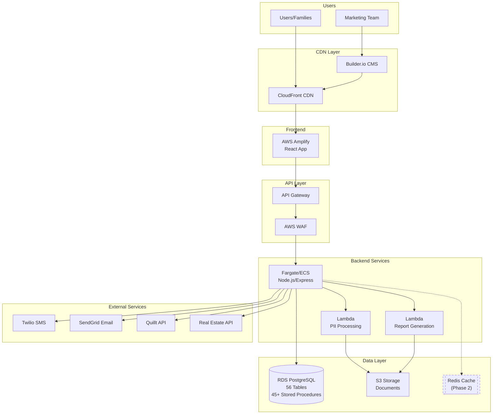
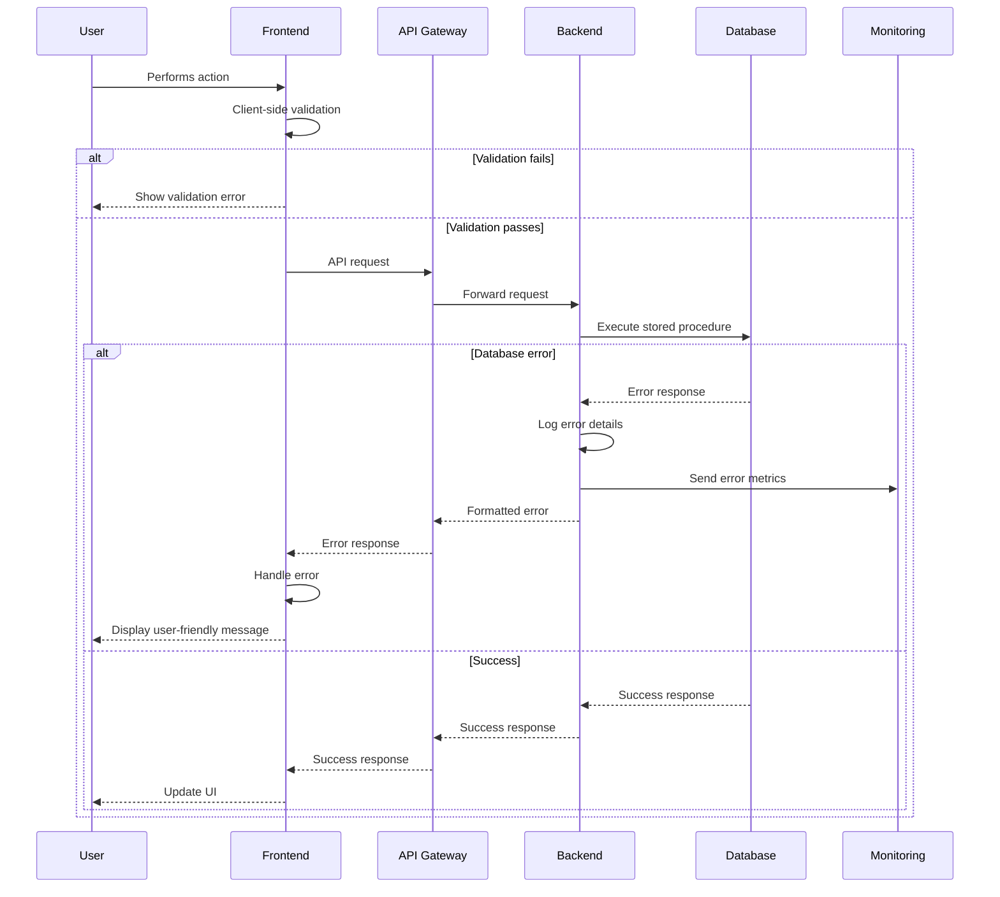

# Forward Inheritance Platform Fullstack Architecture Document

## Change Log

| Date | Version | Description | Author |
|------|---------|-------------|--------|
| 2025-01-15 | 1.0 | Initial fullstack architecture document | Winston (Architect) |

## Introduction

This document outlines the complete fullstack architecture for Forward Inheritance Platform, including backend systems, frontend implementation, and their integration. It serves as the single source of truth for AI-driven development, ensuring consistency across the entire technology stack.

This unified approach combines what would traditionally be separate backend and frontend architecture documents, streamlining the development process for modern fullstack applications where these concerns are increasingly intertwined.

### Starter Template or Existing Project

Based on review of the PRD and existing documentation, this is a **Greenfield project** with no existing starter template mentioned. The project is being built from scratch with the following key constraints:

- Database-first architecture with all operations through stored procedures
- PostgreSQL as the primary database (already designed with 56 tables)
- AWS cloud infrastructure preferred
- React frontend with TypeScript
- Node.js/Express backend
- Multi-tenant SaaS architecture
- AWS Amplify used specifically for React CI/CD and hosting

## High Level Architecture

### Technical Summary

The Forward Inheritance Platform employs a multi-tenant SaaS architecture with a React/TypeScript frontend deployed via AWS Amplify for streamlined CI/CD, communicating through RESTful APIs with a Node.js/Express backend running on containerized AWS infrastructure (Fargate/ECS). The backend contains all business logic and orchestration, while accessing a PostgreSQL database exclusively through stored procedures that provide secure, optimized CRUD operations. The platform leverages AWS services including S3 for document storage, Lambda for PII processing, CloudFront for global content delivery, and integrates with external services like Twilio for SMS verification, SendGrid for email, and Quillt for financial data aggregation. This architecture achieves the PRD goals of supporting millions of families with secure, scalable infrastructure while maintaining strict data isolation and comprehensive audit trails.

### Platform and Infrastructure Choice

**Platform:** AWS Cloud Services  
**Key Services:** Amplify (React hosting/CI/CD), API Gateway, Fargate/ECS, RDS PostgreSQL, S3, Lambda, CloudFront, KMS  
**Deployment Host and Regions:** Primary: US-East-1 (Virginia), with CloudFront edge locations globally

### Repository Structure

**Structure:** Monorepo  
**Monorepo Tool:** npm workspaces (with potential migration to Nx for enhanced tooling)  
**Package Organization:** 
- `/apps` - Frontend (React) and Backend (Node.js) applications
- `/packages` - Shared types, utilities, and database interfaces
- `/infrastructure` - AWS CDK/Terraform definitions

### High Level Architecture Diagram



### Architectural Patterns

- **Database-First CRUD Layer:** All data operations through stored procedures for security and performance optimization - _Rationale:_ Prevents SQL injection, provides operational flexibility for query optimization, enables database-level performance tuning
- **Business Logic in Application Layer:** Node.js/Express handles all business rules, validations, and orchestration - _Rationale:_ Keeps business logic testable, maintainable, and independent of database implementation
- **Multi-Tenant Isolation:** Tenant ID-based data segregation at database level - _Rationale:_ Complete data isolation for different families while maintaining single codebase
- **Component-Based UI:** Reusable React components with TypeScript and shadcn/ui - _Rationale:_ Consistency across UI, type safety, and faster development
- **Repository Pattern:** Abstract database access through typed stored procedure calls - _Rationale:_ Type-safe database operations with pgtyped, easier testing
- **API Gateway Pattern:** Centralized entry point for all backend services - _Rationale:_ Unified authentication, rate limiting, and monitoring
- **Event-Driven Processing:** Lambda functions for async operations like PII masking - _Rationale:_ Scalable processing without blocking main application flow
- **Dual-Identity System:** Separate users (authentication) from personas (business entities) - _Rationale:_ Enables complex family relationships and proxy management

## Tech Stack

This is the DEFINITIVE technology selection for the entire Forward Inheritance Platform. All development must use these exact versions.

### Technology Stack Table

| Category | Technology | Version | Purpose | Rationale |
|----------|------------|---------|---------|-----------|
| Frontend Language | TypeScript | 5.3+ | Type-safe development | Prevents runtime errors, better IDE support, enforces data contracts |
| Frontend Framework | React | 18.2+ | UI framework | Mature ecosystem, component reusability, strong community |
| Frontend Routing | React Router | 6.20+ | Client-side routing | De facto standard, nested routes, data loading APIs |
| UI Component Library | shadcn/ui + Radix | Latest | Accessible components | Customizable, accessible by default, Tailwind integration |
| State Management | Zustand | 4.4+ | Client state management | Simpler than Redux, TypeScript-first, small bundle size |
| Backend Language | TypeScript | 5.3+ | Type-safe backend | Shared types with frontend, consistency across stack |
| Backend Framework | Express.js | 4.18+ | HTTP server framework | Mature, simple, extensive middleware ecosystem |
| API Style | REST | - | API architecture | Simple, well-understood, sufficient for requirements |
| Database | PostgreSQL | 14+ | Primary data store | Already designed with 56 tables, JSONB support, robust |
| Cache | **In-Memory (Phase 1)** → Redis (Phase 2) | 7.0+ | Session & data cache | **MVP: Node.js memory for sessions. Phase 2: Redis for scale** |
| File Storage | AWS S3 | - | Document storage | Integrated encryption, versioning, cost-effective |
| Authentication | JWT + Custom | - | Auth system | Database-driven with stored procedures, dual-channel verification |
| Frontend Testing | Vitest + React Testing Library | Latest | Unit/integration tests | Fast, Jest-compatible, good React integration |
| Backend Testing | Jest | 29+ | API testing | Mature, extensive mocking, good TypeScript support |
| E2E Testing | Playwright | 1.40+ | End-to-end testing | Cross-browser, reliable, good debugging |
| Build Tool | Vite | 5.0+ | Frontend bundling | Fast HMR, excellent DX, optimized production builds |
| Bundler | esbuild (via Vite) | - | JS/TS compilation | Fastest compilation, built into Vite |
| IaC Tool | AWS CDK | 2.100+ | Infrastructure as code | TypeScript-native, better AWS integration than Terraform |
| CI/CD | GitHub Actions + AWS Amplify | - | Deployment automation | GitHub integration, Amplify for React auto-deploy |
| Monitoring | CloudWatch + Sentry | - | Observability | AWS-native metrics, error tracking with Sentry |
| Logging | Winston + CloudWatch | - | Application logging | Structured logging, AWS integration |
| CSS Framework | Tailwind CSS | 3.4+ | Styling system | Utility-first, small production builds, shadcn/ui compatible |
| Container Platform | Docker + ECS/Fargate | - | Backend deployment | Serverless containers, no cluster management needed |
| ORM/Query Builder | Slonik + pgtyped | Latest | Database interface | Type-safe stored procedure calls for CRUD operations, SQL injection prevention, performance optimization |

## Data Models

These TypeScript interfaces define the core entities shared between frontend and backend, matching the database schema while keeping business logic in the application layer.

**Note:** The RealEstateAsset interface below shows ALL fields as an example. Other asset interfaces show key fields only for brevity, but in implementation they should include ALL database table fields.

### Core Entities

```typescript
interface User {
  id: string;
  tenantId: number;
  email: string;
  firstName: string;
  lastName: string;
  status: 'pending_verification' | 'active' | 'inactive' | 'suspended' | 'locked';
  emailVerified: boolean;
  phoneVerified: boolean;
  createdAt: Date;
  updatedAt: Date;
}

interface Persona {
  id: string;
  tenantId: number;
  userId: string | null;
  firstName: string;
  middleName?: string;
  lastName: string;
  suffix?: string;
  nickname?: string;
  dateOfBirth?: Date;
  dateOfDeath?: Date;
  isLiving: boolean;
  gender?: 'male' | 'female' | 'non_binary' | 'prefer_not_to_say' | 'other';
  maritalStatus?: 'single' | 'married' | 'divorced' | 'widowed' | 'separated' | 'domestic_partnership';
  status: 'active' | 'inactive' | 'pending' | 'suspended' | 'deleted';
}

interface ForwardFamilyCircle {
  id: string;
  tenantId: number;
  name: string;
  description?: string;
  ownerUserId: string;
  familyPhotoUrl?: string;
  establishedDate: Date;
  settings: Record<string, any>;
  privacySettings: Record<string, any>;
  isActive: boolean;
  status: 'active' | 'inactive' | 'pending' | 'suspended' | 'deleted';
}

interface Asset {
  id: string;
  tenantId: number;
  categoryId: string;
  ffcId: string;
  name: string;
  description?: string;
  acquisitionDate?: Date;
  acquisitionValue?: number;
  currentValue?: number;
  valueAsOfDate?: Date;
  currencyCode: string;
  primaryDocumentId?: string;
  supportingDocuments?: string[];
  status: 'active' | 'inactive' | 'pending' | 'suspended' | 'deleted';
  isVerified: boolean;
}
```

### Complete Example: RealEstateAsset

```typescript
// COMPLETE EXAMPLE - All fields from database table included
interface RealEstateAsset extends Asset {
  // Property identification
  propertyType: 'single_family' | 'multi_family' | 'condo' | 'townhouse' | 'commercial' | 'land' | 'farm_ranch' | 'vacation_property' | 'other';
  propertySubtype?: string;
  
  // Address (references address table)
  addressId: string;
  address?: Address; // Populated when joined
  
  // Property details
  squareFootage?: number;
  lotSize?: number;
  yearBuilt?: number;
  bedrooms?: number;
  bathrooms?: number;
  parkingSpaces?: number;
  
  // Usage and ownership
  propertyUse: 'primary_residence' | 'rental' | 'vacation' | 'commercial' | 'investment' | 'vacant';
  ownershipType: 'sole_ownership' | 'joint_tenancy' | 'tenancy_in_common' | 'community_property' | 'trust_owned' | 'llc_owned';
  ownershipPercentage?: number;
  
  // Financial information
  purchasePrice?: number;
  purchaseDate?: Date;
  currentMarketValue?: number;
  taxAssessedValue?: number;
  annualPropertyTax?: number;
  mortgageBalance?: number;
  mortgageLender?: string;
  mortgageAccountNumber?: string;
  
  // Rental information (if applicable)
  monthlyRentalIncome?: number;
  currentTenant?: string;
  leaseEndDate?: Date;
  
  // Property management
  propertyManager?: string;
  propertyManagerPhone?: string;
  hoaName?: string;
  hoaFees?: number;
  hoaFrequency?: 'monthly' | 'quarterly' | 'annual';
  
  // Insurance
  insuranceProvider?: string;
  insurancePolicyNumber?: string;
  insuranceAnnualPremium?: number;
  insuranceCoverage?: number;
  
  // Additional details
  amenities?: string[];
  improvements?: string;
  notes?: string;
  
  // Valuation history
  lastAppraisalDate?: Date;
  lastAppraisalValue?: number;
  nextAppraisalDate?: Date;
}
```

### Other Asset Type Examples (Key Fields Only)

```typescript
// SIMPLIFIED EXAMPLE - Additional fields exist in actual implementation
interface FinancialAccount extends Asset {
  accountType: 'checking' | 'savings' | 'investment' | 'retirement_401k' | 'retirement_ira' | 'retirement_roth' | 'retirement_pension' | 'college_529' | 'college_coverdell' | 'hsa' | 'trust_account' | 'business_account' | 'cryptocurrency';
  institutionName: string;
  accountNumberLast4?: string;
  currentBalance: number;
  balanceAsOfDate: Date;
  isQuilltConnected: boolean;
  quilltConnectionId?: string;
  // ... 20+ additional fields in actual implementation
}

// Pattern continues for all 13 asset types
```

**Implementation Note for AI Agents:** When implementing these interfaces, reference the database schema in `DB-architecture.md` to include ALL fields from the corresponding tables. The stored procedures will return complete data which the Node.js layer processes according to business rules before sending to the frontend.

## API Specification

Based on REST architecture, this OpenAPI 3.0 specification defines all endpoints. The Node.js/Express layer handles business logic, while stored procedures manage CRUD operations.

### REST API Specification

```yaml
openapi: 3.0.0
info:
  title: Forward Inheritance Platform API
  version: 1.0.0
  description: RESTful API for Forward Inheritance Platform with business logic in Node.js and CRUD operations via stored procedures
servers:
  - url: https://api.forwardinheritance.com/v1
    description: Production
  - url: https://staging-api.forwardinheritance.com/v1
    description: Staging
  - url: http://localhost:3000/v1
    description: Development

components:
  securitySchemes:
    bearerAuth:
      type: http
      scheme: bearer
      bearerFormat: JWT
      
  schemas:
    Error:
      type: object
      properties:
        error:
          type: object
          properties:
            code:
              type: string
              example: "VALIDATION_ERROR"
            message:
              type: string
            details:
              type: object
            timestamp:
              type: string
              format: date-time
            requestId:
              type: string
              format: uuid

paths:
  # Authentication Endpoints
  /auth/register:
    post:
      tags: [Authentication]
      summary: Register new user
      description: Business logic validates input, checks email uniqueness, then calls sp_register_user
      
  /auth/verify-email:
    post:
      tags: [Authentication]
      summary: Verify email address
      description: Express validates token format, then calls sp_verify_email
      
  /auth/verify-phone:
    post:
      tags: [Authentication]
      summary: Verify phone number
      description: Express validates code format and rate limits, then calls sp_verify_phone
      
  /auth/login:
    post:
      tags: [Authentication]
      summary: User login
      description: Express handles password validation and JWT generation after sp_login_user
      
  # FFC Management Endpoints
  /ffcs:
    post:
      tags: [FFC]
      summary: Create new FFC
      description: Business logic validates user permissions, then calls sp_create_ffc
      security:
        - bearerAuth: []
        
    get:
      tags: [FFC]
      summary: List user's FFCs
      description: Express applies filters and pagination, calls sp_get_user_ffcs
      security:
        - bearerAuth: []
        
  /ffcs/{ffcId}/members:
    post:
      tags: [FFC]
      summary: Invite member to FFC
      description: Complex business logic for dual-channel verification, then sp_invite_ffc_member
      security:
        - bearerAuth: []
        
  # Asset Management Endpoints
  /assets:
    post:
      tags: [Assets]
      summary: Create new asset
      description: Express validates asset data based on category, then calls category-specific stored procedure
      security:
        - bearerAuth: []
        
  /assets/{assetId}:
    get:
      tags: [Assets]
      summary: Get asset details
      description: Express checks permissions via sp_check_asset_permission, then sp_get_asset
      security:
        - bearerAuth: []
        
    put:
      tags: [Assets]
      summary: Update asset
      description: Business logic validates changes and permissions, then calls sp_update_asset
      security:
        - bearerAuth: []
        
  /assets/{assetId}/documents:
    post:
      tags: [Assets]
      summary: Upload document for asset
      description: Express handles file upload to S3, triggers Lambda for PII processing, then sp_add_asset_document
      security:
        - bearerAuth: []
        
  # Integration Endpoints
  /integrations/quillt/connect:
    post:
      tags: [Integrations]
      summary: Connect Quillt account
      description: Express orchestrates OAuth flow with Quillt, then sp_create_quillt_connection
      security:
        - bearerAuth: []
        
  /integrations/quillt/sync:
    post:
      tags: [Integrations]
      summary: Sync Quillt accounts
      description: Express fetches from Quillt API, processes data, then calls sp_update_financial_accounts
      security:
        - bearerAuth: []
        
  # Reporting Endpoints
  /reports/wealth-summary:
    get:
      tags: [Reports]
      summary: Generate wealth summary report
      description: Express aggregates data from multiple stored procedures, applies business calculations
      security:
        - bearerAuth: []
```

## Components

Major logical components and services across the fullstack, with clear boundaries and responsibilities.

### Frontend Components

- **React Application Shell**: Main application container, routing, layout, and global state initialization
- **Authentication Service (Frontend)**: Manage authentication state, token storage, and auth flows
- **Asset Management Module**: Handle all asset CRUD operations and display logic
- **Document Upload Service**: Handle file uploads with progress tracking and S3 integration

### Backend Components

- **Express API Server**: HTTP server, middleware orchestration, request routing
- **Business Logic Service Layer**: All business rules, validations, and orchestration between external services and database
- **Database Service Layer**: Execute stored procedures, manage connections, handle transactions
- **Session Management Service (MVP - No Redis)**: JWT-based stateless sessions with optional in-memory store for active sessions
- **PII Processing Service (Lambda)**: Detect and mask PII in uploaded documents
- **External Integration Clients**: Manage connections to third-party services

### Shared Components

- **Type Definitions Package**: Shared TypeScript interfaces and types between frontend and backend
- **Utility Functions Package**: Common utilities used across the stack

## External APIs

The platform integrates with several external services to provide comprehensive functionality.

### Twilio API
- **Purpose:** SMS verification for dual-channel authentication and notifications
- **Documentation:** https://www.twilio.com/docs/sms/api
- **Base URL(s):** https://api.twilio.com/2010-04-01
- **Authentication:** Basic Auth with Account SID and Auth Token
- **Rate Limits:** 1 request/second for SMS sending

### SendGrid API
- **Purpose:** Transactional email for verification, invitations, and notifications
- **Documentation:** https://docs.sendgrid.com/api-reference/mail-send
- **Base URL(s):** https://api.sendgrid.com/v3
- **Authentication:** Bearer token with API Key
- **Rate Limits:** 600 requests/second (unlikely to hit)

### Quillt API
- **Purpose:** Financial account aggregation and balance synchronization
- **Documentation:** https://docs.quillt.io/api-reference
- **Base URL(s):** https://api.quillt.io/v1
- **Authentication:** OAuth 2.0 with client credentials
- **Rate Limits:** 100 requests/minute per connection

### HEI API (Home Equity Investment)
- **Purpose:** Read-only access to HEI loan information
- **Documentation:** *To be provided by HEI partner*
- **Base URL(s):** *TBD*
- **Authentication:** API Key or OAuth 2.0 (TBD)
- **Rate Limits:** *TBD*

### Real Estate Valuation API (Phase 2 - Provider TBD)
- **Purpose:** Automated property valuations and market data
- **Documentation:** *Provider selection pending*
- **Provider Options Under Evaluation:**
  1. Zillow GetEstimate API
  2. CoreLogic Property API
  3. RentSpree Valuation API
  4. Attom Data API

### Vanta API
- **Purpose:** SOC 2 compliance automation, security monitoring, and audit evidence collection
- **Documentation:** `/docs/requirements/API/Vanta/vanta-api-documentation.md`
- **Base URL:** https://api.vanta.com
- **Authentication:** OAuth 2.0 Client Credentials flow
- **Rate Limits:** 
  - Management endpoints: 50 requests/minute
  - OAuth endpoints: 5 requests/minute
  - Integration endpoints: 20 requests/minute
- **Key Features:**
  - Security control monitoring
  - Vendor management
  - Compliance evidence collection
  - Employee device tracking
  - Automated SOC 2 reporting

### AWS Services (Native Integration)
- **S3:** Document storage with presigned URLs for direct upload
- **Lambda:** PII processing triggered by S3 events
- **Comprehend:** PII detection within Lambda function
- **CloudWatch:** Logging and monitoring
- **EventBridge:** Scheduled tasks (future)

## Core Workflows

[User Registration, FFC Creation, Asset Creation, Financial Sync, Permission Check, and Error Handling workflows documented with detailed sequence diagrams]

## Database Schema

The database schema is already fully designed with 56 tables and 45+ stored procedures. Essential tables include:

- Multi-tenant foundation (tenants, users, personas)
- Family circles (fwd_family_circles, ffc_personas)
- Asset management (assets, asset_persona, asset_permissions)
- Contact normalization (email_address, phone_number, usage tables)
- Security and audit (audit_log, user_sessions)

Key stored procedures handle:
- User registration with normalized contacts
- Asset creation with ownership
- Permission checking
- All CRUD operations

**Note**: The complete schema with all 56 tables and 45+ stored procedures is documented in `DB-architecture.md`.

## Frontend Architecture

### Component Architecture
- Component organization by feature (auth, ffc, assets)
- Standard component structure with TypeScript
- shadcn/ui for UI components

### State Management Architecture
- Zustand for global state management
- React Query for server state
- Local component state for UI-only concerns

### Routing Architecture
- React Router v6 for client-side routing
- Protected route pattern for authentication
- File-based route organization

### Frontend Services Layer
- Axios instance with auth interceptors
- Service classes for API communication
- React Query hooks for data fetching

## Backend Architecture

### Service Architecture
- Traditional Express.js server (not serverless)
- Controller/Route/Service/Database layer separation
- Deployed as Docker containers on ECS/Fargate

### Database Architecture
- PostgreSQL with stored procedures for all CRUD
- Slonik for SQL execution
- pgtyped for type generation

### Authentication and Authorization
- JWT-based stateless authentication
- Middleware pipeline for auth checks
- Permission service for granular access control

## Unified Project Structure

```plaintext
forward-inheritance/
├── .github/                        # CI/CD workflows
├── apps/                           # Application packages
│   ├── web/                        # Frontend React application
│   └── api/                        # Backend Node.js application
├── packages/                       # Shared packages
│   ├── shared/                     # Shared types/utilities
│   ├── ui/                        # Shared UI components (future)
│   └── config/                    # Shared configuration
├── infrastructure/                # Infrastructure as Code
│   ├── aws/                       # AWS CDK definitions
│   └── docker/                    # Docker configurations
├── scripts/                       # Build/deploy scripts
├── docs/                          # Documentation
├── tests/                         # E2E and integration tests
├── .env.example                   # Environment template
├── package.json                   # Root package.json
└── README.md
```

Monorepo managed with npm workspaces for simplicity in MVP.

## Development Workflow

### Local Development Setup
- Prerequisites: Node.js 20+, Docker, PostgreSQL 14+
- Initial setup with migrations and type generation
- Development commands for frontend/backend/testing

### Environment Configuration
- Separate .env files for frontend and backend
- Required variables for database, JWT, AWS, and external services

### Development Patterns
- Feature development flow
- Database change flow with migrations
- API development flow
- Debugging and troubleshooting guides

## Deployment Architecture

### Deployment Strategy
- **Frontend:** AWS Amplify with automatic CI/CD
- **Backend:** ECS Fargate with Docker containers
- **Database:** RDS PostgreSQL

### CI/CD Pipeline
- GitHub Actions for testing and deployment
- Separate workflows for staging and production
- Automated database migrations

### Environments
- Development (local)
- Staging (pre-production testing)
- Production (live environment)

### Infrastructure as Code
- AWS CDK for infrastructure definition
- ECS task definitions and services
- Auto-scaling configuration
- Health checks and monitoring

---

## Security and Performance

### Security Requirements

#### Frontend Security

**Content Security Policy (CSP)**
```http
Content-Security-Policy: 
  default-src 'self';
  script-src 'self' 'unsafe-inline' https://cdn.amplify.aws;
  style-src 'self' 'unsafe-inline';
  img-src 'self' data: https:;
  connect-src 'self' https://api.forward-inheritance.com wss://;
  font-src 'self' data:;
  frame-ancestors 'none';
  base-uri 'self';
  form-action 'self';
```

**XSS Prevention**
- React's built-in XSS protection through JSX escaping
- DOMPurify for sanitizing user-generated HTML content
- Input validation on all form fields before submission
- HttpOnly cookies for session management
- SameSite cookie attributes set to 'Strict'

**Secure Storage Strategy**
- JWT tokens stored in memory, not localStorage
- Refresh tokens in HttpOnly, Secure, SameSite cookies
- Sensitive data encrypted using Web Crypto API before storage
- Session timeout after 30 minutes of inactivity
- Automatic token refresh with sliding expiration

#### Backend Security

**Input Validation**
- Joi schema validation on all API endpoints
- SQL injection prevention through stored procedures only
- Parameterized queries for any dynamic SQL (limited use)
- Request body size limits (10MB max)
- File upload restrictions by MIME type and extension

**Rate Limiting Configuration**
```javascript
// API Gateway rate limits
{
  burstLimit: 5000,      // requests
  rateLimit: 2000,       // requests per second
  
  // Per-endpoint limits
  '/api/auth/login': { rateLimit: 5, windowMs: 15 * 60 * 1000 }, // 5 attempts per 15 min
  '/api/auth/register': { rateLimit: 3, windowMs: 60 * 60 * 1000 }, // 3 per hour
  '/api/assets/*': { rateLimit: 100, windowMs: 60 * 1000 }, // 100 per minute
}
```

**CORS Policy**
```javascript
{
  origin: [
    'https://app.forward-inheritance.com',
    'https://staging.forward-inheritance.com'
  ],
  credentials: true,
  methods: ['GET', 'POST', 'PUT', 'DELETE', 'OPTIONS'],
  allowedHeaders: ['Content-Type', 'Authorization', 'X-Request-ID'],
  exposedHeaders: ['X-Request-ID'],
  maxAge: 86400 // 24 hours
}
```

#### Authentication Security

**Token Management**
- JWT access tokens (15-minute expiry)
- Refresh tokens (7-day expiry with rotation)
- Token rotation on each refresh
- Blacklist for revoked tokens in Redis
- Multi-device session tracking

**Session Management**
- Database-backed sessions in `user_sessions` table
- Session fingerprinting (IP + User Agent hash)
- Concurrent session limits (5 devices max)
- Force logout on suspicious activity
- Session activity tracking and audit logs

**Password Requirements**
- Minimum 12 characters
- Requires uppercase, lowercase, number, special character
- Password history (last 5 passwords)
- Argon2id hashing with salt
- Password expiry after 90 days (configurable)

#### PII Protection (AWS Architecture)

**Tokenization Pipeline**
1. Document upload to S3 staging bucket
2. Lambda triggered for PII detection (AWS Comprehend)
3. Identified PII tokenized and stored in separate encrypted vault
4. Original document with tokens stored in S3 production bucket
5. Mapping stored in RDS with encryption at rest

**Encryption Strategy**
- **AWS KMS**: Customer-managed keys with automatic rotation
- **RDS Encryption**: AES-256 encryption at rest
- **S3 Encryption**: SSE-KMS for all buckets
- **Transit Encryption**: TLS 1.3 for all API communications
- **Application-Level**: Field-level encryption for SSN, credit cards

### Performance Optimization

#### Frontend Performance

**Bundle Size Targets**
- Initial JS bundle: < 200KB (gzipped)
- Initial CSS: < 50KB (gzipped)
- Code splitting by route
- Lazy loading for non-critical components
- Tree shaking and dead code elimination

**Loading Strategy**
```javascript
// Progressive enhancement approach
1. Critical CSS inlined in <head>
2. Preload critical fonts and assets
3. Prefetch next likely navigation routes
4. Service Worker for offline capability
5. Image optimization with WebP/AVIF formats
```

**Caching Strategy**
- CloudFront CDN with 1-year cache for static assets
- Cache busting through content hash in filenames
- Service Worker caching for offline access
- LocalStorage for user preferences
- IndexedDB for offline data sync

**Performance Metrics Targets**
- First Contentful Paint (FCP): < 1.0s
- Largest Contentful Paint (LCP): < 2.5s
- First Input Delay (FID): < 100ms
- Cumulative Layout Shift (CLS): < 0.1
- Time to Interactive (TTI): < 3.5s

#### Backend Performance

**Response Time Targets**
- API response time p50: < 100ms
- API response time p95: < 500ms
- API response time p99: < 1000ms
- Database query time p95: < 50ms
- Lambda cold start: < 1s

**Database Optimization**
```sql
-- Connection pooling configuration
{
  min: 10,
  max: 100,
  idle: 10000,
  acquire: 30000,
  evict: 60000
}

-- Query optimization
- All operations through stored procedures
- Proper indexing on foreign keys and search columns
- Partial indexes for filtered queries
- Query result pagination (max 100 records)
- Read replicas for reporting queries
```

**Caching Strategy**
- Redis for session storage and hot data
- 5-minute cache for user permissions
- 1-hour cache for asset listings
- API Gateway caching for GET requests
- Database query result caching in Redis
- CloudFront caching for static API responses

**Auto-scaling Configuration**
```yaml
# ECS Fargate auto-scaling
targetCPUUtilization: 70
minTasks: 2
maxTasks: 100
scaleUpCooldown: 60
scaleDownCooldown: 300

# RDS Aurora auto-scaling
minCapacity: 2
maxCapacity: 16
targetCPUUtilization: 75
targetConnectionsPercent: 80
```

### Security Monitoring

**AWS Security Services**
- AWS WAF for application firewall
- AWS Shield for DDoS protection
- AWS GuardDuty for threat detection
- AWS Security Hub for compliance monitoring
- AWS CloudTrail for audit logging
- AWS Config for configuration compliance

**Security Events to Monitor**
- Failed login attempts (> 5 in 15 minutes)
- Password reset requests (> 3 per hour)
- Unusual data access patterns
- API rate limit violations
- JWT token anomalies
- Geographic access anomalies

## Testing Strategy

### Testing Pyramid

```
         /\
        /E2E\        5% - Critical user journeys
       /------\
      /Integra-\     20% - API & service integration
     /  tion    \
    /------------\
   /   Unit Tests \  75% - Component & function level
  /________________\
```

**Test Distribution Goals**
- Unit Tests: 75% coverage minimum
- Integration Tests: All API endpoints and database operations
- E2E Tests: Critical user workflows only

### Test Organization

#### Frontend Tests Structure

```
apps/web/
├── src/
│   ├── components/
│   │   ├── Button/
│   │   │   ├── Button.tsx
│   │   │   └── Button.test.tsx
│   │   └── AssetCard/
│   │       ├── AssetCard.tsx
│   │       └── AssetCard.test.tsx
│   ├── hooks/
│   │   ├── useAuth.ts
│   │   └── useAuth.test.ts
│   ├── pages/
│   │   ├── Dashboard/
│   │   │   ├── Dashboard.tsx
│   │   │   └── Dashboard.test.tsx
│   └── services/
│       ├── api.ts
│       └── api.test.ts
├── tests/
│   ├── setup.ts
│   ├── utils/
│   │   └── test-utils.tsx
│   └── e2e/
│       ├── auth.spec.ts
│       └── asset-management.spec.ts
└── jest.config.js
```

#### Backend Tests Structure

```
apps/api/
├── src/
│   ├── routes/
│   │   ├── auth/
│   │   │   ├── auth.controller.ts
│   │   │   └── auth.controller.test.ts
│   │   └── assets/
│   │       ├── assets.controller.ts
│   │       └── assets.controller.test.ts
│   ├── services/
│   │   ├── auth.service.ts
│   │   └── auth.service.test.ts
│   ├── middleware/
│   │   ├── auth.middleware.ts
│   │   └── auth.middleware.test.ts
│   └── utils/
│       ├── validators.ts
│       └── validators.test.ts
├── tests/
│   ├── setup.ts
│   ├── fixtures/
│   │   └── test-data.ts
│   ├── integration/
│   │   ├── auth.integration.test.ts
│   │   └── assets.integration.test.ts
│   └── helpers/
│       └── db-helper.ts
└── jest.config.js
```

#### E2E Tests Structure

```
tests/e2e/
├── fixtures/
│   ├── users.json
│   └── assets.json
├── page-objects/
│   ├── LoginPage.ts
│   ├── DashboardPage.ts
│   └── AssetPage.ts
├── specs/
│   ├── auth/
│   │   ├── login.spec.ts
│   │   ├── registration.spec.ts
│   │   └── password-reset.spec.ts
│   ├── ffc/
│   │   ├── create-ffc.spec.ts
│   │   └── invite-members.spec.ts
│   └── assets/
│       ├── add-asset.spec.ts
│       └── manage-permissions.spec.ts
├── support/
│   ├── commands.ts
│   └── helpers.ts
└── playwright.config.ts
```

### Test Configuration

#### Frontend Test Configuration

```javascript
// jest.config.js
module.exports = {
  preset: 'ts-jest',
  testEnvironment: 'jsdom',
  setupFilesAfterEnv: ['<rootDir>/tests/setup.ts'],
  moduleNameMapper: {
    '^@/(.*)$': '<rootDir>/src/$1',
    '\\.(css|less|scss|sass)$': 'identity-obj-proxy',
  },
  collectCoverageFrom: [
    'src/**/*.{ts,tsx}',
    '!src/**/*.d.ts',
    '!src/**/index.ts',
    '!src/**/*.stories.tsx',
  ],
  coverageThreshold: {
    global: {
      branches: 75,
      functions: 75,
      lines: 75,
      statements: 75,
    },
  },
};
```

#### Backend Test Configuration

```javascript
// jest.config.js
module.exports = {
  preset: 'ts-jest',
  testEnvironment: 'node',
  setupFilesAfterEnv: ['<rootDir>/tests/setup.ts'],
  testMatch: ['**/*.test.ts', '**/*.integration.test.ts'],
  collectCoverageFrom: [
    'src/**/*.ts',
    '!src/**/*.d.ts',
    '!src/**/index.ts',
  ],
  coverageThreshold: {
    global: {
      branches: 80,
      functions: 80,
      lines: 80,
      statements: 80,
    },
  },
  globalSetup: '<rootDir>/tests/globalSetup.ts',
  globalTeardown: '<rootDir>/tests/globalTeardown.ts',
};
```

### Test Examples

#### Frontend Component Test

```typescript
// Button.test.tsx
import { render, screen, fireEvent } from '@testing-library/react';
import { Button } from './Button';

describe('Button Component', () => {
  it('renders with text', () => {
    render(<Button>Click me</Button>);
    expect(screen.getByRole('button')).toHaveTextContent('Click me');
  });

  it('handles click events', () => {
    const handleClick = jest.fn();
    render(<Button onClick={handleClick}>Click me</Button>);
    
    fireEvent.click(screen.getByRole('button'));
    expect(handleClick).toHaveBeenCalledTimes(1);
  });

  it('shows loading state', () => {
    render(<Button loading>Submit</Button>);
    expect(screen.getByRole('button')).toBeDisabled();
    expect(screen.getByTestId('spinner')).toBeInTheDocument();
  });

  it('applies variant styles', () => {
    const { rerender } = render(<Button variant="primary">Primary</Button>);
    expect(screen.getByRole('button')).toHaveClass('btn-primary');
    
    rerender(<Button variant="danger">Danger</Button>);
    expect(screen.getByRole('button')).toHaveClass('btn-danger');
  });
});

// useAuth.test.ts - Hook Test
import { renderHook, act } from '@testing-library/react';
import { useAuth } from './useAuth';
import { AuthProvider } from '@/contexts/AuthContext';

describe('useAuth Hook', () => {
  const wrapper = ({ children }) => <AuthProvider>{children}</AuthProvider>;

  it('provides authentication state', () => {
    const { result } = renderHook(() => useAuth(), { wrapper });
    
    expect(result.current.isAuthenticated).toBe(false);
    expect(result.current.user).toBeNull();
  });

  it('handles login', async () => {
    const { result } = renderHook(() => useAuth(), { wrapper });
    
    await act(async () => {
      await result.current.login('test@example.com', 'password');
    });
    
    expect(result.current.isAuthenticated).toBe(true);
    expect(result.current.user).toMatchObject({
      email: 'test@example.com',
    });
  });
});
```

#### Backend API Test

```typescript
// auth.controller.test.ts - Unit Test
import { AuthController } from './auth.controller';
import { AuthService } from '@/services/auth.service';
import { Request, Response } from 'express';

jest.mock('@/services/auth.service');

describe('AuthController', () => {
  let controller: AuthController;
  let authService: jest.Mocked<AuthService>;
  let req: Partial<Request>;
  let res: Partial<Response>;

  beforeEach(() => {
    authService = new AuthService() as jest.Mocked<AuthService>;
    controller = new AuthController(authService);
    
    req = {
      body: {},
      params: {},
      headers: {},
    };
    
    res = {
      status: jest.fn().mockReturnThis(),
      json: jest.fn().mockReturnThis(),
      cookie: jest.fn().mockReturnThis(),
    };
  });

  describe('POST /login', () => {
    it('returns token on successful login', async () => {
      req.body = { email: 'test@example.com', password: 'password123' };
      
      authService.validateCredentials.mockResolvedValue({
        userId: 'user-123',
        email: 'test@example.com',
      });
      
      authService.generateTokens.mockReturnValue({
        accessToken: 'access-token',
        refreshToken: 'refresh-token',
      });

      await controller.login(req as Request, res as Response);

      expect(res.cookie).toHaveBeenCalledWith('refreshToken', 'refresh-token', {
        httpOnly: true,
        secure: true,
        sameSite: 'strict',
      });
      
      expect(res.json).toHaveBeenCalledWith({
        accessToken: 'access-token',
        user: { userId: 'user-123', email: 'test@example.com' },
      });
    });

    it('returns 401 on invalid credentials', async () => {
      req.body = { email: 'test@example.com', password: 'wrong' };
      
      authService.validateCredentials.mockResolvedValue(null);

      await controller.login(req as Request, res as Response);

      expect(res.status).toHaveBeenCalledWith(401);
      expect(res.json).toHaveBeenCalledWith({
        error: 'Invalid credentials',
      });
    });
  });
});

// auth.integration.test.ts - Integration Test
import request from 'supertest';
import { app } from '@/app';
import { db } from '@/db';
import { generateTestUser } from '../fixtures/test-data';

describe('Auth API Integration', () => {
  beforeEach(async () => {
    await db.query('BEGIN');
  });

  afterEach(async () => {
    await db.query('ROLLBACK');
  });

  describe('POST /api/auth/register', () => {
    it('creates new user account', async () => {
      const userData = generateTestUser();
      
      const response = await request(app)
        .post('/api/auth/register')
        .send(userData)
        .expect(201);

      expect(response.body).toMatchObject({
        user: {
          email: userData.email,
          firstName: userData.firstName,
          lastName: userData.lastName,
        },
      });

      // Verify user in database
      const result = await db.query(
        'SELECT * FROM users WHERE primary_email_id = (SELECT id FROM email_address WHERE email_address = $1)',
        [userData.email]
      );
      
      expect(result.rows).toHaveLength(1);
    });

    it('prevents duplicate email registration', async () => {
      const userData = generateTestUser();
      
      // First registration
      await request(app)
        .post('/api/auth/register')
        .send(userData)
        .expect(201);

      // Duplicate registration
      const response = await request(app)
        .post('/api/auth/register')
        .send(userData)
        .expect(409);

      expect(response.body.error).toBe('Email already registered');
    });
  });
});
```

#### E2E Test

```typescript
// login.spec.ts - Playwright E2E Test
import { test, expect } from '@playwright/test';
import { LoginPage } from '../../page-objects/LoginPage';
import { DashboardPage } from '../../page-objects/DashboardPage';

test.describe('Authentication Flow', () => {
  let loginPage: LoginPage;
  let dashboardPage: DashboardPage;

  test.beforeEach(async ({ page }) => {
    loginPage = new LoginPage(page);
    dashboardPage = new DashboardPage(page);
    await loginPage.goto();
  });

  test('successful login redirects to dashboard', async ({ page }) => {
    await loginPage.fillEmail('test@forward-inheritance.com');
    await loginPage.fillPassword('Test123!@#');
    await loginPage.clickSubmit();

    await expect(page).toHaveURL('/dashboard');
    await expect(dashboardPage.welcomeMessage).toContainText('Welcome back');
  });

  test('displays error for invalid credentials', async () => {
    await loginPage.fillEmail('wrong@example.com');
    await loginPage.fillPassword('wrongpassword');
    await loginPage.clickSubmit();

    await expect(loginPage.errorMessage).toBeVisible();
    await expect(loginPage.errorMessage).toContainText('Invalid credentials');
  });

  test('enforces dual-channel verification for new device', async ({ page }) => {
    await loginPage.fillEmail('newdevice@forward-inheritance.com');
    await loginPage.fillPassword('Test123!@#');
    await loginPage.clickSubmit();

    // Should redirect to verification page
    await expect(page).toHaveURL('/verify');
    
    // Verify both email and SMS code inputs are present
    await expect(page.locator('[data-testid="email-code-input"]')).toBeVisible();
    await expect(page.locator('[data-testid="sms-code-input"]')).toBeVisible();
  });
});

// create-ffc.spec.ts - FFC Creation E2E Test
import { test, expect } from '@playwright/test';
import { authenticateUser } from '../../support/helpers';

test.describe('FFC Creation', () => {
  test.beforeEach(async ({ page }) => {
    await authenticateUser(page);
  });

  test('creates new Forward Family Circle', async ({ page }) => {
    await page.click('[data-testid="create-ffc-button"]');
    
    // Fill FFC details
    await page.fill('[name="ffcName"]', 'Smith Family Trust');
    await page.fill('[name="description"]', 'Family estate planning');
    
    // Add family members
    await page.click('[data-testid="add-member-button"]');
    await page.fill('[name="memberEmail"]', 'spouse@example.com');
    await page.fill('[name="memberPhone"]', '+1234567890');
    await page.selectOption('[name="role"]', 'beneficiary');
    
    await page.click('[type="submit"]');

    // Verify FFC created
    await expect(page.locator('[data-testid="ffc-card"]')).toContainText('Smith Family Trust');
    
    // Verify invitation sent
    await expect(page.locator('[data-testid="toast-notification"]')).toContainText(
      'Invitation sent to spouse@example.com'
    );
  });
});
```

### Test Data Management

```typescript
// test-data-builder.ts
export class TestDataBuilder {
  static user(overrides = {}) {
    return {
      email: `test-${Date.now()}@example.com`,
      password: 'Test123!@#',
      firstName: 'John',
      lastName: 'Doe',
      phone: '+11234567890',
      ...overrides,
    };
  }

  static asset(overrides = {}) {
    return {
      name: 'Test Asset',
      category: 'real_estate',
      value: 500000,
      description: 'Test property',
      ...overrides,
    };
  }

  static ffc(overrides = {}) {
    return {
      name: 'Test Family Circle',
      description: 'Test FFC for automated tests',
      ...overrides,
    };
  }
}
```

### Continuous Integration Testing

```yaml
# .github/workflows/test.yml
name: Test Suite

on: [push, pull_request]

jobs:
  unit-tests:
    runs-on: ubuntu-latest
    steps:
      - uses: actions/checkout@v3
      - uses: actions/setup-node@v3
        with:
          node-version: '18'
      - run: npm ci
      - run: npm run test:unit
      - uses: codecov/codecov-action@v3

  integration-tests:
    runs-on: ubuntu-latest
    services:
      postgres:
        image: postgres:14
        env:
          POSTGRES_PASSWORD: testpass
        options: >-
          --health-cmd pg_isready
          --health-interval 10s
      redis:
        image: redis:7
        options: >-
          --health-cmd "redis-cli ping"
    steps:
      - uses: actions/checkout@v3
      - run: npm ci
      - run: npm run db:migrate:test
      - run: npm run test:integration

  e2e-tests:
    runs-on: ubuntu-latest
    steps:
      - uses: actions/checkout@v3
      - run: npm ci
      - run: npx playwright install
      - run: npm run test:e2e
      - uses: actions/upload-artifact@v3
        if: always()
        with:
          name: playwright-report
          path: playwright-report/
```

## Coding Standards

### Critical Fullstack Rules

These are MANDATORY rules that prevent common mistakes and ensure consistency across the codebase:

#### Database Access Rules
- **NEVER access tables directly** - All database operations MUST use stored procedures
- **Use parameterized calls** - Never concatenate SQL strings
- **Handle connection pooling** - Always release connections in finally blocks
- **Transaction boundaries** - Wrap related operations in transactions

```typescript
// ❌ WRONG - Direct table access
const user = await db.query('SELECT * FROM users WHERE id = $1', [userId]);

// ✅ CORRECT - Using stored procedure
const user = await db.func('sp_get_user_by_id', [userId]);
```

#### Type Safety Rules
- **Define all types in packages/shared** - Never duplicate type definitions
- **Use strict TypeScript** - No `any` types without explicit justification
- **Validate at boundaries** - Input validation on all API endpoints
- **Type all API responses** - Including error responses

```typescript
// packages/shared/types/user.ts
export interface User {
  id: string;
  email: string;
  firstName: string;
  lastName: string;
}

// ❌ WRONG - Local type definition
interface User { /* ... */ }

// ✅ CORRECT - Import from shared
import { User } from '@fwd/shared/types';
```

#### API Communication Rules
- **No direct HTTP calls in components** - Always use service layer
- **Centralized error handling** - Use standard error interceptor
- **Request/response logging** - All API calls must be logged
- **Timeout configuration** - 30s default, configurable per endpoint

```typescript
// ❌ WRONG - Direct fetch in component
const data = await fetch('/api/assets');

// ✅ CORRECT - Using service layer
import { assetService } from '@/services';
const data = await assetService.getAssets();
```

#### State Management Rules
- **Immutable updates only** - Never mutate state directly
- **Single source of truth** - One store per domain
- **Async actions in services** - Keep stores synchronous
- **Normalize complex data** - Use entity adapters for collections

```typescript
// ❌ WRONG - Direct mutation
state.users.push(newUser);

// ✅ CORRECT - Immutable update
state.users = [...state.users, newUser];
```

#### Security Rules
- **Never store sensitive data in localStorage** - Use secure cookies or memory
- **Sanitize all user input** - Use DOMPurify for HTML content
- **Environment variables only through config** - Never access process.env directly
- **No secrets in code** - Use AWS Secrets Manager

```typescript
// ❌ WRONG - Direct env access
const apiKey = process.env.API_KEY;

// ✅ CORRECT - Through config module
import { config } from '@/config';
const apiKey = config.get('apiKey');
```

### Naming Conventions

| Element | Pattern | Example |
|---------|---------|---------|
| **Files** | | |
| React Components | PascalCase | `UserProfile.tsx` |
| Hooks | camelCase | `useAuth.ts` |
| Services | camelCase | `authService.ts` |
| Utils | kebab-case | `date-formatter.ts` |
| Tests | .test or .spec | `Button.test.tsx` |
| **Code** | | |
| Components | PascalCase | `function UserCard() {}` |
| Functions | camelCase | `function calculateTotal() {}` |
| Constants | UPPER_SNAKE | `const MAX_RETRIES = 3` |
| Interfaces | PascalCase with I prefix | `interface IUserService {}` |
| Types | PascalCase | `type UserRole = 'admin' \| 'user'` |
| Enums | PascalCase | `enum Status { Active, Inactive }` |
| **Database** | | |
| Tables | snake_case | `user_sessions` |
| Columns | snake_case | `created_at` |
| Stored Procedures | sp_ prefix | `sp_create_user` |
| Indexes | idx_ prefix | `idx_users_email` |
| Constraints | valid_ or chk_ prefix | `valid_email_format` |
| **API** | | |
| Routes | kebab-case | `/api/user-profile` |
| Query params | camelCase | `?userId=123&includeAssets=true` |
| Request body | camelCase | `{ firstName: 'John' }` |
| Response fields | camelCase | `{ userId: '123' }` |

### File Organization Standards

#### Component Files
```typescript
// UserProfile.tsx - Component file structure
import React from 'react';
import { useAuth } from '@/hooks';
import { Button } from '@/components';
import type { User } from '@fwd/shared/types';
import styles from './UserProfile.module.css';

interface UserProfileProps {
  user: User;
  onEdit?: () => void;
}

export function UserProfile({ user, onEdit }: UserProfileProps) {
  // Hooks first
  const { isAdmin } = useAuth();
  
  // State declarations
  const [isEditing, setIsEditing] = useState(false);
  
  // Computed values
  const fullName = `${user.firstName} ${user.lastName}`;
  
  // Event handlers
  const handleEdit = () => {
    setIsEditing(true);
    onEdit?.();
  };
  
  // Render
  return (
    <div className={styles.container}>
      {/* Component JSX */}
    </div>
  );
}
```

#### Service Files
```typescript
// assetService.ts - Service file structure
import { apiClient } from '@/lib/api-client';
import type { Asset, CreateAssetDto } from '@fwd/shared/types';

class AssetService {
  private readonly basePath = '/api/assets';

  async getAssets(ffcId: string): Promise<Asset[]> {
    return apiClient.get(`${this.basePath}`, { params: { ffcId } });
  }

  async createAsset(data: CreateAssetDto): Promise<Asset> {
    return apiClient.post(this.basePath, data);
  }

  async updateAsset(id: string, data: Partial<Asset>): Promise<Asset> {
    return apiClient.patch(`${this.basePath}/${id}`, data);
  }

  async deleteAsset(id: string): Promise<void> {
    return apiClient.delete(`${this.basePath}/${id}`);
  }
}

export const assetService = new AssetService();
```

### Code Quality Standards

#### Function Complexity
- Maximum cyclomatic complexity: 10
- Maximum function length: 50 lines
- Maximum file length: 300 lines
- Maximum function parameters: 4 (use object for more)

#### Import Organization
```typescript
// 1. External imports
import React, { useState, useEffect } from 'react';
import { useNavigate } from 'react-router-dom';

// 2. Internal absolute imports
import { Button, Card } from '@/components';
import { useAuth } from '@/hooks';

// 3. Relative imports
import { LocalComponent } from './LocalComponent';

// 4. Type imports
import type { User, Asset } from '@fwd/shared/types';

// 5. Style imports
import styles from './Component.module.css';
```

#### Error Handling Standards
```typescript
// Always use custom error classes
class ValidationError extends Error {
  constructor(message: string, public field?: string) {
    super(message);
    this.name = 'ValidationError';
  }
}

// Always handle errors explicitly
try {
  const result = await riskyOperation();
} catch (error) {
  // Log error with context
  logger.error('Operation failed', { error, context: { userId } });
  
  // Re-throw or handle appropriately
  if (error instanceof ValidationError) {
    return { error: error.message, field: error.field };
  }
  
  throw new Error('An unexpected error occurred');
}
```

### Documentation Standards (JSDoc)

All code documentation MUST use JSDoc style comments for consistency and tooling support.

#### Component Documentation
```typescript
/**
 * UserProfile displays user information and provides edit capabilities
 * 
 * @component
 * @example
 * <UserProfile user={currentUser} onEdit={handleEdit} />
 * 
 * @param {Object} props - Component props
 * @param {User} props.user - User object to display
 * @param {Function} [props.onEdit] - Optional callback when edit is clicked
 * @returns {JSX.Element} Rendered user profile component
 */
export function UserProfile({ user, onEdit }: UserProfileProps): JSX.Element {
  // Implementation
}
```

#### Function Documentation
```typescript
/**
 * Calculates the total value of assets in a Forward Family Circle
 * 
 * @param {Asset[]} assets - Array of assets to calculate
 * @param {string} [currency='USD'] - Target currency for conversion
 * @returns {number} Total value in specified currency
 * @throws {ValidationError} If assets array is empty
 * 
 * @example
 * const total = calculateTotalValue(assets, 'EUR');
 */
function calculateTotalValue(assets: Asset[], currency = 'USD'): number {
  // Implementation
}
```

#### Class Documentation
```typescript
/**
 * Service for managing asset operations
 * 
 * @class AssetService
 * @description Handles all asset-related API calls and business logic
 */
class AssetService {
  /**
   * Retrieves all assets for a given FFC
   * 
   * @param {string} ffcId - Forward Family Circle ID
   * @returns {Promise<Asset[]>} Array of assets
   * @throws {ApiError} If request fails
   */
  async getAssets(ffcId: string): Promise<Asset[]> {
    // Implementation
  }
}
```

#### Interface/Type Documentation
```typescript
/**
 * Represents a user in the system
 * 
 * @interface User
 * @property {string} id - Unique identifier
 * @property {string} email - User's email address
 * @property {string} firstName - User's first name
 * @property {string} lastName - User's last name
 * @property {UserRole} role - User's role in the system
 */
interface User {
  id: string;
  email: string;
  firstName: string;
  lastName: string;
  role: UserRole;
}
```

#### Hook Documentation
```typescript
/**
 * Custom hook for authentication state and operations
 * 
 * @returns {Object} Auth context value
 * @returns {boolean} returns.isAuthenticated - Whether user is logged in
 * @returns {User|null} returns.user - Current user object
 * @returns {Function} returns.login - Login function
 * @returns {Function} returns.logout - Logout function
 * 
 * @example
 * const { user, login, logout } = useAuth();
 */
export function useAuth() {
  // Implementation
}
```

#### API Endpoint Documentation
```typescript
/**
 * Creates a new asset in the system
 * 
 * @route POST /api/assets
 * @group Assets - Asset management operations
 * @param {CreateAssetDto} request.body.required - Asset creation data
 * @param {string} request.headers.authorization - Bearer token
 * @returns {Asset} 201 - Created asset object
 * @returns {Error} 400 - Validation error
 * @returns {Error} 401 - Unauthorized
 * @returns {Error} 500 - Server error
 * 
 * @security Bearer
 */
async function createAsset(req: Request, res: Response) {
  // Implementation
}
```

### Git Commit Standards

Follow Conventional Commits specification:

```bash
# Format: <type>(<scope>): <subject>

# Types:
feat: New feature
fix: Bug fix
docs: Documentation changes
style: Code style changes (formatting, etc)
refactor: Code refactoring
test: Test additions or fixes
chore: Build process or auxiliary tool changes

# Examples:
feat(auth): implement dual-channel verification
fix(assets): correct value calculation for foreign currency
docs(api): update asset endpoint documentation
test(ffc): add integration tests for member invitation
```

### Code Review Checklist

Before submitting PR, ensure:

- [ ] All tests pass
- [ ] Code coverage meets minimum (75%)
- [ ] No console.log statements
- [ ] No commented-out code
- [ ] All TODO comments have ticket numbers
- [ ] Types are properly defined
- [ ] Error handling is comprehensive
- [ ] Security implications considered
- [ ] Performance impact assessed
- [ ] Documentation updated (JSDoc format)

## Error Handling Strategy

### Error Flow



### Error Response Format

All API errors follow a consistent format for predictable client-side handling:

```typescript
/**
 * Standard error response structure
 * 
 * @interface ApiError
 */
interface ApiError {
  error: {
    code: string;           // Machine-readable error code
    message: string;        // Human-readable message
    details?: Record<string, any>; // Additional error context
    field?: string;         // Field that caused the error (validation)
    timestamp: string;      // ISO 8601 timestamp
    requestId: string;      // Unique request identifier for tracing
    retryable: boolean;     // Whether client should retry
  };
  statusCode: number;       // HTTP status code
}

// Example error response
{
  "error": {
    "code": "VALIDATION_ERROR",
    "message": "Invalid email format",
    "field": "email",
    "details": {
      "pattern": "^[A-Za-z0-9._%+-]+@[A-Za-z0-9.-]+\\.[A-Za-z]{2,}$",
      "provided": "invalid.email"
    },
    "timestamp": "2025-01-06T10:30:00Z",
    "requestId": "req_abc123xyz",
    "retryable": false
  },
  "statusCode": 400
}
```

### Error Codes and Categories

```typescript
/**
 * Centralized error codes for the platform
 */
enum ErrorCode {
  // Authentication Errors (401)
  AUTH_TOKEN_EXPIRED = 'AUTH_TOKEN_EXPIRED',
  AUTH_TOKEN_INVALID = 'AUTH_TOKEN_INVALID',
  AUTH_CREDENTIALS_INVALID = 'AUTH_CREDENTIALS_INVALID',
  AUTH_SESSION_EXPIRED = 'AUTH_SESSION_EXPIRED',
  AUTH_MFA_REQUIRED = 'AUTH_MFA_REQUIRED',
  AUTH_MFA_INVALID = 'AUTH_MFA_INVALID',
  
  // Authorization Errors (403)
  AUTHZ_INSUFFICIENT_PERMISSIONS = 'AUTHZ_INSUFFICIENT_PERMISSIONS',
  AUTHZ_RESOURCE_FORBIDDEN = 'AUTHZ_RESOURCE_FORBIDDEN',
  AUTHZ_FFC_ACCESS_DENIED = 'AUTHZ_FFC_ACCESS_DENIED',
  AUTHZ_ASSET_ACCESS_DENIED = 'AUTHZ_ASSET_ACCESS_DENIED',
  
  // Validation Errors (400)
  VALIDATION_ERROR = 'VALIDATION_ERROR',
  VALIDATION_REQUIRED_FIELD = 'VALIDATION_REQUIRED_FIELD',
  VALIDATION_INVALID_FORMAT = 'VALIDATION_INVALID_FORMAT',
  VALIDATION_OUT_OF_RANGE = 'VALIDATION_OUT_OF_RANGE',
  
  // Business Logic Errors (400/409)
  BUSINESS_DUPLICATE_ENTRY = 'BUSINESS_DUPLICATE_ENTRY',
  BUSINESS_INVALID_STATE = 'BUSINESS_INVALID_STATE',
  BUSINESS_LIMIT_EXCEEDED = 'BUSINESS_LIMIT_EXCEEDED',
  BUSINESS_INVITATION_EXPIRED = 'BUSINESS_INVITATION_EXPIRED',
  
  // Resource Errors (404)
  RESOURCE_NOT_FOUND = 'RESOURCE_NOT_FOUND',
  RESOURCE_DELETED = 'RESOURCE_DELETED',
  
  // Rate Limiting (429)
  RATE_LIMIT_EXCEEDED = 'RATE_LIMIT_EXCEEDED',
  
  // Server Errors (500)
  SERVER_INTERNAL_ERROR = 'SERVER_INTERNAL_ERROR',
  SERVER_DATABASE_ERROR = 'SERVER_DATABASE_ERROR',
  SERVER_EXTERNAL_SERVICE_ERROR = 'SERVER_EXTERNAL_SERVICE_ERROR',
  
  // Service Unavailable (503)
  SERVICE_MAINTENANCE = 'SERVICE_MAINTENANCE',
  SERVICE_OVERLOADED = 'SERVICE_OVERLOADED',
}
```

### Frontend Error Handling

#### Global Error Boundary

```typescript
/**
 * Global error boundary for catching React errors
 * 
 * @component
 */
class GlobalErrorBoundary extends React.Component<Props, State> {
  state = { hasError: false, error: null };
  
  static getDerivedStateFromError(error: Error) {
    return { hasError: true, error };
  }
  
  componentDidCatch(error: Error, errorInfo: ErrorInfo) {
    // Log to monitoring service
    logger.error('React error boundary caught error', {
      error: error.message,
      stack: error.stack,
      componentStack: errorInfo.componentStack,
    });
  }
  
  render() {
    if (this.state.hasError) {
      return <ErrorFallback error={this.state.error} />;
    }
    
    return this.props.children;
  }
}
```

#### API Error Interceptor

```typescript
/**
 * Axios interceptor for handling API errors globally
 */
apiClient.interceptors.response.use(
  (response) => response,
  async (error: AxiosError<ApiError>) => {
    const { response, config } = error;
    
    if (!response) {
      // Network error
      showNotification({
        type: 'error',
        message: 'Network error. Please check your connection.',
      });
      return Promise.reject(error);
    }
    
    const { statusCode, error: errorData } = response.data;
    
    // Handle specific error codes
    switch (errorData.code) {
      case ErrorCode.AUTH_TOKEN_EXPIRED:
        // Try to refresh token
        const refreshed = await authService.refreshToken();
        if (refreshed && config) {
          // Retry original request
          return apiClient(config);
        }
        // Redirect to login
        window.location.href = '/login';
        break;
        
      case ErrorCode.RATE_LIMIT_EXCEEDED:
        showNotification({
          type: 'warning',
          message: 'Too many requests. Please slow down.',
          duration: 5000,
        });
        break;
        
      case ErrorCode.SERVER_INTERNAL_ERROR:
        showNotification({
          type: 'error',
          message: 'Something went wrong. Please try again later.',
        });
        // Log to monitoring
        logger.error('Server error', { 
          requestId: errorData.requestId,
          endpoint: config?.url,
        });
        break;
        
      default:
        // Show error message from server
        showNotification({
          type: 'error',
          message: errorData.message,
        });
    }
    
    return Promise.reject(error);
  }
);
```

#### Component-Level Error Handling

```typescript
/**
 * Custom hook for handling async operations with error handling
 */
function useAsyncOperation<T>() {
  const [state, setState] = useState<{
    loading: boolean;
    error: Error | null;
    data: T | null;
  }>({
    loading: false,
    error: null,
    data: null,
  });
  
  const execute = useCallback(async (asyncFunction: () => Promise<T>) => {
    setState({ loading: true, error: null, data: null });
    
    try {
      const data = await asyncFunction();
      setState({ loading: false, error: null, data });
      return data;
    } catch (error) {
      const err = error instanceof Error ? error : new Error('Unknown error');
      setState({ loading: false, error: err, data: null });
      throw err;
    }
  }, []);
  
  return { ...state, execute };
}

// Usage in component
function AssetList() {
  const { loading, error, data, execute } = useAsyncOperation<Asset[]>();
  
  useEffect(() => {
    execute(() => assetService.getAssets(ffcId))
      .catch((err) => {
        // Component-specific error handling
        if (err.code === ErrorCode.AUTHZ_FFC_ACCESS_DENIED) {
          navigate('/access-denied');
        }
      });
  }, [ffcId]);
  
  if (error) {
    return <ErrorMessage error={error} retry={() => execute(...)} />;
  }
  
  // Render component
}
```

### Backend Error Handling

#### Custom Error Classes

```typescript
/**
 * Base application error class
 */
abstract class AppError extends Error {
  public readonly code: ErrorCode;
  public readonly statusCode: number;
  public readonly details?: Record<string, any>;
  public readonly retryable: boolean;
  
  constructor(
    code: ErrorCode,
    message: string,
    statusCode: number,
    details?: Record<string, any>,
    retryable = false
  ) {
    super(message);
    this.code = code;
    this.statusCode = statusCode;
    this.details = details;
    this.retryable = retryable;
    Error.captureStackTrace(this, this.constructor);
  }
  
  toJSON(): ApiError {
    return {
      error: {
        code: this.code,
        message: this.message,
        details: this.details,
        timestamp: new Date().toISOString(),
        requestId: getCurrentRequestId(),
        retryable: this.retryable,
      },
      statusCode: this.statusCode,
    };
  }
}

/**
 * Validation error class
 */
class ValidationError extends AppError {
  constructor(message: string, field?: string, details?: Record<string, any>) {
    super(
      ErrorCode.VALIDATION_ERROR,
      message,
      400,
      { field, ...details },
      false
    );
  }
}

/**
 * Authentication error class
 */
class AuthenticationError extends AppError {
  constructor(code: ErrorCode = ErrorCode.AUTH_CREDENTIALS_INVALID, message = 'Authentication failed') {
    super(code, message, 401, undefined, false);
  }
}

/**
 * Database error wrapper
 */
class DatabaseError extends AppError {
  constructor(originalError: any) {
    const message = 'Database operation failed';
    const details = {
      code: originalError.code,
      detail: originalError.detail,
    };
    super(ErrorCode.SERVER_DATABASE_ERROR, message, 500, details, true);
  }
}
```

#### Express Error Middleware

```typescript
/**
 * Global error handling middleware
 */
export const errorHandler: ErrorRequestHandler = (
  err: Error | AppError,
  req: Request,
  res: Response,
  next: NextFunction
) => {
  // Log error with context
  logger.error('Request error', {
    error: err.message,
    stack: err.stack,
    url: req.url,
    method: req.method,
    body: req.body,
    user: req.user?.id,
    requestId: req.id,
  });
  
  // Handle known application errors
  if (err instanceof AppError) {
    return res.status(err.statusCode).json(err.toJSON());
  }
  
  // Handle Joi validation errors
  if (err.name === 'ValidationError' && err.details) {
    const validationError = new ValidationError(
      'Validation failed',
      err.details[0].path.join('.'),
      { errors: err.details }
    );
    return res.status(400).json(validationError.toJSON());
  }
  
  // Handle database errors
  if (err.code && err.code.startsWith('23')) { // PostgreSQL error codes
    const dbError = new DatabaseError(err);
    return res.status(500).json(dbError.toJSON());
  }
  
  // Default server error
  const serverError = new AppError(
    ErrorCode.SERVER_INTERNAL_ERROR,
    'An unexpected error occurred',
    500,
    undefined,
    true
  );
  
  res.status(500).json(serverError.toJSON());
};
```

#### Service Layer Error Handling

```typescript
/**
 * Service method with comprehensive error handling
 */
class AssetService {
  async createAsset(data: CreateAssetDto, userId: string): Promise<Asset> {
    // Input validation
    const validation = assetSchema.validate(data);
    if (validation.error) {
      throw new ValidationError(validation.error.message);
    }
    
    // Start transaction
    const client = await db.getClient();
    
    try {
      await client.query('BEGIN');
      
      // Check permissions
      const hasPermission = await this.checkFFCPermission(data.ffcId, userId);
      if (!hasPermission) {
        throw new AuthorizationError('No permission to add assets to this FFC');
      }
      
      // Execute stored procedure
      const result = await client.func('sp_create_asset', [
        data.tenantId,
        data.ffcId,
        data.categoryCode,
        data.name,
        data.description,
        data.value,
        userId,
      ]);
      
      if (!result || result.length === 0) {
        throw new AppError(
          ErrorCode.SERVER_DATABASE_ERROR,
          'Failed to create asset',
          500
        );
      }
      
      await client.query('COMMIT');
      
      // Audit log
      await auditService.log({
        action: 'CREATE_ASSET',
        entityType: 'asset',
        entityId: result[0].id,
        userId,
      });
      
      return result[0];
      
    } catch (error) {
      await client.query('ROLLBACK');
      
      // Re-throw known errors
      if (error instanceof AppError) {
        throw error;
      }
      
      // Wrap unknown errors
      throw new DatabaseError(error);
      
    } finally {
      client.release();
    }
  }
}
```

### Error Recovery Strategies

#### Retry Logic

```typescript
/**
 * Retry decorator for transient failures
 */
function retryable(maxAttempts = 3, backoffMs = 1000) {
  return function (target: any, propertyKey: string, descriptor: PropertyDescriptor) {
    const originalMethod = descriptor.value;
    
    descriptor.value = async function (...args: any[]) {
      let lastError: Error;
      
      for (let attempt = 1; attempt <= maxAttempts; attempt++) {
        try {
          return await originalMethod.apply(this, args);
        } catch (error) {
          lastError = error;
          
          // Don't retry non-retryable errors
          if (error instanceof AppError && !error.retryable) {
            throw error;
          }
          
          // Don't retry on last attempt
          if (attempt === maxAttempts) {
            throw error;
          }
          
          // Exponential backoff
          const delay = backoffMs * Math.pow(2, attempt - 1);
          await new Promise(resolve => setTimeout(resolve, delay));
          
          logger.warn(`Retrying operation ${propertyKey}, attempt ${attempt}/${maxAttempts}`);
        }
      }
      
      throw lastError!;
    };
    
    return descriptor;
  };
}

// Usage
class ExternalService {
  @retryable(3, 1000)
  async fetchData(): Promise<Data> {
    // Implementation that might fail transiently
  }
}
```

#### Circuit Breaker

```typescript
/**
 * Circuit breaker for external service calls
 */
class CircuitBreaker {
  private failures = 0;
  private lastFailureTime?: Date;
  private state: 'CLOSED' | 'OPEN' | 'HALF_OPEN' = 'CLOSED';
  
  constructor(
    private threshold = 5,
    private timeout = 60000, // 1 minute
    private resetTimeout = 30000 // 30 seconds
  ) {}
  
  async execute<T>(fn: () => Promise<T>): Promise<T> {
    if (this.state === 'OPEN') {
      if (Date.now() - this.lastFailureTime!.getTime() > this.resetTimeout) {
        this.state = 'HALF_OPEN';
      } else {
        throw new AppError(
          ErrorCode.SERVICE_UNAVAILABLE,
          'Service temporarily unavailable',
          503,
          undefined,
          true
        );
      }
    }
    
    try {
      const result = await fn();
      this.onSuccess();
      return result;
    } catch (error) {
      this.onFailure();
      throw error;
    }
  }
  
  private onSuccess() {
    this.failures = 0;
    this.state = 'CLOSED';
  }
  
  private onFailure() {
    this.failures++;
    this.lastFailureTime = new Date();
    
    if (this.failures >= this.threshold) {
      this.state = 'OPEN';
      logger.error('Circuit breaker opened', {
        failures: this.failures,
        threshold: this.threshold,
      });
    }
  }
}
```

### Error Monitoring and Alerting

```typescript
/**
 * Error tracking integration
 */
class ErrorMonitor {
  /**
   * Track error occurrence
   */
  trackError(error: Error | AppError, context: Record<string, any>) {
    // Send to monitoring service (e.g., Sentry, DataDog)
    if (process.env.NODE_ENV === 'production') {
      Sentry.captureException(error, {
        tags: {
          code: error instanceof AppError ? error.code : 'UNKNOWN',
        },
        extra: context,
      });
    }
    
    // Increment metrics
    metrics.increment('errors.total', {
      code: error instanceof AppError ? error.code : 'UNKNOWN',
      statusCode: error instanceof AppError ? error.statusCode : 500,
    });
    
    // Alert on critical errors
    if (error instanceof AppError && error.statusCode >= 500) {
      this.sendAlert(error, context);
    }
  }
  
  /**
   * Send alert for critical errors
   */
  private sendAlert(error: AppError, context: Record<string, any>) {
    // Send to PagerDuty, Slack, etc.
    alertService.send({
      severity: 'critical',
      title: `Critical error: ${error.code}`,
      description: error.message,
      details: {
        ...context,
        stack: error.stack,
      },
    });
  }
}

export const errorMonitor = new ErrorMonitor();
```

## Monitoring and Observability

### Monitoring Stack

#### AWS Native Monitoring
```yaml
CloudWatch:
  - Metrics: System and application metrics
  - Logs: Centralized log aggregation
  - Alarms: Threshold-based alerting
  - Dashboards: Real-time visualization
  - Insights: Log analysis and querying

X-Ray:
  - Distributed tracing
  - Service map visualization
  - Performance bottleneck identification
  - Request flow analysis

CloudTrail:
  - API activity logging
  - Security audit trail
  - Compliance reporting
  - Change tracking
```

#### Application Performance Monitoring (APM)

**Frontend Monitoring - Datadog RUM**
```typescript
/**
 * Initialize Datadog Real User Monitoring
 */
import { datadogRum } from '@datadog/browser-rum';

datadogRum.init({
  applicationId: process.env.REACT_APP_DD_APP_ID,
  clientToken: process.env.REACT_APP_DD_CLIENT_TOKEN,
  site: 'datadoghq.com',
  service: 'forward-inheritance-frontend',
  env: process.env.NODE_ENV,
  version: process.env.REACT_APP_VERSION,
  sessionSampleRate: 100,
  sessionReplaySampleRate: 20,
  trackUserInteractions: true,
  trackResources: true,
  trackLongTasks: true,
  defaultPrivacyLevel: 'mask-user-input',
});

// Track custom user actions
datadogRum.addAction('asset_created', {
  assetType: 'real_estate',
  value: 500000,
});
```

**Backend Monitoring - Datadog APM**
```typescript
/**
 * Initialize Datadog tracing
 */
import tracer from 'dd-trace';

tracer.init({
  service: 'forward-inheritance-api',
  env: process.env.NODE_ENV,
  version: process.env.API_VERSION,
  logInjection: true,
  runtimeMetrics: true,
  profiling: true,
  analytics: true,
});

// Custom span tracking
export function trackDatabaseOperation<T>(
  operation: string,
  fn: () => Promise<T>
): Promise<T> {
  const span = tracer.startSpan('db.query', {
    'db.operation': operation,
    'db.system': 'postgresql',
  });
  
  return fn()
    .then(result => {
      span.setTag('db.rows_affected', result.rowCount);
      return result;
    })
    .catch(error => {
      span.setTag('error', true);
      span.setTag('error.message', error.message);
      throw error;
    })
    .finally(() => {
      span.finish();
    });
}
```

#### Compliance Monitoring - Vanta

```typescript
/**
 * Vanta compliance monitoring integration
 * API Docs: /docs/requirements/API/Vanta/vanta-api-documentation.md
 */
import { VantaAPIClient } from './integrations/vanta';

const vantaClient = new VantaAPIClient(
  process.env.VANTA_CLIENT_ID!,
  process.env.VANTA_CLIENT_SECRET!
);

// Monitor SOC 2 control status
async function checkComplianceStatus() {
  const soc2Status = await vantaClient.getSOC2Status();
  const failingComputers = await vantaClient.getFailingComputers();
  
  // Alert on compliance issues
  if (failingComputers.data.length > 0) {
    alertService.send({
      severity: 'high',
      title: 'SOC 2 Compliance Issue',
      description: `${failingComputers.data.length} computers failing security checks`,
    });
  }
}
```

#### Error Tracking - Sentry

```typescript
/**
 * Sentry configuration for error tracking
 */
import * as Sentry from '@sentry/node';
import { ProfilingIntegration } from '@sentry/profiling-node';

Sentry.init({
  dsn: process.env.SENTRY_DSN,
  environment: process.env.NODE_ENV,
  release: process.env.API_VERSION,
  integrations: [
    new Sentry.Integrations.Http({ tracing: true }),
    new Sentry.Integrations.Express({ app }),
    new Sentry.Integrations.Postgres(),
    new ProfilingIntegration(),
  ],
  tracesSampleRate: process.env.NODE_ENV === 'production' ? 0.1 : 1.0,
  profilesSampleRate: 0.1,
  beforeSend(event) {
    // Scrub PII from error events
    if (event.request?.data) {
      event.request.data = scrubPII(event.request.data);
    }
    return event;
  },
});

// Enhanced error context
Sentry.configureScope((scope) => {
  scope.setTag('tenant_id', getTenantId());
  scope.setContext('session', {
    userId: getUserId(),
    ffcId: getCurrentFFCId(),
  });
});
```

### Key Metrics

#### Frontend Metrics

**Core Web Vitals**
```typescript
/**
 * Track Core Web Vitals
 */
import { getCLS, getFID, getFCP, getLCP, getTTFB } from 'web-vitals';

function sendToAnalytics(metric: Metric) {
  // Send to monitoring service
  datadogRum.addTiming(metric.name, metric.value);
  
  // Log to console in development
  if (process.env.NODE_ENV === 'development') {
    console.log(`${metric.name}: ${metric.value}`);
  }
}

// Largest Contentful Paint (LCP) - Target: < 2.5s
getLCP(sendToAnalytics);

// First Input Delay (FID) - Target: < 100ms
getFID(sendToAnalytics);

// Cumulative Layout Shift (CLS) - Target: < 0.1
getCLS(sendToAnalytics);

// First Contentful Paint (FCP) - Target: < 1.0s
getFCP(sendToAnalytics);

// Time to First Byte (TTFB) - Target: < 600ms
getTTFB(sendToAnalytics);
```

**Custom Frontend Metrics**
```typescript
/**
 * Application-specific frontend metrics
 */
class FrontendMetrics {
  // User engagement metrics
  trackUserAction(action: string, metadata?: Record<string, any>) {
    metrics.increment('user.actions', {
      action,
      page: window.location.pathname,
      ...metadata,
    });
  }
  
  // Feature usage metrics
  trackFeatureUsage(feature: string) {
    metrics.increment('feature.usage', { feature });
  }
  
  // Performance metrics
  trackApiCallDuration(endpoint: string, duration: number) {
    metrics.histogram('api.call.duration', duration, { endpoint });
  }
  
  // Business metrics
  trackAssetCreated(assetType: string, value: number) {
    metrics.increment('assets.created', { type: assetType });
    metrics.gauge('assets.total_value', value);
  }
  
  // Error metrics
  trackError(error: Error, context: Record<string, any>) {
    metrics.increment('frontend.errors', {
      type: error.name,
      page: window.location.pathname,
      ...context,
    });
  }
}
```

#### Backend Metrics

**System Metrics**
```typescript
/**
 * System and infrastructure metrics
 */
interface SystemMetrics {
  // Resource utilization
  cpu_usage: number;           // Target: < 70%
  memory_usage: number;         // Target: < 80%
  disk_usage: number;          // Target: < 75%
  
  // Network
  network_in: number;          // bytes/sec
  network_out: number;         // bytes/sec
  active_connections: number;   // Target: < 1000
  
  // Database
  db_connections_active: number;     // Target: < 80
  db_connections_idle: number;       // Target: > 10
  db_replication_lag: number;        // Target: < 1s
}
```

**Application Metrics**
```typescript
/**
 * Application-level metrics collection
 */
class BackendMetrics {
  // Request metrics
  trackRequest(method: string, path: string, statusCode: number, duration: number) {
    metrics.increment('http.requests', {
      method,
      path,
      status: statusCode,
    });
    
    metrics.histogram('http.request.duration', duration, {
      method,
      path,
    });
    
    // Track error rates
    if (statusCode >= 500) {
      metrics.increment('http.errors.5xx', { path });
    } else if (statusCode >= 400) {
      metrics.increment('http.errors.4xx', { path });
    }
  }
  
  // Database metrics
  trackDatabaseQuery(operation: string, table: string, duration: number) {
    metrics.histogram('db.query.duration', duration, {
      operation,
      table,
    });
    
    metrics.increment('db.queries', {
      operation,
      table,
    });
  }
  
  // Business metrics
  trackUserRegistration(source: string) {
    metrics.increment('users.registered', { source });
  }
  
  trackFFCCreated(memberCount: number) {
    metrics.increment('ffc.created');
    metrics.gauge('ffc.members', memberCount);
  }
  
  // Cache metrics
  trackCacheHit(key: string) {
    metrics.increment('cache.hits', { key });
  }
  
  trackCacheMiss(key: string) {
    metrics.increment('cache.misses', { key });
  }
}
```

### Distributed Tracing

```typescript
/**
 * OpenTelemetry setup for distributed tracing
 */
import { NodeSDK } from '@opentelemetry/sdk-node';
import { getNodeAutoInstrumentations } from '@opentelemetry/auto-instrumentations-node';
import { Resource } from '@opentelemetry/resources';
import { SemanticResourceAttributes } from '@opentelemetry/semantic-conventions';

const sdk = new NodeSDK({
  resource: new Resource({
    [SemanticResourceAttributes.SERVICE_NAME]: 'forward-inheritance-api',
    [SemanticResourceAttributes.SERVICE_VERSION]: process.env.API_VERSION,
  }),
  instrumentations: [
    getNodeAutoInstrumentations({
      '@opentelemetry/instrumentation-fs': {
        enabled: false, // Reduce noise
      },
    }),
  ],
});

sdk.start();

// Custom span creation
import { trace, SpanStatusCode } from '@opentelemetry/api';

const tracer = trace.getTracer('forward-inheritance');

export async function tracedOperation<T>(
  name: string,
  fn: () => Promise<T>,
  attributes?: Record<string, any>
): Promise<T> {
  const span = tracer.startSpan(name, { attributes });
  
  try {
    const result = await fn();
    span.setStatus({ code: SpanStatusCode.OK });
    return result;
  } catch (error) {
    span.setStatus({
      code: SpanStatusCode.ERROR,
      message: error.message,
    });
    span.recordException(error);
    throw error;
  } finally {
    span.end();
  }
}
```

### Logging Strategy

#### Structured Logging

```typescript
/**
 * Winston logger configuration with structured logging
 */
import winston from 'winston';
import { ElasticsearchTransport } from 'winston-elasticsearch';

const logger = winston.createLogger({
  format: winston.format.combine(
    winston.format.timestamp(),
    winston.format.errors({ stack: true }),
    winston.format.json(),
  ),
  defaultMeta: {
    service: 'forward-inheritance-api',
    environment: process.env.NODE_ENV,
    version: process.env.API_VERSION,
  },
  transports: [
    // Console for development
    new winston.transports.Console({
      format: winston.format.simple(),
      level: 'debug',
    }),
    
    // CloudWatch for production
    new winston.transports.CloudWatch({
      logGroupName: '/aws/forward-inheritance/api',
      logStreamName: `${process.env.NODE_ENV}-${new Date().toISOString().split('T')[0]}`,
      level: 'info',
    }),
    
    // Elasticsearch for searching
    new ElasticsearchTransport({
      level: 'info',
      clientOpts: {
        node: process.env.ELASTICSEARCH_URL,
      },
      index: 'forward-inheritance-logs',
    }),
  ],
});

// Correlation ID middleware
export function correlationIdMiddleware(req: Request, res: Response, next: NextFunction) {
  const correlationId = req.headers['x-correlation-id'] || uuidv4();
  req.correlationId = correlationId;
  res.setHeader('X-Correlation-ID', correlationId);
  
  // Add to logger context
  logger.defaultMeta.correlationId = correlationId;
  next();
}
```

#### Log Levels and Standards

```typescript
/**
 * Logging standards and examples
 */

// ERROR - System errors requiring immediate attention
logger.error('Database connection failed', {
  error: error.message,
  stack: error.stack,
  query: sanitizedQuery,
  attempt: retryCount,
});

// WARN - Potential issues that don't stop operation
logger.warn('Rate limit approaching', {
  userId,
  currentRate: 95,
  limit: 100,
  endpoint: '/api/assets',
});

// INFO - Important business events
logger.info('Asset created', {
  assetId,
  assetType: 'real_estate',
  value: 500000,
  ffcId,
  userId,
});

// DEBUG - Detailed diagnostic information
logger.debug('Cache lookup', {
  key: cacheKey,
  hit: true,
  ttl: remainingTTL,
});

// AUDIT - Security and compliance events
logger.info('AUDIT: Permission granted', {
  userId,
  resource: 'asset',
  resourceId: assetId,
  permission: 'edit',
  granted: true,
});
```

### Alerting Rules

```yaml
# CloudWatch Alarms Configuration
Alarms:
  # High Error Rate
  - Name: HighErrorRate
    Metric: http.errors.5xx
    Threshold: 10
    Period: 300  # 5 minutes
    EvaluationPeriods: 2
    Action: 
      - SNS: critical-alerts
      - PagerDuty: on-call
  
  # Database Connection Pool Exhaustion
  - Name: DatabaseConnectionPoolExhaustion
    Metric: db.connections_active
    Threshold: 90
    Period: 60
    EvaluationPeriods: 3
    Action:
      - SNS: database-alerts
      - AutoScale: increase-connection-pool
  
  # High Response Time
  - Name: HighAPIResponseTime
    Metric: http.request.duration.p95
    Threshold: 2000  # 2 seconds
    Period: 300
    EvaluationPeriods: 2
    Action:
      - SNS: performance-alerts
  
  # Failed Login Attempts
  - Name: SuspiciousLoginActivity
    Metric: auth.failed_attempts
    Threshold: 50
    Period: 300
    EvaluationPeriods: 1
    Action:
      - SNS: security-alerts
      - Lambda: trigger-security-review
  
  # Low Disk Space
  - Name: LowDiskSpace
    Metric: disk_usage_percent
    Threshold: 85
    Period: 300
    EvaluationPeriods: 1
    Action:
      - SNS: infrastructure-alerts
      - Lambda: cleanup-old-logs
```

### Custom Dashboards

```typescript
/**
 * Dashboard configuration for key metrics
 */
const dashboards = {
  // Executive Dashboard
  executive: {
    widgets: [
      { type: 'number', metric: 'users.total', title: 'Total Users' },
      { type: 'number', metric: 'ffc.total', title: 'Total FFCs' },
      { type: 'number', metric: 'assets.total_value', title: 'Total Asset Value' },
      { type: 'line', metric: 'users.registered', title: 'User Growth' },
      { type: 'pie', metric: 'assets.by_type', title: 'Asset Distribution' },
    ],
  },
  
  // Operations Dashboard
  operations: {
    widgets: [
      { type: 'line', metric: 'http.request.rate', title: 'Request Rate' },
      { type: 'line', metric: 'http.request.duration.p95', title: 'Response Time (p95)' },
      { type: 'number', metric: 'http.errors.rate', title: 'Error Rate' },
      { type: 'gauge', metric: 'cpu_usage', title: 'CPU Usage' },
      { type: 'gauge', metric: 'memory_usage', title: 'Memory Usage' },
      { type: 'table', metric: 'top_errors', title: 'Top Errors' },
    ],
  },
  
  // Security Dashboard
  security: {
    widgets: [
      { type: 'number', metric: 'auth.failed_attempts', title: 'Failed Logins' },
      { type: 'map', metric: 'auth.login_locations', title: 'Login Locations' },
      { type: 'table', metric: 'suspicious_activity', title: 'Suspicious Activity' },
      { type: 'line', metric: 'api.rate_limit_violations', title: 'Rate Limit Violations' },
    ],
  },
};
```

### Health Checks

```typescript
/**
 * Comprehensive health check endpoints
 */
app.get('/health', (req, res) => {
  res.json({ status: 'ok', timestamp: new Date().toISOString() });
});

app.get('/health/detailed', async (req, res) => {
  const checks = {
    api: 'ok',
    database: 'unknown',
    redis: 'unknown',
    s3: 'unknown',
    external_apis: {},
  };
  
  // Database check
  try {
    await db.query('SELECT 1');
    checks.database = 'ok';
  } catch (error) {
    checks.database = 'error';
  }
  
  // Redis check
  try {
    await redis.ping();
    checks.redis = 'ok';
  } catch (error) {
    checks.redis = 'error';
  }
  
  // S3 check
  try {
    await s3.headBucket({ Bucket: process.env.S3_BUCKET }).promise();
    checks.s3 = 'ok';
  } catch (error) {
    checks.s3 = 'error';
  }
  
  // External API checks
  for (const [name, url] of Object.entries(externalAPIs)) {
    try {
      const response = await axios.get(`${url}/health`, { timeout: 5000 });
      checks.external_apis[name] = response.status === 200 ? 'ok' : 'degraded';
    } catch (error) {
      checks.external_apis[name] = 'error';
    }
  }
  
  const overallStatus = Object.values(checks).every(v => v === 'ok') ? 'healthy' : 'degraded';
  const statusCode = overallStatus === 'healthy' ? 200 : 503;
  
  res.status(statusCode).json({
    status: overallStatus,
    checks,
    timestamp: new Date().toISOString(),
    version: process.env.API_VERSION,
  });
});
```

### SLIs, SLOs, and SLAs

```yaml
# Service Level Indicators (SLIs)
SLIs:
  availability:
    metric: (successful_requests / total_requests) * 100
    measurement_window: 5_minutes
  
  latency:
    metric: http.request.duration.p95
    measurement_window: 5_minutes
  
  error_rate:
    metric: (error_requests / total_requests) * 100
    measurement_window: 5_minutes

# Service Level Objectives (SLOs)
SLOs:
  availability:
    target: 99.9%  # Three nines
    window: 30_days
  
  latency:
    target: 95% of requests < 1000ms
    window: 30_days
  
  error_rate:
    target: < 0.1%
    window: 30_days

# Service Level Agreements (SLAs)
SLAs:
  uptime:
    guarantee: 99.5%
    measurement_period: monthly
    credits:
      - below_99.5: 10%
      - below_99.0: 25%
      - below_95.0: 50%
  
  support_response:
    critical: 1_hour
    high: 4_hours
    medium: 1_business_day
    low: 3_business_days
```

## Additional Considerations

### Internationalization (i18n) Strategy

#### Language Support
Based on the PRD requirements, the platform will support:
- **Phase 1**: English (default), Spanish
- **Phase 2**: Chinese (Simplified), Korean
- **Future**: Additional languages based on market demand

#### Implementation Approach

**Frontend i18n with react-i18next**
```typescript
/**
 * i18n configuration
 */
import i18n from 'i18next';
import { initReactI18next } from 'react-i18next';
import LanguageDetector from 'i18next-browser-languagedetector';

i18n
  .use(LanguageDetector)
  .use(initReactI18next)
  .init({
    resources: {
      en: { translation: enTranslations },
      es: { translation: esTranslations },
      'zh-CN': { translation: zhTranslations },
      ko: { translation: koTranslations },
    },
    fallbackLng: 'en',
    interpolation: {
      escapeValue: false, // React already escapes
    },
    detection: {
      order: ['localStorage', 'navigator', 'htmlTag'],
      caches: ['localStorage'],
    },
  });

// Usage in components
import { useTranslation } from 'react-i18next';

function AssetCard() {
  const { t, i18n } = useTranslation();
  
  return (
    <Card>
      <h2>{t('assets.title')}</h2>
      <p>{t('assets.value', { value: formatCurrency(asset.value, i18n.language) })}</p>
    </Card>
  );
}
```

**Backend i18n Strategy**
```typescript
/**
 * Database-driven translations for dynamic content
 */
// Using the translations table already in schema
interface TranslationService {
  async getTranslation(key: string, language: string): Promise<string> {
    const result = await db.func('sp_get_translation', [key, language]);
    return result[0]?.translated_text || key;
  }
  
  async bulkTranslate(keys: string[], language: string): Promise<Record<string, string>> {
    const results = await db.func('sp_get_translations_bulk', [keys, language]);
    return results.reduce((acc, row) => {
      acc[row.translation_key] = row.translated_text;
      return acc;
    }, {});
  }
}

// Middleware for API responses
export function i18nMiddleware(req: Request, res: Response, next: NextFunction) {
  const lang = req.headers['accept-language']?.split(',')[0] || 'en';
  req.language = lang;
  res.locals.t = (key: string) => translationService.getTranslation(key, lang);
  next();
}
```

### Accessibility (a11y) Requirements

#### WCAG 2.1 Level AA Compliance

**Component Accessibility Standards**
```typescript
/**
 * Accessible component example
 */
function AccessibleButton({ 
  onClick, 
  children, 
  ariaLabel,
  disabled = false,
  loading = false 
}: ButtonProps) {
  return (
    <button
      onClick={onClick}
      disabled={disabled || loading}
      aria-label={ariaLabel || children}
      aria-busy={loading}
      aria-disabled={disabled}
      role="button"
      tabIndex={disabled ? -1 : 0}
      onKeyDown={(e) => {
        if (e.key === 'Enter' || e.key === ' ') {
          e.preventDefault();
          onClick?.(e);
        }
      }}
    >
      {loading && <span className="sr-only">Loading...</span>}
      {children}
    </button>
  );
}
```

**Accessibility Testing**
```typescript
/**
 * Automated accessibility testing
 */
// jest-axe for unit tests
import { axe, toHaveNoViolations } from 'jest-axe';

expect.extend(toHaveNoViolations);

test('should not have accessibility violations', async () => {
  const { container } = render(<AssetCard asset={mockAsset} />);
  const results = await axe(container);
  expect(results).toHaveNoViolations();
});

// Playwright for E2E accessibility testing
test('page should be accessible', async ({ page }) => {
  await page.goto('/dashboard');
  const accessibilitySnapshot = await page.accessibility.snapshot();
  expect(accessibilitySnapshot).toMatchSnapshot();
});
```

**Key Accessibility Features**
- Keyboard navigation for all interactive elements
- Screen reader announcements for dynamic content
- High contrast mode support
- Focus management for modals and overlays
- Skip navigation links
- Proper heading hierarchy
- Alt text for all images
- ARIA labels and descriptions
- Form field validation announcements
- Loading and error state announcements

### SEO Optimization for Public Pages

**Next.js SEO Configuration**
```typescript
/**
 * SEO metadata configuration
 */
import { NextSeo } from 'next-seo';

const SEOConfig = {
  defaultTitle: 'Forward Inheritance - Secure Family Wealth Management',
  titleTemplate: '%s | Forward Inheritance',
  description: 'Secure platform for managing family inheritance and wealth transfer',
  openGraph: {
    type: 'website',
    locale: 'en_US',
    url: 'https://forward-inheritance.com',
    site_name: 'Forward Inheritance',
    images: [
      {
        url: 'https://forward-inheritance.com/og-image.jpg',
        width: 1200,
        height: 630,
        alt: 'Forward Inheritance Platform',
      },
    ],
  },
  twitter: {
    handle: '@fwdinheritance',
    site: '@fwdinheritance',
    cardType: 'summary_large_image',
  },
};

// Structured data for rich snippets
const structuredData = {
  '@context': 'https://schema.org',
  '@type': 'FinancialService',
  name: 'Forward Inheritance',
  description: 'Family wealth management and inheritance planning platform',
  url: 'https://forward-inheritance.com',
  areaServed: 'US',
  serviceType: 'Estate Planning',
};
```

### Analytics and Tracking Implementation

**Google Analytics 4 + Custom Events**
```typescript
/**
 * Analytics service with privacy-first approach
 */
class AnalyticsService {
  initialize() {
    // Only track with user consent
    if (this.hasConsent()) {
      gtag('config', process.env.NEXT_PUBLIC_GA_ID, {
        anonymize_ip: true,
        cookie_flags: 'SameSite=Strict;Secure',
      });
    }
  }
  
  trackEvent(action: string, category: string, label?: string, value?: number) {
    if (!this.hasConsent()) return;
    
    gtag('event', action, {
      event_category: category,
      event_label: label,
      value: value,
      custom_dimensions: {
        user_type: getUserType(),
        ffc_count: getFFCCount(),
      },
    });
  }
  
  trackConversion(type: 'signup' | 'ffc_created' | 'asset_added', value?: number) {
    this.trackEvent(`conversion_${type}`, 'Conversion', type, value);
    
    // Also send to backend for business metrics
    metricsAPI.trackConversion(type, value);
  }
  
  private hasConsent(): boolean {
    return localStorage.getItem('analytics_consent') === 'true';
  }
}
```

### Backup and Disaster Recovery

**Backup Strategy**
```yaml
Database Backups:
  Type: Automated snapshots
  Frequency: 
    - Full: Daily at 2 AM UTC
    - Incremental: Every 6 hours
  Retention:
    - Daily: 7 days
    - Weekly: 4 weeks
    - Monthly: 12 months
  Location:
    - Primary: Same region
    - Cross-region: US-West-2 (if primary is US-East-1)
  Encryption: AES-256 with AWS KMS

File Storage Backups:
  S3 Versioning: Enabled
  Cross-Region Replication: Enabled
  Lifecycle Policy:
    - Current version: Retain indefinitely
    - Previous versions: 
      - Transition to IA after 30 days
      - Transition to Glacier after 90 days
      - Delete after 7 years

Application State:
  Infrastructure as Code: Terraform/CDK
  Container Images: ECR with immutable tags
  Configuration: AWS Systems Manager Parameter Store
```

**Disaster Recovery Plan**
```typescript
/**
 * Recovery Time Objective (RTO): 4 hours
 * Recovery Point Objective (RPO): 1 hour
 */
const disasterRecoveryPlan = {
  scenarios: {
    'aws-region-failure': {
      detection: 'CloudWatch Synthetics + Route53 Health Checks',
      response: 'Automatic failover to secondary region',
      rto: '15 minutes',
      rpo: '5 minutes',
    },
    'database-corruption': {
      detection: 'Data integrity checks',
      response: 'Restore from latest snapshot',
      rto: '2 hours',
      rpo: '6 hours',
    },
    'application-failure': {
      detection: 'ECS health checks',
      response: 'Auto-rollback to previous version',
      rto: '5 minutes',
      rpo: '0 minutes',
    },
    'security-breach': {
      detection: 'GuardDuty + Security Hub',
      response: 'Isolate affected resources, restore from clean backup',
      rto: '4 hours',
      rpo: '1 hour',
    },
  },
};
```

### Data Retention Policies

```typescript
/**
 * Data retention configuration
 */
const dataRetentionPolicies = {
  // User data
  active_users: 'Indefinite',
  inactive_users: '7 years after last activity',
  deleted_accounts: '30 days (soft delete) then permanent',
  
  // Asset data
  asset_records: 'Indefinite while FFC active',
  asset_history: '7 years',
  deleted_assets: '7 years (archived)',
  
  // Documents
  legal_documents: 'Indefinite',
  financial_statements: '7 years',
  uploaded_files: 'As per retention_policy field',
  
  // Audit logs
  security_logs: '7 years',
  access_logs: '1 year',
  change_logs: '7 years',
  
  // Communications
  invitations: '90 days after expiration',
  notifications: '1 year',
  
  // Backups
  database_backups: 'See backup strategy',
  file_backups: 'See backup strategy',
};

// Implementation
class DataRetentionService {
  @Scheduled('0 0 * * *') // Daily at midnight
  async enforceRetention() {
    await this.archiveInactiveUsers();
    await this.purgeExpiredData();
    await this.compressOldLogs();
    await this.moveToArchivalStorage();
  }
}
```

### GDPR/CCPA Compliance Measures

**Privacy Rights Implementation**
```typescript
/**
 * Privacy rights service
 */
class PrivacyService {
  // Right to Access (GDPR Article 15, CCPA)
  async exportUserData(userId: string): Promise<UserDataExport> {
    const data = await db.func('sp_export_user_data', [userId]);
    return {
      personal_info: data.personal,
      assets: data.assets,
      documents: data.documents,
      audit_logs: data.logs,
      format: 'json',
      generated_at: new Date(),
    };
  }
  
  // Right to Erasure (GDPR Article 17)
  async deleteUserData(userId: string, confirmation: string): Promise<void> {
    if (confirmation !== 'DELETE') {
      throw new Error('Invalid confirmation');
    }
    
    // Soft delete first
    await db.func('sp_soft_delete_user', [userId]);
    
    // Schedule hard delete after retention period
    await scheduleJob('hard_delete', { userId }, '30 days');
    
    // Log for compliance
    await auditLog.record({
      action: 'USER_DATA_DELETION_REQUESTED',
      userId,
      timestamp: new Date(),
    });
  }
  
  // Right to Rectification (GDPR Article 16)
  async updateUserData(userId: string, updates: Partial<UserData>): Promise<void> {
    await db.func('sp_update_user_data', [userId, updates]);
    await auditLog.record({
      action: 'USER_DATA_UPDATED',
      userId,
      changes: updates,
    });
  }
  
  // Right to Data Portability (GDPR Article 20)
  async exportPortableData(userId: string): Promise<Buffer> {
    const data = await this.exportUserData(userId);
    return Buffer.from(JSON.stringify(data, null, 2));
  }
  
  // Consent Management
  async updateConsent(userId: string, consents: ConsentUpdate): Promise<void> {
    await db.func('sp_update_user_consent', [userId, consents]);
  }
}
```

**Cookie Consent Banner**
```typescript
/**
 * Cookie consent component
 */
function CookieConsent() {
  const [show, setShow] = useState(false);
  
  useEffect(() => {
    const consent = localStorage.getItem('cookie_consent');
    if (!consent) {
      setShow(true);
    }
  }, []);
  
  const handleAccept = (level: 'essential' | 'analytics' | 'all') => {
    const consent = {
      essential: true,
      analytics: level === 'analytics' || level === 'all',
      marketing: level === 'all',
      timestamp: new Date().toISOString(),
    };
    
    localStorage.setItem('cookie_consent', JSON.stringify(consent));
    
    // Initialize services based on consent
    if (consent.analytics) {
      analytics.initialize();
    }
    
    setShow(false);
  };
  
  if (!show) return null;
  
  return (
    <div className="cookie-banner">
      <p>We use cookies to improve your experience.</p>
      <button onClick={() => handleAccept('essential')}>Essential Only</button>
      <button onClick={() => handleAccept('analytics')}>Accept Analytics</button>
      <button onClick={() => handleAccept('all')}>Accept All</button>
      <Link href="/privacy">Privacy Policy</Link>
    </div>
  );
}
```

### Vanta Integration for SOC 2 Compliance

**API Documentation:** See `/docs/requirements/API/Vanta/vanta-api-documentation.md` for complete API reference.

**Automated Compliance Monitoring**
```typescript
/**
 * Vanta integration for SOC 2 automation
 * Full API documentation: /docs/requirements/API/Vanta/vanta-api-documentation.md
 */
class VantaIntegration {
  private vantaClient: VantaClient;
  private accessToken: string | null = null;
  private tokenExpiry: Date | null = null;
  
  constructor() {
    // OAuth 2.0 authentication as per Vanta API docs
    this.vantaClient = new VantaClient({
      clientId: process.env.VANTA_CLIENT_ID,
      clientSecret: process.env.VANTA_CLIENT_SECRET,
      baseUrl: 'https://api.vanta.com',
    });
  }
  
  /**
   * Authenticate using OAuth 2.0 Client Credentials flow
   * Token expires after 1 hour (3599 seconds)
   */
  private async authenticate(): Promise<void> {
    if (this.accessToken && this.tokenExpiry && this.tokenExpiry > new Date()) {
      return; // Token still valid
    }
    
    const response = await axios.post('https://api.vanta.com/oauth/token', {
      client_id: process.env.VANTA_CLIENT_ID,
      client_secret: process.env.VANTA_CLIENT_SECRET,
      scope: 'vanta-api.all:read vanta-api.all:write',
      grant_type: 'client_credentials'
    });
    
    this.accessToken = response.data.access_token;
    this.tokenExpiry = new Date(Date.now() + (response.data.expires_in * 1000));
  }
  
  // Employee device monitoring
  async syncEmployeeDevices() {
    const devices = await this.getEmployeeDevices();
    await this.vantaClient.updateDevices(devices);
  }
  
  // Security controls evidence
  async reportSecurityControls() {
    const controls = {
      mfa_enabled: await this.checkMFACompliance(),
      encryption_at_rest: true, // AWS RDS encryption
      encryption_in_transit: true, // TLS 1.3
      access_logging: await this.checkAuditLogging(),
      vulnerability_scanning: await this.getLastScanDate(),
      incident_response: await this.getIncidentMetrics(),
      backup_testing: await this.getLastBackupTest(),
      access_reviews: await this.getLastAccessReview(),
    };
    
    await this.vantaClient.updateControls(controls);
  }
  
  // Vendor management
  async syncVendors() {
    const vendors = [
      { name: 'AWS', critical: true, reviewed: true },
      { name: 'Twilio', critical: true, reviewed: true },
      { name: 'SendGrid', critical: false, reviewed: true },
      { name: 'Quillt', critical: false, reviewed: true },
    ];
    
    await this.vantaClient.updateVendors(vendors);
  }
  
  // Schedule daily sync
  @Scheduled('0 0 * * *')
  async dailyComplianceSync() {
    await this.syncEmployeeDevices();
    await this.reportSecurityControls();
    await this.syncVendors();
    
    logger.info('Vanta compliance sync completed', {
      timestamp: new Date(),
      status: 'success',
    });
  }
}
```

**SOC 2 Control Mappings**
```yaml
SOC2_Controls:
  CC1_Control_Environment:
    - Employee background checks
    - Security awareness training
    - Code of conduct acknowledgment
    
  CC2_Communication_and_Information:
    - Security policies documented
    - Incident response procedures
    - Customer communication channels
    
  CC3_Risk_Assessment:
    - Annual risk assessment
    - Vendor risk management
    - Threat modeling
    
  CC4_Monitoring:
    - Continuous monitoring (CloudWatch)
    - Security scanning (AWS Inspector)
    - Log aggregation and analysis
    
  CC5_Control_Activities:
    - Change management process
    - Code review requirements
    - Deployment approvals
    
  CC6_Logical_Access:
    - MFA enforcement
    - Role-based access control
    - Regular access reviews
    - Password policies
    
  CC7_System_Operations:
    - Vulnerability management
    - Patch management
    - Capacity monitoring
    - Incident detection
    
  CC8_Change_Management:
    - Development lifecycle
    - Testing procedures
    - Deployment controls
    - Rollback procedures
    
  CC9_Risk_Mitigation:
    - Business continuity plan
    - Disaster recovery testing
    - Data backup procedures
    - Insurance coverage
```

---

**Document Status:** Complete  
**Last Updated:** 2025-01-06  
**Version:** 1.0  
**Authors:** Forward Inheritance Development Team