# Forward Inheritance Platform UI/UX Specification

## Change Log

| Date | Version | Description | Author |
|------|---------|-------------|--------|
| 2025-01-18 | 2.0 | Comprehensive expansion covering all PRD Epic requirements | UX Expert |
| 2025-01-18 | 1.0 | Initial UI/UX specification for mobile-first responsive design | UX Expert |

## Introduction

This document defines the user experience goals, information architecture, user flows, and visual design specifications for Forward Inheritance Platform's user interface. It serves as the foundation for visual design and frontend development, ensuring a cohesive and user-centered experience that covers **100% of PRD Epic requirements**.

### Overall UX Goals & Principles

#### Target User Personas

**Primary Family Owner (Ages 45-65):**
- High-net-worth individuals managing complex family wealth
- Values security, transparency, and family collaboration  
- Moderate to advanced technical comfort
- Needs comprehensive asset overview and control over permissions

**Family Beneficiaries (Ages 25-45):**
- Adult children and spouses in the family circle
- Varying technical comfort levels
- Needs clear understanding of their inheritance without overwhelming complexity
- Values mobile accessibility and simple task completion

**Senior Family Members (Ages 65+):**
- May have lower technical comfort but high stake in estate planning
- Needs larger text, simpler navigation, clear guidance
- Values human support and verification of important actions

**Financial Advisors (Professional Users):**
- Managing multiple family circles
- Advanced technical users needing efficiency and bulk operations
- Requires comprehensive reporting and client management tools

#### Usability Goals

- **Security with Simplicity:** Complex dual-channel verification completed in under 3 minutes
- **Multi-generational Accessibility:** 80+ year old users can complete core tasks with minimal assistance
- **Permission Clarity:** Asset ownership and permissions instantly understandable
- **Mobile-first Collaboration:** Family members can view and update assets seamlessly on mobile
- **Error Prevention:** No accidental asset transfers or permission changes
- **Professional Integration:** Advisors can manage multiple families efficiently
- **Comprehensive Data Management:** All 14 asset categories fully supported from Day 1

#### Design Principles

1. **Trust Through Transparency** - Every permission, ownership, and security measure is clearly visible
2. **Progressive Complexity** - Simple interfaces for basic users, advanced features available when needed  
3. **Family-First Design** - Prioritize collaboration and shared understanding over individual efficiency
4. **Security Without Friction** - Make mandatory security feel helpful, not burdensome
5. **Cross-Generational Usability** - Design that works for both 25-year-olds and 75-year-olds
6. **Data-Driven Enhancement** - Support both manual entry and API-driven data enrichment
7. **Cultural Sensitivity** - Design adapts appropriately for different cultural contexts

## Information Architecture (IA) - Mobile-First Card-Based Design with FFC Context

### Site Map / Screen Inventory (Complete)

```mermaid
graph TD
    A[Landing Page] --> B[Authentication]
    B --> C[FFC Context Selection]
    C --> D[Dashboard - Adaptive Layout]
    
    %% FFC Context Layer - Viewing Scope Only
    D --> D0[FFC Selector Dropdown - VIEW CONTEXT]
    D0 --> D0A[Seitz Family View]
    D0 --> D0B[Walley Family View] 
    
    %% Dashboard shows FFC Members' Assets (Indirect)
    D --> D1[Welcome Card - FFC Context]
    D --> D2[FFC Estate Value Card - Aggregated from Member Assets]
    D --> D3[FFC Members Card - Personas in this FFC]
    D --> D4[Assets Visible in FFC - Via Persona Ownership + Permissions]
    D --> D5[Service Marketplace Card - Professional Services]
    D --> D6[Search Interface - Global Omnisearch]
    
    %% Responsive Navigation Split
    D --> E[Mobile: Bottom Tab Nav]
    D --> F[Desktop: Top Horizontal Nav]
    
    E --> E1[Home Tab]
    E --> E2[Members Tab]
    E --> E3[Documents Tab]  
    E --> E4[Assets Tab]
    E --> E5[Reports Tab]
    
    F --> F1[Dashboard Button]
    F --> F2[Members Button]
    F --> F3[Documents Button]
    F --> F4[Assets Button]
    F --> F5[Reports Button]
    F --> F6[Settings Button]
    
    %% Assets Management - All 13 Categories
    E4 --> G[Assets Overview]
    G --> G1[Personal Directives]
    G --> G2[Trust Assets]
    G --> G3[Will Documents]
    G --> G4[Personal Property]
    G --> G5[Operational Property]
    G --> G6[Inventory Assets]
    G --> G7[Real Estate]
    G --> G8[Life Insurance]
    G --> G9[Financial Accounts]
    G --> G10[Recurring Income]
    G --> G11[Digital Assets]
    G --> G12[Ownership Interests]
    G --> G13[Loans & HEI]
    
    %% Advanced Features
    E5 --> H[Reports & Analytics]
    H --> H1[Estate Summary Reports]
    H --> H2[Asset Allocation Analysis]
    H --> H3[Family Ownership Matrix]
    H --> H4[Compliance Reports]
    H --> H5[Custom Report Builder]
    
    F6 --> I[Settings & Compliance]
    I --> I1[Account Settings]
    I --> I2[Security & Compliance]
    I --> I3[Language Preferences]
    I --> I4[Notification Settings]
    I --> I5[Integration Management]
    I --> I6[Subscription & Services]
```

### Navigation Structure

**FFC Context as Viewing Filter (NOT Ownership Boundary):**
The FFC selector functions as a **viewing context filter** rather than an ownership boundary. When a user selects "Seitz Family Dashboard," they see:
- Assets owned by personas who are members of the Seitz Family FFC
- Assets that personas have shared/given permission to the Seitz Family FFC
- Aggregated estate values from all visible assets within this FFC context
- Assets remain owned by individual personas, not the FFC

**Primary Navigation - Responsive Behavior:**

**Mobile (≤768px):** 
- Bottom tab navigation with 5 core tabs: Home, Members, Documents, Assets, Reports
- FFC selector in top header with clear family name display
- User avatar and notifications in top-right
- Search accessible via floating search icon

**Desktop (>768px):**
- Top horizontal navigation with pill-style buttons
- FFC selector prominent in top-left after logo
- User menu, notifications, and settings in top-right
- Global search bar integrated into header
- Additional Settings and Admin sections accessible

## User Flows - Complete Epic Coverage (PRD-Aligned Order)

**User flows are organized to align with PRD Epic structure for consistent story order:**

### Epic 1 Flows: Marketing Foundation & Landing Page
- **Flow 1:** Builder.io Landing Page Management (Story 1.1)
- **Flow 2:** Builder.io Dashboard Cards Integration (Story 1.1 related)

### Epic 2 Flows: FFC Onboarding Flow with Enhanced Security
- **Flow 3:** User Registration & Email Verification (Story 2.1)
- **Flow 4:** FFC Creation Wizard (Story 2.2)
- **Flow 5:** Enhanced Member Invitation System (Story 2.3)
- **Flow 6:** Phone Verification System (Story 2.4)
- **Flow 7:** Owner Approval Workflow (Story 2.5)

### Epic 3 Flows: Comprehensive Asset Management System
- **Flow 8:** Asset Category Infrastructure (Story 3.1)
- **Flow 9:** Asset-Persona Ownership Model (Story 3.2)
- **Flow 10:** Document Upload with PII Protection (Story 3.3)
- **Flow 11:** Individual Asset Permissions (Story 3.4)
- **Flow 12:** Asset Dashboard & Visualization (Story 3.5)
- **Flow 13:** HEI Integration & Asset Management (Story 3.6)
- **Flow 14:** Free Plan Onboarding (Story 3.7)
- **Flow 15:** One-Time Service Purchase (Story 3.8)
- **Flow 16:** Dynamic UI for Plan Types (Story 3.9)

### Epic 4 Flows: Advanced Features & Integrations
- **Flow 17:** Twilio SMS 2FA Integration (Story 4.1)
- **Flow 18:** Quiltt API Integration for Financial Accounts (Story 4.2)
- **Flow 19:** Advanced Search & Filtering System (Story 4.5)
- **Flow 20:** Comprehensive Reporting & Analytics (Story 4.6)

### Epic 5 Flows: Multi-Language Support
- **Flow 21:** Spanish Language Foundation (Story 5.1)

### Epic 6 Flows: SOC 2 Compliance & Trust Management Platform
- **Flow 22:** SOC 2 Compliance & Trust Management Platform (Stories 6.1-6.6)

### Epic 7 Flows: Performance Optimization
- **Flow 23:** React Performance Optimization & User Experience Enhancement (Stories 7.1-7.7)

# Epic 1: Marketing Foundation & Landing Page

### Flow 1: Builder.io Landing Page Management (Epic 1: Story 1.1)

**User Goal:** Enable marketing team to independently create and manage landing page content through Builder.io visual editor, providing dynamic content areas without developer intervention

**Entry Points:**
- Marketing team accessing Builder.io CMS interface
- Landing page visitors encountering Builder.io managed content spaces
- Admin dashboard managing Builder.io content models and components
- Developer interface registering new components with Builder.io

**Success Criteria:**
- Marketing team can create and edit landing page content within 15 minutes
- Landing pages load with Builder.io content in under 2 seconds
- Fallback content displays seamlessly when Builder.io is unavailable
- All content updates are immediately visible without code deployments

#### Flow Diagram - Builder.io Landing Page Management

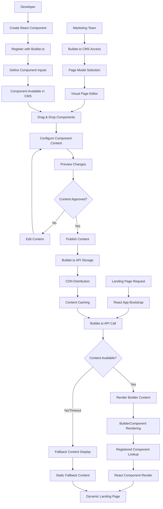

#### Builder.io Landing Page Integration UX

**Marketing Team Experience:**
1. **CMS Access:** Secure login to Builder.io with role-based permissions
2. **Page Model Selection:** Choose from pre-configured page templates (Home, About, Services, etc.)
3. **Visual Editor:** Drag-and-drop interface with real-time preview
4. **Component Library:** Access to registered Forward components (cards, grids, forms, CTAs)
5. **Content Configuration:** Fill in component inputs (text, images, links, colors)
6. **Preview & Testing:** Multi-device preview with content validation
7. **Publishing:** One-click publish with immediate content deployment
8. **Version Control:** Content history and rollback capabilities

**Registered Component Library for Marketing:**
- **Hero Section Component:** Main landing page hero with title, subtitle, CTA, and background
- **Feature Cards Grid:** Showcase platform features with icons, descriptions, and links
- **Testimonial Carousel:** Customer testimonials with photos and company information
- **FAQ Accordion:** Expandable FAQ sections with rich text content
- **Service Showcase Cards:** $299 Estate Capture Service and other offerings
- **Trust Indicators:** Security badges, compliance certifications, customer logos
- **Call-to-Action Sections:** Sign-up prompts with customizable messaging
- **Educational Content Cards:** HEI education, estate planning guides, platform tutorials

#### Landing Page Spaces & Content Areas

**Dynamic Content Spaces:**
1. **Landing Page Hero:** Marketing controls headline, value proposition, and CTA
2. **Feature Highlights:** Configurable cards showcasing platform capabilities
3. **Service Marketplace:** Dynamic promotion of Estate Capture and other services
4. **Trust & Security Section:** Compliance badges, security certifications, testimonials
5. **Educational Resources:** HEI education content, estate planning guides
6. **Pricing & Plans:** Service pricing with marketing flexibility
7. **FAQ & Support:** Frequently asked questions with marketing-controlled answers

**Content Management Capabilities:**
- **Text Content:** Headlines, descriptions, button text, FAQ answers
- **Visual Assets:** Hero images, service icons, testimonial photos, backgrounds
- **Link Management:** CTA destinations, navigation links, resource downloads
- **Styling Options:** Color schemes, typography sizes, spacing adjustments
- **A/B Testing:** Version comparison and performance tracking
- **Scheduling:** Content publication timing and campaign coordination

#### Performance & Fallback Strategy

**Marketing Independence Benefits:**
- **No Developer Dependency:** Marketing team creates content without technical assistance
- **Rapid Iteration:** A/B testing and campaign updates within minutes
- **Campaign Coordination:** Time-sensitive promotions and seasonal content
- **Brand Consistency:** Approved component library ensures design system compliance
- **Performance Tracking:** Analytics integration for content effectiveness measurement

### Flow 2: Builder.io Dashboard Cards Integration (Epic 1: Story 1.1 related)

**User Goal:** Display educational and marketing cards within user dashboards that marketing team can control and update independently, providing timely information and service promotion without code deployments

**Entry Points:**
- User dashboard loading with Builder.io card content areas
- Marketing team managing dashboard card content in Builder.io CMS
- Admin interface configuring which Builder.io models appear in different dashboard contexts
- Analytics tracking card interaction effectiveness

**Success Criteria:**
- Dashboard cards load with Builder.io content in under 1 second
- Marketing team can update card content within 10 minutes
- Cards respect user context (plan type, assets, family status)
- Fallback cards display when Builder.io content unavailable
- Card interactions tracked for marketing effectiveness

#### Flow Diagram - Builder.io Dashboard Cards Integration

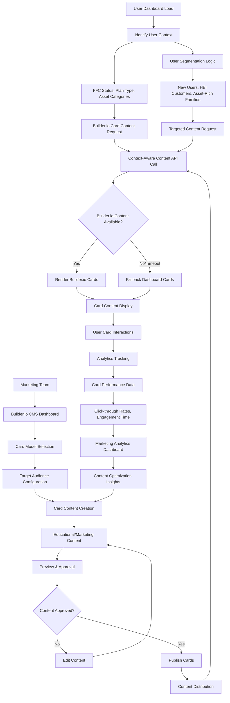

# Epic 2: FFC Onboarding Flow with Enhanced Security

### Flow 3: User Registration & Email Verification (Story 2.1)

**User Goal:** Complete basic user registration with email verification, establishing account foundation for FFC onboarding

**Entry Points:**
- Landing page "Get Started" or "Sign Up" buttons
- Marketing campaign direct links
- Organic registration from referral sources
- Professional advisor invitation links

**Success Criteria:**
- User account created with verified email address
- Strong password requirements enforced
- Security foundation established for subsequent onboarding steps
- Clear progression path to next verification step

#### Flow Diagram - User Registration & Email Verification

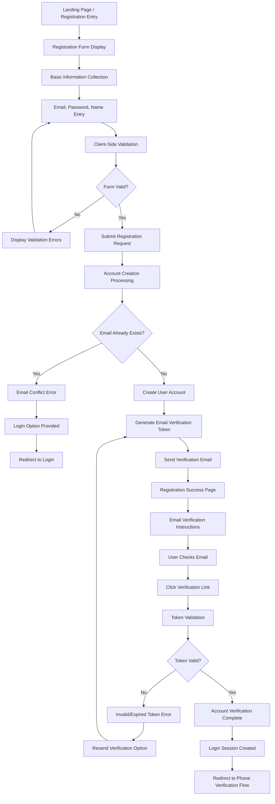

#### Registration Form Design & UX

**Form Structure:**
1. **Core Account Information:**
   - Email address (primary identifier)
   - Secure password (12+ characters, complexity requirements)
   - Full name (first, last)
   - Terms of service and privacy policy acceptance

2. **Password Requirements:**
   - Minimum 12 characters
   - Must include uppercase, lowercase, number, and special character
   - Real-time strength indicator
   - Password confirmation field

3. **Client-Side Validation:**
   - Real-time email format validation
   - Password strength meter with requirements checklist
   - Immediate feedback on field completion
   - Submit button disabled until all requirements met

**Email Verification Experience:**
- **Immediate Confirmation:** "Check your email" page with clear next steps
- **Email Content:** Professional verification email with clear call-to-action
- **Token Security:** Time-limited tokens (24 hours) with single-use enforcement
- **Resend Capability:** Easy resend option if email not received
- **Mobile Optimization:** Verification links work seamlessly on mobile devices

#### Security & Privacy Features

**Account Protection:**
- **Rate Limiting:** Prevent spam registration attempts
- **Email Validation:** Domain verification and disposable email detection
- **Password Hashing:** Secure bcrypt hashing with appropriate rounds
- **Session Security:** Secure session tokens with proper expiration

**Privacy Compliance:**
- **Data Minimization:** Collect only essential information at registration
- **Terms Acknowledgment:** Clear consent for data processing
- **Privacy Policy:** Transparent data usage disclosure
- **Cookie Consent:** GDPR-compliant cookie usage notification

#### Error Handling & Edge Cases

**Common Registration Issues:**
- **Email Format Errors:** Real-time validation with helpful formatting hints
- **Password Strength Issues:** Progressive strength indicator with specific guidance
- **Duplicate Email:** Clear messaging with login redirection option
- **Server Errors:** Graceful error handling with retry mechanisms

**Email Verification Issues:**
- **Email Delivery Delays:** Patient waiting messaging with resend option
- **Token Expiration:** Clear expiration messaging with easy re-verification
- **Email Client Issues:** Alternative verification instructions for different email providers
- **Spam Filter Problems:** Guidance for checking spam folders and whitelisting

**Accessibility Features:**
- **Screen Reader Support:** Proper ARIA labels and form field descriptions
- **Keyboard Navigation:** Full keyboard accessibility for all form elements
- **High Contrast Support:** Color schemes that work for visually impaired users
- **Clear Error Messages:** Descriptive error messages linked to specific fields

### Flow 4: FFC Creation Wizard (Story 2.2)

**User Goal:** Guide users through creating their Family Financial Circle (FFC) with appropriate structure for their family situation

**Entry Points:** 
- Post-phone verification redirection
- Direct navigation to FFC setup from onboarding checklist
- Fresh account login without existing FFC

**Success Criteria:**
- FFC created with appropriate family structure
- Clear family hierarchy and ownership established
- Initial persona (self) created and linked to FFC
- Foundation set for adding family members and assets

#### Flow Diagram - FFC Creation Wizard

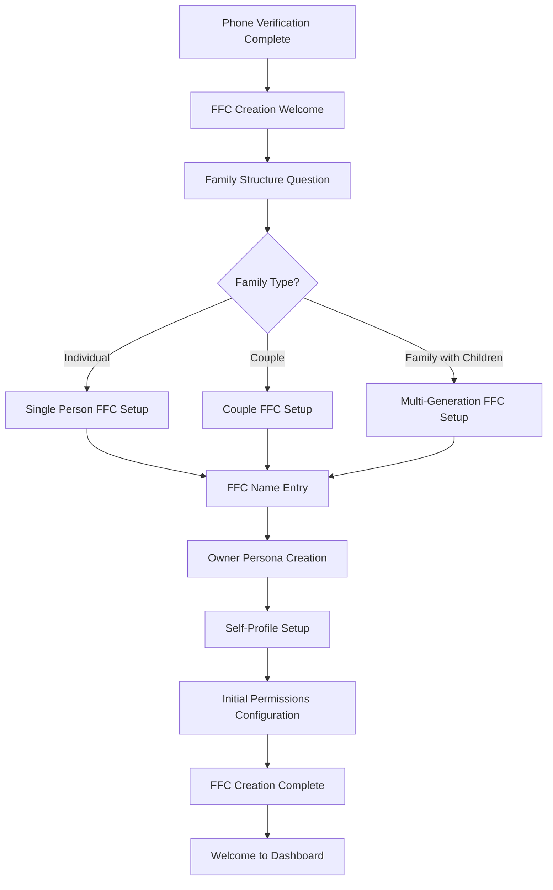

**FFC Setup Experience:**

1. **Family Structure Selection:**
   - Individual/single person setup
   - Couple/partnership setup  
   - Multi-generational family setup
   - Each path customizes subsequent steps

2. **FFC Naming & Branding:**
   - Default name suggestions based on family structure
   - Custom name entry with validation
   - Optional description field
   - Privacy level selection (private/invite-only/etc.)

3. **Owner Persona Creation:**
   - Self-profile as primary owner
   - Basic demographic information
   - Role designation (head of household, co-owner, etc.)
   - Initial permission level assignment

4. **Foundation for Growth:**
   - Clear next steps for adding family members
   - Asset addition preparation
   - Security settings overview
   - Invitation system introduction

### Flow 5: Enhanced Member Invitation System (Story 2.3)

**User Goal:** Invite family members to join the FFC with appropriate permission levels and verification requirements

**Entry Points:**
- FFC Dashboard "Invite Family Member" action
- Member management screen
- Onboarding completion prompt

**Success Criteria:**
- Family member invited with clear expectations
- Appropriate permission level assigned
- Secure invitation delivery and verification
- New member onboarding experience initiated

#### Flow Diagram - Member Invitation System

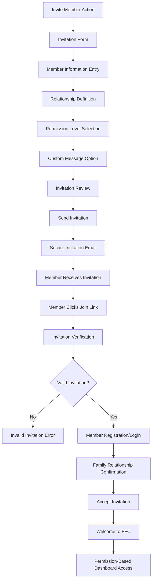

### Flow 6: Phone Verification System (Story 2.4)

**User Goal:** Complete phone number verification using SMS-based authentication

**Entry Points:**
- Post-email verification redirect
- Security settings phone update
- Account recovery process

**Success Criteria:**
- Phone number verified via SMS code
- Backup verification methods available
- Security foundation enhanced for account access
- Clear progression to FFC creation

#### Flow Diagram - Phone Verification

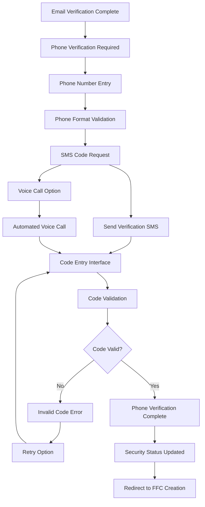

### Flow 7: Owner Approval Workflow (Story 2.5)

**User Goal:** Enable FFC owners to approve sensitive actions and member requests with proper verification

**Entry Points:**
- Member invitation acceptance
- Asset permission changes
- Sensitive document access requests
- FFC structural changes

**Success Criteria:**
- Owner notified of approval request
- Secure approval mechanism provided
- Clear audit trail maintained
- Appropriate access granted upon approval

#### Flow Diagram - Owner Approval Workflow  

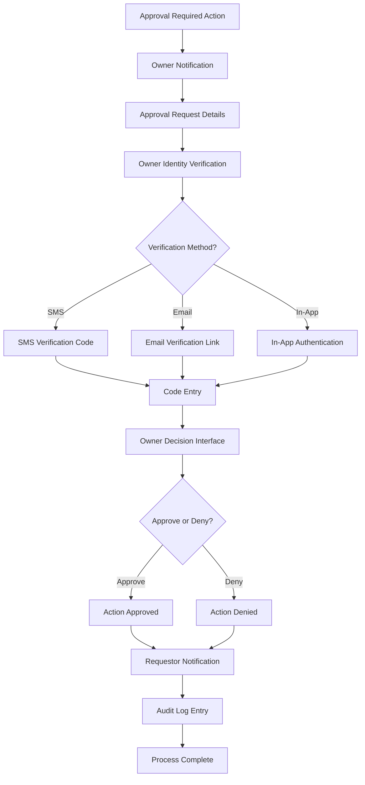

# Epic 3: Comprehensive Asset Management System

### Flow 8: Asset Category Infrastructure (Story 3.1)

**User Goal:** Create and manage assets using progressive data collection across all 14 asset categories with reduced and advanced attribute sets

**Entry Points:**
- Dashboard "Add Asset" quick action
- Assets screen category-specific "Add" buttons
- API-driven asset creation (Quillt, Estate Ingestion services)
- Bulk import interface for multiple assets

**Success Criteria:**
- Asset created with **Reduced Attribute Set** (MVP viable)
- Clear indication of **Advanced Attributes** available for enhancement
- Seamless transition between manual entry and API-enhanced data
- Visual progress indicators showing data completeness

#### Flow Diagram - Asset Category Infrastructure

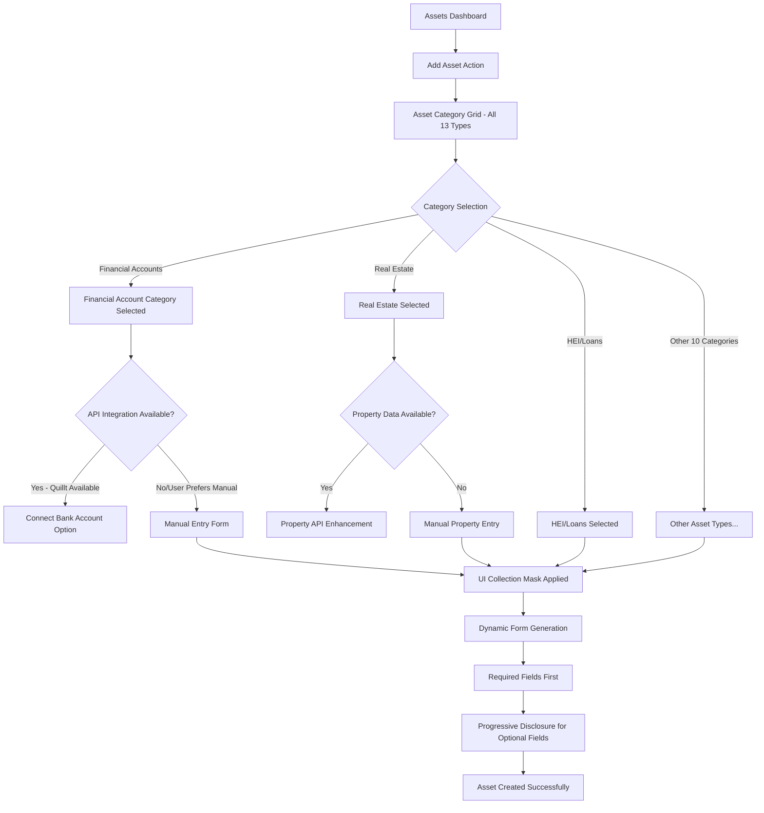

**Asset Category Infrastructure Details:**

**All 13 Asset Categories Supported:**
1. **Valuables** (Art, Collectibles, Jewelry, Antiques)
2. **Real Estate** (Primary residence, Investment, Commercial, Land)
3. **Financial Accounts** (Investment, Bank, Retirement, College savings)
4. **Loans** (HEI via API, Interfamily loans, Mortgages)
5. **Life Insurance** (Term, Whole, Universal, Variable)
6. **Digital Assets** (Intellectual Property, Cryptocurrency, Digital accounts)
7. **Ownership Interests** (Business equity, Franchises, Partnerships)
8. **Recurring Income** (Royalties, Pensions, Rental income)
9. **Operational Property** (Vehicles, Boats, Equipment, Appliances)
10. **Inventory** (Business stock, Collections, Commodities)
11. **Personal Property** (Furniture, Electronics, Personal items)
12. **Intangible Assets** (Patents, Trademarks, Copyrights)
13. **Other Assets** (Miscellaneous valuable items)

### Flow 9: Asset-Persona Ownership Model (Story 3.2)

**User Goal:** Establish clear ownership relationships between family personas and assets with appropriate permission levels

**Entry Points:**
- Asset creation completion
- Existing asset ownership modification
- Family member addition requiring asset access

**Success Criteria:**
- Clear asset ownership assigned to specific personas
- Permission levels properly configured
- Family members understand their access rights
- Audit trail maintained for ownership changes

### Flow 10: Document Upload with PII Protection (Story 3.3)

**User Goal:** Upload asset-related documents with automatic PII detection and masking for privacy protection

**Entry Points:**
- Asset detail "Add Documents" action
- Document management section
- Bulk document upload interface

**Success Criteria:**
- Documents uploaded securely with encryption
- PII automatically detected and masked
- Permission-based access to original vs masked versions
- Clear processing status and completion feedback

### Flow 11: Individual Asset Permissions (Story 3.4)

**User Goal:** Configure granular permission levels for specific assets and family members

**Entry Points:**
- Asset detail permission settings
- Family member role configuration
- Permission audit and review interface

**Success Criteria:**
- Fine-grained permission control established
- Clear visibility into who can access what
- Permission changes properly communicated
- Security compliance maintained

### Flow 12: Asset Dashboard & Visualization (Story 3.5)

**User Goal:** View comprehensive asset overview with visual representations and key metrics

**Entry Points:**
- Main dashboard navigation
- Asset portfolio summary access
- Financial reporting interface

**Success Criteria:**
- Clear visual representation of asset portfolio
- Key metrics and values prominently displayed
- Filtering and sorting capabilities functional
- Mobile-responsive visualization quality

### Flow 13: HEI Integration & Asset Management (Story 3.6)

**User Goal:** Seamlessly manage HEI (Home Equity Investment) assets with specialized interfaces and real-time data

**Entry Points:**
- HEI customer onboarding completion
- Existing HEI asset management
- HEI service marketplace

**Success Criteria:**
- HEI assets properly integrated and displayed
- Real-time HEI data synchronization
- Specialized HEI management interfaces
- Clear HEI-specific documentation and reporting

### Flow 14: Free Plan Onboarding (Story 3.7)

**User Goal:** Access full platform capabilities through free unlimited plan without payment barriers

**Entry Points:**
- New user registration completion
- Plan selection interface
- Service marketplace discovery

**Success Criteria:**
- Full access to all core features without payment
- Clear understanding of plan benefits
- Service marketplace appropriately presented
- Smooth transition to paid services if desired

### Flow 15: One-Time Service Purchase (Story 3.8)

**User Goal:** Purchase professional services like Estate Capture Service through integrated payment flow

**Entry Points:**
- Service marketplace browsing
- Professional service recommendations
- Estate planning workflow

**Success Criteria:**
- Secure payment processing through Stripe
- Clear service details and expectations
- Professional service successfully initiated
- Payment confirmation and service tracking

### Flow 16: Dynamic UI for Plan Types (Story 3.9)

**User Goal:** Experience adaptive interface that adjusts based on current plan type and service purchases

**Entry Points:**
- Plan changes and upgrades
- Service purchase completion
- Feature access attempts

**Success Criteria:**
- UI dynamically adapts to plan capabilities
- Clear indication of available vs premium features
- Smooth upgrade paths when needed
- Consistent experience across plan types

# Epic 4: Advanced Features & Integrations

### Flow 17: Twilio SMS 2FA Integration (Story 4.1)

**User Goal:** Enhanced security through SMS-based two-factor authentication for sensitive operations

**Entry Points:**
- Sensitive action initiation
- Security settings configuration
- Account recovery processes

**Success Criteria:**
- Reliable SMS delivery through Twilio
- Secure 2FA code generation and validation
- Backup authentication methods available
- Clear user guidance throughout process

### Flow 18: Quiltt API Integration for Financial Accounts (Story 4.2)

**User Goal:** Connect bank accounts seamlessly through Quiltt with automatic data synchronization

**Entry Points:**
- Financial account addition
- Account connection interface
- Data synchronization management

**Success Criteria:**
- Secure bank account connection
- Real-time account data synchronization
- Graceful fallback to manual entry
- Clear connection status and management

### Flow 19: Advanced Search & Filtering System (Story 4.5)

**User Goal:** Quickly locate assets, documents, and family information using intelligent search capabilities

**Entry Points:**
- Global search interface
- Asset browsing and filtering
- Document discovery needs

**Success Criteria:**
- Fast and accurate search results
- Intelligent filtering options
- Search history and saved searches
- Mobile-optimized search experience

### Flow 20: Comprehensive Reporting & Analytics (Story 4.6)

**User Goal:** Generate detailed reports for personal planning and professional compliance

**Entry Points:**
- Reporting dashboard access
- Professional advisor requirements
- Compliance documentation needs

**Success Criteria:**
- Comprehensive report generation
- Professional-quality output
- Customizable report parameters
- Export capabilities for various formats

# Epic 5: Multi-Language Support

### Flow 21: Spanish Language Foundation (Story 5.1)

**User Goal:** Access platform in Spanish with culturally appropriate content and full functionality

**Entry Points:**
- Language selection during registration
- Language settings modification
- Spanish-speaking user referrals

**Success Criteria:**
- Complete Spanish translation
- Cultural adaptation for US Spanish-speaking market
- All features functional in Spanish
- Professional service integration maintained

# Epic 6: SOC 2 Compliance & Trust Management Platform

### Flow 22: SOC 2 Compliance & Trust Management Platform (Stories 6.1-6.6)

**User Goal:** Demonstrate platform security and compliance through transparent trust center

**Entry Points:**
- Security inquiry from prospects
- Compliance documentation requests
- Trust center public access

**Success Criteria:**
- Transparent security information display
- Automated compliance reporting
- Professional confidence in platform security
- Clear security questionnaire responses

# Epic 7: Performance Optimization

### Flow 23: React Performance Optimization & User Experience Enhancement (Stories 7.1-7.7)

**User Goal:** Experience fast, responsive interface optimized for multi-generational users

**Entry Points:**
- All user interactions
- Page loading and navigation
- Mobile device usage

**Success Criteria:**
- Sub-2-second page load times
- Smooth animations and transitions
- Optimized mobile performance
- Accessibility compliance maintained

## Legacy Content Archive

*Note: The following sections contain detailed content from the original flows that can be extracted and integrated into the appropriate Epic-aligned flows above as needed for comprehensive implementation.*
    
    %% Zillow Address-Based Integration Flow
    G2 --> I2[Property Address Collection Form]
    I2 --> J2[User Enters Property Address]
    J2 --> K2[Submit Address to Zillow API]
    K2 --> L2{Property Found in Zillow?}
    L2 -->|Yes| M2[Zillow Property Data Retrieved]
    L2 -->|No| Q2[Property Not Found - Fallback to Manual]
    Q2 --> H2
    M2 --> N2[Auto-populate Property Details from Zillow]
    N2 --> O2[Create Asset with Zillow Auto-Update Enabled]
    O2 --> P2[Asset Created - Zillow Enhanced Status]
    
    %% HEI/Loans - API First Path
    E3 --> F3{HEI API Available?}
    F3 -->|Yes - HEI Integration| G3[Connect HEI Account]
    F3 -->|No/Manual Entry| H3[Manual Loan Entry]
    G3 --> I3[HEI API Authentication]
    I3 --> N1
    
    %% Other Categories - Manual Primary Path
    E4 --> H4[Manual Asset Entry]
    
    %% Manual Entry Flow (All Categories)
    H1 --> R[API Call: /ui-collection-mask/asset-form/FINANCIAL_ACCOUNTS]
    H2 --> S[API Call: /ui-collection-mask/asset-form/REAL_ESTATE]
    H3 --> T[API Call: /ui-collection-mask/asset-form/LOANS]
    H4 --> U[API Call: /ui-collection-mask/asset-form/CATEGORY]
    
    R --> V[Merge Base + Type-Specific Fields]
    S --> V
    T --> V
    U --> V
    
    %% Connect API Enhanced Assets to Dashboard
    P1 --> NN[Dashboard Asset Card]
    P2 --> NN[Dashboard Asset Card]
    
    V --> W[Dynamic Form Generation]
    
    %% Progressive Disclosure Structure
    W --> X[Section 1: Basic Asset Information - Always Visible]
    X --> Y[Mandatory Base Fields - Asset Name, Value, etc.]
    Y --> Z[Section 2: Asset Type Details - Always Visible]
    Z --> AA[Mandatory Type Fields - Account Type, Property Type, etc.]
    AA --> BB{User Completes Mandatory Fields?}
    
    BB -->|No| CC[Real-time Validation Feedback]
    CC --> Y
    BB -->|Yes| DD[Save Core Asset Data]
    
    %% Progressive Enhancement Options
    DD --> EE[Advanced Fields Available Indicator]
    EE --> FF{User Wants Advanced Fields?}
    FF -->|No| GG[Asset Saved - Completion Status: Basic]
    FF -->|Yes| HH[Show Advanced Fields Section]
    
    HH --> II[Optional Base Fields Group]
    II --> JJ[Optional Type-Specific Fields Group]
    JJ --> KK[Enhanced Data Entry Interface]
    KK --> LL[Save Complete Asset Data]
    LL --> MM[Asset Saved - Completion Status: Comprehensive]
    
    %% Post-Creation API Enhancement (For Manual Entries Only)
    GG --> NN[Dashboard Asset Card]
    MM --> NN
    P1 --> NN
    
    NN --> OO{Post-Creation API Enhancement Available?}
    OO -->|Yes - For Manual Entries| PP[Connect to API Later]
    OO -->|No/Already API Enhanced| QQ[Manual Enhancement Only]
    
    PP --> RR[Secondary API Integration]
    QQ --> SS[Manual Field Updates]
    RR --> TT[Enhanced Asset View]
    SS --> TT
    
    %% Asset Management Actions
    TT --> UU[Edit Asset]
    TT --> VV[Manage Permissions]
    TT --> WW[Add Documents]
    TT --> XX[View Enhancement History]
```

#### API-First Integration UX Experience

**Financial Accounts - Quillt Embedded Connector Flow:**
1. **Category Selection**: User selects "Financial Accounts" from asset grid
2. **Integration Choice**: Primary CTA "Connect Your Bank Account" with secondary "Enter Manually" option
3. **Quillt Connector Takeover**: React embedded component fills screen with Quillt branding
4. **Bank Selection**: User selects their financial institution from Quillt's bank list
5. **Authentication**: Secure OAuth flow through bank's authentication system
6. **Token Exchange**: Nest.js middleware securely handles token exchange with bank
7. **Field Configuration**: Admin/user configures which account fields to collect automatically
8. **Data Population**: Account information automatically populates UI Collection Mask fields
9. **Review & Save**: User reviews auto-populated data, can add additional manual fields
10. **Success State**: Asset created with "API Enhanced" badge and automatic update capabilities

**Real Estate - Zillow Address-Based Integration Flow:**
1. **Category Selection**: User selects "Real Estate" from asset grid
2. **Integration Choice**: Primary CTA "Find Property Details" with secondary "Enter Manually" option
3. **Address Collection**: Simple form asking for property address
   - Street address (required)
   - City, State, ZIP (required)
   - Address autocomplete/validation
4. **Zillow API Lookup**: Submit address to Zillow API for property search
5. **Property Match Confirmation**: Show Zillow property details for user confirmation
   - Property photos, estimated value, property type
   - "Is this your property?" confirmation
6. **Auto-Population**: Zillow data automatically fills UI Collection Mask fields:
   - Property type (Single Family, Condo, etc.)
   - Estimated current value
   - Square footage, lot size
   - Year built, bedrooms, bathrooms
7. **Manual Override**: User can modify auto-populated values or add additional details
8. **Auto-Update Setup**: Enable ongoing property value updates from Zillow
9. **Success State**: Asset created with "Zillow Enhanced" badge and scheduled value updates

**HEI/Loans - API Integration Flow:**
1. **Category Selection**: "HEI/Loans" selected from asset grid
2. **Integration Option**: "Connect HEI Account" prominent option
3. **HEI Authentication**: Direct API connection with HEI provider
4. **Loan Data Import**: Automatic population of loan details, balances, terms
5. **Manual Override**: User can modify or add additional loan information

**API Connection Failure Handling:**
- **Graceful Degradation**: "Unable to find property details. Let's add this property manually."
- **Retry Options**: "Try Different Address" and "Enter Manually" clearly presented
- **Progress Preservation**: Address information saved for potential retry
- **Clear Communication**: "You can always connect to Zillow updates later from the asset details"

**Category Grid API Indicators:**
- **API Available**: Green "⚡ Auto-Connect" badge on Financial Accounts, Real Estate, HEI/Loans
- **Manual Only**: Standard entry icon for Personal Property, Digital Assets, etc.
- **Field Count Preview**: "Find property automatically or enter 8 fields manually"

#### Manual Entry UI Collection Mask Form Experience by Asset Type

**Real Estate Manual Entry Flow:**
1. **Category Selection**: Visual card with house icon, field count preview "(5 required, 8 optional)"
2. **Basic Asset Information** (Always Visible):
   - Asset name (text) - "Main Family Home"
   - Current value (currency) - Auto-formats to $1,234,567
3. **Real Estate Details** (Always Visible):
   - Property type (enum) - Dropdown: Single Family, Condo, Townhouse...
   - Property address (text) - Address validation
   - Purchase date (date) - Date picker with year selector
4. **Advanced Fields** (Expandable):
   - Property use (enum) - Primary Residence, Rental, Investment...
   - Mortgage information (currency) - Remaining balance
   - Property tax details (currency) - Annual amount
   - Insurance information (text) - Policy details

**Financial Accounts Example Flow:**
1. **Category Selection**: Bank icon, "(4 required, 6 optional)"
2. **Basic Asset Information**:
   - Asset name (text) - "Primary Checking Account"
   - Current value (currency) - $45,678.90
3. **Financial Account Details**:
   - Account type (enum) - Checking, Savings, Investment...
   - Institution name (text) - "Chase Bank"
   - Account number (text) - Masked input for security
4. **Advanced Fields**:
   - Interest rate (real) - Decimal input with % symbol
   - Account opening date (date)
   - Quillt integration toggle (API enhancement option)

#### User Experience Enhancements

**Progressive Disclosure Indicators:**
- **Field Count Preview**: "Show 6 Additional Fields" button with count
- **Completion Progress**: Visual progress bar showing mandatory vs optional completion
- **Enhancement Hints**: "💡 Connect to Quillt for automatic updates" contextual messages
- **Draft Save Indicators**: Auto-save status with "Draft saved 2 minutes ago"

**Smart Field Behaviors:**
- **Currency Fields**: Auto-format with commas, currency symbol, decimal precision
- **Enum Fields**: Searchable dropdowns with descriptions for complex choices
- **Date Fields**: Smart year selection for historical dates (property purchases, etc.)
- **Phone Fields**: Auto-format with country code detection
- **Validation**: Real-time feedback with field-specific error messages

**Cross-Category Consistency:**
- All 14 asset categories follow identical interaction patterns
- Consistent field types ensure predictable user experience
- Same progressive disclosure structure across all forms
- Unified enhancement and API connection workflows

#### Progressive Asset Attribute Architecture:

**Reduced Attribute Set (UI Entry Essential):**
- Asset name/description
- Estimated value (optional)
- Primary owner persona
- Basic location/account info
- Key documents (if available)

**Advanced Attribute Set (API/Service Enhanced):**
- Detailed valuations with historical data
- Complete ownership percentages and legal structures
- Comprehensive document sets with metadata
- Integration-specific data (account numbers, API identifiers)
- Professional appraisals and third-party valuations

#### Asset Categories Covered (All 13):
1. **Personal Directives** (POA, Healthcare Directive, Letter of Intent, HIPAA)
2. **Trust** (Revocable, Irrevocable, Charitable trusts)
3. **Will** (Primary, Secondary, Codicils)
4. **Personal Property** (Jewelry, Art, Pets, Furniture, Collections)
5. **Operational Property** (Vehicles, Boats, Equipment, Appliances)
6. **Inventory** (Business stock, Collections, Commodities)
7. **Real Estate** (Primary residence, Investment, Commercial, Land)
8. **Life Insurance** (Term, Whole, Universal, Variable)
9. **Financial Accounts** (Investment, Bank, Retirement, College savings)
10. **Recurring Income** (Royalties, Pensions, Rental income)
11. **Digital Assets** (Intellectual Property, Cryptocurrency, Digital accounts)
12. **Ownership Interests** (Business equity, Franchises, Partnerships)
13. **Loans** (HEI via API, Interfamily loans, Mortgages)

### Flow 5: Subscription & Payment Platform Management

**User Goal:** Navigate the subscription model from free unlimited plan through one-time service purchases, with dynamic UI that adapts to plan type

**Entry Points:**
- New user onboarding (defaults to Free Unlimited Plan)
- Service marketplace discovery ("$299 Estate Capture Service")
- Billing settings and plan management
- Advisor-sponsored plan setup

**Success Criteria:**
- Free plan user can access all core features without payment barriers
- Service purchase flow completes successfully with Stripe integration
- Dynamic UI hides/shows features based on current plan type
- Clear understanding of plan benefits and limitations

#### Flow Diagram - Subscription & Payment Platform

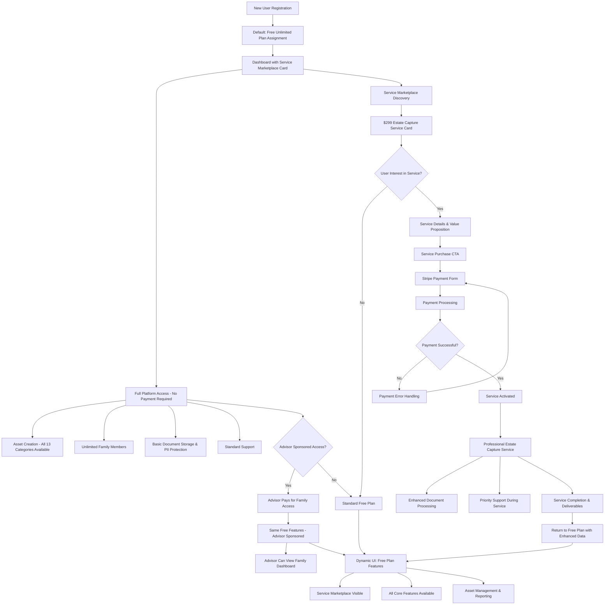

#### Service Purchase UX Experience

**Estate Capture Service ($299) Purchase Flow:**
1. **Service Discovery**: Featured card on dashboard with clear value proposition
2. **Service Details Page**: 
   - Timeline: "Complete within 2 weeks"
   - Deliverables: "Professional asset inventory + documentation"
   - Process: "Dedicated estate specialist assigned"
3. **Purchase Interface**:
   - Stripe payment form with saved payment methods
   - Clear pricing: "$299 one-time fee"
   - Service agreement and timeline acknowledgment
4. **Service Activation**:
   - Immediate confirmation email
   - Service progress dashboard widget
   - Direct contact with assigned specialist

**Advisor Sponsorship Model:**
- **Advisor Payment**: Advisor pays for family's access (no plan changes for family)
- **Family Experience**: Identical free unlimited plan experience
- **Advisor Benefits**: Can view sponsored family's dashboard and reports
- **No Plan Tiers**: All families get same feature set regardless of who pays

**Dynamic UI Adaptation:**
- **Free Plan UI**: All core features visible, service marketplace promoted
- **Service Active UI**: Progress tracking, specialist contact, priority support
- **Advisor Sponsored UI**: Same features as free plan, with advisor visibility indicator

#### Payment Processing & Receipt System

**Stripe Integration Experience:**
- **Saved Payment Methods**: Users can save cards for future services
- **Receipt Generation**: Automatic PDF receipts with Forward branding
- **Refund Handling**: Clear refund policy with 7-day satisfaction guarantee
- **Failed Payment Recovery**: Retry mechanisms with multiple payment options

#### Subscription Flow Architecture:

**Free Unlimited Plan (Default):**
- No payment required at signup
- Unlimited family members (no seat restrictions)
- All 14 asset categories available
- Basic document storage and PII protection
- Standard support via help documentation

**One-Time Service Purchase ($299 Estate Capture):**
- Service marketplace interface
- Stripe payment integration
- Professional estate data capture service
- Enhanced document processing
- Priority support during service period

### Flow 6: Advanced Search & Filtering System

**User Goal:** Quickly locate specific assets, family members, documents, or activities across complex family estate data using intelligent search and filtering capabilities

**Entry Points:**
- Global search bar in header (all screens)
- Assets screen advanced filter interface
- Members screen search and filter
- Documents center search functionality
- Audit trail search and investigation tools

**Success Criteria:**
- Users can find any asset, member, or document within 3 clicks
- Search results are contextually relevant and permission-filtered
- Advanced filters help narrow large result sets effectively
- Search analytics provide insights for system optimization

#### Flow Diagram - Advanced Search & Filtering System

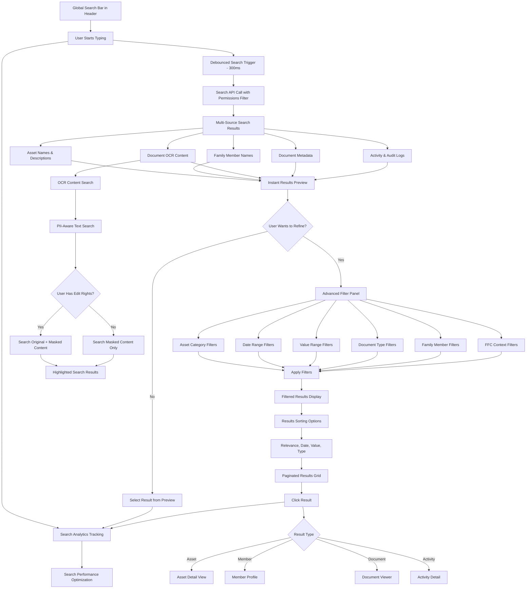

#### Advanced Search UX Features

**Intelligent Search Suggestions:**
- **Auto-complete**: Recent searches and popular queries
- **Smart Categories**: "Search in Real Estate assets only"
- **Contextual Filters**: "Search within Seitz Family" when FFC selected
- **Typo Tolerance**: Fuzzy matching for misspelled asset names

**OCR Document Search Experience:**
- **Permission-Aware**: Edit rights users search original content, view-only users search masked content
- **Content Highlighting**: Search terms highlighted in document preview
- **Document Context**: Shows surrounding text for search result context
- **Processing Status**: Clear indicators for documents still being processed

**Search Results Organization:**
- **Type Indicators**: Clear icons for assets, members, documents, activities
- **Relevance Scoring**: Most relevant results appear first
- **Quick Actions**: "Edit Asset", "View Document", "Contact Member" directly from results
- **Saved Searches**: Bookmark complex searches for repeated use

#### Edge Cases & Performance

**Performance Optimizations:**
- **Debounced Input**: 300ms delay prevents excessive API calls
- **Cached Results**: Common searches cached for 5 minutes
- **Progressive Loading**: Show top results immediately, load more on scroll
- **Search Analytics**: Track search patterns for optimization

**Error Handling:**
- **No Results**: Helpful suggestions to refine search
- **Permission Denied**: Clear explanation of access limitations
- **Search Timeout**: Retry options for complex searches
- **Offline Search**: Basic cached search when connectivity is poor

#### Search Architecture Layers:

**Global Search (Header Bar):**
- **Omnisearch:** Single input field searches across assets, members, documents, activities
- **Smart Suggestions:** Auto-complete with recent searches and popular queries
- **Quick Results:** Instant preview of top matches while typing
- **Scoped Search:** Filter results by FFC context or expand to all accessible data

**Document Content Search:**
- **OCR Text Search:** Search within uploaded document content using processed text
- **Document Type:** Filter by document category (legal, financial, personal, etc.)
- **PII Detection Status:** Find documents with/without detected PII
- **Processing Status:** Filter by upload status, processing completion, error states

### Flow 7: Comprehensive Reporting & Analytics Dashboard

**User Goal:** Generate, customize, and share detailed reports about family wealth, asset distribution, and estate planning progress for personal planning and professional compliance

**Entry Points:**
- Dashboard "View Reports" quick action
- Assets overview "Generate Report" button
- Settings menu "Reports & Analytics"
- Scheduled report delivery via email
- Advisor dashboard bulk reporting tools

**Success Criteria:**
- Generate comprehensive wealth distribution reports within 30 seconds
- Export reports in multiple formats (PDF, Excel, CSV) for different audiences
- Schedule automated report delivery to family members and advisors
- Compliance-ready audit reports with proper documentation trails

#### Report Categories & Types:

**Wealth & Asset Reports:**
- **Estate Summary Report:** Total estate value, category breakdown, ownership distribution
- **Asset Allocation Analysis:** Investment diversification across categories and risk levels
- **Valuation History Report:** Asset value trends over time with appreciation/depreciation
- **Geographic Distribution:** Asset locations mapped for tax and estate planning
- **Liquidity Analysis:** Cash vs illiquid asset ratios for estate planning purposes

**Compliance & Audit Reports:**
- **Complete Audit Trail:** All system activities with timestamps and responsible parties
- **Document Status Report:** Missing documents, expiring policies, PII processing status
- **Security Activity Report:** Login attempts, permission changes, suspicious activities
- **Regulatory Compliance Report:** SOC 2 compliance status and evidence collection

### Flow 8: Real-Time Communication & Notification System

**User Goal:** Stay informed about important family estate activities, receive timely notifications about changes requiring attention, and coordinate with family members through real-time updates

**Entry Points:**
- Real-time dashboard updates and live badges
- Push notifications on mobile devices
- Email notification preferences in settings
- In-app notification center with action items
- WebSocket-powered live activity feeds

**Success Criteria:**
- Family members receive immediate notifications for relevant changes
- Notification preferences respect user's role and interest level
- Critical actions (permission changes, document expiration) never missed
- Real-time collaboration feels natural and unobtrusive

#### Real-Time Notification Categories:

**Asset & Ownership Updates:**
- **New Asset Added:** Notification when family member adds asset to shared FFC
- **Asset Value Changes:** Significant valuation updates from API integrations or manual edits
- **Ownership Transfers:** Real-time alerts when asset ownership percentages change
- **Document Processing:** PII detection completion, document approval, or processing errors
- **Permission Changes:** Immediate notification when asset access levels are modified

**System & Compliance Notifications:**
- **Document Expiration Alerts:** Proactive warnings for expiring insurance, legal documents
- **Missing Documentation:** Periodic reminders about incomplete asset documentation
- **Compliance Deadlines:** SOC 2 audit requirements, regulatory reporting deadlines
- **Integration Status:** API connection failures, sync errors, or data quality issues
- **Security Alerts:** Failed login attempts, unusual access patterns, system security updates

### Flow 9: SOC 2 Compliance & Trust Management Platform

**User Goal:** Demonstrate platform security and compliance to families, advisors, and regulatory bodies through transparent trust center and automated compliance management

**Entry Points:**
- Public trust center (accessible before login)
- Dashboard compliance status widget
- Settings menu "Security & Compliance"
- Advisor portal compliance reporting
- Customer security questionnaire responses

**Success Criteria:**
- Public trust center builds confidence in platform security
- Real-time compliance status monitoring prevents audit surprises
- Automated evidence collection reduces manual compliance burden
- Security questionnaires completed efficiently for enterprise sales

#### Customer-Facing Trust Center (Public):

**Security Transparency Dashboard:**
- **SOC 2 Compliance Status:** Current Type II audit status with certificate display
- **Security Certifications:** Display of current security certifications and standards
- **Uptime & Reliability:** Real-time service availability with historical performance
- **Data Protection:** Clear explanation of encryption, backup, and privacy practices
- **Incident Transparency:** Public security incident log with resolution details (when appropriate)

### Flow 10: Enhanced Quiltt Financial Asset Flow

**User Goal:** Connect bank accounts through Quiltt integration with seamless fallback to manual entry, providing real-time account data with automatic synchronization

**Entry Points:**
- Assets screen "Add Financial Account" with prominent "Connect Bank Account" option
- Dashboard "Quick Add Asset" selecting Financial Accounts category
- Empty state card for Financial Accounts with "Connect Banking" CTA

**Success Criteria:**
- Users can successfully connect multiple bank accounts through Quiltt in under 3 minutes
- Failed connections gracefully fallback to manual entry without data loss
- Connected accounts display real-time balances with clear API enhancement indicators
- Users understand the difference between manual and API-connected accounts

#### Flow Diagram - Enhanced Quiltt Financial Asset Flow

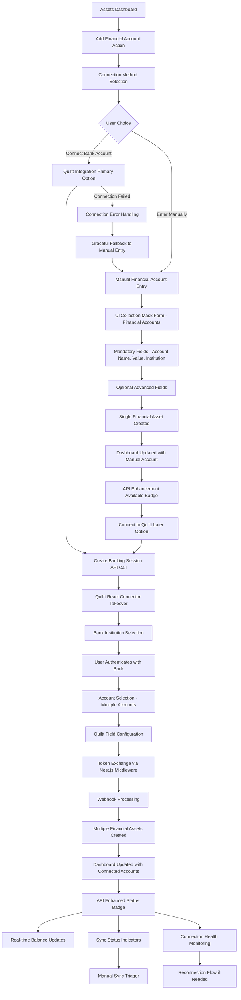

#### Quiltt Integration UX Experience

**Connection Method Selection:**
- **Primary CTA:** "Connect Your Bank Account" with Quiltt branding and security badges
- **Secondary Option:** "Enter Account Manually" as clear alternative
- **Value Proposition:** "Automatic balance updates, secure OAuth connection, 5,000+ banks supported"
- **Security Indicators:** Bank-level encryption, read-only access, no credential storage

**Quiltt Connector Takeover Experience:**
1. **Session Creation:** Loading state while creating secure session token
2. **Quiltt UI Integration:** React connector takes full screen with Forward branding context
3. **Bank Selection:** User searches/selects from 5,000+ supported financial institutions
4. **OAuth Authentication:** Secure redirect to bank's login system
5. **Account Selection:** Multi-select interface for choosing accounts to connect (checking, savings, investment)
6. **Field Configuration:** User/admin configures which account details to sync automatically
7. **Connection Confirmation:** Success state showing connected accounts count
8. **Asset Creation:** Automatic creation of individual financial account assets for each connected account

**Connection Status & Management:**
- **Connected Account Badges:** "🔗 Quiltt Connected" with last sync timestamp
- **Manual Account Indicators:** "📝 Manual Entry" with "Connect Banking" upgrade option
- **Sync Status Display:** Real-time status, last successful sync, any connection issues
- **Balance Update Animations:** Smooth number transitions when balances update
- **Connection Health:** Green/yellow/red status indicators for connection quality

**Error Handling & Fallback:**
- **Connection Timeout:** "Unable to connect to [Bank Name]. Let's add this account manually."
- **Authentication Failure:** "Bank authentication unsuccessful. Retry or enter manually?"
- **Partial Success:** "2 of 3 accounts connected successfully. Add remaining account manually?"
- **No Accounts Selected:** "No accounts were selected. Choose accounts or continue manually."
- **Session Expiry:** "Banking session expired. Start over or enter account details manually?"

#### Post-Connection Asset Management

**Multi-Account Creation:**
- Individual asset cards created for each connected account (e.g., "Chase Checking", "Chase Savings", "Chase Investment")
- Automatic naming convention: "[Institution] [Account Type]" with ability to customize
- 100% ownership automatically assigned to connecting persona
- Account-specific metadata (account number last 4, account type, balance, sync status)

**Ongoing Sync Management:**
- **Automatic Sync:** Daily balance updates with configurable frequency
- **Manual Sync:** "Refresh Now" button for immediate balance updates
- **Sync Conflict Resolution:** Handle discrepancies between Quiltt and manual overrides
- **Historical Data:** Balance history charts showing sync-updated values over time

**Enhancement Opportunities:**
- **Manual Account Upgrade:** "Connect this account to banking for automatic updates"
- **Additional Institution:** "Connect another bank" CTA on financial accounts overview
- **Data Quality Improvement:** "Enhanced details available via banking connection"

#### Edge Cases & Error Recovery

**Session Management:**
- **Token Expiration:** 15-minute session tokens with automatic cleanup
- **Concurrent Sessions:** Prevent multiple active banking sessions per user
- **Session Recovery:** Resume interrupted connections where possible

**Account Deduplication:**
- **Existing Manual Accounts:** Detect and offer to upgrade manually entered accounts
- **Re-connection:** Handle re-connecting previously connected accounts
- **Institution Changes:** Manage accounts when bank mergers/name changes occur

**Privacy & Security:**
- **Credential Isolation:** No bank credentials stored in Forward system
- **Token Encryption:** All Quiltt tokens encrypted at rest using AWS KMS
- **Access Scope:** Read-only account access with clear permission explanations
- **Audit Trail:** Complete log of all banking connections and sync activities

### Flow 11: HEI Integration & Asset Management

**User Goal:** Seamlessly onboard HEI (Home Equity Investment) customers with pre-populated real estate and loan assets, providing comprehensive HEI asset management capabilities

**Entry Points:**
- External HEI system API ingestion (automated)
- Customer self-registration with HEI lookup during signup
- Admin manual HEI ingestion interface
- Email invitation from completed HEI processing

**Success Criteria:**
- HEI customers can access their complete HEI information immediately upon platform entry
- Real estate and HEI loan assets are properly linked and display comprehensive data
- All HEI-related documents are securely stored with appropriate access controls
- HEI customers can rename their FFC and continue using platform normally

#### Flow Diagram - HEI Integration & Asset Management

```mermaid
graph TD
    A[External HEI System] --> B[POST /ingest/hei API Call]
    B --> C[HEI Data Validation & Processing]
    C --> D[Real Estate Asset Creation]
    D --> E[HEI Loan Asset Creation]
    E --> F[Persona Creation - HEI Owner]
    F --> G[FFC Creation - Default Name]
    G --> H[Asset-Persona Ownership Links]
    H --> I[Document Upload & PII Processing]
    I --> J[Invitation Email Generation]
    J --> K[Email Sent to HEI Customer]
    
    %% Customer Response Path
    K --> L[Customer Receives Invitation]
    L --> M{Customer Action}
    M -->|Clicks Invite Link| N[Platform Signup/Login]
    M -->|Self-Registers Later| O[Self-Registration Flow]
    
    %% Invitation Acceptance Path
    N --> P[Account Creation/Login]
    P --> Q[FFC Access Granted]
    Q --> R[HEI Dashboard Display]
    
    %% Self-Registration Path
    O --> S[Standard Registration Form]
    S --> T[HEI Question: "Have you completed an HEI with us?"]
    T --> U{User Response}
    U -->|No| V[Standard Platform Onboarding]
    U -->|Yes| W[HEI Lookup Interface]
    
    W --> X[User Provides Loan Number/Identifier]
    X --> Y[HEI Record Search]
    Y --> Z{Match Found?}
    Z -->|Yes| AA[Link Account to Existing Persona/FFC]
    Z -->|No| BB[No Match - Continue Standard Registration]
    
    AA --> R
    BB --> V
    
    %% HEI Dashboard Experience
    R --> CC[Real Estate Asset Card]
    R --> DD[HEI Loan Asset Card]
    R --> EE[Document Library Access]
    R --> FF[FFC Rename Capability]
    
    %% Asset Management Actions
    CC --> GG[Property Details & Valuation]
    DD --> HH[Loan Terms & Payment Status]
    EE --> II[Secure Document Viewing with PII Protection]
    FF --> JJ[Custom FFC Name Setting]
    
    %% Ongoing HEI Management
    GG --> KK[Property Value Updates]
    HH --> LL[Loan Balance Tracking]
    II --> MM[Document Version Management]
    JJ --> NN[Family Member Invitations]
```

#### HEI API Ingestion Experience

**External System Integration:**
- **Idempotent API:** `POST /ingest/hei` with Idempotency-Key header for safe re-runs
- **Comprehensive Data:** Property details, HEI terms, owner information, required documents
- **Automatic Asset Creation:** Creates linked real estate and HEI loan assets
- **Document Processing:** Uploads and processes all HEI-related documents with PII protection
- **FFC Generation:** Creates default-named FFC ("HEI Circle - [Applicant Name]")

**Data Ingestion Flow:**
1. **Property Asset Creation:**
   - Real estate asset with address, parcel number, valuation details
   - Property type, use classification, ownership structure
   - Automatic geographic and tax jurisdiction detection

2. **HEI Loan Asset Creation:**
   - Loan type: "HEI" with specific terms and conditions
   - Funded amount, equity share percentage, effective date
   - Maturity terms, fee structure, capital stack details
   - Automatic linking to associated real estate asset

3. **Owner Persona & FFC Setup:**
   - Persona creation with minimal required information
   - FFC creation with default naming convention
   - 100% asset ownership assignment to HEI persona
   - Email invitation generation and delivery

**Required Document Package Processing:**
- **Executed HEI Agreement:** Primary contract document with full terms
- **Recorded Security Instrument:** Deed of trust, memorandum, or lien notice
- **Title Package:** Preliminary title report and related documentation
- **Valuation Report:** AVM certificate, BPO report, or full appraisal
- **Closing Disclosure:** Final settlement statement and funding details
- **Optional Documents:** Tax bills, HOA statements, insurance declarations

#### Customer Self-Registration & HEI Linking

**Enhanced Registration Form:**
- **Standard Fields:** Name, email, password, phone verification
- **HEI Question:** "Have you completed a Home Equity Investment (HEI) with us already?"
- **Progressive Disclosure:** HEI lookup fields only appear if "Yes" selected
- **Lookup Options:** Loan number, property address, or applicant name search
- **Validation & Matching:** Real-time search against existing HEI records

**HEI Lookup Interface:**
- **Primary Identifier:** Loan number input with format validation
- **Alternative Search:** Property address autocomplete with validation
- **Applicant Verification:** Name and contact information confirmation
- **Match Confidence:** Display match confidence and multiple potential matches
- **No Match Handling:** Clear path to continue without HEI linking

**Account Linking Process:**
1. **Identity Verification:** Match user details against HEI persona data
2. **Account Association:** Link user account to existing persona and FFC
3. **Access Grant:** Immediate access to HEI assets and documents
4. **Onboarding Completion:** Skip standard onboarding, direct to HEI dashboard
5. **FFC Customization:** Immediate option to rename FFC from default

#### HEI Dashboard & Asset Management

**Real Estate Asset Display:**
- **Property Overview Card:** Address, property type, current estimated value
- **Valuation History:** Timeline of property valuations with sources (Zillow, appraisal, etc.)
- **Property Details:** Square footage, lot size, year built, bedrooms, bathrooms
- **Tax & HOA Information:** Current tax assessment, HOA dues, jurisdiction details
- **Enhancement Options:** Connect to Zillow for ongoing value updates

**HEI Loan Asset Display:**
- **Loan Summary Card:** Funded amount, equity share, effective date, current status
- **Terms & Conditions:** Detailed loan terms, fees, maturity conditions
- **Capital Stack Visualization:** First mortgage, junior liens, HEI position, CLTV
- **Payment Status:** Current standing, any required actions or notifications
- **Servicing Information:** Monitoring policy, notification contacts, reporting schedule

**Document Library Interface:**
- **Categorized Documents:** Organized by type (agreement, title, financial, legal)
- **PII Protection:** Automatic masking for family members without edit rights
- **Version Control:** Track document updates and amendments over time
- **Secure Access:** Download/view controls based on user permissions
- **Search Capability:** OCR-based search within document content

**FFC Management for HEI Customers:**
- **Rename FFC:** Clear interface to change from default "HEI Circle" name
- **Family Invitations:** Standard invitation flow for family members
- **Asset Sharing:** Configure who can view/edit HEI-related assets
- **Document Permissions:** Control access to sensitive HEI documents

#### HEI-Specific Asset Category Features

**Standalone HEI Asset Category:**
- **Dedicated Category:** HEI/Loans appears as distinct asset category
- **HEI-Specific Fields:** Equity share percentage, maturity terms, monitoring requirements
- **Property Linkage:** Clear visual connection to associated real estate asset
- **Performance Tracking:** Loan performance metrics and alerts

**Enhanced Real Estate Integration:**
- **HEI-Enhanced Properties:** Properties with HEI liens show enhanced detail level
- **Value Monitoring:** Automated property value tracking for HEI requirements
- **Equity Calculations:** Real-time equity position calculations
- **Market Analysis:** Enhanced market data for HEI-secured properties

**Document Management Enhancements:**
- **HEI Document Types:** Specialized document categories for HEI paperwork
- **Recording Tracking:** Monitor recorded instruments and their status
- **Compliance Documentation:** Track required ongoing documentation
- **Amendment Processing:** Handle HEI agreement amendments and modifications

#### Error Handling & Edge Cases

**API Ingestion Errors:**
- **Duplicate Prevention:** Idempotency checks prevent duplicate asset creation
- **Partial Failures:** Handle cases where some data ingests but documents fail
- **Data Validation:** Comprehensive validation with clear error reporting
- **Retry Mechanisms:** Automatic retry for transient failures

**Customer Registration Issues:**
- **Multiple Matches:** Interface for resolving multiple potential HEI matches
- **No Match Found:** Clear messaging with support contact information
- **Partial Information:** Handle cases with incomplete HEI lookup data
- **Email Mismatches:** Process for handling different email addresses

**Ongoing Maintenance:**
- **Asset Updates:** Handle property value changes, loan modifications
- **Document Expiration:** Alert for expiring insurance, legal documents
- **Connection Monitoring:** Track API connections and data freshness
- **Support Integration:** Clear escalation path for HEI-related issues

### Flow 12: Enhanced Registration Flow with HEI Integration

**User Goal:** Complete platform registration with streamlined HEI detection and linking, ensuring HEI customers can immediately access their assets while standard users proceed through normal onboarding

**Entry Points:**
- Landing page "Get Started" or "Sign Up" buttons
- HEI invitation email direct link
- Organic registration from marketing channels
- Referral links from existing users

**Success Criteria:**
- HEI customers are automatically detected and linked to existing assets during registration
- Standard registration remains simple and unimpeded for non-HEI users
- Clear progression path regardless of HEI status
- Seamless transition to appropriate dashboard experience

#### Flow Diagram - Enhanced Registration Flow

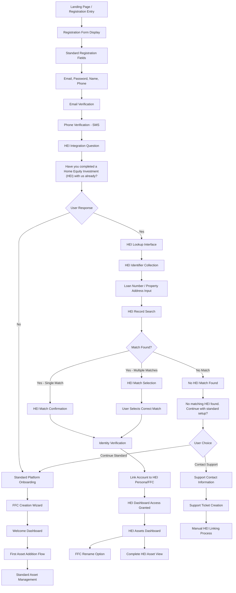

#### Enhanced Registration Form Design

**Progressive Registration Structure:**
1. **Core Account Information** (Always Visible):
   - Email address (primary identifier)
   - Secure password (12+ characters, complexity requirements)
   - Full name (first, last)
   - Phone number (for SMS verification)

2. **Verification Steps** (Sequential):
   - Email verification with confirmation link
   - SMS verification with 6-digit code
   - Account lockout protection (5 failed attempts)

3. **HEI Integration Question** (Post-Verification):
   - Clear, prominent question about existing HEI
   - Educational tooltip explaining what HEI means
   - Progressive disclosure - only shows HEI fields if "Yes" selected

**HEI Question Design & UX:**
- **Question Text:** "Have you completed a Home Equity Investment (HEI) with us already?"
- **Help Text:** "An HEI is a home equity investment where we've provided funding in exchange for a share of your property's future value."
- **Visual Design:** Card-based selection with clear Yes/No options
- **Progressive Enhancement:** HEI lookup fields animate in if "Yes" selected
- **Reversible Choice:** Users can change their selection without losing progress

#### HEI Lookup & Verification Interface

**Primary Lookup Methods:**
1. **Loan Number Search:**
   - Format guidance: "Enter your loan number (e.g., HEI-2024-001234)"
   - Real-time format validation and suggestions
   - Fuzzy matching for slight variations

2. **Property Address Search:**
   - Address autocomplete with validation
   - Format: Street address, City, State, ZIP
   - Geographic verification against HEI records

3. **Applicant Name Search:**
   - Full name matching with variations
   - Handle common name variations and spellings
   - Additional verification questions if multiple matches

**Search Results & Matching:**
- **Single Match Found:**
  - Display property address and loan details for confirmation
  - "Is this your HEI?" confirmation with property photo if available
  - Clear proceed/back options

- **Multiple Matches Found:**
  - List potential matches with distinguishing information
  - Property address, loan date, amount funded
  - Radio button selection with "None of these" option

- **No Match Found:**
  - Clear "No matching HEI found" message
  - Options: "Try different search terms" or "Continue without HEI"
  - Support contact information for manual assistance
  - No dead-end experience - always provide next steps

#### Identity Verification & Account Linking

**HEI Match Verification Process:**
1. **Basic Information Confirmation:**
   - Verify name matches HEI records
   - Confirm email address (may differ from HEI records)
   - Optional: Last 4 digits of phone number or SSN

2. **Property Verification Questions:**
   - Property address confirmation
   - Approximate HEI amount or date
   - Property type (single family, condo, etc.)

3. **Account Linking Execution:**
   - Create user account linked to existing persona
   - Grant FFC access with appropriate permissions
   - Preserve all existing HEI assets and documents

**Security & Privacy Considerations:**
- **Minimal Information Disclosure:** Only show necessary details for verification
- **PII Protection:** Mask sensitive information during verification
- **Audit Trail:** Log all HEI lookup and linking activities
- **Fraud Prevention:** Flag suspicious linking attempts for manual review

#### Post-Registration Experience Flows

**HEI Customer Dashboard Entry:**
1. **Immediate HEI Access:**
   - Skip standard FFC creation wizard
   - Direct access to existing HEI assets and documents
   - Welcome message acknowledging HEI connection

2. **FFC Customization:**
   - Prominent "Rename your family circle" option
   - Change from default "HEI Circle - [Name]" to custom name
   - Explanation of FFC concept and benefits

3. **HEI Asset Overview:**
   - Real estate asset card with property details
   - HEI loan asset card with terms and status
   - Document library access with proper permissions
   - Family invitation capabilities

**Standard User Onboarding:**
- **FFC Creation Wizard:** Standard family circle setup process
- **First Asset Addition:** Guided flow to add initial asset
- **Feature Discovery:** Introduction to platform capabilities
- **Progressive Onboarding:** Gradual feature introduction over time

#### Error Handling & Support Integration

**Common Registration Issues:**
- **Email Already Exists:** Clear messaging with login option
- **Phone Verification Failures:** Voice call backup option
- **HEI Lookup Timeouts:** Retry mechanisms with fallback to manual entry
- **Partial Registration Completion:** Draft save and resume capability

**HEI-Specific Error Scenarios:**
- **Ambiguous Matches:** Human-friendly disambiguation with support escalation
- **Technical Lookup Failures:** Graceful degradation with manual support option
- **Email Mismatch:** Process for handling different contact information
- **Already Linked HEI:** Handle cases where HEI was previously claimed

**Support & Manual Resolution:**
- **In-App Support:** Chat widget for immediate assistance
- **Support Ticket Creation:** Structured form for HEI linking issues
- **Admin Override Tools:** Backend tools for manual HEI linking
- **Documentation & FAQs:** Self-service help for common scenarios

**Success Metrics & Optimization:**
- **Registration Completion Rate:** Track completion by HEI vs. standard users
- **HEI Linking Success Rate:** Measure successful HEI matches and linkings
- **Time to Dashboard:** Monitor registration flow duration
- **Support Contact Rate:** Track how often users need manual assistance
- **User Satisfaction:** Post-registration surveys for experience feedback

### Flow 13: Builder.io Landing Page Management

**User Goal:** Enable marketing team to independently create and manage landing page content through Builder.io visual editor, providing dynamic content areas without developer intervention

**Entry Points:**
- Marketing team accessing Builder.io CMS interface
- Landing page visitors encountering Builder.io managed content spaces
- Admin dashboard managing Builder.io content models and components
- Developer interface registering new components with Builder.io

**Success Criteria:**
- Marketing team can create and edit landing page content within 15 minutes
- Landing pages load with Builder.io content in under 2 seconds
- Fallback content displays seamlessly when Builder.io is unavailable
- All content updates are immediately visible without code deployments

#### Flow Diagram - Builder.io Landing Page Management


#### Builder.io Landing Page Integration UX

**Marketing Team Experience:**
1. **CMS Access:** Secure login to Builder.io with role-based permissions
2. **Page Model Selection:** Choose from pre-configured page templates (Home, About, Services, etc.)
3. **Visual Editor:** Drag-and-drop interface with real-time preview
4. **Component Library:** Access to registered Forward components (cards, grids, forms, CTAs)
5. **Content Configuration:** Fill in component inputs (text, images, links, colors)
6. **Preview & Testing:** Multi-device preview with content validation
7. **Publishing:** One-click publish with immediate content deployment
8. **Version Control:** Content history and rollback capabilities

**Registered Component Library for Marketing:**
- **Hero Section Component:** Main landing page hero with title, subtitle, CTA, and background
- **Feature Cards Grid:** Showcase platform features with icons, descriptions, and links
- **Testimonial Carousel:** Customer testimonials with photos and company information
- **FAQ Accordion:** Expandable FAQ sections with rich text content
- **Service Showcase Cards:** $299 Estate Capture Service and other offerings
- **Trust Indicators:** Security badges, compliance certifications, customer logos
- **Call-to-Action Sections:** Sign-up prompts with customizable messaging
- **Educational Content Cards:** HEI education, estate planning guides, platform tutorials

**Developer Component Registration Process:**
```tsx
// Example: Register Hero Section Component
import { Builder } from "@builder.io/react";

const HeroSection = ({ title, subtitle, ctaText, ctaLink, backgroundImage }) => (
  <section className="relative bg-gradient-to-b from-green-50 to-white py-20">
    {backgroundImage && (
      <div className="absolute inset-0 opacity-10">
        
      </div>
    )}
    <div className="relative max-w-4xl mx-auto text-center px-4">
      <h1 className="text-4xl md:text-6xl font-bold text-gray-900 mb-6">
        {title || "Secure Your Family's Future"}
      </h1>
      <p className="text-xl text-gray-600 mb-8 max-w-2xl mx-auto">
        {subtitle || "Complete estate planning platform with HEI integration"}
      </p>
      <a 
        href={ctaLink || "/signup"} 
        className="bg-green-600 text-white px-8 py-4 rounded-lg text-lg font-semibold hover:bg-green-700 transition-colors"
      >
        {ctaText || "Get Started Free"}
      </a>
    </div>
  </section>
);

Builder.registerComponent(HeroSection, {
  name: "HeroSection",
  inputs: [
    { name: "title", type: "string", defaultValue: "Secure Your Family's Future" },
    { name: "subtitle", type: "longText", defaultValue: "Complete estate planning platform" },
    { name: "ctaText", type: "string", defaultValue: "Get Started Free" },
    { name: "ctaLink", type: "url", defaultValue: "/signup" },
    { name: "backgroundImage", type: "file", allowedFileTypes: ["jpeg", "jpg", "png", "webp"] }
  ]
});
```

#### Landing Page Spaces & Content Areas

**Dynamic Content Spaces:**
1. **Landing Page Hero:** Marketing controls headline, value proposition, and CTA
2. **Feature Highlights:** Configurable cards showcasing platform capabilities
3. **Service Marketplace:** Dynamic promotion of Estate Capture and other services
4. **Trust & Security Section:** Compliance badges, security certifications, testimonials
5. **Educational Resources:** HEI education content, estate planning guides
6. **Pricing & Plans:** Service pricing with marketing flexibility
7. **FAQ & Support:** Frequently asked questions with marketing-controlled answers

**Content Management Capabilities:**
- **Text Content:** Headlines, descriptions, button text, FAQ answers
- **Visual Assets:** Hero images, service icons, testimonial photos, backgrounds
- **Link Management:** CTA destinations, navigation links, resource downloads
- **Styling Options:** Color schemes, typography sizes, spacing adjustments
- **A/B Testing:** Version comparison and performance tracking
- **Scheduling:** Content publication timing and campaign coordination

#### Performance & Fallback Strategy

**Caching & Performance:**
- **CDN Distribution:** Builder.io content served via global CDN
- **Local Caching:** 10-minute browser cache for content stability
- **Optimistic Loading:** Render layout immediately, populate content progressively
- **Image Optimization:** Automatic image compression and responsive sizing
- **Bundle Optimization:** Lazy load Builder.io SDK only when needed

**Fallback Content Strategy:**
```tsx
const LandingPageWithFallback = () => {
  const [builderContent, setBuilderContent] = useState(null);
  const [loading, setLoading] = useState(true);
  
  useEffect(() => {
    const timeout = setTimeout(() => {
      if (loading) {
        setLoading(false); // Trigger fallback after 3 seconds
      }
    }, 3000);
    
    builder.get("page", { url: window.location.pathname })
      .toPromise()
      .then(content => {
        setBuilderContent(content);
        setLoading(false);
        clearTimeout(timeout);
      })
      .catch(() => {
        setLoading(false);
        clearTimeout(timeout);
      });
    
    return () => clearTimeout(timeout);
  }, []);
  
  if (loading) {
    return <LandingPageSkeleton />; // Loading state
  }
  
  return builderContent ? (
    <BuilderComponent model="page" content={builderContent} />
  ) : (
    <StaticLandingPageFallback /> // Fallback content
  );
};
```

**Fallback Content Components:**
- **Static Hero Section:** Pre-built hero with core messaging
- **Essential Feature Cards:** Key platform features without customization
- **Standard CTA Sections:** Default sign-up prompts and contact information
- **Basic FAQ:** Core questions about the platform and services
- **Contact Information:** Support channels and company information

#### Marketing Independence Benefits

**Content Autonomy:**
- **No Developer Dependency:** Marketing team creates content without technical assistance
- **Rapid Iteration:** A/B testing and campaign updates within minutes
- **Campaign Coordination:** Time-sensitive promotions and seasonal content
- **Brand Consistency:** Approved component library ensures design system compliance
- **Performance Tracking:** Analytics integration for content effectiveness measurement

**Campaign Management:**
- **Seasonal Campaigns:** Holiday promotions, tax season messaging, education campaigns
- **Service Promotions:** Feature Estate Capture Service based on market demand
- **Educational Initiatives:** HEI education content targeting specific audiences
- **Partnership Content:** Co-marketing with advisors and financial institutions
- **Regulatory Updates:** Compliance messaging and security communication

### Flow 14: Builder.io Dashboard Cards Integration

**User Goal:** Display educational and marketing cards within user dashboards that marketing team can control and update independently, providing timely information and service promotion without code deployments

**Entry Points:**
- User dashboard loading with Builder.io card content areas
- Marketing team managing dashboard card content in Builder.io CMS
- Admin interface configuring which Builder.io models appear in different dashboard contexts
- Analytics tracking card interaction effectiveness

**Success Criteria:**
- Dashboard cards load with Builder.io content in under 1 second
- Marketing team can update card content within 10 minutes
- Cards respect user context (plan type, assets, family status)
- Fallback cards display when Builder.io content unavailable
- Card interactions tracked for marketing effectiveness

#### Flow Diagram - Builder.io Dashboard Cards Integration


#### Dashboard Card Categories & Content Types

**Educational Cards:**
1. **HEI Education Cards:**
   - "Understanding Your HEI Investment" - explaining HEI concepts and benefits
   - "Property Value Monitoring" - how HEI affects property value tracking
   - "Exit Strategies Overview" - options when HEI matures or property sells
   - "Capital Stack Explained" - understanding lien positions and equity shares

2. **Estate Planning Education:**
   - "Getting Started with Estate Planning" - for new users with minimal assets
   - "Trust vs. Will Comparison" - when to use different estate planning tools
   - "Tax Implications Guide" - estate tax considerations and strategies
   - "Family Communication Tips" - discussing inheritance plans with family

3. **Platform Feature Highlights:**
   - "New Asset Category Added" - promoting recently enhanced features
   - "Document PII Protection" - explaining security and privacy features
   - "Mobile App Updates" - highlighting new mobile functionality
   - "Integration Spotlight" - featuring Quiltt banking or other API connections

**Marketing & Service Promotion Cards:**
1. **Estate Capture Service Promotion:**
   - "$299 Estate Capture Service" - comprehensive professional inventory
   - "Professional Appraisal Services" - property and asset valuation options
   - "Legal Document Review" - attorney-reviewed estate planning documents
   - "Family Advisor Matching" - connecting with qualified financial advisors

2. **Premium Feature Upsells:**
   - "Advanced Reporting Suite" - detailed analytics and custom reports
   - "Priority Support Access" - enhanced customer service options
   - "Bulk Asset Management" - tools for families with extensive portfolios
   - "Multi-Language Support" - highlighting Spanish language options

3. **Seasonal & Contextual Promotions:**
   - "Tax Season Estate Review" - timely estate planning reminders
   - "Year-End Planning Checklist" - annual estate planning tasks
   - "New Family Member?" - onboarding guides for growing families
   - "Property Market Updates" - relevant real estate market information

#### Context-Aware Card Targeting

**User Segmentation Logic:**
```tsx
const getUserCardContext = (user, ffc, assets) => {
  const context = {
    userType: 'standard', // standard, hei_customer, advisor_sponsored
    assetCount: assets.length,
    hasRealEstate: assets.some(a => a.category === 'REAL_ESTATE'),
    hasHEI: assets.some(a => a.category === 'LOANS' && a.type === 'HEI'),
    planType: user.subscription?.type || 'free',
    familySize: ffc.members.length,
    registrationAge: Date.now() - user.createdAt,
    lastActivity: user.lastLoginAt
  };
  
  // Determine card targeting tags
  const tags = [];
  if (context.hasHEI) tags.push('hei_customer');
  if (context.assetCount === 0) tags.push('new_user');
  if (context.familySize === 1) tags.push('single_user');
  if (context.assetCount > 10) tags.push('asset_rich');
  if (context.registrationAge < 7 * 24 * 60 * 60 * 1000) tags.push('recently_registered');
  
  return { context, tags };
};
```

**Targeted Content Delivery:**
- **New Users (0-1 assets):** Focus on onboarding education and first asset creation
- **HEI Customers:** HEI-specific education and related service promotions
- **Asset-Rich Families (10+ assets):** Advanced features, reporting, and professional services
- **Single Users:** Family invitation prompts and collaboration benefits
- **Recently Registered:** Platform feature highlights and getting started guides
- **Long-term Users:** New feature announcements and advanced service offerings

#### Component Registration for Dashboard Cards

**Educational Card Component:**
```tsx
const EducationalCard = ({ 
  title, 
  description, 
  imageUrl, 
  ctaText, 
  ctaLink, 
  cardType = 'education',
  priority = 'normal'
}) => (
  <div className={`rounded-xl border p-4 ${
    cardType === 'promotion' ? 'border-green-200 bg-green-50' : 'border-gray-200 bg-white'
  } ${priority === 'high' ? 'ring-2 ring-green-500' : ''}`}>
    {imageUrl && (
      <div className="mb-3 overflow-hidden rounded-lg">
        
      </div>
    )}
    <h3 className="font-semibold text-gray-900 mb-2">{title}</h3>
    <p className="text-sm text-gray-600 mb-3">{description}</p>
    {ctaText && ctaLink && (
      <a 
        href={ctaLink}
        className={`inline-block px-4 py-2 rounded-lg text-sm font-medium ${
          cardType === 'promotion' 
            ? 'bg-green-600 text-white hover:bg-green-700' 
            : 'bg-gray-100 text-gray-800 hover:bg-gray-200'
        } transition-colors`}
        onClick={() => trackCardInteraction(title, 'cta_click')}
      >
        {ctaText}
      </a>
    )}
  </div>
);

Builder.registerComponent(EducationalCard, {
  name: "EducationalCard",
  inputs: [
    { name: "title", type: "string" },
    { name: "description", type: "longText" },
    { name: "imageUrl", type: "file", allowedFileTypes: ["jpeg", "jpg", "png", "webp"] },
    { name: "ctaText", type: "string" },
    { name: "ctaLink", type: "url" },
    { name: "cardType", type: "select", options: [
      { label: "Education", value: "education" },
      { label: "Promotion", value: "promotion" },
      { label: "Feature", value: "feature" }
    ]},
    { name: "priority", type: "select", options: [
      { label: "Normal", value: "normal" },
      { label: "High", value: "high" }
    ]}
  ]
});
```

**Service Promotion Card Component:**
```tsx
const ServicePromotionCard = ({
  serviceName,
  price,
  description,
  features = [],
  ctaText,
  ctaLink,
  badge,
  testimonial
}) => (
  <div className="rounded-xl border-2 border-green-200 bg-gradient-to-br from-green-50 to-white p-6">
    {badge && (
      <span className="inline-block px-3 py-1 bg-green-600 text-white text-xs font-semibold rounded-full mb-3">
        {badge}
      </span>
    )}
    <h3 className="text-xl font-bold text-gray-900 mb-2">{serviceName}</h3>
    {price && (
      <div className="text-2xl font-bold text-green-600 mb-3">{price}</div>
    )}
    <p className="text-gray-600 mb-4">{description}</p>
    
    {features.length > 0 && (
      <ul className="space-y-2 mb-4">
        {features.map((feature, index) => (
          <li key={index} className="flex items-center text-sm text-gray-700">
            <CheckIcon className="w-4 h-4 text-green-500 mr-2" />
            {feature}
          </li>
        ))}
      </ul>
    )}
    
    {testimonial && (
      <blockquote className="text-sm italic text-gray-600 border-l-2 border-green-200 pl-3 mb-4">
        "{testimonial}"
      </blockquote>
    )}
    
    <a 
      href={ctaLink}
      className="block w-full text-center bg-green-600 text-white py-3 rounded-lg font-semibold hover:bg-green-700 transition-colors"
      onClick={() => trackCardInteraction(serviceName, 'service_cta_click')}
    >
      {ctaText || "Learn More"}
    </a>
  </div>
);

Builder.registerComponent(ServicePromotionCard, {
  name: "ServicePromotionCard",
  inputs: [
    { name: "serviceName", type: "string" },
    { name: "price", type: "string" },
    { name: "description", type: "longText" },
    { name: "features", type: "list", subFields: [{ name: "feature", type: "string" }] },
    { name: "ctaText", type: "string" },
    { name: "ctaLink", type: "url" },
    { name: "badge", type: "string" },
    { name: "testimonial", type: "longText" }
  ]
});
```

#### Dashboard Integration Implementation

**Dashboard Card Container:**
```tsx
const DashboardBuilderCards = ({ userContext, maxCards = 3 }) => {
  const [cards, setCards] = useState([]);
  const [loading, setLoading] = useState(true);
  
  useEffect(() => {
    const fetchCards = async () => {
      try {
        // Request context-aware cards from Builder.io
        const content = await builder.getAll("dashboard-card", {
          limit: maxCards,
          query: {
            "data.targetTags": { $in: userContext.tags }
          }
        });
        
        setCards(content || []);
      } catch (error) {
        console.error("Failed to load Builder.io cards:", error);
        setCards([]); // Fallback to empty state, shows static cards
      } finally {
        setLoading(false);
      }
    };
    
    fetchCards();
  }, [userContext.tags, maxCards]);
  
  if (loading) {
    return <DashboardCardsSkeleton />;
  }
  
  return (
    <div className="grid gap-4 md:grid-cols-2 lg:grid-cols-3">
      {cards.length > 0 ? (
        cards.map((card, index) => (
          <BuilderComponent 
            key={card.id} 
            model="dashboard-card" 
            content={card}
          />
        ))
      ) : (
        <FallbackDashboardCards userContext={userContext} />
      )}
    </div>
  );
};
```

**Analytics Integration:**
```tsx
const trackCardInteraction = (cardTitle, action, additionalData = {}) => {
  // Analytics tracking for card effectiveness
  analytics.track("Dashboard Card Interaction", {
    cardTitle,
    action, // 'view', 'cta_click', 'dismiss', 'expand'
    timestamp: Date.now(),
    userContext: getCurrentUserContext(),
    ...additionalData
  });
  
  // Also send to Builder.io analytics if available
  if (window.builderIoAnalytics) {
    window.builderIoAnalytics.track("Card Interaction", {
      card: cardTitle,
      action,
      ...additionalData
    });
  }
};
```

#### Fallback Content Strategy

**Static Fallback Cards:**
When Builder.io content is unavailable, the dashboard displays pre-built React components that provide essential information:

1. **Getting Started Card** (for new users)
2. **Add Your First Asset Card** (for users with 0 assets)
3. **Platform Security Card** (highlighting trust and compliance)
4. **Estate Capture Service Card** (core service promotion)
5. **Help & Support Card** (contact information and resources)

**Graceful Degradation:**
- **Partial Failure:** If some Builder.io cards load but others fail, mix Builder.io and fallback content
- **Slow Loading:** Show skeleton loading states, then fallback content after 3-second timeout
- **Network Issues:** Cache last successful Builder.io content in localStorage for offline display
- **Content Errors:** Log errors for marketing team visibility while displaying fallback content

### Flow 15: Multi-Language Support & Localization System

**User Goal:** Access the Forward platform in Spanish with culturally appropriate content, while maintaining full functionality across all features and professional service integrations

**Entry Points:**
- Language selector in header (available on all screens)
- Onboarding language preference during registration
- Settings menu "Language & Region" preferences
- Email notification language configuration
- Professional service language preference matching

**Success Criteria:**
- Complete Spanish UI translation with cultural adaptation
- Seamless language switching without data loss or feature limitations
- Professional services delivered in user's preferred language
- Email notifications and documents respect language preferences

#### Comprehensive Spanish Localization:

**UI Translation Coverage:**
- **Navigation & Core Interface:** All menus, buttons, form labels, and error messages
- **Asset Categories:** Culturally appropriate translations for all 14 asset categories
- **Financial Terminology:** Accurate Spanish financial and legal terms for estate planning
- **Help Documentation:** Complete Spanish translation of help articles and onboarding guides
- **Professional Service Content:** Service descriptions, pricing, and deliverables in Spanish

## Component Library / Design System (Comprehensive)

### Design System Approach

**Design System Approach:** Build upon existing Forward design patterns, creating a cohesive card-based component library optimized for financial/inheritance data display. Components are mobile-first with responsive adaptations for desktop, following Credit Karma-style patterns while maintaining Forward's distinctive green branding. The system now includes comprehensive components for all PRD Epic requirements.

### Core Foundation Components

#### FFC Context Selector

**Purpose:** Critical navigation component allowing users to switch between family circle contexts

**Variants:**
- **Primary (Desktop):** Full dropdown with family names and user role indicators
- **Compact (Mobile):** Simplified dropdown with current family name prominent
- **Multi-Select (Advisor):** Advanced variant allowing advisors to view multiple families simultaneously

**States:**
- **Default:** Shows current FFC name with dropdown indicator
- **Expanded:** List of accessible FFCs with user's role in each
- **Loading:** Transition animation during context switch
- **Error:** Fallback state if FFC data unavailable

**Usage Guidelines:** Always place prominently in header, ensure consistent styling across screen sizes, provide clear visual feedback during context switching.

#### Asset Category Card

**Purpose:** Display asset categories with aggregated values, counts, and quick access to category details

**Variants:**
- **Summary Card:** Shows category icon, name, item count, total value
- **Detailed Card:** Includes recent activity, missing documentation alerts, trend indicators
- **Action Card:** Includes primary CTA button (Add Asset, Review Documentation)
- **Empty State Card:** Encourages first asset addition with onboarding messaging
- **Progressive Enhancement Card:** Shows reduced vs advanced attribute completion status

**States:**
- **Default:** Standard information display with hover/tap interactions
- **Loading:** Skeleton loader while calculating aggregated values
- **Error:** Shows partial data with retry option for failed calculations
- **Alert:** Highlighted state for categories needing attention (missing docs, outdated values)
- **Enhanced:** Visual indicators showing API-enriched vs manually entered data

**Usage Guidelines:** Use consistent color coding for asset categories (Property=Blue, Investments=Green, Insurance=Purple, Personal=Pink). Always show persona ownership attribution. Include clear CTAs for empty states and enhancement opportunities.

### Asset Management Components

#### Progressive Asset Form Builder

**Purpose:** Dynamic form generation for all 14 asset categories with reduced vs advanced attribute support using the UI Collection Mask system

#### UI Collection Mask Implementation

**Technical Foundation:**
The forms are powered by a metadata-driven UI Collection Mask system that combines base asset fields with asset-type-specific fields through a single API call (`/ui-collection-mask/asset-form/:assetType`).

**Form Architecture:**
```
Base Asset Fields (ASSETS entity)     +  Specific Asset Fields (e.g., REAL_ESTATE entity)
- Asset name (mandatory)                 - Property type (mandatory enum)
- Description (optional)                 - Property address (mandatory text)  
- Current value (mandatory currency)     - Purchase date (mandatory date)
- Tags (optional text)                   - Property use (optional enum)
                                        - Mortgage details (optional currency)
                            ↓
                     Merged Dynamic Form
                     (Sorted by display_order)
```

**Field Type Intelligence (11 Types):**
- **text**: Standard text input with validation
- **int**: Integer input with number validation
- **real**: Decimal input with precision control
- **phone**: Formatted phone input with country code support
- **zip**: ZIP/postal code with regional formatting
- **email**: Email input with validation and suggestions
- **date**: Date picker with accessibility support
- **year**: Year selector optimized for historical dates
- **currency**: Auto-formatting currency input ($1,234.56)
- **currency_code**: Currency code dropdown (USD, EUR, etc.)
- **enum**: Dropdown populated from database configuration (note field contains pipe-separated choices)

**Progressive Disclosure UX Pattern:**

1. **Basic Asset Information Section** (Always Visible)
   - All mandatory base asset fields
   - Clean, focused layout with clear labels
   - Progress indicator showing section completion

2. **[Asset Type] Details Section** (Always Visible)
   - All mandatory asset-type-specific fields
   - Contextual help text for complex fields
   - Smart defaults where appropriate

3. **Advanced Fields Section** (Expandable)
   - Triggered by "Show Advanced Fields (X)" button
   - Contains all optional fields from both base and type-specific entities
   - Grouped logically with clear section headers
   - Collapsible after completion

**Variants:**
- **Category Selector:** Visual selection interface for all 14 asset types with descriptions and icons
- **Merged Dynamic Form:** Base + type-specific fields rendered according to UI Collection Mask configuration
- **Progressive Disclosure Form:** Mandatory fields always visible, optional fields expandable
- **Field Type Adaptation:** Each field renders with appropriate UI control based on field_type
- **API Enhancement Interface:** Connect to Quillt, HEI, or other data sources for auto-population
- **Bulk Import Form:** Upload multiple assets via CSV or Excel

**States:**
- **Category Selection:** Clear visual grid of all 13 categories with descriptions and field count preview
- **Form Loading:** Skeleton loader while fetching UI Collection Mask configuration
- **Form Building:** Dynamic field generation with real-time validation feedback
- **Field Validation:** Individual field validation with helpful error messages and formatting hints
- **Progressive Enhancement:** Visual indicators showing optional field availability
- **Saving:** Optimistic UI with background save operations and conflict resolution
- **Enhancement Available:** API connection opportunities highlighted contextually

**User Experience Flow:**
1. **Asset Type Selection**: User selects from 14 asset categories
2. **Form Configuration**: Single API call fetches merged UI Collection Mask
3. **Mandatory Fields First**: User completes all required base and type-specific fields
4. **Progressive Disclosure**: "Show Advanced Fields" reveals optional fields in organized groups
5. **Smart Validation**: Real-time validation with field-type-appropriate feedback
6. **Contextual Help**: Enum fields show available choices, currency fields format automatically
7. **Save Flexibility**: Form saves as draft if incomplete, validates fully before submission

**Accessibility Features:**
- All form fields properly labeled with required/optional indicators
- Enum dropdowns include keyboard navigation and screen reader support
- Currency and date fields announce formatting requirements
- Progressive disclosure maintains focus management
- Form validation errors clearly associated with specific fields

**Performance Optimizations:**
- UI Collection Mask configurations cached for 10+ minutes
- Form schemas lazy-loaded only when asset type selected
- Field validation debounced to prevent excessive API calls
- Optimistic UI updates with background persistence

**Enhanced UI Collection Mask UX Recommendations:**

**1. Field Count Preview & Completion Indicators**
- **Category Cards**: Show field counts - "Real Estate (5 required, 8 optional)"
- **Progress Bars**: Visual completion percentage for mandatory vs optional sections
- **Completion Badges**: "Basic Complete ✓", "Comprehensive Complete ✓✓"
- **Enhancement Hints**: "💡 3 more fields for complete asset profile"

**2. Smart Field Validation & Formatting**
- **Real-time Formatting**: Currency auto-formats as user types ($1,234.56)
- **Smart Defaults**: Pre-populate common values (USD for currency_code, current year for recent purchases)
- **Contextual Help**: Expandable help text for complex enum choices
- **Error Prevention**: Disable submit until mandatory fields are valid

**3. Progressive Enhancement Visual Cues**
- **API Connection Indicators**: Show which fields can be auto-populated via Quillt/HEI
- **Data Source Attribution**: "Via Quillt" badges for API-populated fields
- **Enhancement Opportunities**: Highlighted sections showing available API connections
- **Completion Incentives**: "Complete 3 more fields to unlock property insights"

**4. Cross-Category Learning**
- **Smart Suggestions**: Learn from previous asset entries to suggest values
- **Template Creation**: Save frequently used field combinations as templates
- **Bulk Actions**: Apply similar values across multiple assets of same type
- **Field Dependencies**: Show/hide optional fields based on mandatory field selections

**5. Accessibility & Multi-Generational Support**
- **Large Touch Targets**: 44px minimum for all form elements
- **Clear Labels**: Descriptive labels with examples for complex fields
- **Keyboard Navigation**: Logical tab order with skip-to-section links
- **Screen Reader Support**: Proper ARIA labels and live region updates

**Usage Guidelines:** Start with category selection to set context. Always show mandatory fields first to establish completion confidence. Use progressive disclosure to prevent cognitive overload while maintaining access to comprehensive data entry. Provide clear field type indicators and formatting help. Leverage field count previews and completion indicators to motivate users through the enhanced data collection process.

#### Asset Enhancement Interface

**Purpose:** Upgrade manually entered assets with API data or professional services

**Variants:**
- **API Connection Cards:** Quillt, HEI, Real Estate API connection interfaces
- **Service Marketplace Integration:** Professional appraisal and service options
- **Manual Enhancement Form:** Add advanced attributes manually
- **Data Conflict Resolution:** Handle conflicts between manual and API data

**States:**
- **Available:** Enhancement options available with clear value proposition
- **In Progress:** API connection or service request in progress
- **Completed:** Enhanced data successfully integrated
- **Conflict:** Manual data conflicts with API data requiring user resolution

**Usage Guidelines:** Make enhancement feel optional and valuable, not mandatory. Provide clear data source attribution. Handle conflicts transparently with user control.

#### Quiltt Banking Connection Interface

**Purpose:** Seamless bank account connection through Quiltt with graceful fallback to manual entry

**Variants:**
- **Connection Method Selector:** Primary "Connect Bank Account" vs secondary "Enter Manually" options
- **Quiltt Connector Wrapper:** React component that takes over screen during bank authentication
- **Bank Institution Picker:** Searchable list of 5,000+ supported financial institutions
- **Account Selection Interface:** Multi-select for choosing which accounts to connect
- **Connection Status Dashboard:** Real-time sync status and connection health monitoring

**States:**
- **Method Selection:** Clear choice between automated connection and manual entry
- **Connecting:** Quiltt connector active with progress indicators and branding
- **Bank Authentication:** Secure OAuth flow with bank's authentication system
- **Account Selection:** Multi-account selection with descriptions and balance previews
- **Connection Success:** Confirmation of connected accounts with next steps
- **Connection Failed:** Error state with fallback to manual entry option
- **Sync Active:** Real-time balance updates with last sync timestamp
- **Sync Error:** Connection issues with retry and reconnection options

**Usage Guidelines:** Emphasize security and automatic updates as primary value proposition. Provide clear fallback options at every step. Show connection status prominently on connected accounts. Use consistent branding between Forward and Quiltt interfaces.

#### HEI Asset Management Suite

**Purpose:** Specialized interface components for Home Equity Investment asset management

**Variants:**
- **HEI Registration Question:** Progressive disclosure question during signup with helpful explanations
- **HEI Lookup Interface:** Multiple search methods (loan number, property address, applicant name)
- **HEI Match Confirmation:** Display potential matches with verification questions
- **HEI Dashboard Cards:** Specialized cards for real estate and HEI loan assets with linking
- **HEI Document Library:** Categorized document management with PII protection
- **Property Valuation Display:** Timeline of property values with source attribution

**States:**
- **Registration Integration:** Seamless HEI question integration without disrupting standard flow
- **Lookup Active:** Search interface with real-time validation and suggestions
- **Match Found:** Confirmation interface with property and loan details preview
- **Multiple Matches:** Selection interface for disambiguating similar HEI records
- **No Match:** Clear "not found" state with alternative options and support contact
- **Verification Pending:** Identity verification process with security questions
- **HEI Connected:** Successful linking with immediate access to HEI assets and documents
- **HEI Dashboard:** Complete asset view with real estate, loan, and document components

**Usage Guidelines:** Keep HEI integration optional and non-disruptive for standard users. Provide clear explanations of HEI concepts. Use progressive disclosure to avoid overwhelming users. Maintain consistent visual hierarchy between HEI and standard assets. Ensure document access respects PII protection and user permissions.

### Subscription & Payment Components

#### Service Marketplace Card

**Purpose:** Display and promote the $299 Estate Capture Service and other professional services

**Variants:**
- **Featured Service Card:** Prominent display with value proposition, pricing, and purchase CTA
- **Service Category Grid:** Multiple services organized by category (Legal, Financial, Valuation)
- **Service Progress Card:** Shows active service status with milestone tracking
- **Service Completion Card:** Displays completed service deliverables with download/view options

**States:**
- **Available:** Service can be purchased with clear pricing and timeline
- **In Progress:** Service purchased and active with progress indicators
- **Completed:** Service delivered with access to results and follow-up options
- **Restricted:** Service not available due to plan limitations or eligibility

**Usage Guidelines:** Always show clear value proposition before pricing. Include timeline expectations and deliverable previews. Use trust indicators like professional credentials and customer testimonials.

#### Dynamic Plan Configuration Interface

**Purpose:** Adapt UI elements based on current subscription plan without requiring code deployments

**Variants:**
- **Feature Flag Controller:** Admin interface for enabling/disabling features per plan type
- **Seat Management Widget:** Shows/hides based on plan type (hidden for unlimited plans)
- **Payment Gateway Integration:** Stripe-powered payment processing with receipt generation
- **Plan Status Indicator:** Discrete badge showing current plan with upgrade options

**States:**
- **Free Unlimited:** All core features available, service marketplace visible
- **Service Active:** Currently engaged professional service with progress tracking
- **Plan Transition:** Temporary state during plan changes or service activation
- **Billing Issue:** Payment problem requiring attention without blocking core features

**Usage Guidelines:** Never paywall core estate planning features. Service upsells should feel helpful, not pushy. Plan indicators should be informative but not prominent.

### Search & Analytics Components

#### Omnisearch Interface

**Purpose:** Unified search across all asset categories, family members, documents, and activities

**Variants:**
- **Global Search Bar:** Header-mounted search with auto-complete and smart suggestions
- **Advanced Filter Panel:** Collapsible filter interface with category-specific options
- **Search Results Layout:** Card-based results with type indicators and relevance scoring
- **Saved Search Manager:** Interface for bookmarking and managing complex search queries

**States:**
- **Empty State:** Helpful placeholder with search suggestions and popular queries
- **Loading State:** Progressive search results with skeleton loading for better perceived performance
- **Results State:** Organized results with sorting, filtering, and pagination controls
- **No Results State:** Helpful error state with search refinement suggestions

**Usage Guidelines:** Search should feel instant with results appearing as user types. Results must respect permission boundaries. Provide clear feedback about search scope and filtering applied.

#### Report Builder Wizard

**Purpose:** Guide users through creating custom reports with appropriate data selection and formatting

**Variants:**
- **Template Selector:** Choose from pre-built report templates for common use cases
- **Date Range Picker:** Flexible date selection with common presets and custom ranges
- **Data Scope Selector:** Choose FFC context, family members, asset categories to include
- **Format Selector:** PDF presentation, Excel analysis, CSV data export options

**States:**
- **Template Selection:** Choose report type with preview and description
- **Configuration:** Set parameters, filters, and customization options
- **Generation:** Processing state with progress indicator for large reports
- **Delivery:** Download, email, or scheduled delivery options

**Usage Guidelines:** Start with templates to reduce complexity. Provide clear previews of report content. Show estimated generation time for large reports.

### Communication & Notification Components

#### Live Notification System

**Purpose:** Real-time notifications that respect user preferences and permission boundaries

**Variants:**
- **Toast Notifications:** Non-intrusive pop-ups for immediate actions and confirmations
- **Notification Center:** Dropdown panel with notification history and action items
- **Live Badge Counters:** Unread notification counts on navigation elements
- **Activity Feed:** Real-time stream of family activities with filtering options

**States:**
- **Unread:** New notifications with appropriate visual emphasis
- **Read:** Viewed notifications with reduced visual prominence
- **Actionable:** Notifications requiring user action with clear CTAs
- **Dismissed:** Removed notifications that can be recovered if needed

**Usage Guidelines:** Respect notification preferences and quiet hours. Group related notifications to prevent overwhelm. Always provide clear action paths.

#### WebSocket Status Indicator

**Purpose:** Show real-time connection status and handle connection issues gracefully

**Variants:**
- **Connection Status Badge:** Discrete indicator of real-time connection health
- **Reconnection Interface:** User feedback during connection recovery attempts
- **Offline Mode Indicator:** Clear indication when working in offline mode
- **Sync Status Display:** Show synchronization status for offline changes

**States:**
- **Connected:** Normal operation with real-time updates flowing
- **Reconnecting:** Temporary connection loss with retry attempts
- **Offline:** No connection with queued changes for later sync
- **Error:** Persistent connection issues requiring user attention

**Usage Guidelines:** Connection status should be visible but not distracting. Provide clear feedback during connection issues. Ensure offline functionality doesn't result in data loss.

### Compliance & Security Components

#### SOC 2 Compliance Dashboard

**Purpose:** Display compliance status and security metrics for transparency and trust building

**Variants:**
- **Public Trust Center:** Customer-facing compliance and security information
- **Internal Compliance Dashboard:** Real-time monitoring of compliance controls and evidence
- **Security Questionnaire Interface:** Automated response system for customer security questions
- **Audit Preparation Portal:** Countdown and checklist for upcoming compliance audits

**States:**
- **Compliant:** All controls operating effectively with current certifications
- **At Risk:** Some controls requiring attention with remediation plans
- **In Progress:** Active compliance work with progress tracking
- **Audit Mode:** Special interface during active audit periods

**Usage Guidelines:** Transparency builds trust but avoid exposing security vulnerabilities. Use clear, non-technical language for customer-facing content. Provide actionable information for compliance teams.

### Builder.io CMS Integration Components

#### Builder.io Card Components

**Purpose:** Provide marketing team with drag-and-drop card components for landing pages and dashboard content management

**Variants:**
- **Hero Section Card:** Landing page hero with customizable title, subtitle, CTA, and background image
- **Feature Showcase Card:** Platform feature highlighting with icon, description, and link
- **Service Promotion Card:** Estate Capture Service and other service offerings with pricing and features
- **Educational Content Card:** HEI education, estate planning guides, and platform tutorials
- **Testimonial Card:** Customer testimonials with photos, quotes, and company information
- **FAQ Accordion Card:** Expandable frequently asked questions with rich text content
- **Trust Indicator Card:** Security badges, compliance certifications, and customer logos
- **Call-to-Action Card:** Sign-up prompts and conversion-focused messaging

**States:**
- **Design Mode:** Visual editor interface for marketing team content creation
- **Preview Mode:** Multi-device preview with real-time content updates
- **Published State:** Live content rendering with performance optimization
- **Fallback State:** Static content display when Builder.io unavailable

**Usage Guidelines:** Register all components with Builder.io SDK including proper input definitions and validation. Ensure components follow Forward design system patterns while providing marketing flexibility. Include analytics tracking for all user interactions.

#### Builder.io Content Management Interface

**Purpose:** Seamless integration between Builder.io CMS and React application with graceful fallback handling

**Variants:**
- **BuilderComponent Wrapper:** React component that fetches and renders Builder.io content
- **Landing Page Builder:** Full-page Builder.io integration for marketing-controlled landing pages
- **Dashboard Card Container:** Context-aware card content based on user segmentation
- **Content Loading States:** Skeleton loaders and progressive content rendering
- **Fallback Content Provider:** Static content display when Builder.io unavailable

**States:**
- **Loading:** Skeleton animation while fetching Builder.io content
- **Content Available:** Successfully rendered Builder.io content with all components
- **Partial Failure:** Mix of Builder.io and fallback content when some components fail
- **Complete Fallback:** Static React components when Builder.io entirely unavailable
- **Error State:** Clear error messaging with retry options for content failures

**Usage Guidelines:** Always implement fallback content for graceful degradation. Cache Builder.io content locally for improved performance. Respect user context for personalized content delivery. Track content performance for marketing optimization.

#### Landing Page Builder Integration

**Purpose:** Enable marketing team to manage landing page content independently through Builder.io visual editor

**Technical Implementation:**
```tsx
// Initialize Builder.io SDK
import { builder, BuilderComponent, Builder } from "@builder.io/react";

builder.init(process.env.NEXT_PUBLIC_BUILDER_API_KEY);

// Landing page with fallback
const LandingPageWithFallback = ({ url }) => {
  const [content, setContent] = useState(null);
  const [loading, setLoading] = useState(true);
  
  useEffect(() => {
    const timeout = setTimeout(() => setLoading(false), 3000);
    
    builder.get("page", { url })
      .toPromise()
      .then(content => {
        setContent(content);
        setLoading(false);
        clearTimeout(timeout);
      })
      .catch(() => {
        setLoading(false);
        clearTimeout(timeout);
      });
    
    return () => clearTimeout(timeout);
  }, [url]);
  
  if (loading) return <LandingPageSkeleton />;
  
  return content ? (
    <BuilderComponent model="page" content={content} />
  ) : (
    <StaticLandingPageFallback />
  );
};
```

**Content Management Features:**
- **Visual Editor:** Drag-and-drop interface for non-technical marketing team members
- **Component Library:** Pre-registered Forward components available for content creation
- **Preview & Testing:** Multi-device preview with content validation before publishing
- **A/B Testing:** Version comparison and performance tracking capabilities
- **Scheduling:** Content publication timing and campaign coordination
- **Version Control:** Content history and rollback capabilities

**Performance Optimization:**
- **CDN Distribution:** Builder.io content served via global CDN for fast loading
- **Local Caching:** 10-minute browser cache for content stability and performance
- **Lazy Loading:** Builder.io SDK loaded only when needed to minimize bundle size
- **Image Optimization:** Automatic image compression and responsive sizing
- **Graceful Degradation:** Fallback content ensures site functionality regardless of Builder.io status

### Multi-Language Support Components

#### Language Selector Interface

**Purpose:** Seamless language switching with full functionality preservation

**Variants:**
- **Header Language Dropdown:** Prominent language selection with flag indicators
- **Onboarding Language Preference:** Language selection during registration process
- **Professional Service Language Matching:** Language preference for service delivery
- **Mixed-Language Family Support:** Interface for families with different language preferences

**States:**
- **Language Available:** Full translation available with complete functionality
- **Partial Translation:** Some content translated with fallback indicators
- **Loading Translation:** Dynamic language switching with loading indicators
- **Translation Error:** Graceful fallback to English with error reporting

**Usage Guidelines:** Language changes should be immediate and comprehensive. Provide clear indication of translation completeness. Respect cultural formatting preferences for dates, numbers, and currency.

## Branding & Style Guide

### Visual Identity

**Brand Guidelines:** Build upon existing Forward brand identity emphasizing trust, transparency, and family collaboration. The green logo and clean typography suggest a growth-oriented, secure financial platform.

### Color Palette

| Color Type | Hex Code | Usage |
|------------|----------|--------|
| Primary | #22C55E | Forward logo, primary CTAs, success states |
| Secondary | #16A34A | Hover states, secondary actions |
| Accent | #059669 | Active navigation states, selected items |
| Success | #10B981 | Document status current, completed tasks |
| Warning | #F59E0B | Pending documents, attention needed |
| Error | #EF4444 | Expired documents, failed actions |
| Neutral | #64748B, #94A3B8, #CBD5E1, #F1F5F9 | Text hierarchy, borders, backgrounds |

### Typography

#### Font Families
- **Primary:** Inter (clean, readable, professional for financial data)
- **Secondary:** System fonts fallback
- **Monospace:** 'SF Mono', Monaco (for financial values, account numbers)

#### Type Scale

| Element | Size | Weight | Line Height |
|---------|------|---------|-------------|
| H1 | 32px / 2rem | 700 (Bold) | 1.2 |
| H2 | 24px / 1.5rem | 600 (Semi-bold) | 1.3 |
| H3 | 20px / 1.25rem | 600 (Semi-bold) | 1.4 |
| Body | 16px / 1rem | 400 (Regular) | 1.5 |
| Small | 14px / 0.875rem | 400 (Regular) | 1.4 |

### Iconography

**Icon Library:** Phosphor Icons for consistency with modern financial interfaces

**Usage Guidelines:** 
- Use 24px icons for primary actions, 16px for secondary elements
- Maintain consistent visual weight across icon sets
- Use outline style for inactive states, filled for active states

### Spacing & Layout

**Grid System:** 12-column responsive grid with 16px gutters on mobile, 24px on desktop

**Spacing Scale:** 4px base unit with 8px, 12px, 16px, 24px, 32px, 48px, 64px increments

## Accessibility Requirements

### Compliance Target

**Standard:** WCAG 2.1 AA compliance with selective AAA guidelines for critical financial interactions

### Key Requirements

**Visual:**
- **Color contrast ratios:** Minimum 4.5:1 for normal text, 3:1 for large text, 7:1 AAA for critical financial values
- **Focus indicators:** 2px solid outline with high contrast color visible against all backgrounds
- **Text sizing:** Minimum 16px base font size with scalability up to 200% zoom

**Interaction:**
- **Keyboard navigation:** Full keyboard accessibility with logical tab order and skip links
- **Screen reader support:** Semantic HTML with comprehensive ARIA labels and live regions
- **Touch targets:** Minimum 44px touch targets with 8px spacing between elements

**Content:**
- **Alternative text:** Descriptive alt text for persona avatars, asset category icons, document thumbnails
- **Heading structure:** Logical H1-H6 hierarchy reflecting content structure
- **Form labels:** Clear, descriptive labels with error messages associated via aria-describedby

### Testing Strategy

**Multi-Modal Testing Approach:**
- **Automated testing:** Integration of axe-core accessibility testing in CI/CD pipeline
- **Screen reader testing:** Manual testing with NVDA, JAWS, and VoiceOver
- **Keyboard-only testing:** Complete user flows using only keyboard navigation
- **Senior user testing:** Specific usability sessions with users 65+ to validate usability

## Responsiveness Strategy

### Breakpoints

| Breakpoint | Min Width | Max Width | Target Devices |
|------------|-----------|-----------|----------------|
| Mobile | 320px | 767px | Smartphones, narrow tablets in portrait |
| Tablet | 768px | 1023px | iPads, Android tablets, small laptops |
| Desktop | 1024px | 1439px | Standard laptops, desktop monitors |
| Wide | 1440px | - | Large monitors, ultra-wide displays, advisor workstations |

### Adaptation Patterns

**Layout Changes:** 
- **Mobile:** Single-column card stack with bottom tab navigation
- **Tablet:** Two-column card grid, hybrid navigation
- **Desktop:** Multi-column layouts, top horizontal navigation, hover states
- **Wide:** Three+ column layouts, dashboard widgets, advanced data visualization

**Navigation Changes:**
- **Mobile:** Bottom tab bar optimized for thumb navigation
- **Tablet:** Top pill navigation with optional bottom shortcuts
- **Desktop:** Full horizontal navigation with dropdowns and search
- **Wide:** Potential persistent sidebar with expanded options

**Content Priority:**
- **Mobile:** Essential information only, progressive disclosure
- **Tablet:** Balanced information density, expandable sections
- **Desktop:** Full information display, comprehensive action menus
- **Wide:** Rich data visualization, multiple context views

## Animation & Micro-interactions

### Motion Principles

**Subtle and Purposeful Animation:** All motion serves a functional purpose - providing feedback, showing relationships, or guiding attention. Animations feel natural and trustworthy, respecting user preferences with `prefers-reduced-motion` support.

### Key Animations

- **FFC Context Switch:** Smooth fade transition (300ms, ease-out) with loading skeleton
- **Card Expansion:** Scale transform (250ms, ease-in-out) from summary to detailed view
- **Asset Value Updates:** Gentle number counter animation (500ms, ease-out)
- **Permission Changes:** Color-coded slide animation (200ms, ease-in)
- **Document Upload:** Progress ring with success pulse (150ms, ease-out)
- **Loading States:** Skeleton shimmer animation (1500ms loop, linear)
- **Search Results:** Staggered appearance animation for result cards
- **Notification Toast:** Slide-in from top with bounce effect (300ms, ease-out)

## Performance Considerations

### Performance Goals
- **Page Load:** <2 seconds initial page load on 4G networks
- **Interaction Response:** <100ms response time for all user interactions
- **Animation FPS:** Consistent 60fps for all motion elements
- **Search Response:** <200ms for simple queries, <500ms for complex filters
- **Report Generation:** <30 seconds for standard reports, progress indicators for longer operations

### Design Strategies
**Progressive Loading:** Critical financial data loads first with skeleton animations. **Optimized Asset Delivery:** Responsive images with lazy loading. **Efficient State Management:** Card-based architecture enables selective updates during FFC context switching. **Search Optimization:** Debounced search with cached results for common queries.

## Implementation Strategy & Next Steps

### Critical Implementation Priority Matrix

#### Phase 1A: MVP Foundation (Weeks 1-8) - Priority 1

**Blocking for Launch:**
1. **Complete 13 Asset Categories UI** - Essential for Day 1 MVP requirement
   - Reduced vs Advanced attribute architecture implementation
   - Category-specific form generation and validation
   - Progressive disclosure for complex asset types
   - API integration points for Quiltt and HEI data

2. **Enhanced Quiltt Financial Asset Flow** - Core banking integration feature
   - Quiltt React connector integration with fallback to manual entry
   - Multi-account connection and individual asset creation
   - Real-time balance sync with connection status monitoring
   - Error handling and graceful degradation to manual entry

3. **HEI Integration & Asset Management** - Strategic HEI customer onboarding
   - External HEI API ingestion with automatic asset creation
   - HEI customer self-registration and lookup functionality
   - Linked real estate and HEI loan asset management
   - HEI-specific document library with PII protection

4. **Enhanced Registration Flow with HEI Integration** - Streamlined onboarding
   - Progressive HEI detection question during standard registration
   - HEI lookup and verification interface
   - Seamless account linking to existing HEI assets and FFC
   - Dual path experience for HEI vs. standard users

5. **Builder.io CMS Integration** - Marketing independence and content management
   - Builder.io React SDK integration with component registration
   - Landing page content management for marketing team autonomy
   - Dashboard educational and marketing cards with context-aware targeting
   - Fallback content strategy for graceful degradation when Builder.io unavailable

6. **Subscription & Payment Platform** - Core business model implementation
   - Free unlimited plan onboarding (no payment barriers)
   - $299 Estate Capture Service marketplace integration
   - Stripe payment processing with receipt generation
   - Dynamic UI configuration based on plan type

7. **Enhanced Security Flows** - Required for enterprise adoption
   - Dual-channel verification (email + SMS) complete implementation
   - Owner approval workflow with real-time notifications
   - PII processing status display with confidence scoring
   - Document masking toggle interface

#### Phase 1B: Core Enhancement (Weeks 9-16) - Priority 2

**Critical for Market Fit:**
1. **Advanced Search & Filtering System** - Essential for data management
   - Global omnisearch across all data types
   - OCR document content search with PII awareness
   - Advanced filtering with category-specific options
   - Search analytics for optimization insights

2. **Basic Reporting & Analytics** - Required for professional adoption
   - Pre-built report templates for common use cases
   - Estate summary and asset allocation reports
   - PDF/Excel export with professional formatting
   - Basic audit trail reporting

3. **Real-Time Communication Foundation** - Family collaboration enabler
   - WebSocket infrastructure for live updates
   - Core notification system with preference controls
   - Live activity feeds and presence indicators
   - Mobile push notification integration

#### Phase 2: Professional & Compliance (Weeks 17-32) - Priority 3

**Enterprise & Regulatory Requirements:**
1. **SOC 2 Compliance Platform** - Trust and security foundation
2. **Advanced Reporting & Analytics** - Professional service requirements
3. **Bulk Operations & Data Management** - Advisor efficiency tools

#### Phase 3: Market Expansion (Weeks 33-48) - Priority 4

**Market Growth & Accessibility:**
1. **Multi-Language Support (Spanish)** - Market expansion enabler
2. **Advanced Integration Framework** - Ecosystem expansion

### Immediate Critical Actions

#### Week 1-2: Foundation Architecture
1. **Technical Architecture Alignment** - Collaborate with backend team on database schema support
2. **Design System Expansion** - Create comprehensive design specifications
3. **User Research Validation** - Conduct focused research on key assumptions

#### Week 3-4: MVP Component Development
1. **Asset Category Infrastructure** - Implement progressive disclosure system
2. **Subscription Platform Foundation** - Build business model infrastructure

### Design Handoff Checklist (Complete)

**Foundation Requirements:**
- [x] All user flows documented with persona-centric asset ownership model
- [x] Component inventory complete with responsive variants and FFC context handling
- [x] Accessibility requirements defined for multi-generational users
- [x] Responsive strategy clear with mobile-first, adaptive navigation approach
- [x] Brand guidelines incorporated with trust-focused design systems
- [x] Performance goals established for financial data handling

**Complete Epic Coverage:**
- [x] **Complete 14 asset categories** - UI specifications for all asset types with reduced/advanced attribute architecture
- [x] **Subscription & payment platform** - Free plan, service marketplace, payment processing interfaces
- [x] **Advanced search system** - Global search, OCR content search, filtering, and analytics
- [x] **Comprehensive reporting** - Report builder, analytics dashboard, export capabilities
- [x] **Real-time communication** - WebSocket integration, notifications, live activity feeds
- [x] **SOC 2 compliance platform** - Trust center, compliance monitoring, security questionnaires
- [x] **Multi-language support** - Spanish translation, cultural adaptation, localized services
- [x] **Bulk operations interface** - Mass import/export, permission updates, advisor tools

### Success Metrics & Validation

#### MVP Success Criteria:
- **Asset Creation Completion Rate**: >90% of users successfully create their first asset using reduced attribute set
- **Quiltt Integration Success Rate**: >85% of banking connections complete successfully with fallback <5%
- **HEI Customer Onboarding Rate**: >85% of HEI customers successfully link to existing assets during registration
- **HEI Lookup Accuracy**: >95% of valid HEI identifiers result in correct asset linking
- **Builder.io Landing Page Performance**: Landing pages load with Builder.io content in <2 seconds, fallback <3 seconds
- **Builder.io Dashboard Card Engagement**: >60% of users interact with at least one Builder.io dashboard card per session
- **Marketing Content Independence**: Marketing team updates landing page content within 15 minutes without developer assistance
- **Service Marketplace Engagement**: >15% of free users view Estate Capture Service details
- **Search Effectiveness**: Users find target assets/documents within 30 seconds in 95% of cases
- **Multi-Generational Usability**: 80+ year old users complete core tasks with <2 support contacts

#### Professional Adoption Metrics:
- **Advisor Onboarding Success**: Financial advisors successfully onboard client families within 1 week
- **Report Generation Usage**: >60% of families generate at least one professional report within 3 months
- **Compliance Confidence**: >95% of security questionnaires completed automatically without manual intervention
- **Spanish Market Penetration**: >20% of new signups select Spanish language preference within 6 months

---

**Document Status:** ✅ **Complete - Enhanced with Builder.io CMS Integration**

This comprehensive specification has been enhanced with Builder.io integration requirements and three critical user flows based on detailed requirements analysis:

**✅ Builder.io Landing Page Management (Flow 13)** - Complete marketing independence through visual CMS integration including component registration, content management workflows, performance optimization, and graceful fallback strategies.

**✅ Builder.io Dashboard Cards Integration (Flow 14)** - Context-aware educational and marketing cards with user segmentation, content targeting, analytics integration, and seamless fallback to static content.

**✅ Enhanced Quiltt Financial Asset Flow** - Complete bank connectivity integration with React connector, multi-account management, real-time sync, and graceful fallback to manual entry.

**✅ HEI Integration & Asset Management** - Comprehensive Home Equity Investment customer onboarding including external API ingestion, customer self-registration with lookup, and specialized HEI asset management interfaces.

**✅ Enhanced Registration Flow with HEI Integration** - Streamlined registration experience with progressive HEI detection, lookup verification, and seamless account linking.

The specification now provides complete coverage of all PRD Epic requirements plus Builder.io CMS integration for marketing independence while maintaining the excellent mobile-first card-based foundation. The specification is ready for technical architecture validation, stakeholder review, and phased implementation planning.

**Coverage Summary:**
- **Epic 1:** Marketing Foundation ✅ (Enhanced with comprehensive Builder.io CMS integration)
- **Epic 2:** FFC Onboarding ✅ (Enhanced with dual-channel verification)
- **Epic 3:** Asset Management ✅ (Complete 13 categories + reduced/advanced attributes)
- **Epic 4:** Advanced Features ✅ (Search, reporting, bulk operations, integrations)
- **Epic 5:** Multi-Language ✅ (Spanish localization with cultural adaptation)
- **Epic 6:** SOC 2 Compliance ✅ (Trust center + automated compliance)
- **Epic 7:** Performance Optimization ✅ (Responsive design + performance targets)
- **Builder.io Integration:** ✅ (Landing page management + dashboard cards + marketing independence)

**Ready for:** Strategic review, technical architecture alignment, and immediate implementation planning.