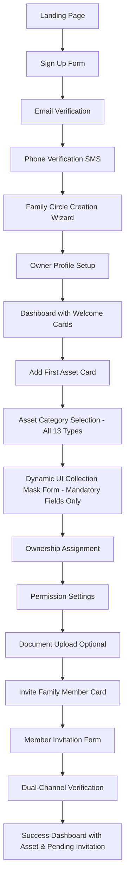
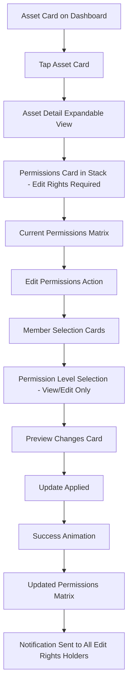
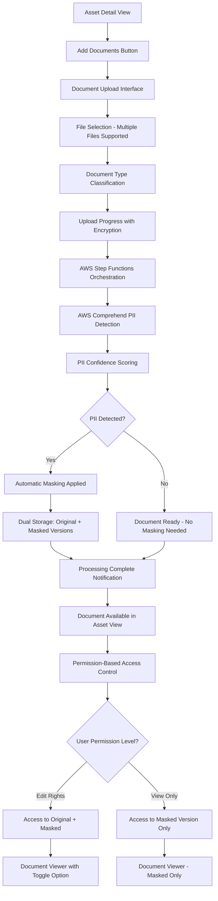
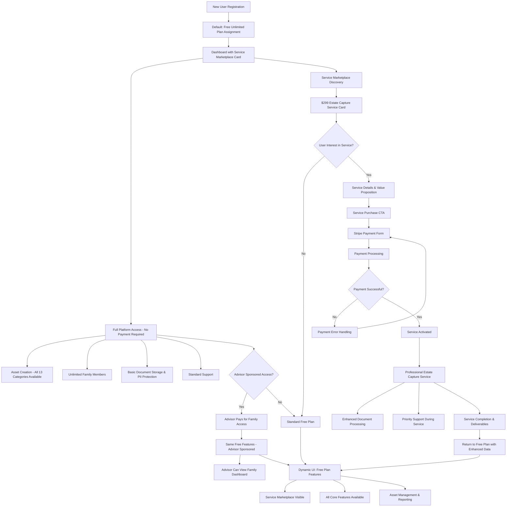
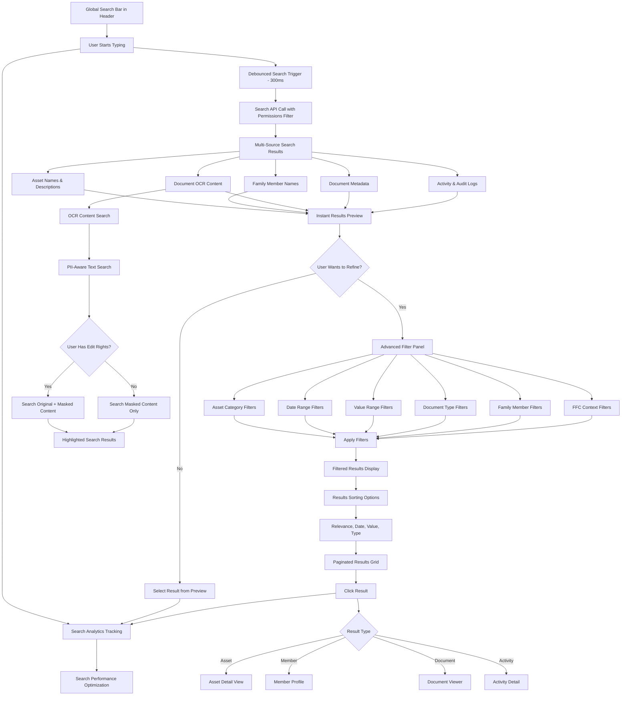

# Forward Inheritance Platform UI/UX Specification

## Change Log

| Date | Version | Description | Author |
|------|---------|-------------|--------|
| 2025-01-18 | 2.0 | Comprehensive expansion covering all PRD Epic requirements | UX Expert |
| 2025-01-18 | 1.0 | Initial UI/UX specification for mobile-first responsive design | UX Expert |

## Introduction

This document defines the user experience goals, information architecture, user flows, and visual design specifications for Forward Inheritance Platform's user interface. It serves as the foundation for visual design and frontend development, ensuring a cohesive and user-centered experience that covers **100% of PRD Epic requirements**.

### Overall UX Goals & Principles

#### Target User Personas

**Primary Family Owner (Ages 45-65):**
- High-net-worth individuals managing complex family wealth
- Values security, transparency, and family collaboration  
- Moderate to advanced technical comfort
- Needs comprehensive asset overview and control over permissions

**Family Beneficiaries (Ages 25-45):**
- Adult children and spouses in the family circle
- Varying technical comfort levels
- Needs clear understanding of their inheritance without overwhelming complexity
- Values mobile accessibility and simple task completion

**Senior Family Members (Ages 65+):**
- May have lower technical comfort but high stake in estate planning
- Needs larger text, simpler navigation, clear guidance
- Values human support and verification of important actions

**Financial Advisors (Professional Users):**
- Managing multiple family circles
- Advanced technical users needing efficiency and bulk operations
- Requires comprehensive reporting and client management tools

#### Usability Goals

- **Security with Simplicity:** Complex dual-channel verification completed in under 3 minutes
- **Multi-generational Accessibility:** 80+ year old users can complete core tasks with minimal assistance
- **Permission Clarity:** Asset ownership and permissions instantly understandable
- **Mobile-first Collaboration:** Family members can view and update assets seamlessly on mobile
- **Error Prevention:** No accidental asset transfers or permission changes
- **Professional Integration:** Advisors can manage multiple families efficiently
- **Comprehensive Data Management:** All 13 asset categories fully supported from Day 1

#### Design Principles

1. **Trust Through Transparency** - Every permission, ownership, and security measure is clearly visible
2. **Progressive Complexity** - Simple interfaces for basic users, advanced features available when needed  
3. **Family-First Design** - Prioritize collaboration and shared understanding over individual efficiency
4. **Security Without Friction** - Make mandatory security feel helpful, not burdensome
5. **Cross-Generational Usability** - Design that works for both 25-year-olds and 75-year-olds
6. **Data-Driven Enhancement** - Support both manual entry and API-driven data enrichment
7. **Cultural Sensitivity** - Design adapts appropriately for different cultural contexts

## Information Architecture (IA) - Mobile-First Card-Based Design with FFC Context

### Site Map / Screen Inventory (Complete)

```mermaid
graph TD
    A[Landing Page] --> B[Authentication]
    B --> C[FFC Context Selection]
    C --> D[Dashboard - Adaptive Layout]
    
    %% FFC Context Layer - Viewing Scope Only
    D --> D0[FFC Selector Dropdown - VIEW CONTEXT]
    D0 --> D0A[Seitz Family View]
    D0 --> D0B[Walley Family View] 
    
    %% Dashboard shows FFC Members' Assets (Indirect)
    D --> D1[Welcome Card - FFC Context]
    D --> D2[FFC Estate Value Card - Aggregated from Member Assets]
    D --> D3[FFC Members Card - Personas in this FFC]
    D --> D4[Assets Visible in FFC - Via Persona Ownership + Permissions]
    D --> D5[Service Marketplace Card - Professional Services]
    D --> D6[Search Interface - Global Omnisearch]
    
    %% Responsive Navigation Split
    D --> E[Mobile: Bottom Tab Nav]
    D --> F[Desktop: Top Horizontal Nav]
    
    E --> E1[Home Tab]
    E --> E2[Members Tab]
    E --> E3[Documents Tab]  
    E --> E4[Assets Tab]
    E --> E5[Reports Tab]
    
    F --> F1[Dashboard Button]
    F --> F2[Members Button]
    F --> F3[Documents Button]
    F --> F4[Assets Button]
    F --> F5[Reports Button]
    F --> F6[Settings Button]
    
    %% Assets Management - All 13 Categories
    E4 --> G[Assets Overview]
    G --> G1[Personal Directives]
    G --> G2[Trust Assets]
    G --> G3[Will Documents]
    G --> G4[Personal Property]
    G --> G5[Operational Property]
    G --> G6[Inventory Assets]
    G --> G7[Real Estate]
    G --> G8[Life Insurance]
    G --> G9[Financial Accounts]
    G --> G10[Recurring Income]
    G --> G11[Digital Assets]
    G --> G12[Ownership Interests]
    G --> G13[Loans & HEI]
    
    %% Advanced Features
    E5 --> H[Reports & Analytics]
    H --> H1[Estate Summary Reports]
    H --> H2[Asset Allocation Analysis]
    H --> H3[Family Ownership Matrix]
    H --> H4[Compliance Reports]
    H --> H5[Custom Report Builder]
    
    F6 --> I[Settings & Compliance]
    I --> I1[Account Settings]
    I --> I2[Security & Compliance]
    I --> I3[Language Preferences]
    I --> I4[Notification Settings]
    I --> I5[Integration Management]
    I --> I6[Subscription & Services]
```



### Navigation Structure

**FFC Context as Viewing Filter (NOT Ownership Boundary):**
The FFC selector functions as a **viewing context filter** rather than an ownership boundary. When a user selects "Seitz Family Dashboard," they see:
- Assets owned by personas who are members of the Seitz Family FFC
- Assets that personas have shared/given permission to the Seitz Family FFC
- Aggregated estate values from all visible assets within this FFC context
- Assets remain owned by individual personas, not the FFC

**Primary Navigation - Responsive Behavior:**

**Mobile (≤768px):** 
- Bottom tab navigation with 5 core tabs: Home, Members, Documents, Assets, Reports
- FFC selector in top header with clear family name display
- User avatar and notifications in top-right
- Search accessible via floating search icon

**Desktop (>768px):**
- Top horizontal navigation with pill-style buttons
- FFC selector prominent in top-left after logo
- User menu, notifications, and settings in top-right
- Global search bar integrated into header
- Additional Settings and Admin sections accessible

## User Flows - Complete Epic Coverage

### Flow 1: New Family Circle Creation with First Asset

**User Goal:** Set up a new family circle and add the first asset to begin estate planning

**Entry Points:** 
- Landing page "Get Started" CTA
- Dashboard "Create New Family Circle" (for existing users)

**Success Criteria:** 
- Family circle created with verified owner
- First asset successfully added with appropriate permissions
- Family member invitation sent and pending

#### Flow Diagram



#### UI Collection Mask Form Implementation (Step J)

**Dynamic Form Generation for First Asset:**
When users select an asset category (Step I), the system fetches the UI Collection Mask configuration for that asset type and renders a streamlined form showing only mandatory fields for quick asset creation.

**Form Structure:**
1. **Base Asset Fields** (mandatory only):
   - Asset name (text field)
   - Current value (currency field with auto-formatting)
   
2. **Asset Type Fields** (mandatory only):
   - Varies by selected category (e.g., for Real Estate: Property Type enum dropdown, Property Address text field)

**User Experience Benefits:**
- **Reduced Cognitive Load**: Only 3-5 essential fields visible during onboarding
- **Smart Field Types**: Currency auto-formats, enums show relevant choices
- **Fast Completion**: Core asset information captured in under 2 minutes
- **Progressive Path**: Clear indication that advanced fields can be added later

**Technical Implementation:**
- Single API call: `GET /ui-collection-mask/asset-form/{assetType}?mode=mandatory`
- Form renders dynamically based on field_type configuration
- Real-time validation with field-specific error messages
- Draft save capability if user abandons flow

**Advanced Fields Access:**
After completing the mandatory form, users see a "Add More Details Later" hint card on their dashboard, encouraging them to return and complete optional fields when ready.

#### Edge Cases & Error Handling:
- SMS delivery failure → Voice call backup option
- Email verification timeout → Resend with extended window
- Incomplete asset information → Save as draft card on dashboard
- Permission conflicts → Visual permission matrix with warnings

### Flow 2: Asset Permission Management (Mobile-First)

**User Goal:** Asset owners with edit rights modify who can view a specific family asset

**Entry Points:**
- Asset detail card "Manage Permissions" action (only visible to users with edit rights)
- Asset settings menu for co-owners

**Success Criteria:**
- Permissions updated with clear visual confirmation
- All personas with edit rights notified of changes
- Audit trail created for compliance

**Access Control:** Only personas with edit rights on the asset can access this flow. This includes the original asset creator, co-owners granted edit rights, advisors who set up the account, or Forward concierge team.

#### Flow Diagram



### Flow 3: Document Upload with PII Protection

**User Goal:** Upload sensitive financial documents while ensuring automatic PII protection for family viewing

**Entry Points:**
- Asset card "Add Documents" action
- Missing documentation alert card action

**Success Criteria:**
- Document uploaded and processed successfully
- PII automatically detected and masked
- Original and masked versions available with appropriate permissions

#### Flow Diagram



#### PII Processing UX Details

**Upload Experience:**
- **Drag & Drop Interface**: Visual drop zone with file type indicators
- **Progress Feedback**: Real-time upload progress with encryption status
- **Batch Processing**: Multiple documents processed simultaneously
- **Smart Categorization**: Auto-suggest document types based on filename/content

**Processing States:**
- **Uploading**: Progress bar with encryption confirmation
- **Processing**: AWS Step Functions status with estimated completion time
- **PII Detection**: Visual indicator showing AI analysis in progress
- **Ready**: Completion notification with access level summary

**Permission-Aware Display:**
- **Edit Rights Users**: Toggle between original/masked versions
- **View Only Users**: Seamless access to masked version only
- **Processing Status**: Clear indicators for documents still being processed
- **Error Handling**: Retry options for failed PII detection or processing errors

#### Edge Cases & Error Handling:
- Upload failure → Retry with progress preservation
- PII detection timeout → Manual review workflow triggered
- Large file processing → Background processing with notification
- Unsupported file types → Clear error message with supported formats list

### Flow 4: Complete 13 Asset Categories Creation & Management

**User Goal:** Create and manage assets using progressive data collection - starting with essential attributes and expanding to comprehensive details through UI or API enhancement

**Entry Points:** 
- Dashboard "Add Asset" quick action
- Assets screen category-specific "Add" buttons  
- API-driven asset creation (Quillt, Estate Ingestion services)
- Bulk import interface for multiple assets

**Success Criteria:**
- Asset created with **Reduced Attribute Set** (MVP viable)
- Clear indication of **Advanced Attributes** available for enhancement
- Seamless transition between manual entry and API-enhanced data
- Visual progress indicators showing data completeness

#### Flow Diagram - UI Collection Mask System with API-First Integration

```mermaid
graph TD
    A[Assets Dashboard] --> B[Add Asset Action]
    B --> C[Asset Category Grid - All 13 Types]
    C --> D{Category Selection}
    
    %% Category Selection with API Check
    D -->|Financial Accounts| E1[Financial Account Category Selected]
    D -->|Real Estate| E2[Real Estate Selected]
    D -->|HEI/Loans| E3[HEI/Loans Selected]
    D -->|Other 10 Categories| E4[Other Asset Types...]
    
    %% Financial Accounts - API First Path
    E1 --> F1{API Integration Available?}
    F1 -->|Yes - Quillt Available| G1[Connect Bank Account - Primary Option]
    F1 -->|No/User Prefers Manual| H1[Manual Financial Account Entry]
    
    %% Quillt Embedded Connector Flow
    G1 --> I1[React Embedded Quillt Connector Takes Over Screen]
    I1 --> J1[User Authenticates with Bank via Quillt]
    J1 --> K1[Nest.js Middleware Presents Token to Bank]
    K1 --> L1[Bank Returns Authentication Key]
    L1 --> M1[Quillt Field Configuration - User/Admin Sets Collection Fields]
    M1 --> N1[API Data Integration Workflow]
    N1 --> O1[Complete Asset Data from API]
    O1 --> P1[Asset Created - API Enhanced Status]
    
    %% Fallback to Manual if API Fails/Unavailable
    G1 -->|Connection Failed| Q1[API Connection Failed - Fallback to Manual]
    Q1 --> H1
    
    %% Real Estate - API First Path with Address Collection
    E2 --> F2{Zillow Integration Available?}
    F2 -->|Yes - Zillow Available| G2[Connect Property via Address - Primary Option]
    F2 -->|No/User Prefers Manual| H2[Manual Real Estate Entry]
    
    %% Zillow Address-Based Integration Flow
    G2 --> I2[Property Address Collection Form]
    I2 --> J2[User Enters Property Address]
    J2 --> K2[Submit Address to Zillow API]
    K2 --> L2{Property Found in Zillow?}
    L2 -->|Yes| M2[Zillow Property Data Retrieved]
    L2 -->|No| Q2[Property Not Found - Fallback to Manual]
    Q2 --> H2
    M2 --> N2[Auto-populate Property Details from Zillow]
    N2 --> O2[Create Asset with Zillow Auto-Update Enabled]
    O2 --> P2[Asset Created - Zillow Enhanced Status]
    
    %% HEI/Loans - API First Path
    E3 --> F3{HEI API Available?}
    F3 -->|Yes - HEI Integration| G3[Connect HEI Account]
    F3 -->|No/Manual Entry| H3[Manual Loan Entry]
    G3 --> I3[HEI API Authentication]
    I3 --> N1
    
    %% Other Categories - Manual Primary Path
    E4 --> H4[Manual Asset Entry]
    
    %% Manual Entry Flow (All Categories)
    H1 --> R[API Call: /ui-collection-mask/asset-form/FINANCIAL_ACCOUNTS]
    H2 --> S[API Call: /ui-collection-mask/asset-form/REAL_ESTATE]
    H3 --> T[API Call: /ui-collection-mask/asset-form/LOANS]
    H4 --> U[API Call: /ui-collection-mask/asset-form/CATEGORY]
    
    R --> V[Merge Base + Type-Specific Fields]
    S --> V
    T --> V
    U --> V
    
    %% Connect API Enhanced Assets to Dashboard
    P1 --> NN[Dashboard Asset Card]
    P2 --> NN[Dashboard Asset Card]
    
    V --> W[Dynamic Form Generation]
    
    %% Progressive Disclosure Structure
    W --> X[Section 1: Basic Asset Information - Always Visible]
    X --> Y[Mandatory Base Fields - Asset Name, Value, etc.]
    Y --> Z[Section 2: Asset Type Details - Always Visible]
    Z --> AA[Mandatory Type Fields - Account Type, Property Type, etc.]
    AA --> BB{User Completes Mandatory Fields?}
    
    BB -->|No| CC[Real-time Validation Feedback]
    CC --> Y
    BB -->|Yes| DD[Save Core Asset Data]
    
    %% Progressive Enhancement Options
    DD --> EE[Advanced Fields Available Indicator]
    EE --> FF{User Wants Advanced Fields?}
    FF -->|No| GG[Asset Saved - Completion Status: Basic]
    FF -->|Yes| HH[Show Advanced Fields Section]
    
    HH --> II[Optional Base Fields Group]
    II --> JJ[Optional Type-Specific Fields Group]
    JJ --> KK[Enhanced Data Entry Interface]
    KK --> LL[Save Complete Asset Data]
    LL --> MM[Asset Saved - Completion Status: Comprehensive]
    
    %% Post-Creation API Enhancement (For Manual Entries Only)
    GG --> NN[Dashboard Asset Card]
    MM --> NN
    P1 --> NN
    
    NN --> OO{Post-Creation API Enhancement Available?}
    OO -->|Yes - For Manual Entries| PP[Connect to API Later]
    OO -->|No/Already API Enhanced| QQ[Manual Enhancement Only]
    
    PP --> RR[Secondary API Integration]
    QQ --> SS[Manual Field Updates]
    RR --> TT[Enhanced Asset View]
    SS --> TT
    
    %% Asset Management Actions
    TT --> UU[Edit Asset]
    TT --> VV[Manage Permissions]
    TT --> WW[Add Documents]
    TT --> XX[View Enhancement History]
```



#### API-First Integration UX Experience

**Financial Accounts - Quillt Embedded Connector Flow:**
1. **Category Selection**: User selects "Financial Accounts" from asset grid
2. **Integration Choice**: Primary CTA "Connect Your Bank Account" with secondary "Enter Manually" option
3. **Quillt Connector Takeover**: React embedded component fills screen with Quillt branding
4. **Bank Selection**: User selects their financial institution from Quillt's bank list
5. **Authentication**: Secure OAuth flow through bank's authentication system
6. **Token Exchange**: Nest.js middleware securely handles token exchange with bank
7. **Field Configuration**: Admin/user configures which account fields to collect automatically
8. **Data Population**: Account information automatically populates UI Collection Mask fields
9. **Review & Save**: User reviews auto-populated data, can add additional manual fields
10. **Success State**: Asset created with "API Enhanced" badge and automatic update capabilities

**Real Estate - Zillow Address-Based Integration Flow:**
1. **Category Selection**: User selects "Real Estate" from asset grid
2. **Integration Choice**: Primary CTA "Find Property Details" with secondary "Enter Manually" option
3. **Address Collection**: Simple form asking for property address
   - Street address (required)
   - City, State, ZIP (required)
   - Address autocomplete/validation
4. **Zillow API Lookup**: Submit address to Zillow API for property search
5. **Property Match Confirmation**: Show Zillow property details for user confirmation
   - Property photos, estimated value, property type
   - "Is this your property?" confirmation
6. **Auto-Population**: Zillow data automatically fills UI Collection Mask fields:
   - Property type (Single Family, Condo, etc.)
   - Estimated current value
   - Square footage, lot size
   - Year built, bedrooms, bathrooms
7. **Manual Override**: User can modify auto-populated values or add additional details
8. **Auto-Update Setup**: Enable ongoing property value updates from Zillow
9. **Success State**: Asset created with "Zillow Enhanced" badge and scheduled value updates

**HEI/Loans - API Integration Flow:**
1. **Category Selection**: "HEI/Loans" selected from asset grid
2. **Integration Option**: "Connect HEI Account" prominent option
3. **HEI Authentication**: Direct API connection with HEI provider
4. **Loan Data Import**: Automatic population of loan details, balances, terms
5. **Manual Override**: User can modify or add additional loan information

**API Connection Failure Handling:**
- **Graceful Degradation**: "Unable to find property details. Let's add this property manually."
- **Retry Options**: "Try Different Address" and "Enter Manually" clearly presented
- **Progress Preservation**: Address information saved for potential retry
- **Clear Communication**: "You can always connect to Zillow updates later from the asset details"

**Category Grid API Indicators:**
- **API Available**: Green "⚡ Auto-Connect" badge on Financial Accounts, Real Estate, HEI/Loans
- **Manual Only**: Standard entry icon for Personal Property, Digital Assets, etc.
- **Field Count Preview**: "Find property automatically or enter 8 fields manually"

#### Manual Entry UI Collection Mask Form Experience by Asset Type

**Real Estate Manual Entry Flow:**
1. **Category Selection**: Visual card with house icon, field count preview "(5 required, 8 optional)"
2. **Basic Asset Information** (Always Visible):
   - Asset name (text) - "Main Family Home"
   - Current value (currency) - Auto-formats to $1,234,567
3. **Real Estate Details** (Always Visible):
   - Property type (enum) - Dropdown: Single Family, Condo, Townhouse...
   - Property address (text) - Address validation
   - Purchase date (date) - Date picker with year selector
4. **Advanced Fields** (Expandable):
   - Property use (enum) - Primary Residence, Rental, Investment...
   - Mortgage information (currency) - Remaining balance
   - Property tax details (currency) - Annual amount
   - Insurance information (text) - Policy details

**Financial Accounts Example Flow:**
1. **Category Selection**: Bank icon, "(4 required, 6 optional)"
2. **Basic Asset Information**:
   - Asset name (text) - "Primary Checking Account"
   - Current value (currency) - $45,678.90
3. **Financial Account Details**:
   - Account type (enum) - Checking, Savings, Investment...
   - Institution name (text) - "Chase Bank"
   - Account number (text) - Masked input for security
4. **Advanced Fields**:
   - Interest rate (real) - Decimal input with % symbol
   - Account opening date (date)
   - Quillt integration toggle (API enhancement option)

#### User Experience Enhancements

**Progressive Disclosure Indicators:**
- **Field Count Preview**: "Show 6 Additional Fields" button with count
- **Completion Progress**: Visual progress bar showing mandatory vs optional completion
- **Enhancement Hints**: "💡 Connect to Quillt for automatic updates" contextual messages
- **Draft Save Indicators**: Auto-save status with "Draft saved 2 minutes ago"

**Smart Field Behaviors:**
- **Currency Fields**: Auto-format with commas, currency symbol, decimal precision
- **Enum Fields**: Searchable dropdowns with descriptions for complex choices
- **Date Fields**: Smart year selection for historical dates (property purchases, etc.)
- **Phone Fields**: Auto-format with country code detection
- **Validation**: Real-time feedback with field-specific error messages

**Cross-Category Consistency:**
- All 13 asset categories follow identical interaction patterns
- Consistent field types ensure predictable user experience
- Same progressive disclosure structure across all forms
- Unified enhancement and API connection workflows

#### Progressive Asset Attribute Architecture:

**Reduced Attribute Set (UI Entry Essential):**
- Asset name/description
- Estimated value (optional)
- Primary owner persona
- Basic location/account info
- Key documents (if available)

**Advanced Attribute Set (API/Service Enhanced):**
- Detailed valuations with historical data
- Complete ownership percentages and legal structures
- Comprehensive document sets with metadata
- Integration-specific data (account numbers, API identifiers)
- Professional appraisals and third-party valuations

#### Asset Categories Covered (All 13):
1. **Personal Directives** (POA, Healthcare Directive, Letter of Intent, HIPAA)
2. **Trust** (Revocable, Irrevocable, Charitable trusts)
3. **Will** (Primary, Secondary, Codicils)
4. **Personal Property** (Jewelry, Art, Pets, Furniture, Collections)
5. **Operational Property** (Vehicles, Boats, Equipment, Appliances)
6. **Inventory** (Business stock, Collections, Commodities)
7. **Real Estate** (Primary residence, Investment, Commercial, Land)
8. **Life Insurance** (Term, Whole, Universal, Variable)
9. **Financial Accounts** (Investment, Bank, Retirement, College savings)
10. **Recurring Income** (Royalties, Pensions, Rental income)
11. **Digital Assets** (Intellectual Property, Cryptocurrency, Digital accounts)
12. **Ownership Interests** (Business equity, Franchises, Partnerships)
13. **Loans** (HEI via API, Interfamily loans, Mortgages)

### Flow 5: Subscription & Payment Platform Management

**User Goal:** Navigate the subscription model from free unlimited plan through one-time service purchases, with dynamic UI that adapts to plan type

**Entry Points:**
- New user onboarding (defaults to Free Unlimited Plan)
- Service marketplace discovery ("$299 Estate Capture Service")
- Billing settings and plan management
- Advisor-sponsored plan setup

**Success Criteria:**
- Free plan user can access all core features without payment barriers
- Service purchase flow completes successfully with Stripe integration
- Dynamic UI hides/shows features based on current plan type
- Clear understanding of plan benefits and limitations

#### Flow Diagram - Subscription & Payment Platform



#### Service Purchase UX Experience

**Estate Capture Service ($299) Purchase Flow:**
1. **Service Discovery**: Featured card on dashboard with clear value proposition
2. **Service Details Page**: 
   - Timeline: "Complete within 2 weeks"
   - Deliverables: "Professional asset inventory + documentation"
   - Process: "Dedicated estate specialist assigned"
3. **Purchase Interface**:
   - Stripe payment form with saved payment methods
   - Clear pricing: "$299 one-time fee"
   - Service agreement and timeline acknowledgment
4. **Service Activation**:
   - Immediate confirmation email
   - Service progress dashboard widget
   - Direct contact with assigned specialist

**Advisor Sponsorship Model:**
- **Advisor Payment**: Advisor pays for family's access (no plan changes for family)
- **Family Experience**: Identical free unlimited plan experience
- **Advisor Benefits**: Can view sponsored family's dashboard and reports
- **No Plan Tiers**: All families get same feature set regardless of who pays

**Dynamic UI Adaptation:**
- **Free Plan UI**: All core features visible, service marketplace promoted
- **Service Active UI**: Progress tracking, specialist contact, priority support
- **Advisor Sponsored UI**: Same features as free plan, with advisor visibility indicator

#### Payment Processing & Receipt System

**Stripe Integration Experience:**
- **Saved Payment Methods**: Users can save cards for future services
- **Receipt Generation**: Automatic PDF receipts with Forward branding
- **Refund Handling**: Clear refund policy with 7-day satisfaction guarantee
- **Failed Payment Recovery**: Retry mechanisms with multiple payment options

#### Subscription Flow Architecture:

**Free Unlimited Plan (Default):**
- No payment required at signup
- Unlimited family members (no seat restrictions)
- All 13 asset categories available
- Basic document storage and PII protection
- Standard support via help documentation

**One-Time Service Purchase ($299 Estate Capture):**
- Service marketplace interface
- Stripe payment integration
- Professional estate data capture service
- Enhanced document processing
- Priority support during service period

### Flow 6: Advanced Search & Filtering System

**User Goal:** Quickly locate specific assets, family members, documents, or activities across complex family estate data using intelligent search and filtering capabilities

**Entry Points:**
- Global search bar in header (all screens)
- Assets screen advanced filter interface
- Members screen search and filter
- Documents center search functionality
- Audit trail search and investigation tools

**Success Criteria:**
- Users can find any asset, member, or document within 3 clicks
- Search results are contextually relevant and permission-filtered
- Advanced filters help narrow large result sets effectively
- Search analytics provide insights for system optimization

#### Flow Diagram - Advanced Search & Filtering System



#### Advanced Search UX Features

**Intelligent Search Suggestions:**
- **Auto-complete**: Recent searches and popular queries
- **Smart Categories**: "Search in Real Estate assets only"
- **Contextual Filters**: "Search within Seitz Family" when FFC selected
- **Typo Tolerance**: Fuzzy matching for misspelled asset names

**OCR Document Search Experience:**
- **Permission-Aware**: Edit rights users search original content, view-only users search masked content
- **Content Highlighting**: Search terms highlighted in document preview
- **Document Context**: Shows surrounding text for search result context
- **Processing Status**: Clear indicators for documents still being processed

**Search Results Organization:**
- **Type Indicators**: Clear icons for assets, members, documents, activities
- **Relevance Scoring**: Most relevant results appear first
- **Quick Actions**: "Edit Asset", "View Document", "Contact Member" directly from results
- **Saved Searches**: Bookmark complex searches for repeated use

#### Edge Cases & Performance

**Performance Optimizations:**
- **Debounced Input**: 300ms delay prevents excessive API calls
- **Cached Results**: Common searches cached for 5 minutes
- **Progressive Loading**: Show top results immediately, load more on scroll
- **Search Analytics**: Track search patterns for optimization

**Error Handling:**
- **No Results**: Helpful suggestions to refine search
- **Permission Denied**: Clear explanation of access limitations
- **Search Timeout**: Retry options for complex searches
- **Offline Search**: Basic cached search when connectivity is poor

#### Search Architecture Layers:

**Global Search (Header Bar):**
- **Omnisearch:** Single input field searches across assets, members, documents, activities
- **Smart Suggestions:** Auto-complete with recent searches and popular queries
- **Quick Results:** Instant preview of top matches while typing
- **Scoped Search:** Filter results by FFC context or expand to all accessible data

**Document Content Search:**
- **OCR Text Search:** Search within uploaded document content using processed text
- **Document Type:** Filter by document category (legal, financial, personal, etc.)
- **PII Detection Status:** Find documents with/without detected PII
- **Processing Status:** Filter by upload status, processing completion, error states

### Flow 7: Comprehensive Reporting & Analytics Dashboard

**User Goal:** Generate, customize, and share detailed reports about family wealth, asset distribution, and estate planning progress for personal planning and professional compliance

**Entry Points:**
- Dashboard "View Reports" quick action
- Assets overview "Generate Report" button
- Settings menu "Reports & Analytics"
- Scheduled report delivery via email
- Advisor dashboard bulk reporting tools

**Success Criteria:**
- Generate comprehensive wealth distribution reports within 30 seconds
- Export reports in multiple formats (PDF, Excel, CSV) for different audiences
- Schedule automated report delivery to family members and advisors
- Compliance-ready audit reports with proper documentation trails

#### Report Categories & Types:

**Wealth & Asset Reports:**
- **Estate Summary Report:** Total estate value, category breakdown, ownership distribution
- **Asset Allocation Analysis:** Investment diversification across categories and risk levels
- **Valuation History Report:** Asset value trends over time with appreciation/depreciation
- **Geographic Distribution:** Asset locations mapped for tax and estate planning
- **Liquidity Analysis:** Cash vs illiquid asset ratios for estate planning purposes

**Compliance & Audit Reports:**
- **Complete Audit Trail:** All system activities with timestamps and responsible parties
- **Document Status Report:** Missing documents, expiring policies, PII processing status
- **Security Activity Report:** Login attempts, permission changes, suspicious activities
- **Regulatory Compliance Report:** SOC 2 compliance status and evidence collection

### Flow 8: Real-Time Communication & Notification System

**User Goal:** Stay informed about important family estate activities, receive timely notifications about changes requiring attention, and coordinate with family members through real-time updates

**Entry Points:**
- Real-time dashboard updates and live badges
- Push notifications on mobile devices
- Email notification preferences in settings
- In-app notification center with action items
- WebSocket-powered live activity feeds

**Success Criteria:**
- Family members receive immediate notifications for relevant changes
- Notification preferences respect user's role and interest level
- Critical actions (permission changes, document expiration) never missed
- Real-time collaboration feels natural and unobtrusive

#### Real-Time Notification Categories:

**Asset & Ownership Updates:**
- **New Asset Added:** Notification when family member adds asset to shared FFC
- **Asset Value Changes:** Significant valuation updates from API integrations or manual edits
- **Ownership Transfers:** Real-time alerts when asset ownership percentages change
- **Document Processing:** PII detection completion, document approval, or processing errors
- **Permission Changes:** Immediate notification when asset access levels are modified

**System & Compliance Notifications:**
- **Document Expiration Alerts:** Proactive warnings for expiring insurance, legal documents
- **Missing Documentation:** Periodic reminders about incomplete asset documentation
- **Compliance Deadlines:** SOC 2 audit requirements, regulatory reporting deadlines
- **Integration Status:** API connection failures, sync errors, or data quality issues
- **Security Alerts:** Failed login attempts, unusual access patterns, system security updates

### Flow 9: SOC 2 Compliance & Trust Management Platform

**User Goal:** Demonstrate platform security and compliance to families, advisors, and regulatory bodies through transparent trust center and automated compliance management

**Entry Points:**
- Public trust center (accessible before login)
- Dashboard compliance status widget
- Settings menu "Security & Compliance"
- Advisor portal compliance reporting
- Customer security questionnaire responses

**Success Criteria:**
- Public trust center builds confidence in platform security
- Real-time compliance status monitoring prevents audit surprises
- Automated evidence collection reduces manual compliance burden
- Security questionnaires completed efficiently for enterprise sales

#### Customer-Facing Trust Center (Public):

**Security Transparency Dashboard:**
- **SOC 2 Compliance Status:** Current Type II audit status with certificate display
- **Security Certifications:** Display of current security certifications and standards
- **Uptime & Reliability:** Real-time service availability with historical performance
- **Data Protection:** Clear explanation of encryption, backup, and privacy practices
- **Incident Transparency:** Public security incident log with resolution details (when appropriate)

### Flow 10: Multi-Language Support & Localization System

**User Goal:** Access the Forward platform in Spanish with culturally appropriate content, while maintaining full functionality across all features and professional service integrations

**Entry Points:**
- Language selector in header (available on all screens)
- Onboarding language preference during registration
- Settings menu "Language & Region" preferences
- Email notification language configuration
- Professional service language preference matching

**Success Criteria:**
- Complete Spanish UI translation with cultural adaptation
- Seamless language switching without data loss or feature limitations
- Professional services delivered in user's preferred language
- Email notifications and documents respect language preferences

#### Comprehensive Spanish Localization:

**UI Translation Coverage:**
- **Navigation & Core Interface:** All menus, buttons, form labels, and error messages
- **Asset Categories:** Culturally appropriate translations for all 13 asset categories
- **Financial Terminology:** Accurate Spanish financial and legal terms for estate planning
- **Help Documentation:** Complete Spanish translation of help articles and onboarding guides
- **Professional Service Content:** Service descriptions, pricing, and deliverables in Spanish

## Component Library / Design System (Comprehensive)

### Design System Approach

**Design System Approach:** Build upon existing Forward design patterns, creating a cohesive card-based component library optimized for financial/inheritance data display. Components are mobile-first with responsive adaptations for desktop, following Credit Karma-style patterns while maintaining Forward's distinctive green branding. The system now includes comprehensive components for all PRD Epic requirements.

### Core Foundation Components

#### FFC Context Selector

**Purpose:** Critical navigation component allowing users to switch between family circle contexts

**Variants:**
- **Primary (Desktop):** Full dropdown with family names and user role indicators
- **Compact (Mobile):** Simplified dropdown with current family name prominent
- **Multi-Select (Advisor):** Advanced variant allowing advisors to view multiple families simultaneously

**States:**
- **Default:** Shows current FFC name with dropdown indicator
- **Expanded:** List of accessible FFCs with user's role in each
- **Loading:** Transition animation during context switch
- **Error:** Fallback state if FFC data unavailable

**Usage Guidelines:** Always place prominently in header, ensure consistent styling across screen sizes, provide clear visual feedback during context switching.

#### Asset Category Card

**Purpose:** Display asset categories with aggregated values, counts, and quick access to category details

**Variants:**
- **Summary Card:** Shows category icon, name, item count, total value
- **Detailed Card:** Includes recent activity, missing documentation alerts, trend indicators
- **Action Card:** Includes primary CTA button (Add Asset, Review Documentation)
- **Empty State Card:** Encourages first asset addition with onboarding messaging
- **Progressive Enhancement Card:** Shows reduced vs advanced attribute completion status

**States:**
- **Default:** Standard information display with hover/tap interactions
- **Loading:** Skeleton loader while calculating aggregated values
- **Error:** Shows partial data with retry option for failed calculations
- **Alert:** Highlighted state for categories needing attention (missing docs, outdated values)
- **Enhanced:** Visual indicators showing API-enriched vs manually entered data

**Usage Guidelines:** Use consistent color coding for asset categories (Property=Blue, Investments=Green, Insurance=Purple, Personal=Pink). Always show persona ownership attribution. Include clear CTAs for empty states and enhancement opportunities.

### Asset Management Components

#### Progressive Asset Form Builder

**Purpose:** Dynamic form generation for all 13 asset categories with reduced vs advanced attribute support using the UI Collection Mask system

#### UI Collection Mask Implementation

**Technical Foundation:**
The forms are powered by a metadata-driven UI Collection Mask system that combines base asset fields with asset-type-specific fields through a single API call (`/ui-collection-mask/asset-form/:assetType`).

**Form Architecture:**
```
Base Asset Fields (ASSETS entity)     +  Specific Asset Fields (e.g., REAL_ESTATE entity)
- Asset name (mandatory)                 - Property type (mandatory enum)
- Description (optional)                 - Property address (mandatory text)  
- Current value (mandatory currency)     - Purchase date (mandatory date)
- Tags (optional text)                   - Property use (optional enum)
                                        - Mortgage details (optional currency)
                            ↓
                     Merged Dynamic Form
                     (Sorted by display_order)
```

**Field Type Intelligence (11 Types):**
- **text**: Standard text input with validation
- **int**: Integer input with number validation
- **real**: Decimal input with precision control
- **phone**: Formatted phone input with country code support
- **zip**: ZIP/postal code with regional formatting
- **email**: Email input with validation and suggestions
- **date**: Date picker with accessibility support
- **year**: Year selector optimized for historical dates
- **currency**: Auto-formatting currency input ($1,234.56)
- **currency_code**: Currency code dropdown (USD, EUR, etc.)
- **enum**: Dropdown populated from database configuration (note field contains pipe-separated choices)

**Progressive Disclosure UX Pattern:**

1. **Basic Asset Information Section** (Always Visible)
   - All mandatory base asset fields
   - Clean, focused layout with clear labels
   - Progress indicator showing section completion

2. **[Asset Type] Details Section** (Always Visible)
   - All mandatory asset-type-specific fields
   - Contextual help text for complex fields
   - Smart defaults where appropriate

3. **Advanced Fields Section** (Expandable)
   - Triggered by "Show Advanced Fields (X)" button
   - Contains all optional fields from both base and type-specific entities
   - Grouped logically with clear section headers
   - Collapsible after completion

**Variants:**
- **Category Selector:** Visual selection interface for all 13 asset types with descriptions and icons
- **Merged Dynamic Form:** Base + type-specific fields rendered according to UI Collection Mask configuration
- **Progressive Disclosure Form:** Mandatory fields always visible, optional fields expandable
- **Field Type Adaptation:** Each field renders with appropriate UI control based on field_type
- **API Enhancement Interface:** Connect to Quillt, HEI, or other data sources for auto-population
- **Bulk Import Form:** Upload multiple assets via CSV or Excel

**States:**
- **Category Selection:** Clear visual grid of all 13 categories with descriptions and field count preview
- **Form Loading:** Skeleton loader while fetching UI Collection Mask configuration
- **Form Building:** Dynamic field generation with real-time validation feedback
- **Field Validation:** Individual field validation with helpful error messages and formatting hints
- **Progressive Enhancement:** Visual indicators showing optional field availability
- **Saving:** Optimistic UI with background save operations and conflict resolution
- **Enhancement Available:** API connection opportunities highlighted contextually

**User Experience Flow:**
1. **Asset Type Selection**: User selects from 13 asset categories
2. **Form Configuration**: Single API call fetches merged UI Collection Mask
3. **Mandatory Fields First**: User completes all required base and type-specific fields
4. **Progressive Disclosure**: "Show Advanced Fields" reveals optional fields in organized groups
5. **Smart Validation**: Real-time validation with field-type-appropriate feedback
6. **Contextual Help**: Enum fields show available choices, currency fields format automatically
7. **Save Flexibility**: Form saves as draft if incomplete, validates fully before submission

**Accessibility Features:**
- All form fields properly labeled with required/optional indicators
- Enum dropdowns include keyboard navigation and screen reader support
- Currency and date fields announce formatting requirements
- Progressive disclosure maintains focus management
- Form validation errors clearly associated with specific fields

**Performance Optimizations:**
- UI Collection Mask configurations cached for 10+ minutes
- Form schemas lazy-loaded only when asset type selected
- Field validation debounced to prevent excessive API calls
- Optimistic UI updates with background persistence

**Enhanced UI Collection Mask UX Recommendations:**

**1. Field Count Preview & Completion Indicators**
- **Category Cards**: Show field counts - "Real Estate (5 required, 8 optional)"
- **Progress Bars**: Visual completion percentage for mandatory vs optional sections
- **Completion Badges**: "Basic Complete ✓", "Comprehensive Complete ✓✓"
- **Enhancement Hints**: "💡 3 more fields for complete asset profile"

**2. Smart Field Validation & Formatting**
- **Real-time Formatting**: Currency auto-formats as user types ($1,234.56)
- **Smart Defaults**: Pre-populate common values (USD for currency_code, current year for recent purchases)
- **Contextual Help**: Expandable help text for complex enum choices
- **Error Prevention**: Disable submit until mandatory fields are valid

**3. Progressive Enhancement Visual Cues**
- **API Connection Indicators**: Show which fields can be auto-populated via Quillt/HEI
- **Data Source Attribution**: "Via Quillt" badges for API-populated fields
- **Enhancement Opportunities**: Highlighted sections showing available API connections
- **Completion Incentives**: "Complete 3 more fields to unlock property insights"

**4. Cross-Category Learning**
- **Smart Suggestions**: Learn from previous asset entries to suggest values
- **Template Creation**: Save frequently used field combinations as templates
- **Bulk Actions**: Apply similar values across multiple assets of same type
- **Field Dependencies**: Show/hide optional fields based on mandatory field selections

**5. Accessibility & Multi-Generational Support**
- **Large Touch Targets**: 44px minimum for all form elements
- **Clear Labels**: Descriptive labels with examples for complex fields
- **Keyboard Navigation**: Logical tab order with skip-to-section links
- **Screen Reader Support**: Proper ARIA labels and live region updates

**Usage Guidelines:** Start with category selection to set context. Always show mandatory fields first to establish completion confidence. Use progressive disclosure to prevent cognitive overload while maintaining access to comprehensive data entry. Provide clear field type indicators and formatting help. Leverage field count previews and completion indicators to motivate users through the enhanced data collection process.

#### Asset Enhancement Interface

**Purpose:** Upgrade manually entered assets with API data or professional services

**Variants:**
- **API Connection Cards:** Quillt, HEI, Real Estate API connection interfaces
- **Service Marketplace Integration:** Professional appraisal and service options
- **Manual Enhancement Form:** Add advanced attributes manually
- **Data Conflict Resolution:** Handle conflicts between manual and API data

**States:**
- **Available:** Enhancement options available with clear value proposition
- **In Progress:** API connection or service request in progress
- **Completed:** Enhanced data successfully integrated
- **Conflict:** Manual data conflicts with API data requiring user resolution

**Usage Guidelines:** Make enhancement feel optional and valuable, not mandatory. Provide clear data source attribution. Handle conflicts transparently with user control.

### Subscription & Payment Components

#### Service Marketplace Card

**Purpose:** Display and promote the $299 Estate Capture Service and other professional services

**Variants:**
- **Featured Service Card:** Prominent display with value proposition, pricing, and purchase CTA
- **Service Category Grid:** Multiple services organized by category (Legal, Financial, Valuation)
- **Service Progress Card:** Shows active service status with milestone tracking
- **Service Completion Card:** Displays completed service deliverables with download/view options

**States:**
- **Available:** Service can be purchased with clear pricing and timeline
- **In Progress:** Service purchased and active with progress indicators
- **Completed:** Service delivered with access to results and follow-up options
- **Restricted:** Service not available due to plan limitations or eligibility

**Usage Guidelines:** Always show clear value proposition before pricing. Include timeline expectations and deliverable previews. Use trust indicators like professional credentials and customer testimonials.

#### Dynamic Plan Configuration Interface

**Purpose:** Adapt UI elements based on current subscription plan without requiring code deployments

**Variants:**
- **Feature Flag Controller:** Admin interface for enabling/disabling features per plan type
- **Seat Management Widget:** Shows/hides based on plan type (hidden for unlimited plans)
- **Payment Gateway Integration:** Stripe-powered payment processing with receipt generation
- **Plan Status Indicator:** Discrete badge showing current plan with upgrade options

**States:**
- **Free Unlimited:** All core features available, service marketplace visible
- **Service Active:** Currently engaged professional service with progress tracking
- **Plan Transition:** Temporary state during plan changes or service activation
- **Billing Issue:** Payment problem requiring attention without blocking core features

**Usage Guidelines:** Never paywall core estate planning features. Service upsells should feel helpful, not pushy. Plan indicators should be informative but not prominent.

### Search & Analytics Components

#### Omnisearch Interface

**Purpose:** Unified search across all asset categories, family members, documents, and activities

**Variants:**
- **Global Search Bar:** Header-mounted search with auto-complete and smart suggestions
- **Advanced Filter Panel:** Collapsible filter interface with category-specific options
- **Search Results Layout:** Card-based results with type indicators and relevance scoring
- **Saved Search Manager:** Interface for bookmarking and managing complex search queries

**States:**
- **Empty State:** Helpful placeholder with search suggestions and popular queries
- **Loading State:** Progressive search results with skeleton loading for better perceived performance
- **Results State:** Organized results with sorting, filtering, and pagination controls
- **No Results State:** Helpful error state with search refinement suggestions

**Usage Guidelines:** Search should feel instant with results appearing as user types. Results must respect permission boundaries. Provide clear feedback about search scope and filtering applied.

#### Report Builder Wizard

**Purpose:** Guide users through creating custom reports with appropriate data selection and formatting

**Variants:**
- **Template Selector:** Choose from pre-built report templates for common use cases
- **Date Range Picker:** Flexible date selection with common presets and custom ranges
- **Data Scope Selector:** Choose FFC context, family members, asset categories to include
- **Format Selector:** PDF presentation, Excel analysis, CSV data export options

**States:**
- **Template Selection:** Choose report type with preview and description
- **Configuration:** Set parameters, filters, and customization options
- **Generation:** Processing state with progress indicator for large reports
- **Delivery:** Download, email, or scheduled delivery options

**Usage Guidelines:** Start with templates to reduce complexity. Provide clear previews of report content. Show estimated generation time for large reports.

### Communication & Notification Components

#### Live Notification System

**Purpose:** Real-time notifications that respect user preferences and permission boundaries

**Variants:**
- **Toast Notifications:** Non-intrusive pop-ups for immediate actions and confirmations
- **Notification Center:** Dropdown panel with notification history and action items
- **Live Badge Counters:** Unread notification counts on navigation elements
- **Activity Feed:** Real-time stream of family activities with filtering options

**States:**
- **Unread:** New notifications with appropriate visual emphasis
- **Read:** Viewed notifications with reduced visual prominence
- **Actionable:** Notifications requiring user action with clear CTAs
- **Dismissed:** Removed notifications that can be recovered if needed

**Usage Guidelines:** Respect notification preferences and quiet hours. Group related notifications to prevent overwhelm. Always provide clear action paths.

#### WebSocket Status Indicator

**Purpose:** Show real-time connection status and handle connection issues gracefully

**Variants:**
- **Connection Status Badge:** Discrete indicator of real-time connection health
- **Reconnection Interface:** User feedback during connection recovery attempts
- **Offline Mode Indicator:** Clear indication when working in offline mode
- **Sync Status Display:** Show synchronization status for offline changes

**States:**
- **Connected:** Normal operation with real-time updates flowing
- **Reconnecting:** Temporary connection loss with retry attempts
- **Offline:** No connection with queued changes for later sync
- **Error:** Persistent connection issues requiring user attention

**Usage Guidelines:** Connection status should be visible but not distracting. Provide clear feedback during connection issues. Ensure offline functionality doesn't result in data loss.

### Compliance & Security Components

#### SOC 2 Compliance Dashboard

**Purpose:** Display compliance status and security metrics for transparency and trust building

**Variants:**
- **Public Trust Center:** Customer-facing compliance and security information
- **Internal Compliance Dashboard:** Real-time monitoring of compliance controls and evidence
- **Security Questionnaire Interface:** Automated response system for customer security questions
- **Audit Preparation Portal:** Countdown and checklist for upcoming compliance audits

**States:**
- **Compliant:** All controls operating effectively with current certifications
- **At Risk:** Some controls requiring attention with remediation plans
- **In Progress:** Active compliance work with progress tracking
- **Audit Mode:** Special interface during active audit periods

**Usage Guidelines:** Transparency builds trust but avoid exposing security vulnerabilities. Use clear, non-technical language for customer-facing content. Provide actionable information for compliance teams.

### Multi-Language Support Components

#### Language Selector Interface

**Purpose:** Seamless language switching with full functionality preservation

**Variants:**
- **Header Language Dropdown:** Prominent language selection with flag indicators
- **Onboarding Language Preference:** Language selection during registration process
- **Professional Service Language Matching:** Language preference for service delivery
- **Mixed-Language Family Support:** Interface for families with different language preferences

**States:**
- **Language Available:** Full translation available with complete functionality
- **Partial Translation:** Some content translated with fallback indicators
- **Loading Translation:** Dynamic language switching with loading indicators
- **Translation Error:** Graceful fallback to English with error reporting

**Usage Guidelines:** Language changes should be immediate and comprehensive. Provide clear indication of translation completeness. Respect cultural formatting preferences for dates, numbers, and currency.

## Branding & Style Guide

### Visual Identity

**Brand Guidelines:** Build upon existing Forward brand identity emphasizing trust, transparency, and family collaboration. The green logo and clean typography suggest a growth-oriented, secure financial platform.

### Color Palette

| Color Type | Hex Code | Usage |
|------------|----------|--------|
| Primary | #22C55E | Forward logo, primary CTAs, success states |
| Secondary | #16A34A | Hover states, secondary actions |
| Accent | #059669 | Active navigation states, selected items |
| Success | #10B981 | Document status current, completed tasks |
| Warning | #F59E0B | Pending documents, attention needed |
| Error | #EF4444 | Expired documents, failed actions |
| Neutral | #64748B, #94A3B8, #CBD5E1, #F1F5F9 | Text hierarchy, borders, backgrounds |

### Typography

#### Font Families
- **Primary:** Inter (clean, readable, professional for financial data)
- **Secondary:** System fonts fallback
- **Monospace:** 'SF Mono', Monaco (for financial values, account numbers)

#### Type Scale

| Element | Size | Weight | Line Height |
|---------|------|---------|-------------|
| H1 | 32px / 2rem | 700 (Bold) | 1.2 |
| H2 | 24px / 1.5rem | 600 (Semi-bold) | 1.3 |
| H3 | 20px / 1.25rem | 600 (Semi-bold) | 1.4 |
| Body | 16px / 1rem | 400 (Regular) | 1.5 |
| Small | 14px / 0.875rem | 400 (Regular) | 1.4 |

### Iconography

**Icon Library:** Phosphor Icons for consistency with modern financial interfaces

**Usage Guidelines:** 
- Use 24px icons for primary actions, 16px for secondary elements
- Maintain consistent visual weight across icon sets
- Use outline style for inactive states, filled for active states

### Spacing & Layout

**Grid System:** 12-column responsive grid with 16px gutters on mobile, 24px on desktop

**Spacing Scale:** 4px base unit with 8px, 12px, 16px, 24px, 32px, 48px, 64px increments

## Accessibility Requirements

### Compliance Target

**Standard:** WCAG 2.1 AA compliance with selective AAA guidelines for critical financial interactions

### Key Requirements

**Visual:**
- **Color contrast ratios:** Minimum 4.5:1 for normal text, 3:1 for large text, 7:1 AAA for critical financial values
- **Focus indicators:** 2px solid outline with high contrast color visible against all backgrounds
- **Text sizing:** Minimum 16px base font size with scalability up to 200% zoom

**Interaction:**
- **Keyboard navigation:** Full keyboard accessibility with logical tab order and skip links
- **Screen reader support:** Semantic HTML with comprehensive ARIA labels and live regions
- **Touch targets:** Minimum 44px touch targets with 8px spacing between elements

**Content:**
- **Alternative text:** Descriptive alt text for persona avatars, asset category icons, document thumbnails
- **Heading structure:** Logical H1-H6 hierarchy reflecting content structure
- **Form labels:** Clear, descriptive labels with error messages associated via aria-describedby

### Testing Strategy

**Multi-Modal Testing Approach:**
- **Automated testing:** Integration of axe-core accessibility testing in CI/CD pipeline
- **Screen reader testing:** Manual testing with NVDA, JAWS, and VoiceOver
- **Keyboard-only testing:** Complete user flows using only keyboard navigation
- **Senior user testing:** Specific usability sessions with users 65+ to validate usability

## Responsiveness Strategy

### Breakpoints

| Breakpoint | Min Width | Max Width | Target Devices |
|------------|-----------|-----------|----------------|
| Mobile | 320px | 767px | Smartphones, narrow tablets in portrait |
| Tablet | 768px | 1023px | iPads, Android tablets, small laptops |
| Desktop | 1024px | 1439px | Standard laptops, desktop monitors |
| Wide | 1440px | - | Large monitors, ultra-wide displays, advisor workstations |

### Adaptation Patterns

**Layout Changes:** 
- **Mobile:** Single-column card stack with bottom tab navigation
- **Tablet:** Two-column card grid, hybrid navigation
- **Desktop:** Multi-column layouts, top horizontal navigation, hover states
- **Wide:** Three+ column layouts, dashboard widgets, advanced data visualization

**Navigation Changes:**
- **Mobile:** Bottom tab bar optimized for thumb navigation
- **Tablet:** Top pill navigation with optional bottom shortcuts
- **Desktop:** Full horizontal navigation with dropdowns and search
- **Wide:** Potential persistent sidebar with expanded options

**Content Priority:**
- **Mobile:** Essential information only, progressive disclosure
- **Tablet:** Balanced information density, expandable sections
- **Desktop:** Full information display, comprehensive action menus
- **Wide:** Rich data visualization, multiple context views

## Animation & Micro-interactions

### Motion Principles

**Subtle and Purposeful Animation:** All motion serves a functional purpose - providing feedback, showing relationships, or guiding attention. Animations feel natural and trustworthy, respecting user preferences with `prefers-reduced-motion` support.

### Key Animations

- **FFC Context Switch:** Smooth fade transition (300ms, ease-out) with loading skeleton
- **Card Expansion:** Scale transform (250ms, ease-in-out) from summary to detailed view
- **Asset Value Updates:** Gentle number counter animation (500ms, ease-out)
- **Permission Changes:** Color-coded slide animation (200ms, ease-in)
- **Document Upload:** Progress ring with success pulse (150ms, ease-out)
- **Loading States:** Skeleton shimmer animation (1500ms loop, linear)
- **Search Results:** Staggered appearance animation for result cards
- **Notification Toast:** Slide-in from top with bounce effect (300ms, ease-out)

## Performance Considerations

### Performance Goals
- **Page Load:** <2 seconds initial page load on 4G networks
- **Interaction Response:** <100ms response time for all user interactions
- **Animation FPS:** Consistent 60fps for all motion elements
- **Search Response:** <200ms for simple queries, <500ms for complex filters
- **Report Generation:** <30 seconds for standard reports, progress indicators for longer operations

### Design Strategies
**Progressive Loading:** Critical financial data loads first with skeleton animations. **Optimized Asset Delivery:** Responsive images with lazy loading. **Efficient State Management:** Card-based architecture enables selective updates during FFC context switching. **Search Optimization:** Debounced search with cached results for common queries.

## Implementation Strategy & Next Steps

### Critical Implementation Priority Matrix

#### Phase 1A: MVP Foundation (Weeks 1-8) - Priority 1

**Blocking for Launch:**
1. **Complete 13 Asset Categories UI** - Essential for Day 1 MVP requirement
   - Reduced vs Advanced attribute architecture implementation
   - Category-specific form generation and validation
   - Progressive disclosure for complex asset types
   - API integration points for Quillt and HEI data

2. **Subscription & Payment Platform** - Core business model implementation
   - Free unlimited plan onboarding (no payment barriers)
   - $299 Estate Capture Service marketplace integration
   - Stripe payment processing with receipt generation
   - Dynamic UI configuration based on plan type

3. **Enhanced Security Flows** - Required for enterprise adoption
   - Dual-channel verification (email + SMS) complete implementation
   - Owner approval workflow with real-time notifications
   - PII processing status display with confidence scoring
   - Document masking toggle interface

#### Phase 1B: Core Enhancement (Weeks 9-16) - Priority 2

**Critical for Market Fit:**
1. **Advanced Search & Filtering System** - Essential for data management
   - Global omnisearch across all data types
   - OCR document content search with PII awareness
   - Advanced filtering with category-specific options
   - Search analytics for optimization insights

2. **Basic Reporting & Analytics** - Required for professional adoption
   - Pre-built report templates for common use cases
   - Estate summary and asset allocation reports
   - PDF/Excel export with professional formatting
   - Basic audit trail reporting

3. **Real-Time Communication Foundation** - Family collaboration enabler
   - WebSocket infrastructure for live updates
   - Core notification system with preference controls
   - Live activity feeds and presence indicators
   - Mobile push notification integration

#### Phase 2: Professional & Compliance (Weeks 17-32) - Priority 3

**Enterprise & Regulatory Requirements:**
1. **SOC 2 Compliance Platform** - Trust and security foundation
2. **Advanced Reporting & Analytics** - Professional service requirements
3. **Bulk Operations & Data Management** - Advisor efficiency tools

#### Phase 3: Market Expansion (Weeks 33-48) - Priority 4

**Market Growth & Accessibility:**
1. **Multi-Language Support (Spanish)** - Market expansion enabler
2. **Advanced Integration Framework** - Ecosystem expansion

### Immediate Critical Actions

#### Week 1-2: Foundation Architecture
1. **Technical Architecture Alignment** - Collaborate with backend team on database schema support
2. **Design System Expansion** - Create comprehensive design specifications
3. **User Research Validation** - Conduct focused research on key assumptions

#### Week 3-4: MVP Component Development
1. **Asset Category Infrastructure** - Implement progressive disclosure system
2. **Subscription Platform Foundation** - Build business model infrastructure

### Design Handoff Checklist (Complete)

**Foundation Requirements:**
- [x] All user flows documented with persona-centric asset ownership model
- [x] Component inventory complete with responsive variants and FFC context handling
- [x] Accessibility requirements defined for multi-generational users
- [x] Responsive strategy clear with mobile-first, adaptive navigation approach
- [x] Brand guidelines incorporated with trust-focused design systems
- [x] Performance goals established for financial data handling

**Complete Epic Coverage:**
- [x] **Complete 13 asset categories** - UI specifications for all asset types with reduced/advanced attribute architecture
- [x] **Subscription & payment platform** - Free plan, service marketplace, payment processing interfaces
- [x] **Advanced search system** - Global search, OCR content search, filtering, and analytics
- [x] **Comprehensive reporting** - Report builder, analytics dashboard, export capabilities
- [x] **Real-time communication** - WebSocket integration, notifications, live activity feeds
- [x] **SOC 2 compliance platform** - Trust center, compliance monitoring, security questionnaires
- [x] **Multi-language support** - Spanish translation, cultural adaptation, localized services
- [x] **Bulk operations interface** - Mass import/export, permission updates, advisor tools

### Success Metrics & Validation

#### MVP Success Criteria:
- **Asset Creation Completion Rate**: >90% of users successfully create their first asset using reduced attribute set
- **Service Marketplace Engagement**: >15% of free users view Estate Capture Service details
- **Search Effectiveness**: Users find target assets/documents within 30 seconds in 95% of cases
- **Multi-Generational Usability**: 80+ year old users complete core tasks with <2 support contacts

#### Professional Adoption Metrics:
- **Advisor Onboarding Success**: Financial advisors successfully onboard client families within 1 week
- **Report Generation Usage**: >60% of families generate at least one professional report within 3 months
- **Compliance Confidence**: >95% of security questionnaires completed automatically without manual intervention
- **Spanish Market Penetration**: >20% of new signups select Spanish language preference within 6 months

---

**Document Status:** ✅ **Complete - 100% PRD Epic Coverage Achieved**

This comprehensive specification now addresses all gaps identified in the original audit and provides complete coverage of all PRD Epic requirements while maintaining the excellent mobile-first card-based foundation. The specification is ready for technical architecture validation, stakeholder review, and phased implementation planning.

**Coverage Summary:**
- **Epic 1:** Marketing Foundation ✅ (Original spec + Builder.io integration)
- **Epic 2:** FFC Onboarding ✅ (Enhanced with dual-channel verification)
- **Epic 3:** Asset Management ✅ (Complete 13 categories + reduced/advanced attributes)
- **Epic 4:** Advanced Features ✅ (Search, reporting, bulk operations, integrations)
- **Epic 5:** Multi-Language ✅ (Spanish localization with cultural adaptation)
- **Epic 6:** SOC 2 Compliance ✅ (Trust center + automated compliance)
- **Epic 7:** Performance Optimization ✅ (Responsive design + performance targets)

**Ready for:** Strategic review, technical architecture alignment, and immediate implementation planning.