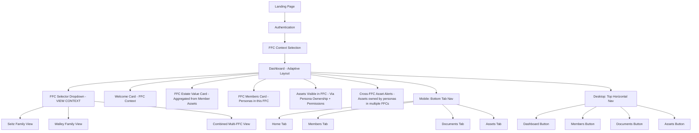
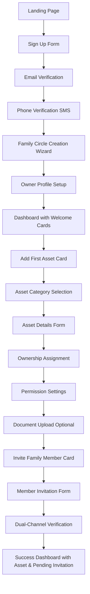
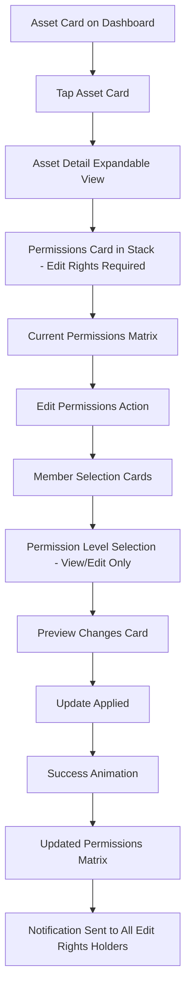

# Forward Inheritance Platform UI/UX Specification

## Change Log

| Date | Version | Description | Author |
|------|---------|-------------|--------|
| 2025-08-18 | 1.0 | Initial UI/UX specification for mobile-first responsive design | UX Expert |

## Introduction

This document defines the user experience goals, information architecture, user flows, and visual design specifications for Forward Inheritance Platform's user interface. It serves as the foundation for visual design and frontend development, ensuring a cohesive and user-centered experience.

### Overall UX Goals & Principles

#### Target User Personas

**Primary Family Owner (Ages 45-65):**
- High-net-worth individuals managing complex family wealth
- Values security, transparency, and family collaboration  
- Moderate to advanced technical comfort
- Needs comprehensive asset overview and control over permissions

**Family Beneficiaries (Ages 25-45):**
- Adult children and spouses in the family circle
- Varying technical comfort levels
- Needs clear understanding of their inheritance without overwhelming complexity
- Values mobile accessibility and simple task completion

**Senior Family Members (Ages 65+):**
- May have lower technical comfort but high stake in estate planning
- Needs larger text, simpler navigation, clear guidance
- Values human support and verification of important actions

**Financial Advisors (Professional Users):**
- Managing multiple family circles
- Advanced technical users needing efficiency and bulk operations
- Requires comprehensive reporting and client management tools

#### Usability Goals

- **Security with Simplicity:** Complex dual-channel verification completed in under 3 minutes
- **Multi-generational Accessibility:** 80+ year old users can complete core tasks with minimal assistance
- **Permission Clarity:** Asset ownership and permissions instantly understandable
- **Mobile-first Collaboration:** Family members can view and update assets seamlessly on mobile
- **Error Prevention:** No accidental asset transfers or permission changes

#### Design Principles

1. **Trust Through Transparency** - Every permission, ownership, and security measure is clearly visible
2. **Progressive Complexity** - Simple interfaces for basic users, advanced features available when needed  
3. **Family-First Design** - Prioritize collaboration and shared understanding over individual efficiency
4. **Security Without Friction** - Make mandatory security feel helpful, not burdensome
5. **Cross-Generational Usability** - Design that works for both 25-year-olds and 75-year-olds

## Information Architecture (IA) - Mobile-First Card-Based Design with FFC Context

### Site Map / Screen Inventory

### Navigation Structure

**FFC Context as Viewing Filter (NOT Ownership Boundary):**
The FFC selector functions as a **viewing context filter** rather than an ownership boundary. When a user selects "Seitz Family Dashboard," they see:
- Assets owned by personas who are members of the Seitz Family FFC
- Assets that personas have shared/given permission to the Seitz Family FFC
- Aggregated estate values from all visible assets within this FFC context
- Assets remain owned by individual personas, not the FFC

**Primary Navigation - Responsive Behavior:**

**Mobile (≤768px):** 
- Bottom tab navigation with 4 core tabs: Home, Members, Documents, Assets
- FFC selector in top header with clear family name display
- User avatar and notifications in top-right

**Desktop (>768px):**
- Top horizontal navigation with pill-style buttons
- FFC selector prominent in top-left after logo
- User menu, notifications, and settings in top-right
- Global search bar integrated into header

## User Flows

### Flow 1: New Family Circle Creation with First Asset

**User Goal:** Set up a new family circle and add the first asset to begin estate planning

**Entry Points:** 
- Landing page "Get Started" CTA
- Dashboard "Create New Family Circle" (for existing users)

**Success Criteria:** 
- Family circle created with verified owner
- First asset successfully added with appropriate permissions
- Family member invitation sent and pending

#### Flow Diagram

#### Edge Cases & Error Handling:
- SMS delivery failure → Voice call backup option
- Email verification timeout → Resend with extended window
- Incomplete asset information → Save as draft card on dashboard
- Permission conflicts → Visual permission matrix with warnings

#### Edge Cases & Error Handling (Asset Permission Management):
- User lacks edit rights → Permission management interface hidden from asset detail view
- Attempting to remove all edit rights → Warning prevents removal of last editor
- Network interruption → Optimistic UI with rollback on failure
- Conflicting simultaneous edits → Last change wins with notification to all editors
- Invalid permission combinations → Clear error messaging with suggested corrections

### Flow 2: Asset Permission Management (Mobile-First)

**User Goal:** Asset owners with edit rights modify who can view a specific family asset

**Entry Points:**
- Asset detail card "Manage Permissions" action (only visible to users with edit rights)
- Asset settings menu for co-owners

**Success Criteria:**
- Permissions updated with clear visual confirmation
- All personas with edit rights notified of changes
- Audit trail created for compliance

**Access Control:** Only personas with edit rights on the asset can access this flow. This includes the original asset creator, co-owners granted edit rights, advisors who set up the account, or Forward concierge team.

#### Flow Diagram

### Flow 3: Document Upload with PII Protection

**User Goal:** Upload sensitive financial documents while ensuring automatic PII protection for family viewing

**Entry Points:**
- Asset card "Add Documents" action
- Missing documentation alert card action

**Success Criteria:**
- Document uploaded and processed successfully
- PII automatically detected and masked
- Original and masked versions available with appropriate permissions

## Component Library / Design System

### Design System Approach

**Design System Approach:** Build upon existing Forward design patterns, creating a cohesive card-based component library optimized for financial/inheritance data display. Components are mobile-first with responsive adaptations for desktop, following Credit Karma-style patterns while maintaining Forward's distinctive green branding.

### Core Components

#### FFC Context Selector

**Purpose:** Critical navigation component allowing users to switch between family circle contexts

**Variants:**
- **Primary (Desktop):** Full dropdown with family names and user role indicators
- **Compact (Mobile):** Simplified dropdown with current family name prominent

**States:**
- **Default:** Shows current FFC name with dropdown indicator
- **Expanded:** List of accessible FFCs with user's role in each
- **Loading:** Transition animation during context switch

#### Asset Category Card

**Purpose:** Display asset categories with aggregated values, counts, and quick access

**Variants:**
- **Summary Card:** Category icon, name, item count, total value
- **Detailed Card:** Includes recent activity, missing documentation alerts
- **Action Card:** Includes primary CTA button (Add Asset, Review Documentation)
- **Empty State Card:** Encourages first asset addition

**States:**
- **Default:** Standard information display with interactions
- **Loading:** Skeleton loader while calculating values
- **Alert:** Highlighted state for categories needing attention

#### Persona Member Card

**Purpose:** Display family member information with asset ownership summary

**Variants:**
- **Compact Card:** Avatar, name, role, basic contact info
- **Detailed Card:** Full contact information, asset summary, recent activity
- **Invitation Card:** Special variant for pending member invitations

**States:**
- **Active:** Currently online/recently active members
- **Inactive:** Members who haven't accessed platform recently
- **Pending:** Invitation sent but not yet accepted

## Branding & Style Guide

### Visual Identity

**Brand Guidelines:** Build upon existing Forward brand identity emphasizing trust, transparency, and family collaboration. The green logo and clean typography suggest a growth-oriented, secure financial platform.

### Color Palette

| Color Type | Hex Code | Usage |
|------------|----------|--------|
| Primary | #22C55E | Forward logo, primary CTAs, success states |
| Secondary | #16A34A | Hover states, secondary actions |
| Accent | #059669 | Active navigation states, selected items |
| Success | #10B981 | Document status current, completed tasks |
| Warning | #F59E0B | Pending documents, attention needed |
| Error | #EF4444 | Expired documents, failed actions |
| Neutral | #64748B, #94A3B8, #CBD5E1, #F1F5F9 | Text hierarchy, borders, backgrounds |

### Typography

#### Font Families
- **Primary:** Inter (clean, readable, professional for financial data)
- **Secondary:** System fonts fallback
- **Monospace:** 'SF Mono', Monaco (for financial values, account numbers)

#### Type Scale

| Element | Size | Weight | Line Height |
|---------|------|---------|-------------|
| H1 | 32px / 2rem | 700 (Bold) | 1.2 |
| H2 | 24px / 1.5rem | 600 (Semi-bold) | 1.3 |
| H3 | 20px / 1.25rem | 600 (Semi-bold) | 1.4 |
| Body | 16px / 1rem | 400 (Regular) | 1.5 |
| Small | 14px / 0.875rem | 400 (Regular) | 1.4 |

### Iconography

**Icon Library:** Phosphor Icons for consistency with modern financial interfaces

**Usage Guidelines:** 
- Use 24px icons for primary actions, 16px for secondary elements
- Maintain consistent visual weight across icon sets
- Use outline style for inactive states, filled for active states

### Spacing & Layout

**Grid System:** 12-column responsive grid with 16px gutters on mobile, 24px on desktop

**Spacing Scale:** 4px base unit with 8px, 12px, 16px, 24px, 32px, 48px, 64px increments

## Accessibility Requirements

### Compliance Target

**Standard:** WCAG 2.1 AA compliance with selective AAA guidelines for critical financial interactions

### Key Requirements

**Visual:**
- **Color contrast ratios:** Minimum 4.5:1 for normal text, 3:1 for large text, 7:1 AAA for critical financial values
- **Focus indicators:** 2px solid outline with high contrast color visible against all backgrounds
- **Text sizing:** Minimum 16px base font size with scalability up to 200% zoom

**Interaction:**
- **Keyboard navigation:** Full keyboard accessibility with logical tab order and skip links
- **Screen reader support:** Semantic HTML with comprehensive ARIA labels and live regions
- **Touch targets:** Minimum 44px touch targets with 8px spacing between elements

**Content:**
- **Alternative text:** Descriptive alt text for persona avatars, asset category icons, document thumbnails
- **Heading structure:** Logical H1-H6 hierarchy reflecting content structure
- **Form labels:** Clear, descriptive labels with error messages associated via aria-describedby

### Testing Strategy

**Multi-Modal Testing Approach:**
- **Automated testing:** Integration of axe-core accessibility testing in CI/CD pipeline
- **Screen reader testing:** Manual testing with NVDA, JAWS, and VoiceOver
- **Keyboard-only testing:** Complete user flows using only keyboard navigation
- **Senior user testing:** Specific usability sessions with users 65+ to validate usability

## Responsiveness Strategy

### Breakpoints

| Breakpoint | Min Width | Max Width | Target Devices |
|------------|-----------|-----------|----------------|
| Mobile | 320px | 767px | Smartphones, narrow tablets in portrait |
| Tablet | 768px | 1023px | iPads, Android tablets, small laptops |
| Desktop | 1024px | 1439px | Standard laptops, desktop monitors |
| Wide | 1440px | - | Large monitors, ultra-wide displays, advisor workstations |

### Adaptation Patterns

**Layout Changes:** 
- **Mobile:** Single-column card stack with bottom tab navigation
- **Tablet:** Two-column card grid, hybrid navigation
- **Desktop:** Multi-column layouts, top horizontal navigation, hover states
- **Wide:** Three+ column layouts, dashboard widgets, advanced data visualization

**Navigation Changes:**
- **Mobile:** Bottom tab bar optimized for thumb navigation
- **Tablet:** Top pill navigation with optional bottom shortcuts
- **Desktop:** Full horizontal navigation with dropdowns and search
- **Wide:** Potential persistent sidebar with expanded options

**Content Priority:**
- **Mobile:** Essential information only, progressive disclosure
- **Tablet:** Balanced information density, expandable sections
- **Desktop:** Full information display, comprehensive action menus
- **Wide:** Rich data visualization, multiple context views

## Animation & Micro-interactions

### Motion Principles

**Subtle and Purposeful Animation:** All motion serves a functional purpose - providing feedback, showing relationships, or guiding attention. Animations feel natural and trustworthy, respecting user preferences with `prefers-reduced-motion` support.

### Key Animations

- **FFC Context Switch:** Smooth fade transition (300ms, ease-out) with loading skeleton
- **Card Expansion:** Scale transform (250ms, ease-in-out) from summary to detailed view
- **Asset Value Updates:** Gentle number counter animation (500ms, ease-out)
- **Permission Changes:** Color-coded slide animation (200ms, ease-in)
- **Document Upload:** Progress ring with success pulse (150ms, ease-out)
- **Loading States:** Skeleton shimmer animation (1500ms loop, linear)

## Performance Considerations

### Performance Goals
- **Page Load:** <2 seconds initial page load on 4G networks
- **Interaction Response:** <100ms response time for all user interactions
- **Animation FPS:** Consistent 60fps for all motion elements

### Design Strategies
**Progressive Loading:** Critical financial data loads first with skeleton animations. **Optimized Asset Delivery:** Responsive images with lazy loading. **Efficient State Management:** Card-based architecture enables selective updates during FFC context switching.

## Next Steps

### Immediate Actions
1. **Stakeholder Review Session:** Present UI/UX specification to product, engineering, and design teams
2. **User Research Validation:** Conduct usability testing with target personas
3. **Technical Architecture Alignment:** Collaborate with backend team on persona-asset database alignment
4. **Prototype Development:** Create interactive prototypes for core user flows
5. **Accessibility Audit Planning:** Schedule comprehensive accessibility review

### Design Handoff Checklist
- [x] All user flows documented with persona-centric asset ownership model
- [x] Component inventory complete with responsive variants and FFC context handling
- [x] Accessibility requirements defined for multi-generational users
- [x] Responsive strategy clear with mobile-first, adaptive navigation approach
- [x] Brand guidelines incorporated with trust-focused design systems
- [x] Performance goals established for financial data handling

---

**Document Status:** ✅ Complete and ready for design-to-development handoff

This specification provides the foundation for building Forward's inheritance planning platform with proper persona-asset ownership, responsive card-based design, and multi-generational accessibility.