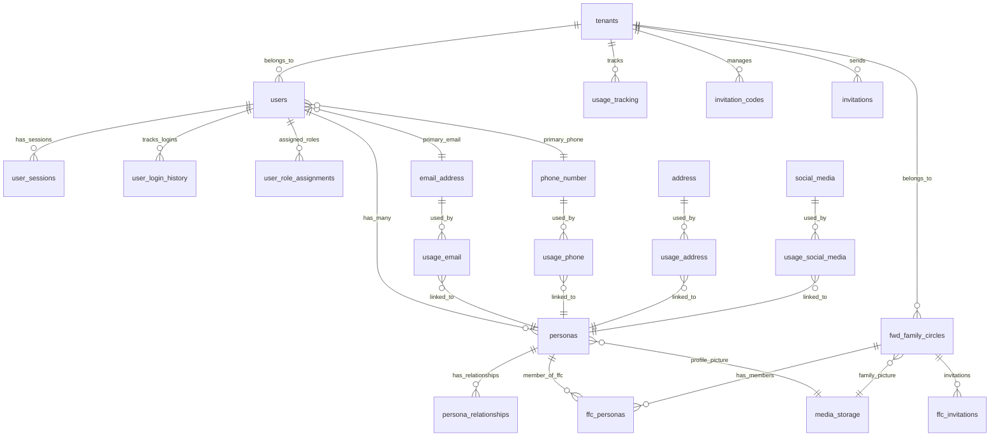
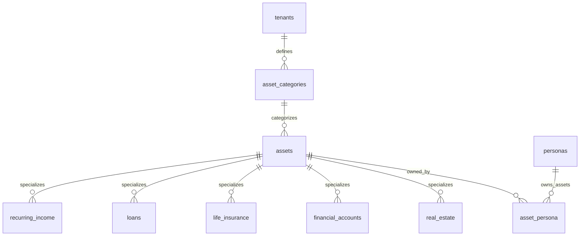
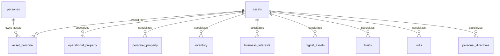
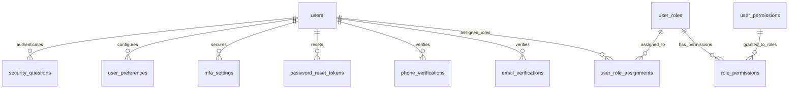
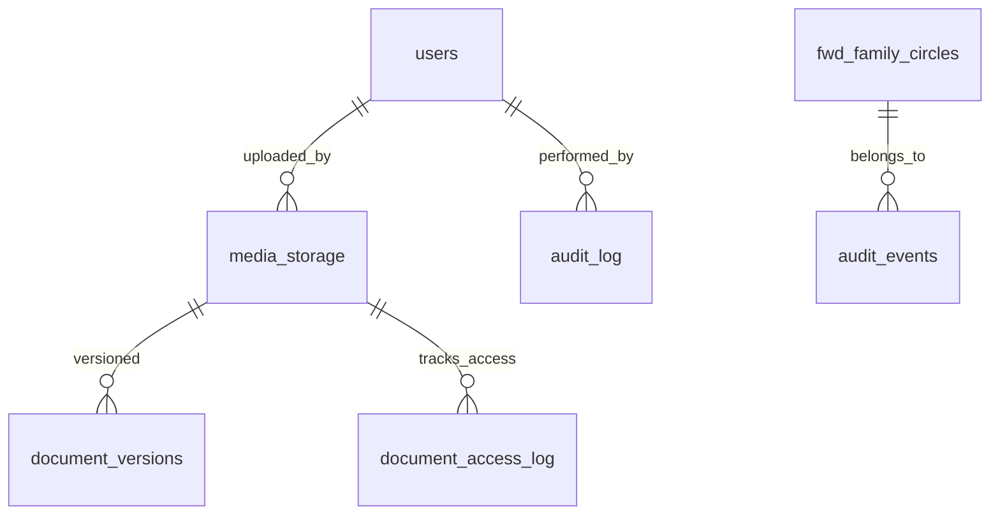
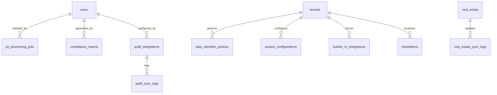

# 02 - Forward Inheritance Platform - Database Schema Reference

## Table of Contents
1. [Schema Overview](#schema-overview)
2. [Entity Relationship Diagram](#entity-relationship-diagram)
3. [Table Categories](#table-categories)
4. [Enum Definitions](#enum-definitions)
5. [Indexing Strategy](#indexing-strategy)
6. [Constraint Summary](#constraint-summary)
7. [Data Dictionary](#data-dictionary)

## Schema Overview

The Forward Inheritance Platform database consists of **56 tables** organized into logical functional areas. The schema supports multi-tenant architecture, comprehensive asset management, and detailed audit tracking.

### Key Statistics
- **Total Tables**: 56
- **Enum Types**: 25+
- **Stored Procedures**: 45+
- **Indexes**: 60+ (including composite indexes)
- **Primary Key Strategy**: INTEGER for tenants (1=Forward, 2-50 for customers), UUID for entities

## Entity Relationship Diagrams

The Forward Inheritance Platform's 56 tables are organized into three focused diagrams for better readability and understanding.

### Diagram 1: Core Platform & User Management (19 tables)
*Core infrastructure, user authentication, family organization, and contact management*



### Diagram 2A: Asset Core & Financial Assets (9 tables)
*Asset foundation, ownership, and financial asset types*



### Diagram 2B: Physical & Business Assets (8 tables)
*Property, business interests, and legal document assets*



### Diagram 3A: Security & Authentication (10 tables)
*RBAC permissions, user authentication, and security features*



### Diagram 3B: Document Storage & Audit (5 tables)
*Document management, media storage, and audit trail systems*



### Diagram 3C: Compliance & Integration (9 tables)
*Compliance management, PII processing, and external system integration*



## Table Categories

### 1. Core Infrastructure (11 tables)
- **tenants**: Multi-tenant organization management
- **users**: Authentication and system access
- **personas**: Business identity layer for family members
- **fwd_family_circles**: Family financial organization units
- **ffc_members**: Family circle membership and roles
- **roles**: Permission-based access control
- **permissions**: Granular permission definitions
- **role_permissions**: Role-permission assignments
- **usage_tracking**: System usage analytics
- **invitation_codes**: User invitation management
- **invitations**: Invitation workflow tracking

### 2. Contact & Address Management (5 tables)
- **address**: Physical and mailing addresses
- **emails**: Email address management
- **phones**: Phone number management
- **social_media**: Social media profile tracking
- **contacts**: External contact management

### 3. Asset Management (15 tables)
- **assets**: Base asset table (common properties)
- **asset_persona**: Ownership junction table
- **real_estate**: Real property assets
- **financial_accounts**: Bank and investment accounts
- **operational_property**: Vehicles, boats, equipment, machinery
- **life_insurance**: Life insurance policies
- **personal_property**: Personal belongings
- **business_interests**: Business ownership (ownership_interests)
- **digital_assets**: Intellectual property, digital assets
- **inventory**: Business inventory and fixtures
- **loans**: Loan assets/liabilities
- **trusts**: Trust structures
- **wills**: Will documents
- **personal_directives**: Healthcare and legal directives
- **recurring_income**: Royalties and recurring income streams

### 4. Security & Authentication (8 tables)
- **user_sessions**: Active user sessions
- **email_verifications**: Email verification workflow
- **phone_verifications**: SMS verification workflow
- **password_reset_tokens**: Password reset management
- **user_login_history**: Login attempt tracking
- **mfa_settings**: Multi-factor authentication
- **user_preferences**: User configuration
- **security_questions**: Security question management

### 5. Document & Media Storage (4 tables)
- **media_storage**: File storage management
- **documents**: Document metadata and organization
- **document_versions**: Document version control
- **document_access_log**: Document access tracking

### 6. Audit & Compliance (6 tables)
- **audit_log**: Detailed action logging
- **audit_events**: Business event tracking
- **pii_processing_jobs**: PII detection and masking
- **compliance_reports**: Compliance reporting
- **data_retention_policies**: Data lifecycle management
- **system_configurations**: System-wide settings

### 7. Integration & External Systems (6 tables)
- **quillt_integrations**: Financial data integration
- **quillt_sync_logs**: Quillt synchronization tracking
- **builder_io_integrations**: Content management integration
- **real_estate_sync_logs**: Property valuation sync
- **translations**: Multi-language support
- **advisor_companies**: Financial advisor management

### 8. Relationship Management (2 tables)
- **persona_relationships**: Family relationship tracking
- **contact_relationships**: External contact relationships

## Enum Definitions

### Core System Enums
```sql
-- General status for most entities
CREATE TYPE status_enum AS ENUM ('active', 'inactive', 'pending', 'suspended', 'deleted');

-- User-specific status with verification states
CREATE TYPE user_status_enum AS ENUM ('pending_verification', 'active', 'inactive', 'suspended', 'locked');

-- Entity types for audit logging
CREATE TYPE entity_type_enum AS ENUM ('user', 'persona', 'asset');
```

### Contact & Personal Information
```sql
-- Gender identification
CREATE TYPE gender_enum AS ENUM ('male', 'female', 'non_binary', 'prefer_not_to_say', 'other');

-- Marital status for legal purposes
CREATE TYPE marital_status_enum AS ENUM ('single', 'married', 'divorced', 'widowed', 'separated', 'domestic_partnership');

-- Family relationships
CREATE TYPE family_relationship_enum AS ENUM ('spouse', 'child', 'parent', 'sibling', 'grandparent', 'grandchild', 'aunt_uncle', 'cousin', 'in_law', 'step_family', 'other');

-- Contact information types
CREATE TYPE phone_type_enum AS ENUM ('mobile', 'landline', 'voip', 'toll_free', 'fax');
CREATE TYPE email_type_enum AS ENUM ('personal', 'business', 'temporary', 'alias', 'shared');
CREATE TYPE address_type_enum AS ENUM ('residential', 'business', 'mailing', 'billing', 'property', 'temporary');
```

### Asset Management Enums
```sql
-- Asset ownership types
CREATE TYPE ownership_type_enum AS ENUM ('owner', 'beneficiary', 'trustee', 'executor');

-- Real estate specific
CREATE TYPE property_type_enum AS ENUM ('single_family', 'multi_family', 'condominium', 'townhouse', 'commercial', 'land', 'other');
CREATE TYPE property_use_enum AS ENUM ('primary_residence', 'secondary_residence', 'rental_property', 'commercial_use', 'vacant_land', 'other');

-- Financial accounts
CREATE TYPE account_type_enum AS ENUM ('checking', 'savings', 'investment', 'retirement_401k', 'retirement_ira', 'trust_account', 'other');

-- Vehicle types
CREATE TYPE vehicle_type_enum AS ENUM ('car', 'truck', 'motorcycle', 'boat', 'rv', 'aircraft', 'other');

-- Insurance types
CREATE TYPE insurance_type_enum AS ENUM ('term_life', 'whole_life', 'universal_life', 'variable_life', 'other');

-- Trust types
CREATE TYPE trust_type_enum AS ENUM ('revocable_living_trust', 'irrevocable_trust', 'charitable_trust', 'special_needs_trust', 'other');

-- Loan types
CREATE TYPE loan_type_enum AS ENUM ('personal', 'mortgage', 'interfamily', 'business', 'student', 'auto', 'HEI', 'other');
```

### Document & Media
```sql
-- Document categorization
CREATE TYPE document_type_enum AS ENUM ('will', 'trust', 'insurance_policy', 'deed', 'contract', 'statement', 'certificate', 'directive', 'other');
CREATE TYPE document_category_enum AS ENUM ('legal', 'financial', 'personal', 'medical', 'business', 'tax', 'insurance');

-- Media processing status
CREATE TYPE processing_status_enum AS ENUM ('uploaded', 'processing', 'ready', 'failed');

-- Data retention policies
CREATE TYPE retention_policy_enum AS ENUM ('permanent', '7_years', '5_years', '3_years', '1_year', '6_months');
```

### System & Security
```sql
-- FFC member roles
CREATE TYPE ffc_role_enum AS ENUM ('owner', 'beneficiary', 'non_beneficiary', 'advisor');

-- Permission categories
CREATE TYPE permission_category_enum AS ENUM ('asset', 'user', 'admin', 'report', 'document', 'ffc', 'system');

-- Invitation workflow
CREATE TYPE invitation_status_enum AS ENUM ('sent', 'phone_verified', 'accepted', 'approved', 'expired', 'cancelled', 'declined');

-- PII processing status
CREATE TYPE pii_status_enum AS ENUM ('pending', 'processing', 'completed', 'failed');
```

## Indexing Strategy

### Primary Indexes
- Entity tables use UUID primary keys, tenants use INTEGER primary keys
- Foreign key columns have supporting indexes
- Multi-tenant queries optimized with `tenant_id` leading indexes

### Composite Indexes
```sql
-- Core access patterns
CREATE INDEX idx_users_tenant_email ON users(tenant_id, email);
CREATE INDEX idx_personas_user_primary ON personas(user_id, is_primary);
CREATE INDEX idx_assets_tenant_category ON assets(tenant_id, asset_category);
CREATE INDEX idx_asset_persona_persona_type ON asset_persona(persona_id, ownership_type);

-- Audit and logging
CREATE INDEX idx_audit_log_tenant_occurred ON audit_log(tenant_id, occurred_at DESC);
CREATE INDEX idx_audit_events_ffc_timestamp ON audit_events(ffc_id, event_timestamp DESC);

-- Session management
CREATE INDEX idx_user_sessions_active ON user_sessions(user_id, is_active, expires_at);
```

### JSONB Indexes
```sql
-- Metadata search capabilities
CREATE INDEX idx_assets_metadata_gin ON assets USING gin(metadata);
CREATE INDEX idx_real_estate_metadata_gin ON real_estate USING gin(metadata);
```

## Constraint Summary

### Foreign Key Constraints
- All foreign keys use CASCADE DELETE where appropriate
- Multi-tenant relationships enforce tenant_id consistency
- Circular reference prevention in persona relationships

### Check Constraints
```sql
-- Percentage validations
ALTER TABLE asset_persona ADD CONSTRAINT chk_ownership_percentage 
CHECK (ownership_percentage >= 0 AND ownership_percentage <= 100);

-- Date validations
ALTER TABLE personas ADD CONSTRAINT chk_birth_date 
CHECK (date_of_birth <= CURRENT_DATE);

-- Status consistency
ALTER TABLE users ADD CONSTRAINT chk_verification_status 
CHECK ((email_verified = true AND phone_verified = true) OR status != 'active');
```

### Unique Constraints
```sql
-- Business rule enforcement
ALTER TABLE users ADD CONSTRAINT uq_users_tenant_email UNIQUE (tenant_id, email);
ALTER TABLE personas ADD CONSTRAINT uq_personas_user_primary UNIQUE (user_id, is_primary) 
WHERE is_primary = true;
ALTER TABLE builder_io_integrations ADD CONSTRAINT uq_builder_page UNIQUE (page_name);
```

## Data Dictionary

### Key Table Descriptions

#### Core Infrastructure

**tenants**
- Purpose: Multi-tenant organization management
- Key Fields: `id` INTEGER (PK), `name`, `display_name`, `created_at`
- Relationships: Parent to all other entities

**users** 
- Purpose: Authentication and system access
- Key Fields: `id` UUID (PK), `tenant_id` INTEGER (FK), `email`, `password_hash`, `status`
- Relationships: One-to-many with personas, sessions

**personas**
- Purpose: Business identity layer for family members
- Key Fields: `id` UUID (PK), `user_id` UUID (FK), `first_name`, `last_name`, `tenant_id` INTEGER (FK)
- Relationships: Many-to-many with assets via asset_persona

**fwd_family_circles**
- Purpose: Family financial organization units
- Key Fields: `id` UUID (PK), `tenant_id` INTEGER (FK), `name`, `description`
- Relationships: One-to-many with ffc_personas

#### Asset Management

**assets**
- Purpose: Base asset table with common properties
- Key Fields: `id` UUID (PK), `tenant_id` INTEGER (FK), `category_id` UUID (FK), `name`, `tags`
- Relationships: One-to-many with asset_persona relationships

**asset_persona**
- Purpose: Ownership junction table
- Key Fields: `asset_id` UUID (FK), `persona_id` UUID (FK), `ownership_type`, `ownership_percentage`
- Relationships: Many-to-many junction between assets and personas

**real_estate** (and other asset specializations)
- Purpose: Real property asset specialization
- Key Fields: `id` UUID (PK), references assets table, `property_type`, `current_value`
- Relationships: Links to addresses via usage_address table

#### Security & Audit

**audit_log**
- Purpose: Detailed action logging for compliance
- Key Fields: `id` UUID (PK), `tenant_id` INTEGER (FK), `user_id` UUID (FK), `action`, `entity_type`, `entity_id`
- Relationships: References users and various entity types

**user_sessions**
- Purpose: Active user session management
- Key Fields: `id` UUID (PK), `user_id` UUID (FK), `session_token`, `expires_at`, `is_active`
- Relationships: Belongs to users

---

*This schema reference provides comprehensive coverage of the Forward Inheritance Platform database structure. For implementation details and usage examples, refer to the specific table and procedure documentation.*