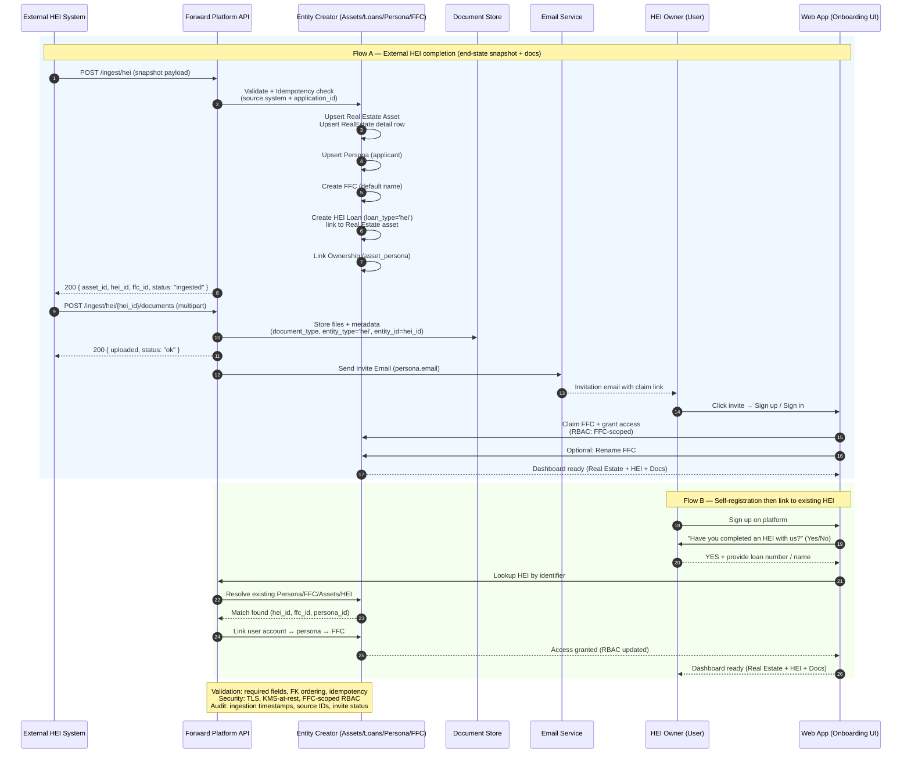

# PRD: HEI Onboarding & Linking

## 1. Overview
This feature enables the Forward Inheritance Platform to seamlessly integrate completed Home Equity Investments (HEIs) into the system, whether initiated **externally** (manual/API ingestion of a finished HEI) or **internally** (customer self-registers). The result is that the HEI customer appears on the platform with:  
- A **Forward Family Circle (FFC)**,  
- A **Persona** record,  
- A **Real Estate asset** tied to their property,  
- A **HEI loan asset** with terms & documents,  
- All relevant documents securely stored and linked,  
- And an **account owner experience** where they can log in, rename their FFC, and continue using the platform.

---

## 2. Goals
- Make it trivial to onboard an HEI customer into the platform after their deal closes.  
- Provide a **single source of truth** for HEI assets, personas, and real estate.  
- Allow customers to self-register and “claim” their HEI by entering an identifier (loan number or name).  
- Ensure all HEI-related documents are securely stored and accessible.  
- Minimize manual ops — the API creates all required records, the user just accepts an invite.

---

## 3. User Stories

### 3.1 External HEI Completion → Platform Onboarding
- **As a system** (external HEI processor),  
  I send an API call with the completed HEI snapshot + documents.  
- **The platform** automatically:  
  - Creates a `real_estate` asset and attaches property details.  
  - Creates a `loan` asset of type `hei` with agreed terms and links to the property.  
  - Creates a `persona` for the homeowner.  
  - Creates an `ffc` for that persona (default name = “HEI Circle - [Applicant Name]”).  
  - Uploads & links documents (`hei_agreement`, `recorded_instrument`, etc.).  
  - Generates an **invite** for the persona’s email.  
- **The user** receives the invite, signs up, renames their FFC, and sees all HEI details.

### 3.2 Customer Self-Registration
- **As a new user** on the platform,  
  when I create my account, I’m asked:  
  - “Have you completed an HEI with us already?”  
  - If YES, I provide loan number or name.  
- **The platform**:  
  - Looks up the HEI record.  
  - Connects my user account to the existing persona & FFC.  
  - Ensures I have access to the real estate + HEI loan assets + documents.  
- **The user**: immediately sees their HEI dashboard, can rename their FFC, and continue.

---

## 4. Functional Requirements

### 4.1 API Ingestion (External HEI Push)
- `POST /ingest/hei` endpoint accepts:  
  - Real estate details (address, parcel, etc.)  
  - HEI terms (funded amount, equity share, effective date, maturity terms)  
  - Owner persona (legal name, email, DOB minimal)  
  - Documents (linked via `media_storage`)  
- System actions:  
  1. Create `assets` entry (real estate)  
  2. Create `loans` entry (`loan_type=hei`) linked to asset  
  3. Create `persona` for applicant  
  4. Create `ffc` with default name  
  5. Attach persona → asset → ffc via `asset_persona`  
  6. Store documents with metadata  
  7. Generate & send invite email to persona’s email

### 4.2 Invite Flow
- Invite email includes:  
  - Link to signup  
  - Instructions: “Claim your HEI Circle and set a custom name.”  
- On first login:  
  - User can rename their FFC.  
  - User sees their property, HEI loan, and documents.  

### 4.3 Self-Registration Flow
- Registration form includes question:  
  - “Have you completed an HEI with us?” → Yes/No  
- If YES:  
  - Prompt for **loan number** (or searchable asset name).  
  - Validate against existing `loans` (`loan_type=hei`) records.  
  - If match: link new user account to existing persona + ffc.  
  - If no match: user continues without linking (default experience).  

### 4.4 Linking Rules
- One HEI loan maps to one property (`real_estate.asset_id`).  
- One applicant persona belongs to one FFC (newly created if not existing).  
- Documents linked to loan (`entity_type=hei`, `entity_id=loan.id`).  
- FFC name can always be updated by user.

---

## 5. Non-Functional Requirements
- **Security**:  
  - All documents encrypted at rest (S3 + KMS) and in transit.  
  - Access control: only FFC members can view/download docs.  
- **Idempotency**: API ingestion must be safe to re-run (same `loan_number`/`external_id`).  
- **Auditability**: capture ingestion timestamp, source system, and invite status.  
- **Scalability**: expect batch imports (hundreds at once).  

---

## 6. Success Metrics
- % of HEI customers successfully onboarded (invite → signup).  
- Time-to-first-login (from ingestion to user signup).  
- Accuracy of HEI linking (low support tickets for missing/duplicate accounts).  

---

## 7. Open Questions
- Should FFC name default to “HEI Circle – [Last Name]” or a generic “My HEI Circle”?  
- How to handle **joint applicants** (multiple personas linked to the same FFC)?  
- Will support reps need an **admin override** to re-send invites or relink an HEI if the user registers with a different email?  

---

## 8. Next Steps
1. Confirm data fields required from external HEI system (minimal snapshot).  
2. Finalize document type enum for ingestion.  
3. Define invite email template + account-claim flow.  
4. Build API + admin UI for manual ingestion.  
5. QA end-to-end with sample HEI ingestion and user signup.  

---

# HEI End-State Ingestion (Snapshot + Docs)

## 1) Minimal Data Snapshot
- **Identifiers & Linking**: `source_system`, `source_application_id`, `asset_id`, `hei_id`, `persona_id`, `ffc_id`  
- **Deal Terms**: `hei_amount_funded`, `equity_share_pct`, `effective_date`, `maturity/exit_terms`, `fees`  
- **Capital Stack**: `first_mortgage_balance`, `junior_liens_balance`, `cltv_at_close`  
- **Property Snapshot**: address, parcel/APN, HOA dues  
- **Valuation**: `valuation_amount`, `valuation_method`, `valuation_effective_date`  
- **Recording**: jurisdiction, instrument_number, book/page, recorded_at  
- **Funding**: method, account_last4, funded_at  
- **Servicing**: monitoring policy, notification contacts

---

## 2) Documents Package

**Required**  
- Executed HEI Agreement (`hei_agreement`)  
- Recorded security instrument (`deed_of_trust_final` | `memorandum_final` | `lien_notice_final`)  
- Title pack (`prelim_title`)  
- Payoff demands/settlement statement  
- HOI declarations (`hoi_declarations`)  
- Valuation report (`avm_certificate` | `bpo_report` | `appraisal_report`)  
- Closing disclosure (`closing_disclosure`)

**Optional**  
- Tax bill (`tax_bill`)  
- HOA statement (`hoa_statement`)  
- KYC evidence (as status flags only)

---

## 3) Schema Mapping
- Real Estate → `assets` + `real_estate` row  
- HEI → `loans` (`loan_type=hei`)  
- Owners → `asset_persona` (ownership_type='owner')  
- Documents → `media_storage` + `document_metadata(entity_type='hei', entity_id=<hei_id>)`

---

## 4) API Endpoints

### `/ingest/hei`
- Accepts JSON payload with all snapshot fields.  
- Idempotent (keyed by `source_application_id`).  
- Creates asset, loan, persona, FFC, links, and docs.  
- Returns `asset_id`, `hei_id`, `ffc_id`.

### `/ingest/hei/{hei_id}/documents`
- Accepts multipart file upload or references to pre-uploaded `media_storage_id`s.  
- Attaches docs to the HEI.

---

## 5) Manual Admin Checklist
1. Create Real Estate asset.  
2. Create Persona.  
3. Create FFC.  
4. Link owners via `asset_persona`.  
5. Insert HEI loan row.  
6. Upload & tag docs.  
7. Send invite to owner.

---

## 6) Validation & Business Rules
- Enforce idempotency.  
- Required fields: amount_funded, equity_share_pct, effective_date, one valuation, one recording, HEI Agreement doc.  
- Access: only FFC members see docs.  
- PII: minimal KYC flags only.

---

## 7) Security
- Docs encrypted at rest/in transit.  
- Audit ingestion source + timestamp.  
- RBAC = FFC-scoped.

---

## 8) Future Events
- Accept `valuation_update`, `sale_recorded`, `refi_detected`, `buyout_requested`, `insurance_update`, `hoa_change`.

---

# OpenAPI Specification

```yaml
openapi: 3.0.3
info:
  title: HEI Ingestion API
  version: 1.0.0
paths:
  /ingest/hei:
    post:
      summary: Ingest completed HEI snapshot
      operationId: ingestHei
      parameters:
        - in: header
          name: Idempotency-Key
          required: true
          schema:
            type: string
          description: Unique key to ensure idempotency of ingestion
      requestBody:
        required: true
        content:
          application/json:
            schema:
              type: object
              properties:
                source:
                  type: object
                  properties:
                    system: { type: string }
                    application_id: { type: string }
                  required: [system, application_id]
                property:
                  type: object
                  properties:
                    address: 
                      type: object
                      properties:
                        line1: { type: string }
                        line2: { type: string }
                        city: { type: string }
                        state: { type: string }
                        postal_code: { type: string }
                        country: { type: string }
                    parcel_number: { type: string }
                owners:
                  type: array
                  items:
                    type: object
                    properties:
                      persona_external_id: { type: string }
                hei:
                  type: object
                  properties:
                    amount_funded: { type: number, format: float }
                    equity_share_pct: { type: number, format: float }
                    effective_date: { type: string, format: date }
                    maturity_terms: { type: string }
                    fees: { type: object }
                  required: [amount_funded, equity_share_pct, effective_date]
                capital_stack:
                  type: object
                  properties:
                    first_mortgage_balance: { type: number, format: float }
                    junior_liens_balance: { type: number, format: float }
                    cltv_at_close: { type: number, format: float }
                valuation:
                  type: object
                  properties:
                    amount: { type: number, format: float }
                    method: { type: string, enum: [avm, bpo, appraisal] }
                    effective_date: { type: string, format: date }
                recording:
                  type: object
                  properties:
                    jurisdiction: { type: string }
                    instrument_number: { type: string }
                    book_page: { type: string }
                    recorded_at: { type: string, format: date-time }
                funding:
                  type: object
                  properties:
                    method: { type: string, enum: [ach, wire] }
                    destination_account_last4: { type: string }
                    funded_at: { type: string, format: date-time }
                servicing:
                  type: object
                  properties:
                    monitoring_policy: { type: string }
                    notification_contacts:
                      type: array
                      items:
                        type: object
                        properties:
                          persona_external_id: { type: string }
      responses:
        "200":
          description: HEI successfully ingested
          content:
            application/json:
              schema:
                type: object
                properties:
                  asset_id: { type: string, format: uuid }
                  hei_id: { type: string, format: uuid }
                  ffc_id: { type: string, format: uuid }
                  status: { type: string }
  /ingest/hei/{hei_id}/documents:
    post:
      summary: Attach documents to HEI
      operationId: uploadHeiDocuments
      parameters:
        - in: path
          name: hei_id
          required: true
          schema:
            type: string
            format: uuid
      requestBody:
        required: true
        content:
          multipart/form-data:
            schema:
              type: object
              properties:
                documents:
                  type: array
                  items:
                    type: string
                    format: binary
      responses:
        "200":
          description: Documents successfully uploaded
          content:
            application/json:
              schema:
                type: object
                properties:
                  hei_id: { type: string, format: uuid }
                  uploaded: { type: integer }
                  status: { type: string }
```

---

# Sequence Diagram

