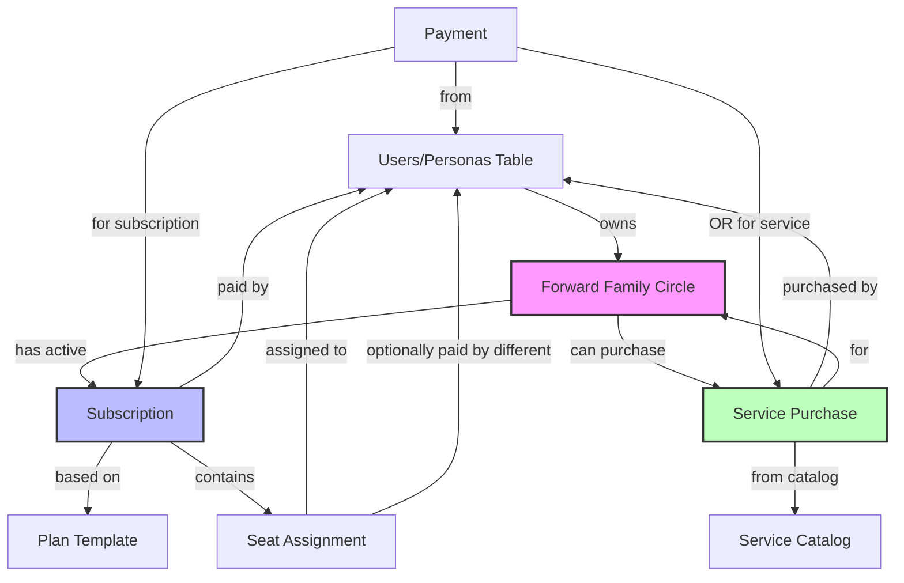
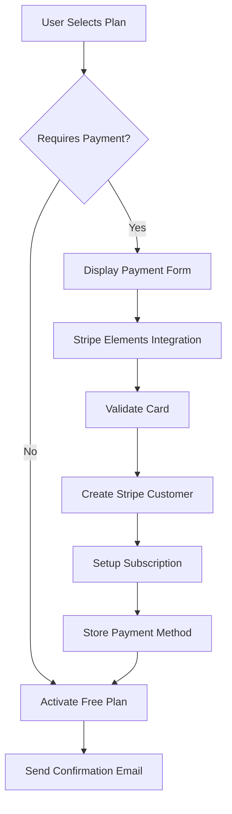
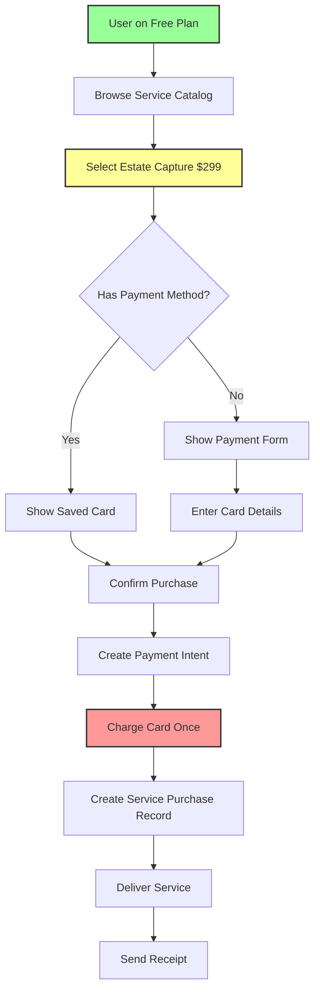

# Forward Subscription Platform - Product Brief

## Executive Summary

Forward requires a flexible, data-driven subscription platform that enables rapid experimentation with pricing models while maintaining robust financial tracking and seamless user experience. This platform will support seat-based plans, multiple payer configurations, Stripe payment processing, and comprehensive general ledger capabilities for financial reconciliation.

**Core Value Proposition:** Enable Forward to dynamically test and deploy subscription models through configuration rather than code changes, while providing enterprise-grade financial tracking and user-friendly plan management.

---

## Problem Statement

### Current Challenges
- **Inflexible Pricing:** Hard-coded pricing models prevent rapid experimentation
- **Limited Payment Options:** No support for multiple payer types or one-time services
- **Financial Tracking Gaps:** Lack of comprehensive payment and refund tracking
- **Manual Processes:** Plan transitions and seat management require manual intervention

### Business Impact
- Lost revenue opportunities from inability to test pricing models
- Increased operational overhead for plan management
- Risk of financial discrepancies without proper ledger tracking
- Poor user experience during plan transitions

---

## Solution Overview

### Platform Architecture
A modular subscription system with four core components:

1. **Flexible Plan Engine** - Data-driven plan configuration
2. **Payment Processing** - Stripe integration with multi-payer support
3. **General Ledger** - Complete financial tracking and reconciliation
4. **User Experience Layer** - Seamless plan management interface

### Key Capabilities
- Configure plans through database without code changes
- Support multiple payer types (Owner, Advisor, Individual)
- Process subscriptions and one-time payments
- Track all financial transactions in general ledger
- Automated invitation and seat management
- Self-service plan transitions

---

## Functional Requirements

### 1. Plan Configuration System

#### Entity Relationships


#### Key Relationships Explained
1. **FFC Owner → FFC**: User who creates and manages the family circle
2. **FFC → Subscription**: Each FFC has one active subscription (even if free)
3. **Subscription → Plan**: Links to plan template defining features/pricing
4. **Subscription → Payer**: User responsible for base plan payment (can be Owner, Advisor, or NULL for free)
5. **Subscription → Seats**: Contains multiple seat assignments
6. **Seat → Individual Payer**: Each seat can have its own payer (for self-upgrades)
7. **FFC → Service Purchases**: One-time services purchased for the FFC
8. **Service Purchase → Service Catalog**: Links to available services (e.g., Estate Capture)
9. **Payments → Multiple Types**: Can be for subscriptions OR one-time services

#### Database Schema
```sql
-- Core plan definition (templates/catalog)
plans:
  - plan_id (UUID, PK)
  - plan_code (String, unique) -- e.g., 'FREE_FAMILY', 'ADVISOR_SPONSORED'
  - plan_name (String)
  - plan_type (Enum: 'free', 'paid', 'sponsored')
  - base_price (Decimal)
  - billing_frequency (Enum: 'monthly', 'annual', 'one_time')
  - status (Enum: 'active', 'inactive', 'deprecated')
  - features (JSONB) -- Flexible feature flags
  - metadata (JSONB)
  - created_at, updated_at

-- Seat configuration per plan
plan_seats:
  - seat_config_id (UUID, PK)
  - plan_id (UUID, FK)
  - seat_type (Enum: 'basic', 'pro', 'enterprise')
  - included_quantity (Integer)
  - max_quantity (Integer, nullable)
  - additional_seat_price (Decimal)
  - features (JSONB)

-- Forward Family Circles
forward_family_circles:
  - ffc_id (UUID, PK)
  - ffc_name (String)
  - owner_user_id (UUID, FK) -- References users table
  - subscription_id (UUID, FK, nullable) -- Current active subscription
  - created_at (Timestamp)
  - updated_at (Timestamp)
  - metadata (JSONB)

-- Active subscriptions (one per FFC)
subscriptions:
  - subscription_id (UUID, PK)
  - ffc_id (UUID, FK) -- References forward_family_circles
  - plan_id (UUID, FK) -- References plans table
  - owner_user_id (UUID, FK) -- FFC owner (from FFC)
  - payer_id (UUID, FK) -- Who pays (can be different from owner)
  - payer_type (Enum: 'owner', 'advisor', 'third_party', 'none')
  - stripe_subscription_id (String, nullable)
  - status (Enum: 'active', 'trialing', 'past_due', 'canceled', 'pending')
  - current_period_start (Timestamp)
  - current_period_end (Timestamp)
  - metadata (JSONB)

-- Individual seat assignments
seat_assignments:
  - assignment_id (UUID, PK)
  - subscription_id (UUID, FK)
  - user_id (UUID, FK)
  - seat_type (Enum: 'basic', 'pro', 'enterprise')
  - payer_id (UUID, FK) -- Can differ from subscription payer
  - status (Enum: 'active', 'pending', 'suspended')
  - invited_at (Timestamp)
  - activated_at (Timestamp)
```

### 2. Payment Processing

#### Stripe Integration
```sql
-- Payment methods storage
payment_methods:
  - method_id (UUID, PK)
  - user_id (UUID, FK)
  - stripe_payment_method_id (String)
  - type (Enum: 'card', 'bank_account', 'invoice')
  - is_default (Boolean)
  - last_four (String)
  - brand (String)
  - exp_month, exp_year (Integer)
  - status (Enum: 'active', 'expired', 'failed')

-- One-time services
services:
  - service_id (UUID, PK)
  - service_code (String, unique)
  - service_name (String)
  - price (Decimal)
  - service_type (Enum: 'one_time', 'recurring')
  - description (Text)
  - features (JSONB)

-- Service purchases
service_purchases:
  - purchase_id (UUID, PK)
  - service_id (UUID, FK)
  - user_id (UUID, FK)
  - ffc_id (UUID, FK)
  - stripe_payment_intent_id (String)
  - amount (Decimal)
  - status (Enum: 'pending', 'completed', 'failed', 'refunded')
  - purchased_at (Timestamp)
```

### 3. General Ledger System

#### Financial Tracking
```sql
-- General ledger entries
general_ledger:
  - ledger_id (UUID, PK)
  - transaction_type (Enum: 'charge', 'refund', 'credit', 'adjustment')
  - transaction_date (Timestamp)
  - account_type (Enum: 'revenue', 'refund', 'credit', 'accounts_receivable')
  - amount (Decimal)
  - currency (String, default: 'USD')
  - reference_type (Enum: 'subscription', 'service', 'manual')
  - reference_id (UUID) -- Links to subscription_id or purchase_id
  - stripe_reference (String)
  - description (Text)
  - metadata (JSONB)
  - reconciled (Boolean, default: false)
  - created_at (Timestamp)

-- Unified payment tracking (subscriptions AND services)
payments:
  - payment_id (UUID, PK)
  - payer_id (UUID, FK)
  - amount (Decimal)
  - payment_type (Enum: 'subscription', 'service', 'seat_upgrade')
  - reference_id (UUID) -- Links to subscription_id OR service_purchase_id
  - payment_method_id (UUID, FK)
  - stripe_charge_id (String)
  - stripe_payment_intent_id (String)
  - status (Enum: 'pending', 'succeeded', 'failed', 'refunded')
  - failure_reason (String, nullable)
  - created_at (Timestamp)

-- Refund tracking
refunds:
  - refund_id (UUID, PK)
  - payment_id (UUID, FK)
  - amount (Decimal)
  - reason (Enum: 'duplicate', 'fraudulent', 'requested_by_customer', 'other')
  - stripe_refund_id (String)
  - status (Enum: 'pending', 'succeeded', 'failed')
  - initiated_by (UUID, FK)
  - processed_at (Timestamp)
```

### 4. Invitation & Seat Management

```sql
-- Invitation tracking
seat_invitations:
  - invitation_id (UUID, PK)
  - subscription_id (UUID, FK)
  - invited_email (String)
  - seat_type (Enum: 'basic', 'pro', nullable) -- NULL for unlimited plans
  - invited_by (UUID, FK)
  - status (Enum: 'pending', 'accepted', 'expired', 'canceled')
  - sent_at (Timestamp)
  - accepted_at (Timestamp, nullable)
  - expires_at (Timestamp)

-- Seat availability tracking (not used for unlimited plans)
seat_availability:
  - availability_id (UUID, PK)
  - subscription_id (UUID, FK)
  - seat_type (Enum: 'basic', 'pro')
  - total_seats (Integer, nullable) -- NULL means unlimited
  - used_seats (Integer)
  - pending_invitations (Integer)
  - available_seats (Integer, computed) -- NULL for unlimited
  - last_updated (Timestamp)
```

### 5. Backend Service Logic

```typescript
// Service layer handling for unlimited seats
class SubscriptionService {
  async inviteMember(
    subscriptionId: string, 
    email: string, 
    seatType?: SeatType
  ): Promise<Invitation> {
    const subscription = await this.getSubscription(subscriptionId);
    const plan = await this.getPlan(subscription.planId);
    
    // Check if plan has unlimited seats
    if (this.hasUnlimitedSeats(plan)) {
      // Skip seat availability checks
      return this.createInvitation({
        subscriptionId,
        email,
        seatType: plan.defaultSeatType || 'basic',
        skipSeatAllocation: true
      });
    }
    
    // Standard seat allocation flow
    const availability = await this.checkSeatAvailability(
      subscriptionId, 
      seatType
    );
    
    if (availability.available <= 0) {
      throw new InsufficientSeatsError();
    }
    
    return this.createInvitation({
      subscriptionId,
      email,
      seatType,
      skipSeatAllocation: false
    });
  }
  
  private hasUnlimitedSeats(plan: Plan): boolean {
    return plan.features?.unlimited_seats === true ||
           plan.seatConfig?.some(s => s.included_quantity === 'unlimited');
  }
}
```

---

## Initial Plan Configuration

### 1. Family Unlimited Free Plan
```yaml
plan_code: FAMILY_UNLIMITED_FREE
plan_name: "Family Unlimited Free Plan"
plan_type: free
base_price: 0.00
billing_frequency: null
payment_due: never
features:
  - unlimited_pro_seats: true
  - core_features: true
  - premium_features: true
  - document_storage: "10GB"
  - support_level: "standard"
  - all_integrations: true
seat_configuration:
  pro:
    included_quantity: unlimited
    additional_seat_price: 0.00
    default_seat_type: pro
payer_requirement: none
credit_card_required: false
payment_method_required: false
billing_status: "No payment due"
ui_display:
  hide_seat_management: true
  hide_billing_section: true
  show_unlimited_badge: true
  badge_text: "Unlimited Pro Members"
```

### 2. Advisor Sponsored Plan
```yaml
plan_code: ADVISOR_SPONSORED
plan_name: "Advisor Sponsored Family"
plan_type: sponsored
base_price: 0.00
billing_frequency: monthly
features:
  - unlimited_basic_seats: true
  - pro_seats_available: true
  - core_features: true
  - premium_features: true
  - document_storage: "50GB"
  - support_level: "priority"
  - advisor_dashboard: true
seat_configuration:
  basic:
    included_quantity: unlimited
    additional_seat_price: 0.00
  pro:
    included_quantity: 1
    additional_seat_price: 9.99
payer_requirement: advisor
credit_card_required: false  # Invoiced to advisor
```

---

## User Scenarios

### Scenario 1: Free Plan with One-Time Service Purchase

**User Journey: Fred (FFC Owner)**
1. **Sign Up** - Creates account with Family Unlimited Free Plan
   - No payment information required
   - Instant access to all Pro features
   - No upgrade prompts or paywalls

2. **Family Onboarding** - Invites 12 family members
   - Simple email invitation (no seat allocation UI)
   - All members automatically get Pro access
   - Dashboard shows "Unlimited Pro Members" badge

3. **Using the Platform** - 3 months of usage
   - Full feature access for all members
   - No billing reminders or payment prompts
   - Clean UI without seat management complexity

4. **One-Time Purchase** - Decides to purchase Estate Capture Service
   - Sees service in marketplace: "Estate Capture - $299"
   - Clicks "Purchase Service"
   - Payment modal appears (first time seeing payment UI)
   - Enters credit card information
   - Confirms $299 one-time charge
   - Option to save card for future purchases

5. **Post-Purchase**
   - Service delivered immediately
   - Receipt emailed
   - Plan remains free - no subscription created
   - Optional saved card only for future one-time purchases

### Scenario 2: Advisor Sponsored Multi-Family

**User Journey: Advisor Sarah**
1. Sponsors 5 different FFCs
2. Each FFC has unlimited seats but advisor tracks usage
3. Monthly invoice for all sponsored families
4. Bulk invitation management across all FFCs

---

## User Experience Requirements

### Plan Management Dashboard

#### Dynamic UI Based on Plan Configuration

**Conditional Display Logic:**
- When `plan_seats.included_quantity = unlimited` or `plan.features.unlimited_seats = true`:
  - **HIDE** all seat management UI components
  - **HIDE** seat counting/availability displays
  - **SHOW** simplified member invitation without seat restrictions
  - **SHOW** "Unlimited Members" badge instead of seat counter

#### FFC Owner View
- **Current Plan Overview**
  - Plan name and features
  - Seat utilization (shown only if seats are limited)
  - Current payer information
  - Next billing date (if applicable)

- **Seat Management** *(Hidden for unlimited plans)*
  - View all members and seat types
  - Send invitations with available seats
  - Track pending invitations
  - Upgrade/downgrade seats
  - Remove members

- **Member Management** *(Shown for unlimited plans)*
  - View all members
  - Send unlimited invitations
  - Remove members
  - No seat type selection (all get default seat type)

- **Plan Transitions**
  - Compare available plans
  - Preview pricing changes
  - One-click plan switching
  - Confirmation workflow

#### Advisor Dashboard
- **Sponsored FFCs Overview**
  - List of all sponsored families
  - Aggregate seat usage (hidden for unlimited plans)
  - Total monthly/annual costs
  - Bulk invitation management
  - Visual indicator for unlimited vs limited plans

- **Financial Summary**
  - Current month charges
  - Payment history
  - Download invoices
  - Update payment methods

#### Beneficiary Self-Service
- **Seat Management** *(Conditionally displayed)*
  - View current seat type and features (hidden if all seats are same type)
  - Self-upgrade to Pro (hidden for unlimited basic plans)
  - Downgrade option (hidden for unlimited basic plans)
  - Update payment method (shown only if self-paying)

### Payment Capture Flows

#### Subscription Payment Flow


#### One-Time Service Purchase Flow


### Notification System

#### Email Templates Required
1. **Plan Activation** - Welcome and next steps
2. **Invitation to Join** - Seat assignment notification
3. **Payment Successful** - Receipt and confirmation
4. **Payment Failed** - Action required
5. **Plan Change** - Confirmation of changes
6. **Seat Upgrade/Downgrade** - Feature changes
7. **Upcoming Renewal** - 7 days before renewal
8. **Trial Ending** - 3 days before trial ends

---

## Technical Implementation

### API Endpoints

#### Plan Management
```typescript
POST   /api/v1/subscriptions/create
GET    /api/v1/subscriptions/{ffc_id}
PUT    /api/v1/subscriptions/{subscription_id}/change-plan
DELETE /api/v1/subscriptions/{subscription_id}/cancel

// Seat endpoints return 404 or empty response for unlimited plans
POST   /api/v1/seats/invite
PUT    /api/v1/seats/{seat_id}/upgrade
PUT    /api/v1/seats/{seat_id}/downgrade
DELETE /api/v1/seats/{seat_id}

// Member endpoints for unlimited plans
POST   /api/v1/members/invite  // No seat allocation needed
DELETE /api/v1/members/{member_id}
```

#### Payment Processing
```typescript
POST   /api/v1/payments/setup-intent
POST   /api/v1/payments/process
POST   /api/v1/payments/update-method
GET    /api/v1/payments/history

POST   /api/v1/services/purchase
GET    /api/v1/services/available
```

#### Webhooks
```typescript
POST   /api/v1/webhooks/stripe
  - payment_intent.succeeded
  - payment_intent.failed
  - subscription.updated
  - subscription.deleted
  - invoice.payment_succeeded
  - invoice.payment_failed
```

### UI Component Configuration

#### Conditional Rendering Logic
```typescript
// Frontend component logic for seat management visibility
interface PlanConfig {
  hasUnlimitedSeats: boolean;
  seatTypes: SeatType[];
  maxSeats?: number;
}

const usePlanFeatures = (subscription: Subscription): PlanConfig => {
  const plan = subscription.plan;
  
  return {
    hasUnlimitedSeats: 
      plan.features?.unlimited_seats === true ||
      plan.seatConfig?.included_quantity === 'unlimited',
    seatTypes: plan.seatConfig?.types || ['basic'],
    maxSeats: plan.seatConfig?.max_quantity
  };
};

// Component visibility rules
const SeatManagementSection: React.FC = () => {
  const { hasUnlimitedSeats } = usePlanFeatures(subscription);
  
  if (hasUnlimitedSeats) {
    return (
      <MemberSection>
        <UnlimitedBadge />
        <InviteMembers /> {/* No seat allocation UI */}
        <MemberList />    {/* No seat type columns */}
      </MemberSection>
    );
  }
  
  return (
    <SeatSection>
      <SeatCounter current={used} available={available} />
      <SeatAllocation />
      <SeatTypeSelector />
      <SeatUpgradeOptions />
    </SeatSection>
  );
};
```

### Stripe Configuration

#### Products & Prices
```javascript
// Product creation
const products = {
  basic_seat: {
    name: 'Basic Seat',
    metadata: { type: 'seat', tier: 'basic' }
  },
  pro_seat: {
    name: 'Pro Seat',
    metadata: { type: 'seat', tier: 'pro' }
  },
  estate_capture: {
    name: 'Estate Capture Service',
    metadata: { type: 'service', category: 'one_time' }
  }
};

// Price creation
const prices = {
  pro_seat_monthly: {
    product: 'pro_seat',
    unit_amount: 999, // $9.99
    recurring: { interval: 'month' }
  },
  pro_seat_annual: {
    product: 'pro_seat',
    unit_amount: 9900, // $99.00
    recurring: { interval: 'year' }
  },
  estate_capture_once: {
    product: 'estate_capture',
    unit_amount: 29900, // $299.00
    recurring: null
  }
};
```

---

## Success Metrics

### Business Metrics
- **Conversion Rate:** Free → Paid plan upgrades
- **Seat Expansion Rate:** Additional seats per FFC over time
- **Self-Upgrade Rate:** Beneficiaries upgrading own seats
- **Churn Rate:** Monthly subscription cancellations
- **ARPU:** Average revenue per FFC

### Technical Metrics
- **Payment Success Rate:** Successful transactions / attempts
- **Invitation Acceptance Rate:** Accepted / sent invitations
- **Plan Change Completion:** Successful transitions / attempts
- **Webhook Processing Time:** Average processing latency
- **Ledger Reconciliation:** Matched transactions / total

### User Experience Metrics
- **Time to First Payment:** Registration → payment capture
- **Seat Activation Time:** Invitation sent → seat active
- **Support Tickets:** Related to billing/plans
- **Self-Service Rate:** Actions completed without support

---

## Implementation Phases

### Phase 1: Foundation (Weeks 1-3)
- [ ] Database schema implementation
- [ ] Basic plan configuration
- [ ] Stripe account setup
- [ ] Payment method storage
- [ ] General ledger structure

### Phase 2: Core Functionality (Weeks 4-6)
- [ ] Subscription creation/management
- [ ] Seat assignment logic
- [ ] Payment processing
- [ ] Basic email notifications
- [ ] Invitation system

### Phase 3: User Experience (Weeks 7-9)
- [ ] Plan management dashboard
- [ ] Payment capture UI
- [ ] Self-service seat upgrades
- [ ] Plan comparison tool
- [ ] Email template implementation

### Phase 4: Advanced Features (Weeks 10-12)
- [ ] One-time service purchases
- [ ] Advisor dashboard
- [ ] Bulk operations
- [ ] Financial reporting
- [ ] Webhook resilience

### Phase 5: Optimization (Ongoing)
- [ ] A/B testing framework
- [ ] Analytics integration
- [ ] Performance optimization
- [ ] Advanced reconciliation
- [ ] Dunning management

---

## Risk Mitigation

### Technical Risks
| Risk | Impact | Mitigation |
|------|--------|------------|
| Stripe API failures | Payment processing stops | Implement retry logic, queue failed attempts |
| Data inconsistency | Financial discrepancies | Use database transactions, audit logs |
| Webhook delivery issues | Missed status updates | Implement webhook retry, periodic sync |

### Business Risks
| Risk | Impact | Mitigation |
|------|--------|------------|
| Complex pricing confusion | Lower conversion | Clear UI, pricing calculator |
| Payment failures | Revenue loss | Dunning emails, grace periods |
| Invitation abuse | Increased costs | Rate limiting, verification |

---

## Open Questions & Decisions Needed

1. **Grace Period Policy:** How long before suspending access after payment failure?
2. **Refund Policy:** Automated vs manual approval for refunds?
3. **Proration Logic:** How to handle mid-cycle plan changes?
4. **Invitation Expiry:** Default expiration time for seat invitations?
5. **Seat Limits:** Maximum seats per plan type?
6. **Trial Periods:** Which plans should offer trials?
7. **Grandfather Pricing:** How to handle legacy plan pricing?

---

## Appendix

### A. Competitive Analysis
- **Competitor A:** Fixed plans only, no seat flexibility
- **Competitor B:** Complex pricing, poor self-service
- **Our Advantage:** Flexible, transparent, self-service focused

### B. Compliance Considerations
- PCI DSS compliance via Stripe
- GDPR requirements for payment data
- SOX compliance for financial records
- State-specific billing regulations

### C. Future Enhancements
- Usage-based pricing components
- Multi-currency support
- Partner/reseller programs
- Volume discounts
- Bundled service packages
- Cryptocurrency payments

---

*Document Version: 1.0*  
*Last Updated: [Current Date]*  
*Status: Draft - Pending Review*